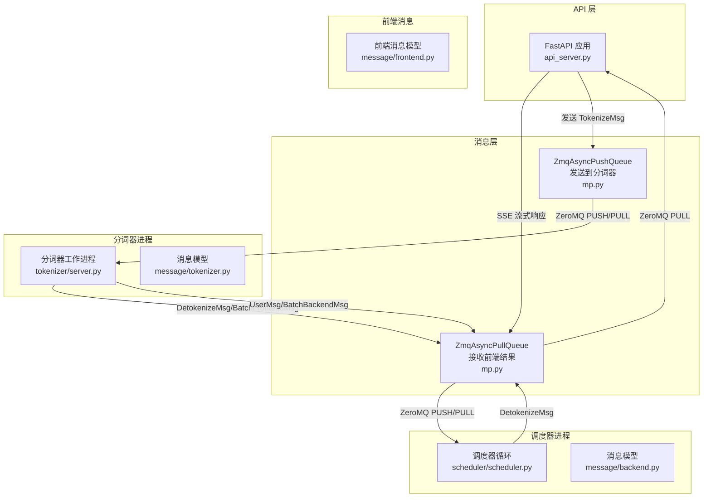
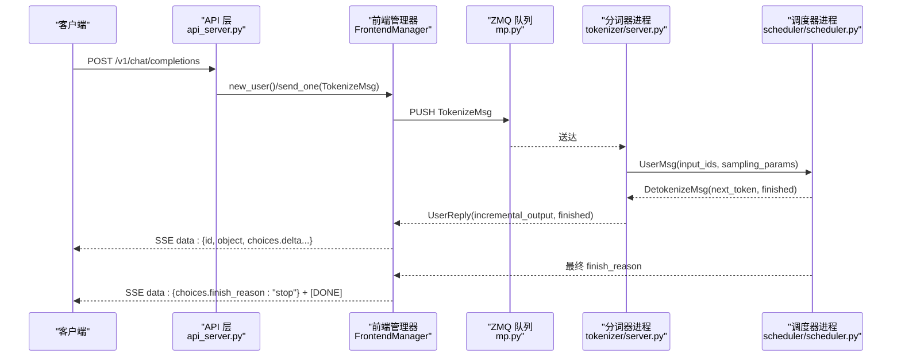
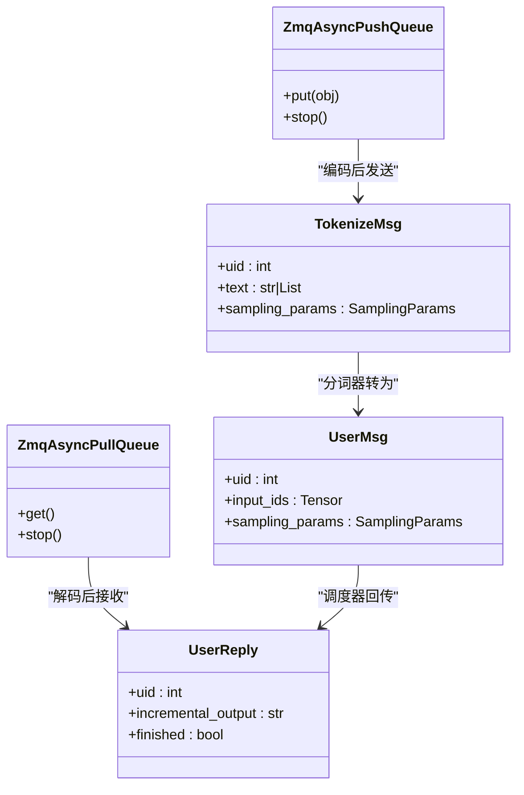
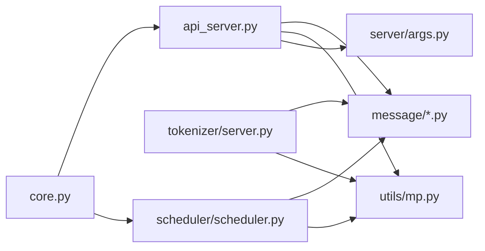

# HTTP API

<cite>
**本文引用的文件列表**
- [api_server.py](file://python/minisgl/server/api_server.py)
- [args.py](file://python/minisgl/server/args.py)
- [launch.py](file://python/minisgl/server/launch.py)
- [server.py](file://python/minisgl/tokenizer/server.py)
- [scheduler.py](file://python/minisgl/scheduler/scheduler.py)
- [frontend.py](file://python/minisgl/message/frontend.py)
- [backend.py](file://python/minisgl/message/backend.py)
- [tokenizer.py](file://python/minisgl/message/tokenizer.py)
- [utils.py](file://python/minisgl/message/utils.py)
- [mp.py](file://python/minisgl/utils/mp.py)
- [core.py](file://python/minisgl/core.py)
</cite>

## 目录
1. [简介](#简介)
2. [项目结构](#项目结构)
3. [核心组件](#核心组件)
4. [架构总览](#架构总览)
5. [详细组件分析](#详细组件分析)
6. [依赖关系分析](#依赖关系分析)
7. [性能考量](#性能考量)
8. [故障排查指南](#故障排查指南)
9. [结论](#结论)
10. [附录：接口规范与示例](#附录接口规范与示例)

## 简介
本文件为 mini-sglang 的 HTTP API 文档，聚焦于由 api_server.py 实现的 /v1/chat/completions 端点。内容涵盖：
- 请求方法与 URL 路径
- 请求头与认证方式
- 请求体 JSON 结构（参数定义、类型、默认值与约束）
- 响应格式（SSE 流式与非流式）
- 可能的 HTTP 状态码与错误信息格式
- 使用 curl 与 Python requests 库的同步与异步流式请求示例
- API 与内部 Scheduler、Tokenizer 进程通过 ZeroMQ 的交互流程

## 项目结构
围绕 /v1/chat/completions 的关键文件组织如下：
- 服务入口与路由：python/minisgl/server/api_server.py
- 启动与子进程编排：python/minisgl/server/launch.py
- 服务器参数与 ZeroMQ 地址：python/minisgl/server/args.py
- 分词器进程：python/minisgl/tokenizer/server.py
- 调度器（推理引擎）：python/minisgl/scheduler/scheduler.py
- 消息模型（前后端、分词器）：python/minisgl/message/*.py
- ZeroMQ 异步队列封装：python/minisgl/utils/mp.py
- 采样参数与核心数据结构：python/minisgl/core.py

图表来源
- [api_server.py](file://python/minisgl/server/api_server.py#L210-L273)
- [server.py](file://python/minisgl/tokenizer/server.py#L41-L99)
- [scheduler.py](file://python/minisgl/scheduler/scheduler.py#L155-L179)
- [mp.py](file://python/minisgl/utils/mp.py#L12-L103)
- [tokenizer.py](file://python/minisgl/message/tokenizer.py#L27-L44)
- [backend.py](file://python/minisgl/message/backend.py#L22-L37)
- [frontend.py](file://python/minisgl/message/frontend.py#L20-L30)

章节来源
- [api_server.py](file://python/minisgl/server/api_server.py#L210-L273)
- [launch.py](file://python/minisgl/server/launch.py#L40-L110)
- [args.py](file://python/minisgl/server/args.py#L14-L52)

## 核心组件
- FastAPI 应用与路由：提供 /v1/chat/completions POST 接口，返回 text/event-stream。
- FrontendManager：负责生成用户 UID、与分词器进程通信、监听并聚合增量输出、构造 SSE 数据帧。
- 分词器进程：接收 TokenizeMsg，执行分词；将解码结果以 DetokenizeMsg 或 UserMsg 形式回传。
- 调度器：接收 UserMsg，执行预填充/解码调度，按轮次生成 next_token 并回传 DetokenizeMsg。
- ZeroMQ 队列：异步 PUSH/PULL，序列化/反序列化消息，支持多进程间通信。

章节来源
- [api_server.py](file://python/minisgl/server/api_server.py#L98-L200)
- [server.py](file://python/minisgl/tokenizer/server.py#L41-L99)
- [scheduler.py](file://python/minisgl/scheduler/scheduler.py#L155-L179)
- [mp.py](file://python/minisgl/utils/mp.py#L12-L103)

## 架构总览
/v1/chat/completions 的调用链路如下：
1. 客户端向 /v1/chat/completions 发送 POST 请求。
2. API 层解析请求体，构造 TokenizeMsg 并通过 ZmqAsyncPushQueue 发送到分词器进程。
3. 分词器进程将文本转换为输入张量，发送 UserMsg 到调度器。
4. 调度器执行推理，周期性地将 next_token 封装为 DetokenizeMsg 回传给前端。
5. 前端管理器收到增量输出，通过 SSE 流式返回给客户端，直至 finish_reason。

图表来源
- [api_server.py](file://python/minisgl/server/api_server.py#L244-L273)
- [server.py](file://python/minisgl/tokenizer/server.py#L84-L99)
- [scheduler.py](file://python/minisgl/scheduler/scheduler.py#L110-L154)
- [mp.py](file://python/minisgl/utils/mp.py#L12-L103)

## 详细组件分析

### /v1/chat/completions 端点
- 方法与路径：POST /v1/chat/completions
- 认证：未在代码中显式校验 Authorization 头，建议在生产环境自行添加鉴权中间件或网关。
- Content-Type：application/json
- 请求体 JSON 字段
  - model: 字符串，必填
  - prompt: 字符串或 null，与 messages 二选一
  - messages: 消息数组，元素包含 role 与 content，与 prompt 二选一
  - max_tokens: 整数，默认 16，最大不超过模型最大序列长度限制
  - temperature: 浮点数，默认 1.0
  - top_p: 浮点数，默认 1.0
  - n: 整数，默认 1
  - stream: 布尔，默认 false
  - stop: 字符串数组，默认空
  - presence_penalty: 浮点数，默认 0.0
  - frequency_penalty: 浮点数，默认 0.0
  - ignore_eos: 布尔，默认 false
- 响应
  - 非流式：返回 OpenAI 风格的完整响应对象（当前实现为流式）
  - 流式：text/event-stream，逐块返回 choices.delta，首块包含 role，最终返回 finish_reason 与 [DONE]

章节来源
- [api_server.py](file://python/minisgl/server/api_server.py#L64-L83)
- [api_server.py](file://python/minisgl/server/api_server.py#L244-L273)
- [api_server.py](file://python/minisgl/server/api_server.py#L158-L186)

### 请求体 JSON 结构详解
- 字段与默认值
  - model: 必填字符串
  - prompt: 字符串或 null
  - messages: 数组，每项包含 role 与 content
  - max_tokens: 默认 16
  - temperature: 默认 1.0
  - top_p: 默认 1.0
  - n: 默认 1
  - stream: 默认 false
  - stop: 默认 []
  - presence_penalty: 默认 0.0
  - frequency_penalty: 默认 0.0
  - ignore_eos: 默认 false
- 约束
  - 必须提供 messages 或 prompt 其一
  - temperature、top_p、presence_penalty、frequency_penalty 当前未在调度器中使用（TODO 注释）

章节来源
- [api_server.py](file://python/minisgl/server/api_server.py#L64-L83)
- [api_server.py](file://python/minisgl/server/api_server.py#L244-L251)

### 响应格式（SSE）
- 媒体类型：text/event-stream
- 数据帧
  - 首帧：包含 choices.delta，其中首块包含 role="assistant"
  - 中间帧：仅包含增量 content
  - 终止帧：choices.finish_reason="stop"，随后 [DONE]
- 字段说明
  - id: 字符串，形如 cmpl-<uid>
  - object: 字符串，固定为 text_completion.chunk
  - choices: 数组，包含 delta 对象
    - delta: 包含 role 与 content
    - index: 整数，固定 0
    - finish_reason: 字符串，最终为 stop

章节来源
- [api_server.py](file://python/minisgl/server/api_server.py#L158-L186)

### 错误与状态码
- 当前实现未显式抛出 HTTP 异常，FastAPI 默认行为会返回 200 OK（流式）或 500 内部错误（异常）
- 建议在生产环境增加：
  - 参数校验失败时返回 400
  - 认证失败时返回 401
  - 限流/过载时返回 429
  - 未知异常返回 500
- 错误信息格式建议采用统一的 JSON 结构：{ error: { message, type, code } }

章节来源
- [api_server.py](file://python/minisgl/server/api_server.py#L244-L273)

### ZeroMQ 与消息传递
- API 层通过 ZmqAsyncPushQueue 发送 TokenizeMsg 至分词器
- 分词器进程将 DetokenizeMsg/BatchFrontendMsg 通过 ZmqPushQueue 回传至前端
- 调度器通过 ZmqPullQueue 接收 UserMsg，再通过 ZmqPushQueue 发送 DetokenizeMsg
- 消息序列化/反序列化通过 message/utils.py 的 serialize_type/deserialize_type

图表来源
- [mp.py](file://python/minisgl/utils/mp.py#L12-L103)
- [tokenizer.py](file://python/minisgl/message/tokenizer.py#L27-L44)
- [backend.py](file://python/minisgl/message/backend.py#L32-L37)
- [frontend.py](file://python/minisgl/message/frontend.py#L26-L30)
- [utils.py](file://python/minisgl/message/utils.py#L20-L70)

章节来源
- [mp.py](file://python/minisgl/utils/mp.py#L12-L103)
- [utils.py](file://python/minisgl/message/utils.py#L20-L70)
- [tokenizer.py](file://python/minisgl/message/tokenizer.py#L27-L44)
- [backend.py](file://python/minisgl/message/backend.py#L22-L37)
- [frontend.py](file://python/minisgl/message/frontend.py#L20-L30)

### API 与内部组件交互流程
- 启动流程：launch_server 创建多个调度器进程与分词器进程，绑定 ZeroMQ 地址，然后启动 API 服务器
- 地址配置：args.py 提供 zmq_frontend_addr、zmq_tokenizer_addr 等地址属性
- 运行时：API 层初始化 FrontendManager，建立与分词器的连接，开始监听并返回 SSE

章节来源
- [launch.py](file://python/minisgl/server/launch.py#L40-L110)
- [args.py](file://python/minisgl/server/args.py#L25-L52)
- [api_server.py](file://python/minisgl/server/api_server.py#L384-L426)

## 依赖关系分析
- API 层依赖消息模型与 ZeroMQ 封装
- 分词器进程依赖消息模型与分词/解码管理器
- 调度器依赖消息模型、Engine 与缓存/表管理器
- 采样参数与核心数据结构由 core.py 提供

图表来源
- [api_server.py](file://python/minisgl/server/api_server.py#L14-L30)
- [server.py](file://python/minisgl/tokenizer/server.py#L1-L27)
- [scheduler.py](file://python/minisgl/scheduler/scheduler.py#L1-L26)
- [core.py](file://python/minisgl/core.py#L14-L21)

章节来源
- [api_server.py](file://python/minisgl/server/api_server.py#L14-L30)
- [server.py](file://python/minisgl/tokenizer/server.py#L1-L27)
- [scheduler.py](file://python/minisgl/scheduler/scheduler.py#L1-L26)
- [core.py](file://python/minisgl/core.py#L14-L21)

## 性能考量
- 流式传输：SSE 逐块推送，降低首 token 延迟感知
- 调度重叠：调度器支持重叠调度与执行，隐藏 CPU Latency，提升 GPU 利用率
- 批处理：分词器与调度器均支持批量消息处理
- 限长保护：当输入长度超过模型最大序列长度时，调度器会丢弃请求并记录警告

章节来源
- [scheduler.py](file://python/minisgl/scheduler/scheduler.py#L226-L280)
- [scheduler.py](file://python/minisgl/scheduler/scheduler.py#L160-L179)

## 故障排查指南
- 无法连接分词器/调度器
  - 检查 ZeroMQ 地址是否正确（args.py 中的地址属性）
  - 确认子进程已启动并打印“ready”确认
- 流式响应不完整
  - 确认客户端正确处理 SSE 数据帧，注意 [DONE] 终止标记
  - 检查 ignore_eos 与 max_tokens 设置是否导致提前结束
- 输入过长
  - 调度器会在输入长度超过最大序列长度时丢弃请求并记录警告
- 资源清理
  - API 关闭时会停止 ZMQ 队列，确保子进程退出

章节来源
- [args.py](file://python/minisgl/server/args.py#L25-L52)
- [launch.py](file://python/minisgl/server/launch.py#L40-L110)
- [api_server.py](file://python/minisgl/server/api_server.py#L196-L200)
- [scheduler.py](file://python/minisgl/scheduler/scheduler.py#L120-L134)

## 结论
/v1/chat/completions 提供了 OpenAI 风格的流式对话补全能力，基于 FastAPI + ZeroMQ 的微服务架构实现高吞吐与低延迟。当前实现以流式为主，参数校验与错误码可按需增强。通过分词器与调度器的协作，系统能够稳定地处理多并发请求并提供渐进式输出。

## 附录：接口规范与示例

### 接口定义
- 方法：POST
- 路径：/v1/chat/completions
- 请求头：
  - Content-Type: application/json
  - Authorization: 可选（建议自定义中间件）
- 请求体 JSON 字段
  - model: 字符串，必填
  - prompt: 字符串或 null，与 messages 二选一
  - messages: 数组，元素包含 role 与 content
  - max_tokens: 整数，默认 16
  - temperature: 浮点数，默认 1.0
  - top_p: 浮点数，默认 1.0
  - n: 整数，默认 1
  - stream: 布尔，默认 false
  - stop: 字符串数组，默认 []
  - presence_penalty: 浮点数，默认 0.0
  - frequency_penalty: 浮点数，默认 0.0
  - ignore_eos: 布尔，默认 false
- 响应
  - 非流式：返回完整响应对象（当前实现为流式）
  - 流式：text/event-stream，逐块返回 choices.delta，最终 finish_reason 与 [DONE]

章节来源
- [api_server.py](file://python/minisgl/server/api_server.py#L64-L83)
- [api_server.py](file://python/minisgl/server/api_server.py#L244-L273)
- [api_server.py](file://python/minisgl/server/api_server.py#L158-L186)

### 使用 curl 的示例
- 同步（非流式）：由于当前实现为流式，建议使用 stream=true 获取 SSE
- 异步（流式）：使用 --no-buffer 与 tail -f 观察实时输出
  - curl -N -H "Content-Type: application/json" -d '{"model":"default","messages":[{"role":"user","content":"你好"}],"stream":true}' http://127.0.0.1:1919/v1/chat/completions

章节来源
- [api_server.py](file://python/minisgl/server/api_server.py#L244-L273)

### 使用 Python requests 的示例
- 同步（非流式）：requests.post(..., json=..., stream=False)，但当前实现为流式
- 异步（流式）：使用 httpx.AsyncClient 或 aiohttp，逐块读取 SSE 数据帧
  - 注意处理 data: 前缀与 [DONE] 终止标记

章节来源
- [api_server.py](file://python/minisgl/server/api_server.py#L244-L273)

### 处理 SSE（Server-Sent Events）
- 客户端需逐行读取，识别 data: 前缀
- 解析 JSON 块，提取 choices.delta.content
- 收到 finish_reason 与 [DONE] 后结束

章节来源
- [api_server.py](file://python/minisgl/server/api_server.py#L158-L186)