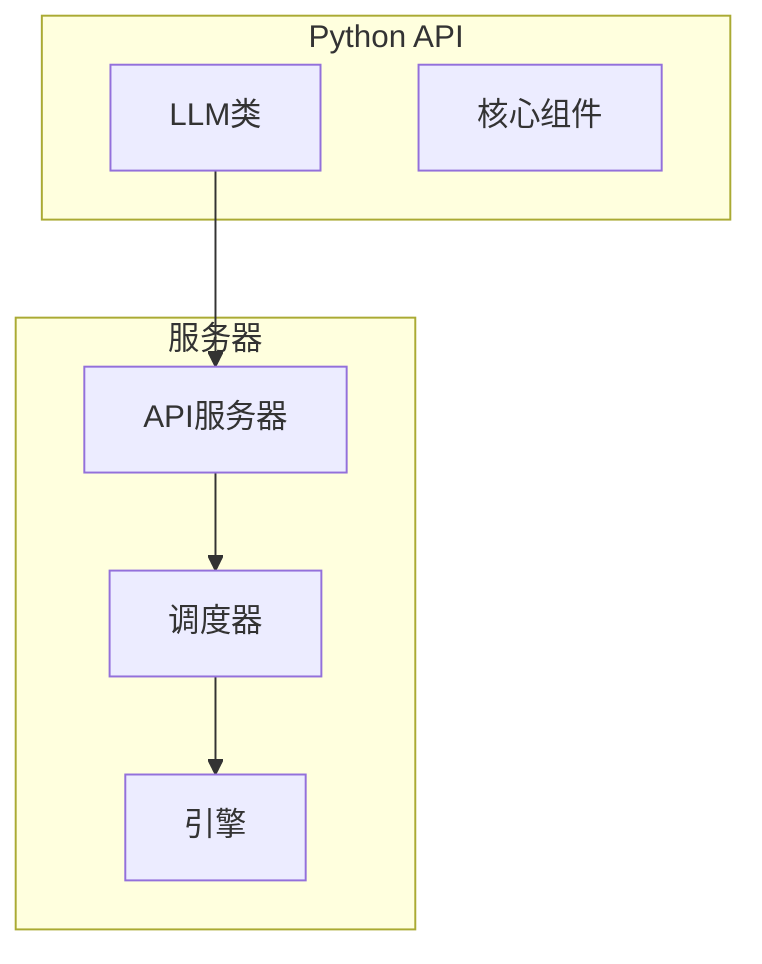
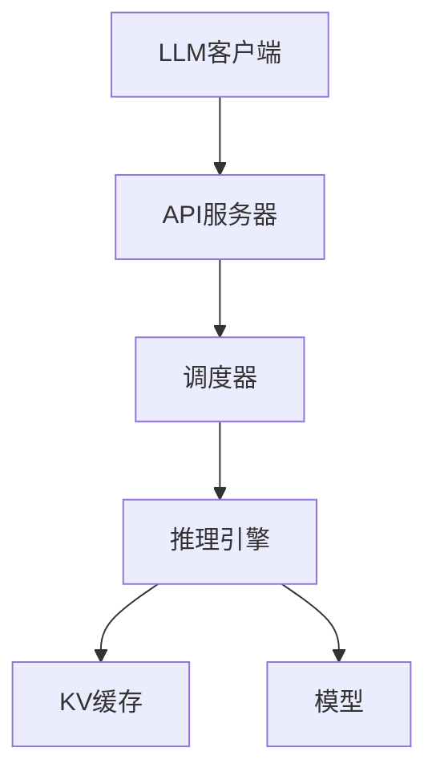
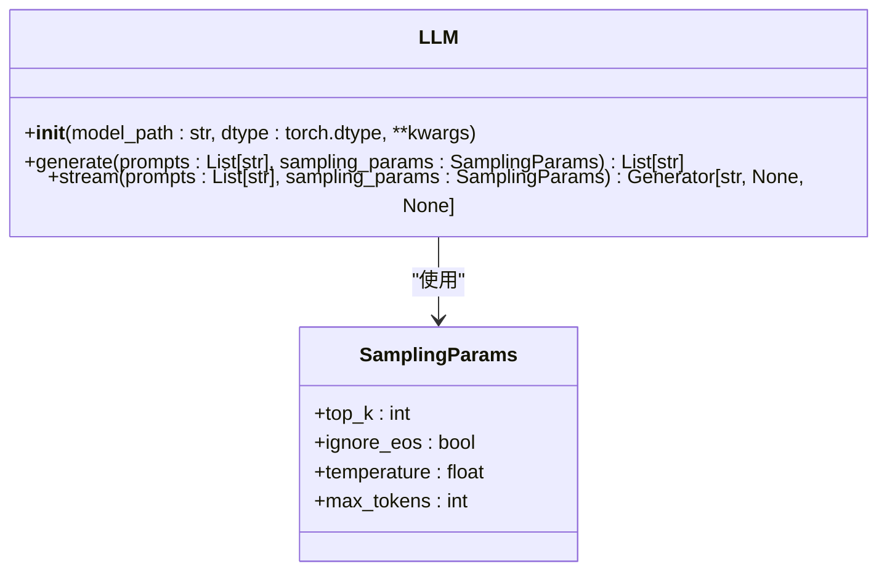
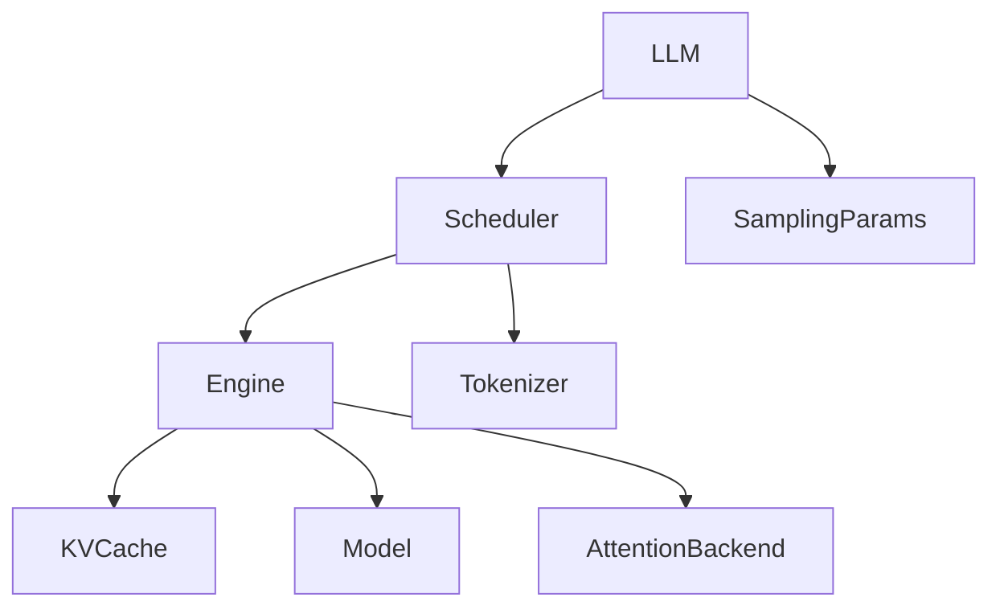

# Python API

<cite>
**本文档中引用的文件**   
- [llm.py](file://python/minisgl/llm/llm.py)
- [core.py](file://python/minisgl/core.py)
- [scheduler.py](file://python/minisgl/scheduler/scheduler.py)
- [engine.py](file://python/minisgl/engine/engine.py)
- [api_server.py](file://python/minisgl/server/api_server.py)
- [launch.py](file://python/minisgl/server/launch.py)
- [config.py](file://python/minisgl/scheduler/config.py)
- [test_scheduler.py](file://tests/core/test_scheduler.py)
</cite>

## 目录
1. [简介](#简介)
2. [项目结构](#项目结构)
3. [核心组件](#核心组件)
4. [架构概述](#架构概述)
5. [详细组件分析](#详细组件分析)
6. [依赖分析](#依赖分析)
7. [性能考虑](#性能考虑)
8. [故障排除指南](#故障排除指南)
9. [结论](#结论)

## 简介
本文档详细介绍了mini-sglang项目中的Python API，重点是`LLM`类的使用。该API提供了一个高级接口，用于与本地运行的推理引擎进行交互，支持文本生成、流式输出等功能。文档涵盖了`LLM`类的构造函数参数、`generate`和`stream`方法的使用，以及与API服务器的交互方式。

## 项目结构
项目结构遵循模块化设计，主要组件包括：
- `python/minisgl/llm/llm.py`: 包含`LLM`类的实现
- `python/minisgl/server/api_server.py`: API服务器实现
- `python/minisgl/scheduler/scheduler.py`: 调度器实现
- `python/minisgl/engine/engine.py`: 引擎实现

**图源**
- [llm.py](file://python/minisgl/llm/llm.py)
- [api_server.py](file://python/minisgl/server/api_server.py)

**节源**
- [llm.py](file://python/minisgl/llm/llm.py)
- [api_server.py](file://python/minisgl/server/api_server.py)

## 核心组件
`LLM`类是Python API的核心，提供了与推理引擎交互的主要接口。它封装了底层的调度器和引擎，提供了简洁的API用于文本生成。

**节源**
- [llm.py](file://python/minisgl/llm/llm.py)

## 架构概述
系统架构采用客户端-服务器模式，`LLM`类作为客户端与本地运行的API服务器通信。API服务器管理调度器和引擎，处理请求并返回结果。

**图源**
- [llm.py](file://python/minisgl/llm/llm.py)
- [api_server.py](file://python/minisgl/server/api_server.py)
- [scheduler.py](file://python/minisgl/scheduler/scheduler.py)
- [engine.py](file://python/minisgl/engine/engine.py)

## 详细组件分析

### LLM类分析
`LLM`类是Python API的主要入口点，提供了文本生成功能。

#### 构造函数参数
`LLM`类的构造函数接受以下参数：
- `model_path`: 模型路径，字符串类型
- `dtype`: 数据类型，默认为`torch.bfloat16`
- `tp_size`: 张量并行大小
- `attention_backend`: 注意力后端
- `enable_radix_cache`: 是否启用radix缓存

**图源**
- [llm.py](file://python/minisgl/llm/llm.py)
- [core.py](file://python/minisgl/core.py)

#### generate方法
`generate`方法用于生成文本，接受提示列表和采样参数，返回生成的文本列表。

**节源**
- [llm.py](file://python/minisgl/llm/llm.py#L78-L99)

#### stream方法
`stream`方法用于流式生成文本，返回一个生成器对象，可以逐个获取生成的文本片段。

**节源**
- [llm.py](file://python/minisgl/llm/llm.py#L78-L99)

## 依赖分析
系统各组件之间的依赖关系如下：

**图源**
- [llm.py](file://python/minisgl/llm/llm.py)
- [scheduler.py](file://python/minisgl/scheduler/scheduler.py)
- [engine.py](file://python/minisgl/engine/engine.py)
- [core.py](file://python/minisgl/core.py)

**节源**
- [llm.py](file://python/minisgl/llm/llm.py)
- [scheduler.py](file://python/minisgl/scheduler/scheduler.py)
- [engine.py](file://python/minisgl/engine/engine.py)

## 性能考虑
- 使用`enable_radix_cache`可以提高缓存效率
- 选择合适的`attention_backend`可以优化注意力计算性能
- 批量处理多个请求可以提高吞吐量

## 故障排除指南
- 如果遇到内存不足错误，尝试减少`max_tokens`或使用更小的模型
- 如果生成速度慢，检查`attention_backend`设置是否正确
- 如果出现连接错误，确保API服务器正在运行

**节源**
- [api_server.py](file://python/minisgl/server/api_server.py)
- [launch.py](file://python/minisgl/server/launch.py)

## 结论
`LLM`类提供了一个强大而灵活的Python API，用于与mini-sglang推理引擎交互。通过合理配置参数和使用流式生成，可以实现高效的文本生成应用。