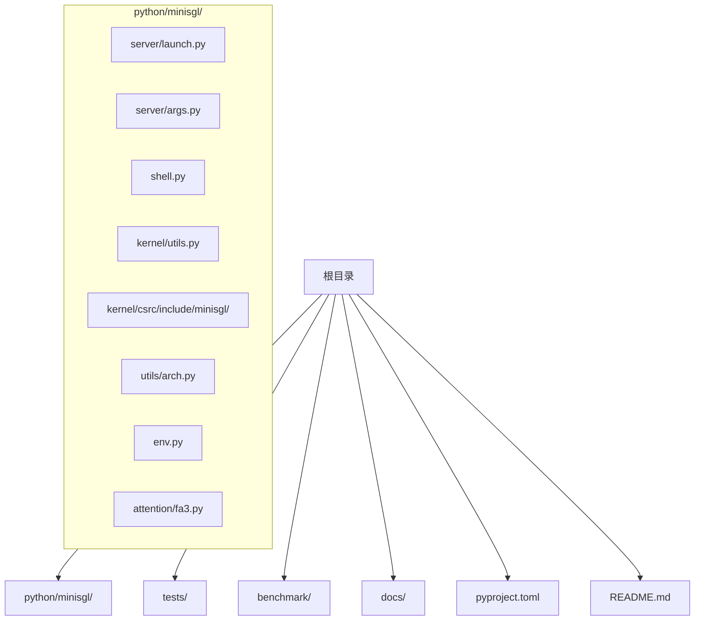
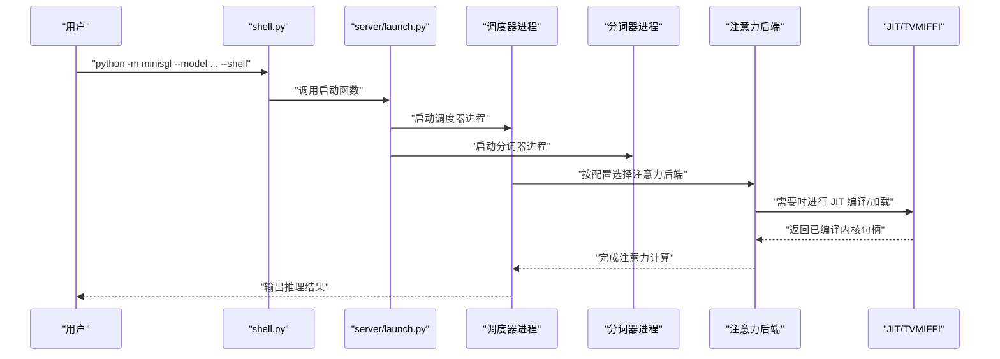
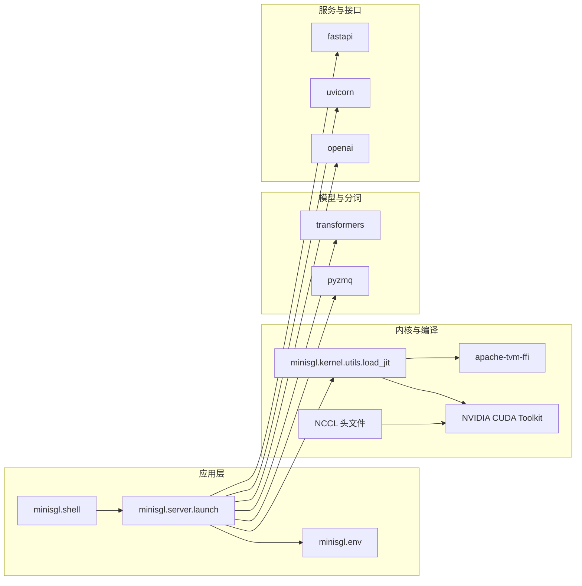

# 安装与环境配置

<cite>
**本文引用的文件列表**
- [pyproject.toml](file://pyproject.toml)
- [README.md](file://README.md)
- [features.md](file://docs/features.md)
- [launch.py](file://python/minisgl/server/launch.py)
- [shell.py](file://python/minisgl/shell.py)
- [env.py](file://python/minisgl/env.py)
- [utils.py](file://python/minisgl/kernel/utils.py)
- [arch.py](file://python/minisgl/utils/arch.py)
- [fa3.py](file://python/minisgl/attention/fa3.py)
- [nccl227.h](file://python/minisgl/kernel/csrc/include/minisgl/nccl227.h)
- [utils.cuh](file://python/minisgl/kernel/csrc/include/minisgl/utils.cuh)
- [test_scheduler.py](file://tests/core/test_scheduler.py)
</cite>

## 目录
1. [简介](#简介)
2. [项目结构](#项目结构)
3. [核心组件](#核心组件)
4. [架构总览](#架构总览)
5. [详细组件分析](#详细组件分析)
6. [依赖关系分析](#依赖关系分析)
7. [性能考虑](#性能考虑)
8. [故障排查指南](#故障排查指南)
9. [结论](#结论)
10. [附录](#附录)

## 简介
本指南面向首次搭建 mini-sglang 运行环境的用户，提供从零开始的安装流程与环境配置建议。内容涵盖：
- 使用 uv 或 pip 的安装步骤
- Python 版本要求（3.10 及以上）
- CUDA 工具链安装与版本匹配说明
- 基于 pyproject.toml 列出的必要依赖及其作用
- 常见安装问题排查（CUDA 不可用、JIT 编译失败等）
- 虚拟环境创建、源码安装命令（pip install -e .）与验证安装成功的方法

## 项目结构
mini-sglang 采用“源码在 python/ 下”的包组织方式，构建系统通过 setuptools 配置，核心模块位于 python/minisgl/。服务器启动入口位于 python/minisgl/server/launch.py，交互式终端入口为 python/minisgl/shell.py。内核与 CUDA/JIT 相关代码位于 python/minisgl/kernel/，并包含 CUDA 头文件与 TVM/FFI 集成。

图表来源
- [launch.py](file://python/minisgl/server/launch.py#L1-L114)
- [shell.py](file://python/minisgl/shell.py#L1-L5)
- [utils.py](file://python/minisgl/kernel/utils.py#L87-L129)
- [arch.py](file://python/minisgl/utils/arch.py#L1-L29)
- [fa3.py](file://python/minisgl/attention/fa3.py#L160-L170)
- [nccl227.h](file://python/minisgl/kernel/csrc/include/minisgl/nccl227.h#L1-L39)
- [utils.cuh](file://python/minisgl/kernel/csrc/include/minisgl/utils.cuh#L103-L144)

章节来源
- [pyproject.toml](file://pyproject.toml#L51-L60)
- [README.md](file://README.md#L27-L48)

## 核心组件
- 服务器启动与分布式调度：通过 python/minisgl/server/launch.py 启动多进程调度器与分词器子进程，并对外提供 API 服务。
- 交互式终端：python/minisgl/shell.py 提供本地交互模式，便于快速验证模型推理。
- 内核与 JIT 编译：python/minisgl/kernel/utils.py 中封装了基于 TVM/FFI 的 JIT 动态加载与编译流程，用于 CUDA/C++ 内核。
- 环境变量与配置：python/minisgl/env.py 提供 MINISGL_ 前缀的环境变量解析与默认值管理。
- 架构检测：python/minisgl/utils/arch.py 检测当前设备 CUDA 架构能力，辅助判断硬件支持情况。
- 注意力后端：python/minisgl/attention/fa3.py 对 FlashAttention3 的依赖提示，帮助定位缺失依赖时的问题。

章节来源
- [launch.py](file://python/minisgl/server/launch.py#L1-L114)
- [shell.py](file://python/minisgl/shell.py#L1-L5)
- [utils.py](file://python/minisgl/kernel/utils.py#L87-L129)
- [env.py](file://python/minisgl/env.py#L50-L82)
- [arch.py](file://python/minisgl/utils/arch.py#L1-L29)
- [fa3.py](file://python/minisgl/attention/fa3.py#L160-L170)

## 架构总览
下图展示了从用户命令到推理执行的关键路径，包括服务器启动、多进程调度、注意力后端选择与 JIT 编译流程。

图表来源
- [shell.py](file://python/minisgl/shell.py#L1-L5)
- [launch.py](file://python/minisgl/server/launch.py#L40-L114)
- [utils.py](file://python/minisgl/kernel/utils.py#L87-L129)
- [fa3.py](file://python/minisgl/attention/fa3.py#L160-L170)

## 详细组件分析

### 安装与环境准备
- Python 版本要求：项目明确要求 Python >= 3.10。
- 推荐工具：README 提示使用 uv 创建虚拟环境并安装，以获得更快更可靠的安装体验。
- CUDA 工具链：项目依赖 CUDA 内核并通过 JIT 编译生成，需确保已安装 NVIDIA CUDA Toolkit，并与驱动版本匹配；可通过 nvidia-smi 查看驱动 CUDA 能力。

章节来源
- [pyproject.toml](file://pyproject.toml#L10-L10)
- [README.md](file://README.md#L27-L48)

### 依赖清单与作用说明
以下依赖来自 pyproject.toml 的 dependencies 字段，按字母顺序整理并说明其在 mini-sglang 中的作用：

- accelerate：加速训练/推理中的张量操作与设备管理。
- msgpack：高性能消息序列化，用于进程间通信。
- sgl_kernel>=0.3.17.post1：提供高性能注意力内核与编译工具，是 JIT 编译与内核加载的基础。
- torch：PyTorch 深度学习框架，提供张量运算、自动微分与 CUDA 支持。
- transformers<=4.57.3：Hugging Face Transformers 库，用于加载与处理预训练模型权重与分词器。
- flashinfer-python>=0.5.3：FlashInfer Python 绑定，提供高效的注意力计算内核。
- pyzmq：ZeroMQ 绑定，用于多进程之间的消息传递（如分词器与后端通信）。
- uvicorn：ASGI 服务器，配合 FastAPI 提供 OpenAI 兼容 API。
- fastapi：Web 框架，定义 API 接口与路由。
- prompt_toolkit：交互式终端界面，支持命令行输入与历史记录。
- openai：OpenAI 兼容客户端库，便于使用标准 OpenAI SDK 进行请求。
- apache-tvm-ffi>=0.1.4：TVM FFI，用于 JIT 编译与动态加载 CUDA/C++ 内核。

章节来源
- [pyproject.toml](file://pyproject.toml#L24-L37)

### 安装步骤（uv）
- 创建虚拟环境（推荐 Python 3.10+，可指定版本如 3.12）
- 激活虚拟环境
- 从源码安装（开发模式）

章节来源
- [README.md](file://README.md#L27-L48)

### 安装步骤（pip）
- 创建并激活虚拟环境（Python 3.10+）
- 在项目根目录执行源码安装（开发模式）

章节来源
- [README.md](file://README.md#L41-L48)

### 源码安装命令
- 开发模式安装：pip install -e .

章节来源
- [README.md](file://README.md#L41-L48)

### 验证安装成功
- 启动在线服务：使用 OpenAI 兼容 API 服务进行基本请求验证
- 启动交互式终端：通过 --shell 参数进入交互模式，发送简单提示进行测试
- 运行单元测试：使用 pytest 执行测试套件，验证核心功能

章节来源
- [features.md](file://docs/features.md#L1-L16)
- [test_scheduler.py](file://tests/core/test_scheduler.py#L1-L74)

## 依赖关系分析
下图展示 mini-sglang 关键模块与其外部依赖的关系，突出 JIT 编译、注意力后端与 CUDA 工具链的耦合点。

图表来源
- [launch.py](file://python/minisgl/server/launch.py#L1-L114)
- [shell.py](file://python/minisgl/shell.py#L1-L5)
- [utils.py](file://python/minisgl/kernel/utils.py#L87-L129)
- [nccl227.h](file://python/minisgl/kernel/csrc/include/minisgl/nccl227.h#L1-L39)
- [pyproject.toml](file://pyproject.toml#L24-L37)

章节来源
- [pyproject.toml](file://pyproject.toml#L24-L37)
- [launch.py](file://python/minisgl/server/launch.py#L1-L114)
- [utils.py](file://python/minisgl/kernel/utils.py#L87-L129)

## 性能考虑
- 注意力后端选择：默认使用高性能注意力内核（如 FlashAttention3/FlashInfer），可通过命令行参数切换前后阶段后端，以适配不同 GPU 架构。
- CUDA 图：默认启用 CUDA Graph 以减少解码阶段 CPU 启动开销，可通过参数调整最大批大小。
- 分布式并行：通过 Tensor Parallelism 将推理扩展到多 GPU，提升吞吐。
- Radix Cache：复用共享前缀的 KV 缓存，降低重复计算。

章节来源
- [features.md](file://docs/features.md#L28-L55)

## 故障排查指南

### 1. CUDA 不可用或驱动不匹配
- 现象：torch.cuda.is_available() 返回 False，或运行时报 CUDA 相关错误。
- 排查要点：
  - 检查驱动与 CUDA Toolkit 是否匹配（nvidia-smi 查看驱动 CUDA 能力）
  - 确认安装的 PyTorch 与 CUDA 版本兼容
  - 使用架构检测工具确认设备能力是否满足要求
- 相关实现参考：
  - 架构检测：python/minisgl/utils/arch.py
  - 设备能力检查：python/minisgl/utils/arch.py

章节来源
- [arch.py](file://python/minisgl/utils/arch.py#L1-L29)

### 2. JIT 编译失败或找不到内核
- 现象：注意力后端或内核加载时报错，提示缺少 sgl_kernel 或无法找到特定内核。
- 排查要点：
  - 确保已安装 sgl_kernel 与 apache-tvm-ffi
  - 确认 NVIDIA CUDA Toolkit 已正确安装且版本匹配
  - 检查 JIT 加载路径与头文件包含路径
- 相关实现参考：
  - 注意力后端依赖提示：python/minisgl/attention/fa3.py
  - JIT 加载逻辑：python/minisgl/kernel/utils.py
  - NCCL 头文件：python/minisgl/kernel/csrc/include/minisgl/nccl227.h
  - CUDA 运行时头文件：python/minisgl/kernel/csrc/include/minisgl/utils.cuh

章节来源
- [fa3.py](file://python/minisgl/attention/fa3.py#L160-L170)
- [utils.py](file://python/minisgl/kernel/utils.py#L87-L129)
- [nccl227.h](file://python/minisgl/kernel/csrc/include/minisgl/nccl227.h#L1-L39)
- [utils.cuh](file://python/minisgl/kernel/csrc/include/minisgl/utils.cuh#L103-L144)

### 3. 依赖版本冲突
- 现象：安装过程中出现版本冲突或不兼容。
- 排查要点：
  - 严格遵循 pyproject.toml 中的依赖范围（如 transformers<=4.57.3）
  - 使用 uv 或 pip-tools 管理依赖，避免手动混装导致冲突
- 相关实现参考：
  - 依赖声明：pyproject.toml

章节来源
- [pyproject.toml](file://pyproject.toml#L24-L37)

### 4. 无法启动在线服务或交互式终端
- 现象：启动后无响应或报错。
- 排查要点：
  - 检查端口占用与网络权限
  - 确认 pyzmq、fastapi、uvicorn、openai 等服务依赖已安装
  - 使用最小化命令（单卡、小模型）先验证
- 相关实现参考：
  - 服务启动入口：python/minisgl/server/launch.py
  - 交互式入口：python/minisgl/shell.py

章节来源
- [launch.py](file://python/minisgl/server/launch.py#L1-L114)
- [shell.py](file://python/minisgl/shell.py#L1-L5)

### 5. 验证安装成功
- 在线服务验证：使用 OpenAI 兼容客户端向 /v1/chat/completions 发送请求
- 交互式终端验证：python -m minisgl --model "<模型名>" --shell，输入简单提示
- 单元测试验证：pytest tests/，观察核心调度器与内核测试是否通过

章节来源
- [features.md](file://docs/features.md#L1-L16)
- [test_scheduler.py](file://tests/core/test_scheduler.py#L1-L74)

## 结论
按照本指南完成 Python 环境、CUDA 工具链与依赖安装后，即可使用 uv 或 pip 完成源码安装，并通过在线服务或交互式终端验证安装效果。若遇到 CUDA 不可用或 JIT 编译失败等问题，请依据故障排查章节逐项检查，确保驱动与工具链版本匹配、依赖安装完整且版本符合要求。

## 附录

### A. 快速安装清单
- Python 3.10+（推荐 3.12）
- NVIDIA CUDA Toolkit（与驱动版本匹配）
- uv（可选，但推荐）
- 依赖：参见“依赖清单与作用说明”

章节来源
- [pyproject.toml](file://pyproject.toml#L10-L10)
- [README.md](file://README.md#L27-L48)

### B. 常用命令索引
- 创建虚拟环境并激活（uv）
- 源码安装（开发模式）
- 启动在线服务
- 启动交互式终端
- 运行测试

章节来源
- [README.md](file://README.md#L27-L48)
- [features.md](file://docs/features.md#L1-L16)
- [test_scheduler.py](file://tests/core/test_scheduler.py#L1-L74)