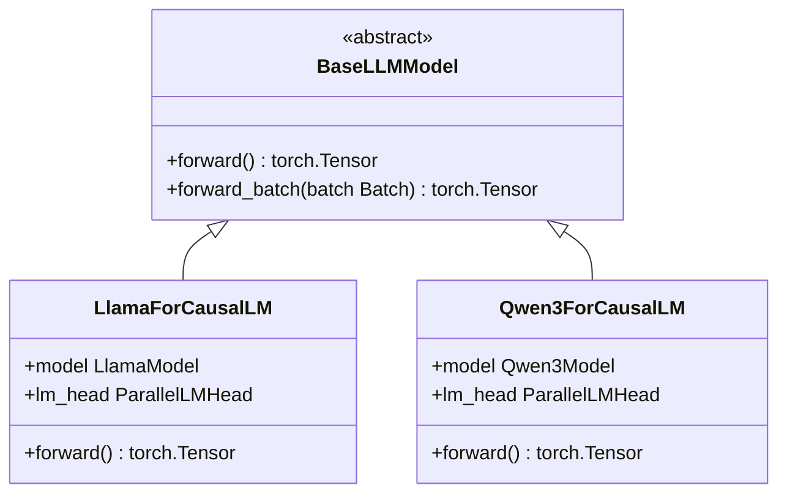
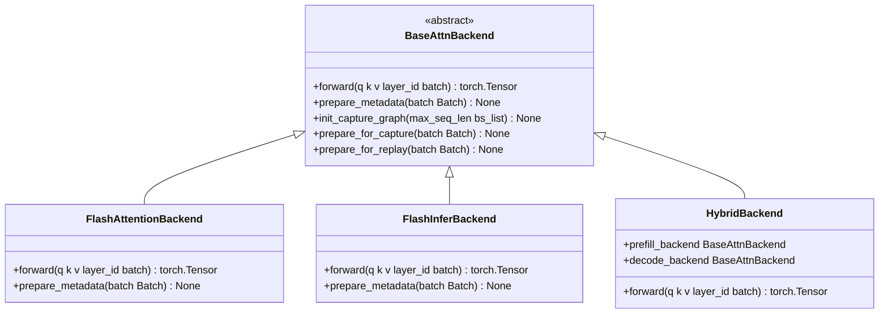

# 开发者指南

<cite>
**本文档中引用的文件**  
- [README.md](file://README.md)
- [pyproject.toml](file://pyproject.toml)
- [.pre-commit-config.yaml](file://.pre-commit-config.yaml)
- [base.py](file://python/minisgl/models/base.py)
- [llama.py](file://python/minisgl/models/llama.py)
- [qwen3.py](file://python/minisgl/models/qwen3.py)
- [config.py](file://python/minisgl/models/config.py)
- [weight.py](file://python/minisgl/models/weight.py)
- [__init__.py](file://python/minisgl/models/__init__.py)
- [attention/base.py](file://python/minisgl/attention/base.py)
- [attention/__init__.py](file://python/minisgl/attention/__init__.py)
- [attention/fa3.py](file://python/minisgl/attention/fa3.py)
- [attention/fi.py](file://python/minisgl/attention/fi.py)
- [layers/attention.py](file://python/minisgl/layers/attention.py)
- [core.py](file://python/minisgl/core.py)
</cite>

## 目录
1. [开发环境设置](#开发环境设置)
2. [运行单元测试](#运行单元测试)
3. [代码格式化与静态检查](#代码格式化与静态检查)
4. [添加新模型架构支持](#添加新模型架构支持)
5. [集成新的注意力后端](#集成新的注意力后端)
6. [代码提交规范与预提交钩子](#代码提交规范与预提交钩子)

## 开发环境设置

要开始为 Mini-SGLang 贡献代码，首先需要正确设置开发环境。项目依赖于 Python 3.10 或更高版本，并使用 `uv` 作为推荐的包管理工具。

1. 创建虚拟环境：
```bash
uv venv --python=3.12
source .venv/bin/activate
```

2. 安装项目依赖：
```bash
uv pip install -e ".[dev]"
```

此命令将安装主依赖项以及开发依赖项，包括 `pytest`、`black`、`ruff` 和 `pre-commit` 等工具。`pyproject.toml` 文件中定义了 `dev` 可选依赖项，确保所有开发工具都已正确安装。

3. 确保 CUDA 环境已正确配置。Mini-SGLang 依赖于 CUDA 内核的即时编译（JIT），因此需要安装与驱动程序版本匹配的 NVIDIA CUDA Toolkit。

**Section sources**
- [README.md](file://README.md#L27-L37)
- [pyproject.toml](file://pyproject.toml#L40-L48)

## 运行单元测试

Mini-SGLang 使用 `pytest` 框架进行单元测试。测试文件位于 `tests/` 目录下，按模块组织。

要运行所有测试，请在项目根目录执行：
```bash
pytest
```

要运行特定模块的测试，例如调度器模块：
```bash
pytest tests/core/test_scheduler.py
```

测试配置在 `pyproject.toml` 中定义，包括测试路径、Python 文件模式和覆盖率报告。建议在提交代码前运行测试以确保功能完整性。

**Section sources**
- [pyproject.toml](file://pyproject.toml#L103-L114)
- [tests/core/test_scheduler.py](file://tests/core/test_scheduler.py#L1-L74)

## 代码格式化与静态检查

为了保持代码风格的一致性，Mini-SGLang 使用 `black` 进行代码格式化，`ruff` 进行静态检查和 linting。

- 格式化代码：
```bash
black .
```

- 运行静态检查：
```bash
ruff check .
```

这些工具的配置在 `pyproject.toml` 中指定，包括目标 Python 版本、行长度和忽略的规则。`black` 配置行长度为 100，目标版本为 Python 3.10。

**Section sources**
- [pyproject.toml](file://pyproject.toml#L61-L87)
- [.pre-commit-config.yaml](file://.pre-commit-config.yaml#L18-L27)

## 添加新模型架构支持

要添加对新模型架构的支持，需要在 `python/minisgl/models/` 目录下创建新的模型文件，并实现相应的模型类和权重加载逻辑。

1. 创建新的模型文件，例如 `my_model.py`。
2. 继承 `BaseLLMModel` 抽象基类，并实现 `forward` 方法。
3. 在 `__init__.py` 中注册模型工厂函数，使其能够通过 `create_model` 函数被正确实例化。

模型配置通过 `ModelConfig` 数据类管理，该类从 Hugging Face 的 `LlamaConfig` 转换而来。新模型应遵循类似的模式，定义其特定的层结构和参数。



**Diagram sources**
- [models/base.py](file://python/minisgl/models/base.py#L13-L21)
- [models/llama.py](file://python/minisgl/models/llama.py#L69-L85)
- [models/qwen3.py](file://python/minisgl/models/qwen3.py#L69-L85)

**Section sources**
- [models/base.py](file://python/minisgl/models/base.py#L13-L21)
- [models/llama.py](file://python/minisgl/models/llama.py#L69-L85)
- [models/qwen3.py](file://python/minisgl/models/qwen3.py#L69-L85)
- [models/__init__.py](file://python/minisgl/models/__init__.py#L8-L19)

## 集成新的注意力后端

Mini-SGLang 支持通过实现 `BaseAttnBackend` 接口来集成新的注意力后端。该接口定义了前向传播、元数据准备和 CUDA 图捕获等关键方法。

1. 在 `python/minisgl/attention/` 目录下创建新的后端文件，例如 `my_backend.py`。
2. 实现 `BaseAttnBackend` 接口，提供 `forward`、`prepare_metadata` 等方法的具体实现。
3. 在 `attention/__init__.py` 中的 `create_attention_backend` 工厂函数中注册新的后端。

`HybridBackend` 类允许为预填充（prefill）和解码（decode）阶段使用不同的后端，以优化性能。例如，可以配置 `fa3,fi` 来分别使用 FlashAttention-3 和 FlashInfer。



**Diagram sources**
- [attention/base.py](file://python/minisgl/attention/base.py#L20-L66)
- [attention/fa3.py](file://python/minisgl/attention/fa3.py#L47-L55)
- [attention/fi.py](file://python/minisgl/attention/fi.py#L86-L130)
- [attention/__init__.py](file://python/minisgl/attention/__init__.py#L39-L45)

**Section sources**
- [attention/base.py](file://python/minisgl/attention/base.py#L20-L66)
- [attention/__init__.py](file://python/minisgl/attention/__init__.py#L26-L56)
- [attention/fa3.py](file://python/minisgl/attention/fa3.py#L47-L55)
- [attention/fi.py](file://python/minisgl/attention/fi.py#L86-L130)

## 代码提交规范与预提交钩子

Mini-SGLang 使用 `pre-commit` 框架来自动化代码检查和格式化。`.pre-commit-config.yaml` 文件定义了在每次提交前自动运行的钩子。

配置包括：
- `trailing-whitespace`：移除行尾空白
- `end-of-file-fixer`：确保文件以换行符结尾
- `check-yaml` 和 `check-toml`：验证 YAML 和 TOML 文件格式
- `black`：自动格式化 Python 代码
- `ruff`：自动修复 linting 问题
- `clang-format`：格式化 C++ 和 CUDA 代码

在首次提交前，安装预提交钩子：
```bash
pre-commit install
```

此后，每次 `git commit` 时都会自动运行这些检查，确保代码符合项目标准。

**Section sources**
- [.pre-commit-config.yaml](file://.pre-commit-config.yaml#L1-L40)
- [pyproject.toml](file://pyproject.toml#L79-L101)