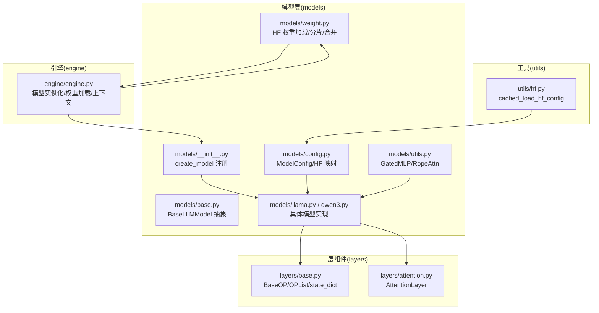
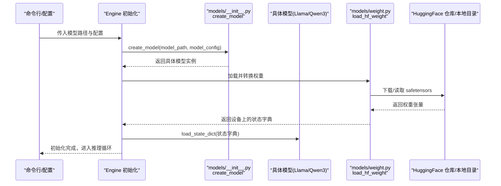
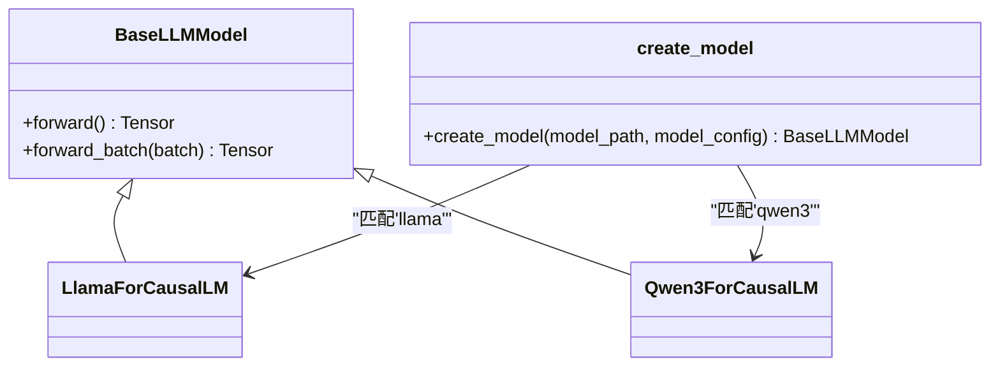
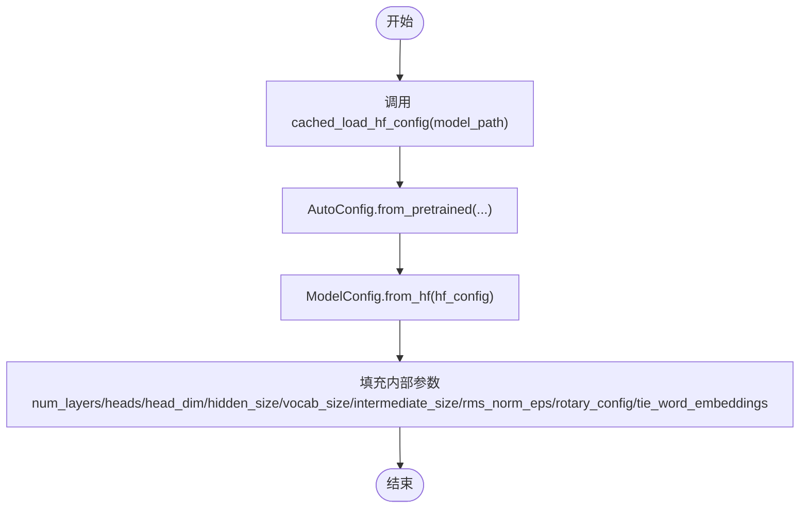
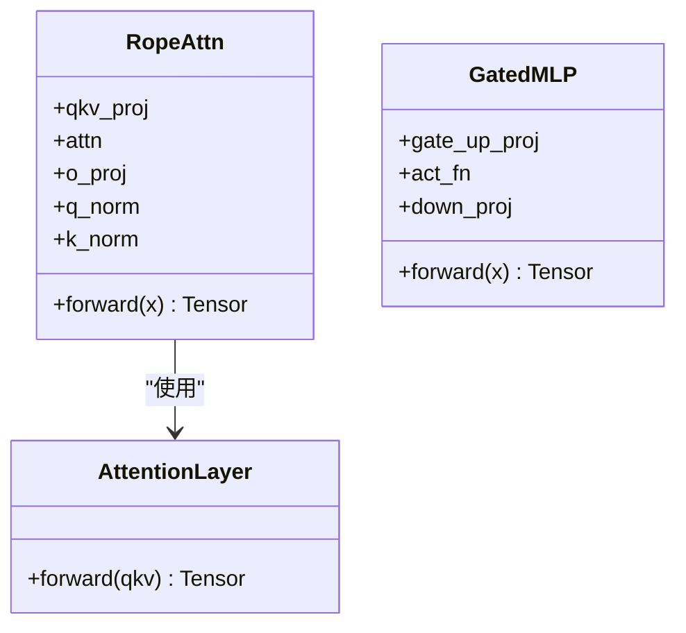
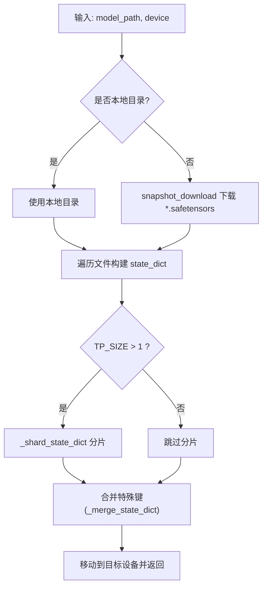
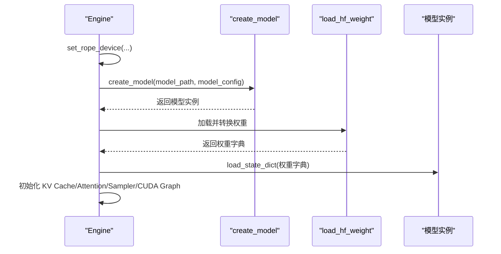
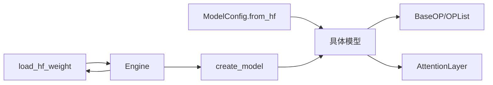

# 扩展模型支持

<cite>
**本文引用的文件**
- [python/minisgl/models/base.py](file://python/minisgl/models/base.py)
- [python/minisgl/models/config.py](file://python/minisgl/models/config.py)
- [python/minisgl/models/utils.py](file://python/minisgl/models/utils.py)
- [python/minisgl/models/llama.py](file://python/minisgl/models/llama.py)
- [python/minisgl/models/qwen3.py](file://python/minisgl/models/qwen3.py)
- [python/minisgl/models/__init__.py](file://python/minisgl/models/__init__.py)
- [python/minisgl/models/weight.py](file://python/minisgl/models/weight.py)
- [python/minisgl/utils/hf.py](file://python/minisgl/utils/hf.py)
- [python/minisgl/layers/base.py](file://python/minisgl/layers/base.py)
- [python/minisgl/layers/attention.py](file://python/minisgl/layers/attention.py)
- [python/minisgl/engine/engine.py](file://python/minisgl/engine/engine.py)
</cite>

## 目录
1. [简介](#简介)
2. [项目结构](#项目结构)
3. [核心组件](#核心组件)
4. [架构总览](#架构总览)
5. [详细组件分析](#详细组件分析)
6. [依赖关系分析](#依赖关系分析)
7. [性能考量](#性能考量)
8. [故障排查指南](#故障排查指南)
9. [结论](#结论)
10. [附录：新增模型支持的完整流程](#附录新增模型支持的完整流程)

## 简介
本文件面向希望为 mini-sglang 添加新模型架构支持的开发者，系统性说明如何基于 models/base.py 的基础抽象类，实现特定模型（如 Llama、Qwen3）的网络结构定义，并确保与 Hugging Face 模型配置与权重兼容。文档涵盖：
- 继承与实现：如何在 models/ 下新增模型文件并实现 BaseLLMModel 抽象接口
- 配置映射：如何将 Hugging Face 配置转换为内部 ModelConfig
- 权重加载与转换：如何下载、分片、合并与加载权重
- 注册与集成：如何在 models/__init__.py 中注册新模型并接入引擎初始化流程
- 实战路径：提供从定义配置到注册模型的完整步骤指引

## 项目结构
mini-sglang 将“模型定义”“配置映射”“权重加载”“层组件”“注意力后端”等模块清晰分层，便于扩展新的模型架构：
- models/：模型定义与配置、权重加载、工具类
- layers/：基础算子与并行化组件（嵌入、注意力、归一化、线性等）
- engine/：推理引擎入口，负责模型实例化、KV 缓存、注意力后端与采样器初始化
- utils/：通用工具（HF 配置缓存、分布式辅助函数等）

图表来源
- [python/minisgl/models/base.py](file://python/minisgl/models/base.py#L1-L21)
- [python/minisgl/models/config.py](file://python/minisgl/models/config.py#L1-L56)
- [python/minisgl/models/utils.py](file://python/minisgl/models/utils.py#L1-L96)
- [python/minisgl/models/llama.py](file://python/minisgl/models/llama.py#L1-L89)
- [python/minisgl/models/qwen3.py](file://python/minisgl/models/qwen3.py#L1-L89)
- [python/minisgl/models/__init__.py](file://python/minisgl/models/__init__.py#L1-L23)
- [python/minisgl/models/weight.py](file://python/minisgl/models/weight.py#L1-L106)
- [python/minisgl/layers/base.py](file://python/minisgl/layers/base.py#L1-L100)
- [python/minisgl/layers/attention.py](file://python/minisgl/layers/attention.py#L1-L60)
- [python/minisgl/engine/engine.py](file://python/minisgl/engine/engine.py#L50-L120)
- [python/minisgl/utils/hf.py](file://python/minisgl/utils/hf.py#L1-L21)

章节来源
- [python/minisgl/models/base.py](file://python/minisgl/models/base.py#L1-L21)
- [python/minisgl/models/config.py](file://python/minisgl/models/config.py#L1-L56)
- [python/minisgl/models/__init__.py](file://python/minisgl/models/__init__.py#L1-L23)
- [python/minisgl/models/weight.py](file://python/minisgl/models/weight.py#L1-L106)
- [python/minisgl/layers/base.py](file://python/minisgl/layers/base.py#L1-L100)
- [python/minisgl/layers/attention.py](file://python/minisgl/layers/attention.py#L1-L60)
- [python/minisgl/engine/engine.py](file://python/minisgl/engine/engine.py#L50-L120)
- [python/minisgl/utils/hf.py](file://python/minisgl/utils/hf.py#L1-L21)

## 核心组件
- 基础抽象：BaseLLMModel 定义了统一的前向接口与批处理包装，所有具体模型均需实现 forward 并可复用 forward_batch。
- 配置映射：ModelConfig 提供从 Hugging Face 配置对象（如 LlamaConfig）到内部参数的映射，包含注意力头数、隐藏维度、旋转位置编码等。
- 层组件：BaseOP/OPList/state_dict 提供统一的状态字典序列化/反序列化能力；AttentionLayer 负责注意力计算与旋转位置编码。
- 工具模块：GatedMLP 和 RopeAttn 封装了门控 MLP 与带 RoPE 的注意力子层，便于不同模型共享。
- 权重加载：load_hf_weight 支持本地目录或 Hugging Face 仓库 ID，自动下载 safetensors 文件，按张量并行维度进行分片与合并，并最终返回设备上的状态字典。

章节来源
- [python/minisgl/models/base.py](file://python/minisgl/models/base.py#L1-L21)
- [python/minisgl/models/config.py](file://python/minisgl/models/config.py#L1-L56)
- [python/minisgl/models/utils.py](file://python/minisgl/models/utils.py#L1-L96)
- [python/minisgl/layers/base.py](file://python/minisgl/layers/base.py#L1-L100)
- [python/minisgl/layers/attention.py](file://python/minisgl/layers/attention.py#L1-L60)
- [python/minisgl/models/weight.py](file://python/minisgl/models/weight.py#L1-L106)

## 架构总览
下图展示了从命令行参数到模型实例化、权重加载与运行的关键流程。

图表来源
- [python/minisgl/engine/engine.py](file://python/minisgl/engine/engine.py#L50-L120)
- [python/minisgl/models/__init__.py](file://python/minisgl/models/__init__.py#L1-L23)
- [python/minisgl/models/weight.py](file://python/minisgl/models/weight.py#L1-L106)

## 详细组件分析

### 基础抽象与模型注册
- BaseLLMModel：定义 forward 抽象方法，并提供 forward_batch 包装，使模型在推理时自动进入全局上下文。
- create_model：根据模型路径字符串（如包含“llama”或“qwen3”的标识）动态导入对应模型类并构造实例；若不匹配则抛出错误。

图表来源
- [python/minisgl/models/base.py](file://python/minisgl/models/base.py#L1-L21)
- [python/minisgl/models/llama.py](file://python/minisgl/models/llama.py#L1-L89)
- [python/minisgl/models/qwen3.py](file://python/minisgl/models/qwen3.py#L1-L89)
- [python/minisgl/models/__init__.py](file://python/minisgl/models/__init__.py#L1-L23)

章节来源
- [python/minisgl/models/base.py](file://python/minisgl/models/base.py#L1-L21)
- [python/minisgl/models/__init__.py](file://python/minisgl/models/__init__.py#L1-L23)

### 配置映射与 Hugging Face 兼容
- ModelConfig：封装模型超参，提供 from_hf 方法将 LlamaConfig 等 HF 配置对象转换为内部结构，包括注意力头数、隐藏维度、旋转位置编码参数等。
- cached_load_hf_config：通过 transformers.AutoConfig 从 HF 仓库或本地路径加载配置，并使用缓存避免重复 IO。

图表来源
- [python/minisgl/models/config.py](file://python/minisgl/models/config.py#L1-L56)
- [python/minisgl/utils/hf.py](file://python/minisgl/utils/hf.py#L1-L21)

章节来源
- [python/minisgl/models/config.py](file://python/minisgl/models/config.py#L1-L56)
- [python/minisgl/utils/hf.py](file://python/minisgl/utils/hf.py#L1-L21)

### 注意力与 MLP 子层
- RopeAttn：封装 QKV 合并投影、可选的 Q/K 归一化、AttentionLayer 计算与输出投影，适配不同模型的注意力变体。
- GatedMLP：封装门控与并行上/下投影，当前支持 silu 激活。

图表来源
- [python/minisgl/models/utils.py](file://python/minisgl/models/utils.py#L1-L96)
- [python/minisgl/layers/attention.py](file://python/minisgl/layers/attention.py#L1-L60)

章节来源
- [python/minisgl/models/utils.py](file://python/minisgl/models/utils.py#L1-L96)
- [python/minisgl/layers/attention.py](file://python/minisgl/layers/attention.py#L1-L60)

### 权重加载与转换逻辑
- load_hf_weight：支持本地目录或 HF 仓库 ID；自动下载 safetensors 文件并聚合为状态字典；在张量并行场景下按规则对关键权重进行分片；最后合并某些键（如将 q/k/v 分开的权重合并为 qkv）以适配内部层的参数命名。
- 张量并行分片规则：对 q_proj/k_proj/v_proj 进行按维度 0 切分；对 o_proj/down_proj 进行按维度 1 切分；对 lm_head/embed_tokens 进行词表切分；其余键保持不变。
- 合并规则：将 q/k/v/up/gate 分开的权重拼接回合并后的键名，减少运行时查找成本。

图表来源
- [python/minisgl/models/weight.py](file://python/minisgl/models/weight.py#L1-L106)

章节来源
- [python/minisgl/models/weight.py](file://python/minisgl/models/weight.py#L1-L106)

### 引擎初始化与模型装配
- Engine 在初始化阶段：
  - 设置旋转位置编码设备
  - 使用 meta 设备与目标 dtype 创建模型实例（延迟参数分配）
  - 通过 create_model 与 load_hf_weight 获取模型与权重
  - 将权重加载到模型 state_dict
  - 初始化 KV Cache、注意力后端、采样器与 CUDA Graph

图表来源
- [python/minisgl/engine/engine.py](file://python/minisgl/engine/engine.py#L50-L120)
- [python/minisgl/models/__init__.py](file://python/minisgl/models/__init__.py#L1-L23)
- [python/minisgl/models/weight.py](file://python/minisgl/models/weight.py#L1-L106)

章节来源
- [python/minisgl/engine/engine.py](file://python/minisgl/engine/engine.py#L50-L120)

## 依赖关系分析
- 模型实现依赖于 layers 的基础算子与并行化组件，确保权重命名与形状一致。
- 权重加载依赖分布式信息（TP rank/size）与分片/合并规则，保证多卡一致性。
- 引擎通过 create_model 与 load_hf_weight 解耦模型类型与权重来源，便于扩展。

图表来源
- [python/minisgl/models/config.py](file://python/minisgl/models/config.py#L1-L56)
- [python/minisgl/models/__init__.py](file://python/minisgl/models/__init__.py#L1-L23)
- [python/minisgl/models/weight.py](file://python/minisgl/models/weight.py#L1-L106)
- [python/minisgl/layers/base.py](file://python/minisgl/layers/base.py#L1-L100)
- [python/minisgl/layers/attention.py](file://python/minisgl/layers/attention.py#L1-L60)
- [python/minisgl/engine/engine.py](file://python/minisgl/engine/engine.py#L50-L120)

章节来源
- [python/minisgl/models/config.py](file://python/minisgl/models/config.py#L1-L56)
- [python/minisgl/models/__init__.py](file://python/minisgl/models/__init__.py#L1-L23)
- [python/minisgl/models/weight.py](file://python/minisgl/models/weight.py#L1-L106)
- [python/minisgl/layers/base.py](file://python/minisgl/layers/base.py#L1-L100)
- [python/minisgl/layers/attention.py](file://python/minisgl/layers/attention.py#L1-L60)
- [python/minisgl/engine/engine.py](file://python/minisgl/engine/engine.py#L50-L120)

## 性能考量
- 张量并行分片：在多卡场景下，对关键权重进行分片可显著降低单卡内存压力；务必确保分片键名与内部层一致。
- 合并策略：将 q/k/v/up/gate 等拆分权重合并为连续键，减少运行时查找与拼接开销。
- 冷启动优化：Engine 在 meta 设备上创建模型，随后再加载权重，有助于快速确定 KV Cache 大小与页面数量。
- CUDA Graph：在满足条件时复用图执行，减少内核启动开销。

[本节为通用建议，无需列出具体文件来源]

## 故障排查指南
- 不支持的模型路径：当 create_model 无法识别模型名称时会抛出异常，请确认模型路径中包含“llama”或“qwen3”等关键字。
- 权重键不匹配：若 load_state_dict 报错提示存在未预期键，请检查权重是否已按分片/合并规则转换，或确认模型层的参数命名与权重键一致。
- HF 配置加载失败：cached_load_hf_config 依赖 transformers AutoConfig，若仓库 ID 或本地路径无效会报错，请确认路径正确且包含有效配置文件。
- 张量并行不平衡：Engine 在初始化时会检测各卡内存差异，若差异过大将报错并提示调整参数。

章节来源
- [python/minisgl/models/__init__.py](file://python/minisgl/models/__init__.py#L1-L23)
- [python/minisgl/models/weight.py](file://python/minisgl/models/weight.py#L1-L106)
- [python/minisgl/utils/hf.py](file://python/minisgl/utils/hf.py#L1-L21)
- [python/minisgl/engine/engine.py](file://python/minisgl/engine/engine.py#L170-L195)

## 结论
通过遵循上述流程与约定，开发者可以高效地为 mini-sglang 添加新的模型架构支持：以 BaseLLMModel 为抽象基类，结合 ModelConfig 的 HF 配置映射、RopeAttn/GatedMLP 等通用子层，以及 models/weight.py 的权重加载与转换机制，即可在 models/__init__.py 中完成注册，并顺利接入 Engine 初始化流程。

[本节为总结，无需列出具体文件来源]

## 附录：新增模型支持的完整流程
以下为新增一个名为“MyModel”的模型的完整步骤，涵盖从定义配置到注册模型的全流程。

- 步骤 1：定义模型配置
  - 参考现有 ModelConfig 的字段与 from_hf 映射方式，确保包含 num_layers、num_qo_heads、num_kv_heads、head_dim、hidden_size、vocab_size、intermediate_size、rms_norm_eps、rotary_config、hidden_act、tie_word_embeddings 等关键字段。
  - 若需要自定义旋转位置编码参数，可在 RotaryConfig 中补充必要项。
  - 参考路径：[python/minisgl/models/config.py](file://python/minisgl/models/config.py#L1-L56)

- 步骤 2：实现模型层组件
  - 在 models/utils.py 中封装通用子层（如 RopeAttn、GatedMLP），或直接在模型文件中组合现有层组件。
  - 参考路径：[python/minisgl/models/utils.py](file://python/minisgl/models/utils.py#L1-L96)

- 步骤 3：实现具体模型
  - 新建 models/my_model.py，定义 MyModel（包含嵌入、若干解码层、归一化与 LM 头）与 MyModelForCausalLM（继承 BaseLLMModel，实现 forward）。
  - 解码层内部组合 RopeAttn 与 GatedMLP，并按需加入残差与归一化。
  - 参考路径：
    - [python/minisgl/models/base.py](file://python/minisgl/models/base.py#L1-L21)
    - [python/minisgl/models/llama.py](file://python/minisgl/models/llama.py#L1-L89)
    - [python/minisgl/models/qwen3.py](file://python/minisgl/models/qwen3.py#L1-L89)

- 步骤 4：注册模型
  - 在 models/__init__.py 的 create_model 中增加对新模型的识别逻辑（例如根据模型路径包含“mymodel”关键字），并返回对应的模型实例。
  - 参考路径：[python/minisgl/models/__init__.py](file://python/minisgl/models/__init__.py#L1-L23)

- 步骤 5：准备权重与配置
  - 准备 Hugging Face 配置文件与 safetensors 权重文件，确保键名与内部层一致（或能在 load_hf_weight 中被正确分片/合并）。
  - 参考路径：
    - [python/minisgl/utils/hf.py](file://python/minisgl/utils/hf.py#L1-L21)
    - [python/minisgl/models/weight.py](file://python/minisgl/models/weight.py#L1-L106)

- 步骤 6：验证与测试
  - 启动引擎，传入模型路径与配置，观察是否成功加载权重并完成初始化。
  - 参考路径：[python/minisgl/engine/engine.py](file://python/minisgl/engine/engine.py#L50-L120)

- 步骤 7：性能与稳定性
  - 在多卡场景下验证张量并行分片与合并逻辑，确保无未预期键残留。
  - 关注内存平衡与 KV Cache 页面数量估算，避免初始化失败。
  - 参考路径：
    - [python/minisgl/models/weight.py](file://python/minisgl/models/weight.py#L1-L106)
    - [python/minisgl/engine/engine.py](file://python/minisgl/engine/engine.py#L170-L195)