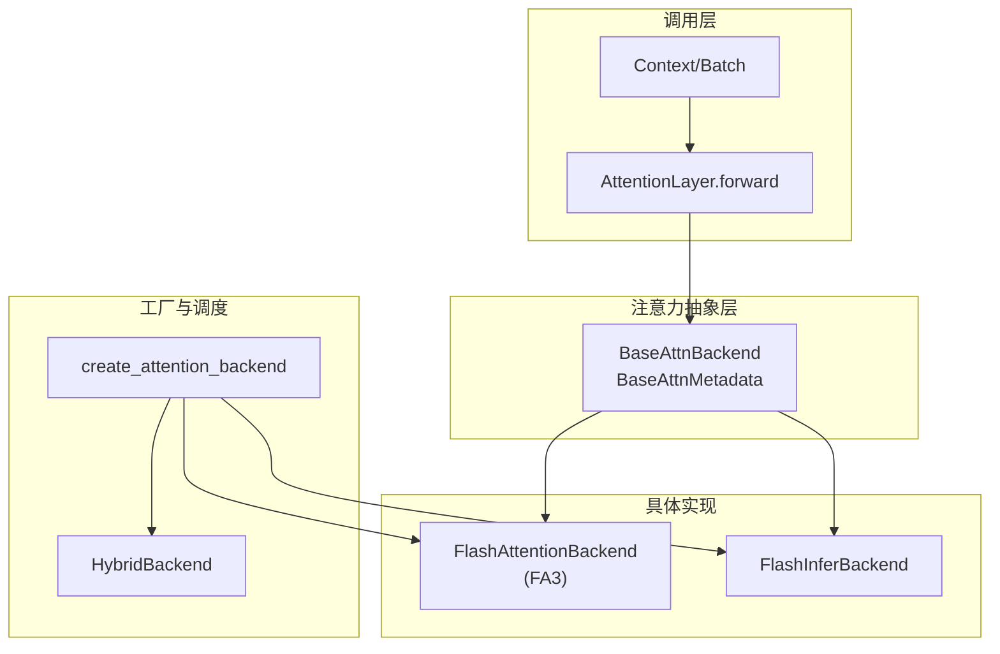
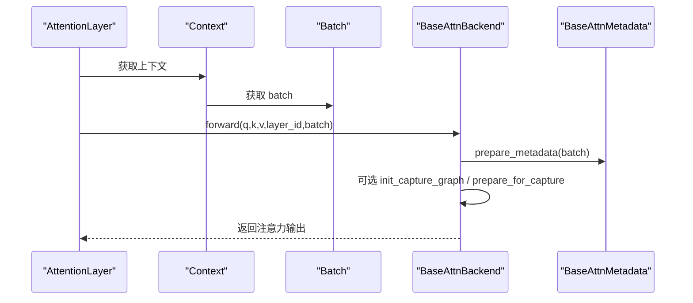
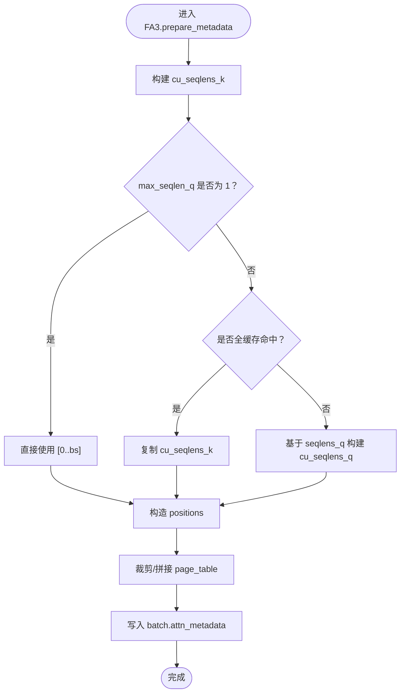
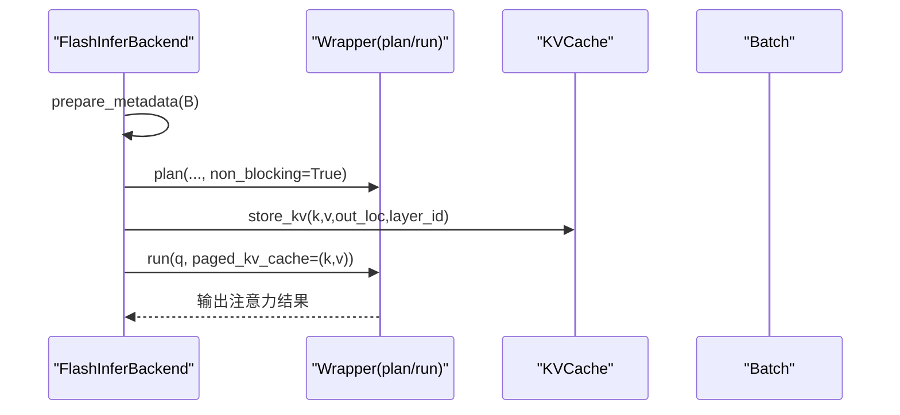
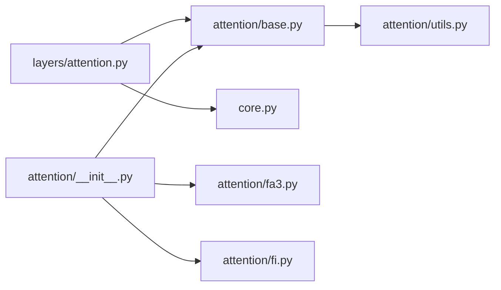

# 扩展注意力后端

<cite>
**本文引用的文件**
- [python/minisgl/attention/base.py](file://python/minisgl/attention/base.py)
- [python/minisgl/attention/__init__.py](file://python/minisgl/attention/__init__.py)
- [python/minisgl/attention/fa3.py](file://python/minisgl/attention/fa3.py)
- [python/minisgl/attention/fi.py](file://python/minisgl/attention/fi.py)
- [python/minisgl/attention/utils.py](file://python/minisgl/attention/utils.py)
- [python/minisgl/layers/attention.py](file://python/minisgl/layers/attention.py)
- [python/minisgl/core.py](file://python/minisgl/core.py)
</cite>

## 目录
1. [简介](#简介)
2. [项目结构](#项目结构)
3. [核心组件](#核心组件)
4. [架构总览](#架构总览)
5. [详细组件分析](#详细组件分析)
6. [依赖关系分析](#依赖关系分析)
7. [性能考量](#性能考量)
8. [故障排查指南](#故障排查指南)
9. [结论](#结论)
10. [附录：新增后端步骤清单](#附录新增后端步骤清单)

## 简介
本文件面向希望为系统添加新的注意力计算后端的开发者，系统性说明：
- AttentionBackend 抽象接口的契约与必须实现方法
- 如何通过工厂函数创建并注册新后端
- 参考实现：FlashAttention 与 FlashInfer 的关键路径与性能优化要点
- 新后端开发的注意事项与最佳实践

## 项目结构
注意力相关代码集中在 Python 包内，采用“抽象接口 + 具体实现 + 工厂注册”的分层设计：
- 抽象层：定义通用接口与元数据类型
- 实现层：提供具体后端（如 FA3、FlashInfer）
- 工厂层：根据配置自动选择或混合后端
- 调用层：在推理层中通过上下文调用后端执行注意力

图表来源
- [python/minisgl/attention/base.py](file://python/minisgl/attention/base.py#L1-L66)
- [python/minisgl/attention/fa3.py](file://python/minisgl/attention/fa3.py#L1-L211)
- [python/minisgl/attention/fi.py](file://python/minisgl/attention/fi.py#L1-L278)
- [python/minisgl/attention/__init__.py](file://python/minisgl/attention/__init__.py#L1-L60)
- [python/minisgl/layers/attention.py](file://python/minisgl/layers/attention.py#L1-L60)
- [python/minisgl/core.py](file://python/minisgl/core.py#L73-L121)

章节来源
- [python/minisgl/attention/base.py](file://python/minisgl/attention/base.py#L1-L66)
- [python/minisgl/attention/__init__.py](file://python/minisgl/attention/__init__.py#L1-L60)
- [python/minisgl/layers/attention.py](file://python/minisgl/layers/attention.py#L1-L60)
- [python/minisgl/core.py](file://python/minisgl/core.py#L73-L121)

## 核心组件
- 抽象接口
  - BaseAttnBackend：定义注意力后端的统一接口，包括 forward、prepare_metadata、init_capture_graph、prepare_for_capture、prepare_for_replay
  - BaseAttnMetadata：定义注意力元数据的抽象，包含 positions 与 get_last_indices
- 混合后端
  - HybridBackend：按前填充（prefill）与解码（decode）阶段选择不同后端实例
- 工厂函数
  - create_attention_backend：根据配置字符串或自动策略创建后端；支持逗号分隔的混合模式
- 位置索引工具
  - make_positions：从请求序列构造 token 位置索引张量
- KV 缓存与捕获数据
  - BaseCaptureData：CUDA Graph 捕获所需的输入/输出缓冲区模板

章节来源
- [python/minisgl/attention/base.py](file://python/minisgl/attention/base.py#L1-L66)
- [python/minisgl/attention/__init__.py](file://python/minisgl/attention/__init__.py#L1-L60)
- [python/minisgl/attention/utils.py](file://python/minisgl/attention/utils.py#L1-L50)

## 架构总览
注意力后端的调用链路如下：
- 推理层 AttentionLayer 在前向时从全局上下文中取出 Batch 与 attn_backend
- 将 Q/K/V 分离、可选归一化与旋转位置编码后，调用 attn_backend.forward
- 后端内部 prepare_metadata 生成元数据，必要时初始化捕获图，最终执行注意力计算

图表来源
- [python/minisgl/layers/attention.py](file://python/minisgl/layers/attention.py#L47-L59)
- [python/minisgl/core.py](file://python/minisgl/core.py#L101-L142)
- [python/minisgl/attention/base.py](file://python/minisgl/attention/base.py#L20-L37)

## 详细组件分析

### 抽象接口与契约
- BaseAttnBackend 必须实现的方法
  - forward(q, k, v, layer_id, batch) -> Tensor：执行注意力计算
  - prepare_metadata(batch) -> None：为当前批次准备注意力元数据
  - init_capture_graph(max_seq_len, bs_list) -> None：初始化捕获图（用于 CUDA Graph）
  - prepare_for_capture(batch) -> None：为捕获阶段准备输入数据
  - prepare_for_replay(batch) -> None：为回放阶段恢复输入数据
- BaseAttnMetadata 必须实现的方法
  - get_last_indices(bs) -> Tensor：返回每个请求在序列中的最后一个 token 索引
- HybridBackend
  - 根据 batch.is_prefill 或 batch.is_decode 动态选择 prefill_backend 或 decode_backend

章节来源
- [python/minisgl/attention/base.py](file://python/minisgl/attention/base.py#L1-L66)

### 工厂函数与注册机制
- create_attention_backend(config, base_kvcache, backend, page_table) -> BaseAttnBackend
  - 支持 backend 字符串：
    - "auto"：根据 GPU 架构自动选择
    - "fa3"：FlashAttention 3 后端
    - "fi"：FlashInfer 后端
    - "a,b"：混合模式，逗号分隔的 prefill 与 decode 后端
  - 自动选择策略：
    - Hopper 架构优先使用 "fa3,fi"
    - Blackwell 架构优先使用 "fi"
    - 其他架构默认 "fi"
  - 混合后端：当 prefill 与 decode 不同且不相等时，创建 HybridBackend 组合两个后端

章节来源
- [python/minisgl/attention/__init__.py](file://python/minisgl/attention/__init__.py#L1-L60)

### 参考实现：FlashAttention（FA3）
- 关键职责
  - 准备注意力元数据（cu_seqlens_q/k、cache_seqlens、max_seqlen_q/k、page_table）
  - 将新 K/V 写入 KVCache，并调用底层 CUDA 算子执行注意力
  - 支持捕获图：init_capture_graph/prepare_for_capture/prepare_for_replay
- 性能优化要点
  - 使用 contiguity 断言确保内存布局满足算子要求
  - 通过 make_positions 高效构造位置索引
  - 仅在需要时进行跨设备拷贝（CPU->GPU）
  - 通过参数化控制 softmax scale、window size、softcap、num_splits、pack_gqa 等

图表来源
- [python/minisgl/attention/fa3.py](file://python/minisgl/attention/fa3.py#L67-L106)
- [python/minisgl/attention/utils.py](file://python/minisgl/attention/utils.py#L36-L50)

章节来源
- [python/minisgl/attention/fa3.py](file://python/minisgl/attention/fa3.py#L1-L211)
- [python/minisgl/attention/utils.py](file://python/minisgl/attention/utils.py#L1-L50)

### 参考实现：FlashInfer
- 关键职责
  - 使用 FlashInfer 的 prefill/decode 包装器执行注意力
  - 支持捕获图：CUDAGraphBatchDecodeWithPagedKVCacheWrapper
  - 初始化一次性计划（plan）以避免重复开销
- 性能优化要点
  - 复用 float/int 工作空间缓冲区，减少内存分配
  - 对于高 GQA 场景启用 Tensor Cores
  - 使用 pinned memory 缓存小数组（如 ones），按 2 的幂次扩容
  - 将 cu_seqlens_q/cpu 与 cu_seqlens_q/gpu 分离，提高运行时效率

图表来源
- [python/minisgl/attention/fi.py](file://python/minisgl/attention/fi.py#L132-L172)
- [python/minisgl/attention/fi.py](file://python/minisgl/attention/fi.py#L181-L190)

章节来源
- [python/minisgl/attention/fi.py](file://python/minisgl/attention/fi.py#L1-L278)

### 调用链与上下文
- AttentionLayer.forward
  - 从全局上下文获取 Batch 与 attn_backend
  - 分离 Q/K/V，可选归一化与旋转位置编码
  - 调用 attn_backend.forward 完成注意力计算
- Context/Batch
  - Context 维护 page_table、kv_cache、attn_backend
  - Batch 描述当前前填充/解码阶段，携带 attn_metadata

章节来源
- [python/minisgl/layers/attention.py](file://python/minisgl/layers/attention.py#L1-L60)
- [python/minisgl/core.py](file://python/minisgl/core.py#L73-L121)

## 依赖关系分析
- 组件耦合
  - AttentionLayer 仅依赖 BaseAttnBackend 接口，耦合度低
  - 后端实现依赖 KVCache 与 Batch 的约定字段（如 out_loc、attn_metadata）
- 外部依赖
  - FA3 依赖自定义 CUDA 算子（torch.ops.sgl_kernel）
  - FlashInfer 依赖 flashinfer 包装器与工作空间缓冲区
- 潜在循环依赖
  - 当前模块间无循环导入迹象

图表来源
- [python/minisgl/layers/attention.py](file://python/minisgl/layers/attention.py#L1-L60)
- [python/minisgl/attention/base.py](file://python/minisgl/attention/base.py#L1-L66)
- [python/minisgl/attention/utils.py](file://python/minisgl/attention/utils.py#L1-L50)
- [python/minisgl/attention/__init__.py](file://python/minisgl/attention/__init__.py#L1-L60)
- [python/minisgl/attention/fa3.py](file://python/minisgl/attention/fa3.py#L1-L211)
- [python/minisgl/attention/fi.py](file://python/minisgl/attention/fi.py#L1-L278)
- [python/minisgl/core.py](file://python/minisgl/core.py#L73-L121)

章节来源
- [python/minisgl/layers/attention.py](file://python/minisgl/layers/attention.py#L1-L60)
- [python/minisgl/attention/__init__.py](file://python/minisgl/attention/__init__.py#L1-L60)

## 性能考量
- 数据布局与内存
  - 确保张量最后维度连续（contiguous），避免算子报错或降级
  - 使用 pinned memory 缓存频繁的小数组，降低 CPU-GPU 拷贝成本
- 张量拷贝与设备迁移
  - 尽量减少 CPU->GPU 的拷贝次数，优先在目标设备上构造张量
  - 对 cu_seqlens_q/gpu 与 cu_seqlens_q/cpu 分离，提升运行时效率
- 计算图与捕获
  - 使用 init_capture_graph/prepare_for_capture/prepare_for_replay 建立捕获图，避免重复图构建
  - 解码阶段固定 max_seqlen_q=1，简化捕获图输入
- 算法参数
  - 通过参数化控制 window size、softcap、num_splits、pack_gqa 等，平衡吞吐与显存
  - FlashInfer 在高 GQA 场景启用 Tensor Cores，显著提升吞吐

[本节为通用性能建议，无需特定文件引用]

## 故障排查指南
- 常见错误与定位
  - “未找到 sgl_kernel.flash_attn”：确认已安装并正确加载 sgl-kernel
  - “张量最后维度非连续”：检查输入张量的 stride(-1)==1 条件
  - “捕获图未初始化/重复初始化”：确认 init_capture_graph 仅调用一次，prepare_for_capture 与 prepare_for_replay 成对使用
  - “不支持的后端”：检查 backend 字符串是否为 "fa3"、"fi" 或 "a,b"
- 日志与诊断
  - 工厂函数会记录自动选择的后端与混合模式信息
  - FlashInfer 后端支持覆盖 Tensor Cores 使用策略的日志提示

章节来源
- [python/minisgl/attention/fa3.py](file://python/minisgl/attention/fa3.py#L144-L211)
- [python/minisgl/attention/__init__.py](file://python/minisgl/attention/__init__.py#L1-L60)
- [python/minisgl/attention/fi.py](file://python/minisgl/attention/fi.py#L236-L243)

## 结论
通过抽象接口与工厂注册机制，系统实现了对注意力后端的灵活扩展。开发者只需遵循 BaseAttnBackend 的契约，实现必要的元数据准备与捕获图流程，并在工厂中注册即可无缝接入。FA3 与 FlashInfer 提供了成熟的性能优化范式，可作为新后端开发的参考。

[本节为总结性内容，无需特定文件引用]

## 附录：新增后端步骤清单
- 实现步骤
  1) 定义后端类并继承 BaseAttnBackend
     - 参考路径：[python/minisgl/attention/base.py](file://python/minisgl/attention/base.py#L20-L37)
  2) 定义元数据类并继承 BaseAttnMetadata
     - 参考路径：[python/minisgl/attention/base.py](file://python/minisgl/attention/base.py#L12-L18)
  3) 实现以下方法
     - forward(q, k, v, layer_id, batch) -> Tensor
     - prepare_metadata(batch) -> None
     - init_capture_graph(max_seq_len, bs_list) -> None
     - prepare_for_capture(batch) -> None
     - prepare_for_replay(batch) -> None
     - 参考路径：[python/minisgl/attention/base.py](file://python/minisgl/attention/base.py#L20-L37)
  4) 在工厂中注册新后端
     - 在 create_attention_backend 中增加 case 分支
     - 参考路径：[python/minisgl/attention/__init__.py](file://python/minisgl/attention/__init__.py#L46-L56)
  5) 参考现有实现优化性能
     - FA3：参考位置索引构造、捕获图与算子参数
       - 参考路径：[python/minisgl/attention/fa3.py](file://python/minisgl/attention/fa3.py#L67-L106), [python/minisgl/attention/fa3.py](file://python/minisgl/attention/fa3.py#L144-L211)
     - FlashInfer：参考工作空间复用、一次性 plan、Tensor Cores 与捕获图
       - 参考路径：[python/minisgl/attention/fi.py](file://python/minisgl/attention/fi.py#L101-L128), [python/minisgl/attention/fi.py](file://python/minisgl/attention/fi.py#L132-L172), [python/minisgl/attention/fi.py](file://python/minisgl/attention/fi.py#L227-L278)
  6) 单测与集成验证
     - 确认 forward 结果与预期一致
     - 验证 prepare_metadata 生成的元数据字段完整
     - 验证捕获图在不同 batch size 下稳定运行

章节来源
- [python/minisgl/attention/base.py](file://python/minisgl/attention/base.py#L12-L37)
- [python/minisgl/attention/__init__.py](file://python/minisgl/attention/__init__.py#L46-L56)
- [python/minisgl/attention/fa3.py](file://python/minisgl/attention/fa3.py#L67-L106)
- [python/minisgl/attention/fa3.py](file://python/minisgl/attention/fa3.py#L144-L211)
- [python/minisgl/attention/fi.py](file://python/minisgl/attention/fi.py#L101-L128)
- [python/minisgl/attention/fi.py](file://python/minisgl/attention/fi.py#L132-L172)
- [python/minisgl/attention/fi.py](file://python/minisgl/attention/fi.py#L227-L278)