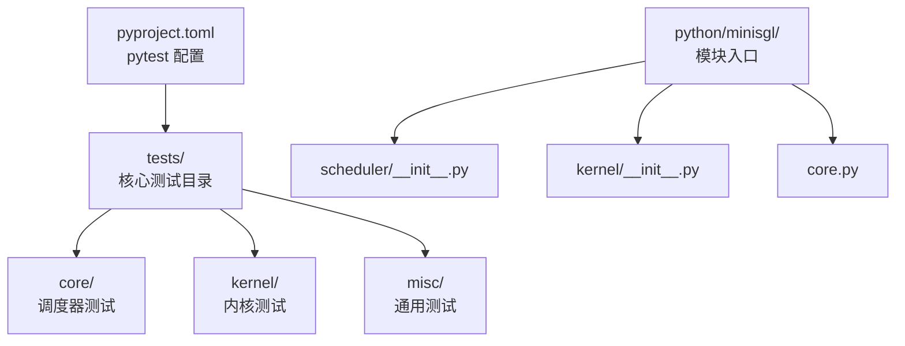
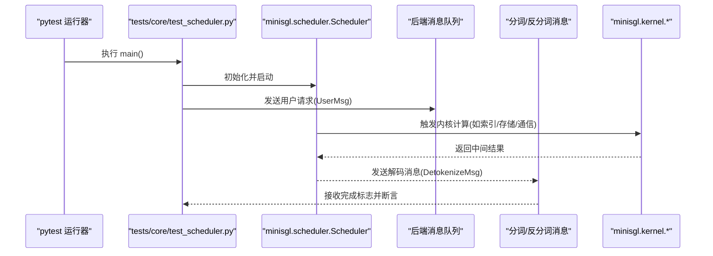
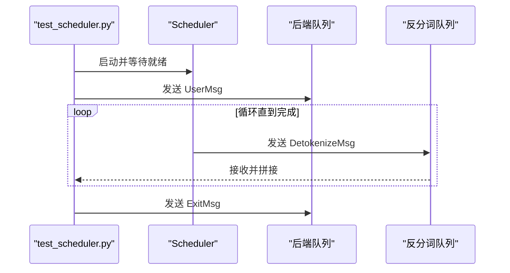
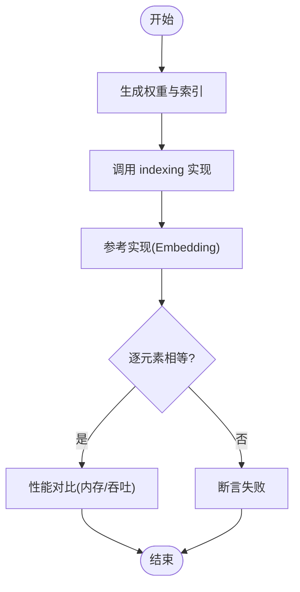
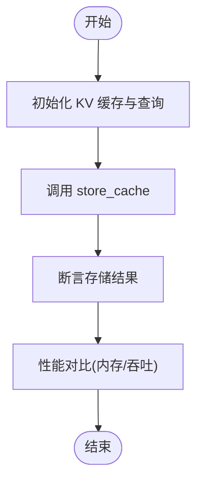
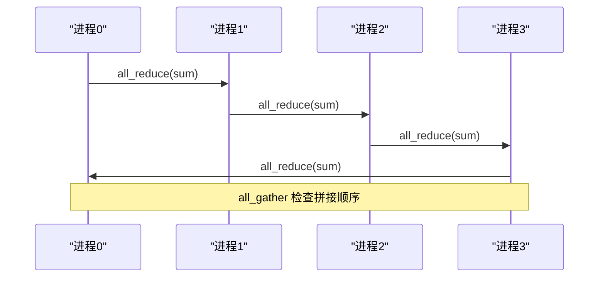
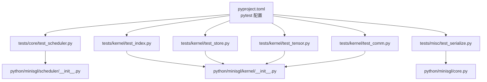

# 测试指南

<cite>
**本文引用的文件**
- [pyproject.toml](file://pyproject.toml)
- [README.md](file://README.md)
- [tests/core/test_scheduler.py](file://tests/core/test_scheduler.py)
- [tests/kernel/test_tensor.py](file://tests/kernel/test_tensor.py)
- [tests/kernel/test_comm.py](file://tests/kernel/test_comm.py)
- [tests/kernel/test_index.py](file://tests/kernel/test_index.py)
- [tests/kernel/test_store.py](file://tests/kernel/test_store.py)
- [tests/misc/test_serialize.py](file://tests/misc/test_serialize.py)
- [python/minisgl/scheduler/__init__.py](file://python/minisgl/scheduler/__init__.py)
- [python/minisgl/kernel/__init__.py](file://python/minisgl/kernel/__init__.py)
- [python/minisgl/core.py](file://python/minisgl/core.py)
</cite>

## 目录
1. [简介](#简介)
2. [项目结构](#项目结构)
3. [核心组件](#核心组件)
4. [架构总览](#架构总览)
5. [详细组件分析](#详细组件分析)
6. [依赖分析](#依赖分析)
7. [性能考虑](#性能考虑)
8. [故障排查指南](#故障排查指南)
9. [结论](#结论)
10. [附录](#附录)

## 简介
本测试指南面向开发者，系统性介绍如何在本仓库中运行与编写单元测试，重点覆盖以下核心模块：
- 调度器（scheduler）
- 内核（kernel）
- 核心数据结构（core）

内容包括：pytest 配置与运行方式、测试目录结构与命名规范、为新功能添加测试覆盖的方法、常见测试失败的排查与调试技巧，以及如何确保代码变更的可靠性。

## 项目结构
测试相关的关键配置与文件分布如下：
- pytest 配置位于 pyproject.toml 的工具配置段，定义了测试路径、文件与函数命名规则、覆盖率报告等。
- 测试目录 tests/ 下按功能域划分：core、kernel、misc，分别对应调度器、内核与通用序列化等测试。
- 各模块的导出入口位于 python/minisgl 下的各子包 __init__.py 中，便于测试直接导入。

图表来源
- [pyproject.toml](file://pyproject.toml#L103-L115)
- [tests/core/test_scheduler.py](file://tests/core/test_scheduler.py#L1-L74)
- [tests/kernel/test_tensor.py](file://tests/kernel/test_tensor.py#L1-L13)
- [tests/misc/test_serialize.py](file://tests/misc/test_serialize.py#L1-L36)
- [python/minisgl/scheduler/__init__.py](file://python/minisgl/scheduler/__init__.py#L1-L5)
- [python/minisgl/kernel/__init__.py](file://python/minisgl/kernel/__init__.py#L1-L15)
- [python/minisgl/core.py](file://python/minisgl/core.py#L1-L156)

章节来源
- [pyproject.toml](file://pyproject.toml#L103-L115)
- [tests/core/test_scheduler.py](file://tests/core/test_scheduler.py#L1-L74)
- [tests/kernel/test_tensor.py](file://tests/kernel/test_tensor.py#L1-L13)
- [tests/misc/test_serialize.py](file://tests/misc/test_serialize.py#L1-L36)
- [python/minisgl/scheduler/__init__.py](file://python/minisgl/scheduler/__init__.py#L1-L5)
- [python/minisgl/kernel/__init__.py](file://python/minisgl/kernel/__init__.py#L1-L15)
- [python/minisgl/core.py](file://python/minisgl/core.py#L1-L156)

## 核心组件
本节聚焦与测试直接相关的模块与接口，帮助你快速定位测试目标与断言点。

- 调度器（scheduler）
  - 导出接口：Scheduler、SchedulerConfig
  - 测试入口：tests/core/test_scheduler.py
  - 关键断言：基于消息队列的前后端交互、完成标志位、解码结果一致性
- 内核（kernel）
  - 导出接口：indexing、fast_compare_key、store_cache、test_tensor、init_pynccl、PyNCCLCommunicator
  - 测试入口：tests/kernel/test_index.py、tests/kernel/test_store.py、tests/kernel/test_tensor.py、tests/kernel/test_comm.py
  - 关键断言：索引正确性、存储正确性、张量拷贝正确性、集合通信正确性与带宽/时延
- 核心数据结构（core）
  - 导出接口：SamplingParams、Req、Batch、Context、set_global_ctx、get_global_ctx
  - 测试入口：可结合调度器或内核测试进行集成验证
  - 关键断言：数据类字段约束、上下文切换一致性、批处理状态转换

章节来源
- [python/minisgl/scheduler/__init__.py](file://python/minisgl/scheduler/__init__.py#L1-L5)
- [python/minisgl/kernel/__init__.py](file://python/minisgl/kernel/__init__.py#L1-L15)
- [python/minisgl/core.py](file://python/minisgl/core.py#L1-L156)
- [tests/core/test_scheduler.py](file://tests/core/test_scheduler.py#L1-L74)
- [tests/kernel/test_index.py](file://tests/kernel/test_index.py#L1-L102)
- [tests/kernel/test_store.py](file://tests/kernel/test_store.py#L1-L54)
- [tests/kernel/test_tensor.py](file://tests/kernel/test_tensor.py#L1-L13)
- [tests/kernel/test_comm.py](file://tests/kernel/test_comm.py#L1-L173)

## 架构总览
下图展示了测试运行时与核心模块之间的关系，以及典型测试流程中的调用链。

图表来源
- [tests/core/test_scheduler.py](file://tests/core/test_scheduler.py#L1-L74)
- [python/minisgl/scheduler/__init__.py](file://python/minisgl/scheduler/__init__.py#L1-L5)
- [python/minisgl/kernel/__init__.py](file://python/minisgl/kernel/__init__.py#L1-L15)

## 详细组件分析

### 调度器测试（tests/core/test_scheduler.py）
- 目标
  - 验证调度器在多进程环境下的运行与消息交互
  - 基于消息队列的输入输出断言，确保推理流程完整
- 关键流程
  - 初始化分布式信息与调度配置
  - 启动调度器进程并等待就绪
  - 通过消息队列发送用户请求，接收解码消息并断言完成标志
- 断言要点
  - 解码消息类型与完成标志
  - 输出序列长度与采样参数一致
- 可扩展点
  - 新增不同模型路径与并行度组合
  - 添加异常场景（如网络中断、超时）

图表来源
- [tests/core/test_scheduler.py](file://tests/core/test_scheduler.py#L1-L74)

章节来源
- [tests/core/test_scheduler.py](file://tests/core/test_scheduler.py#L1-L74)

### 内核索引测试（tests/kernel/test_index.py）
- 目标
  - 验证索引操作的正确性与性能
- 关键流程
  - 生成随机权重与索引
  - 对比自研实现与参考实现（torch.nn.functional.embedding）
  - 使用性能对比工具评估内存占用与吞吐
- 断言要点
  - 结果张量逐元素相等
  - 在掩码范围内的边界处理正确
- 可扩展点
  - 增加不同批大小与维度组合
  - 引入不同精度与设备

图表来源
- [tests/kernel/test_index.py](file://tests/kernel/test_index.py#L1-L102)

章节来源
- [tests/kernel/test_index.py](file://tests/kernel/test_index.py#L1-L102)

### 内核存储测试（tests/kernel/test_store.py）
- 目标
  - 验证 KV Cache 存储的正确性与性能
- 关键流程
  - 生成随机 KV 缓存与查询向量
  - 对比自研实现与基线（直接索引赋值）
  - 使用性能对比工具评估内存占用与吞吐
- 断言要点
  - 存储后张量值与期望一致
  - 不容忍重复索引，避免覆盖错误
- 可扩展点
  - 增加不同头部维度与批量规模
  - 引入连续性要求与编译优化

图表来源
- [tests/kernel/test_store.py](file://tests/kernel/test_store.py#L1-L54)

章节来源
- [tests/kernel/test_store.py](file://tests/kernel/test_store.py#L1-L54)

### 内核张量测试（tests/kernel/test_tensor.py）
- 目标
  - 验证跨设备/跨类型的张量处理逻辑
- 关键流程
  - 在 CPU/GPU 设备上构造不同 dtype 的张量
  - 调用内核测试函数并观察行为
- 断言要点
  - 无显式断言，主要验证运行时稳定性与无异常
- 可扩展点
  - 添加 dtype/形状组合与异常分支

章节来源
- [tests/kernel/test_tensor.py](file://tests/kernel/test_tensor.py#L1-L13)

### 内核通信测试（tests/kernel/test_comm.py）
- 目标
  - 验证集合通信（all-reduce、all-gather）的正确性与性能
- 关键流程
  - 多进程初始化进程组与设置设备/流
  - 构造测试数据并执行多次通信以统计时延与带宽
  - 断言最终结果与期望一致
- 断言要点
  - all-reduce 结果收敛到期望值
  - all-gather 拼接顺序正确
- 可扩展点
  - 增加不同拓扑与数据规模
  - 引入 CUDA Graph 加速对比

图表来源
- [tests/kernel/test_comm.py](file://tests/kernel/test_comm.py#L1-L173)

章节来源
- [tests/kernel/test_comm.py](file://tests/kernel/test_comm.py#L1-L173)

### 序列化测试（tests/misc/test_serialize.py）
- 目标
  - 验证消息序列化/反序列化的正确性
- 关键流程
  - 构造包含嵌套数据类与张量的消息对象
  - 编码后再解码，断言结构与内容一致
- 断言要点
  - 编解码前后对象相等
  - 批量消息编码/解码正确

章节来源
- [tests/misc/test_serialize.py](file://tests/misc/test_serialize.py#L1-L36)

## 依赖分析
- 测试与模块的依赖关系
  - 调度器测试依赖 scheduler 模块与消息队列
  - 内核测试依赖 kernel 模块与 torch/cuda
  - 核心数据结构测试可与调度器/内核测试协同验证
- 外部依赖
  - pytest、pytest-cov、torch、transformers、pyzmq 等

图表来源
- [pyproject.toml](file://pyproject.toml#L103-L115)
- [tests/core/test_scheduler.py](file://tests/core/test_scheduler.py#L1-L74)
- [tests/kernel/test_index.py](file://tests/kernel/test_index.py#L1-L102)
- [tests/kernel/test_store.py](file://tests/kernel/test_store.py#L1-L54)
- [tests/kernel/test_tensor.py](file://tests/kernel/test_tensor.py#L1-L13)
- [tests/kernel/test_comm.py](file://tests/kernel/test_comm.py#L1-L173)
- [tests/misc/test_serialize.py](file://tests/misc/test_serialize.py#L1-L36)
- [python/minisgl/scheduler/__init__.py](file://python/minisgl/scheduler/__init__.py#L1-L5)
- [python/minisgl/kernel/__init__.py](file://python/minisgl/kernel/__init__.py#L1-L15)
- [python/minisgl/core.py](file://python/minisgl/core.py#L1-L156)

章节来源
- [pyproject.toml](file://pyproject.toml#L103-L115)
- [tests/core/test_scheduler.py](file://tests/core/test_scheduler.py#L1-L74)
- [tests/kernel/test_index.py](file://tests/kernel/test_index.py#L1-L102)
- [tests/kernel/test_store.py](file://tests/kernel/test_store.py#L1-L54)
- [tests/kernel/test_tensor.py](file://tests/kernel/test_tensor.py#L1-L13)
- [tests/kernel/test_comm.py](file://tests/kernel/test_comm.py#L1-L173)
- [tests/misc/test_serialize.py](file://tests/misc/test_serialize.py#L1-L36)
- [python/minisgl/scheduler/__init__.py](file://python/minisgl/scheduler/__init__.py#L1-L5)
- [python/minisgl/kernel/__init__.py](file://python/minisgl/kernel/__init__.py#L1-L15)
- [python/minisgl/core.py](file://python/minisgl/core.py#L1-L156)

## 性能考虑
- 测试中的性能评估
  - 使用性能对比工具对内核实现与参考实现进行内存占用与吞吐对比
  - 在通信测试中记录平均时延与带宽，辅助回归检测
- 建议
  - 在 CI 中固定硬件环境，减少波动
  - 对关键路径引入 CUDA Graph 与编译优化对比
  - 将性能阈值纳入断言，形成性能回归保护

[本节为通用建议，不直接分析具体文件]

## 故障排查指南
- pytest 运行问题
  - 确认测试路径与命名规则符合配置
  - 使用覆盖率选项查看未覆盖路径
- 分布式/多进程测试
  - 确保进程组初始化成功且设备/流设置正确
  - 检查环境变量（如 MASTER_ADDR/MASTER_PORT）与端口占用
- CUDA/张量相关问题
  - 检查设备与 dtype 是否匹配
  - 确保张量连续性与内存对齐
- 消息序列化问题
  - 核对编码/解码流程与数据类字段
  - 对复杂嵌套结构进行最小化复现

章节来源
- [pyproject.toml](file://pyproject.toml#L103-L115)
- [tests/kernel/test_comm.py](file://tests/kernel/test_comm.py#L1-L173)
- [tests/kernel/test_index.py](file://tests/kernel/test_index.py#L1-L102)
- [tests/kernel/test_store.py](file://tests/kernel/test_store.py#L1-L54)
- [tests/misc/test_serialize.py](file://tests/misc/test_serialize.py#L1-L36)

## 结论
通过本测试指南，你可以：
- 明确 pytest 的配置与运行方式
- 理解测试目录结构与命名规范
- 快速为新功能添加覆盖（调度器、内核、核心数据结构）
- 使用现有测试作为模板，扩展断言与性能评估
- 基于常见问题清单进行高效排查与调试

[本节为总结，不直接分析具体文件]

## 附录

### 如何运行测试
- 安装开发依赖（含 pytest 与覆盖率插件）
- 在仓库根目录执行 pytest，自动发现 tests/ 下的测试文件
- 查看终端与 HTML 报告，定位未覆盖路径

章节来源
- [pyproject.toml](file://pyproject.toml#L39-L49)
- [pyproject.toml](file://pyproject.toml#L103-L115)

### 测试目录与命名规范
- 目录划分：tests/core、tests/kernel、tests/misc
- 文件命名：test_xxx.py 或 xxx_test.py
- 类与函数：Test*、test_*

章节来源
- [pyproject.toml](file://pyproject.toml#L103-L115)

### 为新功能添加测试覆盖的步骤
- 在对应目录新增测试文件（遵循命名规范）
- 引入被测模块的公共接口
- 编写最小可复现用例，先断言正确性，再加入性能对比
- 在 CI 中启用覆盖率检查，确保关键路径被覆盖

章节来源
- [tests/core/test_scheduler.py](file://tests/core/test_scheduler.py#L1-L74)
- [tests/kernel/test_index.py](file://tests/kernel/test_index.py#L1-L102)
- [tests/kernel/test_store.py](file://tests/kernel/test_store.py#L1-L54)
- [tests/kernel/test_tensor.py](file://tests/kernel/test_tensor.py#L1-L13)
- [tests/kernel/test_comm.py](file://tests/kernel/test_comm.py#L1-L173)
- [tests/misc/test_serialize.py](file://tests/misc/test_serialize.py#L1-L36)