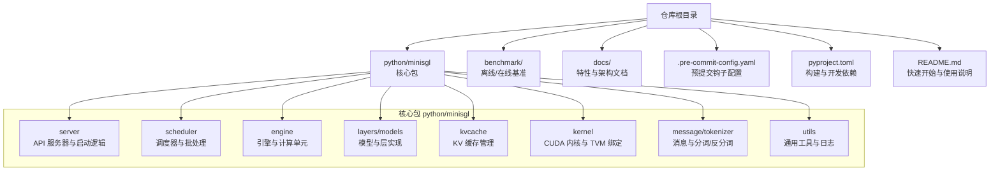
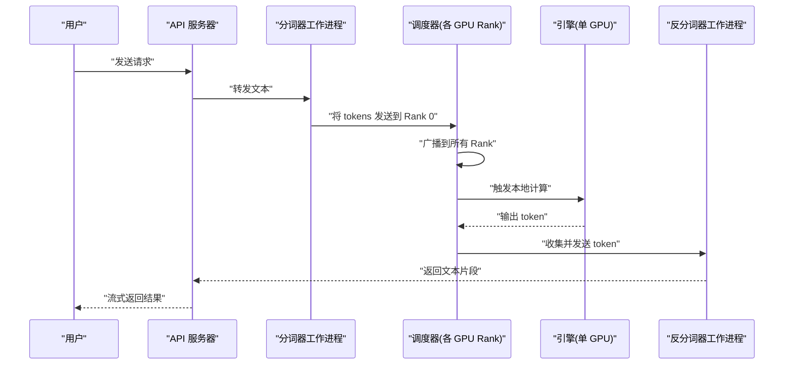
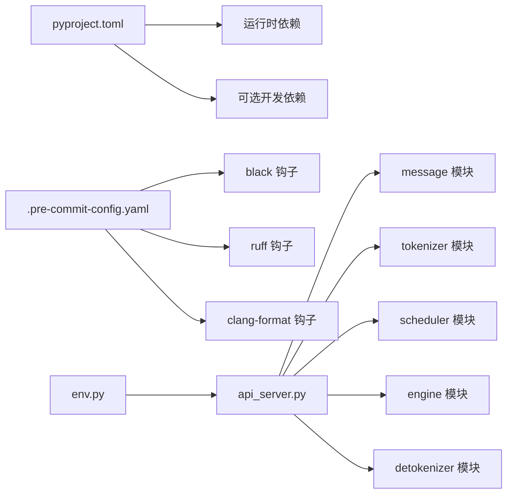

# 贡献流程

<cite>
**本文引用的文件**
- [README.md](file://README.md)
- [.pre-commit-config.yaml](file://.pre-commit-config.yaml)
- [pyproject.toml](file://pyproject.toml)
- [docs/features.md](file://docs/features.md)
- [docs/structures.md](file://docs/structures.md)
- [python/minisgl/server/api_server.py](file://python/minisgl/server/api_server.py)
- [python/minisgl/shell.py](file://python/minisgl/shell.py)
- [python/minisgl/env.py](file://python/minisgl/env.py)
</cite>

## 目录
1. [简介](#简介)
2. [项目结构](#项目结构)
3. [核心组件](#核心组件)
4. [架构总览](#架构总览)
5. [详细组件分析](#详细组件分析)
6. [依赖关系分析](#依赖关系分析)
7. [性能考虑](#性能考虑)
8. [故障排查指南](#故障排查指南)
9. [结论](#结论)
10. [附录](#附录)

## 简介
本文件面向希望为 Mini-SGLang 做出贡献的开发者，提供从环境搭建到代码审查与合并的全流程指导。内容涵盖：
- 如何配置开发环境（Python 虚拟环境、CUDA 工具链、项目依赖）
- 开发工具安装与使用（black、ruff、clang-format）
- 预提交钩子（pre-commit）的安装与使用，确保代码风格一致
- 分支策略、规范化的 commit message 编写与 Pull Request 流程
- 代码审查流程与合并标准，帮助贡献符合项目质量要求

## 项目结构
Mini-SGLang 是一个以 Python 为主的高性能推理框架，核心代码位于 python/minisgl 下，包含服务端、调度器、注意力后端、KV 缓存、内核等模块；仓库根目录提供构建与开发工具配置，以及基准测试脚本。

图表来源
- [docs/structures.md](file://docs/structures.md#L1-L50)
- [README.md](file://README.md#L1-L118)

章节来源
- [README.md](file://README.md#L1-L118)
- [docs/structures.md](file://docs/structures.md#L1-L50)

## 核心组件
- 开发工具与依赖
  - 构建系统与依赖声明：通过 pyproject.toml 定义构建后端、项目元数据、运行时依赖与可选开发依赖（含 pytest、black、ruff、mypy、matplotlib、pre-commit 等）。
  - 预提交钩子：.pre-commit-config.yaml 配置了多仓库钩子，覆盖 Python（black、ruff）、C++/CUDA（clang-format）、通用检查（YAML/TOML、AST、大文件、冲突标记、私钥检测、调试语句）。
- 快速开始与运行
  - README.md 提供 uv 虚拟环境创建、源码安装、在线服务与交互式 Shell 的使用示例。
- 交互式 Shell
  - python/minisgl/shell.py 入口调用 launch_server 并启用交互模式，便于本地调试与演示。
- API 服务器
  - python/minisgl/server/api_server.py 提供 /v1 接口与流式生成能力，支持 SSE 流式响应与请求生命周期管理。
- 环境变量与参数
  - python/minisgl/env.py 定义通用的环境变量封装类，支持布尔、整数、浮点、内存大小解析，便于在不同部署场景下调整行为。

章节来源
- [pyproject.toml](file://pyproject.toml#L1-L138)
- [.pre-commit-config.yaml](file://.pre-commit-config.yaml#L1-L40)
- [README.md](file://README.md#L1-L118)
- [python/minisgl/shell.py](file://python/minisgl/shell.py#L1-L4)
- [python/minisgl/server/api_server.py](file://python/minisgl/server/api_server.py#L188-L364)
- [python/minisgl/env.py](file://python/minisgl/env.py#L1-L55)

## 架构总览
Mini-SGLang 的系统由 API Server、Tokenizer、Detokenizer、Scheduler（多 GPU Rank）等进程组成，通过 ZeroMQ 和 NCCL 进行控制与张量通信。请求生命周期从用户到 API Server，再到分词、广播调度、本地计算、反分词、回传结果。

图表来源
- [docs/structures.md](file://docs/structures.md#L1-L50)
- [python/minisgl/server/api_server.py](file://python/minisgl/server/api_server.py#L188-L364)

章节来源
- [docs/structures.md](file://docs/structures.md#L1-L50)

## 详细组件分析

### 开发环境配置
- Python 版本与虚拟环境
  - 项目要求 Python >= 3.10，推荐 3.12；建议使用 uv 创建隔离虚拟环境。
- CUDA 工具链
  - 项目依赖 CUDA 内核并通过 JIT 编译，需安装与驱动版本匹配的 NVIDIA CUDA Toolkit。
- 安装项目
  - 源码安装后即可直接运行模块入口进行在线服务或交互式 Shell。
- 可选功能与依赖
  - 可选开发依赖包含 pytest、pytest-cov、black、flake8、mypy、pre-commit、ruff、matplotlib 等，满足测试、类型检查、格式化与静态检查需求。

章节来源
- [README.md](file://README.md#L25-L69)
- [pyproject.toml](file://pyproject.toml#L1-L138)

### 开发工具与代码风格
- black（Python 代码格式化）
  - 在 pyproject.toml 中定义了行宽、目标版本与排除规则；.pre-commit-config.yaml 使用官方 black 钩子，确保提交前统一格式。
- ruff（Python 静态检查与修复）
  - 在 pyproject.toml 中配置了 lint 规则与忽略项；.pre-commit-config.yaml 使用 ruff-pre-commit 钩子，自动修复可修复问题。
- clang-format（C++/CUDA 代码格式化）
  - .pre-commit-config.yaml 使用 clang-format 镜像钩子，按 .clang-format 文件风格格式化 C++/CUDA 源码，排除特定头文件。

章节来源
- [pyproject.toml](file://pyproject.toml#L61-L138)
- [.pre-commit-config.yaml](file://.pre-commit-config.yaml#L1-L40)

### 预提交钩子（pre-commit）安装与使用
- 安装与初始化
  - 在本地仓库安装 pre-commit 后，首次运行会读取 .pre-commit-config.yaml 并安装各仓库钩子。
- 常见操作
  - git commit 时自动触发 pre-commit 钩子，执行 black、ruff、clang-format 与通用检查；若失败，请根据提示修复并重试。
  - git push 时同样可在 pre-push 阶段执行钩子（默认启用），确保推送分支符合规范。
- 常见问题
  - 若某些文件被排除（例如 tests/、.venv/、build/、dist/ 或特定头文件），请确认路径是否正确或在本地临时禁用对应钩子进行调试。
  - 若 clang-format 报错，检查 .clang-format 是否存在且与仓库风格一致。

章节来源
- [.pre-commit-config.yaml](file://.pre-commit-config.yaml#L1-L40)
- [pyproject.toml](file://pyproject.toml#L61-L138)

### 分支策略与提交规范
- 分支命名
  - 建议采用清晰语义的分支名，如 feature/xxx、fix/xxx、docs/xxx、chore/xxx，便于追踪与审查。
- 提交信息（commit message）
  - 建议遵循“类型: 主题”的格式，主题简洁描述变更内容；正文说明动机与影响范围；引用相关 issue 编号（如 #123）。
  - 示例格式参考：feat: 添加新注意力后端；fix: 修复 CUDA 内核编译错误；docs: 更新 API 文档；chore: 升级依赖版本。
- 提交前检查
  - 确保通过 pre-commit 钩子（black、ruff、clang-format、通用检查）；运行 pytest 与 mypy（如已配置）；更新相关文档与注释。

章节来源
- [.pre-commit-config.yaml](file://.pre-commit-config.yaml#L1-L40)
- [pyproject.toml](file://pyproject.toml#L103-L115)

### Pull Request 流程与代码审查
- PR 准备
  - 在个人 fork 上创建分支，提交符合规范的 commit；保持每次提交聚焦单一主题，避免混杂无关改动。
- PR 描述
  - 清晰说明变更目的、影响范围与测试情况；列出相关 issue 编号；必要时附上性能对比或回归测试截图。
- 代码审查要点
  - 代码风格：是否通过 black、ruff、clang-format；是否遵循项目注释与命名约定。
  - 功能正确性：是否通过 pytest 与 mypy；是否覆盖关键路径与边界条件。
  - 性能与稳定性：是否引入显著性能退化；是否影响多 GPU 场景下的调度与通信。
  - 文档与注释：是否同步更新 README、docs/features.md、docs/structures.md 或相关注释。
- 合并标准
  - 至少一名维护者批准；所有 CI 步骤通过；无未解决的审查意见；提交历史整洁、信息明确。

章节来源
- [README.md](file://README.md#L1-L118)
- [docs/features.md](file://docs/features.md#L1-L55)
- [docs/structures.md](file://docs/structures.md#L1-L50)
- [pyproject.toml](file://pyproject.toml#L103-L115)

### 交互式 Shell 与 API 服务器实践
- 交互式 Shell
  - 通过 python -m minisgl --shell 启动，支持 /reset 清空历史，便于本地调试与演示。
- API 服务器
  - 提供 /v1 接口与流式生成，支持 SSE 流式响应；请求生命周期从 API Server 到分词、调度、计算、反分词与回传。
- 环境变量
  - 通过 MINISGL_ 前缀的环境变量调整行为（如布尔、整数、浮点、内存大小），便于在不同硬件与部署场景下微调。

章节来源
- [python/minisgl/shell.py](file://python/minisgl/shell.py#L1-L4)
- [python/minisgl/server/api_server.py](file://python/minisgl/server/api_server.py#L188-L364)
- [python/minisgl/env.py](file://python/minisgl/env.py#L1-L55)

## 依赖关系分析
- 构建与运行时依赖
  - 运行时依赖包括 torch、transformers、flashinfer-python、fastapi、uvicorn、pyzmq、prompt_toolkit、openai、apache-tvm-ffi 等；可选开发依赖包含 pytest、pytest-cov、black、flake8、mypy、pre-commit、ruff、matplotlib。
- 预提交钩子依赖
  - black、ruff、clang-format 作为 pre-commit 钩子，分别负责 Python 格式化、静态检查与修复、C++/CUDA 格式化。
- 代码组织与模块耦合
  - 核心模块围绕 server、scheduler、engine、layers、models、kvcache、kernel、message、utils 展开，API Server 与 Shell 作为入口，环境变量封装提供跨模块配置能力。

图表来源
- [pyproject.toml](file://pyproject.toml#L1-L138)
- [.pre-commit-config.yaml](file://.pre-commit-config.yaml#L1-L40)
- [python/minisgl/server/api_server.py](file://python/minisgl/server/api_server.py#L188-L364)
- [python/minisgl/env.py](file://python/minisgl/env.py#L1-L55)

章节来源
- [pyproject.toml](file://pyproject.toml#L1-L138)
- [.pre-commit-config.yaml](file://.pre-commit-config.yaml#L1-L40)
- [python/minisgl/server/api_server.py](file://python/minisgl/server/api_server.py#L188-L364)
- [python/minisgl/env.py](file://python/minisgl/env.py#L1-L55)

## 性能考虑
- 在线服务与交互式 Shell
  - README.md 提供了在线服务与交互式 Shell 的使用示例，便于在本地验证性能与功能。
- 基准测试
  - benchmark/offline 与 benchmark/online 下的脚本可用于离线与在线推理的性能评估；可通过环境变量或命令行参数调整缓存策略、并行度与注意力后端。
- 内核与调度
  - 注意力后端（FlashAttention、FlashInfer）、Radix Cache、Overlap Scheduling 等优化对吞吐与延迟有显著影响，建议在 PR 中说明相关改动对性能的影响与验证方法。

章节来源
- [README.md](file://README.md#L75-L118)
- [docs/features.md](file://docs/features.md#L1-L55)
- [docs/structures.md](file://docs/structures.md#L1-L50)

## 故障排查指南
- 预提交失败
  - black、ruff、clang-format 失败：根据提示修复格式或静态检查问题；必要时在本地先运行相应工具自检。
  - YAML/TOML/AST/大文件/冲突标记/私钥/调试语句检查失败：修正配置文件语法、移除大文件、清理冲突标记、删除调试语句。
- 运行时错误
  - CUDA 版本不匹配：检查驱动与 CUDA Toolkit 版本是否一致。
  - 依赖缺失：通过 pyproject.toml 的依赖列表确认安装完整；必要时重新安装。
- API 服务器与 Shell
  - /v1 接口无法访问：确认 API Server 已启动且端口未被占用；检查请求路径与参数。
  - 交互式 Shell 无法输入：确认终端支持 prompt_toolkit；尝试重启 Shell 或更换终端。

章节来源
- [.pre-commit-config.yaml](file://.pre-commit-config.yaml#L1-L40)
- [pyproject.toml](file://pyproject.toml#L1-L138)
- [python/minisgl/server/api_server.py](file://python/minisgl/server/api_server.py#L188-L364)
- [python/minisgl/shell.py](file://python/minisgl/shell.py#L1-L4)

## 结论
通过遵循本指南，开发者可以高效地完成环境搭建、代码风格规范化、提交与审查流程，并在保证性能与稳定性的前提下推进贡献。建议在每次提交前先运行 pre-commit 钩子与本地测试，在 PR 中提供充分的背景说明与验证证据，确保变更顺利通过审查并合并。

## 附录
- 快速开始命令参考
  - 创建虚拟环境、安装依赖、启动在线服务与交互式 Shell 的命令可参考 README.md 的“快速开始”部分。
- 关键配置文件定位
  - 预提交钩子：.pre-commit-config.yaml
  - 构建与依赖：pyproject.toml
  - 系统架构与特性：docs/structures.md、docs/features.md
  - 交互式入口：python/minisgl/shell.py
  - API 服务器：python/minisgl/server/api_server.py
  - 环境变量封装：python/minisgl/env.py

章节来源
- [README.md](file://README.md#L25-L118)
- [.pre-commit-config.yaml](file://.pre-commit-config.yaml#L1-L40)
- [pyproject.toml](file://pyproject.toml#L1-L138)
- [docs/structures.md](file://docs/structures.md#L1-L50)
- [docs/features.md](file://docs/features.md#L1-L55)
- [python/minisgl/shell.py](file://python/minisgl/shell.py#L1-L4)
- [python/minisgl/server/api_server.py](file://python/minisgl/server/api_server.py#L188-L364)
- [python/minisgl/env.py](file://python/minisgl/env.py#L1-L55)