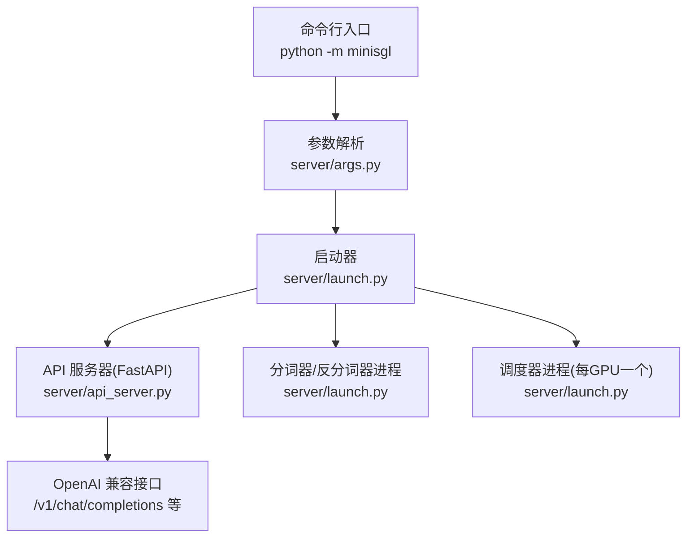
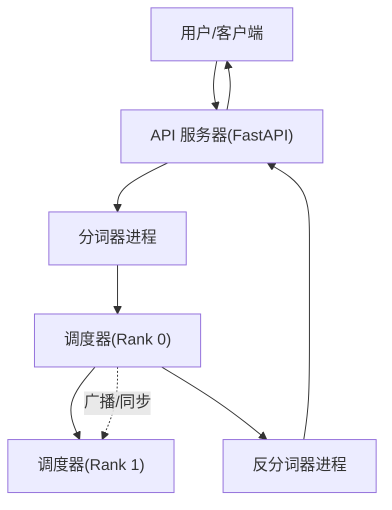
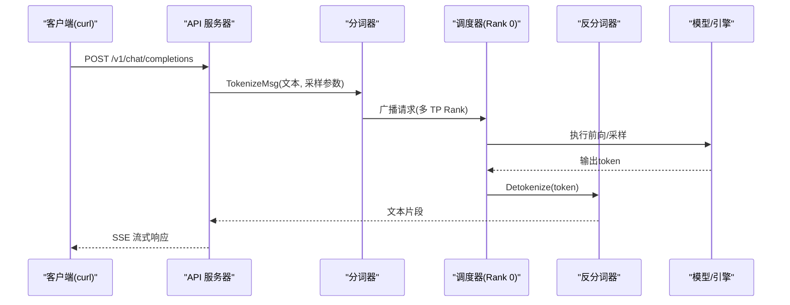
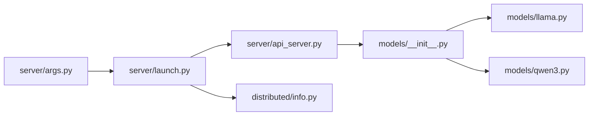

# 快速入门

<cite>
**本文引用的文件**
- [README.md](file://README.md)
- [pyproject.toml](file://pyproject.toml)
- [docs/features.md](file://docs/features.md)
- [docs/structures.md](file://docs/structures.md)
- [python/minisgl/shell.py](file://python/minisgl/shell.py)
- [python/minisgl/server/launch.py](file://python/minisgl/server/launch.py)
- [python/minisgl/server/api_server.py](file://python/minisgl/server/api_server.py)
- [python/minisgl/server/args.py](file://python/minisgl/server/args.py)
- [python/minisgl/models/__init__.py](file://python/minisgl/models/__init__.py)
- [python/minisgl/models/llama.py](file://python/minisgl/models/llama.py)
- [python/minisgl/models/qwen3.py](file://python/minisgl/models/qwen3.py)
- [python/minisgl/distributed/info.py](file://python/minisgl/distributed/info.py)
</cite>

## 目录
1. [简介](#简介)
2. [项目结构](#项目结构)
3. [核心组件](#核心组件)
4. [架构总览](#架构总览)
5. [详细组件解析](#详细组件解析)
6. [依赖关系分析](#依赖关系分析)
7. [性能与优化要点](#性能与优化要点)
8. [故障排查指南](#故障排查指南)
9. [结论](#结论)
10. [附录：端到端示例](#附录端到端示例)

## 简介
本教程面向新用户，帮助你在10分钟内完成 Mini-SGLang 的首次推理体验。你将学会：
- 启动 OpenAI 兼容的 API 服务
- 使用交互式 Shell 进行对话
- 通过 curl 发送 OpenAI 风格的请求
- 理解核心命令行参数（--model、--tp、--port、--shell）
- 了解不同模型（Qwen、Llama）的加载方式与分布式张量并行（TP）的启用方法

## 项目结构
Mini-SGLang 是一个轻量但高性能的 LLM 推理框架，采用多进程 + 分布式设计，包含 API 前端、分词器/反分词器工作进程、以及按 GPU 数量分布的调度器（TP Rank）等组件。其核心入口位于命令行模块，通过解析参数后启动服务与子进程。

图表来源
- [python/minisgl/server/launch.py](file://python/minisgl/server/launch.py#L40-L114)
- [python/minisgl/server/api_server.py](file://python/minisgl/server/api_server.py#L210-L426)
- [python/minisgl/server/args.py](file://python/minisgl/server/args.py#L54-L235)

章节来源
- [docs/structures.md](file://docs/structures.md#L1-L50)

## 核心组件
- 命令行入口与交互模式
  - 直接运行交互式 Shell：当传入 --shell 或 --shell-mode 时，入口会以交互模式启动。
  - 参考路径：[python/minisgl/shell.py](file://python/minisgl/shell.py#L1-L5)
- 参数解析与默认行为
  - 解析 --model-path、--dtype、--tensor-parallel-size、--host、--port、--cuda-graph-max-bs、--num-tokenizer、--attention-backend、--cache-type、--shell-mode 等。
  - 在 shell 模式下会覆盖部分参数（如禁用 CUDA 图、限制并发等）。
  - 参考路径：[python/minisgl/server/args.py](file://python/minisgl/server/args.py#L54-L235)
- 启动器与子进程管理
  - 启动多个调度器进程（对应 TP Rank），以及分词器/反分词器进程；等待各子进程“就绪”信号后再启动 API 服务。
  - 参考路径：[python/minisgl/server/launch.py](file://python/minisgl/server/launch.py#L40-L114)
- API 服务器（OpenAI 兼容）
  - 提供 /v1/chat/completions、/v1/models、/generate 等端点，支持流式返回。
  - 参考路径：[python/minisgl/server/api_server.py](file://python/minisgl/server/api_server.py#L210-L426)
- 模型选择与加载
  - 根据模型路径关键字自动选择 Llama 或 Qwen3 架构，并构建因果语言模型。
  - 参考路径：
    - [python/minisgl/models/__init__.py](file://python/minisgl/models/__init__.py#L8-L20)
    - [python/minisgl/models/llama.py](file://python/minisgl/models/llama.py#L69-L89)
    - [python/minisgl/models/qwen3.py](file://python/minisgl/models/qwen3.py#L69-L89)
- 分布式信息
  - 维护每个进程的 rank 和 world_size，用于 TP 广播/同步。
  - 参考路径：[python/minisgl/distributed/info.py](file://python/minisgl/distributed/info.py#L6-L39)

章节来源
- [python/minisgl/shell.py](file://python/minisgl/shell.py#L1-L5)
- [python/minisgl/server/args.py](file://python/minisgl/server/args.py#L54-L235)
- [python/minisgl/server/launch.py](file://python/minisgl/server/launch.py#L40-L114)
- [python/minisgl/server/api_server.py](file://python/minisgl/server/api_server.py#L210-L426)
- [python/minisgl/models/__init__.py](file://python/minisgl/models/__init__.py#L8-L20)
- [python/minisgl/models/llama.py](file://python/minisgl/models/llama.py#L69-L89)
- [python/minisgl/models/qwen3.py](file://python/minisgl/models/qwen3.py#L69-L89)
- [python/minisgl/distributed/info.py](file://python/minisgl/distributed/info.py#L6-L39)

## 架构总览
Mini-SGLang 的系统由以下组件构成：
- API Server：接收请求，转发给分词器，再由调度器广播到所有 TP Rank，最后由反分词器返回文本。
- Tokenizer/Detokenizer：负责文本与 token 的双向转换。
- Scheduler（每 GPU 一个）：在本地 GPU 上执行推理，协调 KV Cache、注意力后端与 CUDA Graph。

图表来源
- [docs/structures.md](file://docs/structures.md#L1-L50)
- [python/minisgl/server/launch.py](file://python/minisgl/server/launch.py#L40-L114)
- [python/minisgl/server/api_server.py](file://python/minisgl/server/api_server.py#L210-L426)

## 详细组件解析

### 命令行参数与启动流程
- 关键参数
  - --model-path：模型权重路径（本地目录或 HuggingFace 仓库 ID）
  - --dtype：权重与激活的数据类型（auto/float16/bfloat16/float32）
  - --tensor-parallel-size/--tp-size：张量并行规模（TP Rank 数）
  - --host/--port：API 服务器监听地址与端口
  - --cuda-graph-max-bs/--graph：CUDA Graph 最大批尺寸
  - --num-tokenizer/--tokenizer-count：分词器进程数（0 表示与反分词器共享）
  - --attention-backend/--attn：注意力后端（prefill/decode 可分别指定）
  - --cache-type：KV Cache 类型（naive/radix）
  - --shell-mode/--shell：以交互式 Shell 模式启动
- 启动流程
  - 解析参数后，启动多个调度器进程（每 GPU 一个），并启动分词器/反分词器进程；等待子进程“就绪”后启动 API 服务。
  - 参考路径：
    - [python/minisgl/server/args.py](file://python/minisgl/server/args.py#L54-L235)
    - [python/minisgl/server/launch.py](file://python/minisgl/server/launch.py#L40-L114)

章节来源
- [python/minisgl/server/args.py](file://python/minisgl/server/args.py#L54-L235)
- [python/minisgl/server/launch.py](file://python/minisgl/server/launch.py#L40-L114)

### OpenAI 兼容 API 与交互式 Shell
- OpenAI 兼容接口
  - /v1/chat/completions：支持 messages/prompt、stream、temperature/top_p/max_tokens 等参数
  - /v1/models：列出可用模型
  - /generate：基础生成接口
  - 参考路径：[python/minisgl/server/api_server.py](file://python/minisgl/server/api_server.py#L210-L426)
- 交互式 Shell
  - 支持 /reset 清空历史、/exit 退出
  - 自动维护对话历史并在流式输出中增量打印
  - 参考路径：[python/minisgl/server/api_server.py](file://python/minisgl/server/api_server.py#L326-L383)

章节来源
- [python/minisgl/server/api_server.py](file://python/minisgl/server/api_server.py#L210-L426)
- [python/minisgl/server/api_server.py](file://python/minisgl/server/api_server.py#L326-L383)

### 模型加载与分布式张量并行（TP）
- 模型选择
  - 根据模型路径包含的关键字自动选择 Llama 或 Qwen3 架构
  - 参考路径：
    - [python/minisgl/models/__init__.py](file://python/minisgl/models/__init__.py#L8-L20)
    - [python/minisgl/models/llama.py](file://python/minisgl/models/llama.py#L69-L89)
    - [python/minisgl/models/qwen3.py](file://python/minisgl/models/qwen3.py#L69-L89)
- 分布式信息
  - 每个进程持有 DistributedInfo(rank, size)，用于主进程广播与同步
  - 参考路径：[python/minisgl/distributed/info.py](file://python/minisgl/distributed/info.py#L6-L39)
- 启用 TP
  - 通过 --tensor-parallel-size/--tp-size 指定 TP 规模，启动器会为每个 rank 启动一个调度器进程
  - 参考路径：
    - [python/minisgl/server/args.py](file://python/minisgl/server/args.py#L82-L87)
    - [python/minisgl/server/launch.py](file://python/minisgl/server/launch.py#L54-L70)

章节来源
- [python/minisgl/models/__init__.py](file://python/minisgl/models/__init__.py#L8-L20)
- [python/minisgl/models/llama.py](file://python/minisgl/models/llama.py#L69-L89)
- [python/minisgl/models/qwen3.py](file://python/minisgl/models/qwen3.py#L69-L89)
- [python/minisgl/distributed/info.py](file://python/minisgl/distributed/info.py#L6-L39)
- [python/minisgl/server/args.py](file://python/minisgl/server/args.py#L82-L87)
- [python/minisgl/server/launch.py](file://python/minisgl/server/launch.py#L54-L70)

### API 调用序列（OpenAI 兼容）

图表来源
- [python/minisgl/server/api_server.py](file://python/minisgl/server/api_server.py#L244-L273)
- [python/minisgl/server/launch.py](file://python/minisgl/server/launch.py#L40-L114)

## 依赖关系分析
- 外部依赖
  - PyTorch、Transformers、FastAPI、Uvicorn、PyZMQ、FlashInfer、Apache TVM FFI 等
  - 参考路径：[pyproject.toml](file://pyproject.toml#L24-L37)
- 内部模块耦合
  - server/args.py 与 server/launch.py/args.py 协作解析参数并启动子进程
  - server/api_server.py 与 message/queue 抽象对接，实现前后端通信
  - models/__init__.py 根据模型路径选择具体实现
  - distributed/info.py 为调度器提供分布式上下文

图表来源
- [python/minisgl/server/args.py](file://python/minisgl/server/args.py#L54-L235)
- [python/minisgl/server/launch.py](file://python/minisgl/server/launch.py#L40-L114)
- [python/minisgl/server/api_server.py](file://python/minisgl/server/api_server.py#L210-L426)
- [python/minisgl/models/__init__.py](file://python/minisgl/models/__init__.py#L8-L20)
- [python/minisgl/models/llama.py](file://python/minisgl/models/llama.py#L69-L89)
- [python/minisgl/models/qwen3.py](file://python/minisgl/models/qwen3.py#L69-L89)
- [python/minisgl/distributed/info.py](file://python/minisgl/distributed/info.py#L6-L39)

章节来源
- [pyproject.toml](file://pyproject.toml#L24-L37)
- [python/minisgl/server/args.py](file://python/minisgl/server/args.py#L54-L235)
- [python/minisgl/server/launch.py](file://python/minisgl/server/launch.py#L40-L114)
- [python/minisgl/server/api_server.py](file://python/minisgl/server/api_server.py#L210-L426)
- [python/minisgl/models/__init__.py](file://python/minisgl/models/__init__.py#L8-L20)
- [python/minisgl/models/llama.py](file://python/minisgl/models/llama.py#L69-L89)
- [python/minisgl/models/qwen3.py](file://python/minisgl/models/qwen3.py#L69-L89)
- [python/minisgl/distributed/info.py](file://python/minisgl/distributed/info.py#L6-L39)

## 性能与优化要点
- 注意力后端
  - 支持 fa3（prefill）、fi（decode）等组合，默认根据硬件选择最优配置
  - 可通过 --attn 指定
  - 参考路径：[docs/features.md](file://docs/features.md#L32-L37)
- Chunked Prefill
  - 将长提示拆分为小块，降低峰值显存占用
  - 可通过 --max-prefill-length 调整
  - 参考路径：[docs/features.md](file://docs/features.md#L28-L31)
- CUDA Graph
  - 通过捕获与重放减少 CPU launch 开销
  - 可通过 --cuda-graph-max-bs 控制
  - 参考路径：[docs/features.md](file://docs/features.md#L38-L41)
- Radix Cache
  - 对共享前缀复用 KV Cache，减少重复计算
  - 可通过 --cache-type 切换
  - 参考路径：[docs/features.md](file://docs/features.md#L42-L47)
- Overlap Scheduling
  - 隐藏 CPU 调度开销，提升吞吐
  - 参考路径：[docs/features.md](file://docs/features.md#L49-L55)

章节来源
- [docs/features.md](file://docs/features.md#L28-L55)

## 故障排查指南
- 无法启动 API 服务
  - 检查 --port 是否被占用；确认 --host 与网络可达
  - 参考路径：[python/minisgl/server/api_server.py](file://python/minisgl/server/api_server.py#L400-L426)
- Shell 模式异常
  - Shell 模式不支持 --dummy-weight；请移除该参数
  - 参考路径：[python/minisgl/server/api_server.py](file://python/minisgl/server/api_server.py#L397-L400)
- 模型加载失败
  - 确认 --model-path 包含 "llama" 或 "qwen3" 关键字，或使用受支持的模型仓库 ID
  - 参考路径：
    - [python/minisgl/models/__init__.py](file://python/minisgl/models/__init__.py#L8-L20)
    - [README.md](file://README.md#L51-L60)
- 分布式问题
  - 确保 --tensor-parallel-size 与实际 GPU 数一致；检查 NCCL/PyTorch 分布式环境
  - 参考路径：
    - [python/minisgl/server/args.py](file://python/minisgl/server/args.py#L82-L87)
    - [python/minisgl/server/launch.py](file://python/minisgl/server/launch.py#L54-L70)

章节来源
- [python/minisgl/server/api_server.py](file://python/minisgl/server/api_server.py#L397-L426)
- [python/minisgl/models/__init__.py](file://python/minisgl/models/__init__.py#L8-L20)
- [README.md](file://README.md#L51-L60)
- [python/minisgl/server/args.py](file://python/minisgl/server/args.py#L82-L87)
- [python/minisgl/server/launch.py](file://python/minisgl/server/launch.py#L54-L70)

## 结论
通过本教程，你已掌握：
- 使用 python -m minisgl 快速启动 OpenAI 兼容服务
- 在交互式 Shell 中进行对话
- 通过 curl 调用 /v1/chat/completions 完成端到端推理
- 理解 --model、--tp、--port、--shell 等核心参数的作用
- 了解 Qwen 与 Llama 的加载方式及分布式张量并行的启用方法

建议进一步阅读：
- [docs/features.md](file://docs/features.md) 获取特性与参数详解
- [docs/structures.md](file://docs/structures.md) 了解系统架构与数据流

## 附录：端到端示例
- 启动服务（单卡 Qwen/Qwen3）
  - 示例命令：参考 [README.md](file://README.md#L51-L60)
- 启动服务（多卡 Llama-3.1-70B，TP=4）
  - 示例命令：参考 [README.md](file://README.md#L57-L59)
- 交互式 Shell
  - 示例命令：参考 [README.md](file://README.md#L63-L71)
- 使用 curl 调用
  - 请求体字段：messages/prompt、max_tokens、temperature、top_p、stream、stop 等
  - 端点：/v1/chat/completions
  - 参考路径：[python/minisgl/server/api_server.py](file://python/minisgl/server/api_server.py#L244-L273)

章节来源
- [README.md](file://README.md#L51-L71)
- [python/minisgl/server/api_server.py](file://python/minisgl/server/api_server.py#L244-L273)