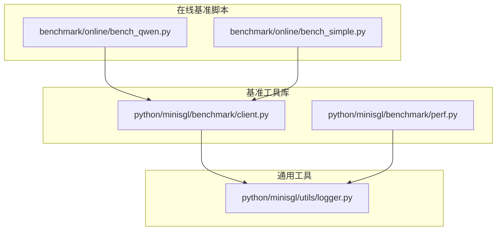
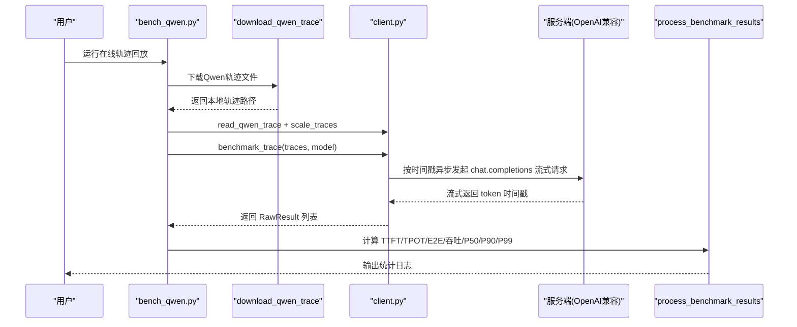
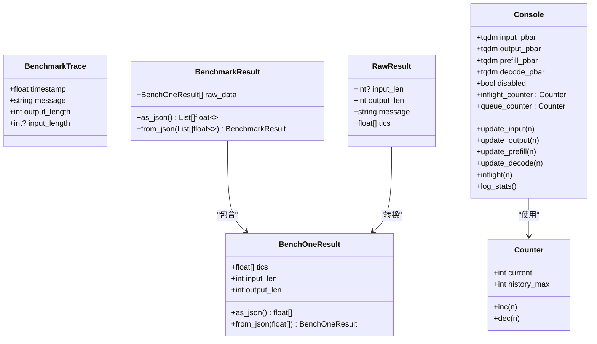
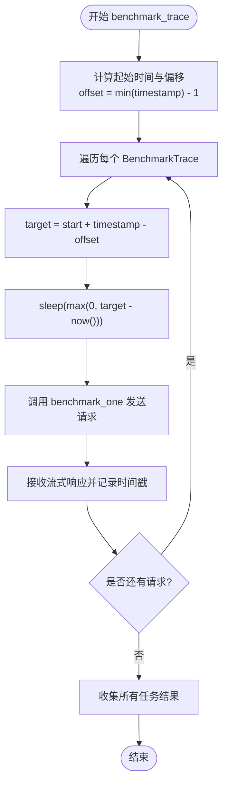
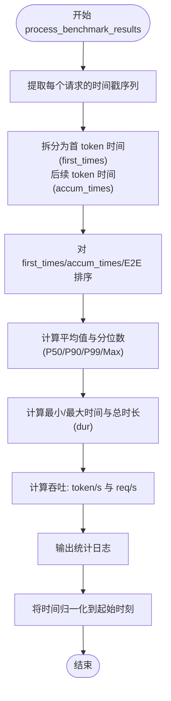
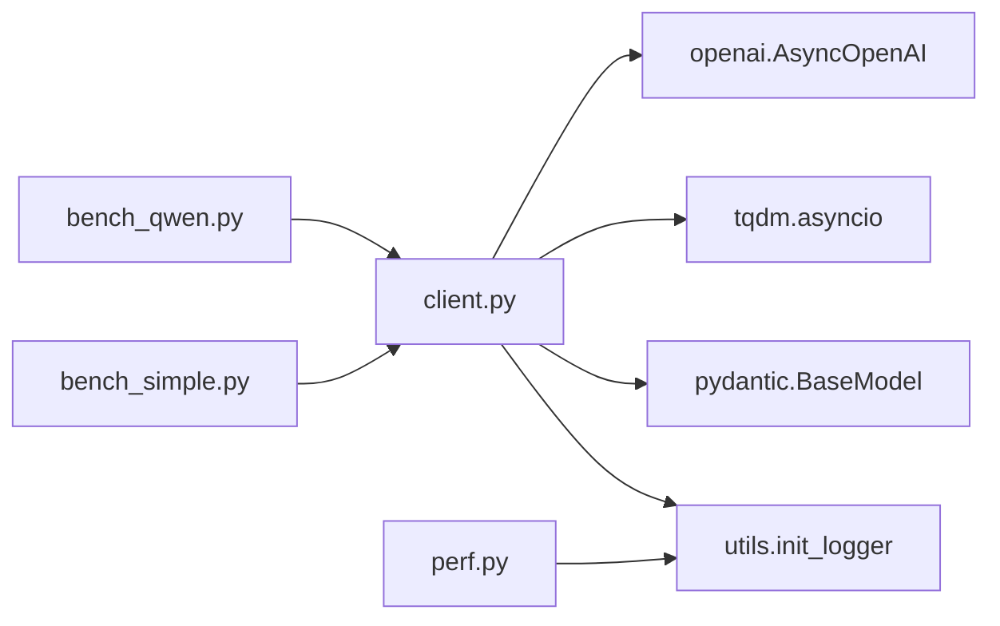

# 在线基准测试

<cite>
**本文引用的文件列表**
- [bench_qwen.py](file://benchmark/online/bench_qwen.py)
- [bench_simple.py](file://benchmark/online/bench_simple.py)
- [client.py](file://python/minisgl/benchmark/client.py)
- [perf.py](file://python/minisgl/benchmark/perf.py)
- [logger.py](file://python/minisgl/utils/logger.py)
- [README.md](file://README.md)
</cite>

## 目录
1. [简介](#简介)
2. [项目结构](#项目结构)
3. [核心组件](#核心组件)
4. [架构总览](#架构总览)
5. [详细组件分析](#详细组件分析)
6. [依赖关系分析](#依赖关系分析)
7. [性能考量](#性能考量)
8. [故障排查指南](#故障排查指南)
9. [结论](#结论)
10. [附录](#附录)

## 简介
本文件深入解析在线基准测试框架的工作机制，聚焦以下目标：
- bench_qwen.py 如何通过 download_qwen_trace 从远程下载 Qwen 用户请求轨迹数据，并使用 scale_traces 调整请求到达速率以测试不同负载场景（从 0.4x 到 1.6x）。
- client.py 中 benchmark_trace 函数如何基于时间戳异步发送请求，并利用 Console 类实时显示请求发送、预填充、解码与完成的进度条。
- process_benchmark_results 如何计算关键性能指标：首 token 延迟（TTFT）、每 token 处理时间（TPOT）、端到端延迟（E2E）、吞吐量（token/s 和 req/s），以及 P50/P90/P99 分位数。
- bench_simple.py 作为简化版本，用于测试基本的并发请求处理能力。

## 项目结构
在线基准测试相关代码主要分布在两个目录：
- benchmark/online：包含在线基准脚本，分别面向真实轨迹回放与简单并发测试。
- python/minisgl/benchmark：包含客户端基准工具、结果处理与性能辅助模块。

图表来源
- [bench_qwen.py](file://benchmark/online/bench_qwen.py#L1-L56)
- [bench_simple.py](file://benchmark/online/bench_simple.py#L1-L82)
- [client.py](file://python/minisgl/benchmark/client.py#L1-L502)
- [perf.py](file://python/minisgl/benchmark/perf.py#L1-L75)
- [logger.py](file://python/minisgl/utils/logger.py#L1-L129)

章节来源
- [bench_qwen.py](file://benchmark/online/bench_qwen.py#L1-L56)
- [bench_simple.py](file://benchmark/online/bench_simple.py#L1-L82)
- [client.py](file://python/minisgl/benchmark/client.py#L1-L502)
- [perf.py](file://python/minisgl/benchmark/perf.py#L1-L75)
- [logger.py](file://python/minisgl/utils/logger.py#L1-L129)

## 核心组件
- bench_qwen.py：在线轨迹回放基准入口，负责下载轨迹、读取与缩放轨迹、调用 benchmark_trace 并输出统计。
- bench_simple.py：简化并发基准入口，负责生成随机提示、批量测试连接与吞吐。
- client.py：核心基准逻辑，提供生成提示、单请求/批量请求基准、按时间戳回放、结果处理与进度条等。
- perf.py：CUDA 性能测量辅助（与在线基准同模块，便于对比内核性能）。
- logger.py：统一日志初始化与格式化，支持颜色输出与多进程/多卡信息。

章节来源
- [bench_qwen.py](file://benchmark/online/bench_qwen.py#L1-L56)
- [bench_simple.py](file://benchmark/online/bench_simple.py#L1-L82)
- [client.py](file://python/minisgl/benchmark/client.py#L1-L502)
- [perf.py](file://python/minisgl/benchmark/perf.py#L1-L75)
- [logger.py](file://python/minisgl/utils/logger.py#L1-L129)

## 架构总览
整体流程分为“数据准备—请求调度—流式响应—统计分析”四个阶段。

图表来源
- [bench_qwen.py](file://benchmark/online/bench_qwen.py#L24-L56)
- [client.py](file://python/minisgl/benchmark/client.py#L287-L405)

## 详细组件分析

### bench_qwen.py：轨迹回放与速率缩放
- 下载轨迹：download_qwen_trace 会在本地不存在时从指定 URL 下载，并记录日志。
- 读取与缩放：read_qwen_trace 将 JSONL 行解析为 BenchmarkTrace；scale_traces 将时间戳按比例缩放，实现 0.4x 到 1.6x 的不同负载场景。
- 执行流程：main 中创建 OpenAI 客户端，获取模型名与分词器，构造 traces，逐个 scale 后调用 benchmark_trace，最后 process_benchmark_results 输出统计。

章节来源
- [bench_qwen.py](file://benchmark/online/bench_qwen.py#L24-L56)
- [client.py](file://python/minisgl/benchmark/client.py#L407-L496)

### bench_simple.py：简化并发测试
- 连接测试：先生成少量提示，调用 benchmark_one 做一次短输出的请求，验证服务连通性。
- 批量测试：生成固定数量的消息与对应输出长度，调用 benchmark_one_batch 并输出统计。
- 参数配置：支持设置最大输入长度、批大小等，便于快速评估并发与吞吐。

章节来源
- [bench_simple.py](file://benchmark/online/bench_simple.py#L1-L82)
- [client.py](file://python/minisgl/benchmark/client.py#L251-L285)

### client.py：请求调度与进度条
- 数据结构
  - BenchmarkTrace：包含时间戳、消息、输出长度与可选输入长度。
  - RawResult/BenchOneResult：保存各请求的时间戳序列与输入/输出长度。
  - Console：封装进度条与计数器，跟踪“已发送/已完成/预填充/解码”的进度与队列/在途请求数的历史峰值。
- 关键函数
  - generate_prompt：基于分词器生成近似长度的提示文本。
  - benchmark_one：单请求异步流式推理，记录首 token 与后续每个 token 的时间点，更新进度条。
  - benchmark_one_batch：批量并发执行，内部聚合所有任务。
  - benchmark_trace：按时间戳严格对齐，使用 asyncio.sleep 精确控制到达时刻，再调用 benchmark_one。
  - process_benchmark_results：计算 TTFT、TPOT、E2E、吞吐与分位数，并输出日志。
  - read_qwen_trace/read_mooncake_trace：解析外部轨迹文件为 BenchmarkTrace 列表。
  - scale_traces：将轨迹时间戳按比例缩放并保持有序。
  - get_model_name：获取可用模型 ID。

图表来源
- [client.py](file://python/minisgl/benchmark/client.py#L18-L122)
- [client.py](file://python/minisgl/benchmark/client.py#L124-L181)
- [client.py](file://python/minisgl/benchmark/client.py#L183-L200)
- [client.py](file://python/minisgl/benchmark/client.py#L202-L249)
- [client.py](file://python/minisgl/benchmark/client.py#L251-L285)
- [client.py](file://python/minisgl/benchmark/client.py#L287-L309)
- [client.py](file://python/minisgl/benchmark/client.py#L320-L405)
- [client.py](file://python/minisgl/benchmark/client.py#L407-L496)

章节来源
- [client.py](file://python/minisgl/benchmark/client.py#L18-L122)
- [client.py](file://python/minisgl/benchmark/client.py#L124-L181)
- [client.py](file://python/minisgl/benchmark/client.py#L183-L200)
- [client.py](file://python/minisgl/benchmark/client.py#L202-L249)
- [client.py](file://python/minisgl/benchmark/client.py#L251-L285)
- [client.py](file://python/minisgl/benchmark/client.py#L287-L309)
- [client.py](file://python/minisgl/benchmark/client.py#L320-L405)
- [client.py](file://python/minisgl/benchmark/client.py#L407-L496)

### benchmark_trace 请求调度流程
该流程确保请求严格按轨迹时间戳到达，从而复现真实流量模式。

图表来源
- [client.py](file://python/minisgl/benchmark/client.py#L287-L309)

章节来源
- [client.py](file://python/minisgl/benchmark/client.py#L287-L309)

### process_benchmark_results 统计流程
该流程计算 TTFT、TPOT、E2E、吞吐与分位数，并输出日志。

图表来源
- [client.py](file://python/minisgl/benchmark/client.py#L320-L390)

章节来源
- [client.py](file://python/minisgl/benchmark/client.py#L320-L390)

## 依赖关系分析
- bench_qwen.py 依赖 client.py 的轨迹读取、缩放与基准执行函数。
- bench_simple.py 依赖 client.py 的单请求/批量请求与结果处理。
- client.py 依赖 OpenAI 异步客户端、tqdm 进度条、Pydantic 数据校验、自定义日志工具。
- perf.py 提供 CUDA 性能测量辅助，便于与在线基准在同一模块下进行内核性能对比。

图表来源
- [bench_qwen.py](file://benchmark/online/bench_qwen.py#L1-L56)
- [bench_simple.py](file://benchmark/online/bench_simple.py#L1-L82)
- [client.py](file://python/minisgl/benchmark/client.py#L1-L502)
- [perf.py](file://python/minisgl/benchmark/perf.py#L1-L75)
- [logger.py](file://python/minisgl/utils/logger.py#L1-L129)

章节来源
- [bench_qwen.py](file://benchmark/online/bench_qwen.py#L1-L56)
- [bench_simple.py](file://benchmark/online/bench_simple.py#L1-L82)
- [client.py](file://python/minisgl/benchmark/client.py#L1-L502)
- [perf.py](file://python/minisgl/benchmark/perf.py#L1-L75)
- [logger.py](file://python/minisgl/utils/logger.py#L1-L129)

## 性能考量
- TTFT/TPOT/E2E 的计算基于流式响应的时间戳差分，需确保服务端返回的流事件顺序正确且无丢帧。
- 吞吐计算使用“总 token 数 / 总时长”，建议在长时间稳定运行后采集，避免启动抖动影响。
- 分位数统计对异常值敏感，建议多次运行取稳健估计或剔除极端样本。
- benchmark_trace 使用精确 sleep 控制到达时刻，网络抖动与服务端调度可能引入微小偏差，可在高并发场景下适当放宽容差。

## 故障排查指南
- 无法连接服务端
  - 确认服务端已启动并在指定端口提供 OpenAI 兼容接口。
  - bench_simple.py 在连接测试失败时会打印警告并退出，请检查端口号与服务状态。
- 轨迹下载失败
  - bench_qwen.py 会在本地不存在时自动下载，若网络受限可手动下载并放置于脚本同目录。
- 结果为空或统计异常
  - process_benchmark_results 要求 dur > 0，若出现断言失败，检查请求是否成功返回或时间戳是否被截断。
- 进度条不显示
  - Console 支持禁用模式，若 pbar=False 或环境不支持终端进度条，进度条将被禁用。

章节来源
- [bench_simple.py](file://benchmark/online/bench_simple.py#L44-L78)
- [bench_qwen.py](file://benchmark/online/bench_qwen.py#L24-L34)
- [client.py](file://python/minisgl/benchmark/client.py#L320-L390)

## 结论
本在线基准测试框架通过真实用户轨迹回放与速率缩放，结合严格的异步调度与流式时间戳采集，能够稳定地评估服务端在不同负载下的 TTFT、TPOT、E2E、吞吐与分位数表现。简化版 bench_simple 则适合快速验证并发与基础吞吐能力。配合统一的日志与进度条展示，便于在开发与运维场景中持续监控与优化。

## 附录
- 在线基准使用说明与示例命令可参考项目文档中的在线推理部分。

章节来源
- [README.md](file://README.md#L91-L118)