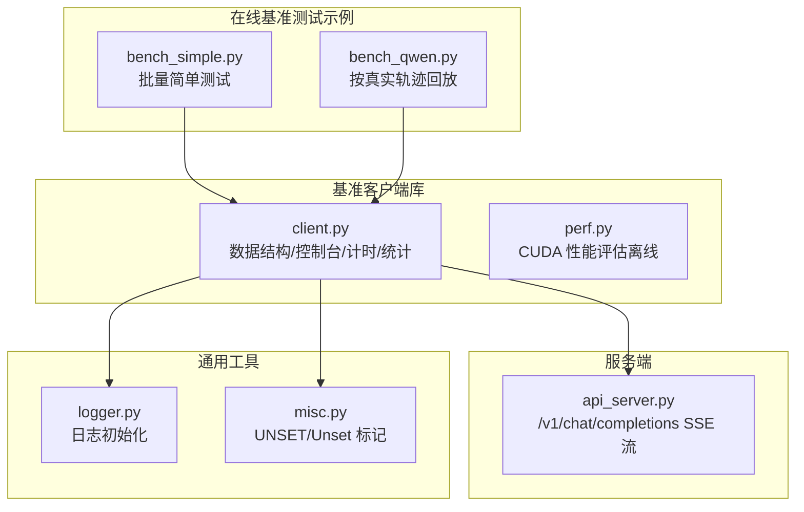
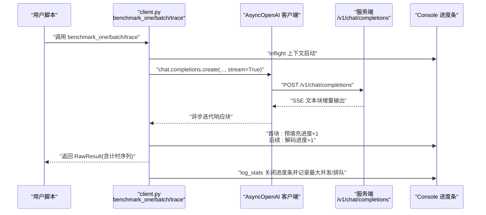
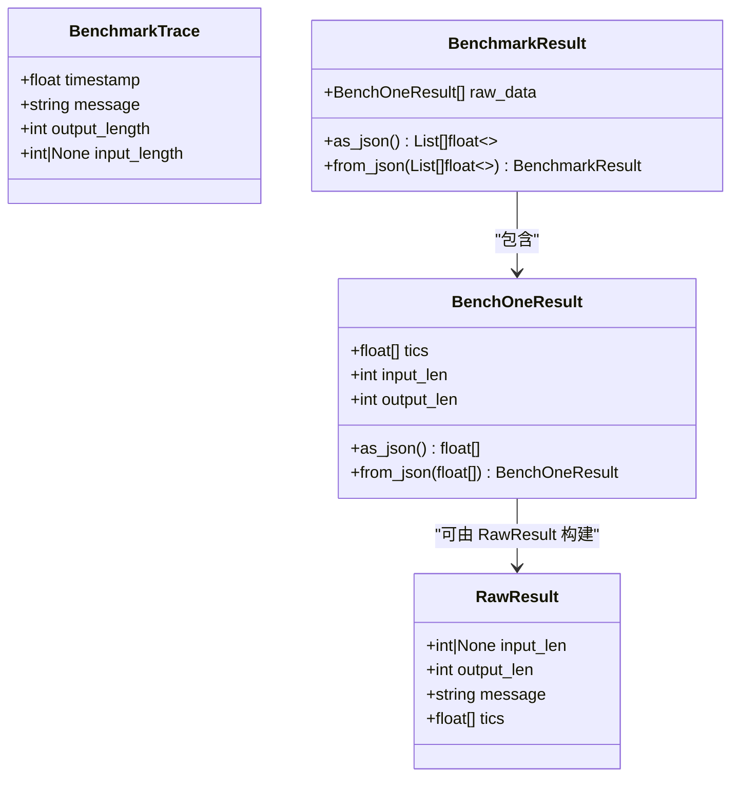
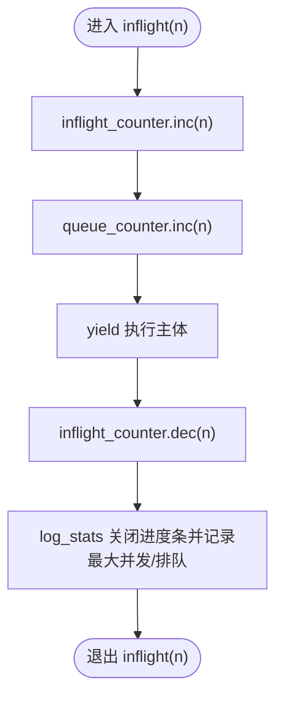
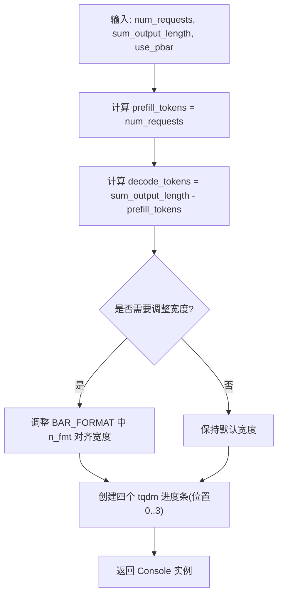
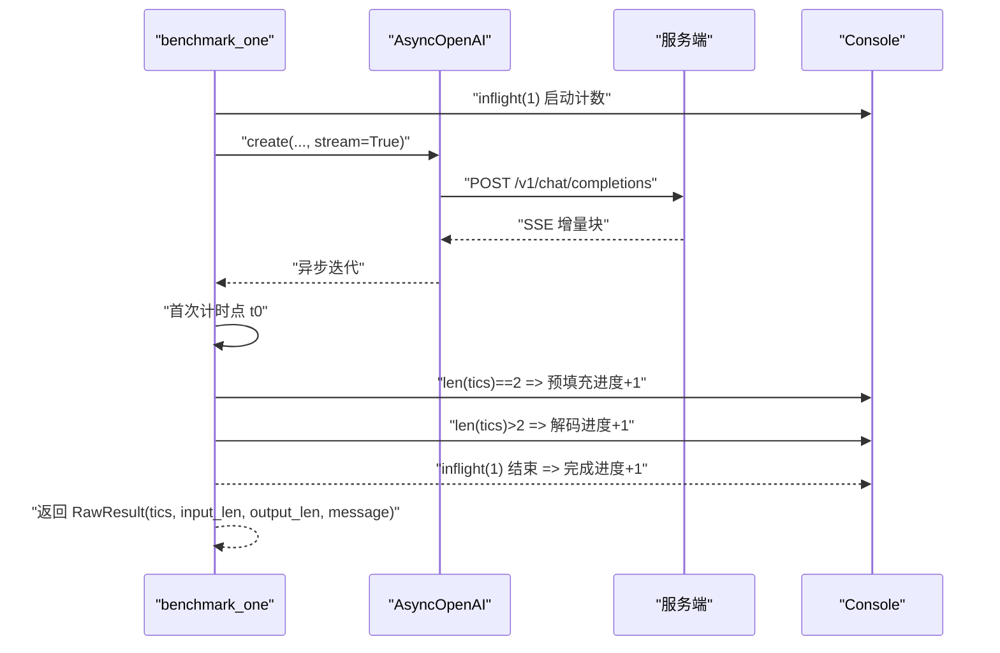
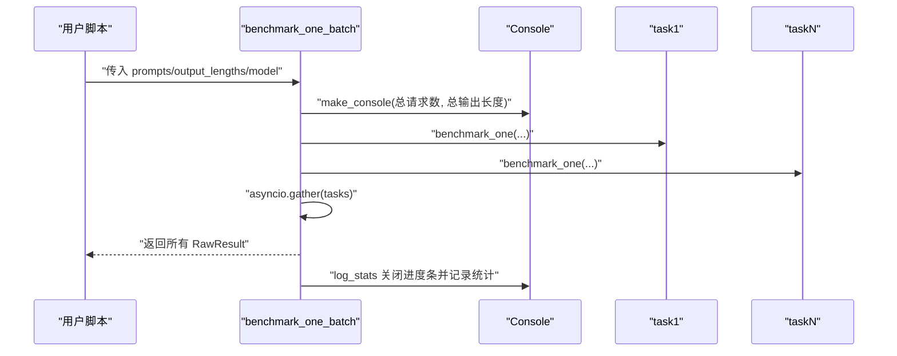
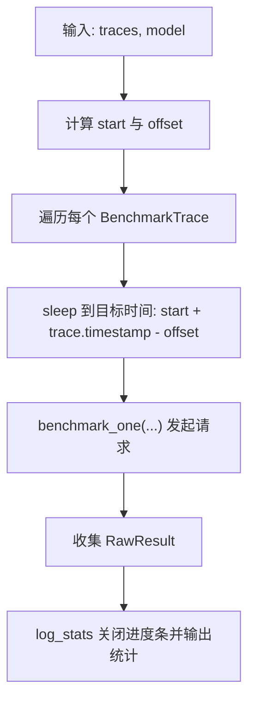
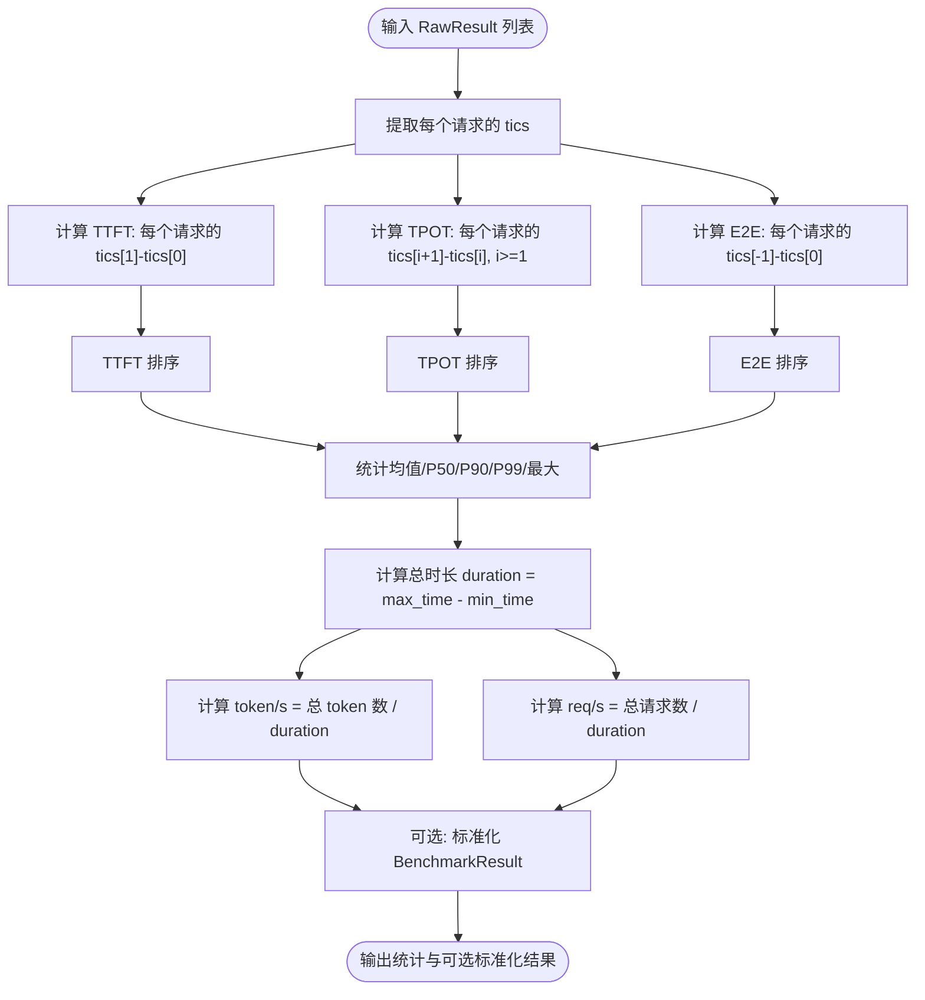
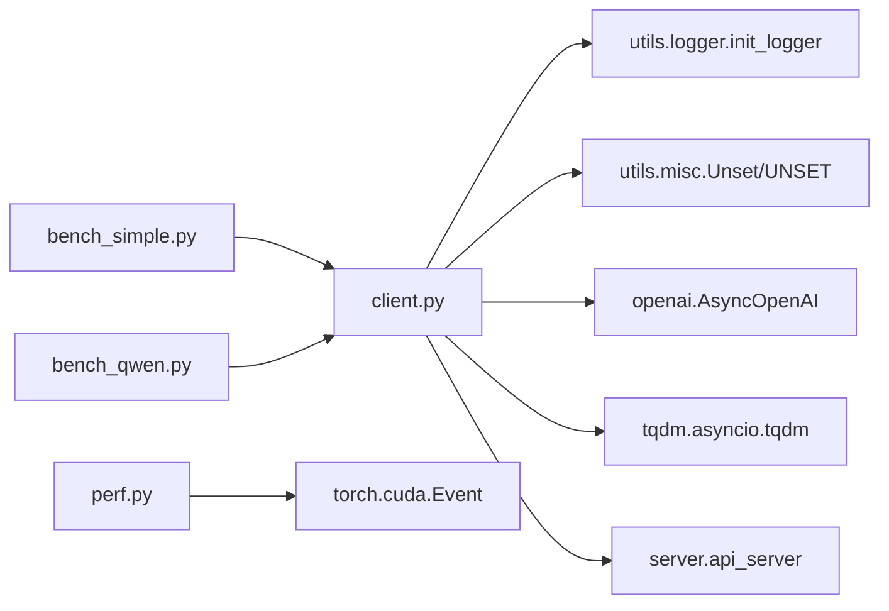

# 基准测试客户端核心

<cite>
**本文引用的文件**
- [python/minisgl/benchmark/client.py](file://python/minisgl/benchmark/client.py)
- [python/minisgl/benchmark/perf.py](file://python/minisgl/benchmark/perf.py)
- [benchmark/online/bench_simple.py](file://benchmark/online/bench_simple.py)
- [benchmark/online/bench_qwen.py](file://benchmark/online/bench_qwen.py)
- [python/minisgl/server/api_server.py](file://python/minisgl/server/api_server.py)
- [python/minisgl/utils/logger.py](file://python/minisgl/utils/logger.py)
- [python/minisgl/utils/misc.py](file://python/minisgl/utils/misc.py)
</cite>

## 目录
1. [引言](#引言)
2. [项目结构](#项目结构)
3. [核心组件](#核心组件)
4. [架构总览](#架构总览)
5. [详细组件分析](#详细组件分析)
6. [依赖关系分析](#依赖关系分析)
7. [性能考量](#性能考量)
8. [故障排查指南](#故障排查指南)
9. [结论](#结论)
10. [附录](#附录)

## 引言
本文件面向“在线基准测试客户端”的核心组件与工作机制，聚焦以下目标：
- 全面解析关键数据结构：BenchmarkTrace（带时间戳的请求轨迹）、RawResult（原始计时数据）、BenchOneResult 与 BenchmarkResult（标准化结果输出）。
- 深入讲解 Console 类如何基于 tqdm 实现多维度实时进度监控（请求发送、完成、预填充、解码），并通过 inflight 上下文管理器确保并发计数准确。
- 讲解 make_console 如何依据总请求数与输出 token 数动态调整进度条显示格式。
- 阐述 benchmark_one 与 benchmark_one_batch 的异步实现机制，包括流式响应处理、计时点插入与错误处理策略。
- 分析 process_benchmark_results 的统计分析算法，覆盖 TTFT、TPOT、E2E 延迟提取、排序、分位数计算与吞吐量推导。

## 项目结构
该仓库包含在线基准测试示例脚本与核心客户端库。在线基准测试主要位于 benchmark/online 下，核心逻辑集中在 python/minisgl/benchmark/client.py；服务端接口遵循 OpenAI 风格，位于 python/minisgl/server/api_server.py。

图表来源
- [benchmark/online/bench_simple.py](file://benchmark/online/bench_simple.py#L1-L82)
- [benchmark/online/bench_qwen.py](file://benchmark/online/bench_qwen.py#L1-L56)
- [python/minisgl/benchmark/client.py](file://python/minisgl/benchmark/client.py#L1-L502)
- [python/minisgl/benchmark/perf.py](file://python/minisgl/benchmark/perf.py#L1-L75)
- [python/minisgl/server/api_server.py](file://python/minisgl/server/api_server.py#L244-L273)
- [python/minisgl/utils/logger.py](file://python/minisgl/utils/logger.py#L1-L129)
- [python/minisgl/utils/misc.py](file://python/minisgl/utils/misc.py#L1-L41)

章节来源
- [benchmark/online/bench_simple.py](file://benchmark/online/bench_simple.py#L1-L82)
- [benchmark/online/bench_qwen.py](file://benchmark/online/bench_qwen.py#L1-L56)
- [python/minisgl/benchmark/client.py](file://python/minisgl/benchmark/client.py#L1-L502)
- [python/minisgl/server/api_server.py](file://python/minisgl/server/api_server.py#L244-L273)

## 核心组件
- 数据结构
  - BenchmarkTrace：记录带时间戳的消息、输出长度与可选输入长度，用于按真实轨迹回放。
  - RawResult：承载单次请求的计时序列、输入长度、输出长度与提示词。
  - BenchOneResult：标准化单次结果，便于序列化与后续统计。
  - BenchmarkResult：标准化批量结果集合，支持 JSON 序列化/反序列化。
- 控制台与计数
  - Console：封装四个 tqdm 进度条（请求发送、完成、预填充、解码），提供 update_* 方法与 inflight/queue 计数器，log_stats 在结束时汇总最大并发与排队数。
  - Counter：维护当前并发与历史最大并发，保证计数正确性。
- 异步基准执行
  - benchmark_one：创建流式聊天补全，逐块计时，首块触发预填充进度，后续每块触发解码进度。
  - benchmark_one_batch：批量并发执行 benchmark_one，使用 asyncio.gather 聚合结果。
  - benchmark_trace：按 BenchmarkTrace 时间轴调度并发请求，实现真实轨迹回放。
- 统计分析
  - process_benchmark_results：从 RawResult 中提取 TTFT、TPOT、E2E，排序后计算均值、P50、P90、P99、最大值，推导吞吐量，并可返回标准化 BenchmarkResult。

章节来源
- [python/minisgl/benchmark/client.py](file://python/minisgl/benchmark/client.py#L18-L122)
- [python/minisgl/benchmark/client.py](file://python/minisgl/benchmark/client.py#L50-L111)
- [python/minisgl/benchmark/client.py](file://python/minisgl/benchmark/client.py#L202-L249)
- [python/minisgl/benchmark/client.py](file://python/minisgl/benchmark/client.py#L251-L285)
- [python/minisgl/benchmark/client.py](file://python/minisgl/benchmark/client.py#L287-L309)
- [python/minisgl/benchmark/client.py](file://python/minisgl/benchmark/client.py#L320-L405)

## 架构总览
基准客户端通过 OpenAI Async 客户端向服务端发起流式聊天补全请求，服务端以 SSE 文本块形式返回增量内容。客户端在收到每个增量块时插入计时点，并更新对应进度条。最终由 process_benchmark_results 进行统计分析。

图表来源
- [python/minisgl/benchmark/client.py](file://python/minisgl/benchmark/client.py#L202-L249)
- [python/minisgl/benchmark/client.py](file://python/minisgl/benchmark/client.py#L251-L285)
- [python/minisgl/benchmark/client.py](file://python/minisgl/benchmark/client.py#L287-L309)
- [python/minisgl/server/api_server.py](file://python/minisgl/server/api_server.py#L244-L273)

## 详细组件分析

### 数据结构与序列化
- BenchmarkTrace：携带时间戳、消息、输出长度与可选输入长度，用于轨迹回放。
- RawResult：保存单次请求的计时序列 tics、输入长度、输出长度与提示词。
- BenchOneResult：标准化为 [input_len, output_len, tics...]，支持 JSON 序列化/反序列化。
- BenchmarkResult：标准化批量结果，支持 JSON 序列化/反序列化。

图表来源
- [python/minisgl/benchmark/client.py](file://python/minisgl/benchmark/client.py#L18-L122)

章节来源
- [python/minisgl/benchmark/client.py](file://python/minisgl/benchmark/client.py#L18-L122)

### Console 进度条与并发计数
- 四个进度条分别追踪：
  - Requests sent：已发送的请求数。
  - Requests done：已完成的请求数。
  - Prefill token：预填充阶段累计生成的 token 数。
  - Decode token：解码阶段累计生成的 token 数。
- inflight/queue 计数器：
  - inflight_counter：每次 update_input 增加，update_output 减少，记录历史最大并发。
  - queue_counter：每次 update_input 增加，update_prefill 减少，记录历史最大排队。
- inflight 上下文管理器：在进入时增加计数，在退出时减少计数，确保计数准确性。
- log_stats：在 with 块结束后关闭进度条并记录最大并发与最大排队。

图表来源
- [python/minisgl/benchmark/client.py](file://python/minisgl/benchmark/client.py#L64-L111)

章节来源
- [python/minisgl/benchmark/client.py](file://python/minisgl/benchmark/client.py#L64-L111)

### make_console 动态进度条格式
- 根据 num_requests 与 sum_output_length 计算 prefill_tokens 与 decode_tokens。
- 自动调整 n_fmt 对齐宽度，使进度条数字对齐美观。
- position=0..3 依次排列四个进度条，disable 根据 use_pbar 切换。
- 返回 Console 实例，供 benchmark_one/batch/trace 使用。

图表来源
- [python/minisgl/benchmark/client.py](file://python/minisgl/benchmark/client.py#L124-L181)

章节来源
- [python/minisgl/benchmark/client.py](file://python/minisgl/benchmark/client.py#L124-L181)

### benchmark_one 异步实现与计时点
- 创建流式聊天补全，设置 ignore_eos、top_k 等参数，支持 input_length_override。
- 首次计时点：请求开始时刻。
- 每收到一个增量块，追加一次计时点；当计时点数量达到 2 时，触发一次预填充进度；随后每次增量触发一次解码进度。
- 返回 RawResult，包含 tics、input_len、output_len、message。

图表来源
- [python/minisgl/benchmark/client.py](file://python/minisgl/benchmark/client.py#L202-L249)

章节来源
- [python/minisgl/benchmark/client.py](file://python/minisgl/benchmark/client.py#L202-L249)

### benchmark_one_batch 并发执行
- 将多个请求打包为任务列表，统一创建 Console（根据总请求数与总输出长度）。
- 使用 asyncio.gather 并发等待所有任务完成。
- 在 log_stats 上下文中返回结果，确保进度条与统计信息在完成后统一关闭与输出。

图表来源
- [python/minisgl/benchmark/client.py](file://python/minisgl/benchmark/client.py#L251-L285)

章节来源
- [python/minisgl/benchmark/client.py](file://python/minisgl/benchmark/client.py#L251-L285)

### benchmark_trace 轨迹回放
- 读取 BenchmarkTrace 列表，计算起始时间与偏移，按相对时间精确调度各请求的发起时机。
- 使用 asyncio.sleep 精确延时，确保请求在指定时间窗口内并发到达。
- 与 benchmark_one_batch 类似，使用 log_stats 统一收尾。

图表来源
- [python/minisgl/benchmark/client.py](file://python/minisgl/benchmark/client.py#L287-L309)

章节来源
- [python/minisgl/benchmark/client.py](file://python/minisgl/benchmark/client.py#L287-L309)

### process_benchmark_results 统计分析
- 输入：RawResult 列表。
- 计算：
  - TTFT（首个增量耗时）：每个请求的 tics[1]-tics[0]。
  - TPOT（后续增量平均耗时）：除首块外的增量耗时序列。
  - E2E（端到端耗时）：每个请求的 tics[-1]-tics[0]。
- 排序后计算均值、P50、P90、P99、最大值。
- 吞吐量：
  - token/s = 总 token 数 / 总时长
  - req/s = 总请求数 / 总时长
- 可选返回标准化 BenchmarkResult（若提供 tokenizer，则自动补全 input_len）。

图表来源
- [python/minisgl/benchmark/client.py](file://python/minisgl/benchmark/client.py#L320-L405)

章节来源
- [python/minisgl/benchmark/client.py](file://python/minisgl/benchmark/client.py#L320-L405)

### 服务端接口与流式响应
- 服务端提供 /v1/chat/completions，支持流式响应（SSE 文本块）。
- 客户端以 stream=True 方式接收增量输出，逐块计时并更新进度条。

章节来源
- [python/minisgl/server/api_server.py](file://python/minisgl/server/api_server.py#L244-L273)

## 依赖关系分析
- 外部依赖
  - AsyncOpenAI：发起 OpenAI 风格的流式聊天补全请求。
  - tqdm.asyncio.tqdm：异步进度条渲染。
  - pydantic.BaseModel：用于轨迹文件的 JSON 解析。
- 内部依赖
  - utils.init_logger：统一日志初始化与颜色输出。
  - utils.Unset/UNSET：用于 process_benchmark_results 的可选参数标记。
  - server.api_server：提供 /v1/chat/completions 接口与 SSE 流。

图表来源
- [python/minisgl/benchmark/client.py](file://python/minisgl/benchmark/client.py#L1-L502)
- [python/minisgl/benchmark/perf.py](file://python/minisgl/benchmark/perf.py#L1-L75)
- [python/minisgl/utils/logger.py](file://python/minisgl/utils/logger.py#L1-L129)
- [python/minisgl/utils/misc.py](file://python/minisgl/utils/misc.py#L1-L41)
- [benchmark/online/bench_simple.py](file://benchmark/online/bench_simple.py#L1-L82)
- [benchmark/online/bench_qwen.py](file://benchmark/online/bench_qwen.py#L1-L56)

章节来源
- [python/minisgl/benchmark/client.py](file://python/minisgl/benchmark/client.py#L1-L502)
- [python/minisgl/benchmark/perf.py](file://python/minisgl/benchmark/perf.py#L1-L75)
- [python/minisgl/utils/logger.py](file://python/minisgl/utils/logger.py#L1-L129)
- [python/minisgl/utils/misc.py](file://python/minisgl/utils/misc.py#L1-L41)
- [benchmark/online/bench_simple.py](file://benchmark/online/bench_simple.py#L1-L82)
- [benchmark/online/bench_qwen.py](file://benchmark/online/bench_qwen.py#L1-L56)

## 性能考量
- 计时精度：使用高精度计时器记录每个增量块到达时刻，确保 TTFT/TPOT/E2E 的准确性。
- 并发控制：inflight/queue 计数器避免进度条与实际并发不一致；log_stats 在收尾阶段统一关闭进度条并输出统计。
- 进度条优化：动态对齐宽度，避免长数字导致的布局错乱；按阶段拆分进度条，提升可观测性。
- 吞吐量推导：以最小开始时间与最大结束时间计算总时长，避免受重叠并发影响。

## 故障排查指南
- 连接失败或无响应
  - 现象：benchmark_one 返回计时序列过短或为空。
  - 排查：检查服务端是否运行、端口是否正确、模型是否可用。
  - 参考路径：[benchmark/online/bench_simple.py](file://benchmark/online/bench_simple.py#L38-L58)
- 服务器模型列表为空
  - 现象：get_model_name 抛出异常。
  - 排查：确认服务端已加载模型且 /v1/models 可访问。
  - 参考路径：[python/minisgl/benchmark/client.py](file://python/minisgl/benchmark/client.py#L498-L502)
- 进度条未显示或异常
  - 现象：use_pbar=False 或终端不支持进度条。
  - 排查：确认 use_pbar 参数与终端环境；检查 BAR_FORMAT 对齐逻辑。
  - 参考路径：[python/minisgl/benchmark/client.py](file://python/minisgl/benchmark/client.py#L124-L181)
- 统计异常
  - 现象：duration 非正或分位数计算异常。
  - 排查：确认 tics 非空且严格递增；检查输入数据是否完整。
  - 参考路径：[python/minisgl/benchmark/client.py](file://python/minisgl/benchmark/client.py#L362-L366)

章节来源
- [benchmark/online/bench_simple.py](file://benchmark/online/bench_simple.py#L38-L58)
- [python/minisgl/benchmark/client.py](file://python/minisgl/benchmark/client.py#L498-L502)
- [python/minisgl/benchmark/client.py](file://python/minisgl/benchmark/client.py#L124-L181)
- [python/minisgl/benchmark/client.py](file://python/minisgl/benchmark/client.py#L362-L366)

## 结论
本基准测试客户端通过清晰的数据结构、严谨的计时与并发控制、直观的多阶段进度条以及完善的统计分析，实现了对在线推理系统的高效评测。benchmark_one/batch/trace 提供了灵活的执行模式，process_benchmark_results 则提供了可靠的指标计算与吞吐量推导能力。结合服务端的流式响应机制，整体方案具备良好的扩展性与可维护性。

## 附录
- 示例脚本
  - bench_simple.py：批量随机长度请求的简单基准。
  - bench_qwen.py：按真实轨迹回放的基准。
- 离线性能评估
  - perf.py：基于 CUDA Event 的性能评估工具，适用于内核级性能对比。

章节来源
- [benchmark/online/bench_simple.py](file://benchmark/online/bench_simple.py#L1-L82)
- [benchmark/online/bench_qwen.py](file://benchmark/online/bench_qwen.py#L1-L56)
- [python/minisgl/benchmark/perf.py](file://python/minisgl/benchmark/perf.py#L1-L75)