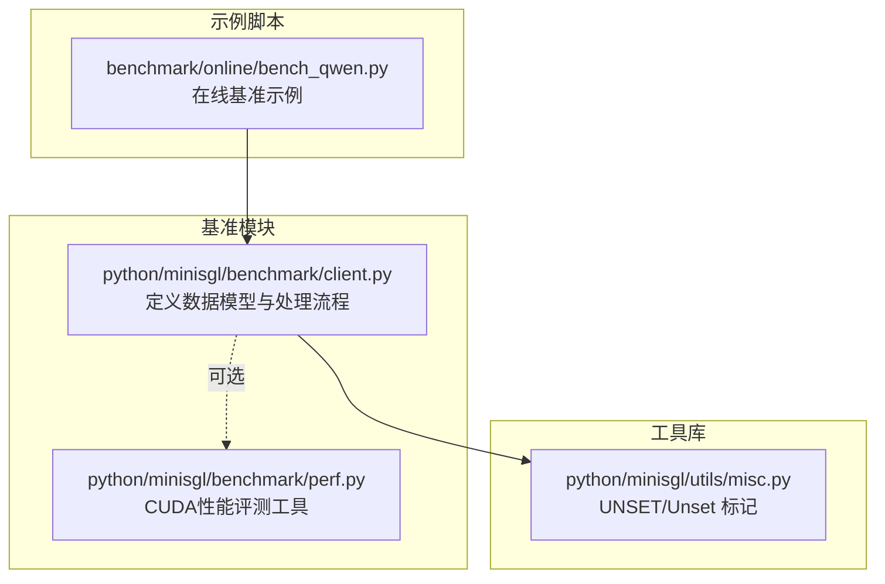
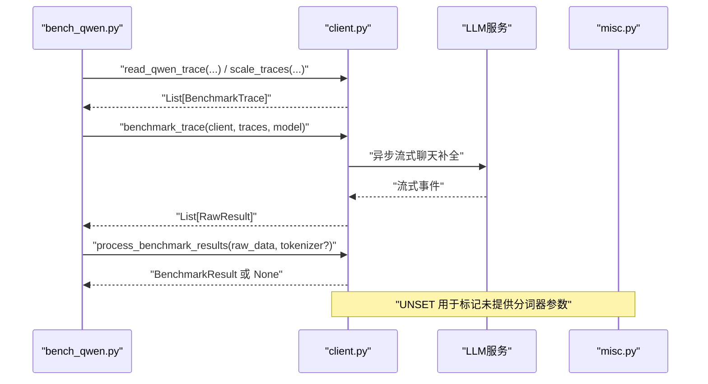
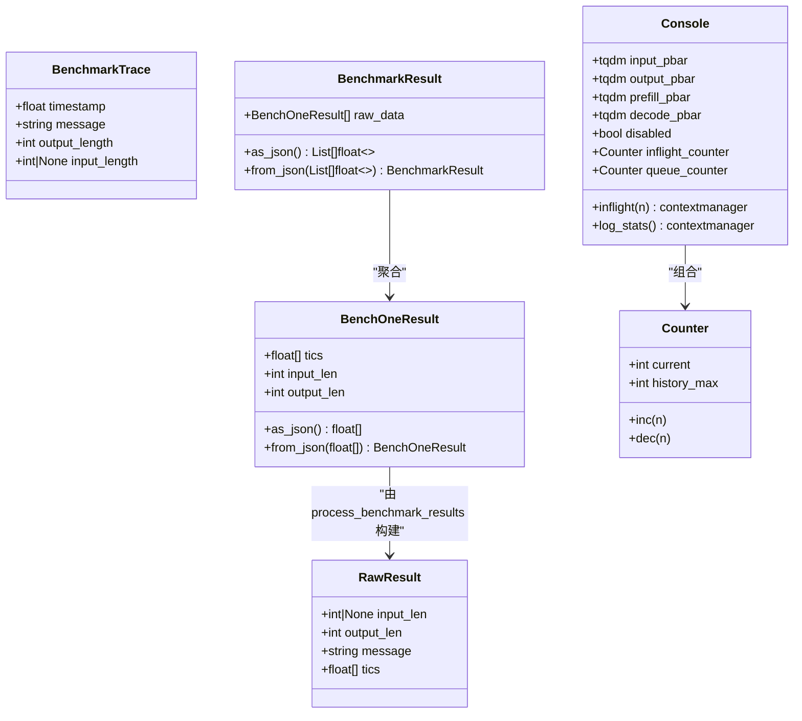
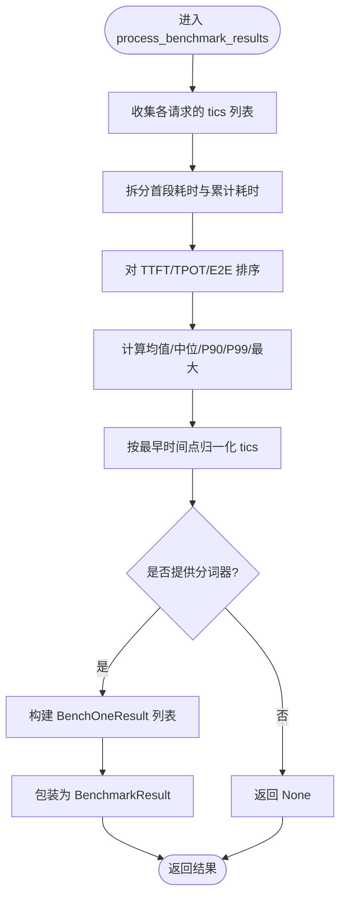
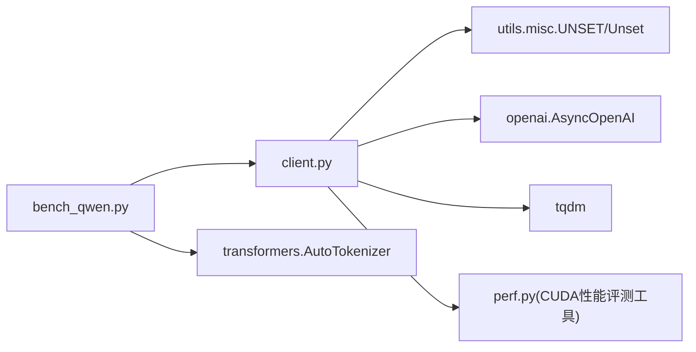

# 基准测试数据模型

<cite>
**本文引用的文件**
- [python/minisgl/benchmark/client.py](file://python/minisgl/benchmark/client.py)
- [python/minisgl/benchmark/perf.py](file://python/minisgl/benchmark/perf.py)
- [benchmark/online/bench_qwen.py](file://benchmark/online/bench_qwen.py)
- [python/minisgl/utils/misc.py](file://python/minisgl/utils/misc.py)
</cite>

## 目录
1. [引言](#引言)
2. [项目结构](#项目结构)
3. [核心组件](#核心组件)
4. [架构总览](#架构总览)
5. [详细组件分析](#详细组件分析)
6. [依赖分析](#依赖分析)
7. [性能考虑](#性能考虑)
8. [故障排查指南](#故障排查指南)
9. [结论](#结论)
10. [附录](#附录)

## 引言
本文件聚焦于基准测试模块中的核心数据模型，系统性解析以下类型：
- BenchmarkTrace：封装带时间戳的请求轨迹，包含输入/输出长度、消息内容与时间基准，用于模拟真实流量模式。
- RawResult：承载原始计时数据（tics）、输入输出长度及关联消息，作为性能分析的原始输入。
- BenchOneResult：单个请求的标准化结果，包含计时序列与长度信息，便于后续统计与序列化。
- BenchmarkResult：结果集合容器，支持JSON序列化与反序列化，便于跨流程传递与持久化。

同时，结合代码示例路径展示这些数据类在 process_benchmark_results 中的流转过程，并说明 frozen=True 对线程安全与数据一致性的意义。

## 项目结构
基准测试数据模型位于基准客户端模块中，配合在线基准脚本与工具库共同完成端到端的性能评估流程。

图表来源
- [python/minisgl/benchmark/client.py](file://python/minisgl/benchmark/client.py#L1-L120)
- [benchmark/online/bench_qwen.py](file://benchmark/online/bench_qwen.py#L1-L56)
- [python/minisgl/utils/misc.py](file://python/minisgl/utils/misc.py#L36-L41)

章节来源
- [python/minisgl/benchmark/client.py](file://python/minisgl/benchmark/client.py#L1-L120)
- [benchmark/online/bench_qwen.py](file://benchmark/online/bench_qwen.py#L1-L56)
- [python/minisgl/utils/misc.py](file://python/minisgl/utils/misc.py#L36-L41)

## 核心组件
本节从结构、职责与复杂度角度，概览四个核心数据类的设计要点与协作关系。

- BenchmarkTrace
  - 职责：描述一次请求的时间戳、消息内容、输出长度以及可选的输入长度，用于按时间轴调度请求。
  - 关键字段：timestamp（秒）、message（字符串）、output_length（整数）、input_length（可空整数）。
  - 复杂度：O(1) 访问；冻结属性避免并发修改。
- RawResult
  - 职责：承载一次请求的原始计时序列（tics）、输入输出长度与消息文本，作为性能分析的原始输入。
  - 关键字段：input_len（可空整数）、output_len（整数）、message（字符串）、tics（浮点数组）。
  - 复杂度：O(n) 序列长度；冻结属性确保不可变性。
- BenchOneResult
  - 职责：标准化单次请求的结果，包含计时序列与长度信息，提供JSON序列化/反序列化接口。
  - 关键字段：tics（列表）、input_len（整数）、output_len（整数）。
  - 复杂度：O(n)；提供 as_json/from_json 辅助序列化。
- BenchmarkResult
  - 职责：结果集合容器，保存多个 BenchOneResult，并提供 JSON 序列化/反序列化。
  - 关键字段：raw_data（列表）。
  - 复杂度：O(m·n) 统计与排序；提供 as_json/from_json 辅助序列化。

章节来源
- [python/minisgl/benchmark/client.py](file://python/minisgl/benchmark/client.py#L18-L122)

## 架构总览
下图展示了从“读取轨迹”到“生成标准化结果”的端到端流程，以及数据类之间的关系与调用方向。

图表来源
- [benchmark/online/bench_qwen.py](file://benchmark/online/bench_qwen.py#L37-L55)
- [python/minisgl/benchmark/client.py](file://python/minisgl/benchmark/client.py#L287-L405)
- [python/minisgl/utils/misc.py](file://python/minisgl/utils/misc.py#L36-L41)

## 详细组件分析

### 类关系与继承

图表来源
- [python/minisgl/benchmark/client.py](file://python/minisgl/benchmark/client.py#L18-L122)
- [python/minisgl/benchmark/client.py](file://python/minisgl/benchmark/client.py#L124-L180)

章节来源
- [python/minisgl/benchmark/client.py](file://python/minisgl/benchmark/client.py#L18-L122)
- [python/minisgl/benchmark/client.py](file://python/minisgl/benchmark/client.py#L124-L180)

### BenchmarkTrace：带时间戳的请求轨迹
- 设计要点
  - 时间基准：timestamp 为相对秒级时间戳，用于按时间顺序调度请求。
  - 消息与长度：message 为请求内容，input_length 与 output_length 分别表示输入/输出长度（token）。
  - 不可变性：frozen=True，保证并发安全与一致性。
- 用途
  - 通过 benchmark_trace 将一组 BenchmarkTrace 按时间偏移与起始时间进行延迟调度，模拟真实流量模式。
- 相关实现路径
  - [benchmark_trace 函数](file://python/minisgl/benchmark/client.py#L287-L309)
  - [scale_traces 函数](file://python/minisgl/benchmark/client.py#L479-L496)
  - [read_qwen_trace/read_mooncake_trace](file://python/minisgl/benchmark/client.py#L407-L477)

章节来源
- [python/minisgl/benchmark/client.py](file://python/minisgl/benchmark/client.py#L287-L309)
- [python/minisgl/benchmark/client.py](file://python/minisgl/benchmark/client.py#L407-L477)
- [python/minisgl/benchmark/client.py](file://python/minisgl/benchmark/client.py#L479-L496)

### RawResult：原始计时数据容器
- 设计要点
  - tics：计时序列，首元素为预填充开始时间，后续每项为流式返回到达时间。
  - 输入输出长度：input_len（可空）与 output_len；当 input_len 缺失时可在处理阶段通过分词器推导。
  - 不可变性：frozen=True，确保在多线程/协程环境中不被意外修改。
- 生成流程
  - benchmark_one 在流式响应过程中记录 tics，并返回 RawResult。
- 相关实现路径
  - [benchmark_one 函数](file://python/minisgl/benchmark/client.py#L202-L249)

章节来源
- [python/minisgl/benchmark/client.py](file://python/minisgl/benchmark/client.py#L202-L249)

### BenchOneResult：单请求标准化结果
- 设计要点
  - tics：标准化后的计时序列（已归一化至最小时间起点）。
  - input_len/output_len：标准化后的输入/输出长度。
  - 序列化：提供 as_json/from_json，便于跨进程/网络传输与持久化。
- 相关实现路径
  - [BenchOneResult 类](file://python/minisgl/benchmark/client.py#L26-L40)

章节来源
- [python/minisgl/benchmark/client.py](file://python/minisgl/benchmark/client.py#L26-L40)

### BenchmarkResult：结果集合容器
- 设计要点
  - raw_data：包含所有 BenchOneResult 的列表。
  - 序列化：提供 as_json/from_json，便于整体结果的序列化与反序列化。
- 相关实现路径
  - [BenchmarkResult 类](file://python/minisgl/benchmark/client.py#L112-L122)

章节来源
- [python/minisgl/benchmark/client.py](file://python/minisgl/benchmark/client.py#L112-L122)

### 数据流转与处理逻辑：process_benchmark_results
该函数负责将 RawResult 列表转换为 BenchmarkResult，计算关键指标并进行时间归一化与长度推导。

图表来源
- [python/minisgl/benchmark/client.py](file://python/minisgl/benchmark/client.py#L320-L405)
- [python/minisgl/utils/misc.py](file://python/minisgl/utils/misc.py#L36-L41)

章节来源
- [python/minisgl/benchmark/client.py](file://python/minisgl/benchmark/client.py#L320-L405)
- [python/minisgl/utils/misc.py](file://python/minisgl/utils/misc.py#L36-L41)

### 示例：在线基准脚本中的使用
- 读取与缩放轨迹
  - 使用 read_qwen_trace 从文件读取轨迹，再用 scale_traces 进行时间缩放。
  - 参考路径：[bench_qwen.py](file://benchmark/online/bench_qwen.py#L37-L55)
- 发送请求并处理结果
  - benchmark_trace 按时间调度发送请求，返回 RawResult 列表。
  - process_benchmark_results 输出统计并返回 BenchmarkResult。
  - 参考路径：[client.py](file://python/minisgl/benchmark/client.py#L287-L405)

章节来源
- [benchmark/online/bench_qwen.py](file://benchmark/online/bench_qwen.py#L37-L55)
- [python/minisgl/benchmark/client.py](file://python/minisgl/benchmark/client.py#L287-L405)

## 依赖分析
- 内部依赖
  - client.py 依赖 utils.misc.UNSET/Unset 作为可选参数占位符，避免使用 None 导致的歧义。
  - client.py 依赖 openai.AsyncOpenAI 进行异步流式请求。
- 外部依赖
  - transformers.AutoTokenizer 用于生成或推导输入长度。
  - tqdm 用于进度条与并发计数器。
- 关键耦合点
  - process_benchmark_results 与 tokenizer 的可选依赖，通过 UNSET 标记区分“未提供分词器”与“显式传入 None”。

图表来源
- [python/minisgl/benchmark/client.py](file://python/minisgl/benchmark/client.py#L1-L20)
- [python/minisgl/utils/misc.py](file://python/minisgl/utils/misc.py#L36-L41)
- [benchmark/online/bench_qwen.py](file://benchmark/online/bench_qwen.py#L1-L56)
- [python/minisgl/benchmark/perf.py](file://python/minisgl/benchmark/perf.py#L1-L75)

章节来源
- [python/minisgl/benchmark/client.py](file://python/minisgl/benchmark/client.py#L1-L20)
- [python/minisgl/utils/misc.py](file://python/minisgl/utils/misc.py#L36-L41)
- [benchmark/online/bench_qwen.py](file://benchmark/online/bench_qwen.py#L1-L56)
- [python/minisgl/benchmark/perf.py](file://python/minisgl/benchmark/perf.py#L1-L75)

## 性能考虑
- 时间精度与归一化
  - 使用 time.perf_counter 记录高精度时间戳，随后按最早时间点归一化，消除外部时钟漂移影响。
  - 参考路径：[process_benchmark_results](file://python/minisgl/benchmark/client.py#L386-L388)
- 排序与统计
  - 对 TTFT/TPOT/E2E 进行排序后取分位数，避免极端值干扰。
  - 参考路径：[process_benchmark_results](file://python/minisgl/benchmark/client.py#L336-L339)
- 并发与进度
  - 使用 asyncio.gather 并行执行请求，结合 Console 的进度条与计数器，提升吞吐与可观测性。
  - 参考路径：[benchmark_one_batch](file://python/minisgl/benchmark/client.py#L251-L285)，[Console](file://python/minisgl/benchmark/client.py#L124-L180)

[本节为通用性能讨论，无需列出具体文件来源]

## 故障排查指南
- 输入长度缺失
  - 当 RawResult.input_len 为空时，process_benchmark_results 会尝试通过分词器推导；若未提供分词器则返回 None。
  - 参考路径：[process_benchmark_results](file://python/minisgl/benchmark/client.py#L388-L404)，[UNSET 定义](file://python/minisgl/utils/misc.py#L36-L41)
- 时间戳异常
  - 若轨迹时间戳过小或负值，可能导致调度等待时间异常；建议使用 scale_traces 对轨迹进行平移与缩放。
  - 参考路径：[scale_traces](file://python/minisgl/benchmark/client.py#L479-L496)
- 统计口径不一致
  - 确保所有请求的 tics 数量一致，否则排序与分段逻辑可能产生异常；可通过检查 len(tics) 验证。
  - 参考路径：[process_benchmark_results](file://python/minisgl/benchmark/client.py#L320-L349)

章节来源
- [python/minisgl/benchmark/client.py](file://python/minisgl/benchmark/client.py#L388-L404)
- [python/minisgl/utils/misc.py](file://python/minisgl/utils/misc.py#L36-L41)
- [python/minisgl/benchmark/client.py](file://python/minisgl/benchmark/client.py#L479-L496)
- [python/minisgl/benchmark/client.py](file://python/minisgl/benchmark/client.py#L320-L349)

## 结论
- BenchmarkTrace 提供了基于时间戳的真实流量建模能力，结合 benchmark_trace 实现精确的请求调度。
- RawResult 作为原始观测数据载体，保留了完整的计时序列与上下文信息，是性能分析的基础。
- BenchOneResult 与 BenchmarkResult 通过标准化与序列化接口，实现了结果的可复用与可传播。
- frozen=True 的设计强化了数据一致性与并发安全性，适合在异步/多线程环境中稳定运行。
- process_benchmark_results 将原始观测转化为可解读的统计指标，并提供可选的序列化输出，满足工程化落地需求。

[本节为总结性内容，无需列出具体文件来源]

## 附录
- 关键实现路径速查
  - [BenchmarkTrace 定义](file://python/minisgl/benchmark/client.py#L18-L24)
  - [RawResult 定义](file://python/minisgl/benchmark/client.py#L42-L48)
  - [BenchOneResult 定义与序列化](file://python/minisgl/benchmark/client.py#L26-L40)
  - [BenchmarkResult 定义与序列化](file://python/minisgl/benchmark/client.py#L112-L122)
  - [benchmark_one 流式计时](file://python/minisgl/benchmark/client.py#L202-L249)
  - [benchmark_trace 时间调度](file://python/minisgl/benchmark/client.py#L287-L309)
  - [process_benchmark_results 主流程](file://python/minisgl/benchmark/client.py#L320-L405)
  - [UNSET/Unset 标记](file://python/minisgl/utils/misc.py#L36-L41)
  - [bench_qwen.py 示例](file://benchmark/online/bench_qwen.py#L37-L55)

[本节为索引性内容，无需列出具体文件来源]