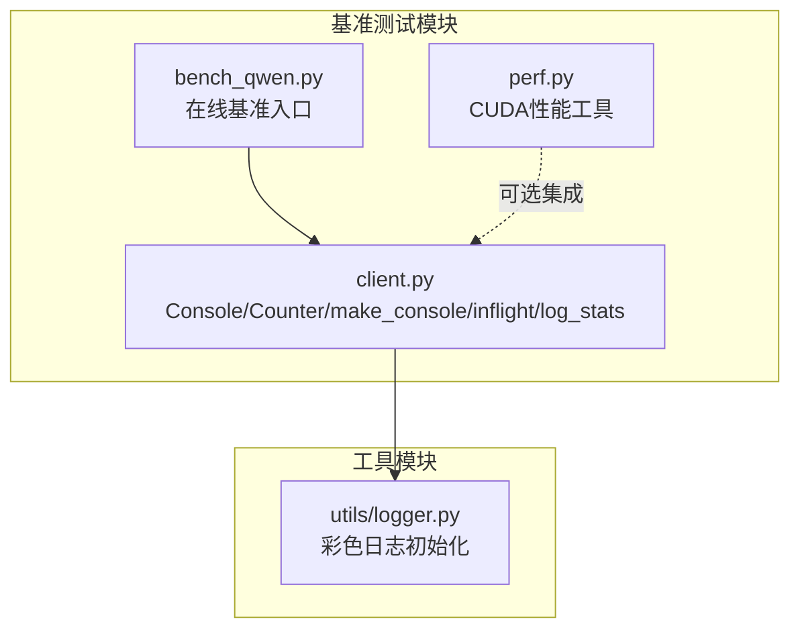
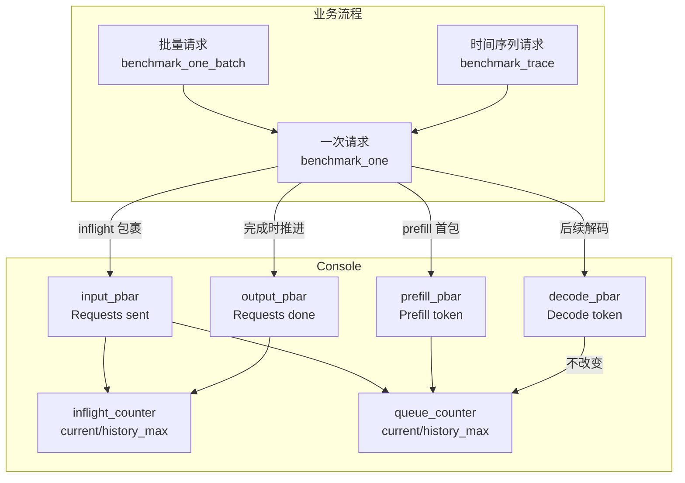
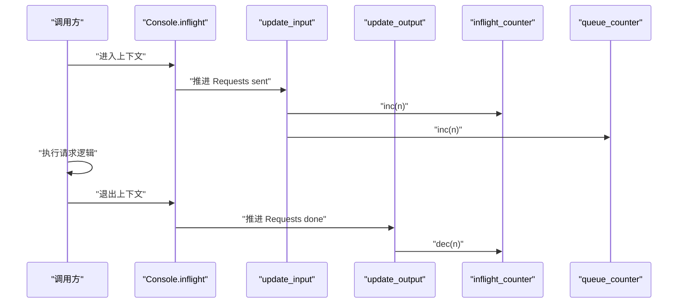
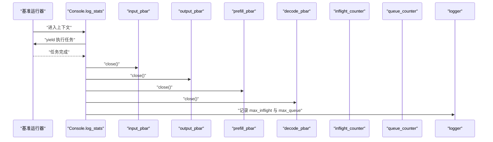
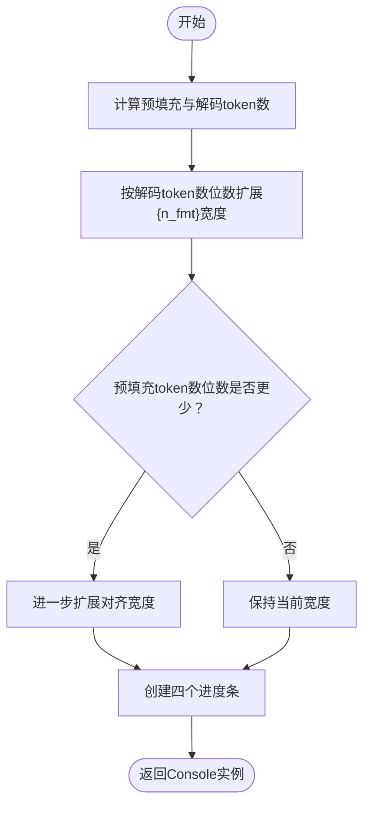
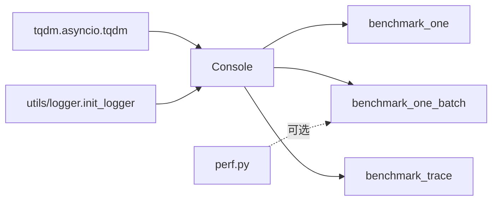

# 实时UI反馈机制

<cite>
**本文引用的文件列表**
- [python/minisgl/benchmark/client.py](file://python/minisgl/benchmark/client.py)
- [python/minisgl/benchmark/perf.py](file://python/minisgl/benchmark/perf.py)
- [python/minisgl/utils/logger.py](file://python/minisgl/utils/logger.py)
- [benchmark/online/bench_qwen.py](file://benchmark/online/bench_qwen.py)
</cite>

## 目录
1. [引言](#引言)
2. [项目结构](#项目结构)
3. [核心组件](#核心组件)
4. [架构总览](#架构总览)
5. [详细组件分析](#详细组件分析)
6. [依赖关系分析](#依赖关系分析)
7. [性能考量](#性能考量)
8. [故障排查指南](#故障排查指南)
9. [结论](#结论)
10. [附录](#附录)

## 引言
本文件系统化阐述 Console 类实现的多维度实时进度监控体系，围绕四个核心进度条（input_pbar、output_pbar、prefill_pbar、decode_pbar）的设计意图与度量维度展开，解释 Counter 类如何配合 inflight 与 queue_counter 统计飞行中请求与队列深度的历史峰值；剖析 inflight 上下文管理器通过 __enter__/__exit__ 自动更新输入/输出进度条，保证计数准确；说明 log_stats 上下文管理器在基准测试结束时自动关闭进度条并输出最大并发与队列深度日志；最后结合 make_console 函数，解释其如何依据总请求数与输出 token 数动态调整 tqdm 进度条格式对齐，提升大规模测试时的可读性。

## 项目结构
本项目的实时UI反馈机制集中在 benchmark 子模块中，核心代码位于 benchmark/client.py，负责构建与驱动 Console 进度条、计数器以及上下文管理器；日志输出由 utils/logger.py 提供；在线基准脚本 benchmark/online/bench_qwen.py 展示了如何在真实场景中使用这些能力。

图表来源
- [python/minisgl/benchmark/client.py](file://python/minisgl/benchmark/client.py#L1-L180)
- [python/minisgl/benchmark/perf.py](file://python/minisgl/benchmark/perf.py#L1-L75)
- [python/minisgl/utils/logger.py](file://python/minisgl/utils/logger.py#L1-L129)
- [benchmark/online/bench_qwen.py](file://benchmark/online/bench_qwen.py#L1-L56)

章节来源
- [python/minisgl/benchmark/client.py](file://python/minisgl/benchmark/client.py#L1-L180)
- [python/minisgl/utils/logger.py](file://python/minisgl/utils/logger.py#L1-L129)
- [benchmark/online/bench_qwen.py](file://benchmark/online/bench_qwen.py#L1-L56)

## 核心组件
- Console：封装四个 tqdm 进度条与两个 Counter，提供 update_input/update_output/update_prefill/update_decode 四个更新方法，并暴露 inflight 与 log_stats 两个上下文管理器。
- Counter：维护当前值 current 与历史最大值 history_max，提供 inc/dec 原子性增减并记录历史峰值。
- make_console：根据总请求数与输出 token 数计算预填充与解码阶段的 token 数，动态调整 tqdm 的格式对齐，创建四个进度条并返回 Console 实例。
- inflight/log_stats：分别用于在请求生命周期内自动推进输入/输出进度条，以及在基准完成后统一收尾并输出最大并发与队列深度。

章节来源
- [python/minisgl/benchmark/client.py](file://python/minisgl/benchmark/client.py#L50-L180)

## 架构总览
Console 作为 UI 与统计的中枢，将“请求生命周期”与“token 流水线”两条主线串联起来：
- 请求生命周期：inflight 包裹一次请求，自动推进 Requests sent 与 Requests done 两个进度条，并通过 Counter 记录 inflight 与 queue 的历史峰值。
- Token 流水线：prefill 阶段推进 Prefill token，decode 阶段推进 Decode token，同时通过 Counter 维护队列深度变化。

图表来源
- [python/minisgl/benchmark/client.py](file://python/minisgl/benchmark/client.py#L74-L110)
- [python/minisgl/benchmark/client.py](file://python/minisgl/benchmark/client.py#L202-L249)
- [python/minisgl/benchmark/client.py](file://python/minisgl/benchmark/client.py#L251-L309)

## 详细组件分析

### Console 类与四个进度条的度量维度
- input_pbar（Requests sent）：追踪已发送的请求数量，每次请求开始时推进该进度条，并同步增加 inflight 与 queue 计数。
- output_pbar（Requests done）：追踪已完成的请求数量，每次请求结束时推进该进度条，并同步减少 inflight 计数。
- prefill_pbar（Prefill token）：追踪预填充阶段产生的 token 数，等于请求数；每次收到首包时推进该进度条，并同步减少 queue 计数。
- decode_pbar（Decode token）：追踪解码阶段产生的 token 数，等于总输出 token 数减去预填充 token 数；每产生一个解码 token 时推进该进度条。

上述四个进度条共同构成“请求级”和“token级”的双层反馈，既能看到吞吐与延迟指标，也能观察到预填充与解码阶段的负载分布。

章节来源
- [python/minisgl/benchmark/client.py](file://python/minisgl/benchmark/client.py#L64-L92)

### Counter 类与 inflight/queue_counter 的历史峰值统计
- inflight_counter：记录当前并发请求数，初始为 0；每次请求开始 inc，结束 dec；history_max 记录运行过程中的最大并发。
- queue_counter：记录当前排队等待的请求数，初始为 0；请求开始时 inc，prefill 完成时 dec；history_max 记录运行过程中的最大排队深度。
- 二者配合可直观反映系统的“最大并发”和“最大队列深度”，为容量规划与性能调优提供依据。

章节来源
- [python/minisgl/benchmark/client.py](file://python/minisgl/benchmark/client.py#L50-L63)
- [python/minisgl/benchmark/client.py](file://python/minisgl/benchmark/client.py#L74-L92)

### inflight 上下文管理器：自动更新输入/输出进度条
- __enter__：调用 update_input(n)，推进 Requests sent 并更新 inflight 与 queue。
- __exit__：调用 update_output(n)，推进 Requests done 并更新 inflight。
- 通过上下文包裹请求生命周期，避免手动调用带来的遗漏或顺序错误，确保计数准确且一致。

图表来源
- [python/minisgl/benchmark/client.py](file://python/minisgl/benchmark/client.py#L93-L98)
- [python/minisgl/benchmark/client.py](file://python/minisgl/benchmark/client.py#L74-L84)

章节来源
- [python/minisgl/benchmark/client.py](file://python/minisgl/benchmark/client.py#L93-L98)
- [python/minisgl/benchmark/client.py](file://python/minisgl/benchmark/client.py#L74-L84)

### log_stats 上下文管理器：基准结束后的收尾与日志
- 在 yield 之后自动关闭四个进度条，防止 UI 资源泄漏。
- 若未禁用进度条，则输出最大并发与最大排队深度的日志，便于性能分析与报告。

图表来源
- [python/minisgl/benchmark/client.py](file://python/minisgl/benchmark/client.py#L99-L110)

章节来源
- [python/minisgl/benchmark/client.py](file://python/minisgl/benchmark/client.py#L99-L110)

### make_console：动态格式对齐与进度条创建
- 输入参数：总请求数、总输出 token 数。
- 计算：
  - 预填充 token 数 = 总请求数；
  - 解码 token 数 = 总输出 token 数 − 预填充 token 数；
- 动态对齐：
  - 根据解码 token 数位数扩展 tqdm 的 {n_fmt} 对齐宽度；
  - 若预填充 token 数位数更少，则进一步扩展对齐宽度，确保四个进度条在同一列上整齐对齐。
- 创建四个 tqdm 进度条，分别绑定到 Console 字段，并返回 Console 实例。

图表来源
- [python/minisgl/benchmark/client.py](file://python/minisgl/benchmark/client.py#L124-L180)

章节来源
- [python/minisgl/benchmark/client.py](file://python/minisgl/benchmark/client.py#L124-L180)

### benchmark_one：请求生命周期与进度推进
- 当收到首包时推进 prefill_pbar；
- 每次收到后续解码 token 时推进 decode_pbar；
- 使用 inflight 上下文包裹请求，确保 Requests sent/Requests done 正确推进。

章节来源
- [python/minisgl/benchmark/client.py](file://python/minisgl/benchmark/client.py#L202-L249)

### benchmark_one_batch 与 benchmark_trace：批量与时间序列场景
- 两者均会根据输入规模调用 make_console 创建 Console；
- 使用 log_stats 上下文包裹并发任务，结束后统一输出统计与关闭进度条。

章节来源
- [python/minisgl/benchmark/client.py](file://python/minisgl/benchmark/client.py#L251-L309)
- [benchmark/online/bench_qwen.py](file://benchmark/online/bench_qwen.py#L1-L56)

## 依赖关系分析
- Console 依赖 tqdm（异步进度条）进行 UI 更新；
- Console 依赖 logger（来自 utils/logger.py）输出最大并发与队列深度；
- benchmark_one/ batch/ trace 依赖 Console 提供的进度条与上下文管理器；
- perf.py 为 CUDA 性能评估工具，与 Console 无直接耦合，但可在同一基准流程中并行使用。

图表来源
- [python/minisgl/benchmark/client.py](file://python/minisgl/benchmark/client.py#L1-L180)
- [python/minisgl/utils/logger.py](file://python/minisgl/utils/logger.py#L1-L129)
- [python/minisgl/benchmark/perf.py](file://python/minisgl/benchmark/perf.py#L1-L75)

章节来源
- [python/minisgl/benchmark/client.py](file://python/minisgl/benchmark/client.py#L1-L180)
- [python/minisgl/utils/logger.py](file://python/minisgl/utils/logger.py#L1-L129)
- [python/minisgl/benchmark/perf.py](file://python/minisgl/benchmark/perf.py#L1-L75)

## 性能考量
- 进度条刷新频率：Console 在推进进度条后调用 refresh，确保 UI 即时更新；在高并发场景下建议合理设置刷新策略，避免频繁 IO 影响吞吐。
- 计数器原子性：Counter 的 inc/dec 为简单整型操作，开销极低；历史峰值仅在更新时比较，不会引入额外锁竞争。
- 日志输出：log_stats 在基准结束后统一输出统计，避免在高频循环中频繁写日志。
- tqdm 对齐优化：make_console 动态调整 {n_fmt} 对齐宽度，减少长数字导致的列宽抖动，提升大规模测试时的可读性与一致性。

[本节为通用性能讨论，不直接分析具体文件]

## 故障排查指南
- 进度条未关闭：确认是否使用 log_stats 上下文包裹基准流程，确保退出时自动 close。
- inflight/queue 统计异常：检查 inflight 上下文是否正确包裹请求生命周期，避免漏掉 __enter__/__exit__ 导致计数不一致。
- 日志未输出：确认 logger 初始化正常，且未禁用进度条（disabled=false）时才会输出最大并发与队列深度。
- 进度条对齐错乱：检查 make_console 的输入参数（总请求数与总输出 token 数），确保预填充与解码 token 数计算正确。

章节来源
- [python/minisgl/benchmark/client.py](file://python/minisgl/benchmark/client.py#L99-L110)
- [python/minisgl/benchmark/client.py](file://python/minisgl/benchmark/client.py#L124-L180)
- [python/minisgl/utils/logger.py](file://python/minisgl/utils/logger.py#L1-L129)

## 结论
Console 通过四个维度的进度条与两个计数器，实现了对请求生命周期与 token 流水线的全链路可视化；inflight 与 log_stats 上下文管理器确保了计数的准确性与基准流程的整洁收尾；make_console 的动态格式对齐提升了大规模测试场景下的可读性。该方案为性能分析、容量规划与问题定位提供了可靠的数据基础。

[本节为总结性内容，不直接分析具体文件]

## 附录
- 使用建议：
  - 在长时间基准测试中启用进度条，以便实时掌握并发与队列状态；
  - 关注最大并发与最大队列深度，结合业务 SLA 判断系统瓶颈；
  - 如需自定义输出格式，可参考 make_console 的对齐策略自行扩展 tqdm 格式。

[本节为通用建议，不直接分析具体文件]