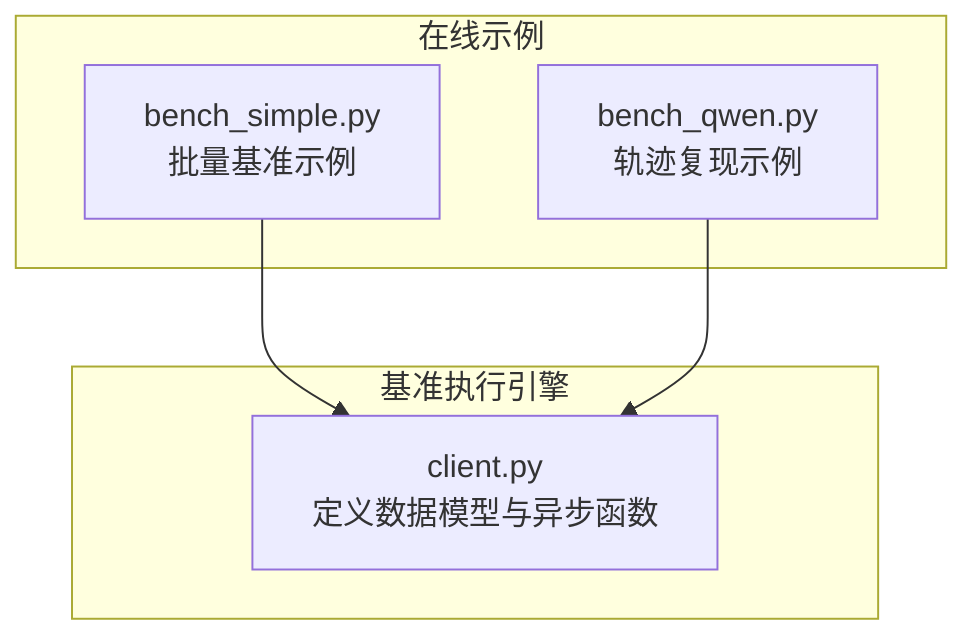
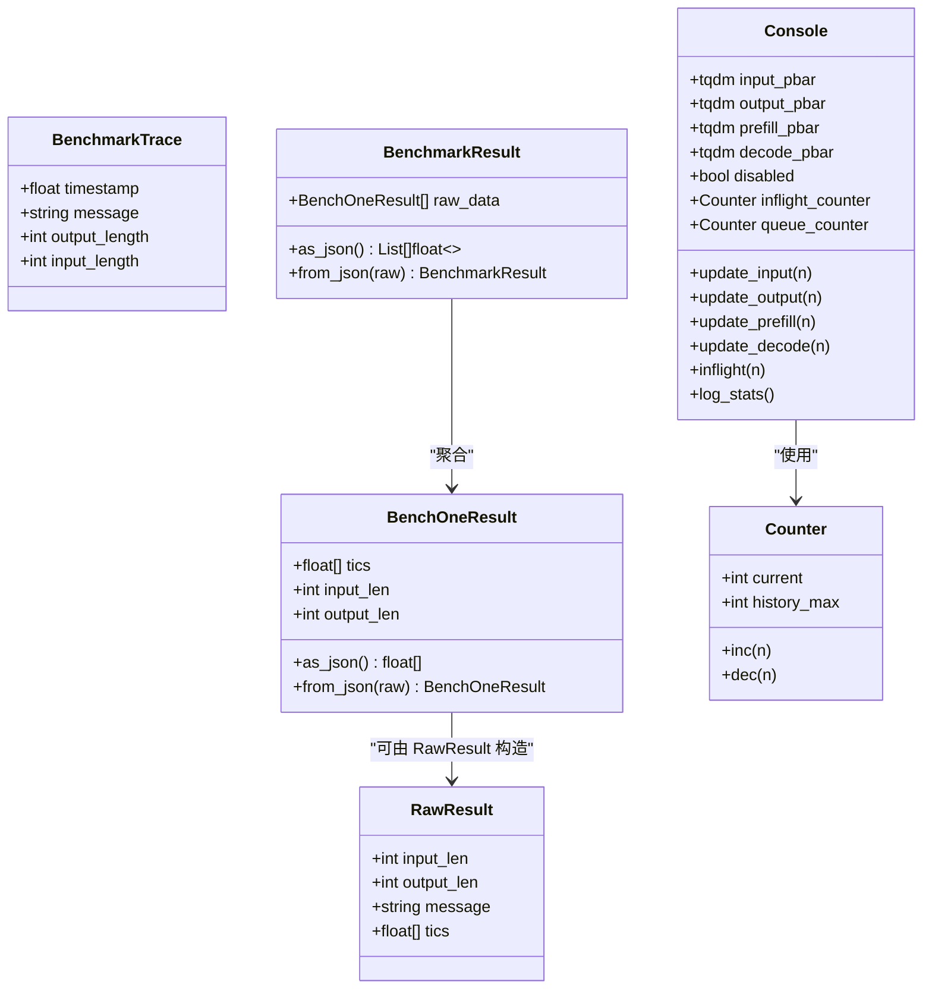
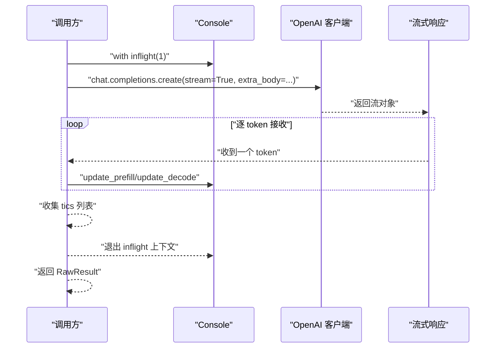
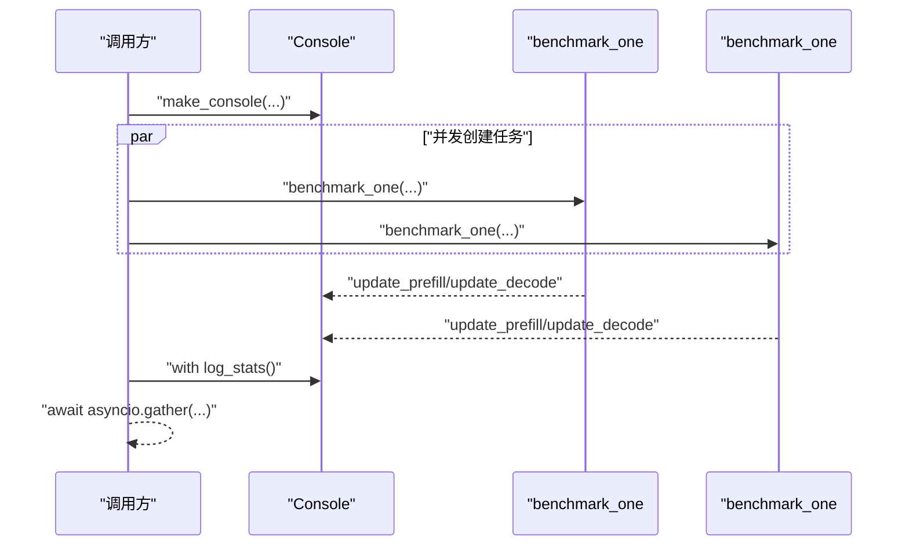
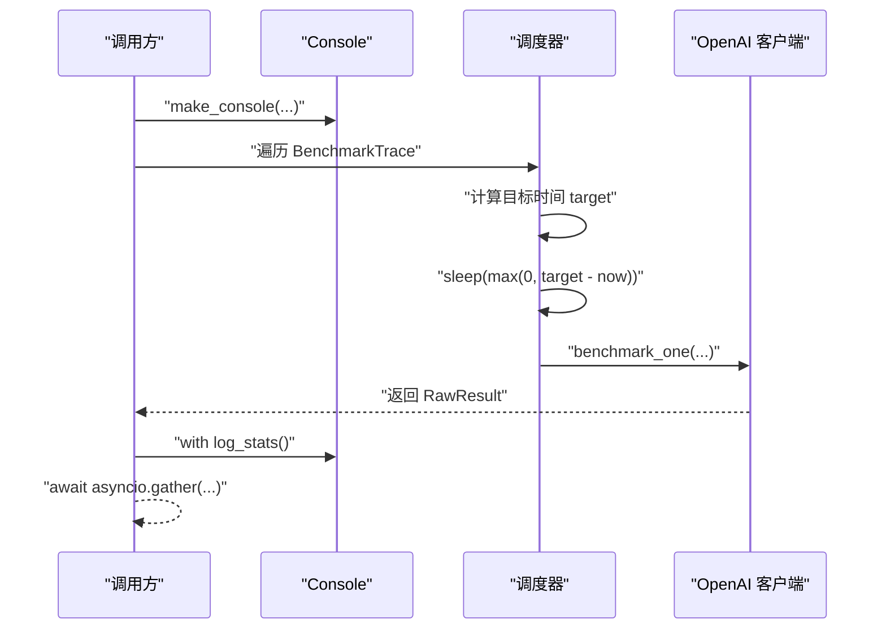
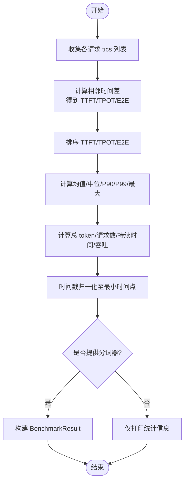
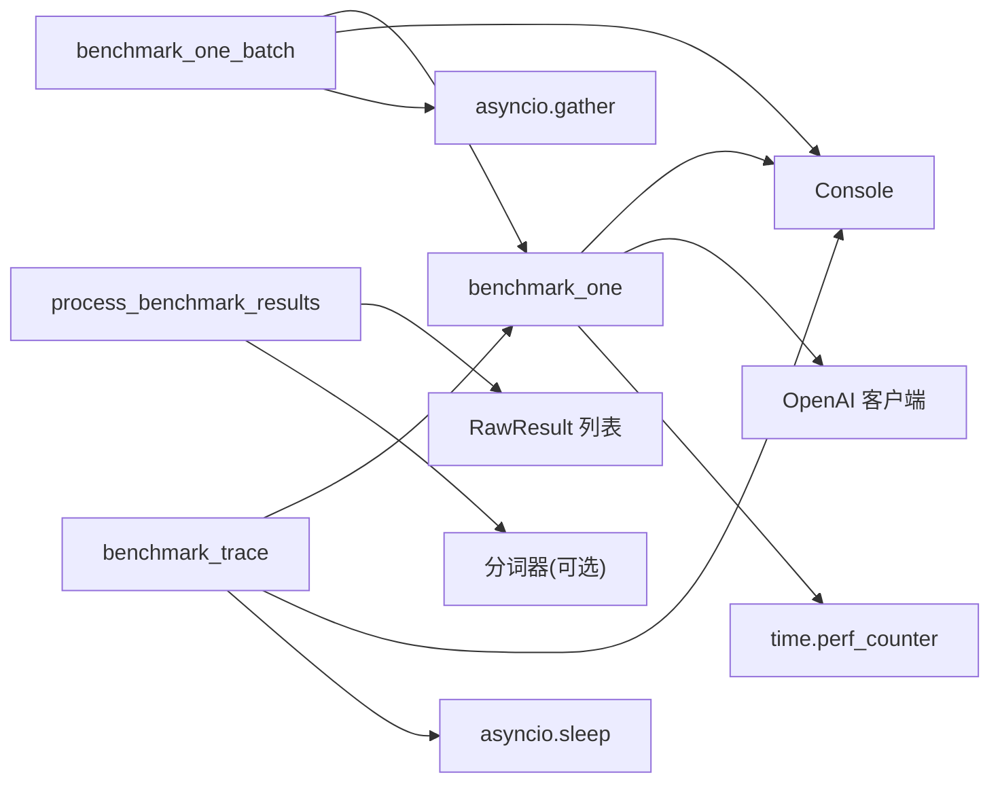

# 异步请求执行引擎

<cite>
**本文引用的文件**
- [python/minisgl/benchmark/client.py](file://python/minisgl/benchmark/client.py)
- [benchmark/online/bench_simple.py](file://benchmark/online/bench_simple.py)
- [benchmark/online/bench_qwen.py](file://benchmark/online/bench_qwen.py)
</cite>

## 目录
1. [引言](#引言)
2. [项目结构](#项目结构)
3. [核心组件](#核心组件)
4. [架构总览](#架构总览)
5. [详细组件分析](#详细组件分析)
6. [依赖关系分析](#依赖关系分析)
7. [性能考量](#性能考量)
8. [故障排查指南](#故障排查指南)
9. [结论](#结论)
10. [附录](#附录)

## 引言
本文件围绕 mini-sglang 仓库中的异步基准执行引擎，系统性解析三个核心异步函数的工作机制：
- benchmark_one：通过 OpenAI 异步客户端发起流式请求，捕获每个 token 生成的时间戳（tics），并支持底层系统参数透传（如 ignore_eos、top_k=1）。
- benchmark_one_batch：基于 asyncio.gather 并发执行多个独立请求，通过共享 Console 实例实现统一进度反馈与生命周期追踪。
- benchmark_trace：依据 BenchmarkTrace 中的时间戳进行精确延迟调度（asyncio.sleep），以复现真实生产环境的请求到达模式。

同时强调三者均使用 pbar.inflight 上下文管理器确保请求生命周期的准确追踪，并在流式响应过程中处理异常边界情况。

## 项目结构
本次文档聚焦于 benchmark 子模块与在线示例脚本，关键文件如下：
- 异步执行引擎与数据模型：python/minisgl/benchmark/client.py
- 在线简单基准示例：benchmark/online/bench_simple.py
- 在线 Qwen 轨迹复现示例：benchmark/online/bench_qwen.py

图表来源
- [python/minisgl/benchmark/client.py](file://python/minisgl/benchmark/client.py#L1-L502)
- [benchmark/online/bench_simple.py](file://benchmark/online/bench_simple.py#L1-L82)
- [benchmark/online/bench_qwen.py](file://benchmark/online/bench_qwen.py#L1-L56)

章节来源
- [python/minisgl/benchmark/client.py](file://python/minisgl/benchmark/client.py#L1-L502)
- [benchmark/online/bench_simple.py](file://benchmark/online/bench_simple.py#L1-L82)
- [benchmark/online/bench_qwen.py](file://benchmark/online/bench_qwen.py#L1-L56)

## 核心组件
- 数据模型
  - BenchmarkTrace：包含时间戳、消息内容、输出长度（token）、可选输入长度（token）。
  - RawResult：单次请求的原始结果，包含输入长度、输出长度、消息、以及各时刻时间戳列表。
  - BenchOneResult：用于序列化/反序列化的结果条目，包含输入长度、输出长度与时间戳列表。
  - BenchmarkResult：批量结果容器，提供 JSON 序列化/反序列化能力。
- 进度与计数
  - Counter：记录当前并发请求数与历史最大并发数。
  - Console：封装四个 tqdm 进度条（请求发送、完成、预填充 token、解码 token），并提供 inflight/log_stats 上下文管理器，用于生命周期追踪与统计汇总。
- 工具函数
  - generate_prompt：基于分词器生成约指定 token 数量的提示文本。
  - process_benchmark_results：对原始结果进行 TTFT/TPOT/E2E 统计与吞吐计算，并可归一化时间轴。
  - read_qwen_trace/read_mooncake_trace/scale_traces：从外部轨迹文件读取并缩放时间戳，构造 BenchmarkTrace 列表。
  - get_model_name：从服务端枚举可用模型。

章节来源
- [python/minisgl/benchmark/client.py](file://python/minisgl/benchmark/client.py#L1-L120)
- [python/minisgl/benchmark/client.py](file://python/minisgl/benchmark/client.py#L120-L200)
- [python/minisgl/benchmark/client.py](file://python/minisgl/benchmark/client.py#L200-L320)
- [python/minisgl/benchmark/client.py](file://python/minisgl/benchmark/client.py#L320-L502)

## 架构总览
下面的类图展示了核心数据模型与关系，便于理解异步执行引擎的数据流转。

图表来源
- [python/minisgl/benchmark/client.py](file://python/minisgl/benchmark/client.py#L1-L120)
- [python/minisgl/benchmark/client.py](file://python/minisgl/benchmark/client.py#L120-L200)
- [python/minisgl/benchmark/client.py](file://python/minisgl/benchmark/client.py#L200-L320)

## 详细组件分析

### benchmark_one：流式请求与时间戳捕获
- 流式请求与参数透传
  - 使用 OpenAI 异步客户端发起 chat.completions.create，开启 stream=True。
  - 通过 extra_body 传递底层系统参数，如 ignore_eos、top_k=1；可通过 input_length 覆盖输入长度；其余参数如 max_tokens、temperature 等按需设置。
- 时间戳捕获（tics）
  - 在首次进入流式循环前记录第一个时间点；随后每次收到新 token 时追加一次时间戳。
  - 预填充阶段（第一个 token）与后续解码阶段分别更新对应进度条。
- 生命周期追踪
  - 使用 pbar.inflight 上下文管理器包裹整个请求周期，确保“发送”与“完成”的进度同步更新。
- 返回值
  - 返回 RawResult，包含输入长度、输出长度、消息与 tics 列表。

图表来源
- [python/minisgl/benchmark/client.py](file://python/minisgl/benchmark/client.py#L202-L249)

章节来源
- [python/minisgl/benchmark/client.py](file://python/minisgl/benchmark/client.py#L202-L249)

### benchmark_one_batch：并发批量执行与统一进度反馈
- 并发策略
  - 基于 asyncio.gather 并发创建多个 benchmark_one 任务，等待全部完成。
- 参数扩展
  - 支持 output_lengths 为整数时广播到每条消息；支持 input_lengths 列表与 prompts 对齐。
- 共享进度反馈
  - 所有任务共享同一个 Console 实例，通过 inflight/log_stats 上下文管理器实现统一的发送、完成、预填充、解码进度条更新与统计汇总。
- 返回值
  - 返回 RawResult 列表，顺序与输入一致。

图表来源
- [python/minisgl/benchmark/client.py](file://python/minisgl/benchmark/client.py#L251-L285)

章节来源
- [python/minisgl/benchmark/client.py](file://python/minisgl/benchmark/client.py#L251-L285)

### benchmark_trace：基于轨迹的时间戳调度
- 轨迹准备
  - 从外部轨迹文件读取 BenchmarkTrace 列表，支持缩放时间戳（scale_traces）以模拟不同负载速率。
- 精确延迟调度
  - 计算起始时间与偏移，将每个请求的目标到达时间转换为相对 sleep 时长，使用 asyncio.sleep 精确等待。
- 执行与统计
  - 每个请求仍委托给 benchmark_one 完成实际流式请求与时间戳捕获；最终通过 process_benchmark_results 输出 TTFT/TPOT/E2E 统计。

图表来源
- [python/minisgl/benchmark/client.py](file://python/minisgl/benchmark/client.py#L287-L310)

章节来源
- [python/minisgl/benchmark/client.py](file://python/minisgl/benchmark/client.py#L287-L310)

### 统计与结果处理：process_benchmark_results
- 输入
  - RawResult 列表。
- 处理流程
  - 计算每个请求的首 token 时间（TTFT）、后续 token 的平均间隔（TPOT）、端到端时间（E2E）。
  - 对 TTFT、TPOT、E2E 分别统计均值、中位数、P90、P99、最大值。
  - 计算总 token 数、总请求数、持续时间与吞吐（token/s、req/s）。
  - 将时间戳归一化至最小时间点之后，便于多批对比。
- 输出
  - 若提供分词器，则返回 BenchmarkResult（包含每个请求的标准化 tics、input_len、output_len）；否则仅打印统计信息。

图表来源
- [python/minisgl/benchmark/client.py](file://python/minisgl/benchmark/client.py#L320-L405)

章节来源
- [python/minisgl/benchmark/client.py](file://python/minisgl/benchmark/client.py#L320-L405)

### 示例脚本中的使用方式
- bench_simple.py
  - 创建 OpenAI 异步客户端，测试连接后生成随机提示与输出长度，调用 benchmark_one_batch 执行批量基准，并输出统计。
- bench_qwen.py
  - 下载并读取 Qwen 轨迹，缩放时间戳后调用 benchmark_trace，复现真实流量模式并输出统计。

章节来源
- [benchmark/online/bench_simple.py](file://benchmark/online/bench_simple.py#L1-L82)
- [benchmark/online/bench_qwen.py](file://benchmark/online/bench_qwen.py#L1-L56)

## 依赖关系分析
- 组件耦合
  - benchmark_one 依赖 Console 的 inflight/log_stats 上下文管理器与进度条更新方法。
  - benchmark_one_batch 依赖 benchmark_one 与 Console，通过 asyncio.gather 并发执行。
  - benchmark_trace 依赖 benchmark_one 与 Console，通过 asyncio.sleep 实现时间戳驱动的调度。
  - process_benchmark_results 依赖 RawResult 列表与分词器（可选）。
- 外部依赖
  - OpenAI 异步客户端：发起流式请求。
  - tqdm.asyncio：异步进度条。
  - pydantic：轨迹数据模型校验。
  - transformers：分词器加载与提示生成。

图表来源
- [python/minisgl/benchmark/client.py](file://python/minisgl/benchmark/client.py#L202-L310)
- [python/minisgl/benchmark/client.py](file://python/minisgl/benchmark/client.py#L320-L405)

章节来源
- [python/minisgl/benchmark/client.py](file://python/minisgl/benchmark/client.py#L202-L310)
- [python/minisgl/benchmark/client.py](file://python/minisgl/benchmark/client.py#L320-L405)

## 性能考量
- 流式时间戳精度
  - 使用高精度计时器记录每个 token 到达时刻，确保 TTFT/TPOT/E2E 统计的准确性。
- 并发与背压
  - benchmark_one_batch 通过共享 Console 统计 inflight 与队列峰值，有助于评估系统在高并发下的稳定性。
- 轨迹复现的真实性
  - benchmark_trace 通过精确 sleep 将请求按真实时间间隔注入，更贴近生产环境的突发与平滑混合场景。
- 结果归一化
  - process_benchmark_results 将时间戳归一化，便于跨批次对比。

[本节为通用指导，不直接分析具体文件，故无章节来源]

## 故障排查指南
- 连接失败或响应异常
  - bench_simple.py 在执行批量前先进行一次连接测试，若返回的 tics 长度过短，会判定连接失败并终止。
- 服务器不可用
  - bench_qwen.py 明确提示检查本地服务端口；若无法获取模型列表，将抛出异常。
- 进度条与统计
  - Console 提供 log_stats 上下文管理器，在退出时关闭进度条并打印最大并发与排队数，便于定位瓶颈。
- 轨迹文件问题
  - read_qwen_trace/read_mooncake_trace 会对每行 JSON 进行校验；若生成提示失败，将抛出异常。

章节来源
- [benchmark/online/bench_simple.py](file://benchmark/online/bench_simple.py#L42-L74)
- [benchmark/online/bench_qwen.py](file://benchmark/online/bench_qwen.py#L37-L56)
- [python/minisgl/benchmark/client.py](file://python/minisgl/benchmark/client.py#L93-L110)
- [python/minisgl/benchmark/client.py](file://python/minisgl/benchmark/client.py#L407-L476)

## 结论
本文系统解析了 benchmark_one、benchmark_one_batch 与 benchmark_trace 三者的异步执行机制与协作关系：
- benchmark_one 通过流式响应与 extra_body 参数实现可控的底层行为与高精度时间戳采集；
- benchmark_one_batch 以共享 Console 与 asyncio.gather 实现高效并发与统一进度反馈；
- benchmark_trace 以精确延迟调度复现真实流量，结合 process_benchmark_results 提供全面的性能指标。
三者共同构成一套可扩展、可观测、可复现的异步基准执行引擎。

[本节为总结性内容，不直接分析具体文件，故无章节来源]

## 附录
- 关键路径参考
  - benchmark_one：[python/minisgl/benchmark/client.py](file://python/minisgl/benchmark/client.py#L202-L249)
  - benchmark_one_batch：[python/minisgl/benchmark/client.py](file://python/minisgl/benchmark/client.py#L251-L285)
  - benchmark_trace：[python/minisgl/benchmark/client.py](file://python/minisgl/benchmark/client.py#L287-L310)
  - 统计处理：[python/minisgl/benchmark/client.py](file://python/minisgl/benchmark/client.py#L320-L405)
  - 示例脚本：[benchmark/online/bench_simple.py](file://benchmark/online/bench_simple.py#L1-L82)、[benchmark/online/bench_qwen.py](file://benchmark/online/bench_qwen.py#L1-L56)