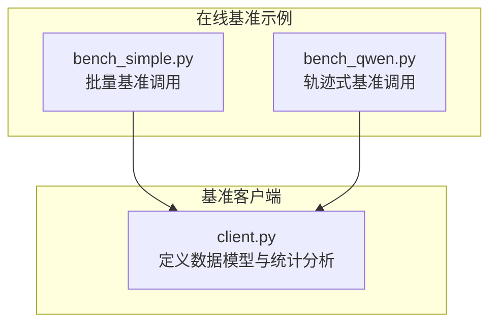
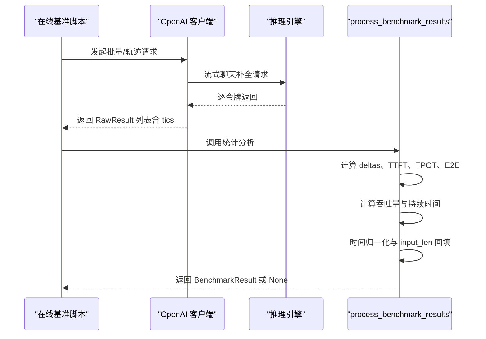
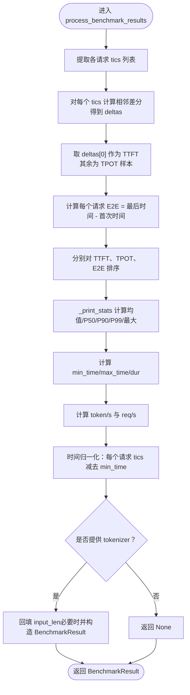
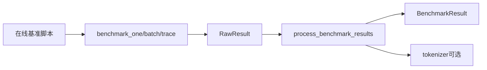

# 性能结果分析算法

<cite>
**本文引用的文件**
- [python/minisgl/benchmark/client.py](file://python/minisgl/benchmark/client.py)
- [benchmark/online/bench_qwen.py](file://benchmark/online/bench_qwen.py)
- [benchmark/online/bench_simple.py](file://benchmark/online/bench_simple.py)
</cite>

## 目录
1. [引言](#引言)
2. [项目结构](#项目结构)
3. [核心组件](#核心组件)
4. [架构总览](#架构总览)
5. [详细组件分析](#详细组件分析)
6. [依赖关系分析](#依赖关系分析)
7. [性能考量](#性能考量)
8. [故障排查指南](#故障排查指南)
9. [结论](#结论)

## 引言
本文件围绕在线基准测试中的统计分析算法进行深入剖析，重点解释 process_benchmark_results 函数如何从 RawResult 列表中提取原始计时数据（tics），并据此计算 TTFT（首次令牌耗时）、TPOT（每输出令牌耗时）与 E2E（端到端）延迟；同时阐明 deltas 数组的构建过程、_print_stats 辅助函数如何对排序后的延迟数据计算均值、P50、P90、P99 和最大值，以及 _fmt 的自适应格式化输出策略。此外，文档还说明吞吐量 token/s 与 req/s 的推导方式，以及 BenchmarkResult 的构建流程，包括 input_len 的回填逻辑与时间归一化处理，确保结果可复现且可比较。

## 项目结构
本次分析聚焦于以下文件：
- 基准客户端与统计分析：python/minisgl/benchmark/client.py
- 在线基准示例（批量与轨迹）：benchmark/online/bench_simple.py、benchmark/online/bench_qwen.py

图表来源
- [python/minisgl/benchmark/client.py](file://python/minisgl/benchmark/client.py#L1-L200)
- [benchmark/online/bench_simple.py](file://benchmark/online/bench_simple.py#L1-L82)
- [benchmark/online/bench_qwen.py](file://benchmark/online/bench_qwen.py#L1-L56)

章节来源
- [python/minisgl/benchmark/client.py](file://python/minisgl/benchmark/client.py#L1-L200)
- [benchmark/online/bench_simple.py](file://benchmark/online/bench_simple.py#L1-L82)
- [benchmark/online/bench_qwen.py](file://benchmark/online/bench_qwen.py#L1-L56)

## 核心组件
- 数据模型
  - RawResult：包含 input_len（可能为空）、output_len、message 与 tics（时间戳序列）
  - BenchOneResult：标准化后的单请求结果，包含 input_len、output_len 与 tics
  - BenchmarkResult：最终统计结果容器，保存标准化后的 BenchOneResult 列表
- 关键函数
  - benchmark_one / benchmark_one_batch：向服务发起流式请求，记录每个令牌到达的时间点，形成 tics 序列
  - process_benchmark_results：对 RawResult 列表执行统计分析与结果规范化

章节来源
- [python/minisgl/benchmark/client.py](file://python/minisgl/benchmark/client.py#L42-L48)
- [python/minisgl/benchmark/client.py](file://python/minisgl/benchmark/client.py#L26-L40)
- [python/minisgl/benchmark/client.py](file://python/minisgl/benchmark/client.py#L112-L122)
- [python/minisgl/benchmark/client.py](file://python/minisgl/benchmark/client.py#L202-L249)
- [python/minisgl/benchmark/client.py](file://python/minisgl/benchmark/client.py#L251-L285)
- [python/minisgl/benchmark/client.py](file://python/minisgl/benchmark/client.py#L320-L404)

## 架构总览
下图展示了从在线基准脚本到统计分析的整体流程，以及 process_benchmark_results 的关键步骤。

图表来源
- [benchmark/online/bench_simple.py](file://benchmark/online/bench_simple.py#L63-L73)
- [benchmark/online/bench_qwen.py](file://benchmark/online/bench_qwen.py#L47-L51)
- [python/minisgl/benchmark/client.py](file://python/minisgl/benchmark/client.py#L202-L249)
- [python/minisgl/benchmark/client.py](file://python/minisgl/benchmark/client.py#L320-L404)

## 详细组件分析

### 组件A：process_benchmark_results 统计分析算法
该函数负责对一组 RawResult 执行完整的统计分析与结果规范化，具体步骤如下：

- 输入与准备
  - 输入：List[RawResult]
  - 输出：BenchmarkResult 或 None（当未提供 tokenizer 时）
- 提取原始计时数据
  - 从每个 RawResult.tics 中提取时间戳序列 results
- 构建 deltas 数组
  - 对每个请求的 tics，计算相邻时间差，得到 deltas
  - 第一个时间差即 TTFT（首次令牌耗时）
  - 后续所有时间差构成 TPOT 样本集（除首差外）
- 计算 E2E
  - 每个请求的 E2E = 最后时间 - 首次时间
- 排序与统计
  - 将 first_times、accum_times、e2e_times 分别升序排序
  - 使用 _print_stats 计算均值、P50、P90、P99、最大值
- 吞吐量与持续时间
  - min_time/max_time 取所有 tics 的全局最小/最大
  - dur = max_time - min_time > 0
  - num_tokens = 所有请求 tics 长度之和
  - num_requests = 请求条数
  - 吞吐量：token/s = num_tokens / dur；req/s = num_requests / dur
- 格式化输出
  - _fmt 根据数值范围选择不同精度的字符串格式
- 时间归一化
  - 将每个请求的 tics 全部减去 min_time，使时间从零开始
- input_len 回填与结果封装
  - 若原始 RawResult.input_len 为 None，则使用 tokenizer 对 message 进行编码并回填
  - 构造 BenchmarkResult(raw_data=[BenchOneResult(...)]...)
  - 当未提供 tokenizer 时，返回 None

图表来源
- [python/minisgl/benchmark/client.py](file://python/minisgl/benchmark/client.py#L320-L404)

章节来源
- [python/minisgl/benchmark/client.py](file://python/minisgl/benchmark/client.py#L320-L404)

### 组件B：_print_stats 与 _fmt 辅助函数
- _print_stats
  - 输入：已排序的延迟数组 times，scale（默认 1.0）
  - 输出：(avg, p50, p90, p99, max)
  - 计算方式：avg = sum/times.length；p50/p90/p99 通过索引定位；max 取最大值
- _fmt
  - 输入：数值 x
  - 输出：根据范围选择格式
    - x >= 1000：整数宽度对齐
    - 10 <= x < 1000：保留两位小数
    - x < 10：保留四位小数
  - 用于日志输出的统一格式化

章节来源
- [python/minisgl/benchmark/client.py](file://python/minisgl/benchmark/client.py#L340-L382)

### 组件C：吞吐量推导与持续时间
- 持续时间 dur
  - 由全局最小/最大时间差计算：dur = max_time - min_time
  - 断言 dur > 0，确保时间窗口有效
- 吞吐量
  - token/s = num_tokens / dur
  - req/s = num_requests / dur
  - num_tokens 为所有请求 tics 长度之和；num_requests 为请求数量

章节来源
- [python/minisgl/benchmark/client.py](file://python/minisgl/benchmark/client.py#L361-L369)

### 组件D：BenchmarkResult 构建与 input_len 回填
- 构建流程
  - 保持每个请求的 tics 不变
  - input_len：若原始为 None，则使用 tokenizer.encode(message, add_special_tokens=False) 的长度进行回填
  - output_len 保持不变
  - 包装为 BenchOneResult 并汇总为 BenchmarkResult
- 时间归一化
  - 将每个请求的 tics 全部减去 min_time，使时间从零开始，便于跨请求对比与可视化

章节来源
- [python/minisgl/benchmark/client.py](file://python/minisgl/benchmark/client.py#L386-L404)

### 组件E：RawResult 生成与 tics 收集
- benchmark_one
  - 发起流式聊天补全请求，首次迭代记录首次时间戳（预填充阶段）
  - 每次收到新令牌时追加当前时间戳至 tics
  - 返回 RawResult(input_len, output_len, message, tics)
- benchmark_one_batch 与 benchmark_trace
  - 批量或轨迹式调度，内部调用 benchmark_one 并聚合结果

章节来源
- [python/minisgl/benchmark/client.py](file://python/minisgl/benchmark/client.py#L202-L249)
- [python/minisgl/benchmark/client.py](file://python/minisgl/benchmark/client.py#L251-L285)
- [python/minisgl/benchmark/client.py](file://python/minisgl/benchmark/client.py#L287-L310)

### 组件F：在线基准脚本调用链
- bench_simple.py
  - 生成随机消息与输出长度，批量调用 benchmark_one_batch
  - 调用 process_benchmark_results 输出统计
- bench_qwen.py
  - 读取轨迹数据，按比例缩放时间戳，调用 benchmark_trace
  - 调用 process_benchmark_results 输出统计

章节来源
- [benchmark/online/bench_simple.py](file://benchmark/online/bench_simple.py#L63-L73)
- [benchmark/online/bench_qwen.py](file://benchmark/online/bench_qwen.py#L47-L51)

## 依赖关系分析
- process_benchmark_results 依赖的数据模型与工具
  - RawResult：提供 tics 与可选的 input_len
  - tokenizer：在 input_len 缺失时用于回填
  - 日志器：输出统计摘要
- 调用链
  - 在线基准脚本 → benchmark_one/batch/trace → RawResult → process_benchmark_results → BenchmarkResult

图表来源
- [python/minisgl/benchmark/client.py](file://python/minisgl/benchmark/client.py#L202-L249)
- [python/minisgl/benchmark/client.py](file://python/minisgl/benchmark/client.py#L251-L285)
- [python/minisgl/benchmark/client.py](file://python/minisgl/benchmark/client.py#L287-L310)
- [python/minisgl/benchmark/client.py](file://python/minisgl/benchmark/client.py#L320-L404)
- [benchmark/online/bench_simple.py](file://benchmark/online/bench_simple.py#L63-L73)
- [benchmark/online/bench_qwen.py](file://benchmark/online/bench_qwen.py#L47-L51)

章节来源
- [python/minisgl/benchmark/client.py](file://python/minisgl/benchmark/client.py#L202-L249)
- [python/minisgl/benchmark/client.py](file://python/minisgl/benchmark/client.py#L251-L285)
- [python/minisgl/benchmark/client.py](file://python/minisgl/benchmark/client.py#L287-L310)
- [python/minisgl/benchmark/client.py](file://python/minisgl/benchmark/client.py#L320-L404)
- [benchmark/online/bench_simple.py](file://benchmark/online/bench_simple.py#L63-L73)
- [benchmark/online/bench_qwen.py](file://benchmark/online/bench_qwen.py#L47-L51)

## 性能考量
- 时间差计算复杂度
  - 对每个请求计算相邻差分 O(L)，其中 L 为该请求 tics 长度
  - 多请求累计：O(N*L)，N 为请求总数
- 排序复杂度
  - 对 TTFT、TPOT、E2E 分别排序，复杂度约为 O(K log K)，K 为样本数
- 吞吐量计算
  - 线性扫描全局 min/max，O(N*L)
- 内存占用
  - 存储 first_times、accum_times、e2e_times 与中间结果，空间复杂度 O(N*L)
- 归一化与回填
  - 时间归一化与 input_len 回填均为线性操作，开销可控

[本节为通用性能讨论，不直接分析特定文件]

## 故障排查指南
- dur <= 0
  - 现象：断言失败
  - 原因：时间戳异常或数据为空
  - 处理：检查 tics 是否正确收集、是否存在空请求
- tics 长度过短
  - 现象：无法计算 TPOT 或 TTFT
  - 原因：仅收到首个时间戳
  - 处理：确认服务端流式响应正常、benchmark_one 正确追加时间戳
- tokenizer 未提供导致返回 None
  - 现象：process_benchmark_results 返回 None
  - 原因：未传入 tokenizer
  - 处理：在需要回填 input_len 时传入 tokenizer
- E2E 单位不一致
  - 现象：日志中 TTFT/TPOT 以毫秒显示，E2E 以秒显示
  - 原因：_print_stats 默认对 TTFT/TPOT 使用 scale=1000，E2E 不缩放
  - 处理：按需调整格式化逻辑

章节来源
- [python/minisgl/benchmark/client.py](file://python/minisgl/benchmark/client.py#L361-L369)
- [python/minisgl/benchmark/client.py](file://python/minisgl/benchmark/client.py#L370-L382)
- [python/minisgl/benchmark/client.py](file://python/minisgl/benchmark/client.py#L386-L404)

## 结论
process_benchmark_results 通过对 RawResult.tics 的差分计算，将时间序列分解为 TTFT、TPOT 与 E2E 三类指标，并以排序后的样本集计算多分位统计与最大值，辅以自适应格式化输出。吞吐量 token/s 与 req/s 基于全局时间窗口与总 token/请求数推导。BenchmarkResult 的构建包含 input_len 的回填与时间归一化，确保结果可复现、可比较。在线基准脚本通过 bench_simple 与 bench_qwen 将这些能力串联起来，形成完整的端到端性能评估流水线。