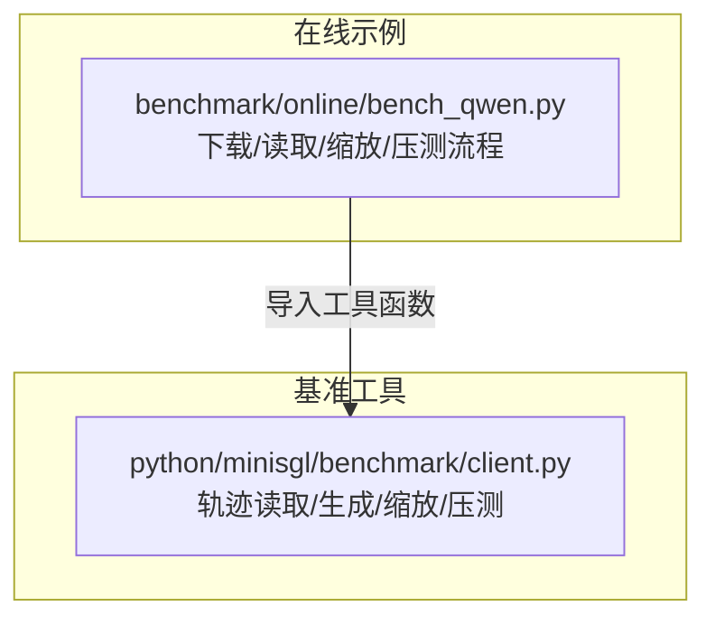
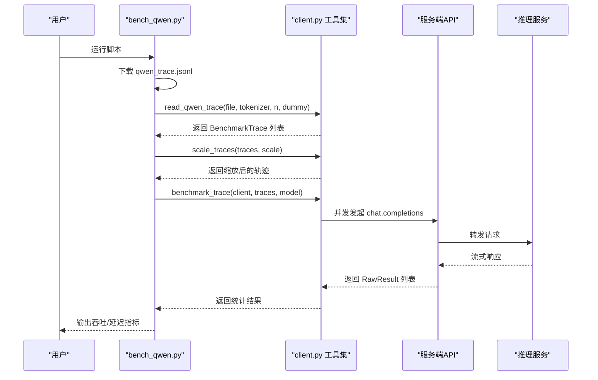
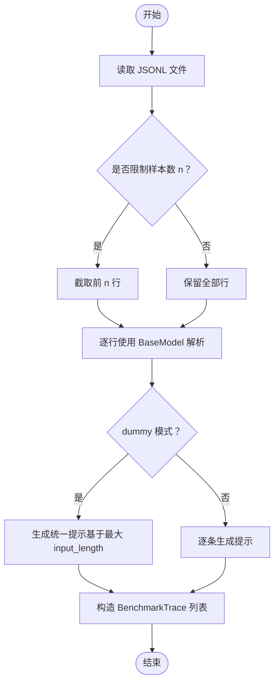
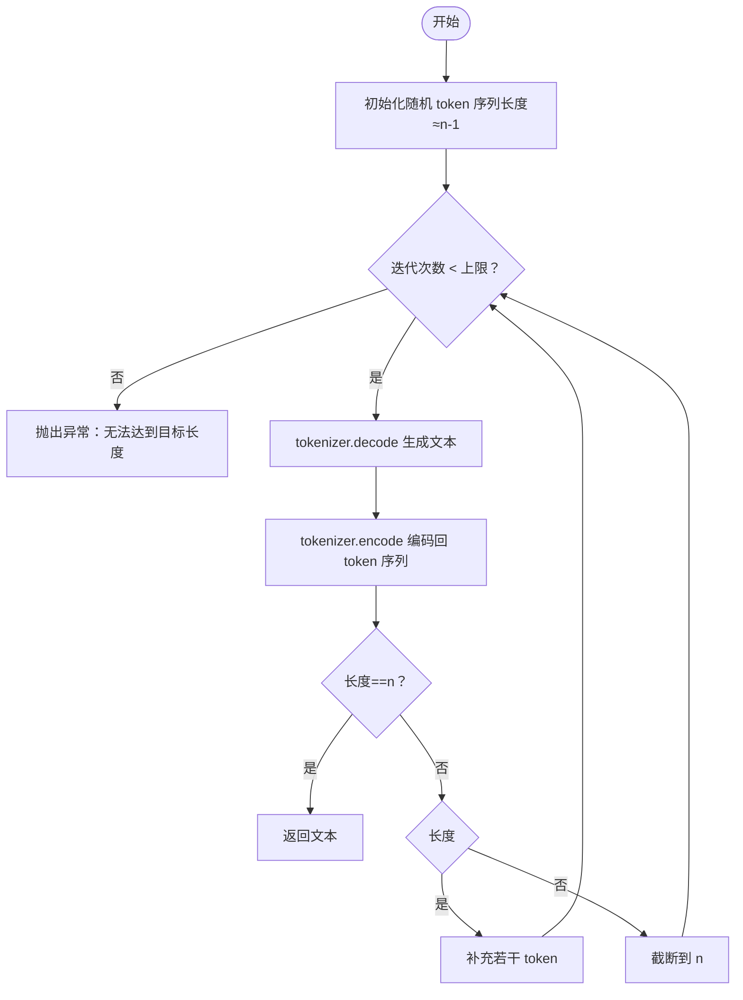
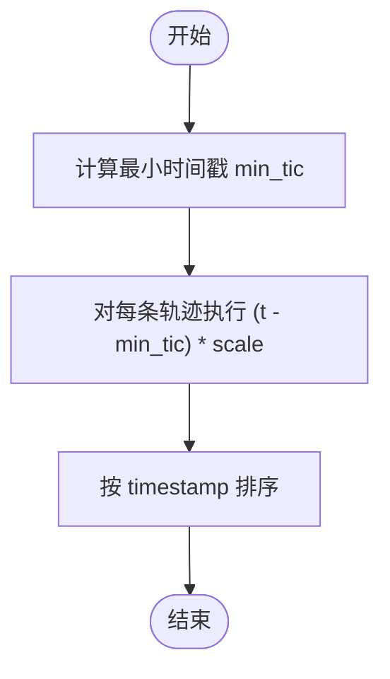
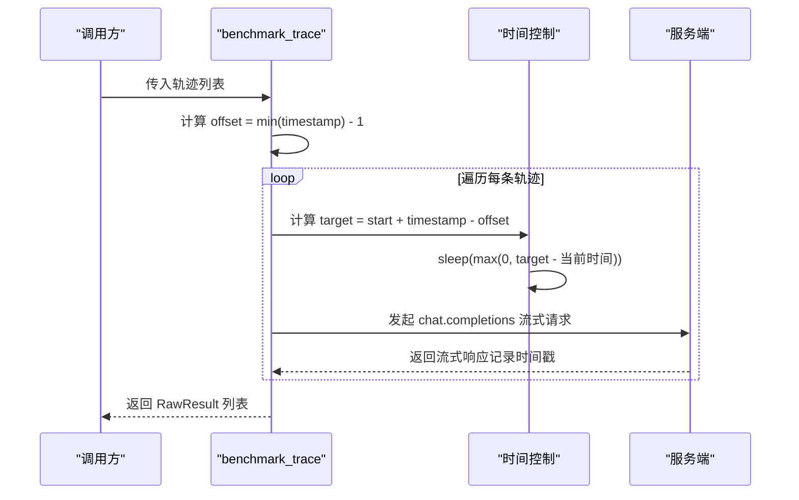
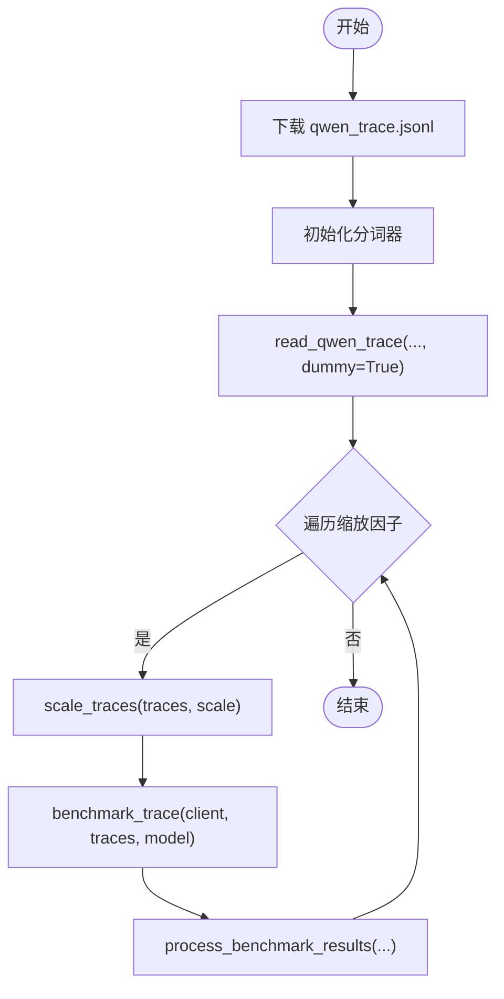
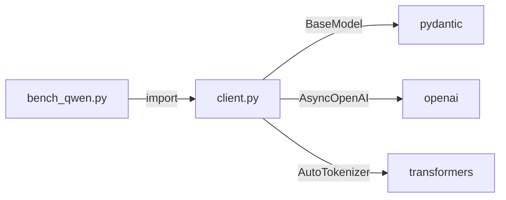

# 请求轨迹工具集

<cite>
**本文引用的文件**
- [python/minisgl/benchmark/client.py](file://python/minisgl/benchmark/client.py)
- [benchmark/online/bench_qwen.py](file://benchmark/online/bench_qwen.py)
</cite>

## 目录
1. [简介](#简介)
2. [项目结构](#项目结构)
3. [核心组件](#核心组件)
4. [架构总览](#架构总览)
5. [详细组件分析](#详细组件分析)
6. [依赖关系分析](#依赖关系分析)
7. [性能考量](#性能考量)
8. [故障排查指南](#故障排查指南)
9. [结论](#结论)

## 简介
本文件系统性介绍用于生成与处理真实世界请求轨迹的工具函数，重点覆盖以下方面：
- 从 JSONL 日志文件读取生产环境请求轨迹，解析时间戳、输入/输出长度等字段，并转换为统一的 BenchmarkTrace 对象列表；
- 使用 pydantic.BaseModel 在解析 JSON 数据时提供类型安全与自动校验；
- 基于指定 token 数量生成随机文本提示，通过编码-解码迭代逼近目标长度；在 dummy 模式下使用统一提示以降低输入变异；
- 对轨迹进行时间轴缩放（加速/减速），通过“减去最小时间戳再乘以缩放因子”的方式实现，并保持时间顺序不变。

这些能力共同支撑了在线基准测试流程：先读取真实轨迹，再按需缩放时间线，最后并发调度到服务端进行压测并统计指标。

## 项目结构
本次文档聚焦于以下两个模块：
- python/minisgl/benchmark/client.py：包含轨迹读取、提示生成、时间缩放、基准测试调度与结果处理等核心逻辑；
- benchmark/online/bench_qwen.py：在线基准示例脚本，演示如何下载真实轨迹、读取并缩放轨迹、并发调用服务端进行压测。

图表来源
- [python/minisgl/benchmark/client.py](file://python/minisgl/benchmark/client.py#L1-L502)
- [benchmark/online/bench_qwen.py](file://benchmark/online/bench_qwen.py#L1-L56)

章节来源
- [python/minisgl/benchmark/client.py](file://python/minisgl/benchmark/client.py#L1-L502)
- [benchmark/online/bench_qwen.py](file://benchmark/online/bench_qwen.py#L1-L56)

## 核心组件
- BenchmarkTrace：统一的轨迹消息载体，包含时间戳、提示文本、输入/输出 token 长度等字段。
- read_qwen_trace / read_mooncake_trace：分别从两类 JSONL 轨迹文件中读取并构造 BenchmarkTrace 列表，同时支持 dummy 模式下的统一提示策略。
- generate_prompt：基于分词器生成接近目标 token 数的随机提示文本，采用编码-解码迭代逼近。
- scale_traces：对轨迹时间轴进行缩放，保持相对时序不变。
- benchmark_trace：将轨迹按时间点并发调度到服务端，统计 TTFT/TPOT/E2E 等关键指标。

章节来源
- [python/minisgl/benchmark/client.py](file://python/minisgl/benchmark/client.py#L18-L24)
- [python/minisgl/benchmark/client.py](file://python/minisgl/benchmark/client.py#L407-L476)
- [python/minisgl/benchmark/client.py](file://python/minisgl/benchmark/client.py#L183-L199)
- [python/minisgl/benchmark/client.py](file://python/minisgl/benchmark/client.py#L479-L495)
- [python/minisgl/benchmark/client.py](file://python/minisgl/benchmark/client.py#L287-L309)

## 架构总览
下面的序列图展示了从下载真实轨迹到完成基准测试的整体流程。

图表来源
- [benchmark/online/bench_qwen.py](file://benchmark/online/bench_qwen.py#L37-L51)
- [python/minisgl/benchmark/client.py](file://python/minisgl/benchmark/client.py#L407-L476)
- [python/minisgl/benchmark/client.py](file://python/minisgl/benchmark/client.py#L479-L495)
- [python/minisgl/benchmark/client.py](file://python/minisgl/benchmark/client.py#L287-L309)

## 详细组件分析

### 1) 轨迹读取：read_qwen_trace 与 read_mooncake_trace
- 输入格式差异
  - Qwen 轨迹：每行 JSON 包含 chat_id、parent_chat_id、timestamp（秒）、input_length、output_length 等字段；
  - Mooncake 轨迹：每行 JSON 包含 timestamp（毫秒）、input_length、output_length 等字段。
- 类型安全与验证
  - 通过嵌套的 pydantic.BaseModel 子类对每行 JSON 进行模型化解析，自动完成字段类型校验与反序列化；
  - 若某行不符合模型定义，将抛出异常，避免后续处理阶段出现类型错误。
- 提示生成策略
  - dummy=False：逐条读取 input_length，调用 generate_prompt 生成对应长度的提示；
  - dummy=True：先计算所有样本中的最大 input_length，生成一次统一提示，再按各条目标长度截断，从而显著降低输入变异带来的方差。
- 输出对象
  - 统一构造为 BenchmarkTrace 列表，便于后续时间轴缩放与并发调度。

图表来源
- [python/minisgl/benchmark/client.py](file://python/minisgl/benchmark/client.py#L407-L476)

章节来源
- [python/minisgl/benchmark/client.py](file://python/minisgl/benchmark/client.py#L407-L476)

### 2) 提示生成：generate_prompt
- 目标：生成长度接近 n 的随机文本提示；
- 方法：先随机采样若干 token，decode 得到文本，再 encode 回 token 序列，若长度不足则补充，过长则截断，最多迭代固定次数；
- 关键点：
  - 使用 tokenizer.vocab_size//2 作为候选范围，避免极端词元；
  - 在 dummy 模式下，仅生成一次统一提示，后续按需截断，提升稳定性与可重复性。

图表来源
- [python/minisgl/benchmark/client.py](file://python/minisgl/benchmark/client.py#L183-L199)

章节来源
- [python/minisgl/benchmark/client.py](file://python/minisgl/benchmark/client.py#L183-L199)

### 3) 时间轴缩放：scale_traces
- 目标：在不改变相对时序的前提下，将轨迹整体加速或减速；
- 算法：
  - 计算最小时间戳 min_tic；
  - 对每个轨迹执行 (timestamp - min_tic) * scale；
  - 最后按时间戳排序，确保输出仍严格递增；
- 特性：
  - scale > 1：加速（更短时间完成相同轨迹）；
  - 0 < scale < 1：减速（延长总时长）；
  - 保持原始输入/输出长度不变，仅调整触发时机。

图表来源
- [python/minisgl/benchmark/client.py](file://python/minisgl/benchmark/client.py#L479-L495)

章节来源
- [python/minisgl/benchmark/client.py](file://python/minisgl/benchmark/client.py#L479-L495)

### 4) 基准测试调度：benchmark_trace
- 目标：将轨迹按时间点并发调度到服务端，统计 TTFT/TPOT/E2E 等指标；
- 关键步骤：
  - 计算 offset = min(timestamp) - 1，作为相对时间起点；
  - 对每条轨迹计算目标触发时刻 target = start + timestamp - offset，并通过 sleep 精确等待；
  - 并发发起 chat.completions 流式请求，记录各阶段时间戳；
  - 收集完成后，统计并打印吞吐、TTFT/P90/TPOT/P90/E2E/P99 等指标。

图表来源
- [python/minisgl/benchmark/client.py](file://python/minisgl/benchmark/client.py#L287-L309)

章节来源
- [python/minisgl/benchmark/client.py](file://python/minisgl/benchmark/client.py#L287-L309)

### 5) 示例脚本：bench_qwen.py
- 功能概览：
  - 自动下载 qwen_trace.jsonl；
  - 使用 AutoTokenizer 初始化分词器；
  - 调用 read_qwen_trace 读取并生成 dummy 提示；
  - 遍历多个缩放因子，依次进行基准测试并输出结果。

图表来源
- [benchmark/online/bench_qwen.py](file://benchmark/online/bench_qwen.py#L24-L51)

章节来源
- [benchmark/online/bench_qwen.py](file://benchmark/online/bench_qwen.py#L1-L56)

## 依赖关系分析
- 模块内依赖
  - bench_qwen.py 仅依赖 client.py 中的 read_qwen_trace、scale_traces、benchmark_trace 等工具函数；
  - client.py 内部依赖 pydantic.BaseModel 进行 JSON 解析，依赖 openai.AsyncOpenAI 进行异步请求，依赖 transformers 分词器生成提示。
- 外部依赖
  - pydantic：提供 JSON 字段类型校验与反序列化；
  - openai：提供异步聊天补全接口；
  - transformers：提供分词器 encode/decode 能力。

图表来源
- [benchmark/online/bench_qwen.py](file://benchmark/online/bench_qwen.py#L8-L14)
- [python/minisgl/benchmark/client.py](file://python/minisgl/benchmark/client.py#L10-L14)

章节来源
- [benchmark/online/bench_qwen.py](file://benchmark/online/bench_qwen.py#L1-L56)
- [python/minisgl/benchmark/client.py](file://python/minisgl/benchmark/client.py#L1-L502)

## 性能考量
- 读取与解析
  - JSONL 逐行读取并模型化解析，建议在大样本场景下注意内存占用与 I/O 吞吐；
  - dummy 模式下仅生成一次统一提示，可显著降低 encode/decode 开销与输入变异。
- 提示生成
  - 编码-解码迭代上限固定，避免无限循环；在高目标长度时可能需要更多轮次；
  - 使用 vocab_size//2 的随机采样范围，平衡多样性与收敛速度。
- 时间缩放
  - 通过减去最小时间戳再乘以 scale，避免绝对时间漂移导致的调度偏差；
  - 保持排序可确保任务按预期顺序执行，避免乱序带来的统计误差。
- 并发调度
  - benchmark_trace 使用 asyncio.gather 并发执行，注意服务端资源限制与队列深度；
  - TTFT/TPOT/E2E 统计基于流式响应时间戳，需保证网络与服务端延迟稳定。

## 故障排查指南
- JSON 解析失败
  - 现象：读取 JSONL 时抛出异常；
  - 排查：检查字段类型与命名是否与 BaseModel 定义一致；确认文件编码与换行符；
  - 参考路径：[python/minisgl/benchmark/client.py](file://python/minisgl/benchmark/client.py#L407-L476)
- 提示长度不达标
  - 现象：generate_prompt 抛出异常；
  - 排查：确认分词器可用、vocab_size 合理；适当提高迭代上限或放宽目标长度；
  - 参考路径：[python/minisgl/benchmark/client.py](file://python/minisgl/benchmark/client.py#L183-L199)
- 时间错位或乱序
  - 现象：基准测试时请求未按预期时间到达；
  - 排查：确认 scale_traces 是否正确执行；检查 min(timestamp) 是否被正确计算；
  - 参考路径：[python/minisgl/benchmark/client.py](file://python/minisgl/benchmark/client.py#L479-L495)
- 服务端无响应或超时
  - 现象：benchmark_trace 调用阻塞或报错；
  - 排查：检查服务端地址与端口、模型列表是否可用、网络连通性；
  - 参考路径：[python/minisgl/benchmark/client.py](file://python/minisgl/benchmark/client.py#L498-L501)

章节来源
- [python/minisgl/benchmark/client.py](file://python/minisgl/benchmark/client.py#L183-L199)
- [python/minisgl/benchmark/client.py](file://python/minisgl/benchmark/client.py#L407-L476)
- [python/minisgl/benchmark/client.py](file://python/minisgl/benchmark/client.py#L479-L495)
- [python/minisgl/benchmark/client.py](file://python/minisgl/benchmark/client.py#L498-L501)

## 结论
本文档系统梳理了请求轨迹工具集的核心能力：从真实日志读取、类型安全解析、提示生成与时间轴缩放到并发调度与指标统计。借助 pydantic 的强类型约束与 generate_prompt 的稳健迭代策略，以及 scale_traces 的线性时间变换，能够在有限时间内高效复现并扩展真实流量特征，为在线服务的性能评估与容量规划提供可靠支撑。