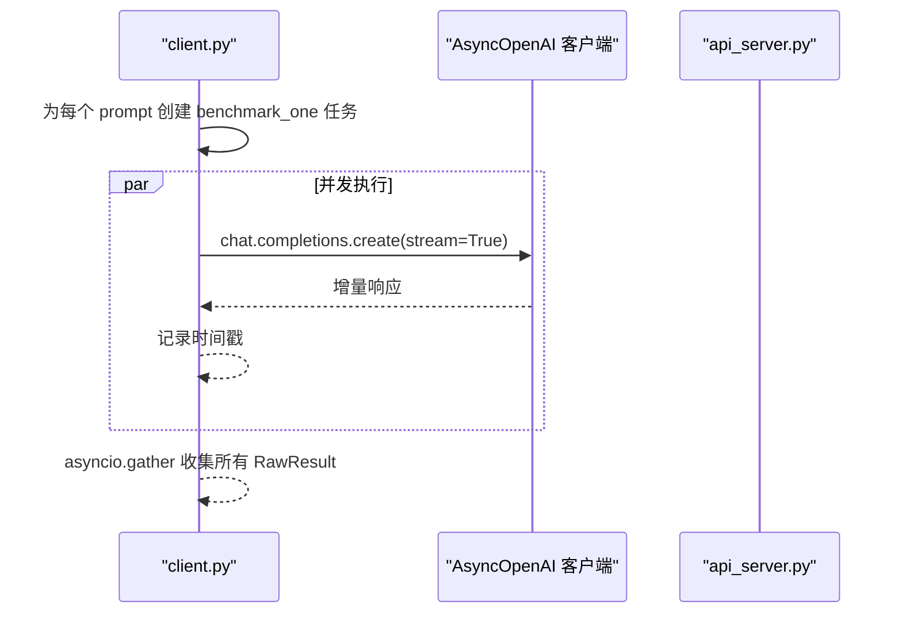

# 简化并发基准测试

<cite>
**本文引用的文件**
- [bench_simple.py](file://benchmark/online/bench_simple.py)
- [client.py](file://python/minisgl/benchmark/client.py)
- [api_server.py](file://python/minisgl/server/api_server.py)
- [__init__.py](file://python/minisgl/utils/__init__.py)
- [pyproject.toml](file://pyproject.toml)
</cite>

## 目录
1. [简介](#简介)
2. [项目结构](#项目结构)
3. [核心组件](#核心组件)
4. [架构总览](#架构总览)
5. [详细组件分析](#详细组件分析)
6. [依赖关系分析](#依赖关系分析)
7. [性能考量](#性能考量)
8. [故障排查指南](#故障排查指南)
9. [结论](#结论)

## 简介
本文件围绕简化版在线基准测试进行深入解析，重点说明 bench_simple.py 如何通过 generate_prompt 生成指定长度的随机文本作为测试输入，并使用 benchmark_one_batch 并发执行批量请求以评估系统吞吐能力。文档还阐述初始化流程：先通过 get_model_name 验证 API 服务器连接状态，再预生成一批测试消息与对应输出长度列表；随后解释 benchmark_one 如何通过流式响应（stream=True）精确测量 TTFT 和 TPOT，并利用 Console 类提供的进度条实时展示请求发送、预填充、解码与完成状态；最后说明 process_benchmark_results 如何汇总多个请求的性能数据，计算平均延迟、吞吐量（token/s 与 req/s）以及延迟分布。该测试模式适用于快速验证部署环境的基本性能。

## 项目结构
简化并发基准测试位于 benchmark/online/bench_simple.py，其核心依赖于 python/minisgl/benchmark/client.py 中的基准工具函数与进度条控制，同时与 python/minisgl/server/api_server.py 提供的 OpenAI 兼容接口交互。整体采用异步编程模型，通过 asyncio.gather 并发调度，结合 tqdm.asyncio 实时可视化。

图表来源
- [bench_simple.py](file://benchmark/online/bench_simple.py#L1-L82)
- [client.py](file://python/minisgl/benchmark/client.py#L1-L502)
- [api_server.py](file://python/minisgl/server/api_server.py#L239-L280)

章节来源
- [bench_simple.py](file://benchmark/online/bench_simple.py#L1-L82)
- [client.py](file://python/minisgl/benchmark/client.py#L1-L502)
- [api_server.py](file://python/minisgl/server/api_server.py#L239-L280)

## 核心组件
- 初始化与连接验证
  - 使用 get_model_name 向 /v1/models 发起请求，确认服务可用性与模型名称。
  - 通过 AutoTokenizer.from_pretrained 加载模型对应的分词器，用于后续生成指定长度的提示词。
- 测试消息与输出长度生成
  - generate_prompt 基于分词器词汇表随机采样，迭代调整直至达到目标 token 数。
  - 预生成一批测试消息与对应输出长度列表，便于后续批量测试。
- 并发基准执行
  - benchmark_one_batch 将多个请求并发提交，内部使用 asyncio.gather 收集结果。
  - benchmark_one 以流式方式接收增量响应，记录时间戳，区分首 token（TTFT）与后续 token（TPOT）。
- 结果处理与统计
  - process_benchmark_results 计算 TTFT/TPOT/E2E 的均值与分位数，统计 token/s 与 req/s，输出汇总日志。

章节来源
- [bench_simple.py](file://benchmark/online/bench_simple.py#L20-L82)
- [client.py](file://python/minisgl/benchmark/client.py#L183-L249)
- [client.py](file://python/minisgl/benchmark/client.py#L251-L285)
- [client.py](file://python/minisgl/benchmark/client.py#L320-L405)
- [client.py](file://python/minisgl/benchmark/client.py#L498-L502)

## 架构总览
简化并发基准测试的调用链路如下：客户端启动后，先连接服务端并加载分词器，随后生成测试数据，最后并发发起请求并统计性能指标。

图表来源
- [bench_simple.py](file://benchmark/online/bench_simple.py#L20-L82)
- [client.py](file://python/minisgl/benchmark/client.py#L202-L249)
- [client.py](file://python/minisgl/benchmark/client.py#L251-L285)
- [client.py](file://python/minisgl/benchmark/client.py#L320-L405)
- [api_server.py](file://python/minisgl/server/api_server.py#L244-L273)

## 详细组件分析

### 组件一：提示词生成与长度控制（generate_prompt）
- 设计要点
  - 基于分词器词汇表随机采样，迭代 decode/encode 直到 token 数满足要求。
  - 通过多次尝试确保生成稳定且接近目标长度。
- 复杂度与性能
  - 期望 O(k·T) 时间，k 为迭代次数，T 为 encode/decode 成本；实际受分词器实现影响。
- 错误处理
  - 若无法达到目标长度则抛出异常，避免返回不一致的输入。

图表来源
- [client.py](file://python/minisgl/benchmark/client.py#L183-L200)

章节来源
- [client.py](file://python/minisgl/benchmark/client.py#L183-L200)

### 组件二：单请求基准（benchmark_one）
- 设计要点
  - 以流式方式创建聊天补全请求，记录时间戳；首次增量块更新“预填充”进度，后续增量块更新“解码”进度。
  - 支持覆盖输入长度（input_length_override），便于固定输入长度的对比实验。
- 数据结构
  - RawResult 包含输入长度、输出长度、原始消息与各时刻时间戳序列。
- 进度条控制
  - Console 提供 inflight/prefill/decode/output 四类进度条，配合上下文管理器更新状态。

图表来源
- [client.py](file://python/minisgl/benchmark/client.py#L202-L249)
- [api_server.py](file://python/minisgl/server/api_server.py#L244-L273)

章节来源
- [client.py](file://python/minisgl/benchmark/client.py#L202-L249)
- [client.py](file://python/minisgl/benchmark/client.py#L64-L111)

### 组件三：批量并发基准（benchmark_one_batch）
- 设计要点
  - 对每个请求构造独立任务，使用 asyncio.gather 并发收集结果，提升吞吐。
  - 自动根据请求数与输出长度总和构建进度条，分别追踪请求发送、完成、预填充与解码 token。
- 并发策略
  - 通过任务列表与 gather 并行执行，充分利用网络与服务端资源。
- 输入长度覆盖
  - 支持对部分或全部请求覆盖输入长度，便于控制输入规模。

图表来源
- [client.py](file://python/minisgl/benchmark/client.py#L251-L285)
- [api_server.py](file://python/minisgl/server/api_server.py#L244-L273)

章节来源
- [client.py](file://python/minisgl/benchmark/client.py#L251-L285)

### 组件四：结果汇总与统计（process_benchmark_results）
- 设计要点
  - 从 RawResult.tics 中提取首 token 时延（TTFT）、后续 token 时延（TPOT）与端到端时延（E2E）。
  - 计算均值与分位数（p50/p90/p99），并统计总 token 数与请求数，推导 token/s 与 req/s。
  - 输出标准化后的相对时间序列，便于后续可视化或进一步分析。
- 性能指标
  - TTFT：首次增量响应到达时间（毫秒）
  - TPOT：后续增量响应间隔均值（毫秒）
  - E2E：请求开始到结束的总时长（秒）
  - 吞吐：token/s 与 req/s

图表来源
- [client.py](file://python/minisgl/benchmark/client.py#L320-L405)

章节来源
- [client.py](file://python/minisgl/benchmark/client.py#L320-L405)

### 组件五：初始化与连接验证（get_model_name）
- 设计要点
  - 调用 /v1/models 获取可用模型列表，返回首个模型 ID，用于后续请求。
- 错误处理
  - 若无可用模型则抛出异常，提示服务端未就绪。

图表来源
- [client.py](file://python/minisgl/benchmark/client.py#L498-L502)
- [api_server.py](file://python/minisgl/server/api_server.py#L276-L280)

章节来源
- [client.py](file://python/minisgl/benchmark/client.py#L498-L502)
- [api_server.py](file://python/minisgl/server/api_server.py#L276-L280)

### 组件六：主流程与参数配置（bench_simple.py）
- 设计要点
  - 设置随机种子保证可复现；定义端口、最大输入长度与批量大小等参数。
  - 生成测试消息与输出长度列表；先进行一次连接测试，再执行批量基准。
  - 打印连接成功/失败信息，并在完成后输出基准完成日志。
- 关键路径
  - 连接测试：benchmark_one(测试消息, 测试输出长度)；若时间戳数量过少则判定失败。
  - 批量执行：benchmark_one_batch(消息列表[:batch_size], 输出长度[:batch_size])

图表来源
- [bench_simple.py](file://benchmark/online/bench_simple.py#L20-L82)

章节来源
- [bench_simple.py](file://benchmark/online/bench_simple.py#L20-L82)

## 依赖关系分析
- 内部依赖
  - bench_simple.py 依赖 client.py 中的 generate_prompt、benchmark_one、benchmark_one_batch、process_benchmark_results、get_model_name、Console。
  - client.py 依赖 openai.AsyncOpenAI 与 transformers.AutoTokenizer。
- 外部依赖
  - pyproject.toml 中声明了 openai、transformers、uvicorn、fastapi、pyzmq 等依赖，确保服务端与客户端正常运行。

图表来源
- [bench_simple.py](file://benchmark/online/bench_simple.py#L1-L82)
- [client.py](file://python/minisgl/benchmark/client.py#L1-L502)
- [api_server.py](file://python/minisgl/server/api_server.py#L239-L280)
- [pyproject.toml](file://pyproject.toml#L24-L37)

章节来源
- [pyproject.toml](file://pyproject.toml#L24-L37)

## 性能考量
- 并发与吞吐
  - benchmark_one_batch 使用 asyncio.gather 并发执行，显著提升吞吐；建议根据服务端并发限制与网络带宽合理设置批量大小。
- 流式响应精度
  - 通过流式增量响应精确捕获 TTFT 与 TPOT，避免非流式场景下的聚合误差。
- 输入长度控制
  - 可通过 input_length_override 固定输入长度，减少输入差异带来的噪声。
- 统计稳健性
  - 使用分位数（p50/p90/p99）与均值综合评估延迟分布，更全面反映尾延迟与稳定性。

## 故障排查指南
- 服务端未启动或端口错误
  - 现象：连接测试失败或报错。
  - 排查：确认服务端监听地址与端口（默认 1919），检查 /v1/models 是否可达。
- 分词器加载失败
  - 现象：from_pretrained 抛出异常。
  - 排查：确认模型名称正确，网络可访问模型仓库或本地缓存可用。
- 请求超时或响应异常
  - 现象：benchmark_one 返回时间戳数量不足。
  - 排查：检查服务端是否正确处理流式响应，确认 /v1/chat/completions 路由可用。
- 批量执行异常
  - 现象：某批次执行报错但不影响其他批次。
  - 排查：记录 batch_size 与错误信息，适当降低批量大小或调整输出长度范围。

章节来源
- [bench_simple.py](file://benchmark/online/bench_simple.py#L42-L73)
- [client.py](file://python/minisgl/benchmark/client.py#L202-L249)
- [api_server.py](file://python/minisgl/server/api_server.py#L244-L273)

## 结论
简化并发基准测试通过 generate_prompt 生成可控长度的随机提示词，借助 benchmark_one_batch 并发执行批量请求，结合流式响应精准测量 TTFT/TPOT/E2E，并以 process_benchmark_results 输出吞吐与延迟分布统计。该方案适合快速验证部署环境的基础性能，便于在不同批量大小与输入长度下评估系统稳定性与扩展性。