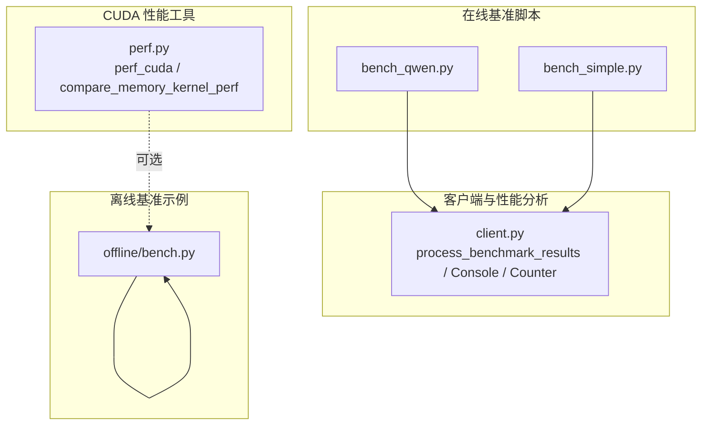
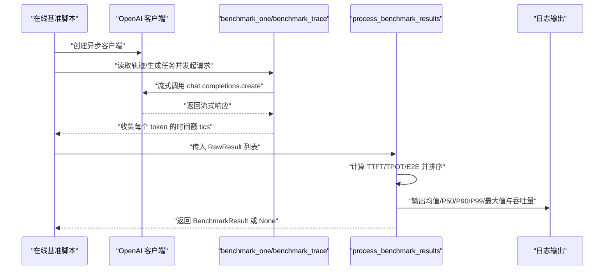
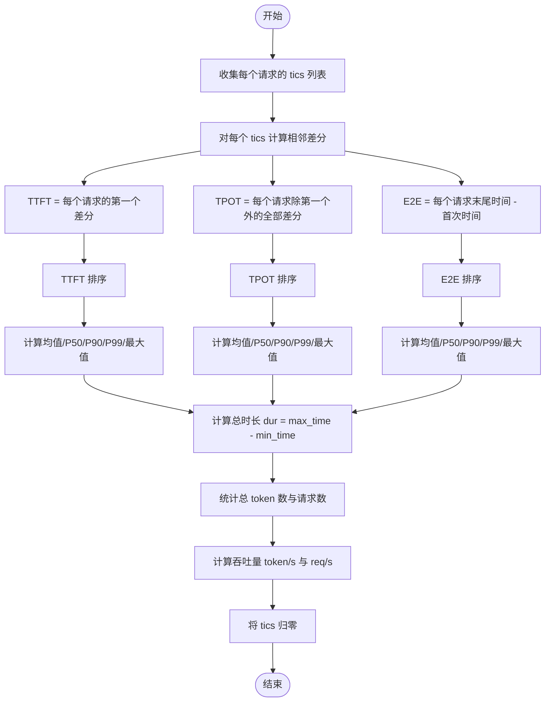
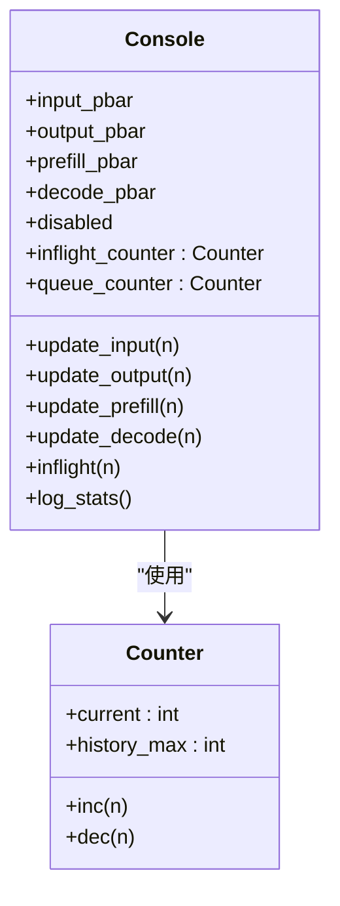
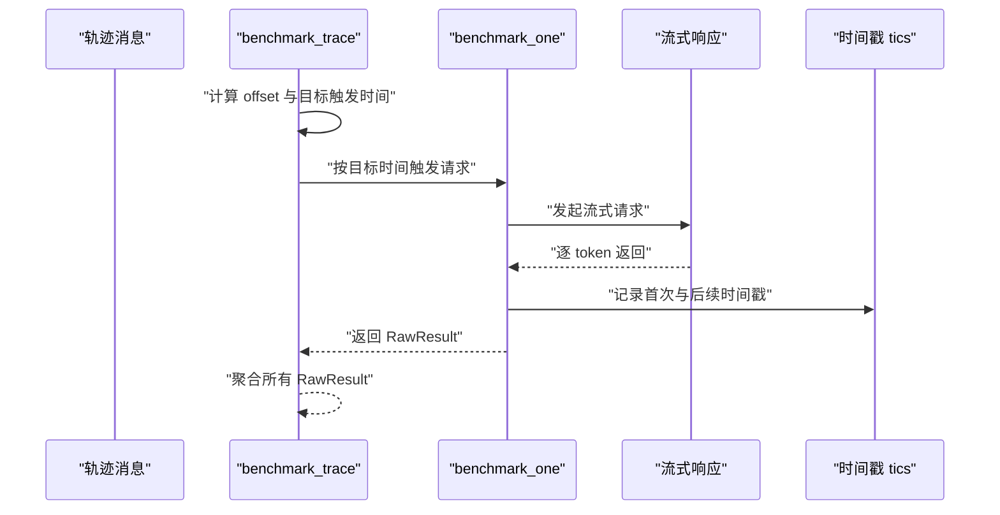
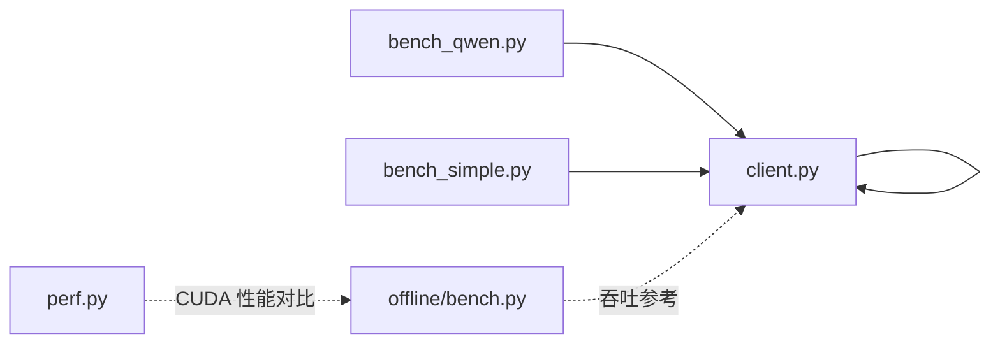

# 性能指标分析

<cite>
**本文引用的文件**
- [python/minisgl/benchmark/client.py](file://python/minisgl/benchmark/client.py)
- [benchmark/online/bench_qwen.py](file://benchmark/online/bench_qwen.py)
- [benchmark/online/bench_simple.py](file://benchmark/online/bench_simple.py)
- [python/minisgl/benchmark/perf.py](file://python/minisgl/benchmark/perf.py)
- [benchmark/offline/bench.py](file://benchmark/offline/bench.py)
</cite>

## 目录
1. [引言](#引言)
2. [项目结构](#项目结构)
3. [核心组件](#核心组件)
4. [架构总览](#架构总览)
5. [详细组件分析](#详细组件分析)
6. [依赖关系分析](#依赖关系分析)
7. [性能考量](#性能考量)
8. [故障排查指南](#故障排查指南)
9. [结论](#结论)
10. [附录](#附录)

## 引言
本文件围绕“process_benchmark_results”函数如何从原始计时数据中提取关键性能指标展开，系统性阐述三类核心延迟的计算方法：
- 首 token 延迟（TTFT）：取每个请求第一个时间间隔
- 每 token 处理时间（TPOT）：取后续所有间隔
- 端到端延迟（E2E）：取总耗时

同时说明该函数如何对上述指标进行排序并计算 P50、P90、P99 分位数以及平均值、最大值；解释吞吐量（token/s、req/s）的计算逻辑，基于总处理时长与请求数量；并介绍 Console 类如何利用 Counter 和 tqdm 实时跟踪飞行中（inflight）与排队（queued）的请求数量，在测试结束时输出最大并发统计。最后给出日志输出格式的解读与性能瓶颈分析建议。

## 项目结构
本项目的基准测试主要位于以下模块：
- 在线基准测试脚本：用于模拟真实流量，加载外部轨迹并进行压测
  - Qwen 轨迹示例：[benchmark/online/bench_qwen.py](file://benchmark/online/bench_qwen.py)
  - 简单批量示例：[benchmark/online/bench_simple.py](file://benchmark/online/bench_simple.py)
- 客户端与性能分析核心实现：负责采集时间戳、计算指标、输出统计
  - 客户端与结果处理：[python/minisgl/benchmark/client.py](file://python/minisgl/benchmark/client.py)
- 离线基准示例：展示离线推理吞吐计算方式
  - 示例脚本：[benchmark/offline/bench.py](file://benchmark/offline/bench.py)
- CUDA 性能对比工具：用于内核级性能评估（可选）
  - 工具函数：[python/minisgl/benchmark/perf.py](file://python/minisgl/benchmark/perf.py)

图表来源
- [benchmark/online/bench_qwen.py](file://benchmark/online/bench_qwen.py#L1-L56)
- [benchmark/online/bench_simple.py](file://benchmark/online/bench_simple.py#L1-L82)
- [python/minisgl/benchmark/client.py](file://python/minisgl/benchmark/client.py#L1-L502)
- [benchmark/offline/bench.py](file://benchmark/offline/bench.py#L1-L39)
- [python/minisgl/benchmark/perf.py](file://python/minisgl/benchmark/perf.py#L1-L75)

章节来源
- [benchmark/online/bench_qwen.py](file://benchmark/online/bench_qwen.py#L1-L56)
- [benchmark/online/bench_simple.py](file://benchmark/online/bench_simple.py#L1-L82)
- [python/minisgl/benchmark/client.py](file://python/minisgl/benchmark/client.py#L1-L502)
- [benchmark/offline/bench.py](file://benchmark/offline/bench.py#L1-L39)
- [python/minisgl/benchmark/perf.py](file://python/minisgl/benchmark/perf.py#L1-L75)

## 核心组件
- process_benchmark_results：从原始时间戳列表中提取 TTFT、TPOT、E2E，排序后计算均值、P50/P90/P99、最大值，并输出吞吐量（token/s、req/s），同时将时间归零以便后续可视化或导出。
- Console/Counter：通过 tqdm 进度条与自定义计数器，实时追踪飞行中与排队中的请求数量，并在测试结束时输出最大并发统计。
- benchmark_trace/benchmark_one：采集每个请求的时间戳序列，作为后续指标计算的基础。

章节来源
- [python/minisgl/benchmark/client.py](file://python/minisgl/benchmark/client.py#L202-L248)
- [python/minisgl/benchmark/client.py](file://python/minisgl/benchmark/client.py#L287-L310)
- [python/minisgl/benchmark/client.py](file://python/minisgl/benchmark/client.py#L320-L405)
- [python/minisgl/benchmark/client.py](file://python/minisgl/benchmark/client.py#L64-L110)

## 架构总览
下图展示了在线基准脚本如何调用客户端接口，采集时间戳并最终由 process_benchmark_results 计算性能指标的整体流程。

图表来源
- [benchmark/online/bench_qwen.py](file://benchmark/online/bench_qwen.py#L37-L51)
- [benchmark/online/bench_simple.py](file://benchmark/online/bench_simple.py#L63-L73)
- [python/minisgl/benchmark/client.py](file://python/minisgl/benchmark/client.py#L202-L248)
- [python/minisgl/benchmark/client.py](file://python/minisgl/benchmark/client.py#L287-L310)
- [python/minisgl/benchmark/client.py](file://python/minisgl/benchmark/client.py#L320-L405)

## 详细组件分析

### 组件一：process_benchmark_results 指标计算
该函数的核心职责是：
- 从每个请求的时间戳序列中计算三类延迟：
  - TTFT：首个时间间隔
  - TPOT：除首个间隔外的所有间隔之和与数量
  - E2E：最后一个时间戳减去第一个时间戳
- 对三类延迟分别排序，计算均值、P50、P90、P99、最大值
- 基于总处理时长与总 token 数、请求数计算吞吐量（token/s、req/s）
- 将时间戳统一归零，便于后续可视化或导出

图表来源
- [python/minisgl/benchmark/client.py](file://python/minisgl/benchmark/client.py#L320-L405)

章节来源
- [python/minisgl/benchmark/client.py](file://python/minisgl/benchmark/client.py#L320-L405)

### 组件二：Console 与 Counter 的并发统计
Console 通过四个 tqdm 进度条分别跟踪“发送请求”“完成请求”“预填充 token”“解码 token”，并在每次更新时同步维护两个计数器：
- inflight_counter：飞行中请求数，进入时递增，退出时递减
- queue_counter：排队请求数，进入时递增，预填充阶段递减

测试结束后，Console 在 log_stats 上下文中关闭进度条并输出最大并发统计（最大飞行中、最大排队）。

图表来源
- [python/minisgl/benchmark/client.py](file://python/minisgl/benchmark/client.py#L64-L110)

章节来源
- [python/minisgl/benchmark/client.py](file://python/minisgl/benchmark/client.py#L64-L110)

### 组件三：时间戳采集与轨迹调度
- benchmark_one：对单个请求进行流式调用，记录首次消息到达与后续每个 token 到达的时间戳，形成 tics 序列
- benchmark_trace：根据外部轨迹中的时间戳进行“按时发射”，确保多请求的相对时序一致

图表来源
- [python/minisgl/benchmark/client.py](file://python/minisgl/benchmark/client.py#L202-L248)
- [python/minisgl/benchmark/client.py](file://python/minisgl/benchmark/client.py#L287-L310)

章节来源
- [python/minisgl/benchmark/client.py](file://python/minisgl/benchmark/client.py#L202-L248)
- [python/minisgl/benchmark/client.py](file://python/minisgl/benchmark/client.py#L287-L310)

### 组件四：吞吐量计算逻辑
- token/s = 总 token 数 / 总处理时长（秒）
- req/s = 总请求数 / 总处理时长（秒）
- 总处理时长 dur = 所有请求中最大时间戳 - 最小时间戳

章节来源
- [python/minisgl/benchmark/client.py](file://python/minisgl/benchmark/client.py#L362-L384)

### 组件五：日志输出格式与解读
process_benchmark_results 输出的关键信息包括：
- 请求总数与 token 总数
- TTFT、TPOT、E2E 的均值与各分位数（P50/P90/P99）与最大值
- 总处理时长
- 吞吐量（token/s、req/s）

解读要点：
- TTFT：反映模型首次返回的延迟，越低越好
- TPOT：反映模型持续生成的效率，越低越好
- E2E：反映端到端整体耗时，越低越好
- 吞吐量：越高越好，但需结合系统资源与稳定性综合评估

章节来源
- [python/minisgl/benchmark/client.py](file://python/minisgl/benchmark/client.py#L370-L384)

### 组件六：性能瓶颈分析指南
- 若 TTFT 明显偏高：检查预填充阶段（KV 缓存初始化、输入编码、调度等待）是否成为瓶颈
- 若 TPOT 明显偏高：关注解码阶段（注意力计算、采样、I/O）的性能
- 若 E2E 偏高：综合考虑 TTFT 与 TPOT，同时关注网络往返、服务端队列长度与并发限制
- 吞吐量不足：检查 GPU/CPU 利用率、内存带宽、批大小与并发度设置

[本节为通用指导，不直接分析具体文件]

## 依赖关系分析
- 在线基准脚本依赖客户端模块提供的 benchmark_one/benchmark_trace/process_benchmark_results 等能力
- Console/Counter 作为辅助组件贯穿请求生命周期，提供并发统计
- 离线基准示例展示了另一种吞吐计算思路（总 token / 总时间），可与在线指标互为补充

图表来源
- [benchmark/online/bench_qwen.py](file://benchmark/online/bench_qwen.py#L1-L56)
- [benchmark/online/bench_simple.py](file://benchmark/online/bench_simple.py#L1-L82)
- [python/minisgl/benchmark/client.py](file://python/minisgl/benchmark/client.py#L1-L502)
- [benchmark/offline/bench.py](file://benchmark/offline/bench.py#L1-L39)
- [python/minisgl/benchmark/perf.py](file://python/minisgl/benchmark/perf.py#L1-L75)

章节来源
- [benchmark/online/bench_qwen.py](file://benchmark/online/bench_qwen.py#L1-L56)
- [benchmark/online/bench_simple.py](file://benchmark/online/bench_simple.py#L1-L82)
- [python/minisgl/benchmark/client.py](file://python/minisgl/benchmark/client.py#L1-L502)
- [benchmark/offline/bench.py](file://benchmark/offline/bench.py#L1-L39)
- [python/minisgl/benchmark/perf.py](file://python/minisgl/benchmark/perf.py#L1-L75)

## 性能考量
- 时间戳粒度：流式响应的每个 token 到达都会记录一次时间戳，粒度越细，统计越精确，但也会增加数据量
- 排序与分位数：排序复杂度与请求数量成正比，建议在大规模数据时注意内存与时间开销
- 吞吐量口径：在线与离线的吞吐计算口径不同，应明确区分场景后再做对比
- CUDA 性能工具：如需进行内核级性能对比，可参考 perf_cuda 与 compare_memory_kernel_perf

[本节提供一般性建议，不直接分析具体文件]

## 故障排查指南
- 无输出或吞吐量异常为 0：确认 process_benchmark_results 是否被正确调用，且 dur > 0
- TTFT/TPOT/E2E 全部为 0：检查 benchmark_one 是否正确记录 tics，确认流式响应是否正常返回
- 进度条未关闭或最大并发未输出：确认 Console 的 log_stats 上下文是否被正确使用
- 服务器连接失败：在 bench_simple 中包含连接测试逻辑，可据此定位服务端问题

章节来源
- [python/minisgl/benchmark/client.py](file://python/minisgl/benchmark/client.py#L362-L384)
- [python/minisgl/benchmark/client.py](file://python/minisgl/benchmark/client.py#L99-L110)
- [benchmark/online/bench_simple.py](file://benchmark/online/bench_simple.py#L45-L57)

## 结论
process_benchmark_results 提供了从原始时间戳到关键性能指标的完整链路：TTFT、TPOT、E2E 的定义清晰、分位数与均值/最大值的计算直观，吞吐量基于总处理时长与总量得出。配合 Console/Counter 的并发统计，能够帮助快速识别系统瓶颈并优化性能。建议在实际使用中结合离线与在线两种吞吐口径，综合评估系统在不同负载下的表现。

[本节为总结性内容，不直接分析具体文件]

## 附录
- 离线吞吐示例：通过总 token 数除以总时间得到吞吐量，适用于离线批量推理场景
- CUDA 性能对比：可用于内核级性能评估与优化

章节来源
- [benchmark/offline/bench.py](file://benchmark/offline/bench.py#L21-L34)
- [python/minisgl/benchmark/perf.py](file://python/minisgl/benchmark/perf.py#L10-L75)