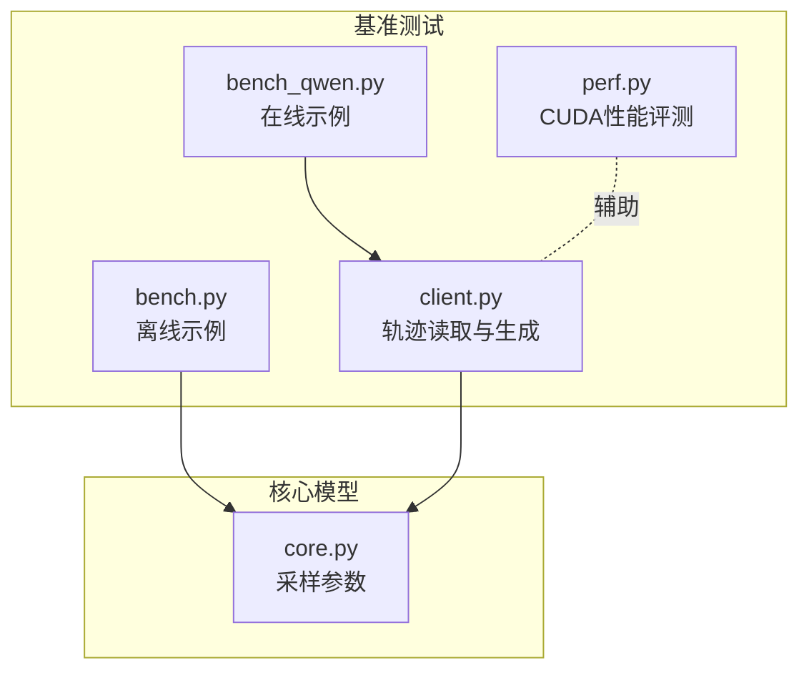
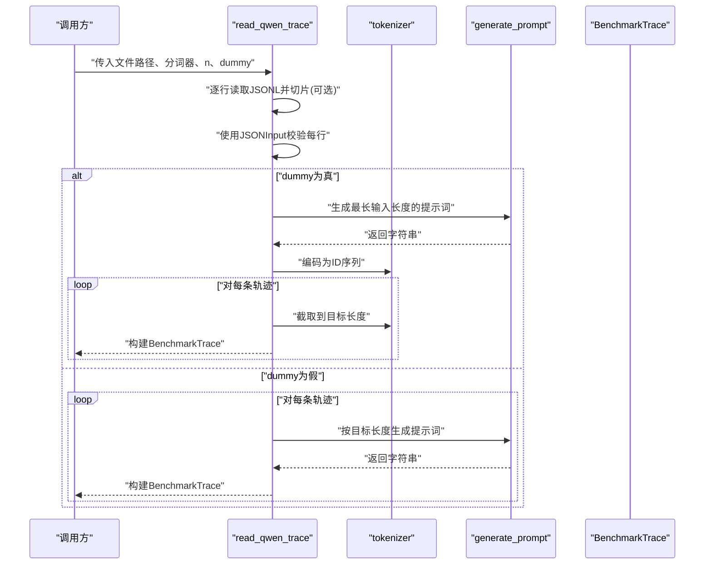
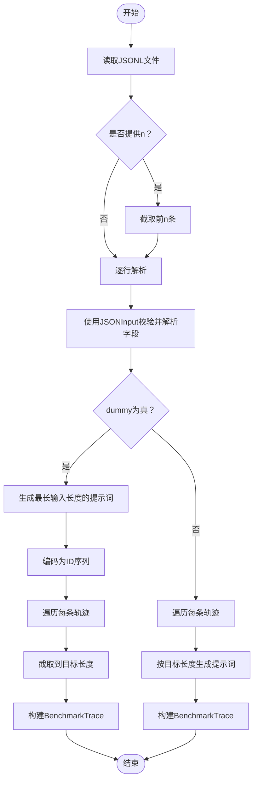
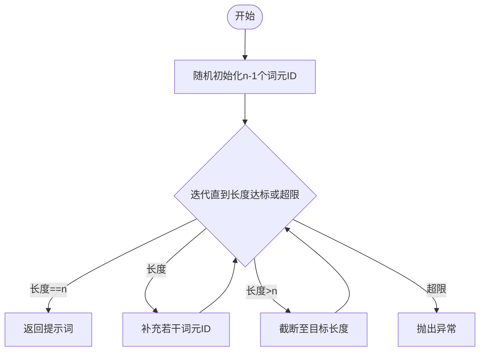
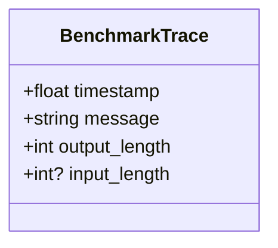
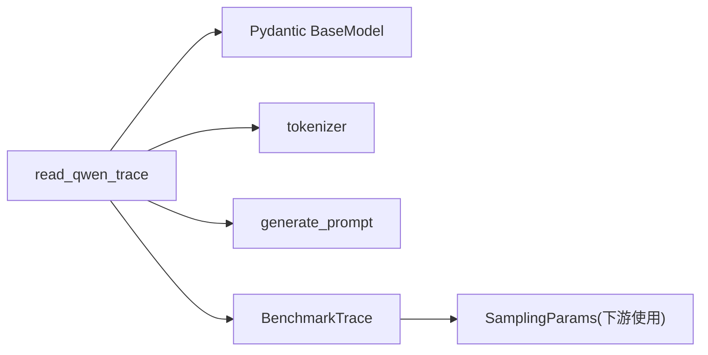

# 请求轨迹处理

<cite>
**本文引用的文件**
- [python/minisgl/benchmark/client.py](file://python/minisgl/benchmark/client.py)
- [python/minisgl/benchmark/perf.py](file://python/minisgl/benchmark/perf.py)
- [python/minisgl/core.py](file://python/minisgl/core.py)
- [benchmark/online/bench_qwen.py](file://benchmark/online/bench_qwen.py)
- [benchmark/offline/bench.py](file://benchmark/offline/bench.py)
</cite>

## 目录
1. [简介](#简介)
2. [项目结构](#项目结构)
3. [核心组件](#核心组件)
4. [架构总览](#架构总览)
5. [详细组件分析](#详细组件分析)
6. [依赖关系分析](#依赖关系分析)
7. [性能考量](#性能考量)
8. [故障排查指南](#故障排查指南)
9. [结论](#结论)
10. [附录](#附录)

## 简介
本文件围绕 read_qwen_trace 函数展开，系统性解析其如何从 JSONL 文件中加载真实用户请求轨迹数据，包括：
- 使用 Pydantic 模型 JSONInput 解析每条日志记录，提取时间戳与输入/输出长度等关键字段；
- 结合 generate_prompt 函数，解释其通过随机采样词元ID并反复解码-编码迭代来精确控制生成文本长度的机制；
- 阐述 dummy 参数的作用：启用时使用固定生成的长提示词并截取以匹配目标长度，确保测试一致性；禁用时为每个请求动态生成符合长度要求的随机提示词；
- 说明 n 参数如何限制加载的请求数量以进行快速测试；
- 提供实际数据格式示例与处理流程图，帮助读者快速理解端到端工作流。

## 项目结构
本次分析聚焦于基准测试与轨迹处理相关模块，涉及以下文件：
- python/minisgl/benchmark/client.py：包含 read_qwen_trace、read_mooncake_trace、generate_prompt、BenchmarkTrace 等核心实现；
- python/minisgl/benchmark/perf.py：提供 CUDA 性能评测工具（与本主题关联较弱）；
- python/minisgl/core.py：包含 SamplingParams 等通用采样参数定义；
- benchmark/online/bench_qwen.py：在线基准脚本，演示如何下载并使用 Qwen 轨迹数据；
- benchmark/offline/bench.py：离线基准脚本，展示随机构造输入序列的方式（作为对比参考）。

图表来源
- [python/minisgl/benchmark/client.py](file://python/minisgl/benchmark/client.py#L1-L502)
- [python/minisgl/benchmark/perf.py](file://python/minisgl/benchmark/perf.py#L1-L75)
- [python/minisgl/core.py](file://python/minisgl/core.py#L1-L156)
- [benchmark/online/bench_qwen.py](file://benchmark/online/bench_qwen.py#L1-L56)
- [benchmark/offline/bench.py](file://benchmark/offline/bench.py#L1-L39)

章节来源
- [python/minisgl/benchmark/client.py](file://python/minisgl/benchmark/client.py#L1-L502)
- [benchmark/online/bench_qwen.py](file://benchmark/online/bench_qwen.py#L1-L56)
- [benchmark/offline/bench.py](file://benchmark/offline/bench.py#L1-L39)

## 核心组件
- read_qwen_trace：从 JSONL 文件读取轨迹，使用 Pydantic JSONInput 解析字段，按需生成或截取提示词，返回 BenchmarkTrace 列表。
- generate_prompt：基于分词器随机采样词元ID，反复解码-编码迭代，确保最终长度精确等于目标值。
- BenchmarkTrace：封装单条轨迹的时间戳、消息、输入/输出长度等字段。
- n 参数：限制读取的请求数量，便于快速测试与调试。
- dummy 参数：控制是否使用统一的“固定长提示词”策略，提升测试一致性。

章节来源
- [python/minisgl/benchmark/client.py](file://python/minisgl/benchmark/client.py#L18-L24)
- [python/minisgl/benchmark/client.py](file://python/minisgl/benchmark/client.py#L183-L199)
- [python/minisgl/benchmark/client.py](file://python/minisgl/benchmark/client.py#L407-L442)

## 架构总览
下图展示了 read_qwen_trace 的整体调用链与数据流：

图表来源
- [python/minisgl/benchmark/client.py](file://python/minisgl/benchmark/client.py#L407-L442)
- [python/minisgl/benchmark/client.py](file://python/minisgl/benchmark/client.py#L183-L199)

## 详细组件分析

### read_qwen_trace 组件分析
- 输入参数
  - file_path：JSONL 文件路径
  - tokenizer：分词器对象，用于编码/解码
  - n：整数或 None，限制读取的请求数量
  - dummy：布尔值，控制是否采用固定长提示词策略
- 关键步骤
  - 读取文件并按 n 截断（若提供）
  - 使用 JSONInput 对每行进行 Pydantic 校验，提取字段：chat_id、parent_chat_id、timestamp、input_length、output_length、type、turn、hash_ids 等
  - 若 dummy 为真：先生成一个足够长的提示词，再对所有轨迹统一截取到各自的目标长度；否则：对每条轨迹独立生成符合其 input_length 的提示词
  - 返回 BenchmarkTrace 列表，包含 timestamp、message、input_length、output_length
- 字段说明
  - timestamp：请求到达时间（秒）
  - message：输入提示词（字符串）
  - input_length：输入长度（token）
  - output_length：期望输出长度（token）

图表来源
- [python/minisgl/benchmark/client.py](file://python/minisgl/benchmark/client.py#L407-L442)

章节来源
- [python/minisgl/benchmark/client.py](file://python/minisgl/benchmark/client.py#L407-L442)

### generate_prompt 组件分析
- 目标：生成长度约为 n 的提示词字符串
- 策略
  - 从词表大小的一半范围内随机采样 n-1 个词元ID作为初始序列
  - 迭代过程：解码为字符串，再编码为ID序列，比较当前长度与目标长度
    - 若相等则成功返回
    - 若小于目标，则补充若干词元ID
    - 若大于目标，则截断至目标长度
  - 最多重试若干次（例如固定上限），若仍不满足则抛出异常
- 复杂度
  - 时间复杂度近似 O(k·T)，其中 k 为平均每次迭代的增补/截断数量，T 为迭代次数上限
  - 空间复杂度 O(n)

图表来源
- [python/minisgl/benchmark/client.py](file://python/minisgl/benchmark/client.py#L183-L199)

章节来源
- [python/minisgl/benchmark/client.py](file://python/minisgl/benchmark/client.py#L183-L199)

### BenchmarkTrace 数据模型
- 字段
  - timestamp：float，请求到达时间（秒）
  - message：str，输入提示词
  - output_length：int，期望输出长度（token）
  - input_length：int | None，输入长度（token），可为空
- 用途
  - 作为 benchmark_trace 的输入，驱动按时间戳精确调度请求

图表来源
- [python/minisgl/benchmark/client.py](file://python/minisgl/benchmark/client.py#L18-L24)

章节来源
- [python/minisgl/benchmark/client.py](file://python/minisgl/benchmark/client.py#L18-L24)

### dummy 参数的作用
- 启用（dummy=True）
  - 先生成一个足够长的提示词（长度为所有轨迹中的最大 input_length）
  - 对所有轨迹统一编码后，按各自目标长度截取，保证输入长度严格一致
  - 优点：测试一致性高，便于对比不同吞吐/延迟策略
  - 缺点：可能引入非真实分布的输入长度
- 禁用（dummy=False）
  - 对每条轨迹独立生成符合其 input_length 的提示词
  - 更贴近真实分布，但测试一致性稍差

章节来源
- [python/minisgl/benchmark/client.py](file://python/minisgl/benchmark/client.py#L428-L442)

### n 参数的作用
- 限制读取的请求数量，便于快速测试与调试
- 在读取阶段直接对行列表进行切片，避免加载全部数据

章节来源
- [python/minisgl/benchmark/client.py](file://python/minisgl/benchmark/client.py#L423-L427)

### 实际数据格式示例
- JSONL 行格式（对应 JSONInput 字段）
  - chat_id：整数
  - parent_chat_id：整数
  - timestamp：浮点数（秒）
  - input_length：整数（token）
  - output_length：整数（token）
  - type、turn、hash_ids：未使用字段
- 示例行（示意）
  - {"chat_id": 12345, "parent_chat_id": 0, "timestamp": 1719900000.123, "input_length": 1024, "output_length": 512, "type": "user", "turn": 1, "hash_ids": []}

章节来源
- [python/minisgl/benchmark/client.py](file://python/minisgl/benchmark/client.py#L413-L423)

### 与在线示例的集成
- bench_qwen.py 展示了如何下载公开的 Qwen 轨迹数据并使用 read_qwen_trace 加载，随后通过 scale_traces 调整时间尺度，最后调用 benchmark_trace 执行基准测试。

章节来源
- [benchmark/online/bench_qwen.py](file://benchmark/online/bench_qwen.py#L1-L56)
- [python/minisgl/benchmark/client.py](file://python/minisgl/benchmark/client.py#L479-L496)

## 依赖关系分析
- read_qwen_trace 依赖
  - Pydantic BaseModel：用于 JSONL 行的结构化解析
  - 分词器 tokenizer：用于 encode/decode，控制提示词长度
  - generate_prompt：生成指定长度的提示词
  - BenchmarkTrace：封装轨迹结果
- 与其他模块的关系
  - 与 core.py 中的 SamplingParams 无直接耦合，但下游 benchmark_trace 可能会使用该参数控制生成行为

图表来源
- [python/minisgl/benchmark/client.py](file://python/minisgl/benchmark/client.py#L183-L199)
- [python/minisgl/benchmark/client.py](file://python/minisgl/benchmark/client.py#L407-L442)
- [python/minisgl/core.py](file://python/minisgl/core.py#L14-L21)

章节来源
- [python/minisgl/benchmark/client.py](file://python/minisgl/benchmark/client.py#L183-L199)
- [python/minisgl/benchmark/client.py](file://python/minisgl/benchmark/client.py#L407-L442)
- [python/minisgl/core.py](file://python/minisgl/core.py#L14-L21)

## 性能考量
- read_qwen_trace
  - IO：按行读取 JSONL，内存占用与行数线性相关
  - 解析：Pydantic 校验每行，开销与行数线性相关
  - dummy 策略：一次性生成长提示词并复用，减少重复生成成本
- generate_prompt
  - 随机采样+迭代校正，通常迭代次数有限且稳定
  - 对于大长度输入，编码/解码成本较高，建议在 dummy=True 时集中生成一次
- n 参数
  - 通过提前切片减少 IO 与解析开销，适合快速验证

[本节为通用性能讨论，无需特定文件引用]

## 故障排查指南
- JSONL 格式错误
  - 现象：解析失败或字段缺失
  - 排查：确认每行是否为合法 JSON，字段名称与类型是否匹配 JSONInput 定义
- 生成长度不达标
  - 现象：generate_prompt 抛出异常
  - 排查：检查分词器是否支持目标长度范围，尝试减小 n 或调整词表范围
- dummy 策略导致输入长度异常
  - 现象：所有请求输入长度相同
  - 排查：关闭 dummy，改为按目标长度独立生成提示词
- 内存不足
  - 现象：大文件加载失败
  - 排查：使用较小的 n，或分批处理

章节来源
- [python/minisgl/benchmark/client.py](file://python/minisgl/benchmark/client.py#L183-L199)
- [python/minisgl/benchmark/client.py](file://python/minisgl/benchmark/client.py#L407-L442)

## 结论
read_qwen_trace 通过 Pydantic 对 JSONL 行进行结构化解析，结合 generate_prompt 的迭代校正机制，能够稳定地将真实轨迹转换为可执行的 BenchmarkTrace 序列。dummy 参数提供了“固定长提示词”的一致性测试能力，而 n 参数则为快速测试与调试提供了便捷入口。配合 bench_qwen.py 的在线示例，可以高效地复现实时轨迹场景下的性能评估。

[本节为总结性内容，无需特定文件引用]

## 附录
- 术语
  - JSONL：每行一条 JSON 记录的日志格式
  - token：分词后的最小语言单位
  - dummy：固定长提示词策略
- 相关实现位置
  - read_qwen_trace：[python/minisgl/benchmark/client.py](file://python/minisgl/benchmark/client.py#L407-L442)
  - generate_prompt：[python/minisgl/benchmark/client.py](file://python/minisgl/benchmark/client.py#L183-L199)
  - BenchmarkTrace：[python/minisgl/benchmark/client.py](file://python/minisgl/benchmark/client.py#L18-L24)
  - 在线示例：[benchmark/online/bench_qwen.py](file://benchmark/online/bench_qwen.py#L1-L56)
  - 离线示例：[benchmark/offline/bench.py](file://benchmark/offline/bench.py#L1-L39)