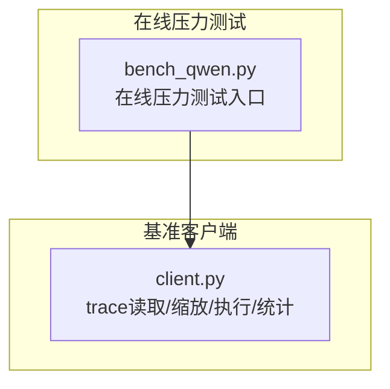
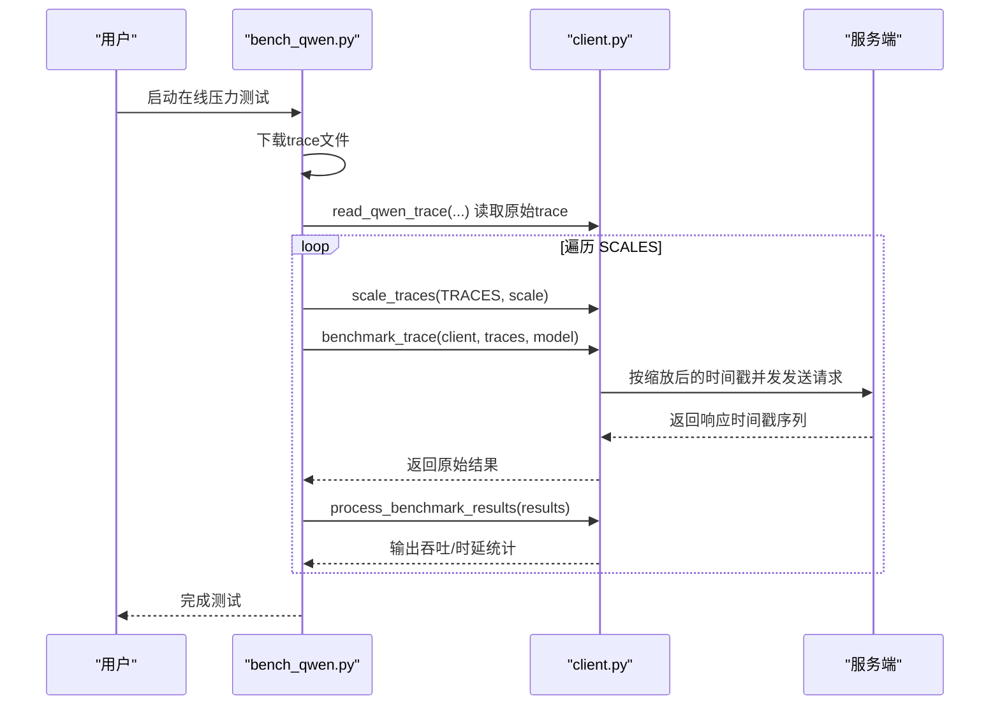
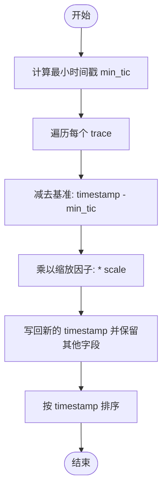
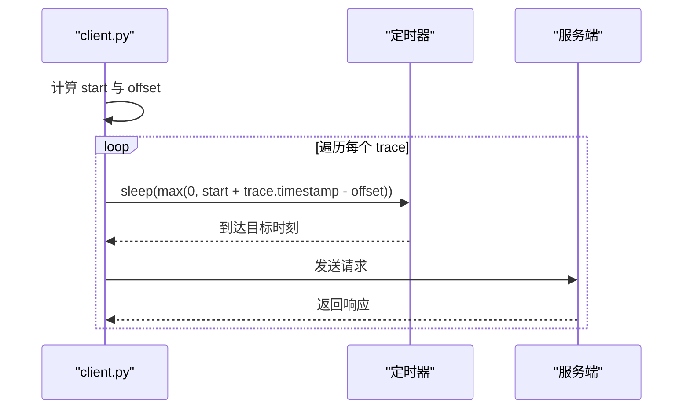
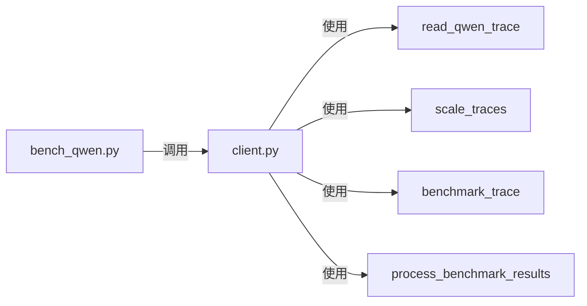

# 负载压力模拟

<cite>
**本文引用的文件**
- [bench_qwen.py](file://benchmark/online/bench_qwen.py)
- [client.py](file://python/minisgl/benchmark/client.py)
</cite>

## 目录
1. [引言](#引言)
2. [项目结构](#项目结构)
3. [核心组件](#核心组件)
4. [架构总览](#架构总览)
5. [详细组件分析](#详细组件分析)
6. [依赖关系分析](#依赖关系分析)
7. [性能考量](#性能考量)
8. [故障排查指南](#故障排查指南)
9. [结论](#结论)

## 引言
本文件围绕多级负载压力测试中的“缩放请求时间戳”机制展开，重点解释 scale_traces 函数如何通过线性缩放请求之间的相对时间间隔（timestamp），在不改变请求顺序的前提下，模拟不同并发强度与系统负载。我们还将结合 bench_qwen.py 中的 SCALES 列表，说明为何选择从 0.4 到 1.6 的递增序列来评估系统从轻载到重载的性能变化趋势，并给出缩放示意图与不同因子下 QPS 的计算示例。

## 项目结构
本次文档聚焦于在线压力测试脚本与基准客户端模块：
- 在线压力测试入口：benchmark/online/bench_qwen.py
- 基准客户端工具：python/minisgl/benchmark/client.py（包含 trace 读取、缩放、执行与结果统计）

图表来源
- [bench_qwen.py](file://benchmark/online/bench_qwen.py#L1-L56)
- [client.py](file://python/minisgl/benchmark/client.py#L1-L200)

章节来源
- [bench_qwen.py](file://benchmark/online/bench_qwen.py#L1-L56)
- [client.py](file://python/minisgl/benchmark/client.py#L1-L200)

## 核心组件
- scale_traces：对一组 BenchmarkTrace 进行时间戳线性缩放，同时保持请求顺序稳定
- benchmark_trace：按缩放后的相对时间戳排队执行，模拟真实并发
- read_qwen_trace：从外部 trace 文件读取原始请求，构造 BenchmarkTrace 列表
- process_benchmark_results：对一次运行的结果进行统计，输出吞吐等指标

章节来源
- [client.py](file://python/minisgl/benchmark/client.py#L479-L496)
- [client.py](file://python/minisgl/benchmark/client.py#L286-L308)
- [client.py](file://python/minisgl/benchmark/client.py#L407-L443)
- [client.py](file://python/minisgl/benchmark/client.py#L320-L405)

## 架构总览
整体流程如下：下载并读取 trace，按不同缩放因子生成多组输入，逐个执行并统计结果。

图表来源
- [bench_qwen.py](file://benchmark/online/bench_qwen.py#L37-L51)
- [client.py](file://python/minisgl/benchmark/client.py#L286-L308)
- [client.py](file://python/minisgl/benchmark/client.py#L407-L443)
- [client.py](file://python/minisgl/benchmark/client.py#L320-L405)

## 详细组件分析

### scale_traces：线性缩放请求时间戳
- 输入：一组 BenchmarkTrace（包含相对时间戳 timestamp、消息体、输入/输出长度）
- 关键步骤
  - 计算最小时间戳 min_tic，作为归一化基准
  - 对每个 trace 的 timestamp 执行 (timestamp - min_tic) * scale
  - 对缩放后的结果按 timestamp 排序，确保顺序稳定
- 影响
  - 当 scale < 1.0：时间间隔被压缩，请求更密集，系统负载更高
  - 当 scale > 1.0：时间间隔被拉长，请求更稀疏，系统负载更低
  - 保持原始请求顺序不变，仅改变相对节奏

图表来源
- [client.py](file://python/minisgl/benchmark/client.py#L479-L496)

章节来源
- [client.py](file://python/minisgl/benchmark/client.py#L479-L496)

### benchmark_trace：基于缩放时间戳的并发执行
- 作用：将缩放后的 trace 按目标时间点排队执行，模拟真实并发
- 关键点
  - 使用当前时间 start 与 offset（最早时间戳-1）计算每个请求的目标触发时刻
  - 通过异步 sleep 精确等待到目标时刻再发起请求
  - 并发收集所有任务结果

图表来源
- [client.py](file://python/minisgl/benchmark/client.py#L286-L308)

章节来源
- [client.py](file://python/minisgl/benchmark/client.py#L286-L308)

### read_qwen_trace：trace 数据准备
- 作用：从外部 JSONL 文件读取原始 trace，构造 BenchmarkTrace 列表
- 特点：支持按需截断 n 条记录，支持 dummy 模式生成统一长度的输入

章节来源
- [client.py](file://python/minisgl/benchmark/client.py#L407-L443)

### process_benchmark_results：结果统计与吞吐计算
- 作用：对一次运行的原始结果进行统计，输出 TTFT/TPOT/E2E 等关键指标，并计算吞吐
- 吞吐计算
  - 总时长 duration = 最终时刻 - 起始时刻
  - token/s = 总 token 数 / duration
  - req/s = 总请求数 / duration

章节来源
- [client.py](file://python/minisgl/benchmark/client.py#L320-L405)

### bench_qwen.py：多级负载测试驱动
- 作用：下载 trace、构造模型与分词器、批量执行不同缩放因子的测试
- SCALES 设计
  - 采用 [0.4, 0.5, 0.6, 0.7, 0.8, 1.6] 的序列
  - 从轻载（0.4~0.8）到重载（1.6），覆盖系统从低负载到高负载的典型区间
  - 该序列有助于观察系统在不同并发强度下的性能退化特征

章节来源
- [bench_qwen.py](file://benchmark/online/bench_qwen.py#L37-L51)

## 依赖关系分析
- bench_qwen.py 依赖 client.py 中的 read_qwen_trace、scale_traces、benchmark_trace、process_benchmark_results
- client.py 内部各函数职责清晰，耦合度低，便于扩展与维护

图表来源
- [bench_qwen.py](file://benchmark/online/bench_qwen.py#L1-L56)
- [client.py](file://python/minisgl/benchmark/client.py#L286-L308)
- [client.py](file://python/minisgl/benchmark/client.py#L407-L443)
- [client.py](file://python/minisgl/benchmark/client.py#L479-L496)
- [client.py](file://python/minisgl/benchmark/client.py#L320-L405)

章节来源
- [bench_qwen.py](file://benchmark/online/bench_qwen.py#L1-L56)
- [client.py](file://python/minisgl/benchmark/client.py#L286-L308)
- [client.py](file://python/minisgl/benchmark/client.py#L407-L443)
- [client.py](file://python/minisgl/benchmark/client.py#L479-L496)
- [client.py](file://python/minisgl/benchmark/client.py#L320-L405)

## 性能考量
- 时间戳归一化与排序
  - 通过减去最小时间戳，将所有请求的起始点对齐到 0，避免绝对时间漂移影响
  - 排序保证了即使缩放后时间戳可能重叠，也能维持稳定的执行顺序
- 缩放因子与负载关系
  - scale < 1.0：请求更密集，系统易出现排队与拥塞，适合评估系统上限与稳定性
  - scale > 1.0：请求更稀疏，系统空闲时间增加，适合评估系统在轻载下的响应能力
- 吞吐与 QPS
  - 由于 benchmark_trace 是并发执行，最终的吞吐（req/s）由总时长 duration 决定
  - 不同 scale 下的 QPS 可通过“总请求数 / duration”得到，其中 duration 由 process_benchmark_results 统计

## 故障排查指南
- 请求未按时到达
  - 检查是否正确传入缩放后的 traces（确保 scale_traces 已执行）
  - 确认基准时间戳 offset 计算无误（最早时间戳-1）
- 结果统计异常
  - 确保 process_benchmark_results 的输入是 benchmark_trace 返回的原始结果
  - 注意 duration 必须为正数，否则会触发断言
- 吞吐偏低
  - 检查 scale 是否过大导致请求过于稀疏
  - 检查服务端资源与并发限制

章节来源
- [client.py](file://python/minisgl/benchmark/client.py#L286-L308)
- [client.py](file://python/minisgl/benchmark/client.py#L320-L405)

## 结论
scale_traces 通过对 trace 的相对时间戳进行线性缩放，在不改变请求顺序的前提下，有效模拟了从轻载到重载的多级负载场景。配合 bench_qwen.py 中的 SCALES 序列，可系统地评估系统在不同并发强度下的性能表现。通过 process_benchmark_results 的统计输出，可以直观对比不同缩放因子下的吞吐与延迟特征，为系统容量规划与优化提供依据。