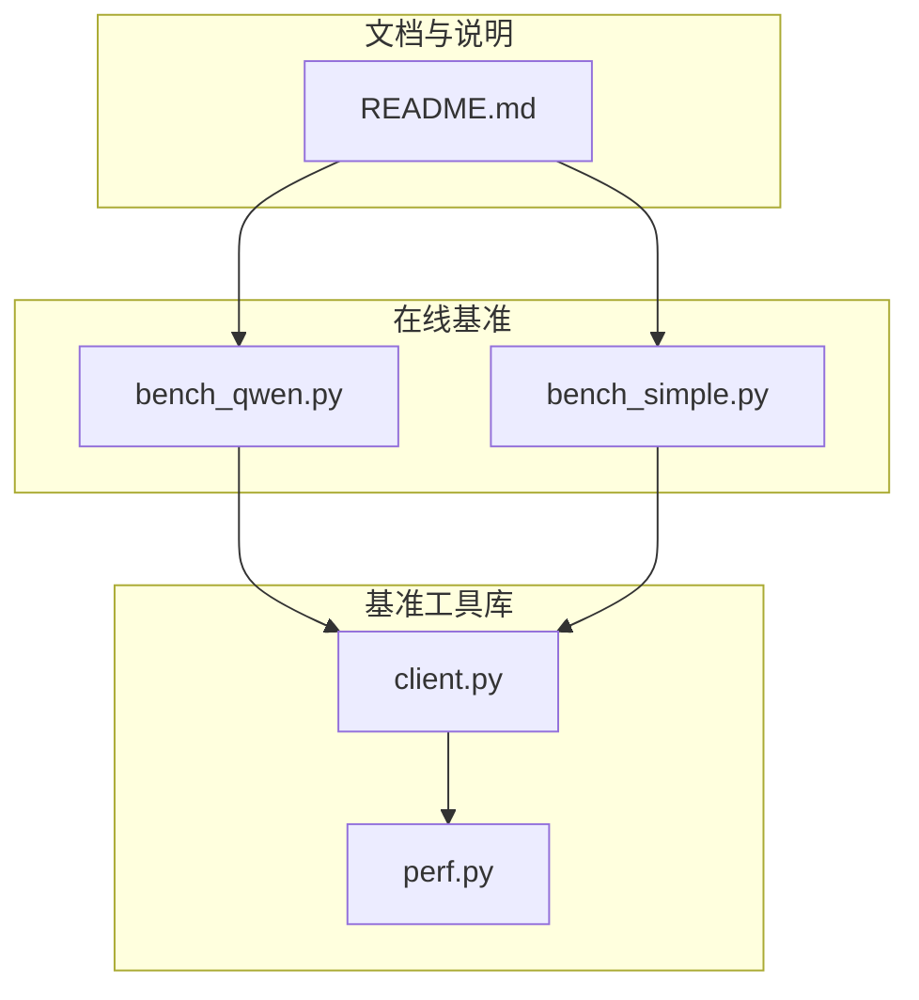
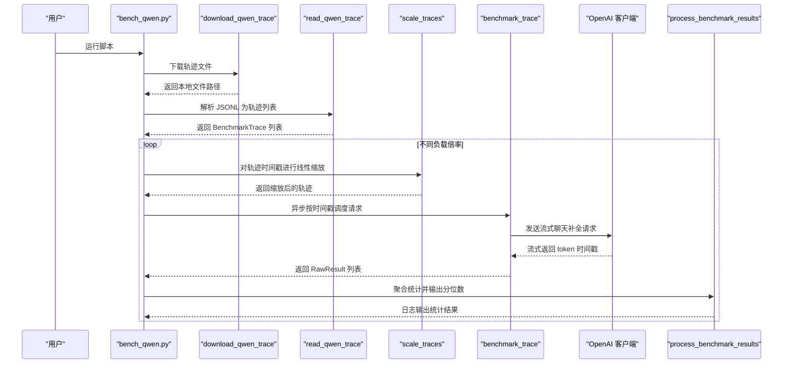
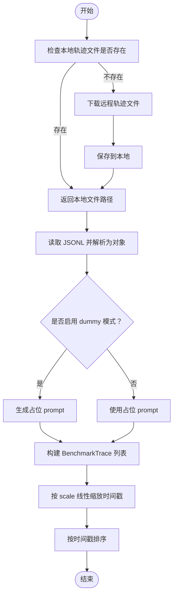
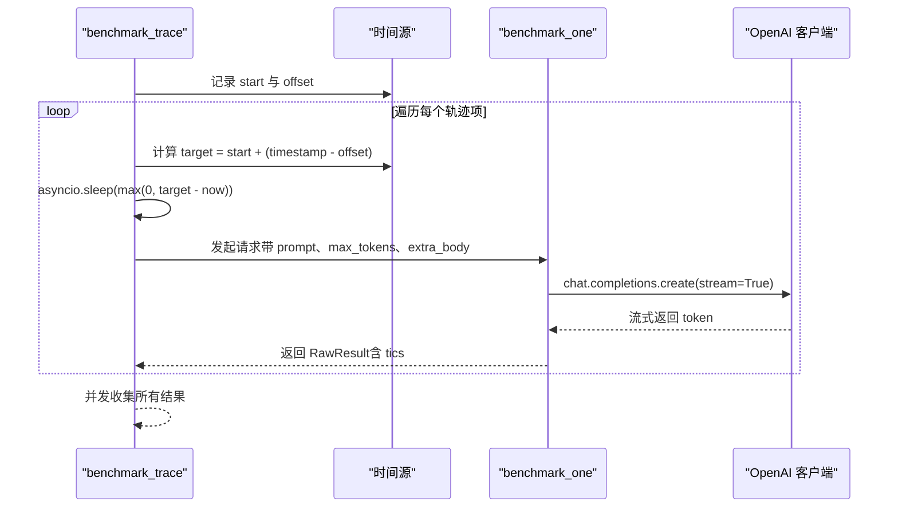
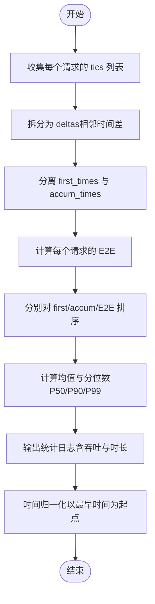
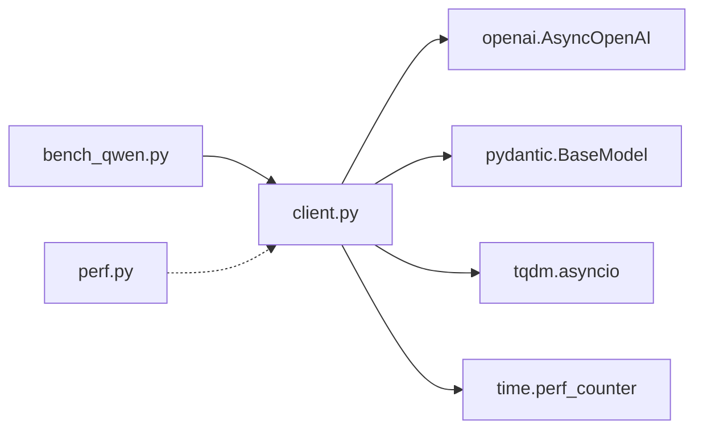

# 轨迹驱动基准测试

<cite>
**本文引用的文件**
- [bench_qwen.py](file://benchmark/online/bench_qwen.py)
- [client.py](file://python/minisgl/benchmark/client.py)
- [perf.py](file://python/minisgl/benchmark/perf.py)
- [bench_simple.py](file://benchmark/online/bench_simple.py)
- [README.md](file://README.md)
</cite>

## 目录
1. [简介](#简介)
2. [项目结构](#项目结构)
3. [核心组件](#核心组件)
4. [架构总览](#架构总览)
5. [详细组件分析](#详细组件分析)
6. [依赖关系分析](#依赖关系分析)
7. [性能考量](#性能考量)
8. [故障排查指南](#故障排查指南)
9. [结论](#结论)
10. [附录](#附录)

## 简介
本文件深入解析“轨迹驱动的在线基准测试”实现机制，围绕以下目标展开：
- 解释 bench_qwen.py 如何通过 download_qwen_trace 从远程 URL 下载真实用户请求轨迹数据，并利用 read_qwen_trace 解析 JSONL 格式的请求记录，提取时间戳、输入/输出长度等关键信息。
- 阐述 scale_traces 如何通过线性缩放时间间隔来模拟不同负载压力（0.4x 至 1.6x），从而评估系统在高并发场景下的性能表现。
- 结合 client.py 中的 benchmark_trace，解释其如何根据原始时间戳异步调度请求发送，精确复现真实流量模式。
- 描述性能指标采集流程：首 token 延迟（TTFT）、每 token 处理时间（TPOT）与端到端延迟（E2E）的计算逻辑，并说明 process_benchmark_results 如何聚合统计结果并输出 P50/P90/P99 分位数。
- 提供实际运行示例与参数调优建议。

## 项目结构
本次分析聚焦于在线基准测试子模块与相关客户端工具：
- 在线基准入口：benchmark/online/bench_qwen.py
- 客户端基准工具：python/minisgl/benchmark/client.py
- 性能度量工具：python/minisgl/benchmark/perf.py
- 简化版在线基准：benchmark/online/bench_simple.py
- 项目说明与在线基准使用参考：README.md

图表来源
- [bench_qwen.py](file://benchmark/online/bench_qwen.py#L1-L56)
- [client.py](file://python/minisgl/benchmark/client.py#L1-L502)
- [perf.py](file://python/minisgl/benchmark/perf.py#L1-L75)
- [bench_simple.py](file://benchmark/online/bench_simple.py#L1-L82)
- [README.md](file://README.md#L75-L118)

章节来源
- [bench_qwen.py](file://benchmark/online/bench_qwen.py#L1-L56)
- [client.py](file://python/minisgl/benchmark/client.py#L1-L502)
- [perf.py](file://python/minisgl/benchmark/perf.py#L1-L75)
- [bench_simple.py](file://benchmark/online/bench_simple.py#L1-L82)
- [README.md](file://README.md#L75-L118)

## 核心组件
- 轨迹数据下载与解析
  - download_qwen_trace：从指定 URL 下载 JSONL 轨迹文件，若本地不存在则自动下载。
  - read_qwen_trace：读取 JSONL 文件，解析为 BenchmarkTrace 列表，支持按需截断与占位 prompt 生成。
- 时间缩放与重排
  - scale_traces：对轨迹时间戳进行线性缩放，形成不同负载速率（如 0.4x~1.6x）。
- 异步轨迹回放
  - benchmark_trace：基于原始时间戳，计算目标发送时刻并异步调度请求，复现真实流量模式。
- 指标统计与输出
  - process_benchmark_results：计算 TTFT、TPOT、E2E 的均值与分位数，输出吞吐与持续时长等统计。

章节来源
- [bench_qwen.py](file://benchmark/online/bench_qwen.py#L24-L56)
- [client.py](file://python/minisgl/benchmark/client.py#L183-L501)

## 架构总览
下图展示从轨迹下载到指标输出的完整流程，以及各模块之间的调用关系。

图表来源
- [bench_qwen.py](file://benchmark/online/bench_qwen.py#L37-L56)
- [client.py](file://python/minisgl/benchmark/client.py#L287-L310)
- [client.py](file://python/minisgl/benchmark/client.py#L407-L443)
- [client.py](file://python/minisgl/benchmark/client.py#L479-L496)

## 详细组件分析

### 组件A：轨迹下载与解析
- download_qwen_trace
  - 功能：若本地不存在轨迹文件，则从 URL 下载；否则直接返回本地路径。
  - 关键点：使用 urllib.request.urlretrieve 实现下载；日志记录下载开始与完成。
- read_qwen_trace
  - 功能：读取 JSONL 行，按 Pydantic 模型校验并转换为 BenchmarkTrace；可截断前 N 条；支持 dummy 模式生成占位 prompt。
  - 关键点：JSON 字段包含 chat_id、parent_chat_id、timestamp、input_length、output_length、type、turn、hash_ids 等；仅使用 timestamp、input_length、output_length 与 message。
- scale_traces
  - 功能：以最小时间戳为基点，对每个轨迹的时间戳做线性变换（timestamp - min_tic）* scale，并保持排序。
  - 关键点：通过 scale 控制整体速率，0.4x~1.6x 用于模拟低/高负载。

图表来源
- [bench_qwen.py](file://benchmark/online/bench_qwen.py#L24-L35)
- [client.py](file://python/minisgl/benchmark/client.py#L407-L443)
- [client.py](file://python/minisgl/benchmark/client.py#L479-L496)

章节来源
- [bench_qwen.py](file://benchmark/online/bench_qwen.py#L24-L35)
- [client.py](file://python/minisgl/benchmark/client.py#L407-L443)
- [client.py](file://python/minisgl/benchmark/client.py#L479-L496)

### 组件B：异步轨迹回放与请求调度
- benchmark_trace
  - 功能：根据轨迹时间戳，计算每个请求的目标发送时刻 target = start + (msg.timestamp - offset)，并通过 asyncio.sleep 精确等待后发起请求。
  - 关键点：offset 使用轨迹中最小时间戳减去常数，确保起始时间稳定；所有任务并发执行，使用 asyncio.gather 收集结果。
- benchmark_one
  - 功能：发送一次流式聊天补全请求，记录时间戳（首 token 与后续每个 token 的到达时刻），并更新进度条计数器。
  - 关键点：通过 ignore_eos、top_k、temperature 等参数控制生成行为；input_length_override 可强制输入长度以验证不同输入规模的影响。

图表来源
- [client.py](file://python/minisgl/benchmark/client.py#L287-L310)
- [client.py](file://python/minisgl/benchmark/client.py#L202-L249)

章节来源
- [client.py](file://python/minisgl/benchmark/client.py#L287-L310)
- [client.py](file://python/minisgl/benchmark/client.py#L202-L249)

### 组件C：性能指标采集与统计
- 指标定义
  - TTFT（首 token 延迟）：首次 token 到达时间与请求发起时间之差。
  - TPOT（每 token 处理时间）：除首 token 外，相邻 token 到达时间差的集合。
  - E2E（端到端延迟）：最后一个 token 到达时间与请求发起时间之差。
- 统计逻辑
  - process_benchmark_results
    - 计算每个请求的 deltas（相邻时间差），分离 first_times 与 accum_times。
    - 对 first_times、accum_times、e2e_times 分别排序，计算平均值与 P50/P90/P99。
    - 输出统计：TTFT/TPOT/E2E 的毫秒与秒级表示，以及总时长、token/s、req/s 吞吐。
    - 将时间归一化到以最早时间为起点，便于跨实验对比。

图表来源
- [client.py](file://python/minisgl/benchmark/client.py#L320-L405)

章节来源
- [client.py](file://python/minisgl/benchmark/client.py#L320-L405)

### 组件D：简化版在线基准（对比参考）
- bench_simple.py 展示了另一种在线基准方式：随机生成 prompt 与输出长度，批量并发发送请求并统计指标。该脚本可用于快速连通性测试或对比不同批大小的影响。

章节来源
- [bench_simple.py](file://benchmark/online/bench_simple.py#L1-L82)

## 依赖关系分析
- bench_qwen.py 依赖 client.py 中的：
  - download_qwen_trace、read_qwen_trace、scale_traces、benchmark_trace、process_benchmark_results、get_model_name
- client.py 内部依赖：
  - openai.AsyncOpenAI 进行流式请求
  - pydantic BaseModel 进行 JSONL 校验
  - tqdm.asyncio 进行进度条显示
  - time.perf_counter 进行高精度计时
- perf.py 提供 CUDA 性能度量工具，可用于离线内核性能对比，但不直接参与在线轨迹基准流程。

图表来源
- [bench_qwen.py](file://benchmark/online/bench_qwen.py#L1-L20)
- [client.py](file://python/minisgl/benchmark/client.py#L1-L20)
- [perf.py](file://python/minisgl/benchmark/perf.py#L1-L20)

章节来源
- [bench_qwen.py](file://benchmark/online/bench_qwen.py#L1-L20)
- [client.py](file://python/minisgl/benchmark/client.py#L1-L20)
- [perf.py](file://python/minisgl/benchmark/perf.py#L1-L20)

## 性能考量
- 时间缩放策略
  - 通过 scale_traces 对轨迹时间戳进行线性缩放，实现 0.4x~1.6x 的负载变化，覆盖低/高并发场景。
  - 缩放后仍保持时间顺序，避免出现负间隔导致的调度异常。
- 异步调度精度
  - benchmark_trace 使用 asyncio.sleep 精确等待到目标时刻再发起请求，保证与原始轨迹的时间分布一致。
  - 所有请求并发执行，充分利用系统资源，提升吞吐。
- 指标稳定性
  - process_benchmark_results 对时间序列进行排序并计算分位数，减少极端值影响，提高统计稳健性。
  - 归一化时间有助于跨实验对比，消除绝对时间漂移带来的偏差。
- 生成参数与输入长度
  - benchmark_one 支持 input_length_override 与 ignore_eos/top_k/temperature 等参数，便于在固定输入长度下评估不同生成策略的影响。

章节来源
- [client.py](file://python/minisgl/benchmark/client.py#L287-L310)
- [client.py](file://python/minisgl/benchmark/client.py#L479-L496)
- [client.py](file://python/minisgl/benchmark/client.py#L320-L405)

## 故障排查指南
- 服务器连接失败
  - 现象：连接测试阶段抛出异常或响应长度过短。
  - 排查：确认服务端已启动且监听端口正确；检查网络连通性；查看 bench_simple.py 的连接测试逻辑作为参考。
- 轨迹文件下载失败
  - 现象：download_qwen_trace 报错或无法创建本地文件。
  - 排查：检查网络访问权限与代理设置；确认 URL 可访问；手动下载并放置到脚本同目录。
- 时间戳异常
  - 现象：缩放后出现乱序或负间隔。
  - 排查：scale_traces 已按最小时间戳归零后再乘以 scale 并排序，若仍异常，检查原始 JSONL 是否存在非法时间戳。
- 指标异常偏大
  - 现象：TTFT/TPOT/E2E 明显偏大。
  - 排查：检查服务器资源占用、批大小与生成参数；确认未开启过度的 top_k 或温度；观察吞吐与持续时长是否合理。

章节来源
- [bench_simple.py](file://benchmark/online/bench_simple.py#L40-L74)
- [bench_qwen.py](file://benchmark/online/bench_qwen.py#L24-L35)
- [client.py](file://python/minisgl/benchmark/client.py#L479-L496)

## 结论
本实现以真实用户轨迹为输入，通过线性时间缩放与异步调度，精确复现高并发流量模式，并以 TTFT、TPOT、E2E 与吞吐为核心指标，系统性评估系统在不同负载下的性能表现。配合分位数统计与时间归一化，能够稳定地比较不同配置与参数组合的效果。

## 附录

### 实际运行示例
- 启动服务端（以 Qwen3-32B 为例，单机多卡）
  - 参考命令与硬件配置见 README 的在线基准部分。
- 运行轨迹基准
  - 在 bench_qwen.py 中设置端口、请求数量与缩放倍率，随后执行脚本即可自动下载轨迹、解析、缩放并回放。
  - 输出包含 TTFT/P90/P99、TPOT/P90/P99、E2E/P90/P99、吞吐与持续时长等统计。

章节来源
- [README.md](file://README.md#L91-L118)
- [bench_qwen.py](file://benchmark/online/bench_qwen.py#L37-L56)

### 参数调优建议
- 负载倍率选择
  - 从 0.4x 开始逐步增大，观察吞吐与延迟变化趋势；在 1.0x 附近可作为基线。
- 输入长度与输出长度
  - 若需评估不同输入规模影响，可在 read_qwen_trace 的 dummy 模式下固定输入长度，或使用 input_length_override。
- 生成参数
  - 降低 temperature 与 top_k 可减少随机性，提升 TTFT 与 TPOT 的稳定性；忽略 EOS 可避免提前终止。
- 批大小与并发
  - bench_simple.py 展示了批量并发的对比方法，可结合在线轨迹基准进行综合评估。

章节来源
- [client.py](file://python/minisgl/benchmark/client.py#L202-L249)
- [bench_simple.py](file://benchmark/online/bench_simple.py#L60-L74)