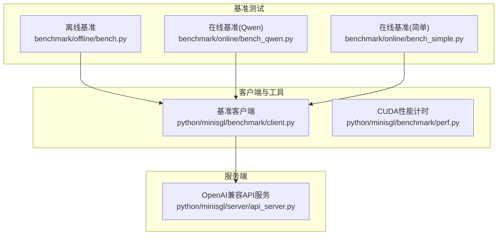
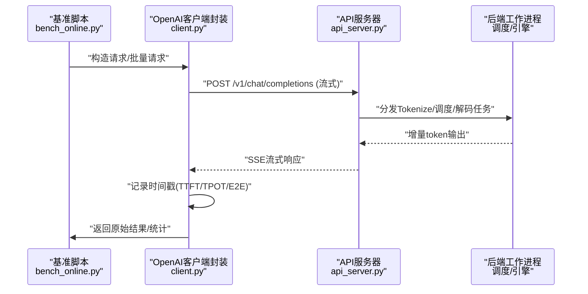
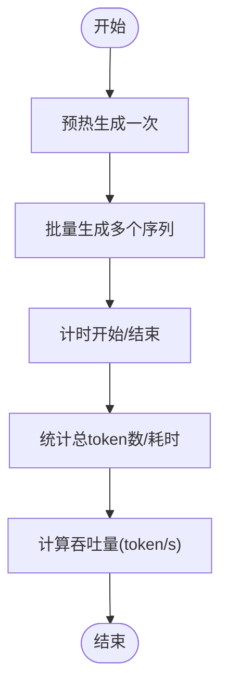
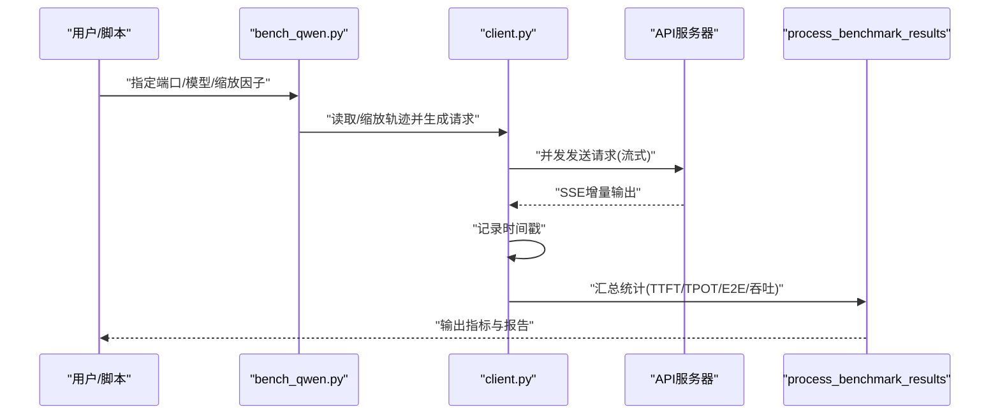
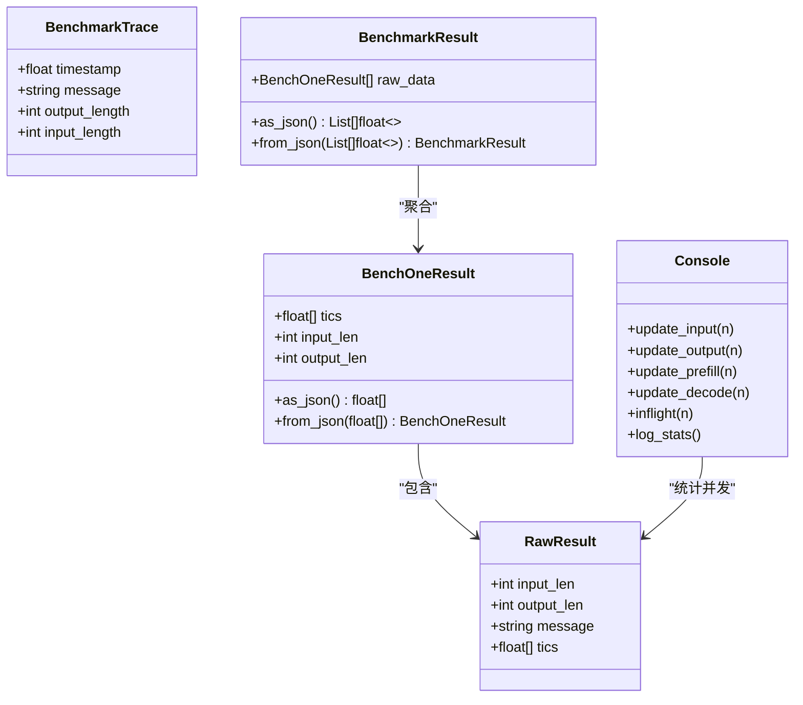
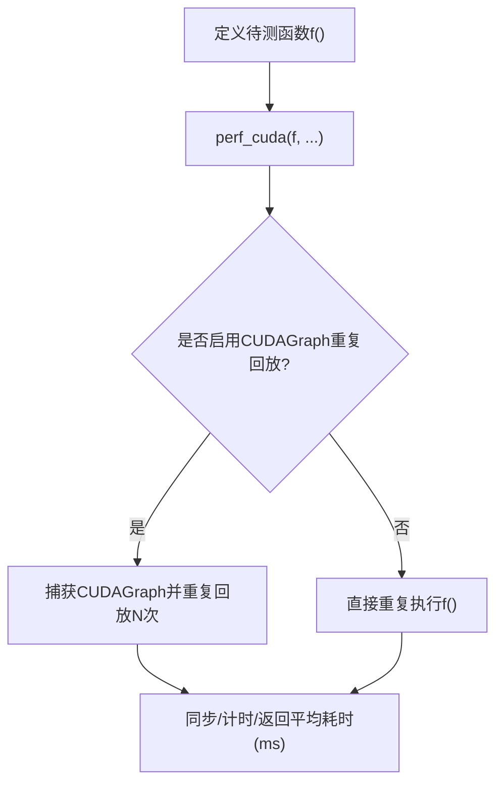
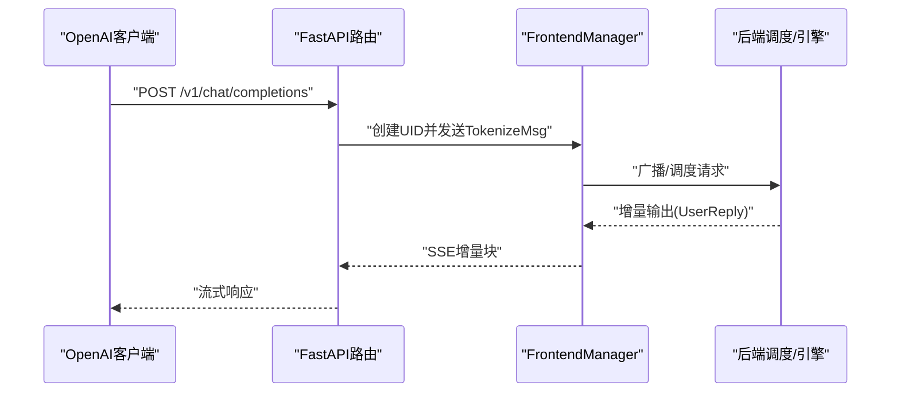
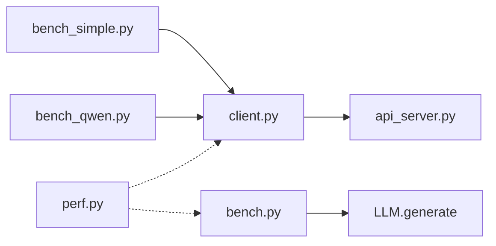

# 性能基准测试

<cite>
**本文引用的文件**
- [README.md](file://README.md)
- [docs/features.md](file://docs/features.md)
- [docs/structures.md](file://docs/structures.md)
- [benchmark/offline/bench.py](file://benchmark/offline/bench.py)
- [benchmark/online/bench_qwen.py](file://benchmark/online/bench_qwen.py)
- [benchmark/online/bench_simple.py](file://benchmark/online/bench_simple.py)
- [python/minisgl/benchmark/client.py](file://python/minisgl/benchmark/client.py)
- [python/minisgl/benchmark/perf.py](file://python/minisgl/benchmark/perf.py)
- [python/minisgl/server/api_server.py](file://python/minisgl/server/api_server.py)
</cite>

## 目录
1. [简介](#简介)
2. [项目结构](#项目结构)
3. [核心组件](#核心组件)
4. [架构总览](#架构总览)
5. [详细组件分析](#详细组件分析)
6. [依赖关系分析](#依赖关系分析)
7. [性能考量](#性能考量)
8. [故障排查指南](#故障排查指南)
9. [结论](#结论)
10. [附录](#附录)

## 简介
本文件系统性介绍 mini-sglang 的性能评估体系，包括离线基准测试（offline bench）与在线基准测试（online bench）的设计目标、使用方法、测试配置与数据集来源，并给出吞吐量、延迟等关键指标的解读方式。同时，结合 README 中提供的与 SGLang 对比的实验设置，帮助读者理解 mini-sglang 在不同场景下的优化效果与可复现实验流程。

## 项目结构
围绕性能基准测试的相关目录与文件组织如下：
- 基准测试脚本
  - 离线：benchmark/offline/bench.py
  - 在线：benchmark/online/bench_qwen.py、benchmark/online/bench_simple.py
- 客户端与结果处理：python/minisgl/benchmark/client.py
- CUDA 性能计时工具：python/minisgl/benchmark/perf.py
- API 服务端（OpenAI 兼容接口）：python/minisgl/server/api_server.py
- 文档与特性说明：docs/features.md、docs/structures.md
- 顶层说明与对比实验：README.md

图表来源
- [benchmark/offline/bench.py](file://benchmark/offline/bench.py#L1-L39)
- [benchmark/online/bench_qwen.py](file://benchmark/online/bench_qwen.py#L1-L56)
- [benchmark/online/bench_simple.py](file://benchmark/online/bench_simple.py#L1-L82)
- [python/minisgl/benchmark/client.py](file://python/minisgl/benchmark/client.py#L1-L502)
- [python/minisgl/server/api_server.py](file://python/minisgl/server/api_server.py#L1-L426)

章节来源
- [README.md](file://README.md#L75-L113)
- [docs/structures.md](file://docs/structures.md#L1-L50)

## 核心组件
- 离线基准测试（offline bench）
  - 针对本地批量推理场景，通过 LLM.generate 执行多序列生成，统计总 token 数与耗时，计算吞吐量。
  - 关键参数：序列数、输入/输出长度采样范围、模型路径与引擎超参。
- 在线基准测试（online bench）
  - 通过 OpenAI 兼容 API 发起流式请求，记录首次 token 时间（TTFT）、后续 token 平均时间（TPOT）、端到端时间（E2E），并计算吞吐量与请求速率。
  - 支持两类在线脚本：bench_simple（随机构造请求）、bench_qwen（基于公开 Qwen 使用轨迹重放）。
- 基准客户端与结果处理
  - 提供 benchmark_one、benchmark_one_batch、benchmark_trace 等异步接口，统一采集时间戳并排序统计分位数。
  - 提供 process_benchmark_results 统一输出 TTFT/p50/p90/p99、TPOT、E2E、吞吐量与请求速率等指标。
- CUDA 性能计时工具
  - 提供 perf_cuda 与 compare_memory_kernel_perf，支持 CUDA 流、CUDAGraph 重复回放与带宽/延迟对比，便于内核级性能分析。

章节来源
- [benchmark/offline/bench.py](file://benchmark/offline/bench.py#L1-L39)
- [benchmark/online/bench_qwen.py](file://benchmark/online/bench_qwen.py#L1-L56)
- [benchmark/online/bench_simple.py](file://benchmark/online/bench_simple.py#L1-L82)
- [python/minisgl/benchmark/client.py](file://python/minisgl/benchmark/client.py#L1-L502)
- [python/minisgl/benchmark/perf.py](file://python/minisgl/benchmark/perf.py#L1-L75)

## 架构总览
在线基准测试的整体调用链路如下：客户端脚本通过 OpenAI 兼容 API 向 API 服务器发起请求，API 服务器将消息转发给后端调度器与引擎，后端在 GPU 上执行解码并流式返回增量输出；客户端在收到响应时记录时间戳，最终汇总统计指标。

图表来源
- [benchmark/online/bench_qwen.py](file://benchmark/online/bench_qwen.py#L1-L56)
- [benchmark/online/bench_simple.py](file://benchmark/online/bench_simple.py#L1-L82)
- [python/minisgl/benchmark/client.py](file://python/minisgl/benchmark/client.py#L200-L310)
- [python/minisgl/server/api_server.py](file://python/minisgl/server/api_server.py#L239-L299)

## 详细组件分析

### 离线基准测试（offline bench）
- 设计目标
  - 在无网络开销的本地环境中，评估模型在大批量序列上的吞吐能力，验证预填充与解码阶段的总体效率。
- 使用方法
  - 直接运行脚本，内部创建 LLM 实例并生成随机 token 序列，执行一次预热后进行正式计时，最后打印总 token 数、耗时与吞吐量。
- 关键指标
  - 总 token 数、总耗时、吞吐量（token/s）。
- 测试配置（来自 README）
  - 硬件：1x H200 GPU
  - 模型：Qwen3-0.6B / Qwen3-14B
  - 请求总数：256 序列
  - 输入长度：100–1024 token
  - 输出长度：100–1024 token
- 运行建议
  - 可通过环境变量禁用重叠调度以进行消融实验（见 README 中的离线基准说明）。

图表来源
- [benchmark/offline/bench.py](file://benchmark/offline/bench.py#L10-L35)

章节来源
- [benchmark/offline/bench.py](file://benchmark/offline/bench.py#L1-L39)
- [README.md](file://README.md#L77-L90)

### 在线基准测试（online bench）
- 设计目标
  - 在真实在线服务场景下，评估系统在并发请求下的端到端延迟、首 token 延迟与吞吐表现，支持按时间轨迹重放以模拟真实流量。
- 使用方法
  - bench_simple：随机生成提示词与输出长度，连接本地 API 服务进行单批或多批测试。
  - bench_qwen：下载公开 Qwen 使用轨迹，按缩放比例重放请求，评估不同负载下的稳定性与延迟分布。
- 关键指标
  - TTFT（首次 token 时间）、TPOT（后续 token 平均时间）、E2E（端到端时间）、吞吐量（token/s）、请求速率（req/s）、分位数（p50/p90/p99）。
- 测试配置（来自 README）
  - 硬件：4x H200 GPU（NVLink）
  - 模型：Qwen3-32B
  - 数据集：Qwen 轨迹（前 1000 条），按不同缩放因子（如 0.4~1.6）重放
  - 服务端启动命令（与 SGLang 对比）：分别启动 mini-sglang 与 sglang 的服务端，端口与参数见 README。
- 结果解读
  - TTFT 反映冷启动与调度开销；TPOT 反映解码阶段稳定性能；E2E 反映整体响应质量与时延稳定性；吞吐量与请求速率反映系统承载能力。

图表来源
- [benchmark/online/bench_qwen.py](file://benchmark/online/bench_qwen.py#L1-L56)
- [python/minisgl/benchmark/client.py](file://python/minisgl/benchmark/client.py#L287-L405)

章节来源
- [benchmark/online/bench_simple.py](file://benchmark/online/bench_simple.py#L1-L82)
- [benchmark/online/bench_qwen.py](file://benchmark/online/bench_qwen.py#L1-L56)
- [python/minisgl/benchmark/client.py](file://python/minisgl/benchmark/client.py#L1-L502)
- [README.md](file://README.md#L91-L113)

### 基准客户端与结果处理（client.py）
- 功能要点
  - benchmark_one：向 API 发送单条请求，流式接收增量输出并记录时间戳，用于 TTFT/TPOT/E2E 计算。
  - benchmark_one_batch：批量发送请求，聚合统计。
  - benchmark_trace：按轨迹时间戳精确调度请求，模拟真实流量。
  - process_benchmark_results：对原始时间戳进行排序与统计，输出平均值与分位数，以及吞吐量与请求速率。
  - read_qwen_trace/read_mooncake_trace：解析轨迹文件，生成 BenchmarkTrace 列表。
  - scale_traces：对轨迹时间轴进行缩放，模拟快慢负载。
- 关键数据结构
  - RawResult/BenchOneResult：保存每条请求的时间戳与长度信息。
  - BenchmarkResult：可序列化为 JSON 的结果容器。
- 进度条与并发统计
  - Console 类维护请求发送、完成、预填充与解码阶段的进度条，并统计最大并发与队列深度。

图表来源
- [python/minisgl/benchmark/client.py](file://python/minisgl/benchmark/client.py#L1-L122)
- [python/minisgl/benchmark/client.py](file://python/minisgl/benchmark/client.py#L124-L181)
- [python/minisgl/benchmark/client.py](file://python/minisgl/benchmark/client.py#L202-L310)
- [python/minisgl/benchmark/client.py](file://python/minisgl/benchmark/client.py#L320-L405)
- [python/minisgl/benchmark/client.py](file://python/minisgl/benchmark/client.py#L407-L496)

章节来源
- [python/minisgl/benchmark/client.py](file://python/minisgl/benchmark/client.py#L1-L502)

### CUDA 性能计时工具（perf.py）
- 功能要点
  - perf_cuda：在 CUDA 流中执行函数，支持 CUDAGraph 重复回放，返回平均耗时（毫秒）。
  - compare_memory_kernel_perf：对比基线与当前实现的性能，输出带宽（GB/s）与可选延迟信息，便于内核级优化验证。
- 使用建议
  - 在进行注意力/归约等内核优化时，使用 compare_memory_kernel_perf 对比不同实现的内存带宽与延迟，辅助定位瓶颈。

图表来源
- [python/minisgl/benchmark/perf.py](file://python/minisgl/benchmark/perf.py#L10-L53)
- [python/minisgl/benchmark/perf.py](file://python/minisgl/benchmark/perf.py#L54-L75)

章节来源
- [python/minisgl/benchmark/perf.py](file://python/minisgl/benchmark/perf.py#L1-L75)

### 在线服务端（api_server.py）
- 功能要点
  - 提供 OpenAI 兼容接口：/v1/chat/completions、/v1/models、/v1。
  - 通过 SSE 流式返回增量输出，支持后台清理与请求终止。
  - 与后端调度/引擎通信，完成 token 化、调度、解码与反 token 化。
- 与基准测试的关系
  - 在线基准脚本通过该服务端发起请求，客户端统计 TTFT/TPOT/E2E 与吞吐，从而评估在线性能。

图表来源
- [python/minisgl/server/api_server.py](file://python/minisgl/server/api_server.py#L239-L299)
- [python/minisgl/server/api_server.py](file://python/minisgl/server/api_server.py#L1-L200)

章节来源
- [python/minisgl/server/api_server.py](file://python/minisgl/server/api_server.py#L1-L426)

## 依赖关系分析
- 在线基准测试依赖关系
  - bench_simple/bench_qwen 依赖 client.py 的 benchmark_* 接口与 get_model_name、read_qwen_trace、scale_traces 等工具函数。
  - client.py 依赖 OpenAI 异步客户端与 tqdm 异步进度条，最终通过 API 服务器进行请求。
- 离线基准测试依赖关系
  - bench.py 依赖 LLM 与 SamplingParams，直接调用 generate 接口进行批量推理。
- CUDA 性能工具独立于在线/离线脚本，可作为通用性能分析工具。

图表来源
- [benchmark/online/bench_simple.py](file://benchmark/online/bench_simple.py#L1-L82)
- [benchmark/online/bench_qwen.py](file://benchmark/online/bench_qwen.py#L1-L56)
- [python/minisgl/benchmark/client.py](file://python/minisgl/benchmark/client.py#L1-L502)
- [python/minisgl/server/api_server.py](file://python/minisgl/server/api_server.py#L1-L426)
- [benchmark/offline/bench.py](file://benchmark/offline/bench.py#L1-L39)
- [python/minisgl/benchmark/perf.py](file://python/minisgl/benchmark/perf.py#L1-L75)

章节来源
- [benchmark/online/bench_simple.py](file://benchmark/online/bench_simple.py#L1-L82)
- [benchmark/online/bench_qwen.py](file://benchmark/online/bench_qwen.py#L1-L56)
- [python/minisgl/benchmark/client.py](file://python/minisgl/benchmark/client.py#L1-L502)
- [python/minisgl/server/api_server.py](file://python/minisgl/server/api_server.py#L1-L426)
- [benchmark/offline/bench.py](file://benchmark/offline/bench.py#L1-L39)
- [python/minisgl/benchmark/perf.py](file://python/minisgl/benchmark/perf.py#L1-L75)

## 性能考量
- 离线基准
  - 关注预填充与解码阶段的总吞吐，适合评估模型与系统整体效率。
  - 可通过调整 max_seq_len_override、max_extend_tokens、cuda_graph_max_bs 等参数观察对吞吐的影响。
- 在线基准
  - 关注 TTFT、TPOT、E2E 分位数与吞吐量，评估真实服务场景下的延迟与并发承载能力。
  - 使用轨迹重放可模拟真实流量模式，便于横向对比不同系统或配置。
- 与 SGLang 对比
  - README 提供了 mini-sglang 与 sglang 的服务端启动命令与硬件配置，可在相同条件下进行对比，验证优化效果。
  - 可通过关闭某些优化（如禁用重叠调度）进行消融实验，定位关键优化点。

章节来源
- [README.md](file://README.md#L75-L113)
- [docs/features.md](file://docs/features.md#L1-L55)

## 故障排查指南
- 在线基准无法连接服务端
  - 确认服务端已启动且端口正确（默认端口见脚本中的 URL 配置）。
  - 使用 get_model_name 获取可用模型列表，确保模型加载成功。
- TTFT 异常偏高
  - 检查是否存在大量小批量请求导致调度开销显著；适当增大批量大小或减少并发。
  - 确认 KV 缓存策略与注意力后端配置合理（详见特性文档）。
- 吞吐量波动较大
  - 观察轨迹缩放因子与并发设置，逐步增加负载以识别系统瓶颈。
  - 使用 Console 的并发统计日志，检查最大并发与队列深度。
- 内核性能问题
  - 使用 compare_memory_kernel_perf 对比基线与当前实现，关注带宽与延迟变化，定位内核瓶颈。

章节来源
- [benchmark/online/bench_simple.py](file://benchmark/online/bench_simple.py#L1-L82)
- [benchmark/online/bench_qwen.py](file://benchmark/online/bench_qwen.py#L1-L56)
- [python/minisgl/benchmark/client.py](file://python/minisgl/benchmark/client.py#L1-L502)
- [python/minisgl/benchmark/perf.py](file://python/minisgl/benchmark/perf.py#L1-L75)
- [docs/features.md](file://docs/features.md#L1-L55)

## 结论
mini-sglang 的性能评估体系覆盖离线与在线两大场景：离线基准侧重整体吞吐，适合快速验证系统与模型的协同效率；在线基准则聚焦真实服务场景下的延迟与并发承载能力，支持轨迹重放与多负载对比。通过 client.py 的统一统计接口与 API 服务器的 OpenAI 兼容接口，用户可以便捷地运行 bench.py、bench_simple.py 与 bench_qwen.py，并结合 README 中的对比实验设置，系统性地评估与优化性能。

## 附录
- 运行示例与命令
  - 离线基准：直接运行 benchmark/offline/bench.py。
  - 在线基准（简单）：运行 benchmark/online/bench_simple.py，确保服务端已在默认端口启动。
  - 在线基准（Qwen 轨迹）：运行 benchmark/online/bench_qwen.py，脚本会自动下载轨迹并按缩放因子重放。
  - 与 SGLang 对比：参考 README 中的服务端启动命令，分别启动 mini-sglang 与 sglang 的服务端，再运行对应基准脚本进行对比。

章节来源
- [README.md](file://README.md#L75-L113)
- [benchmark/offline/bench.py](file://benchmark/offline/bench.py#L1-L39)
- [benchmark/online/bench_simple.py](file://benchmark/online/bench_simple.py#L1-L82)
- [benchmark/online/bench_qwen.py](file://benchmark/online/bench_qwen.py#L1-L56)