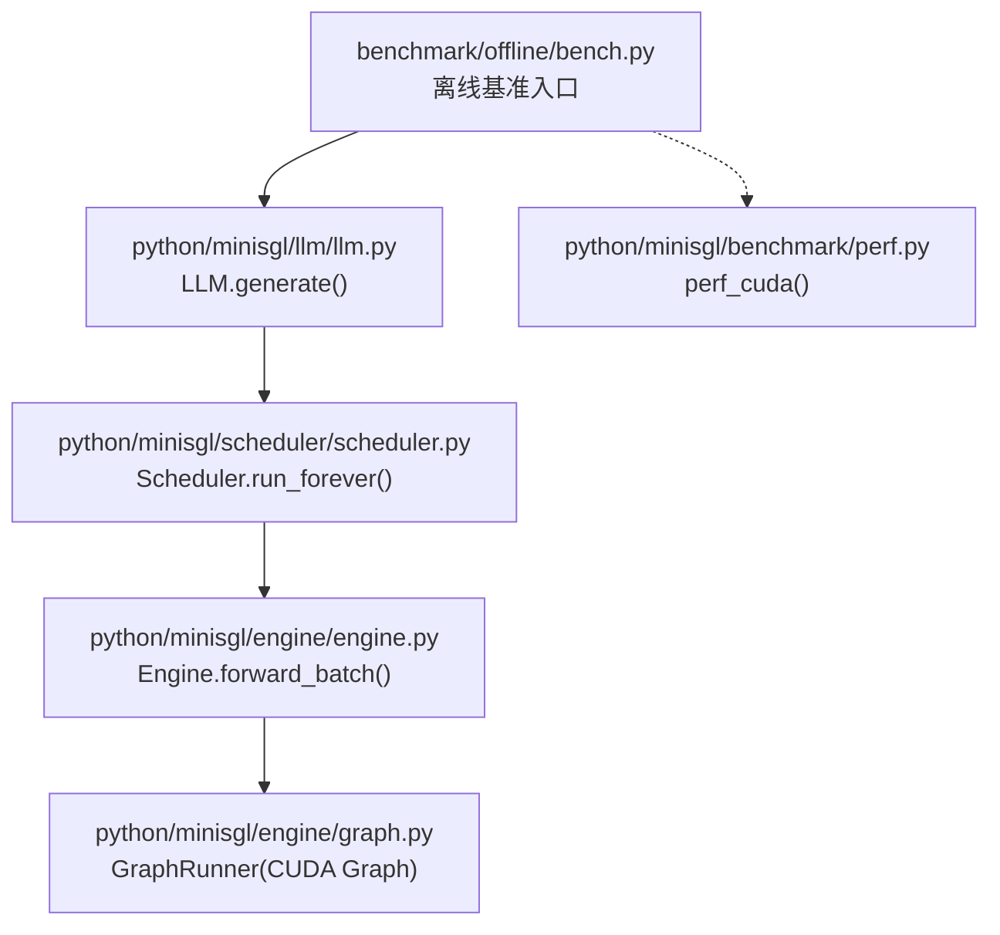
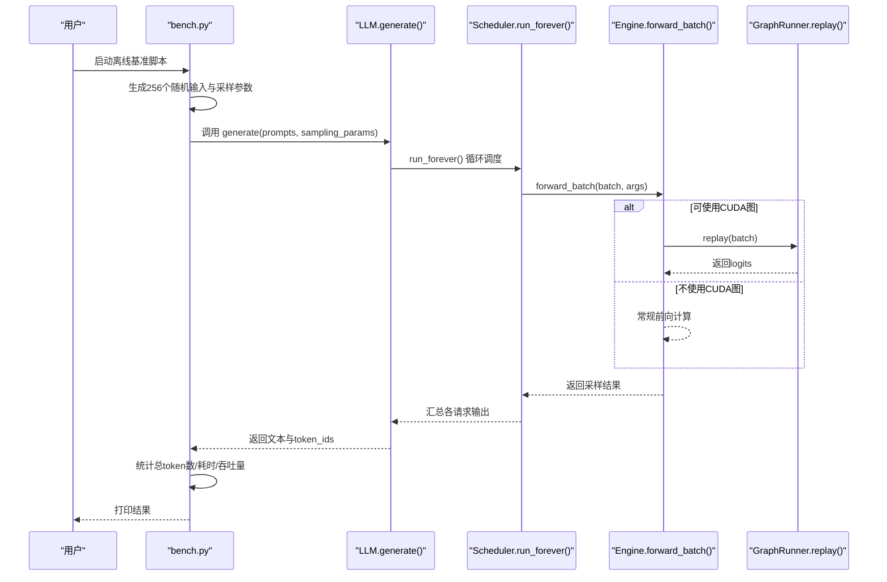
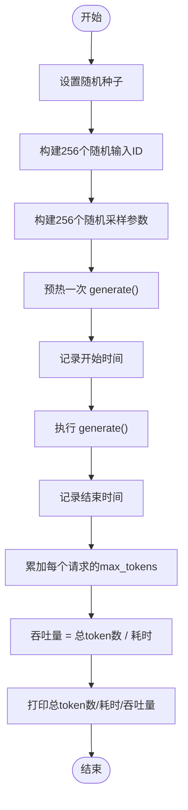
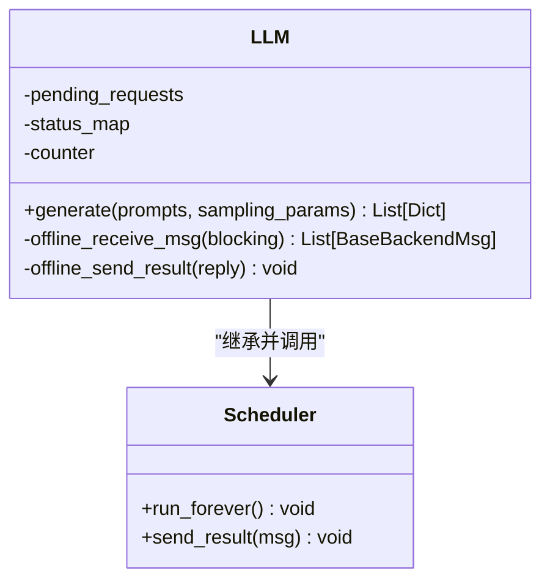
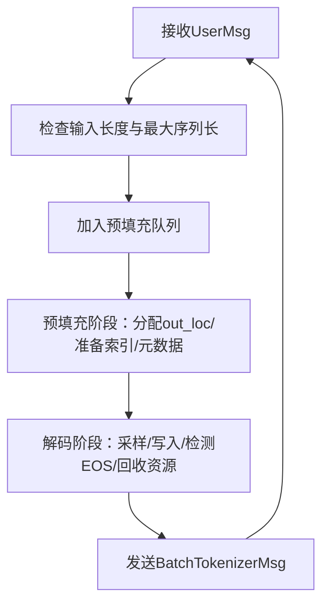
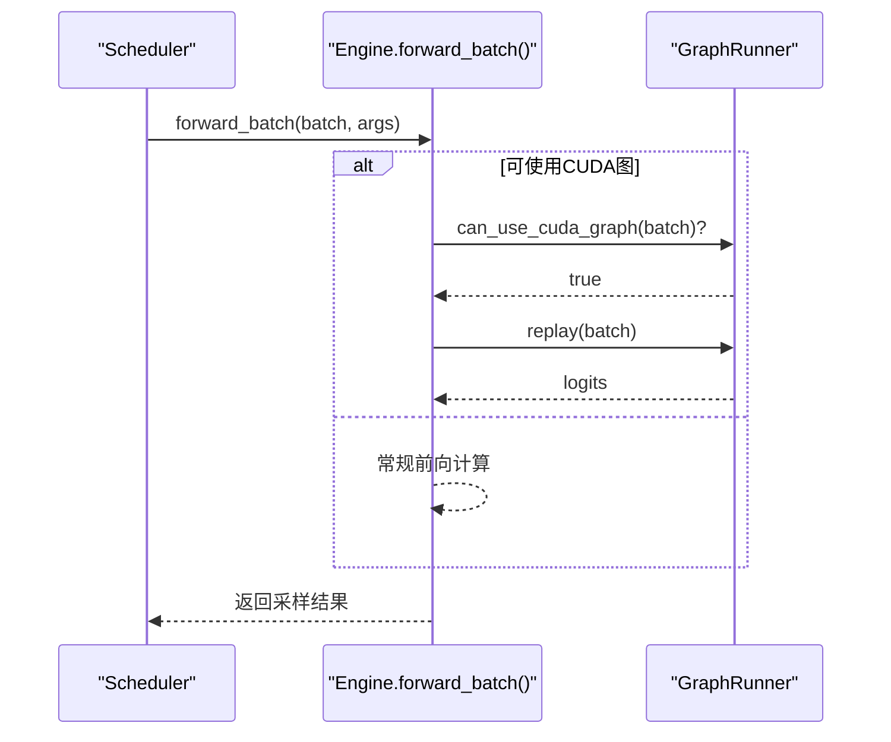
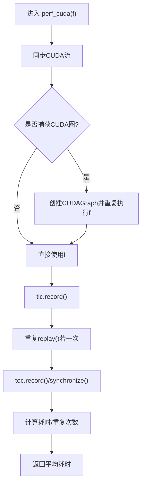
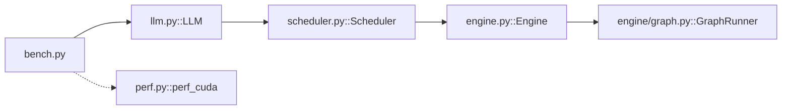

# 离线基准测试

<cite>
**本文引用的文件列表**
- [bench.py](file://benchmark/offline/bench.py)
- [perf.py](file://python/minisgl/benchmark/perf.py)
- [llm.py](file://python/minisgl/llm/llm.py)
- [scheduler.py](file://python/minisgl/scheduler/scheduler.py)
- [engine.py](file://python/minisgl/engine/engine.py)
- [graph.py](file://python/minisgl/engine/graph.py)
- [core.py](file://python/minisgl/core.py)
- [config.py](file://python/minisgl/scheduler/config.py)
- [README.md](file://README.md)
</cite>

## 目录
1. [简介](#简介)
2. [项目结构](#项目结构)
3. [核心组件](#核心组件)
4. [架构总览](#架构总览)
5. [详细组件分析](#详细组件分析)
6. [依赖关系分析](#依赖关系分析)
7. [性能考量](#性能考量)
8. [故障排查指南](#故障排查指南)
9. [结论](#结论)
10. [附录：运行命令与输出解读](#附录运行命令与输出解读)

## 简介
本文件系统性介绍离线基准测试的设计与实现，重点围绕以下目标展开：
- 解释 bench.py 脚本如何通过 LLM.generate() 接口测量模型吞吐量（tokens/s）
- 分析固定批量（256 序列）下的性能表现
- 说明随机输入长度（100–1024）与输出长度（100–1024）的生成逻辑
- 解读 perf.py 中 perf_cuda 函数的 CUDA 事件计时与 CUDA 图性能评估机制
- 提供完整的运行命令示例与输出结果解读（总 token 数、耗时、吞吐量）
- 强调该测试适用于评估模型在高负载下的最大吞吐能力

## 项目结构
离线基准测试位于 benchmark/offline/bench.py，核心推理链路由 LLM 类驱动，调度器与引擎负责实际的前向计算与 CUDA 图捕获/回放。perf.py 提供通用的 CUDA 计时与 CUDA 图评估工具。

图表来源
- [bench.py](file://benchmark/offline/bench.py#L1-L39)
- [llm.py](file://python/minisgl/llm/llm.py#L71-L100)
- [scheduler.py](file://python/minisgl/scheduler/scheduler.py#L1-L200)
- [engine.py](file://python/minisgl/engine/engine.py#L196-L217)
- [graph.py](file://python/minisgl/engine/graph.py#L83-L155)
- [perf.py](file://python/minisgl/benchmark/perf.py#L10-L51)

章节来源
- [bench.py](file://benchmark/offline/bench.py#L1-L39)
- [README.md](file://README.md#L75-L90)

## 核心组件
- bench.py：构造 256 个随机长度的输入与采样参数，调用 LLM.generate() 进行离线推理，并统计总 token 数、耗时与吞吐量。
- LLM.generate()：将请求排队到 Scheduler，循环执行直到所有请求完成，最终返回解码后的文本与 token 列表。
- Scheduler：接收用户消息，管理预填充与解码阶段，协调 KV 缓存与注意力后端，处理完成请求回收资源。
- Engine.forward_batch()：在当前 CUDA 流上执行前向计算；若满足条件则使用 CUDA 图回放以降低启动开销。
- GraphRunner：捕获不同批量大小的 CUDA 图，按需回放，提升稳定吞吐。
- perf.py：提供 perf_cuda() 工具，支持 CUDA 事件计时、可选 CUDA 图重复回放与多次重复实验，用于评估延迟/带宽等指标。

章节来源
- [bench.py](file://benchmark/offline/bench.py#L10-L35)
- [llm.py](file://python/minisgl/llm/llm.py#L71-L100)
- [scheduler.py](file://python/minisgl/scheduler/scheduler.py#L110-L179)
- [engine.py](file://python/minisgl/engine/engine.py#L196-L217)
- [graph.py](file://python/minisgl/engine/graph.py#L83-L155)
- [perf.py](file://python/minisgl/benchmark/perf.py#L10-L51)

## 架构总览
离线基准测试的端到端流程如下：

图表来源
- [bench.py](file://benchmark/offline/bench.py#L21-L35)
- [llm.py](file://python/minisgl/llm/llm.py#L71-L100)
- [scheduler.py](file://python/minisgl/scheduler/scheduler.py#L110-L179)
- [engine.py](file://python/minisgl/engine/engine.py#L196-L217)
- [graph.py](file://python/minisgl/engine/graph.py#L133-L143)

## 详细组件分析

### bench.py：离线吞吐测试主流程
- 固定批量：256 个序列
- 随机输入长度：100–1024
- 随机输出长度：100–1024
- 采样参数：温度、忽略 EOS、最大生成 token 数
- 计时方式：先预热一次 generate，再统计第二次 generate 的耗时
- 吞吐量计算：总生成 token 数 / 耗时（秒）

图表来源
- [bench.py](file://benchmark/offline/bench.py#L10-L35)

章节来源
- [bench.py](file://benchmark/offline/bench.py#L10-L35)
- [README.md](file://README.md#L81-L89)

### LLM.generate()：请求排队与结果聚合
- 将输入与采样参数打包为 pending_requests
- 调用 run_forever() 直至所有请求完成（抛出 RequestAllFinished）
- 从状态映射中取出每个请求的输出 token 并进行解码，返回文本与 token 列表

图表来源
- [llm.py](file://python/minisgl/llm/llm.py#L71-L100)
- [scheduler.py](file://python/minisgl/scheduler/scheduler.py#L110-L179)

章节来源
- [llm.py](file://python/minisgl/llm/llm.py#L71-L100)

### Scheduler：预填充/解码调度与资源回收
- 接收用户消息，限制最大输出长度，避免越界
- 预填充阶段分配写入位置，准备索引，调用注意力后端准备元数据
- 解码阶段根据完成情况回收 KV 缓存与页表空间

图表来源
- [scheduler.py](file://python/minisgl/scheduler/scheduler.py#L110-L179)
- [scheduler.py](file://python/minisgl/scheduler/scheduler.py#L180-L200)

章节来源
- [scheduler.py](file://python/minisgl/scheduler/scheduler.py#L110-L179)
- [scheduler.py](file://python/minisgl/scheduler/scheduler.py#L180-L200)

### Engine.forward_batch() 与 GraphRunner：CUDA 图回放
- 当 batch 为解码且大小不超过最大图批量时，使用 GraphRunner.replay() 回放已捕获的 CUDA 图
- 通过 pad_batch() 对齐到可用图批量，减少额外开销

图表来源
- [engine.py](file://python/minisgl/engine/engine.py#L196-L217)
- [graph.py](file://python/minisgl/engine/graph.py#L133-L155)

章节来源
- [engine.py](file://python/minisgl/engine/engine.py#L196-L217)
- [graph.py](file://python/minisgl/engine/graph.py#L83-L155)

### perf.py：CUDA 事件计时与 CUDA 图评估
- perf_cuda(f, *, init_stream=True, repetitions=10, cuda_graph_repetitions=10)
  - 使用 torch.cuda.Event 记录开始/结束时间
  - 可选捕获 CUDA 图并重复回放，消除首帧开销影响
  - 返回平均单次耗时（毫秒）

图表来源
- [perf.py](file://python/minisgl/benchmark/perf.py#L10-L51)

章节来源
- [perf.py](file://python/minisgl/benchmark/perf.py#L10-L51)

## 依赖关系分析
- bench.py 依赖 LLM.generate() 完成离线推理
- LLM 继承自 Scheduler，调度器持有 Engine 实例
- Engine 在初始化时创建 GraphRunner，并在 forward_batch 中按需使用 CUDA 图
- perf.py 作为通用工具，可被其他基准场景复用

图表来源
- [bench.py](file://benchmark/offline/bench.py#L10-L35)
- [llm.py](file://python/minisgl/llm/llm.py#L71-L100)
- [scheduler.py](file://python/minisgl/scheduler/scheduler.py#L80-L120)
- [engine.py](file://python/minisgl/engine/engine.py#L196-L217)
- [graph.py](file://python/minisgl/engine/graph.py#L83-L155)
- [perf.py](file://python/minisgl/benchmark/perf.py#L10-L51)

章节来源
- [bench.py](file://benchmark/offline/bench.py#L10-L35)
- [llm.py](file://python/minisgl/llm/llm.py#L71-L100)
- [scheduler.py](file://python/minisgl/scheduler/scheduler.py#L80-L120)
- [engine.py](file://python/minisgl/engine/engine.py#L196-L217)
- [graph.py](file://python/minisgl/engine/graph.py#L83-L155)
- [perf.py](file://python/minisgl/benchmark/perf.py#L10-L51)

## 性能考量
- 固定批量（256 序列）：最大化 GPU 利用率，适合评估极限吞吐
- 随机输入/输出长度：模拟真实场景的多样性，避免过拟合于特定长度
- CUDA 图：GraphRunner 在解码阶段捕获并回放，显著降低启动开销，提高稳定吞吐
- 预填充/解码重叠：Scheduler 使用独立 CUDA 流与重叠调度，隐藏 CPU 调度与内存拷贝开销
- KV 缓存与页表：按需分配与回收，避免内存碎片与越界

[本节为通用性能讨论，不直接分析具体文件]

## 故障排查指南
- 输入长度超限：当输入长度超过最大序列长时，请求会被丢弃并记录警告
- 输出长度受限：若采样参数的最大生成长度超过剩余可用长度，会自动调整
- CUDA 图捕获失败：确保 GPU 内存充足，GraphRunner 会在捕获前后记录可用显存
- 多卡环境内存不平衡：Engine 初始化时会检查各卡显存最小/最大值，差异过大将报错

章节来源
- [scheduler.py](file://python/minisgl/scheduler/scheduler.py#L160-L175)
- [engine.py](file://python/minisgl/engine/engine.py#L175-L195)
- [graph.py](file://python/minisgl/engine/graph.py#L83-L132)

## 结论
离线基准测试通过固定批量（256 序列）与随机输入/输出长度，结合 CUDA 图回放与调度器重叠优化，能够有效评估模型在高负载下的最大吞吐能力。bench.py 以简洁的方式串联了请求生成、计时与吞吐统计，perf.py 提供了可靠的 CUDA 事件计时与 CUDA 图评估工具，整体设计兼顾易用性与准确性。

[本节为总结性内容，不直接分析具体文件]

## 附录：运行命令与输出解读

### 运行命令示例
- 单卡（H200）部署与离线基准
  - 启动服务：python -m minisgl --model "Qwen/Qwen3-0.6B"
  - 运行离线基准：python benchmark/offline/bench.py
- 关闭重叠调度的消融实验
  - 设置环境变量后运行：MINISGL_DISABLE_OVERLAP_SCHEDULING=1 python benchmark/offline/bench.py

章节来源
- [README.md](file://README.md#L50-L74)
- [README.md](file://README.md#L75-L90)

### 输出结果解读
- 总 token 数：所有请求的 max_tokens 之和
- 耗时：两次 generate() 之间的时间差（秒）
- 吞吐量：总 token 数 / 耗时（tokens/s）
- 适用场景：评估模型在高并发、大批量下的稳定吞吐上限

章节来源
- [bench.py](file://benchmark/offline/bench.py#L28-L35)