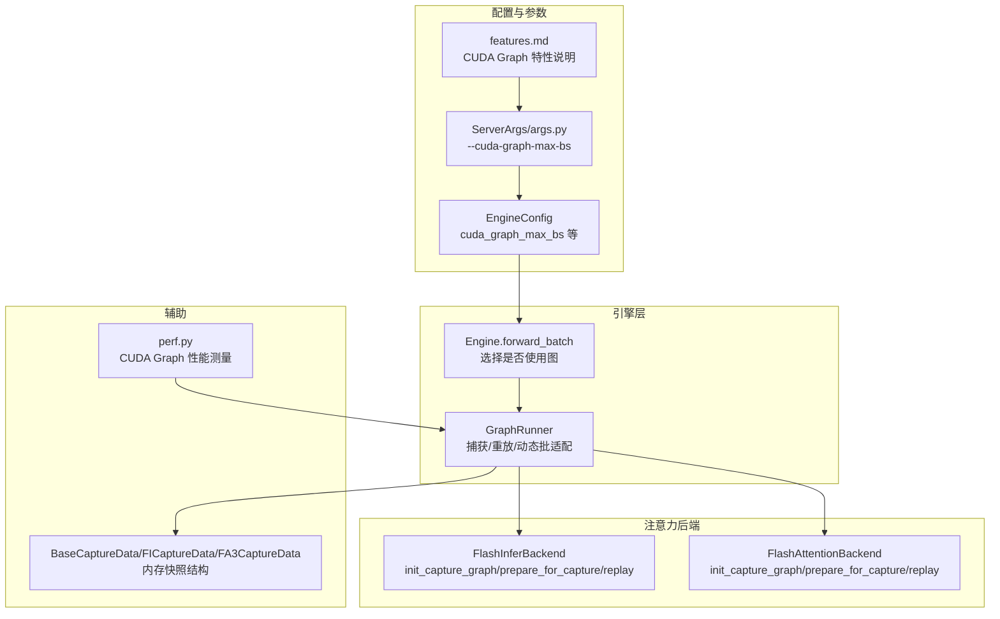
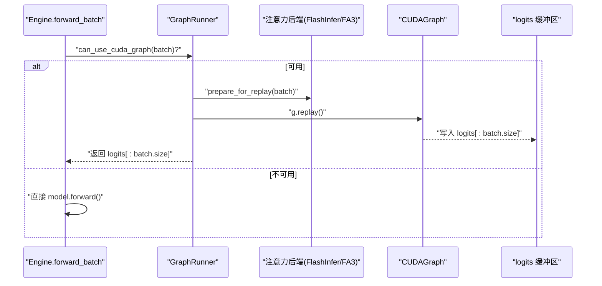
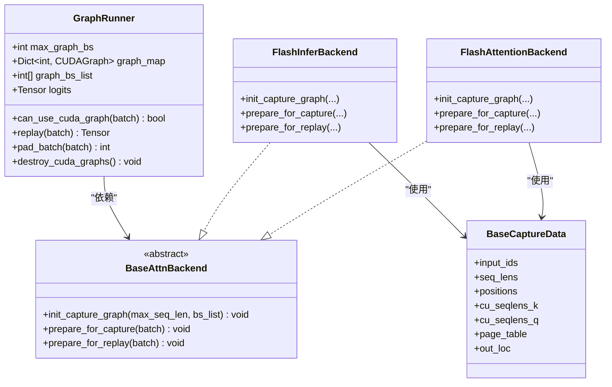
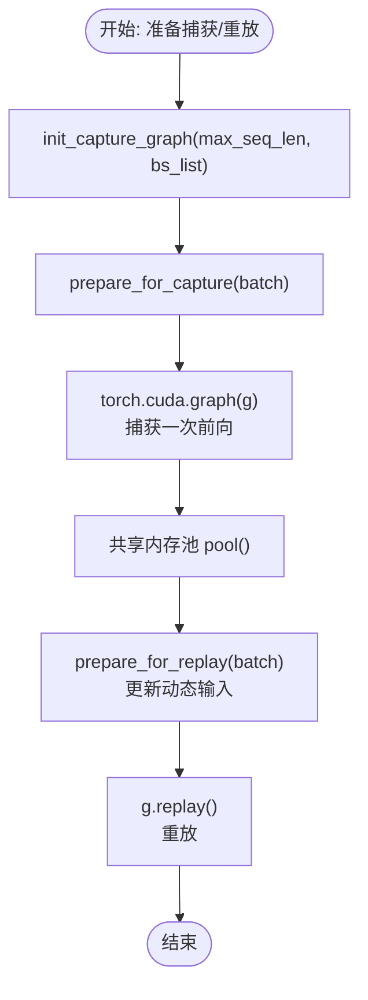
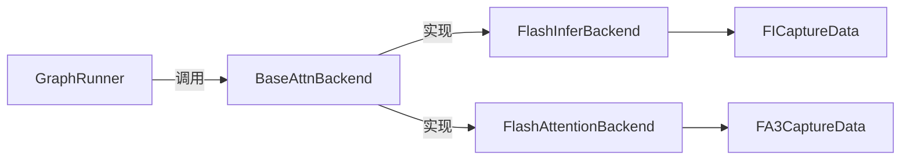

# CUDA Graph 优化技术详解

<cite>
**本文引用的文件列表**
- [graph.py](file://python/minisgl/engine/graph.py)
- [engine.py](file://python/minisgl/engine/engine.py)
- [args.py](file://python/minisgl/server/args.py)
- [config.py](file://python/minisgl/engine/config.py)
- [base.py](file://python/minisgl/attention/base.py)
- [fi.py](file://python/minisgl/attention/fi.py)
- [fa3.py](file://python/minisgl/attention/fa3.py)
- [utils.py](file://python/minisgl/attention/utils.py)
- [features.md](file://docs/features.md)
- [perf.py](file://python/minisgl/benchmark/perf.py)
</cite>

## 目录
1. [引言](#引言)
2. [项目结构](#项目结构)
3. [核心组件](#核心组件)
4. [架构总览](#架构总览)
5. [详细组件分析](#详细组件分析)
6. [依赖关系分析](#依赖关系分析)
7. [性能考量](#性能考量)
8. [故障排查指南](#故障排查指南)
9. [结论](#结论)
10. [附录](#附录)

## 引言
本文件围绕 CUDA Graph 在解码阶段的捕获与重放机制展开，系统性解析 GraphRunner 类在 graph.py 中的实现，涵盖图的创建流程、内存快照管理、动态批处理适配策略，以及 --cuda-graph-max-bs 参数对显存占用与吞吐性能的影响。同时给出固定批大小与动态批处理场景下的优势与挑战，并提供启用/禁用该功能的性能对比方法与调优建议。

## 项目结构
与 CUDA Graph 相关的关键模块分布如下：
- 引擎层：GraphRunner 负责捕获与重放；Engine 在推理路径中按需选择是否使用图。
- 注意力后端：FlashInfer 与 FlashAttention3 均实现统一的捕获/重放接口，以支持解码阶段的 CUDA Graph。
- 配置与参数：命令行参数 --cuda-graph-max-bs 控制最大捕获批大小；EngineConfig 提供默认值。
- 文档与基准：features.md 说明特性；perf.py 提供 CUDA Graph 性能测量工具。

图表来源
- [engine.py](file://python/minisgl/engine/engine.py#L196-L205)
- [graph.py](file://python/minisgl/engine/graph.py#L48-L156)
- [fi.py](file://python/minisgl/attention/fi.py#L86-L172)
- [fa3.py](file://python/minisgl/attention/fa3.py#L107-L142)
- [config.py](file://python/minisgl/engine/config.py#L15-L31)
- [args.py](file://python/minisgl/server/args.py#L143-L149)
- [features.md](file://docs/features.md#L38-L41)
- [utils.py](file://python/minisgl/attention/utils.py#L12-L33)
- [perf.py](file://python/minisgl/benchmark/perf.py#L10-L51)

章节来源
- [engine.py](file://python/minisgl/engine/engine.py#L87-L112)
- [graph.py](file://python/minisgl/engine/graph.py#L48-L156)
- [fi.py](file://python/minisgl/attention/fi.py#L86-L172)
- [fa3.py](file://python/minisgl/attention/fa3.py#L107-L142)
- [config.py](file://python/minisgl/engine/config.py#L15-L31)
- [args.py](file://python/minisgl/server/args.py#L143-L149)
- [features.md](file://docs/features.md#L38-L41)
- [utils.py](file://python/minisgl/attention/utils.py#L12-L33)
- [perf.py](file://python/minisgl/benchmark/perf.py#L10-L51)

## 核心组件
- GraphRunner：负责在初始化时为多个批大小捕获解码阶段的 CUDA Graph，并在运行时按需重放；提供动态批适配与填充逻辑。
- 注意力后端（FlashInfer/FA3）：实现统一的捕获/重放接口，准备解码阶段所需的页表、位置等静态快照，并在重放时更新动态输入。
- Engine.forward_batch：在推理循环中判断是否使用 CUDA Graph，若可用则走 GraphRunner.replay，否则直接调用模型前向。
- 配置与参数：--cuda-graph-max-bs 控制最大捕获批大小；EngineConfig 提供默认值；features.md 说明默认启用与禁用规则。

章节来源
- [graph.py](file://python/minisgl/engine/graph.py#L48-L156)
- [engine.py](file://python/minisgl/engine/engine.py#L196-L205)
- [fi.py](file://python/minisgl/attention/fi.py#L227-L277)
- [fa3.py](file://python/minisgl/attention/fa3.py#L107-L142)
- [args.py](file://python/minisgl/server/args.py#L143-L149)
- [config.py](file://python/minisgl/engine/config.py#L15-L31)
- [features.md](file://docs/features.md#L38-L41)

## 架构总览
下图展示从 Engine 到 GraphRunner 再到注意力后端的调用链路，以及捕获与重放的关键步骤。

图表来源
- [engine.py](file://python/minisgl/engine/engine.py#L196-L205)
- [graph.py](file://python/minisgl/engine/graph.py#L133-L142)
- [fi.py](file://python/minisgl/attention/fi.py#L269-L277)
- [fa3.py](file://python/minisgl/attention/fa3.py#L131-L142)

## 详细组件分析

### GraphRunner 类实现与工作流
- 批大小确定策略
  - 若显存充足且未显式指定，则根据设备显存自动推导最大批大小集合；否则可直接传入固定集合或禁用。
  - 自动策略会基于空闲显存阈值选择不同上限，并生成包含 1、2、4 与 8 的步进序列。
- 初始化捕获
  - 先调用注意力后端的 init_capture_graph(max_seq_len, bs_list)，准备静态快照数据结构。
  - 同步清空缓存并重置峰值统计，降低捕获时内存抖动。
  - 先以最大批大小进行一次预热捕获，再逐个捕获各批大小对应的图，并共享内存池以节省显存。
- 运行时重放
  - can_use_cuda_graph 仅在解码阶段且批大小不超过上限时启用。
  - replay 时先由注意力后端 prepare_for_replay 更新动态输入，再执行图重放，最后返回 logits 的有效部分。

图表来源
- [graph.py](file://python/minisgl/engine/graph.py#L48-L156)
- [base.py](file://python/minisgl/attention/base.py#L20-L38)
- [fi.py](file://python/minisgl/attention/fi.py#L227-L277)
- [fa3.py](file://python/minisgl/attention/fa3.py#L107-L142)
- [utils.py](file://python/minisgl/attention/utils.py#L12-L33)

章节来源
- [graph.py](file://python/minisgl/engine/graph.py#L48-L156)
- [engine.py](file://python/minisgl/engine/engine.py#L196-L205)

### 注意力后端的捕获与重放接口
- init_capture_graph
  - 为给定的最大序列长度与批大小集合创建静态快照对象（如 FICaptureData/FA3CaptureData），并记录 capture_bs 与 max_graph_bs。
- prepare_for_capture
  - 将静态快照数据映射到注意力元数据（如 cu_seqlens、indices、positions 等），并为 FlashInfer 准备 wrapper。
- prepare_for_replay
  - 将当前批次的动态输入（如 input_ids、out_loc、positions、cu_seqlens 等）拷贝回静态快照缓冲区，确保图重放时输入正确。

图表来源
- [fi.py](file://python/minisgl/attention/fi.py#L227-L277)
- [fa3.py](file://python/minisgl/attention/fa3.py#L107-L142)
- [graph.py](file://python/minisgl/engine/graph.py#L91-L124)

章节来源
- [fi.py](file://python/minisgl/attention/fi.py#L227-L277)
- [fa3.py](file://python/minisgl/attention/fa3.py#L107-L142)
- [graph.py](file://python/minisgl/engine/graph.py#L91-L124)

### 动态批处理适配与填充
- GraphRunner.pad_batch
  - 当批大小小于等于最大捕获批大小时，选择不小于当前批大小的最近可用批大小作为填充目标，将 dummy 请求追加至 padded_reqs，保证图重放时的形状一致。
- can_use_cuda_graph
  - 仅在解码阶段且批大小不超过上限时启用图；否则回退到直接前向。

章节来源
- [graph.py](file://python/minisgl/engine/graph.py#L133-L156)

## 依赖关系分析
- 组件耦合
  - GraphRunner 依赖注意力后端的捕获/重放接口，二者通过统一抽象 BaseAttnBackend 解耦。
  - 注意力后端内部使用 BaseCaptureData 派生类型（FICaptureData/FA3CaptureData）承载静态快照。
- 外部依赖
  - CUDA Graph 与 FlashInfer/FA3 的集成，要求后端在 prepare_for_capture 中完成 wrapper 初始化与元数据规划。
- 潜在环依赖
  - 代码组织上无明显循环导入；GraphRunner 仅通过抽象接口与后端交互。

图表来源
- [graph.py](file://python/minisgl/engine/graph.py#L48-L156)
- [base.py](file://python/minisgl/attention/base.py#L20-L38)
- [fi.py](file://python/minisgl/attention/fi.py#L227-L277)
- [fa3.py](file://python/minisgl/attention/fa3.py#L107-L142)
- [utils.py](file://python/minisgl/attention/utils.py#L12-L33)

章节来源
- [graph.py](file://python/minisgl/engine/graph.py#L48-L156)
- [base.py](file://python/minisgl/attention/base.py#L20-L38)
- [fi.py](file://python/minisgl/attention/fi.py#L227-L277)
- [fa3.py](file://python/minisgl/attention/fa3.py#L107-L142)
- [utils.py](file://python/minisgl/attention/utils.py#L12-L33)

## 性能考量
- 固定批大小场景的优势
  - 图捕获时已知形状与内核图谱，避免每次调度的 CPU 开销与内核启动开销；重放时仅更新动态输入，吞吐显著提升。
  - 适合高并发、稳定 QPS 的在线服务，能稳定降低尾延迟。
- 动态批处理的挑战与应对
  - 挑战：批大小变化导致图无法复用，需要为多批大小建立图并维护映射，增加显存占用与捕获时间。
  - 应对：GraphRunner 采用“近似上取整”的批大小集合（含 1、2、4 与 8 步进），结合 pad_batch 填充 dummy 请求，使重放时形状恒定；同时共享内存池减少重复分配。
- 显存占用与性能权衡
  - --cuda-graph-max-bs 越大，捕获的图越多，显存占用越高；但可覆盖更大动态范围，减少回退到直接前向的次数。
  - 自动策略会依据空闲显存阈值选择上限，平衡吞吐与显存。
- 启用/禁用的性能对比方法
  - 使用 perf.py 的 perf_cuda 工具，先捕获一次图，再多次重放，统计平均耗时；对比关闭图时的平均耗时，即可评估 CPU 调度开销的节省程度。

章节来源
- [graph.py](file://python/minisgl/engine/graph.py#L19-L38)
- [features.md](file://docs/features.md#L38-L41)
- [perf.py](file://python/minisgl/benchmark/perf.py#L10-L51)

## 故障排查指南
- 图捕获失败或内存不足
  - 检查 --cuda-graph-max-bs 是否过大；适当降低上限或改为自动策略。
  - 捕获前后打印空闲显存，确认是否存在内存碎片或未释放资源。
- 重放异常或结果错误
  - 确认 prepare_for_replay 是否正确更新了动态输入（如 input_ids、out_loc、positions、cu_seqlens 等）。
  - 确保 pad_batch 成功填充 dummy 请求，避免形状不匹配。
- 销毁顺序问题
  - 在释放 NCCL 资源前调用 GraphRunner.destroy_cuda_graphs，避免程序挂起。

章节来源
- [graph.py](file://python/minisgl/engine/graph.py#L143-L156)
- [fi.py](file://python/minisgl/attention/fi.py#L269-L277)
- [fa3.py](file://python/minisgl/attention/fa3.py#L131-L142)

## 结论
CUDA Graph 在 Mini-SGLang 的解码阶段通过“捕获—重放”有效减少了 CPU 调度开销，显著提升吞吐与稳定性。GraphRunner 以统一接口对接不同注意力后端，配合动态批适配与内存池共享，在保证灵活性的同时控制显存占用。--cuda-graph-max-bs 是关键的调参点，应结合模型规模、GPU 显存与请求模式进行权衡配置。

## 附录

### 参数与配置要点
- --cuda-graph-max-bs
  - 作用：设置 CUDA Graph 最大捕获批大小；设为 0 可禁用该功能。
  - 默认行为：未显式设置时，根据空闲显存自动推导上限。
- EngineConfig 与 ServerArgs
  - EngineConfig 提供 cuda_graph_max_bs 字段；ServerArgs 定义命令行参数解析与默认值。

章节来源
- [args.py](file://python/minisgl/server/args.py#L143-L149)
- [config.py](file://python/minisgl/engine/config.py#L15-L31)
- [features.md](file://docs/features.md#L38-L41)