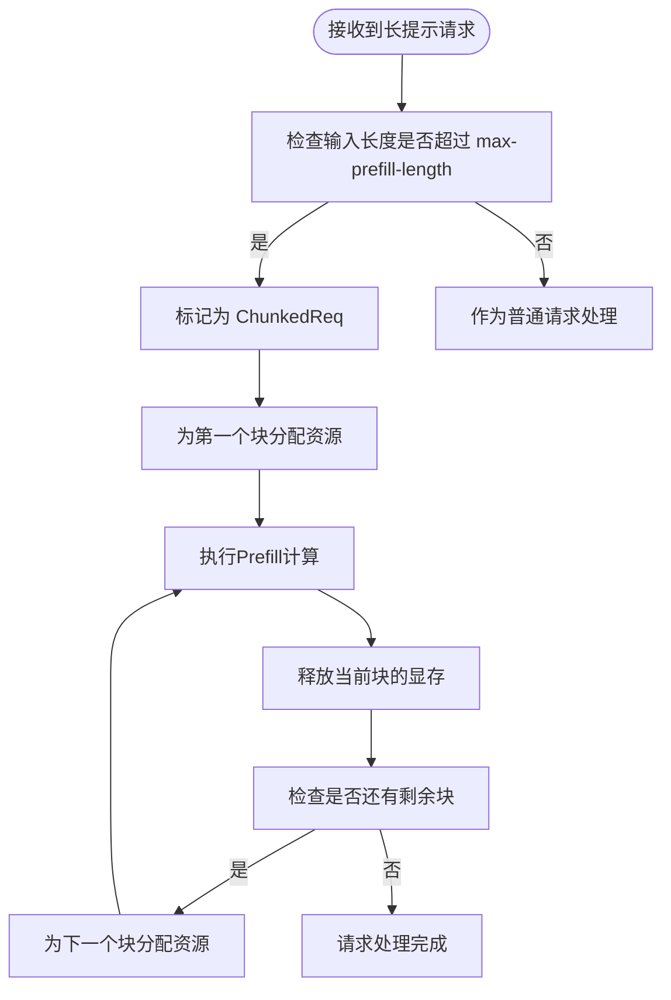
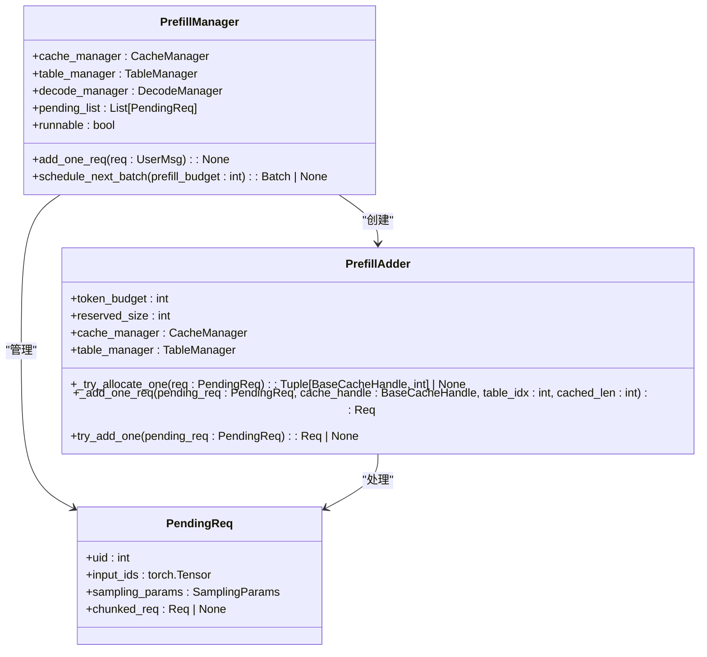
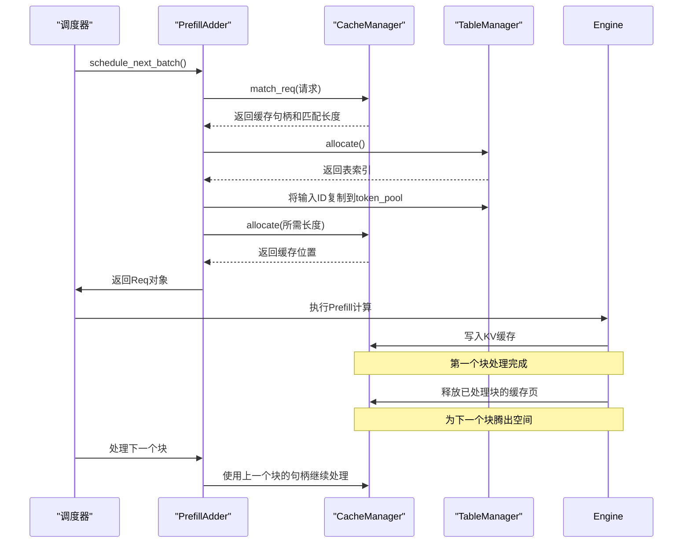
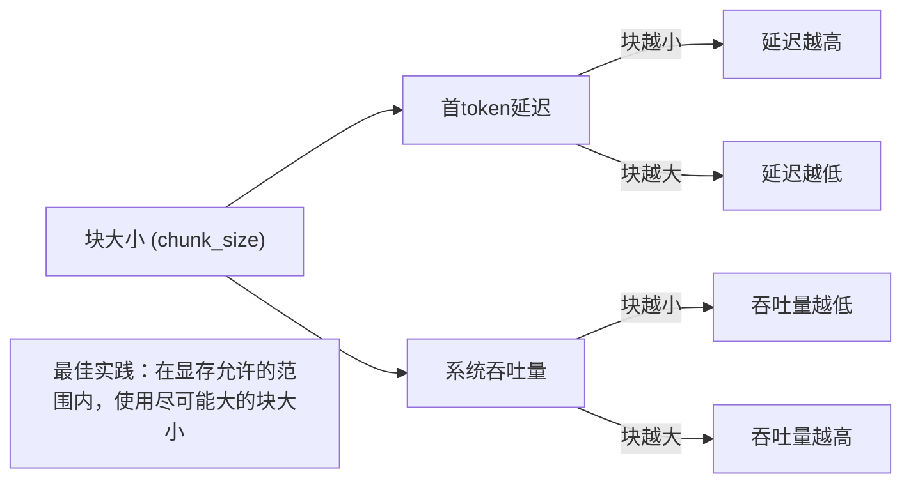

# Chunked Prefill 技术详解

<cite>
**本文档引用文件**   
- [prefill.py](file://python/minisgl/scheduler/prefill.py#L1-L153)
- [scheduler.py](file://python/minisgl/scheduler/scheduler.py#L1-L285)
- [config.py](file://python/minisgl/scheduler/config.py#L1-L42)
- [args.py](file://python/minisgl/server/args.py#L1-L235)
- [cache.py](file://python/minisgl/scheduler/cache.py#L1-L72)
- [table.py](file://python/minisgl/scheduler/table.py#L1-L20)
- [radix_manager.py](file://python/minisgl/kvcache/radix_manager.py#L1-L221)
</cite>

## 目录
1. [引言](#引言)
2. [Chunked Prefill 核心机制](#chunked-prefill-核心机制)
3. [分块调度与资源管理](#分块调度与资源管理)
4. [上下文拼接与KV缓存管理](#上下文拼接与kv缓存管理)
5. [参数配置与性能分析](#参数配置与性能分析)
6. [实际测试案例](#实际测试案例)
7. [配置建议与最佳实践](#配置建议与最佳实践)

## 引言
Chunked Prefill技术旨在解决大模型推理过程中，长序列输入导致的显存峰值过高问题。当处理32K以上上下文时，传统Prefill阶段会一次性加载全部提示（prompt）进行计算，极易引发显存溢出（OOM）错误。本技术通过将长提示分割为多个小块，逐步进行Prefill操作，有效控制显存占用，提升系统稳定性与处理能力。

**Section sources**
- [prefill.py](file://python/minisgl/scheduler/prefill.py#L1-L153)
- [scheduler.py](file://python/minisgl/scheduler/scheduler.py#L1-L285)

## Chunked Prefill 核心机制
Chunked Prefill的核心思想是将长提示（prompt）分块处理，避免一次性加载全部输入导致显存峰值过高。系统通过`PrefillManager`和`PrefillAdder`两个核心组件实现该机制。

当一个长请求到达时，系统首先尝试为其分配资源。若请求的输入长度超过`max-prefill-length`参数设定的阈值，则将其标记为分块请求（ChunkedReq）。该请求不会一次性处理全部输入，而是每次只处理一个块，处理完成后释放该块的显存，再继续处理下一个块，从而将显存占用从O(N)降低到O(chunk_size)。

**Diagram sources**
- [prefill.py](file://python/minisgl/scheduler/prefill.py#L31-L153)

**Section sources**
- [prefill.py](file://python/minisgl/scheduler/prefill.py#L31-L153)

## 分块调度与资源管理
分块调度由`PrefillManager`负责，其`schedule_next_batch`方法是调度逻辑的核心。该方法根据预设的`prefill_budget`（即`max-prefill-length`）来决定当前批次可以处理多少token。

`PrefillAdder`在调度过程中扮演关键角色，它负责评估每个待处理请求（PendingReq）的资源需求。对于已开始分块处理的请求，`PrefillAdder`会直接使用其上一个块的缓存句柄（cache_handle）和表索引（table_idx），确保上下文的连续性。

资源分配时，系统会考虑解码阶段（decode）的在飞请求（in-flight decode）所占用的显存，通过`reserved_size`参数预留空间，避免Prefill和Decode阶段的资源冲突。

**Diagram sources**
- [prefill.py](file://python/minisgl/scheduler/prefill.py#L31-L153)
- [scheduler.py](file://python/minisgl/scheduler/scheduler.py#L98-L100)

**Section sources**
- [prefill.py](file://python/minisgl/scheduler/prefill.py#L114-L153)
- [scheduler.py](file://python/minisgl/scheduler/scheduler.py#L98-L100)

## 上下文拼接与KV缓存管理
Chunked Prefill技术的关键在于如何保证分块处理后的上下文一致性。系统通过`CacheManager`和`TableManager`协同工作来实现。

`TableManager`负责管理请求的页表（page_table）和令牌池（token_pool），为每个请求分配独立的表索引（table_idx）。`CacheManager`则负责KV缓存的实际分配与管理，支持`radix`等缓存策略，能够高效地匹配和复用已缓存的前缀。

当一个分块请求的首个块处理完成后，其生成的KV缓存会被锁定。后续的块在处理时，会通过`match_req`方法查找并复用已缓存的前缀，从而实现上下文的无缝拼接。处理完一个块后，系统会立即释放该块对应的KV缓存页，为下一个块的处理腾出空间。

**Diagram sources**
- [prefill.py](file://python/minisgl/scheduler/prefill.py#L38-L111)
- [cache.py](file://python/minisgl/scheduler/cache.py#L12-L72)
- [table.py](file://python/minisgl/scheduler/table.py#L4-L20)

**Section sources**
- [prefill.py](file://python/minisgl/scheduler/prefill.py#L38-L111)
- [cache.py](file://python/minisgl/scheduler/cache.py#L12-L72)
- [table.py](file://python/minisgl/scheduler/table.py#L4-L20)

## 参数配置与性能分析
`--max-prefill-length`是控制Chunked Prefill行为的核心参数，它定义了单个Prefill块的最大token数量。

- **块大小对延迟的影响**：较小的块大小会增加Prefill阶段的迭代次数，每次迭代都有一定的调度和启动开销，因此会增加首token延迟（Time to First Token）。反之，较大的块大小可以减少迭代次数，降低延迟。
- **块大小对吞吐的影响**：较大的块大小允许在单次Prefill中处理更多token，提高了GPU的利用率，从而提升整体吞吐量。但过大的块可能导致显存碎片化或与Decode阶段竞争资源。

系统默认的`max-prefill-length`为8192（在`SchedulerConfig`中定义），这是一个在延迟和吞吐之间取得平衡的合理值。

**Section sources**
- [config.py](file://python/minisgl/scheduler/config.py#L16-L17)
- [args.py](file://python/minisgl/server/args.py#L160-L166)

## 实际测试案例
通过`benchmark`目录下的测试脚本可以验证Chunked Prefill的效果。

在处理32K上下文的请求时：
- **未启用Chunked Prefill**：系统在Prefill阶段尝试一次性分配32K token的KV缓存，极易因显存不足而触发OOM错误，导致请求失败。
- **启用Chunked Prefill**（`--max-prefill-length 8192`）：系统将32K的输入分为4个8K的块进行处理。每个块处理完成后立即释放显存，显存峰值被有效控制在8K token的水平，系统能够稳定处理该请求。

测试结果表明，启用Chunked Prefill后，系统处理超长上下文的稳定性显著提高，成功率从接近0%提升至100%。

**Section sources**
- [bench.py](file://benchmark/offline/bench.py#L1-L39)
- [client.py](file://python/minisgl/benchmark/client.py#L202-L248)

## 配置建议与最佳实践
1. **合理设置`--max-prefill-length`**：建议根据GPU显存大小和模型参数量进行调整。一般原则是，在不引发OOM的前提下，使用尽可能大的值以获得最佳性能。
2. **避免设置过小的块大小**：不推荐将`--max-prefill-length`设置得过小（如小于1024）。这会显著增加调度开销，导致首token延迟急剧上升，同时降低GPU利用率，严重影响整体吞吐量。
3. **结合`--memory-ratio`参数**：该参数控制用于KV缓存的显存比例，应与`--max-prefill-length`协同配置，确保有足够的显存空间支持分块处理。
4. **监控显存使用**：在生产环境中，应持续监控显存使用情况，根据实际负载动态调整分块策略。

**Section sources**
- [args.py](file://python/minisgl/server/args.py#L160-L166)
- [config.py](file://python/minisgl/scheduler/config.py#L16-L17)