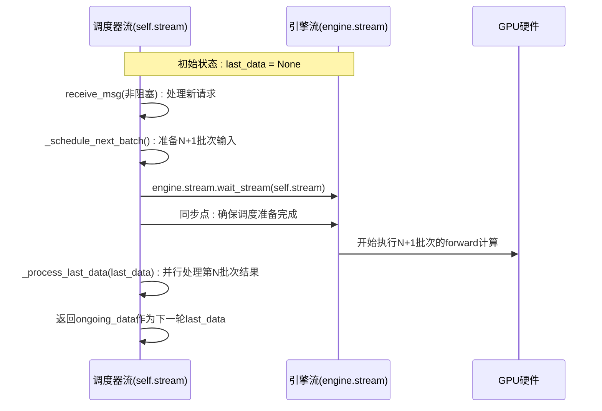
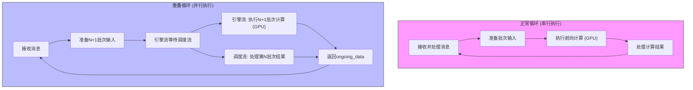

# Overlap Scheduling 技术详解

<cite>
**本文档引用文件**  
- [scheduler.py](file://python/minisgl/scheduler/scheduler.py)
- [env.py](file://python/minisgl/env.py)
- [engine.py](file://python/minisgl/engine/engine.py)
- [features.md](file://docs/features.md)
- [perf.py](file://python/minisgl/benchmark/perf.py)
</cite>

## 目录
1. [引言](#引言)
2. [Overlap Scheduling 核心机制](#overlap-scheduling-核心机制)
3. [事件循环设计分析](#事件循环设计分析)
4. [执行流程对比](#执行流程对比)
5. [性能增益分析](#性能增益分析)
6. [NanoFlow 论文思想融合](#nanoflow-论文思想融合)
7. [启用条件与限制](#启用条件与限制)
8. [性能监控建议](#性能监控建议)
9. [结论](#结论)

## 引言
Overlap Scheduling 是一种通过将 CPU 调度开销与 GPU 计算重叠来提升系统吞吐量的关键技术。该技术源自 [NanoFlow](https://arxiv.org/abs/2408.12757) 论文，已在 Mini-SGLang 框架中实现。其核心思想是在 GPU 执行当前批次计算的同时，利用独立的 CUDA 流并行处理上一批次的结果和调度任务，从而有效隐藏 CPU 端的延迟。

该技术通过精心设计的双流架构（一个用于引擎计算，一个用于调度元数据处理）和异步事件同步机制，实现了计算与调度的并行化。本文将深入解析 `scheduler.py` 中 `overlap_loop` 事件循环的设计原理，对比其与 `normal_loop` 的差异，并分析其在高并发场景下的性能优势。

## Overlap Scheduling 核心机制

Overlap Scheduling 的核心在于利用 CUDA 的流（Stream）和事件（Event）机制实现计算与调度的并行化。在 Mini-SGLang 中，这一机制通过以下关键组件实现：

1.  **双 CUDA 流设计**：调度器（Scheduler）创建了两个独立的 CUDA 流：
    *   `self.stream`：由调度器自身使用，用于处理元数据、消息接收和结果后处理。
    *   `self.engine.stream`：由推理引擎（Engine）使用，用于执行模型的前向计算。

2.  **流间同步**：通过 `wait_stream` 机制建立依赖关系。当引擎流需要执行计算时，它会等待调度器流完成其准备工作，确保数据一致性。

3.  **异步数据拷贝**：在 `ForwardOutput` 结构中，`next_tokens_cpu` 的拷贝操作是异步的（`non_blocking=True`），并由一个 CUDA 事件 `copy_done_event` 标记完成。这使得 GPU 计算可以与 CPU 端的数据拷贝同时进行。

4.  **流水线执行**：整个调度过程形成了一个高效的流水线：
    *   **阶段 N**：GPU 在引擎流上执行第 N 批次的计算。
    *   **阶段 N+1**：CPU 在调度器流上并行处理第 N 批次的结果（如解码、发送响应），同时准备第 N+1 批次的输入数据。

这种设计将原本串行的“计算-调度-计算”循环，转变为重叠的“计算与调度并行”模式，显著提升了 GPU 的利用率。

**Section sources**
- [scheduler.py](file://python/minisgl/scheduler/scheduler.py#L88-L92)
- [engine.py](file://python/minisgl/engine/engine.py#L44)
- [engine.py](file://python/minisgl/engine/engine.py#L208-L210)

## 事件循环设计分析

`scheduler.py` 中的 `overlap_loop` 方法是实现 Overlap Scheduling 的核心事件循环。其设计精巧，充分利用了 CUDA 的异步特性。

**Diagram sources**
- [scheduler.py](file://python/minisgl/scheduler/scheduler.py#L231-L254)

### 核心设计要点

1.  **输入参数 `last_data`**：该参数是实现流水线的关键。它代表了上一轮循环中正在执行的、尚未处理的计算结果（即第 N 批次）。在本轮循环开始时，调度器的首要任务就是处理这个“上一批”的结果。

2.  **非阻塞消息接收**：`receive_msg(blocking=...)` 的阻塞策略由当前是否有待处理的数据（`last_data`）或待调度的请求决定。当有 `last_data` 时，接收消息是非阻塞的，确保能尽快进入计算阶段。

3.  **流同步 `wait_stream`**：`self.engine.stream.wait_stream(self.stream)` 这行代码至关重要。它确保了引擎流在开始计算前，会等待调度器流完成所有准备工作（如 `_schedule_next_batch` 和 `_prepare_batch`）。这保证了输入数据的正确性。

4.  **并行处理**：在 `with self.engine_stream_ctx:` 代码块内，引擎流开始执行计算。与此同时，`_process_last_data` 方法在调度器流上被调用，负责处理上一批次的结果。这两个操作在不同的 CUDA 流上并行执行。

5.  **状态传递**：`overlap_loop` 的返回值是当前正在执行的 `ongoing_data`。这个值会在下一轮循环中作为 `last_data` 被传入，形成一个闭环的流水线。

**Section sources**
- [scheduler.py](file://python/minisgl/scheduler/scheduler.py#L231-L254)
- [scheduler.py](file://python/minisgl/scheduler/scheduler.py#L110-L153)

## 执行流程对比

为了更清晰地理解 Overlap Scheduling 的优势，我们将其与传统的 `normal_loop` 进行对比。

**Diagram sources**
- [scheduler.py](file://python/minisgl/scheduler/scheduler.py#L255-L266)
- [scheduler.py](file://python/minisgl/scheduler/scheduler.py#L231-L254)

### `normal_loop` 流程 (串行)

1.  **接收消息**：阻塞或非阻塞地接收新请求。
2.  **调度与准备**：调用 `_schedule_next_batch` 和 `_prepare_batch`，在 CPU 上完成所有调度决策和输入数据准备。
3.  **执行计算**：在同一个流上执行 `_forward`，GPU 开始计算。
4.  **处理结果**：等待 GPU 计算完成后，调用 `_process_last_data` 处理结果。
5.  **循环**：整个过程是完全串行的，GPU 空闲时 CPU 在工作，CPU 空闲时 GPU 在工作。

### `overlap_loop` 流程 (并行)

1.  **接收消息**：根据情况决定是否阻塞。
2.  **准备下一批**：在调度器流上准备下一个批次（N+1）的输入。
3.  **流同步**：引擎流等待调度器流完成准备工作。
4.  **并行执行**：
    *   **引擎流**：开始执行第 N+1 批次的 GPU 计算。
    *   **调度器流**：**并行地**处理上一轮（第 N 批次）的计算结果。
5.  **状态更新**：将当前正在执行的批次作为 `last_data` 传递给下一轮循环。

### 关键差异

| 特性 | `normal_loop` | `overlap_loop` |
| :--- | :--- | :--- |
| **执行模式** | 完全串行 | 计算与调度并行 |
| **GPU 利用率** | 低，存在空闲等待 | 高，被持续利用 |
| **CPU-GPU 重叠** | 无 | 有，通过双流实现 |
| **端到端延迟** | 较高 | 显著降低 |
| **系统吞吐** | 较低 | 显著提升 |

**Section sources**
- [scheduler.py](file://python/minisgl/scheduler/scheduler.py#L255-L266)
- [scheduler.py](file://python/minisgl/scheduler/scheduler.py#L231-L254)

## 性能增益分析

Overlap Scheduling 在高并发请求下的性能增益主要体现在以下几个方面：

1.  **提升 GPU 利用率**：这是最直接的收益。在 `normal_loop` 中，GPU 在等待 CPU 调度和结果处理时处于空闲状态。而 `overlap_loop` 通过将这些 CPU 密集型任务与 GPU 计算重叠，使得 GPU 能够持续不断地处理计算任务，从而将利用率推向峰值。

2.  **降低端到端延迟 (E2E Latency)**：对于单个请求，其端到端延迟由多个环节组成。Overlap Scheduling 将调度开销（如请求解析、批处理决策）隐藏在了 GPU 计算时间之内。这意味着，即使 CPU 调度需要一定时间，这部分时间也不再额外增加请求的总延迟，从而显著降低了 P50、P90 等延迟指标。

3.  **增加系统吞吐量 (Throughput)**：更高的 GPU 利用率直接转化为更高的吞吐量。系统在单位时间内可以处理更多的请求和 token。在 `benchmark/offline/bench.py` 的测试中，启用该功能后，吞吐量（token/s）会有显著提升。

4.  **缓解 CPU 瓶颈**：在高并发场景下，CPU 可能成为瓶颈。Overlap Scheduling 允许系统在 GPU 忙碌的同时，有充足的时间在后台处理调度逻辑，避免了因 CPU 处理不过来而导致的请求积压。

**Section sources**
- [scheduler.py](file://python/minisgl/scheduler/scheduler.py#L231-L254)
- [bench.py](file://benchmark/offline/bench.py#L30-L34)

## NanoFlow 论文思想融合

Overlap Scheduling 技术直接借鉴了 [NanoFlow: Simplifying and Accelerating LLM Serving with Flow-based Programming](https://arxiv.org/abs/2408.12757) 论文的核心思想。

1.  **流式编程范式 (Flow-based Programming)**：NanoFlow 提出将 LLM 服务中的各个阶段（如预填充、解码、调度）视为数据流中的节点。Mini-SGLang 的 `overlap_loop` 正是这一思想的体现，它将“调度”和“计算”视为两个可以并行执行的流，通过 `last_data` 作为数据流的连接。

2.  **计算与控制分离**：论文强调将计算密集型任务（模型推理）与控制密集型任务（请求调度、批处理）分离。Mini-SGLang 通过使用独立的 CUDA 流完美地实现了这种分离，`engine.stream` 专注于计算，`self.stream` 专注于控制。

3.  **最小化 CPU 开销**：NanoFlow 的目标之一是减少 CPU 的调度开销。Mini-SGLang 的 Overlap Scheduling 通过将这部分开销与 GPU 计算重叠，实现了“零开销”的目标，CPU 的工作时间被完全隐藏在了 GPU 的计算时间中。

4.  **简化系统复杂性**：尽管实现了复杂的并行化，但 `overlap_loop` 的代码逻辑相对清晰，体现了 NanoFlow 追求的“简化”理念。它没有引入复杂的异步框架，而是利用 CUDA 原生的流和事件机制，以较低的复杂性实现了高性能。

**Section sources**
- [features.md](file://docs/features.md#L49-L51)
- [scheduler.py](file://python/minisgl/scheduler/scheduler.py#L231-L254)

## 启用条件与限制

### 启用条件

1.  **CUDA 环境**：必须在支持 CUDA 的 NVIDIA GPU 上运行。
2.  **环境变量**：默认情况下是启用的。通过设置环境变量 `MINISGL_DISABLE_OVERLAP_SCHEDULING=1` 可以禁用该功能，此时系统会回退到 `normal_loop`。
3.  **CUDA 流同步机制**：核心依赖于 `cudaStreamWaitEvent` 或 `cudaStreamWaitStream`。在代码中，`self.engine.stream.wait_stream(self.stream)` 确保了正确的执行顺序。

### 潜在限制

1.  **内存开销**：为了支持流水线，系统需要同时维护多个批次的状态（如 `last_data` 和 `ongoing_data`），这会略微增加内存占用。
2.  **实现复杂性**：虽然逻辑清晰，但双流编程对开发者的要求较高，需要精确管理流间的同步，否则容易引入竞态条件或死锁。
3.  **小批次收益有限**：当批次大小非常小，GPU 计算时间极短时，CPU 调度的开销可能已经很小，此时 Overlap Scheduling 带来的性能提升不明显。
4.  **错误处理复杂性**：在并行处理中，如果一个批次的计算失败，需要确保对另一个流上正在处理的数据进行正确的清理和错误传播，这增加了错误处理的复杂性。

**Section sources**
- [env.py](file://python/minisgl/env.py#L63)
- [scheduler.py](file://python/minisgl/scheduler/scheduler.py#L270-L275)

## 性能监控建议

为了有效监控和评估 Overlap Scheduling 的性能，建议关注以下指标：

1.  **GPU 利用率 (GPU Utilization)**：使用 `nvidia-smi` 或 PyTorch Profiler 监控 GPU 的 SM 利用率。启用 Overlap Scheduling 后，利用率应显著高于 `normal_loop` 模式。
2.  **端到端延迟 (End-to-End Latency)**：测量从请求发出到收到第一个 token (TTFT) 和最后一个 token 的时间。应观察到 P50、P90 延迟的降低。
3.  **吞吐量 (Throughput)**：测量系统每秒处理的 token 数 (token/s) 和请求数 (req/s)。这是最直接的性能指标，应有明显提升。
4.  **CPU 使用率**：监控 CPU 的使用情况，确保调度任务不会成为新的瓶颈。
5.  **流等待时间**：通过 PyTorch Profiler 分析 `wait_stream` 操作的耗时。理想情况下，这个等待时间应该很短，表明调度和计算的节奏匹配良好。

在 `python/minisgl/benchmark/perf.py` 中，`perf_cuda` 函数提供了一个使用 CUDA 事件进行精确性能测量的范例，可用于构建自定义的性能测试。

**Section sources**
- [perf.py](file://python/minisgl/benchmark/perf.py#L10-L51)
- [client.py](file://python/minisgl/benchmark/client.py#L350-L384)

## 结论

Overlap Scheduling 是 Mini-SGLang 框架中一项关键的性能优化技术。它通过精巧地利用 CUDA 的流和事件机制，将 CPU 调度开销与 GPU 计算重叠，实现了计算与控制的并行化。对 `scheduler.py` 中 `overlap_loop` 事件循环的分析表明，该设计通过双流架构和流水线执行，有效隐藏了 CPU 延迟，显著提升了 GPU 利用率和系统吞吐量。

该技术成功地将 NanoFlow 论文的流式编程思想融入到实际系统中，在简化复杂性的同时实现了高性能。尽管存在轻微的内存开销和实现复杂性，但其在高并发场景下的性能增益是巨大的。通过监控 GPU 利用率、端到端延迟和吞吐量等关键指标，可以清晰地验证其效果。总体而言，Overlap Scheduling 是现代 LLM 服务框架中提升性能的典范实践。