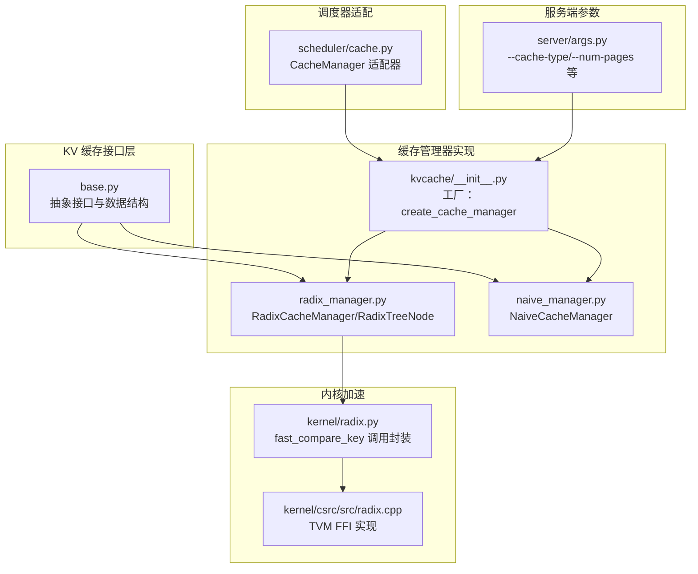
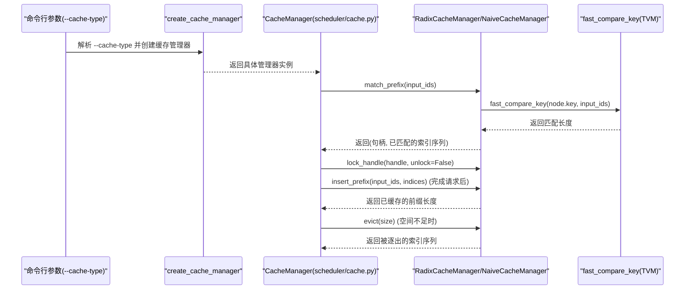
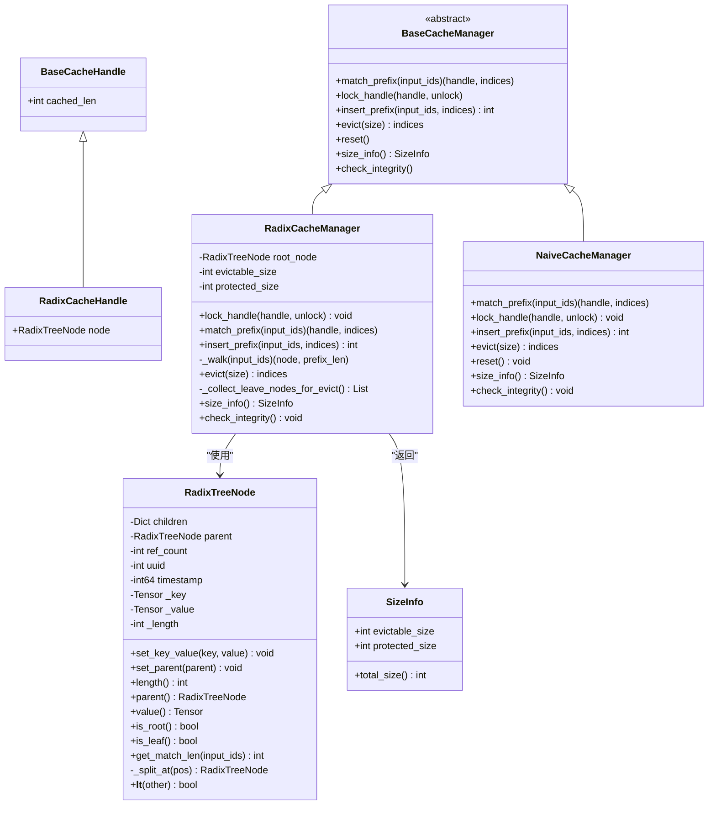
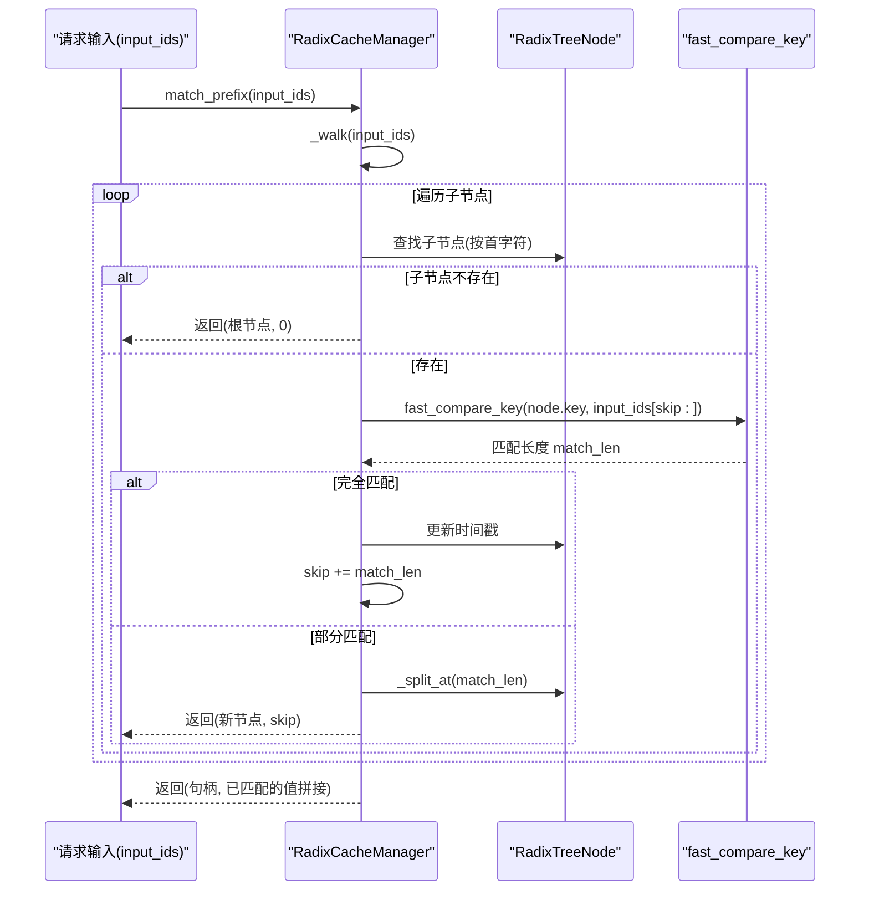
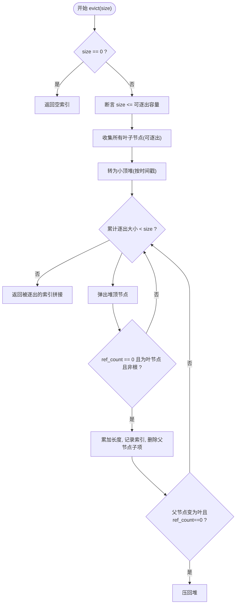
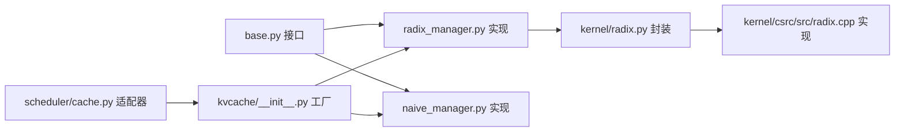

# Radix Cache 技术详解

<cite>
**本文引用的文件列表**
- [radix_manager.py](file://python/minisgl/kvcache/radix_manager.py)
- [base.py](file://python/minisgl/kvcache/base.py)
- [naive_manager.py](file://python/minisgl/kvcache/naive_manager.py)
- [__init__.py](file://python/minisgl/kvcache/__init__.py)
- [cache.py](file://python/minisgl/scheduler/cache.py)
- [args.py](file://python/minisgl/server/args.py)
- [radix.py](file://python/minisgl/kernel/radix.py)
- [radix.cpp](file://python/minisgl/kernel/csrc/src/radix.cpp)
- [features.md](file://docs/features.md)
</cite>

## 目录
1. [引言](#引言)
2. [项目结构](#项目结构)
3. [核心组件](#核心组件)
4. [架构总览](#架构总览)
5. [关键组件深度解析](#关键组件深度解析)
6. [依赖关系分析](#依赖关系分析)
7. [性能与内存特性](#性能与内存特性)
8. [故障排查指南](#故障排查指南)
9. [结论](#结论)
10. [附录：命令行参数与对比](#附录命令行参数与对比)

## 引言
本文件系统性解析 Mini-SGLang 中的 Radix Cache 设计与实现，重点阐述其如何利用 Radix 树结构在多个请求间共享 KV 缓存的公共前缀，从而降低重复计算、提升吞吐。文档围绕以下目标展开：
- 深入讲解 Radix 树节点结构、插入与路径匹配算法、引用计数与逐出策略
- 对比“radix”与“naive”两种缓存管理策略的差异
- 结合官方特性文档中的示意图，说明在长上下文与多用户对话场景下的优势
- 提供启用/禁用该功能的命令行参数说明，并给出内存占用与性能差异的分析方法
- 针对缓存碎片化、树深度增长等常见问题提出调优建议

## 项目结构
Radix Cache 的实现横跨 KV 缓存接口层、具体实现层、调度器适配层以及底层 C++ 加速模块。下图展示与本文相关的文件与职责划分：

图表来源
- [base.py](file://python/minisgl/kvcache/base.py#L50-L135)
- [radix_manager.py](file://python/minisgl/kvcache/radix_manager.py#L13-L221)
- [naive_manager.py](file://python/minisgl/kvcache/naive_manager.py#L1-L44)
- [__init__.py](file://python/minisgl/kvcache/__init__.py#L44-L54)
- [cache.py](file://python/minisgl/scheduler/cache.py#L12-L71)
- [args.py](file://python/minisgl/server/args.py#L188-L193)
- [radix.py](file://python/minisgl/kernel/radix.py#L13-L21)
- [radix.cpp](file://python/minisgl/kernel/csrc/src/radix.cpp#L19-L45)

章节来源
- [base.py](file://python/minisgl/kvcache/base.py#L50-L135)
- [radix_manager.py](file://python/minisgl/kvcache/radix_manager.py#L13-L221)
- [naive_manager.py](file://python/minisgl/kvcache/naive_manager.py#L1-L44)
- [__init__.py](file://python/minisgl/kvcache/__init__.py#L44-L54)
- [cache.py](file://python/minisgl/scheduler/cache.py#L12-L71)
- [args.py](file://python/minisgl/server/args.py#L188-L193)
- [radix.py](file://python/minisgl/kernel/radix.py#L13-L21)
- [radix.cpp](file://python/minisgl/kernel/csrc/src/radix.cpp#L19-L45)

## 核心组件
- 接口与数据结构
  - 基类与抽象接口定义了匹配、加锁、插入、逐出、尺寸统计与完整性检查等契约
  - 尺寸信息包含可逐出大小与受保护大小，用于调度器空间分配决策
- RadixCacheManager
  - 维护根节点、引用计数、时间戳、可逐出/受保护尺寸
  - 提供前缀匹配、插入、加锁/解锁、逐出与尺寸查询
- NaiveCacheManager
  - 不做任何共享，直接返回空匹配，插入时不做缓存
- 工厂函数 create_cache_manager
  - 根据类型选择 radix 或 naive 实现
- 调度器适配器 CacheManager
  - 将抽象接口与页面槽位管理结合，负责空间不足时的逐出与释放
- 内核加速 fast_compare_key
  - 使用 TVM AOT 动态加载 C++ 实现，进行 CPU 上整型一维张量的快速比较

章节来源
- [base.py](file://python/minisgl/kvcache/base.py#L50-L135)
- [radix_manager.py](file://python/minisgl/kvcache/radix_manager.py#L82-L221)
- [naive_manager.py](file://python/minisgl/kvcache/naive_manager.py#L14-L44)
- [__init__.py](file://python/minisgl/kvcache/__init__.py#L44-L54)
- [cache.py](file://python/minisgl/scheduler/cache.py#L12-L71)
- [radix.py](file://python/minisgl/kernel/radix.py#L13-L21)
- [radix.cpp](file://python/minisgl/kernel/csrc/src/radix.cpp#L19-L45)

## 架构总览
下图展示从服务端参数到调度器再到缓存管理器的整体流程，以及底层内核加速的关键路径。

图表来源
- [args.py](file://python/minisgl/server/args.py#L188-L193)
- [__init__.py](file://python/minisgl/kvcache/__init__.py#L44-L54)
- [cache.py](file://python/minisgl/scheduler/cache.py#L12-L71)
- [radix_manager.py](file://python/minisgl/kvcache/radix_manager.py#L116-L164)
- [radix.py](file://python/minisgl/kernel/radix.py#L13-L21)
- [radix.cpp](file://python/minisgl/kernel/csrc/src/radix.cpp#L19-L45)

## 关键组件深度解析

### Radix 树节点与管理器类图

图表来源
- [base.py](file://python/minisgl/kvcache/base.py#L50-L135)
- [radix_manager.py](file://python/minisgl/kvcache/radix_manager.py#L13-L221)
- [naive_manager.py](file://python/minisgl/kvcache/naive_manager.py#L14-L44)

章节来源
- [base.py](file://python/minisgl/kvcache/base.py#L50-L135)
- [radix_manager.py](file://python/minisgl/kvcache/radix_manager.py#L13-L221)
- [naive_manager.py](file://python/minisgl/kvcache/naive_manager.py#L14-L44)

### 匹配与插入流程（序列图）

图表来源
- [radix_manager.py](file://python/minisgl/kvcache/radix_manager.py#L138-L164)
- [radix.py](file://python/minisgl/kernel/radix.py#L13-L21)
- [radix.cpp](file://python/minisgl/kernel/csrc/src/radix.cpp#L19-L45)

章节来源
- [radix_manager.py](file://python/minisgl/kvcache/radix_manager.py#L116-L164)
- [radix.py](file://python/minisgl/kernel/radix.py#L13-L21)
- [radix.cpp](file://python/minisgl/kernel/csrc/src/radix.cpp#L19-L45)

### 逐出与引用计数（流程图）

图表来源
- [radix_manager.py](file://python/minisgl/kvcache/radix_manager.py#L165-L207)

章节来源
- [radix_manager.py](file://python/minisgl/kvcache/radix_manager.py#L165-L207)

### 处理逻辑要点
- 节点插入与分裂
  - 插入前先执行前缀匹配，若剩余部分非空，则新建节点作为当前节点的子节点
  - 若匹配不完全，会在匹配位置进行分裂，形成新的公共前缀节点
- 路径匹配
  - 以首字符映射加速子节点查找；随后使用内核函数进行批量相等性比较，返回最长匹配长度
  - 访问过的节点更新时间戳，参与逐出优先级
- 引用计数与加锁
  - 加锁沿父链向上递增 ref_count；解锁则递减，当归零时从受保护切换至可逐出
  - 句柄持有者必须在使用返回的索引前锁定，否则可能被逐出
- 逐出策略
  - 仅对无引用的叶子节点进行逐出，保证安全；逐出完成后可触发父节点再次成为叶子时的再入堆

章节来源
- [radix_manager.py](file://python/minisgl/kvcache/radix_manager.py#L138-L207)
- [radix.py](file://python/minisgl/kernel/radix.py#L13-L21)
- [radix.cpp](file://python/minisgl/kernel/csrc/src/radix.cpp#L19-L45)

## 依赖关系分析
- 接口契约
  - 所有管理器均实现统一接口，便于替换与测试
- 工厂模式
  - 通过工厂函数根据字符串类型选择 radix 或 naive，避免上层耦合
- 调度器适配
  - CacheManager 将抽象接口与页面槽位管理结合，负责空间不足时的逐出与释放
- 内核加速
  - fast_compare_key 通过 TVM AOT 动态加载 C++ 实现，提供 CPU 上的高效整型张量比较

图表来源
- [base.py](file://python/minisgl/kvcache/base.py#L50-L135)
- [__init__.py](file://python/minisgl/kvcache/__init__.py#L44-L54)
- [cache.py](file://python/minisgl/scheduler/cache.py#L12-L18)
- [radix.py](file://python/minisgl/kernel/radix.py#L13-L21)
- [radix.cpp](file://python/minisgl/kernel/csrc/src/radix.cpp#L19-L45)

章节来源
- [base.py](file://python/minisgl/kvcache/base.py#L50-L135)
- [__init__.py](file://python/minisgl/kvcache/__init__.py#L44-L54)
- [cache.py](file://python/minisgl/scheduler/cache.py#L12-L18)
- [radix.py](file://python/minisgl/kernel/radix.py#L13-L21)
- [radix.cpp](file://python/minisgl/kernel/csrc/src/radix.cpp#L19-L45)

## 性能与内存特性
- 共享前缀复用
  - 在多请求间共享相同前缀时，Radix 树可显著减少 KV 缓存写入与注意力计算开销，提升吞吐
- 匹配复杂度
  - 路径遍历近似 O(L)，其中 L 为匹配长度；每步通过首字符映射定位子节点，随后使用内核函数进行批量比较
- 内存占用
  - 受保护/可逐出尺寸由引用计数与叶子节点集合决定；逐出仅作用于无引用的叶子，避免误删
- 逐出策略
  - 基于时间戳的小顶堆优先级，优先逐出最久未访问的叶子节点，兼顾公平性与局部性
- 与 Naive 策略对比
  - Naive 不共享任何前缀，每次请求都独立处理，内存占用稳定但吞吐较低；适合短上下文或低并发场景

章节来源
- [radix_manager.py](file://python/minisgl/kvcache/radix_manager.py#L165-L207)
- [naive_manager.py](file://python/minisgl/kvcache/naive_manager.py#L14-L44)

## 故障排查指南
- 常见问题
  - 逐出失败：当请求的逐出大小超过可逐出容量时会抛出异常；应检查句柄是否正确加锁、是否存在过多活跃请求导致空间紧张
  - 引用计数异常：解锁后 ref_count 归零但未正确计入可逐出尺寸，需检查加锁/解锁调用顺序
  - 匹配结果为空：输入前缀不在缓存中，属于正常情况；可通过增大页面数量或调整逐出阈值缓解
- 定位手段
  - 使用 size_info 查询当前受保护/可逐出尺寸，结合 CacheManager 的可用空间检查进行综合判断
  - 在逐出循环中打印被删除节点的父节点状态，确认父节点是否变为叶子并重新入堆

章节来源
- [radix_manager.py](file://python/minisgl/kvcache/radix_manager.py#L165-L207)
- [cache.py](file://python/minisgl/scheduler/cache.py#L64-L71)

## 结论
Radix Cache 通过 Radix 树在请求间共享 KV 缓存前缀，有效降低重复计算与内存写放大，尤其适用于长上下文与多用户对话场景。其实现以统一接口与工厂模式解耦，配合内核加速与精细的逐出策略，在保证安全性的同时最大化吞吐。对于碎片化与树深度增长问题，可通过合理设置页面数量、优化逐出阈值与监控引用计数进行治理。

## 附录：命令行参数与对比
- 启用/禁用与切换策略
  - 默认启用 Radix Cache，可使用 --cache-type 切换到 naive 策略
  - 该参数位于服务端参数解析中，支持取值 radix 与 naive
- 相关参数
  - --num-pages：设置 KV Cache 最大页数，影响整体可用空间
  - --memory-ratio：控制用于 KV Cache 的 GPU 内存比例
  - --max-prefill-length：长上下文预填充分块大小，间接影响缓存命中率
- 性能与内存差异分析方法
  - 通过 size_info 的受保护/可逐出尺寸与 CacheManager 的可用空间，评估不同策略下的内存占用与逐出频率
  - 对比相同工作负载下两种策略的吞吐、逐出次数与平均逐出大小，结合日志与指标进行量化评估

章节来源
- [features.md](file://docs/features.md#L42-L48)
- [args.py](file://python/minisgl/server/args.py#L188-L193)
- [cache.py](file://python/minisgl/scheduler/cache.py#L12-L32)
- [radix_manager.py](file://python/minisgl/kvcache/radix_manager.py#L212-L218)