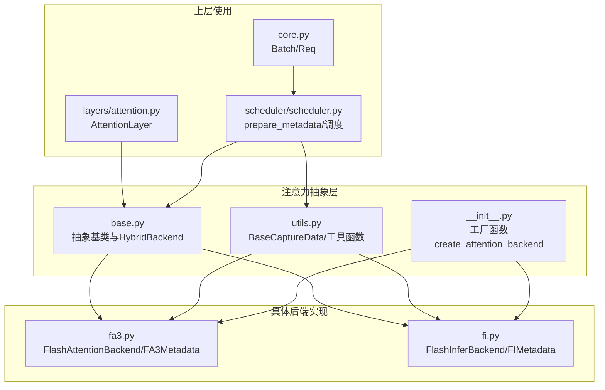
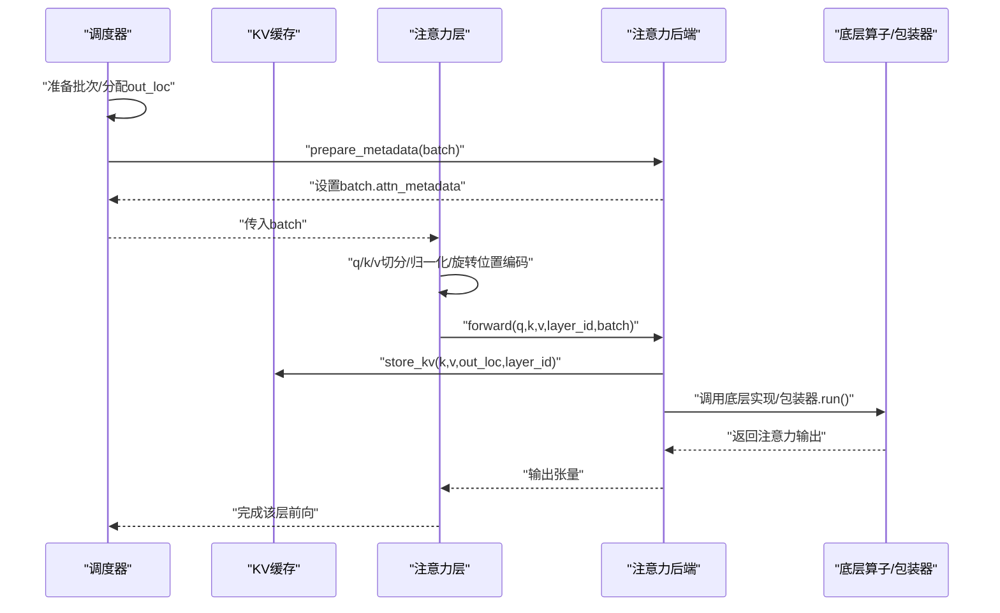
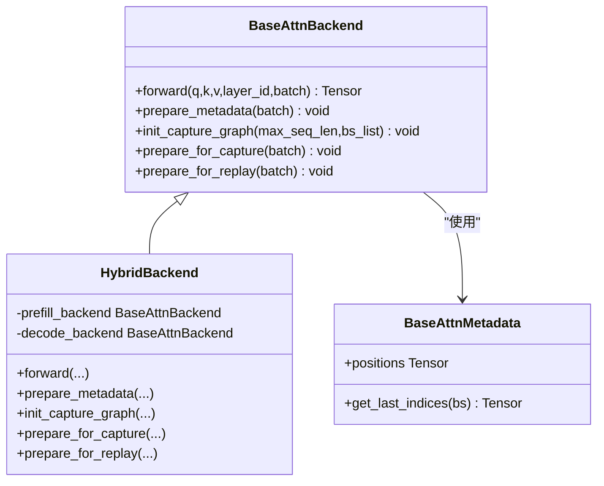
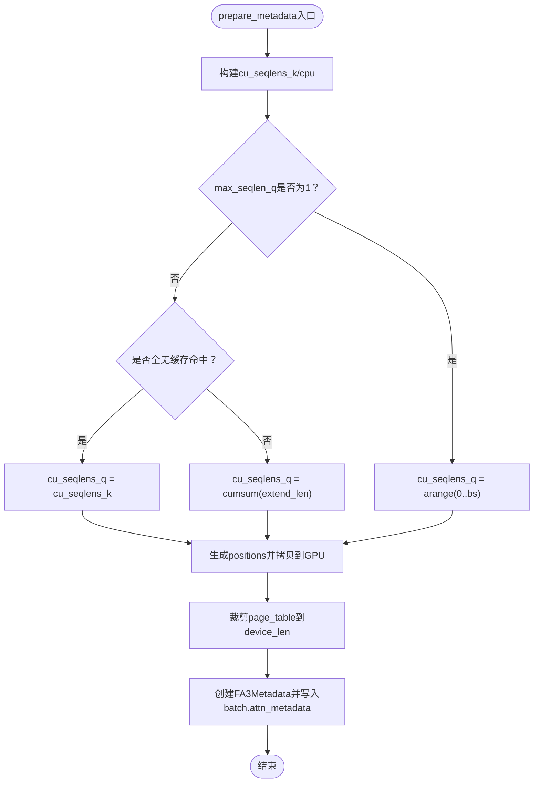
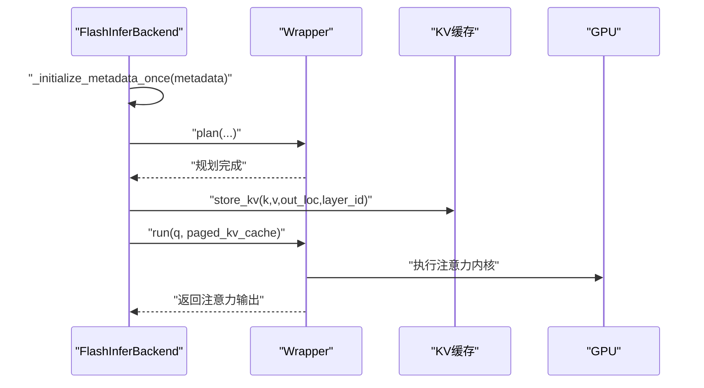
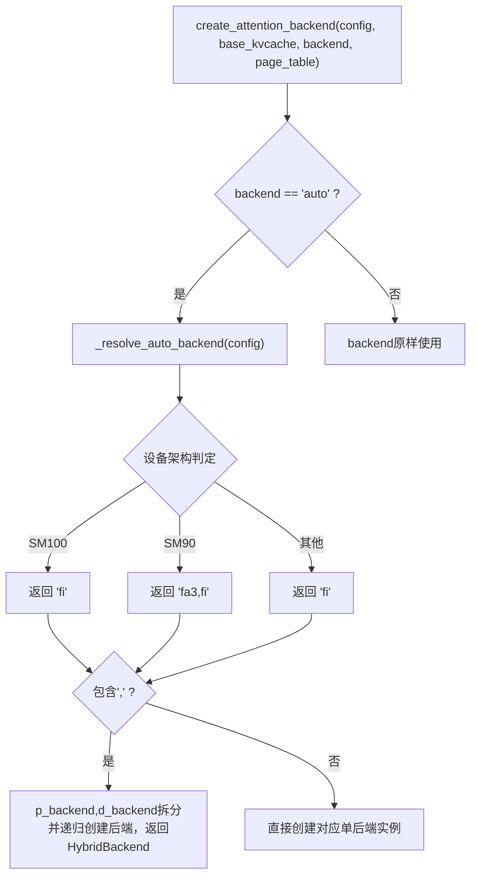
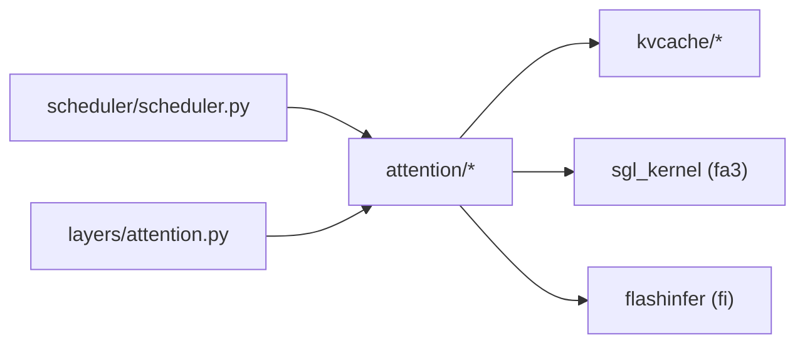

# Attention模块详解

<cite>
**本文引用的文件**
- [python/minisgl/attention/base.py](file://python/minisgl/attention/base.py)
- [python/minisgl/attention/fa3.py](file://python/minisgl/attention/fa3.py)
- [python/minisgl/attention/fi.py](file://python/minisgl/attention/fi.py)
- [python/minisgl/attention/utils.py](file://python/minisgl/attention/utils.py)
- [python/minisgl/attention/__init__.py](file://python/minisgl/attention/__init__.py)
- [python/minisgl/layers/attention.py](file://python/minisgl/layers/attention.py)
- [python/minisgl/core.py](file://python/minisgl/core.py)
- [python/minisgl/scheduler/scheduler.py](file://python/minisgl/scheduler/scheduler.py)
- [benchmark/offline/bench.py](file://benchmark/offline/bench.py)
</cite>

## 目录
1. [引言](#引言)
2. [项目结构](#项目结构)
3. [核心组件](#核心组件)
4. [架构总览](#架构总览)
5. [详细组件分析](#详细组件分析)
6. [依赖关系分析](#依赖关系分析)
7. [性能考量](#性能考量)
8. [故障排查指南](#故障排查指南)
9. [结论](#结论)
10. [附录](#附录)

## 引言
本文件系统性讲解Attention模块的抽象设计与具体实现，围绕以下目标展开：
- 抽象基类接口规范：BaseAttnBackend与BaseAttnMetadata定义了统一的注意力后端接口与元数据结构。
- 具体实现细节：FlashAttentionBackend（fa3.py）与FlashInferBackend（fi.py）的上下文管理、内存分配策略与前向计算调用方式。
- 工具函数：utils.py中的通用工具，如BaseCaptureData与make_positions。
- 工厂模式：通过create_attention_backend按设备能力自动选择或手动指定后端，并支持混合后端（prefill/decode分别使用不同后端）。
- 性能对比与适用场景：结合代码实现与自动选择逻辑，给出各后端在不同GPU架构下的适用建议与集成方法。

## 项目结构
Attention模块位于python/minisgl/attention目录下，包含抽象基类、两个具体后端实现、通用工具以及工厂入口；同时，注意力层在python/minisgl/layers/attention.py中被调用，调度器在python/minisgl/scheduler/scheduler.py中负责准备批次与元数据。

图表来源
- [python/minisgl/attention/base.py](file://python/minisgl/attention/base.py#L1-L66)
- [python/minisgl/attention/fa3.py](file://python/minisgl/attention/fa3.py#L1-L211)
- [python/minisgl/attention/fi.py](file://python/minisgl/attention/fi.py#L1-L278)
- [python/minisgl/attention/utils.py](file://python/minisgl/attention/utils.py#L1-L50)
- [python/minisgl/attention/__init__.py](file://python/minisgl/attention/__init__.py#L1-L60)
- [python/minisgl/layers/attention.py](file://python/minisgl/layers/attention.py#L1-L60)
- [python/minisgl/core.py](file://python/minisgl/core.py#L73-L98)
- [python/minisgl/scheduler/scheduler.py](file://python/minisgl/scheduler/scheduler.py#L180-L209)

章节来源
- [python/minisgl/attention/base.py](file://python/minisgl/attention/base.py#L1-L66)
- [python/minisgl/attention/fa3.py](file://python/minisgl/attention/fa3.py#L1-L211)
- [python/minisgl/attention/fi.py](file://python/minisgl/attention/fi.py#L1-L278)
- [python/minisgl/attention/utils.py](file://python/minisgl/attention/utils.py#L1-L50)
- [python/minisgl/attention/__init__.py](file://python/minisgl/attention/__init__.py#L1-L60)
- [python/minisgl/layers/attention.py](file://python/minisgl/layers/attention.py#L1-L60)
- [python/minisgl/core.py](file://python/minisgl/core.py#L73-L98)
- [python/minisgl/scheduler/scheduler.py](file://python/minisgl/scheduler/scheduler.py#L180-L209)

## 核心组件
- 抽象基类与混合后端
  - BaseAttnBackend：定义forward、prepare_metadata、init_capture_graph、prepare_for_capture、prepare_for_replay等接口。
  - BaseAttnMetadata：定义positions字段与get_last_indices抽象方法。
  - HybridBackend：根据batch.is_prefill在prefill_backend与decode_backend之间切换，统一对外接口。
- 元数据类型
  - FA3Metadata：包含cu_seqlens_k/cu_seqlens_q/cache_seqlens/max_seqlen_k/max_seqlen_q/page_table等，提供位置索引与最后token索引查询。
  - FIMetadata：包含cu_seqlens_q_cpu/cu_seqlens_k_cpu/cu_seqlens_q_gpu/indices/last_page_len_cpu/头数/维度/页大小/位置编码模式/序列长度CPU张量/dtype/wrapper/initialized等，提供位置索引与最后token索引查询。
- 工厂函数
  - create_attention_backend：支持“auto”自动选择、“fa3”、“fi”，以及“prefill_backend,decode_backend”的混合后端组合。
  - 自动选择规则：Blackwell（SM100）优先fi；Hopper（SM90）推荐“fa3,fi”混合；其他设备回退到fi。

章节来源
- [python/minisgl/attention/base.py](file://python/minisgl/attention/base.py#L12-L66)
- [python/minisgl/attention/fa3.py](file://python/minisgl/attention/fa3.py#L22-L37)
- [python/minisgl/attention/fi.py](file://python/minisgl/attention/fi.py#L49-L84)
- [python/minisgl/attention/__init__.py](file://python/minisgl/attention/__init__.py#L17-L59)

## 架构总览
注意力链路从调度器开始，生成批次并填充out_loc，随后调用后端prepare_metadata生成注意力元数据；在前向阶段，AttentionLayer对q/k/v进行归一化与旋转位置编码，再调用后端执行注意力计算；解码阶段可启用CUDA图捕获与重放以提升吞吐。

图表来源
- [python/minisgl/scheduler/scheduler.py](file://python/minisgl/scheduler/scheduler.py#L180-L209)
- [python/minisgl/layers/attention.py](file://python/minisgl/layers/attention.py#L47-L59)
- [python/minisgl/attention/base.py](file://python/minisgl/attention/base.py#L20-L37)
- [python/minisgl/attention/fa3.py](file://python/minisgl/attention/fa3.py#L49-L66)
- [python/minisgl/attention/fi.py](file://python/minisgl/attention/fi.py#L181-L189)

## 详细组件分析

### 抽象基类与HybridBackend
- 接口职责
  - forward：执行注意力前向，输入q/k/v与batch上下文，输出注意力输出。
  - prepare_metadata：为当前批次生成注意力所需的元数据（位置、索引、页表等），写入batch.attn_metadata。
  - init_capture_graph：初始化捕获图所需的数据结构与最大批大小/序列长度。
  - prepare_for_capture：将捕获图模板数据写入batch（如cu_seqlens、positions、page_table等）。
  - prepare_for_replay：在重放阶段将当前batch的关键数据复制回捕获图缓冲区。
- HybridBackend
  - 根据batch.is_prefill在prefill_backend与decode_backend之间切换，保持统一接口。

图表来源
- [python/minisgl/attention/base.py](file://python/minisgl/attention/base.py#L12-L66)

章节来源
- [python/minisgl/attention/base.py](file://python/minisgl/attention/base.py#L12-L66)

### FlashAttentionBackend（fa3.py）
- 上下文管理
  - 初始化时保存ModelConfig、KV缓存、缩放因子scale、page_table。
  - 维护捕获图状态：capture、max_graph_bs、capture_bs。
- 内存分配策略
  - prepare_metadata中：
    - 在CPU上构造cu_seqlens_k/cu_seqlens_q（使用pin_memory），随后异步搬运至GPU设备。
    - positions通过make_positions在CPU上生成，再异步拷贝到GPU。
    - page_table按每个请求裁剪到device_len长度，形成新的二维page_table。
  - CUDA图捕获：
    - init_capture_graph：创建BaseCaptureData派生对象（FA3CaptureData），记录最大批大小与bs列表。
    - prepare_for_capture：将捕获图模板数据写入batch，强制max_seqlen_q=1用于decode。
    - prepare_for_replay：将当前batch的input_ids/out_loc/positions/cache_seqlens/page_table等复制回捕获图缓冲区。
- 前向计算调用方式
  - forward：先store_kv写入KV缓存，再调用底层实现（torch.ops.sgl_kernel.fwd.default）执行注意力计算。
  - 底层实现要求张量最后一维连续，否则断言失败。
- 关键路径参考
  - [forward](file://python/minisgl/attention/fa3.py#L49-L66)
  - [prepare_metadata](file://python/minisgl/attention/fa3.py#L67-L106)
  - [init_capture_graph/prepare_for_capture/prepare_for_replay](file://python/minisgl/attention/fa3.py#L107-L142)
  - [底层调用](file://python/minisgl/attention/fa3.py#L144-L211)

图表来源
- [python/minisgl/attention/fa3.py](file://python/minisgl/attention/fa3.py#L67-L106)
- [python/minisgl/attention/utils.py](file://python/minisgl/attention/utils.py#L36-L50)

章节来源
- [python/minisgl/attention/fa3.py](file://python/minisgl/attention/fa3.py#L1-L211)
- [python/minisgl/attention/utils.py](file://python/minisgl/attention/utils.py#L1-L50)

### FlashInferBackend（fi.py）
- 上下文管理
  - 初始化时：
    - 分配float_workspace_buffer与int_workspace_buffer复用。
    - 创建prefill_wrapper与decode_wrappers，设置kv_layout="NHD"。
    - 计算每卡本地头数（qo_head_local/kv_head_local）。
    - 准备捕获图相关：capture_bs、max_graph_bs、graph_wrappers、capture、page_table。
- 内存分配策略
  - prepare_metadata中：
    - 在CPU上构造cu_seqlens_k_cpu/cu_seqlens_q_cpu（pin_memory），随后异步搬运到GPU得到cu_seqlens_q_gpu。
    - positions通过make_positions生成并拷贝到GPU。
    - indices为按请求拼接的page_table ragged索引，last_page_len_cpu通过_cached_ones_cpu缓存复用。
    - wrapper根据batch.is_decode选择decode_wrappers或prefill_wrapper。
  - CUDA图捕获：
    - init_capture_graph：创建BaseCaptureData派生对象（FICaptureData），page_table展平为1D作为ragged indices。
    - prepare_for_capture：为bs创建CUDAGraphBatchDecodeWithPagedKVCacheWrapper，绑定indptr/indices/last_page_len缓冲区，复用int_workspace_buffer，随后prepare_metadata并初始化wrapper。
    - prepare_for_replay：将input_ids/out_loc/positions复制回捕获图缓冲区，设置wrapper并初始化。
- 前向计算调用方式
  - forward：先_initialize_metadata_once一次性规划wrapper，再store_kv写入KV缓存，最后调用wrapper.run(q, paged_kv_cache)执行注意力。
- Tensor Cores优化
  - use_tensor_cores基于ENV覆盖与GQA比值判断，当GQA>=4时启用Tensor Cores以提升吞吐。

图表来源
- [python/minisgl/attention/fi.py](file://python/minisgl/attention/fi.py#L132-L172)
- [python/minisgl/attention/fi.py](file://python/minisgl/attention/fi.py#L181-L189)

章节来源
- [python/minisgl/attention/fi.py](file://python/minisgl/attention/fi.py#L1-L278)
- [python/minisgl/attention/utils.py](file://python/minisgl/attention/utils.py#L1-L50)

### 工具函数与工厂模式
- BaseCaptureData
  - 提供create静态方法，按max_bs与max_seq_len在指定设备上创建捕获图模板张量集合（input_ids/seq_lens/positions/cu_seqlens_k/cu_seqlens_q/page_table/out_loc）。
- make_positions
  - 按请求的extend_len与cached_len生成位置索引，先在CPU上生成并pin_memory，再异步拷贝到GPU。
- create_attention_backend
  - 支持backend参数："auto"、"fa3"、"fi"、"prefill_backend,decode_backend"（混合后端）。
  - 自动选择逻辑：SM100（Blackwell）优先fi；SM90（Hopper）推荐"fa3,fi"；其他设备回退fi。
  - 混合后端：若prefill与decode不同，则递归创建各自后端并由HybridBackend封装。

图表来源
- [python/minisgl/attention/__init__.py](file://python/minisgl/attention/__init__.py#L17-L59)

章节来源
- [python/minisgl/attention/utils.py](file://python/minisgl/attention/utils.py#L12-L50)
- [python/minisgl/attention/__init__.py](file://python/minisgl/attention/__init__.py#L1-L60)

## 依赖关系分析
- 调度器与后端协作
  - 调度器在prepare_metadata阶段调用后端生成元数据，随后AttentionLayer在forward中调用后端执行注意力。
- 后端与KV缓存
  - 两个后端均通过kvcache.store_kv写入新产生的k/v，再读取k_cache/v_cache执行注意力。
- 后端与底层实现
  - FlashAttentionBackend依赖sgl_kernel的torch.ops.sgl_kernel.fwd.default。
  - FlashInferBackend依赖flashinfer的BatchPrefillWithPagedKVCacheWrapper/BatchDecodeWithPagedKVCacheWrapper/CUDAGraphBatchDecodeWithPagedKVCacheWrapper。

图表来源
- [python/minisgl/scheduler/scheduler.py](file://python/minisgl/scheduler/scheduler.py#L180-L209)
- [python/minisgl/layers/attention.py](file://python/minisgl/layers/attention.py#L47-L59)
- [python/minisgl/attention/fa3.py](file://python/minisgl/attention/fa3.py#L144-L211)
- [python/minisgl/attention/fi.py](file://python/minisgl/attention/fi.py#L86-L129)

章节来源
- [python/minisgl/scheduler/scheduler.py](file://python/minisgl/scheduler/scheduler.py#L180-L209)
- [python/minisgl/layers/attention.py](file://python/minisgl/layers/attention.py#L1-L60)
- [python/minisgl/attention/fa3.py](file://python/minisgl/attention/fa3.py#L1-L211)
- [python/minisgl/attention/fi.py](file://python/minisgl/attention/fi.py#L1-L278)

## 性能考量
- 设备能力与后端选择
  - SM100（Blackwell）：优先选择fi，适合高吞吐解码。
  - SM90（Hopper）：推荐"fa3,fi"混合，prefill用fa3，decode用fi，兼顾预填充与解码性能。
  - 其他设备：回退fi。
- CUDA图捕获
  - 两后端均支持init_capture_graph/prepare_for_capture/prepare_for_replay，显著降低解码阶段开销。
  - FlashInferBackend在prepare_for_capture中创建CUDAGraphBatchDecodeWithPagedKVCacheWrapper并绑定缓冲区，支持use_tensor_cores优化。
- 内存与I/O
  - prepare_metadata阶段大量使用pin_memory的CPU张量，随后非阻塞搬运到GPU，减少CPU-GPU同步等待。
  - FlashInferBackend通过_cached_ones_cpu缓存复用last_page_len，避免频繁分配。
- 算法与内核
  - FlashAttentionBackend底层调用sgl_kernel，要求张量最后一维连续，确保高效内核访问。
  - FlashInferBackend使用flashinfer的包装器，支持prefill/decode两种模式，且可规划一次、多次运行。

章节来源
- [python/minisgl/attention/__init__.py](file://python/minisgl/attention/__init__.py#L17-L24)
- [python/minisgl/attention/fa3.py](file://python/minisgl/attention/fa3.py#L107-L142)
- [python/minisgl/attention/fi.py](file://python/minisgl/attention/fi.py#L227-L278)
- [python/minisgl/attention/fi.py](file://python/minisgl/attention/fi.py#L173-L180)

## 故障排查指南
- 导入错误
  - FlashAttentionBackend在底层调用前检查sgl_kernel是否存在，未安装会抛出ImportError并提示安装步骤。
- 张量连续性断言
  - FlashAttentionBackend底层要求k_cache/v_cache/q/page_table/cache_seqlens/cu_seqlens_q/cu_seqlens_k_new最后一维stride为1，否则断言失败。
- CUDA图捕获状态
  - FlashAttentionBackend：prepare_for_capture需bs在capture_bs中且capture已创建；prepare_for_replay需capture存在且bs匹配。
  - FlashInferBackend：prepare_for_capture需bs不在graph_wrappers中且capture已创建；prepare_for_replay需metadata未初始化且capture存在。
- 位置索引与最后token索引
  - 确保prepare_metadata正确生成positions与cu_seqlens，并通过get_last_indices获取最后token索引用于采样/日志等用途。

章节来源
- [python/minisgl/attention/fa3.py](file://python/minisgl/attention/fa3.py#L161-L171)
- [python/minisgl/attention/fa3.py](file://python/minisgl/attention/fa3.py#L115-L142)
- [python/minisgl/attention/fi.py](file://python/minisgl/attention/fi.py#L244-L278)
- [python/minisgl/attention/fa3.py](file://python/minisgl/attention/fa3.py#L32-L37)
- [python/minisgl/attention/fi.py](file://python/minisgl/attention/fi.py#L82-L84)

## 结论
- 抽象层清晰：BaseAttnBackend与BaseAttnMetadata定义了统一接口与元数据结构，HybridBackend实现了prefill/decode混合策略。
- 实现层稳健：FlashAttentionBackend与FlashInferBackend分别针对不同设备能力与内核特性进行了优化，具备完善的CUDA图捕获与内存管理策略。
- 工厂模式灵活：create_attention_backend支持自动选择与混合后端，便于在不同硬件环境下获得最佳性能。
- 集成建议：
  - Blackwell设备：优先选择fi；若需要prefill加速，可考虑"fa3,fi"混合。
  - Hopper设备：强烈推荐"fa3,fi"混合，prefill用fa3，decode用fi。
  - 其他设备：默认fi即可满足需求。
- 使用方法：
  - 通过工厂函数创建后端实例，传入ModelConfig、BaseKVCache与page_table。
  - 在调度器prepare_metadata阶段生成元数据，随后在AttentionLayer中调用后端执行注意力。

## 附录
- 基准测试入口
  - 参考benchmark/offline/bench.py，可快速评估不同后端在大规模生成任务下的吞吐表现。

章节来源
- [benchmark/offline/bench.py](file://benchmark/offline/bench.py#L1-L39)