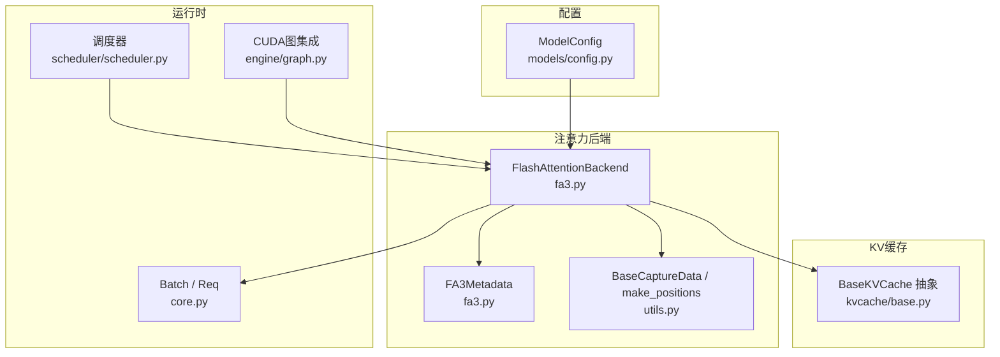
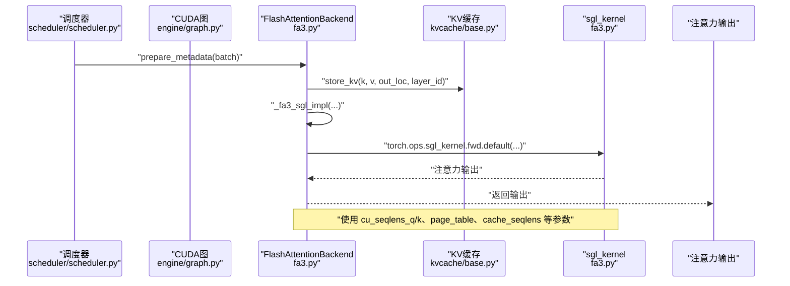
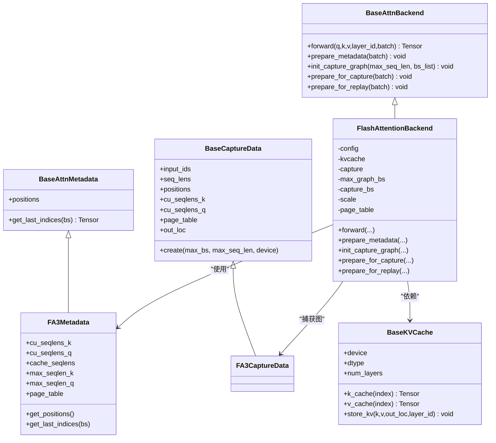
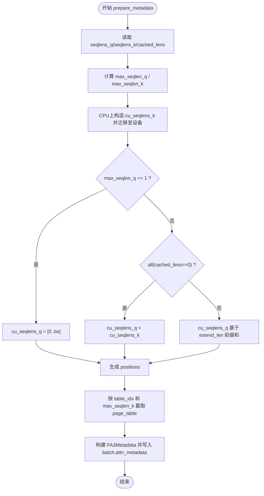
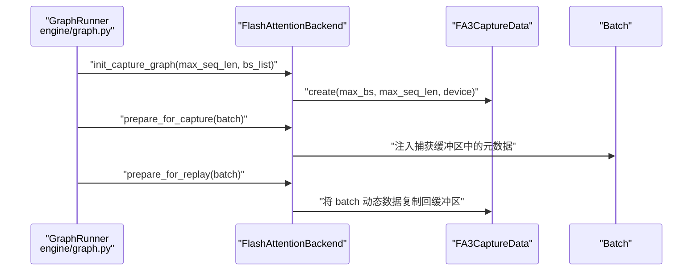
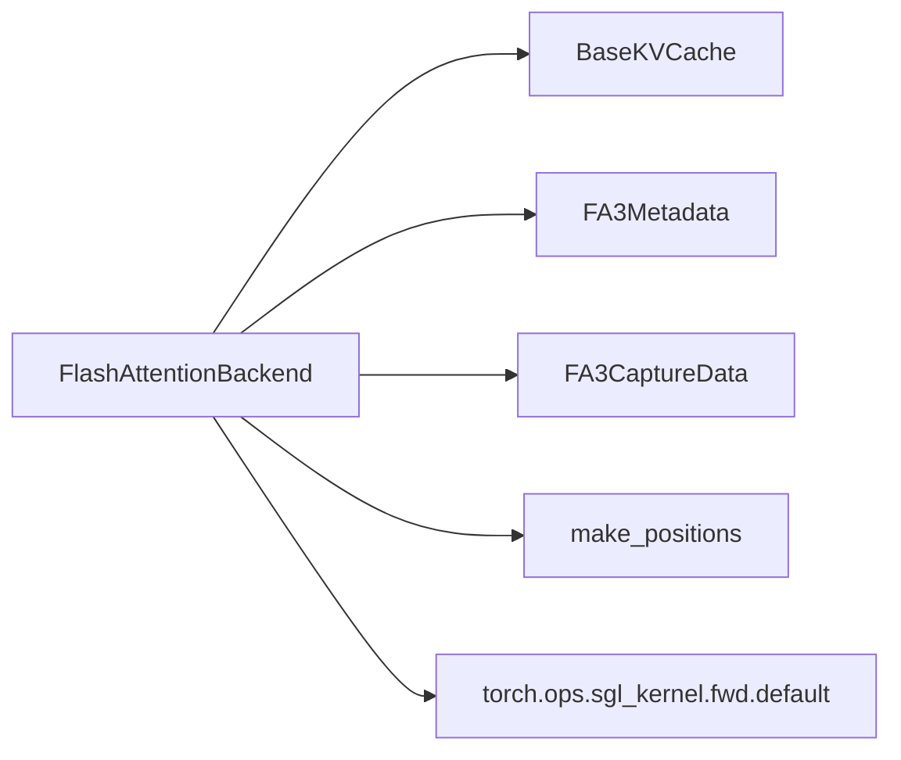

# FlashAttention后端实现

<cite>
**本文引用的文件**
- [python/minisgl/attention/fa3.py](file://python/minisgl/attention/fa3.py)
- [python/minisgl/attention/base.py](file://python/minisgl/attention/base.py)
- [python/minisgl/attention/utils.py](file://python/minisgl/attention/utils.py)
- [python/minisgl/kvcache/base.py](file://python/minisgl/kvcache/base.py)
- [python/minisgl/core.py](file://python/minisgl/core.py)
- [python/minisgl/scheduler/scheduler.py](file://python/minisgl/scheduler/scheduler.py)
- [python/minisgl/engine/graph.py](file://python/minisgl/engine/graph.py)
- [python/minisgl/models/config.py](file://python/minisgl/models/config.py)
</cite>

## 目录
1. [引言](#引言)
2. [项目结构](#项目结构)
3. [核心组件](#核心组件)
4. [架构总览](#架构总览)
5. [详细组件分析](#详细组件分析)
6. [依赖关系分析](#依赖关系分析)
7. [性能考量](#性能考量)
8. [故障排查指南](#故障排查指南)
9. [结论](#结论)
10. [附录](#附录)

## 引言
本文件系统性解析 FlashAttention 后端实现，重点围绕以下目标展开：
- 解释 FlashAttentionBackend 类如何通过 _fa3_sgl_impl 调用自定义 CUDA 内核进行高效注意力计算；
- 分析 FA3Metadata 中 cu_seqlens_q、cu_seqlens_k、page_table 等字段的生成逻辑与作用；
- 说明在预填充与解码阶段 prepare_metadata 的不同处理路径；
- 阐述 CUDA 图捕获（init_capture_graph、prepare_for_capture、prepare_for_replay）的具体实现；
- 结合代码示例展示内存复用策略与性能优化技巧；
- 指出依赖 sgl-kernel 的安装要求。

## 项目结构
该实现位于 Python 包 minisgl/attention 下，核心文件包括：
- fa3.py：FlashAttention 后端与元数据定义、CUDA 内核调用封装；
- base.py：注意力后端抽象接口；
- utils.py：捕获图所需的基础张量集合与位置索引构造工具；
- kvcache/base.py：KV 缓存抽象接口；
- core.py：Batch、Req 等运行时数据结构；
- scheduler/scheduler.py 与 engine/graph.py：调度与 CUDA 图集成点；
- models/config.py：模型配置（包含 head_dim 用于缩放）。

图表来源
- [python/minisgl/attention/fa3.py](file://python/minisgl/attention/fa3.py#L1-L211)
- [python/minisgl/attention/utils.py](file://python/minisgl/attention/utils.py#L1-L50)
- [python/minisgl/kvcache/base.py](file://python/minisgl/kvcache/base.py#L1-L135)
- [python/minisgl/core.py](file://python/minisgl/core.py#L55-L155)
- [python/minisgl/scheduler/scheduler.py](file://python/minisgl/scheduler/scheduler.py#L180-L209)
- [python/minisgl/engine/graph.py](file://python/minisgl/engine/graph.py#L143-L155)
- [python/minisgl/models/config.py](file://python/minisgl/models/config.py#L1-L56)

章节来源
- [python/minisgl/attention/fa3.py](file://python/minisgl/attention/fa3.py#L1-L211)
- [python/minisgl/attention/base.py](file://python/minisgl/attention/base.py#L1-L66)
- [python/minisgl/attention/utils.py](file://python/minisgl/attention/utils.py#L1-L50)
- [python/minisgl/kvcache/base.py](file://python/minisgl/kvcache/base.py#L1-L135)
- [python/minisgl/core.py](file://python/minisgl/core.py#L55-L155)
- [python/minisgl/scheduler/scheduler.py](file://python/minisgl/scheduler/scheduler.py#L180-L209)
- [python/minisgl/engine/graph.py](file://python/minisgl/engine/graph.py#L143-L155)
- [python/minisgl/models/config.py](file://python/minisgl/models/config.py#L1-L56)

## 核心组件
- FlashAttentionBackend：实现注意力前向、元数据准备、CUDA 图捕获与回放。
- FA3Metadata：携带注意力所需的序列切片偏移、页表、位置索引等。
- BaseCaptureData：为 CUDA 图捕获提供静态形状的缓冲区（input_ids、seq_lens、positions、cu_seqlens_k/q、page_table、out_loc）。
- BaseKVCache：KV 缓存接口，提供 k/v 缓存张量与存储写入能力。
- Batch/Req：调度与执行阶段的数据载体，包含 out_loc、padded_reqs 等。

章节来源
- [python/minisgl/attention/fa3.py](file://python/minisgl/attention/fa3.py#L1-L211)
- [python/minisgl/attention/base.py](file://python/minisgl/attention/base.py#L1-L66)
- [python/minisgl/attention/utils.py](file://python/minisgl/attention/utils.py#L1-L50)
- [python/minisgl/kvcache/base.py](file://python/minisgl/kvcache/base.py#L1-L135)
- [python/minisgl/core.py](file://python/minisgl/core.py#L55-L155)

## 架构总览
FlashAttention 后端在一次前向中完成以下流程：
- 将当前层的 k/v 写入 KV 缓存（按 out_loc 定位）；
- 计算并注入注意力元数据（cu_seqlens_q/k、cache_seqlens、page_table、positions）；
- 调用 _fa3_sgl_impl，内部通过 torch.ops.sgl_kernel.fwd.default 执行自定义 CUDA 内核；
- 返回注意力输出。

图表来源
- [python/minisgl/scheduler/scheduler.py](file://python/minisgl/scheduler/scheduler.py#L180-L209)
- [python/minisgl/engine/graph.py](file://python/minisgl/engine/graph.py#L143-L155)
- [python/minisgl/attention/fa3.py](file://python/minisgl/attention/fa3.py#L49-L106)
- [python/minisgl/kvcache/base.py](file://python/minisgl/kvcache/base.py#L1-L135)

## 详细组件分析

### FlashAttentionBackend 类
- 关键职责
  - 前向计算：写入 KV 缓存，调用 _fa3_sgl_impl 执行注意力；
  - 元数据准备：根据请求长度、缓存长度与是否解码，生成 cu_seqlens_q/k、cache_seqlens、page_table、positions；
  - CUDA 图捕获：创建捕获图缓冲区、在捕获阶段注入固定形状的元数据、在回放阶段更新捕获缓冲区内容。

- 前向流程
  - 将 k/v 写入 KV 缓存（按 out_loc 定位），随后调用 _fa3_sgl_impl；
  - 传入参数包括 q、k_cache、v_cache、page_table、cache_seqlens、cu_seqlens_q、cu_seqlens_k_new、max_seqlen_q、softmax_scale 等。

- 元数据准备（prepare_metadata）
  - 计算 seqlens_q/seqlens_k/cached_lens，得到 max_seqlen_q/max_seqlen_k；
  - 在 CPU 上构造 cu_seqlens_k（以 device_len 为准），并以非阻塞方式迁移到设备；
  - cu_seqlens_q 的生成规则：
    - 若 max_seqlen_q == 1（即解码阶段），则 cu_seqlens_q 为 [0,1,2,...,bs]；
    - 若所有 cached_lens 为 0（预填充且无缓存命中），则 cu_seqlens_q = cu_seqlens_k；
    - 否则 cu_seqlens_q 基于 extend_len 的前缀和；
  - positions 使用 make_positions 从每个请求的 cached_len..device_len 生成；
  - page_table 从全局 page_table 中按 table_idx 和 max_seqlen_k 截取；
  - 最终将 FA3Metadata 写入 batch.attn_metadata。

- CUDA 图捕获（init_capture_graph / prepare_for_capture / prepare_for_replay）
  - init_capture_graph：基于最大批量与最大序列长度创建 FA3CaptureData；
  - prepare_for_capture：将捕获缓冲区中的 cu_seqlens_k/q、positions、seq_lens、page_table、input_ids/out_loc 注入到 batch.attn_metadata；
  - prepare_for_replay：在回放前将 batch 中的动态数据复制回捕获缓冲区，确保后续回放无需重新分配。

图表来源
- [python/minisgl/attention/fa3.py](file://python/minisgl/attention/fa3.py#L1-L211)
- [python/minisgl/attention/base.py](file://python/minisgl/attention/base.py#L1-L66)
- [python/minisgl/attention/utils.py](file://python/minisgl/attention/utils.py#L1-L50)
- [python/minisgl/kvcache/base.py](file://python/minisgl/kvcache/base.py#L1-L135)

章节来源
- [python/minisgl/attention/fa3.py](file://python/minisgl/attention/fa3.py#L49-L142)
- [python/minisgl/attention/utils.py](file://python/minisgl/attention/utils.py#L1-L50)
- [python/minisgl/kvcache/base.py](file://python/minisgl/kvcache/base.py#L1-L135)

### FA3Metadata 字段与生成逻辑
- cu_seqlens_k
  - 由每个请求的 device_len 在 CPU 上构造前缀和，再迁移到设备；
  - 作为新加入的 k/v 序列的起始偏移，用于定位当前批次中各请求的新内容。
- cu_seqlens_q
  - 解码阶段：固定为 [0,1,2,...,bs]；
  - 预填充且无缓存命中：cu_seqlens_q = cu_seqlens_k；
  - 预填充有缓存命中：基于 extend_len 的前缀和；
  - 用于定位查询侧各请求的片段范围。
- cache_seqlens
  - 每个请求的 device_len（即当前已缓存的长度），迁移到设备；
  - 用于指示每条请求在 KV 缓存中的有效长度。
- page_table
  - 从全局 page_table 中按 table_idx 和 max_seqlen_k 截取，形成每条请求对应的页索引矩阵；
  - 供内核按页访问缓存。
- positions
  - 由 make_positions 生成，基于 cached_len..device_len 的连续整数，指示每个扩展 token 在序列中的绝对位置。

章节来源
- [python/minisgl/attention/fa3.py](file://python/minisgl/attention/fa3.py#L67-L106)
- [python/minisgl/attention/utils.py](file://python/minisgl/attention/utils.py#L36-L50)

### 预填充与解码阶段的 prepare_metadata 差异
- 解码阶段（max_seqlen_q == 1）
  - cu_seqlens_q 固定为 [0,1,2,...,bs]，避免重复计算；
  - cu_seqlens_k 仍按 device_len 计算；
  - positions 仍按 cached_len..device_len 生成。
- 预填充阶段
  - 若所有 cached_lens 为 0，则 cu_seqlens_q = cu_seqlens_k；
  - 否则 cu_seqlens_q 基于 extend_len 的前缀和；
  - cu_seqlens_k 始终基于 device_len。

图表来源
- [python/minisgl/attention/fa3.py](file://python/minisgl/attention/fa3.py#L67-L106)
- [python/minisgl/attention/utils.py](file://python/minisgl/attention/utils.py#L36-L50)

章节来源
- [python/minisgl/attention/fa3.py](file://python/minisgl/attention/fa3.py#L67-L106)
- [python/minisgl/attention/utils.py](file://python/minisgl/attention/utils.py#L36-L50)

### CUDA 图捕获（init_capture_graph / prepare_for_capture / prepare_for_replay）
- init_capture_graph
  - 创建 FA3CaptureData，包含固定形状的 input_ids、seq_lens、positions、cu_seqlens_k/q、page_table、out_loc；
  - 记录最大批量 max_graph_bs 与支持的 bs 列表 capture_bs。
- prepare_for_capture
  - 将捕获缓冲区中的 cu_seqlens_k/q、positions、seq_lens、page_table、input_ids/out_loc 复制到 batch.attn_metadata；
  - 设置 max_seqlen_k 为 page_table 的列数，max_seqlen_q 为 1（解码专用）。
- prepare_for_replay
  - 将 batch 中的动态数据（input_ids、out_loc、cu_seqlens_k、positions、cache_seqlens、page_table）复制回捕获缓冲区；
  - 保证后续回放无需重新分配内存。

图表来源
- [python/minisgl/attention/fa3.py](file://python/minisgl/attention/fa3.py#L107-L142)
- [python/minisgl/attention/utils.py](file://python/minisgl/attention/utils.py#L22-L34)
- [python/minisgl/engine/graph.py](file://python/minisgl/engine/graph.py#L143-L155)

章节来源
- [python/minisgl/attention/fa3.py](file://python/minisgl/attention/fa3.py#L107-L142)
- [python/minisgl/attention/utils.py](file://python/minisgl/attention/utils.py#L22-L34)
- [python/minisgl/engine/graph.py](file://python/minisgl/engine/graph.py#L143-L155)

### _fa3_sgl_impl 与 CUDA 内核调用
- 依赖检查：尝试导入 sgl_kernel.flash_attn，若失败则抛出 ImportError 并提示安装 sgl-kernel 与 libnuma1；
- 连续性断言：确保 q、k_cache、v_cache、page_table、cache_seqlens、cu_seqlens_q、cu_seqlens_k_new 的最后维度连续；
- 调用 torch.ops.sgl_kernel.fwd.default，传入参数包括 q、k_cache、v_cache、cu_seqlens_q、cu_seqlens_k_new、cache_seqlens、page_table、softmax_scale、causal、window_size、softcap、num_splits、pack_gqa、sm_margin 等；
- 返回注意力输出。

章节来源
- [python/minisgl/attention/fa3.py](file://python/minisgl/attention/fa3.py#L144-L211)

## 依赖关系分析
- 组件耦合
  - FlashAttentionBackend 依赖 BaseKVCache 提供 k/v 缓存与写入能力；
  - 依赖 FA3Metadata/FA3CaptureData 提供注意力元数据与捕获图缓冲；
  - 依赖 make_positions 生成位置索引；
  - 依赖 torch.ops.sgl_kernel.fwd.default 执行 CUDA 内核。
- 外部依赖
  - sgl-kernel：必须安装并正确加载；
  - CUDA 设备与流：非阻塞迁移依赖设备可用性；
  - 可选：libnuma1（在 ImportError 提示中建议安装）。

图表来源
- [python/minisgl/attention/fa3.py](file://python/minisgl/attention/fa3.py#L1-L211)
- [python/minisgl/attention/utils.py](file://python/minisgl/attention/utils.py#L1-L50)
- [python/minisgl/kvcache/base.py](file://python/minisgl/kvcache/base.py#L1-L135)

章节来源
- [python/minisgl/attention/fa3.py](file://python/minisgl/attention/fa3.py#L1-L211)
- [python/minisgl/attention/utils.py](file://python/minisgl/attention/utils.py#L1-L50)
- [python/minisgl/kvcache/base.py](file://python/minisgl/kvcache/base.py#L1-L135)

## 性能考量
- 内存复用策略
  - 非阻塞迁移：在 CPU 上构造 cu_seqlens_k/q 后立即迁移到设备，减少主机等待；
  - 位置索引：使用 pinned memory 构造 positions，再非阻塞迁移到设备；
  - 捕获图缓冲：在 init_capture_graph 中一次性分配固定形状的缓冲区，避免反复分配；
  - 页表截取：仅按 max_seqlen_k 截取 page_table，避免多余拷贝。
- 计算路径优化
  - 解码阶段 cu_seqlens_q 固定为 [0..bs]，避免重复 cumsum；
  - 预填充无缓存命中时直接复用 cu_seqlens_k，减少一次前缀和；
  - 通过 num_splits、pack_gqa、softcap、sm_margin 等参数可调优内核性能。
- 数据布局
  - 断言最后维度连续，确保内核高效访问；
  - KV 缓存按 out_loc 写入，避免随机写导致的性能下降。

章节来源
- [python/minisgl/attention/fa3.py](file://python/minisgl/attention/fa3.py#L67-L106)
- [python/minisgl/attention/fa3.py](file://python/minisgl/attention/fa3.py#L144-L211)
- [python/minisgl/attention/utils.py](file://python/minisgl/attention/utils.py#L36-L50)

## 故障排查指南
- 未安装 sgl-kernel
  - 现象：ImportError 提示找不到 sgl_kernel.flash_attn；
  - 处理：按照提示安装 sgl-kernel；若已安装，尝试安装 libnuma1。
- CUDA 图相关错误
  - 确认已调用 init_capture_graph 并传入正确的 bs_list；
  - 确保 prepare_for_capture 与 prepare_for_replay 成对调用；
  - 确认捕获缓冲区与 batch 的形状一致（max_seqlen_k、bs）。
- 数据连续性问题
  - _fa3_sgl_impl 对输入张量的最后维度连续性有断言，若报错需检查张量布局或分片方式。
- 位置索引不正确
  - 检查 cached_len/device_len 是否与 out_loc 写入顺序一致；
  - 确认 make_positions 的生成区间与实际扩展长度匹配。

章节来源
- [python/minisgl/attention/fa3.py](file://python/minisgl/attention/fa3.py#L144-L211)
- [python/minisgl/attention/fa3.py](file://python/minisgl/attention/fa3.py#L107-L142)
- [python/minisgl/attention/utils.py](file://python/minisgl/attention/utils.py#L36-L50)

## 结论
FlashAttentionBackend 通过 FA3Metadata 精准描述批内各请求的序列切片与页表映射，并在解码与预填充场景下采用不同的 cu_seqlens_q 生成策略，显著降低开销。借助 CUDA 图捕获，后端在解码阶段实现了稳定的低延迟执行路径。通过非阻塞迁移、固定形状缓冲与内核参数调优，整体达到良好的吞吐与延迟平衡。使用前务必满足 sgl-kernel 的安装要求。

## 附录
- 安装与环境要求
  - 必须安装 sgl-kernel；
  - 若出现 ImportError，可按提示安装 libnuma1；
  - 确保 CUDA 设备可用且张量最后维度连续。
- 关键参数说明（来自 _fa3_sgl_impl）
  - softmax_scale：缩放因子，通常为 head_dim^-0.5；
  - window_size：滑动窗口大小，默认(-1,-1)表示无限上下文；
  - softcap：缩放上限，0 表示关闭；
  - num_splits、pack_gqa、sm_margin：内核性能调优参数。

章节来源
- [python/minisgl/attention/fa3.py](file://python/minisgl/attention/fa3.py#L144-L211)
- [python/minisgl/models/config.py](file://python/minisgl/models/config.py#L1-L56)