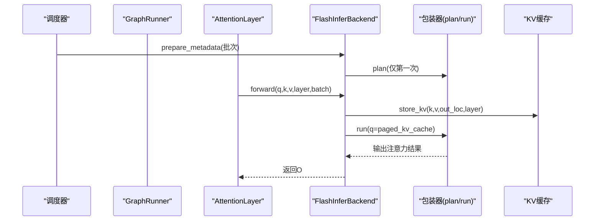
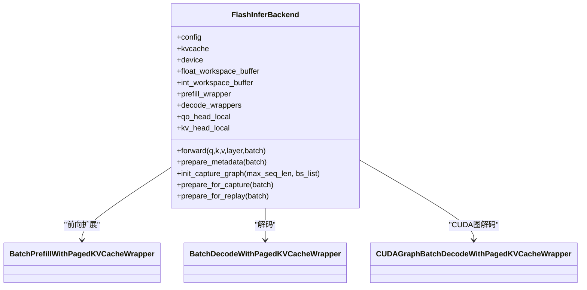
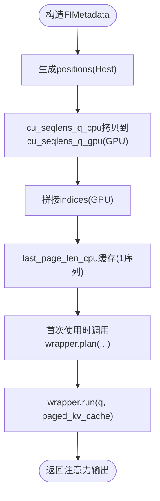
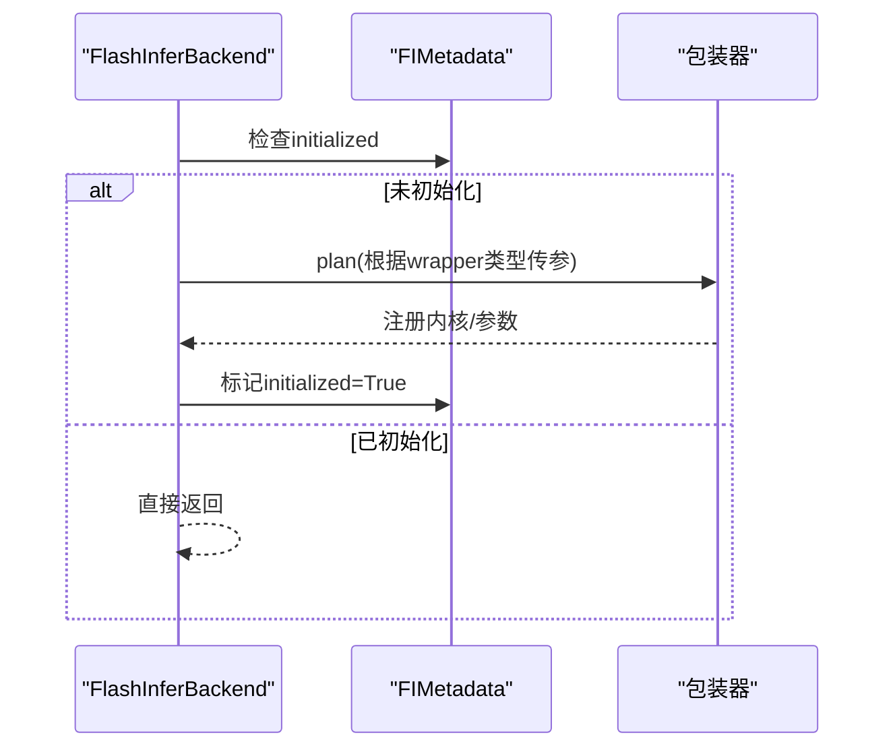
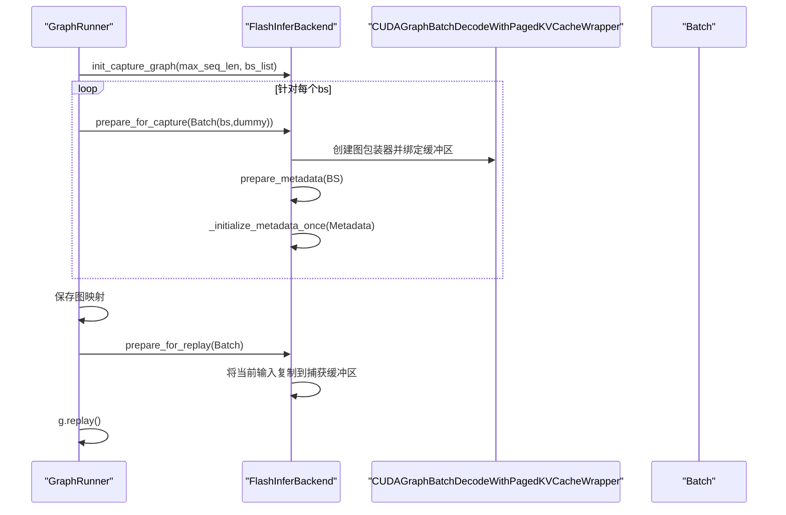
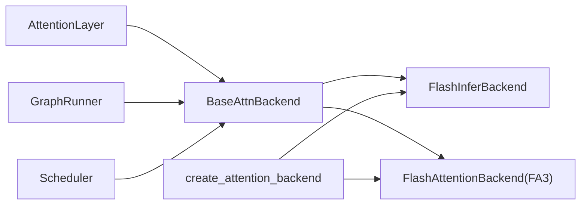

# FlashInfer后端实现

<cite>
**本文引用的文件**
- [fi.py](file://python/minisgl/attention/fi.py)
- [base.py](file://python/minisgl/attention/base.py)
- [fa3.py](file://python/minisgl/attention/fa3.py)
- [utils.py](file://python/minisgl/attention/utils.py)
- [scheduler.py](file://python/minisgl/scheduler/scheduler.py)
- [graph.py](file://python/minisgl/engine/graph.py)
- [engine.py](file://python/minisgl/engine/engine.py)
- [attention.py](file://python/minisgl/layers/attention.py)
- [__init__.py](file://python/minisgl/attention/__init__.py)
</cite>

## 目录
1. [引言](#引言)
2. [项目结构](#项目结构)
3. [核心组件](#核心组件)
4. [架构总览](#架构总览)
5. [详细组件分析](#详细组件分析)
6. [依赖关系分析](#依赖关系分析)
7. [性能考量](#性能考量)
8. [故障排查指南](#故障排查指南)
9. [结论](#结论)
10. [附录](#附录)

## 引言
本文件系统化阐述 FlashInfer 后端如何通过封装 FlashInfer 的批前向（prefill）与解码（decode）KV 缓存包装器，实现高性能注意力计算；重点解析两类包装器的职责划分、延迟初始化策略、CPU/GPU 双缓冲元数据设计、CUDA 图支持的创建与回放流程、use_tensor_cores 决策逻辑，以及与 FA3 后端在实现上的差异。

## 项目结构
- 注意力后端位于 python/minisgl/attention，包含通用抽象基类、FlashInfer 实现、FA3 实现与通用工具。
- 引擎侧通过 GraphRunner 负责捕获与回放 CUDA 图，调度器负责准备批次与写入页表索引，注意力层在前向时调用后端执行注意力计算。

```mermaid
graph TB
subgraph "注意力后端"
A["BaseAttnBackend<br/>BaseAttnMetadata"]
B["FlashInferBackend<br/>FIMetadata/FICaptureData"]
C["FlashAttentionBackend(FA3)<br/>FA3Metadata/FA3CaptureData"]
end
subgraph "引擎与调度"
D["GraphRunner<br/>捕获/回放CUDA图"]
E["Scheduler<br/>准备批次/写入页表"]
F["Engine.forward_batch"]
end
subgraph "模型层"
G["AttentionLayer<br/>调用attn_backend.forward"]
end
E --> |prepare_metadata| B
E --> |prepare_metadata| C
D --> |init_capture_graph/prepare_for_capture| B
D --> |init_capture_graph/prepare_for_capture| C
G --> |forward(q,k,v)| B
G --> |forward(q,k,v)| C
F --> |replay| D
```

图表来源
- [fi.py](file://python/minisgl/attention/fi.py#L86-L278)
- [fa3.py](file://python/minisgl/attention/fa3.py#L1-L211)
- [base.py](file://python/minisgl/attention/base.py#L1-L66)
- [graph.py](file://python/minisgl/engine/graph.py#L48-L156)
- [scheduler.py](file://python/minisgl/scheduler/scheduler.py#L180-L209)
- [attention.py](file://python/minisgl/layers/attention.py#L47-L59)

章节来源
- [fi.py](file://python/minisgl/attention/fi.py#L86-L278)
- [fa3.py](file://python/minisgl/attention/fa3.py#L1-L211)
- [base.py](file://python/minisgl/attention/base.py#L1-L66)
- [graph.py](file://python/minisgl/engine/graph.py#L48-L156)
- [scheduler.py](file://python/minisgl/scheduler/scheduler.py#L180-L209)
- [attention.py](file://python/minisgl/layers/attention.py#L47-L59)

## 核心组件
- FlashInferBackend：封装 FlashInfer 的批前向与批解码 KV 缓存包装器，提供统一的 forward 接口，并支持 CUDA 图捕获与回放。
- FIMetadata：承载注意力所需的各类指针与张量，含 CPU/GPU 双缓冲字段，用于 plan 初始化与运行时访问。
- FICaptureData：用于 CUDA 图捕获阶段的静态占位数据，便于后续回放时直接填充。
- BaseAttnBackend/BaseAttnMetadata：定义注意力后端与元数据的抽象接口，确保不同后端可互换。

章节来源
- [fi.py](file://python/minisgl/attention/fi.py#L37-L85)
- [fi.py](file://python/minisgl/attention/fi.py#L86-L170)
- [base.py](file://python/minisgl/attention/base.py#L12-L38)

## 架构总览
FlashInfer 后端在运行时根据批次类型选择不同的包装器：
- 解码阶段：使用 BatchDecodeWithPagedKVCacheWrapper
- 前向扩展阶段：使用 BatchPrefillWithPagedKVCacheWrapper

两者共享同一工作区缓冲区，但内部计划（plan）参数不同。后端在首次使用前对包装器进行一次性 plan，避免重复开销。



图表来源
- [fi.py](file://python/minisgl/attention/fi.py#L131-L172)
- [fi.py](file://python/minisgl/attention/fi.py#L181-L190)
- [scheduler.py](file://python/minisgl/scheduler/scheduler.py#L180-L209)
- [graph.py](file://python/minisgl/engine/graph.py#L114-L124)

## 详细组件分析

### FlashInferBackend 类与两类包装器
- 包装器选择
  - 解码：使用 BatchDecodeWithPagedKVCacheWrapper
  - 前向扩展：使用 BatchPrefillWithPagedKVCacheWrapper
- 共享工作区
  - 使用同一 float_workspace_buffer，并复用预填包装器的 int 工作区，减少内存占用。
- 计算头数本地化
  - 将全局 QO/KV 头数按张量并行大小均分到本地，降低跨卡通信成本。



图表来源
- [fi.py](file://python/minisgl/attention/fi.py#L86-L170)
- [fi.py](file://python/minisgl/attention/fi.py#L244-L278)

章节来源
- [fi.py](file://python/minisgl/attention/fi.py#L86-L170)
- [fi.py](file://python/minisgl/attention/fi.py#L173-L180)
- [fi.py](file://python/minisgl/attention/fi.py#L244-L278)

### FIMetadata 的 CPU/GPU 双缓冲设计
- 字段布局
  - cu_seqlens_q_cpu/cu_seqlens_k_cpu：CPU 上的累积序列长度，供 plan 使用
  - cu_seqlens_q_gpu：GPU 上的累积序列长度，供运行时快速访问
  - indices：GPU 上的页表索引
  - last_page_len_cpu：CPU 上的最后一页长度（以 1 填充）
  - 其他：头数、维度、页大小、位置编码模式、数据类型等
- 设计动机
  - plan 需要非阻塞地从 CPU 准备参数，而运行时需要 GPU 上的指针以避免额外拷贝
  - last_page_len_cpu 作为常量 1 序列，通过缓存优化减少频繁分配
  - positions 在构造时即在 CPU 上生成并随后拷贝到 GPU，保证运行时连续访问



图表来源
- [fi.py](file://python/minisgl/attention/fi.py#L48-L85)
- [fi.py](file://python/minisgl/attention/fi.py#L131-L172)
- [fi.py](file://python/minisgl/attention/fi.py#L173-L180)
- [utils.py](file://python/minisgl/attention/utils.py#L36-L50)

章节来源
- [fi.py](file://python/minisgl/attention/fi.py#L48-L85)
- [fi.py](file://python/minisgl/attention/fi.py#L131-L172)
- [fi.py](file://python/minisgl/attention/fi.py#L173-L180)
- [utils.py](file://python/minisgl/attention/utils.py#L36-L50)

### 延迟初始化策略：_initialize_metadata_once 与 plan
- 策略要点
  - 首次使用某批次的 wrapper 时才调用 plan，避免重复初始化
  - 对解码与前向扩展分别传入不同的参数集（indptr/indices/last_page_len 或 qo_indptr/paged_kv_indptr/paged_kv_indices）
  - 所有参数均为非阻塞准备，提高吞吐
- 性能收益
  - 将昂贵的内核绑定与参数注册推迟到真正需要时，减少冷启动开销



图表来源
- [fi.py](file://python/minisgl/attention/fi.py#L131-L172)

章节来源
- [fi.py](file://python/minisgl/attention/fi.py#L131-L172)

### CUDA 图支持：创建与回放流程
- 创建阶段（捕获）
  - GraphRunner 调用后端 init_capture_graph，准备捕获所需的最大批次与最大序列长度
  - 对每个目标 bs，构造全零 dummy 请求批次，调用后端 prepare_for_capture
  - prepare_for_capture 中创建 CUDAGraphBatchDecodeWithPagedKVCacheWrapper，绑定 int 工作区与静态缓冲区
  - 重新 prepare_metadata 并将 wrapper 替换为图包装器，随后调用 _initialize_metadata_once 完成 plan
- 回放阶段
  - GraphRunner 根据批次大小选择对应 CUDA 图，调用后端 prepare_for_replay
  - prepare_for_replay 将当前批次的输入复制到捕获时的静态缓冲区，然后执行图回放



图表来源
- [graph.py](file://python/minisgl/engine/graph.py#L87-L124)
- [graph.py](file://python/minisgl/engine/graph.py#L133-L142)
- [fi.py](file://python/minisgl/attention/fi.py#L227-L278)

章节来源
- [graph.py](file://python/minisgl/engine/graph.py#L87-L124)
- [graph.py](file://python/minisgl/engine/graph.py#L133-L142)
- [fi.py](file://python/minisgl/attention/fi.py#L227-L278)

### use_tensor_cores 决策逻辑
- 决策依据
  - 若环境变量显式覆盖，则使用覆盖值
  - 否则基于 GQA（QO 头数 / KV 头数）判断，当 GQA >= 4 时启用 Tensor Cores
- 目的
  - 在高 GQA 场景下利用 Tensor Cores 提升解码阶段吞吐

章节来源
- [fi.py](file://python/minisgl/attention/fi.py#L236-L243)

### _get_ones_cpu 缓存优化
- 功能
  - 维护一个 pinned 内存的 1 序列缓存，按下一个 2 的幂次扩容，避免频繁分配
- 用途
  - 为 last_page_len_cpu 提供统一的 1 序列，简化 plan 参数构造

章节来源
- [fi.py](file://python/minisgl/attention/fi.py#L173-L180)

### 与 FA3 后端的实现差异
- 包装器与调用路径
  - FA3：直接在 forward 中调用自定义内核函数，传入 cu_seqlens_k/q、cache_seqlens、page_table 等
  - FI：通过 FlashInfer 包装器封装，先 plan 再 run，解码与前向扩展分别使用不同包装器
- 元数据结构
  - FA3：FA3Metadata 含 cu_seqlens_k/q、cache_seqlens、max_seqlen_k/q、page_table
  - FI：FIMetadata 含 cu_seqlens_q/k_cpu/gpu、indices、last_page_len_cpu、num_qo_kv_heads、head_dim、page_size、pos_encoding_mode、dtype、wrapper
- CUDA 图
  - FA3：prepare_for_capture/prepare_for_replay 直接构造 FA3Metadata 并复制必要张量
  - FI：使用 CUDAGraphBatchDecodeWithPagedKVCacheWrapper，绑定静态缓冲区并在捕获时完成 plan
- 位置编码
  - FA3：positions 由 make_positions 生成并传入内核
  - FI：positions 与 cu_seqlens_q/gpu 保持一致，解码时 cu_seqlens_q_gpu 作为运行时索引

章节来源
- [fa3.py](file://python/minisgl/attention/fa3.py#L1-L211)
- [fi.py](file://python/minisgl/attention/fi.py#L48-L85)
- [fi.py](file://python/minisgl/attention/fi.py#L181-L190)

## 依赖关系分析
- 抽象层
  - BaseAttnBackend/BaseAttnMetadata 定义统一接口，使调度器与模型层不关心具体后端实现
- 运行时耦合
  - AttentionLayer 仅依赖 BaseAttnBackend.forward，注意力计算细节由后端封装
  - GraphRunner 依赖后端的捕获/回放接口，实现解码阶段的稳定吞吐
- 后端选择
  - 自动后端选择会根据 GPU 架构优先选择 FI；在某些架构上可能混合使用 FA3,FI



图表来源
- [base.py](file://python/minisgl/attention/base.py#L12-L38)
- [__init__.py](file://python/minisgl/attention/__init__.py#L17-L59)
- [attention.py](file://python/minisgl/layers/attention.py#L47-L59)
- [graph.py](file://python/minisgl/engine/graph.py#L48-L156)
- [scheduler.py](file://python/minisgl/scheduler/scheduler.py#L180-L209)

章节来源
- [base.py](file://python/minisgl/attention/base.py#L12-L38)
- [__init__.py](file://python/minisgl/attention/__init__.py#L17-L59)
- [attention.py](file://python/minisgl/layers/attention.py#L47-L59)
- [graph.py](file://python/minisgl/engine/graph.py#L48-L156)
- [scheduler.py](file://python/minisgl/scheduler/scheduler.py#L180-L209)

## 性能考量
- 包装器复用与工作区共享
  - 预填包装器的 int 工作区被解码包装器复用，减少内存占用
- 非阻塞参数准备
  - plan 使用非阻塞方式准备参数，降低调度等待
- 双缓冲与缓存
  - cu_seqlens_q_gpu 与 pinned 的 1 序列缓存减少拷贝与分配
- CUDA 图
  - 解码阶段固定 bs 的图回放显著降低内核启动开销
- Tensor Cores
  - 高 GQA 下启用 Tensor Cores，提升解码吞吐

[本节为通用性能讨论，无需列出具体文件来源]

## 故障排查指南
- 无法捕获 CUDA 图
  - 确认 GraphRunner 已正确调用后端 init_capture_graph，并且 prepare_for_capture 成功创建图包装器
  - 检查 bs 是否在捕获列表中，以及是否已存在对应图
- 回放失败或结果异常
  - 确保 prepare_for_replay 正确将当前批次的 input_ids/out_loc/positions 复制到捕获缓冲区
  - 确认 wrapper 已切换为图包装器且未重复初始化
- 位置编码或索引错误
  - 检查 positions 生成逻辑与 cu_seqlens_q/gpu 的一致性
  - 确认 page_table 索引写入顺序与调度器一致

章节来源
- [graph.py](file://python/minisgl/engine/graph.py#L114-L124)
- [graph.py](file://python/minisgl/engine/graph.py#L133-L142)
- [fi.py](file://python/minisgl/attention/fi.py#L244-L278)
- [scheduler.py](file://python/minisgl/scheduler/scheduler.py#L180-L209)

## 结论
FlashInfer 后端通过两类包装器分别覆盖解码与前向扩展场景，结合延迟初始化、CPU/GPU 双缓冲与 CUDA 图技术，在保证正确性的同时显著提升了注意力计算的吞吐与稳定性。与 FA3 后端相比，FI 更强调包装器封装与图捕获，适合大规模解码场景；FA3 则更贴近内核级调用，参数更直观。实际部署中可根据硬件架构与负载特征选择合适后端或混合策略。

[本节为总结性内容，无需列出具体文件来源]

## 附录
- 关键实现路径参考
  - 包装器创建与工作区共享：[fi.py](file://python/minisgl/attention/fi.py#L86-L120)
  - 解码/前向扩展包装器选择与 forward 流程：[fi.py](file://python/minisgl/attention/fi.py#L181-L190)
  - FIMetadata 字段与断言：[fi.py](file://python/minisgl/attention/fi.py#L48-L85)
  - 延迟初始化与 plan 参数差异：[fi.py](file://python/minisgl/attention/fi.py#L131-L172)
  - CUDA 图捕获与回放：[fi.py](file://python/minisgl/attention/fi.py#L227-L278)，[graph.py](file://python/minisgl/engine/graph.py#L87-L124)，[graph.py](file://python/minisgl/engine/graph.py#L133-L142)
  - FA3 元数据与内核调用：[fa3.py](file://python/minisgl/attention/fa3.py#L22-L106)，[fa3.py](file://python/minisgl/attention/fa3.py#L144-L211)