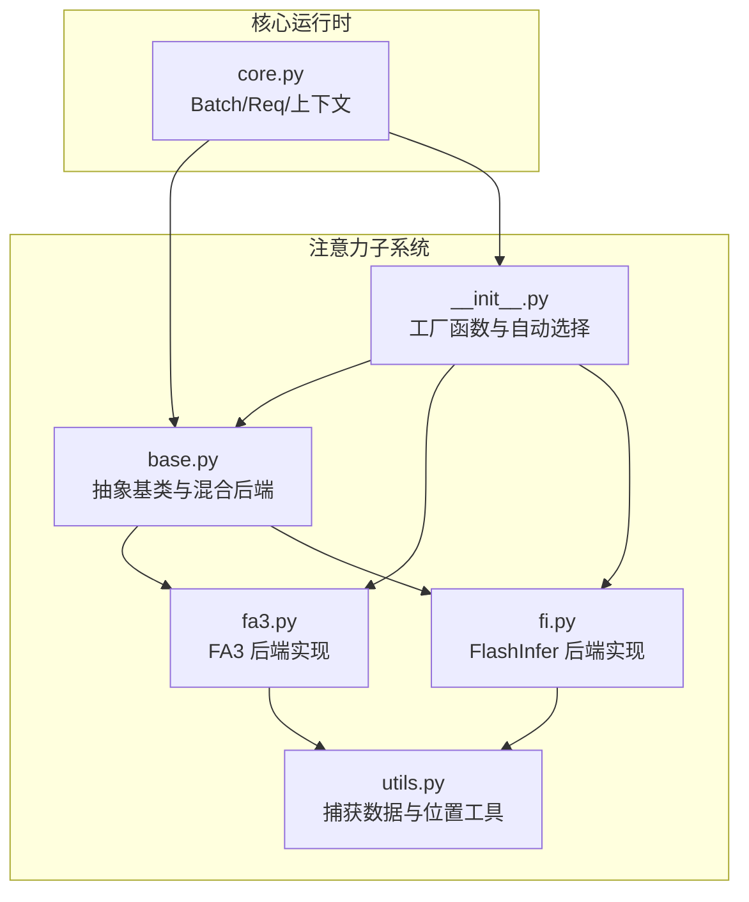
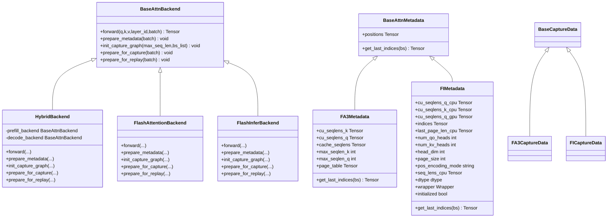
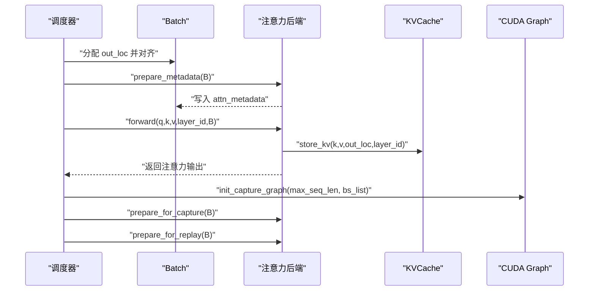
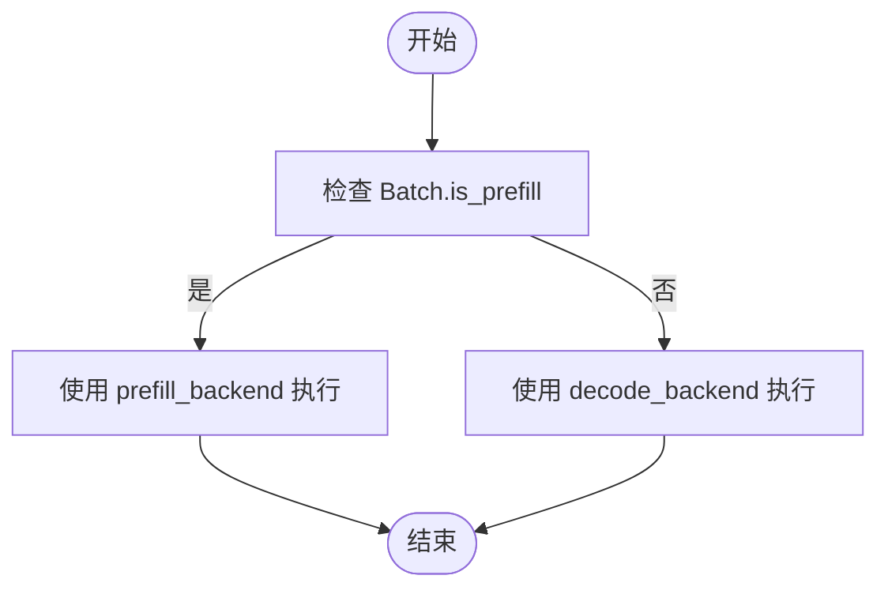
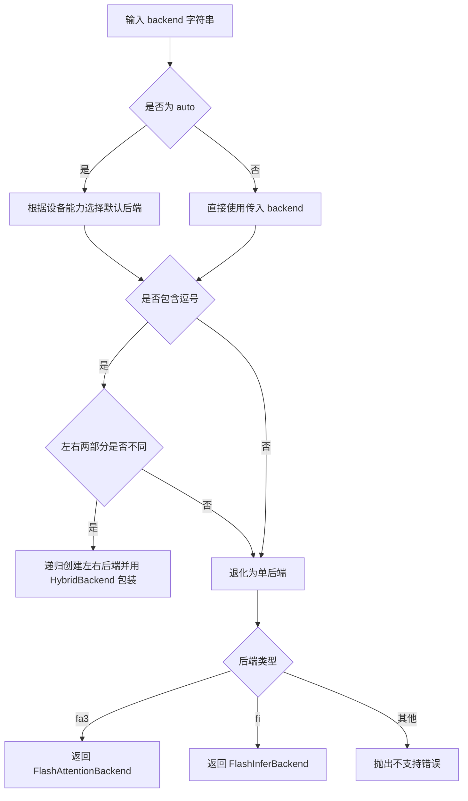
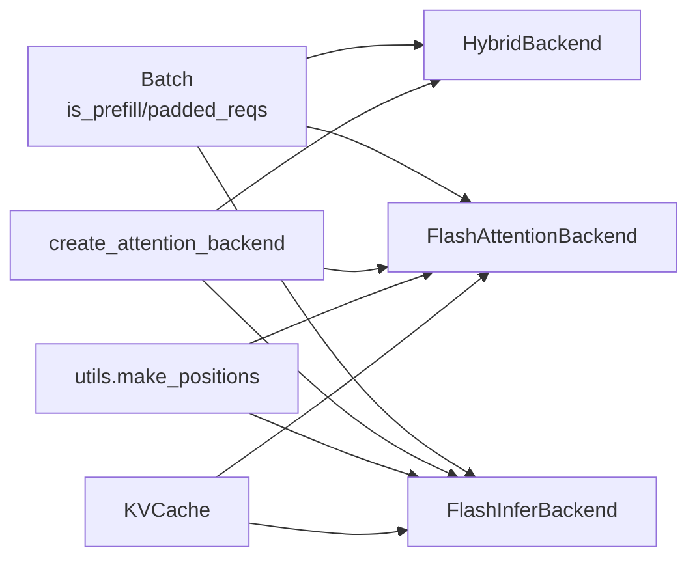

# 抽象基类设计

<cite>
**本文引用的文件列表**
- [python/minisgl/attention/base.py](file://python/minisgl/attention/base.py)
- [python/minisgl/attention/__init__.py](file://python/minisgl/attention/__init__.py)
- [python/minisgl/attention/fa3.py](file://python/minisgl/attention/fa3.py)
- [python/minisgl/attention/fi.py](file://python/minisgl/attention/fi.py)
- [python/minisgl/attention/utils.py](file://python/minisgl/attention/utils.py)
- [python/minisgl/core.py](file://python/minisgl/core.py)
</cite>

## 目录
1. [引言](#引言)
2. [项目结构](#项目结构)
3. [核心组件](#核心组件)
4. [架构总览](#架构总览)
5. [详细组件分析](#详细组件分析)
6. [依赖关系分析](#依赖关系分析)
7. [性能考量](#性能考量)
8. [故障排查指南](#故障排查指南)
9. [结论](#结论)
10. [附录](#附录)

## 引言
本文件围绕注意力后端的抽象基类与数据类设计展开，重点解析以下主题：
- 抽象基类 BaseAttnBackend 与数据类 BaseAttnMetadata 的接口规范与职责边界
- forward、prepare_metadata、init_capture_graph、prepare_for_capture、prepare_for_replay 五个抽象方法的调用时机与功能职责
- HybridBackend 如何在预填充（prefill）与解码（decode）阶段切换不同后端，形成混合模式
- 工厂函数 create_attention_backend 在系统初始化时的动态创建流程
- UML 类图展示继承关系与接口设计如何支持可扩展性

## 项目结构
注意力子系统位于 python/minisgl/attention 目录，包含抽象基类、具体后端实现、元数据与工具类，以及工厂函数。核心文件如下：
- base.py：定义抽象基类与混合后端
- __init__.py：工厂函数与自动后端选择逻辑
- fa3.py：基于 FlashAttention3 的后端实现
- fi.py：基于 FlashInfer 的后端实现
- utils.py：捕获数据与位置构造工具
- core.py：Batch 与 Req 等调度与执行上下文的基础类型

图表来源
- [python/minisgl/attention/base.py](file://python/minisgl/attention/base.py#L1-L66)
- [python/minisgl/attention/__init__.py](file://python/minisgl/attention/__init__.py#L1-L60)
- [python/minisgl/attention/fa3.py](file://python/minisgl/attention/fa3.py#L1-L200)
- [python/minisgl/attention/fi.py](file://python/minisgl/attention/fi.py#L1-L200)
- [python/minisgl/attention/utils.py](file://python/minisgl/attention/utils.py#L1-L50)
- [python/minisgl/core.py](file://python/minisgl/core.py#L73-L100)

章节来源
- [python/minisgl/attention/base.py](file://python/minisgl/attention/base.py#L1-L66)
- [python/minisgl/attention/__init__.py](file://python/minisgl/attention/__init__.py#L1-L60)
- [python/minisgl/attention/fa3.py](file://python/minisgl/attention/fa3.py#L1-L200)
- [python/minisgl/attention/fi.py](file://python/minisgl/attention/fi.py#L1-L200)
- [python/minisgl/attention/utils.py](file://python/minisgl/attention/utils.py#L1-L50)
- [python/minisgl/core.py](file://python/minisgl/core.py#L73-L100)

## 核心组件
本节聚焦抽象基类与数据类的设计原则与接口契约。

- BaseAttnBackend（抽象）
  - 定义五种必须实现的方法：forward、prepare_metadata、init_capture_graph、prepare_for_capture、prepare_for_replay
  - 方法签名与职责：
    - forward：执行注意力计算，接收 q/k/v、层索引与 Batch，返回注意力输出
    - prepare_metadata：根据 Batch 中的请求信息构建注意力所需的元数据（如 cu_seqlens、page_table、positions 等），写入 batch.attn_metadata
    - init_capture_graph：为 CUDA Graph 捕获准备静态图参数（最大序列长度、批大小集合等）
    - prepare_for_capture：将当前 Batch 的输入与元数据转换为固定形状，用于捕获静态图
    - prepare_for_replay：在回放阶段将动态输入复制到捕获缓冲区，以便后续静态图执行

- BaseAttnMetadata（抽象数据类）
  - 基类字段：positions（位置索引）
  - 抽象方法：get_last_indices（按批大小 bs 返回每条序列的最后一个 token 索引）

- HybridBackend（具体实现）
  - 组合两个后端实例：prefill_backend 与 decode_backend
  - 在运行时根据 Batch.is_prefill 切换调用对应后端
  - 其余生命周期方法委托给 decode_backend（因为捕获与回放通常只在 decode 阶段进行）

章节来源
- [python/minisgl/attention/base.py](file://python/minisgl/attention/base.py#L12-L37)
- [python/minisgl/attention/base.py](file://python/minisgl/attention/base.py#L39-L66)

## 架构总览
下图展示了注意力后端的层次结构与工厂函数的创建流程。

图表来源
- [python/minisgl/attention/base.py](file://python/minisgl/attention/base.py#L12-L66)
- [python/minisgl/attention/fa3.py](file://python/minisgl/attention/fa3.py#L17-L140)
- [python/minisgl/attention/fi.py](file://python/minisgl/attention/fi.py#L37-L172)
- [python/minisgl/attention/utils.py](file://python/minisgl/attention/utils.py#L12-L33)

## 详细组件分析

### 抽象方法与调用时机
- prepare_metadata（调度器在准备批次前调用）
  - 作用：根据 Batch.padded_reqs 计算 cu_seqlens、positions、page_table 等，写入 batch.attn_metadata
  - 调用点：调度器在分配 out_loc 并可能进行批大小对齐后，调用后端的 prepare_metadata
- forward（执行注意力计算）
  - 作用：将 q/k/v 与 KVCache 结合，依据元数据执行注意力，返回输出
  - 调用点：引擎在完成 KV 写入后调用后端 forward
- init_capture_graph（初始化捕获图）
  - 作用：为指定最大序列长度与批大小集合创建捕获缓冲区，记录最大批大小
  - 调用点：系统初始化或热身阶段，仅在 decode 阶段进行
- prepare_for_capture（捕获前准备）
  - 作用：将当前 Batch 的动态输入与元数据转换为固定形状，便于捕获静态图
  - 调用点：进入捕获阶段前
- prepare_for_replay（回放前准备）
  - 作用：将当前 Batch 的动态输入复制到捕获缓冲区，以便后续静态图回放
  - 调用点：进入回放阶段前

图表来源
- [python/minisgl/scheduler/scheduler.py](file://python/minisgl/scheduler/scheduler.py#L180-L201)
- [python/minisgl/attention/base.py](file://python/minisgl/attention/base.py#L20-L37)
- [python/minisgl/attention/fa3.py](file://python/minisgl/attention/fa3.py#L107-L142)
- [python/minisgl/attention/fi.py](file://python/minisgl/attention/fi.py#L226-L276)

章节来源
- [python/minisgl/scheduler/scheduler.py](file://python/minisgl/scheduler/scheduler.py#L180-L201)
- [python/minisgl/attention/base.py](file://python/minisgl/attention/base.py#L20-L37)
- [python/minisgl/attention/fa3.py](file://python/minisgl/attention/fa3.py#L107-L142)
- [python/minisgl/attention/fi.py](file://python/minisgl/attention/fi.py#L226-L276)

### HybridBackend 的混合模式
- 设计动机：预填充阶段与解码阶段的计算特征差异较大，适合采用不同后端以获得最佳性能
- 实现方式：
  - 构造时注入 prefill_backend 与 decode_backend
  - 运行时通过 Batch.is_prefill 判断，将 forward/prepare_metadata 路由到对应后端
  - 生命周期方法（init_capture_graph/prepare_for_capture/prepare_for_replay）统一委托给 decode_backend，因为捕获与回放通常只在 decode 阶段启用
- 优点：在不改变上层调用方式的前提下，灵活切换后端；保持接口一致性与可测试性

图表来源
- [python/minisgl/attention/base.py](file://python/minisgl/attention/base.py#L39-L66)
- [python/minisgl/core.py](file://python/minisgl/core.py#L84-L90)

章节来源
- [python/minisgl/attention/base.py](file://python/minisgl/attention/base.py#L39-L66)
- [python/minisgl/core.py](file://python/minisgl/core.py#L84-L90)

### 工厂函数 create_attention_backend 的动态创建流程
- 自动选择策略：
  - 若检测到 SM90（Hopper）设备，则默认优先选择 "fa3,fi"（混合）
  - 若检测到 SM100（Blackwell）设备，则默认选择 "fi"
  - 其他设备默认选择 "fi"
- 混合后端解析：
  - 支持形如 "a,b" 的组合，其中 a 为 prefill 后端，b 为 decode 后端
  - 当 a != b 时，递归创建两个后端并用 HybridBackend 包装
  - 当 a == b 时，退化为单后端
- 单后端解析：
  - "fa3"：返回 FlashAttentionBackend
  - "fi"：返回 FlashInferBackend
- 错误处理：不支持的后端名称抛出异常

图表来源
- [python/minisgl/attention/__init__.py](file://python/minisgl/attention/__init__.py#L17-L56)

章节来源
- [python/minisgl/attention/__init__.py](file://python/minisgl/attention/__init__.py#L17-L56)

### 数据类与捕获数据
- BaseAttnMetadata：定义注意力元数据的最小接口，要求提供 positions 与 get_last_indices
- FA3Metadata/FIMetadata：分别承载 FA3 与 FlashInfer 所需的 cu_seqlens、page_table、头数、维度、包装器等字段
- BaseCaptureData/FA3CaptureData/FICaptureData：为 CUDA Graph 捕获阶段准备的静态缓冲区，包含 input_ids、seq_lens、positions、cu_seqlens、page_table、out_loc 等

章节来源
- [python/minisgl/attention/base.py](file://python/minisgl/attention/base.py#L12-L18)
- [python/minisgl/attention/fa3.py](file://python/minisgl/attention/fa3.py#L22-L37)
- [python/minisgl/attention/fi.py](file://python/minisgl/attention/fi.py#L48-L84)
- [python/minisgl/attention/utils.py](file://python/minisgl/attention/utils.py#L12-L33)

## 依赖关系分析
- 抽象层与实现层解耦：BaseAttnBackend 与 BaseAttnMetadata 作为契约，具体后端无需感知彼此实现细节
- 批次驱动：Batch.is_prefill 控制 HybridBackend 的路由；Batch.padded_reqs 提供 prepare_metadata 的输入
- 工具与实现协作：utils.make_positions 为后端构造位置索引；KVCache 为后端提供存储与检索能力
- 工厂函数集中管理：create_attention_backend 将设备能力、用户配置与后端实现解耦

图表来源
- [python/minisgl/attention/base.py](file://python/minisgl/attention/base.py#L39-L66)
- [python/minisgl/attention/fa3.py](file://python/minisgl/attention/fa3.py#L66-L105)
- [python/minisgl/attention/fi.py](file://python/minisgl/attention/fi.py#L180-L225)
- [python/minisgl/attention/__init__.py](file://python/minisgl/attention/__init__.py#L26-L56)
- [python/minisgl/attention/utils.py](file://python/minisgl/attention/utils.py#L36-L50)
- [python/minisgl/core.py](file://python/minisgl/core.py#L73-L100)

章节来源
- [python/minisgl/attention/base.py](file://python/minisgl/attention/base.py#L39-L66)
- [python/minisgl/attention/fa3.py](file://python/minisgl/attention/fa3.py#L66-L105)
- [python/minisgl/attention/fi.py](file://python/minisgl/attention/fi.py#L180-L225)
- [python/minisgl/attention/__init__.py](file://python/minisgl/attention/__init__.py#L26-L56)
- [python/minisgl/attention/utils.py](file://python/minisgl/attention/utils.py#L36-L50)
- [python/minisgl/core.py](file://python/minisgl/core.py#L73-L100)

## 性能考量
- 混合后端策略：在预填充阶段使用更适合长上下文与高吞吐的后端，在解码阶段使用适合单步推理与低延迟的后端
- CUDA Graph：通过 init_capture_graph/prepare_for_capture/prepare_for_replay 将解码阶段的关键路径编译为静态图，减少内核启动开销
- 位置索引与页表：使用 utils.make_positions 与后端内部的 cu_seqlens/page_table 构造，避免频繁主机端计算
- 设备能力自适应：工厂函数根据 GPU 架构自动选择最优后端组合，兼顾兼容性与性能

[本节为通用性能讨论，不直接分析具体文件]

## 故障排查指南
- 不支持的后端名称
  - 现象：工厂函数抛出异常
  - 排查：确认 backend 参数是否为 "fa3" 或 "fi"，或 "a,b" 形式的合法组合
  - 参考路径：[python/minisgl/attention/__init__.py](file://python/minisgl/attention/__init__.py#L56-L56)
- 混合后端格式错误
  - 现象：断言失败或异常
  - 排查：确保逗号数量不超过 1，且左右后端不同时为空
  - 参考路径：[python/minisgl/attention/__init__.py](file://python/minisgl/attention/__init__.py#L36-L44)
- 捕获图未初始化或重复初始化
  - 现象：断言失败
  - 排查：确认 init_capture_graph 仅调用一次，prepare_for_capture/prepare_for_replay 前已存在 capture
  - 参考路径：[python/minisgl/attention/fa3.py](file://python/minisgl/attention/fa3.py#L107-L114)、[python/minisgl/attention/fi.py](file://python/minisgl/attention/fi.py#L226-L233)
- 元数据类型不匹配
  - 现象：断言失败或运行时错误
  - 排查：确保 batch.attn_metadata 是对应后端期望的元数据类型
  - 参考路径：[python/minisgl/attention/fa3.py](file://python/minisgl/attention/fa3.py#L48-L65)、[python/minisgl/attention/fi.py](file://python/minisgl/attention/fi.py#L180-L190)

章节来源
- [python/minisgl/attention/__init__.py](file://python/minisgl/attention/__init__.py#L36-L56)
- [python/minisgl/attention/fa3.py](file://python/minisgl/attention/fa3.py#L107-L114)
- [python/minisgl/attention/fi.py](file://python/minisgl/attention/fi.py#L226-L233)
- [python/minisgl/attention/fa3.py](file://python/minisgl/attention/fa3.py#L48-L65)
- [python/minisgl/attention/fi.py](file://python/minisgl/attention/fi.py#L180-L190)

## 结论
- BaseAttnBackend 与 BaseAttnMetadata 通过清晰的接口契约，将注意力计算的实现细节与调度/执行框架解耦
- HybridBackend 以最小改动实现预填充与解码阶段的混合后端策略，提升整体吞吐与延迟表现
- 工厂函数 create_attention_backend 将设备能力、用户配置与后端实现解耦，支持自动选择与灵活组合
- 通过 CUDA Graph 与位置/页表优化，系统在大规模部署中具备良好的可扩展性与稳定性

[本节为总结性内容，不直接分析具体文件]

## 附录
- 关键接口路径参考
  - 抽象基类与混合后端：[python/minisgl/attention/base.py](file://python/minisgl/attention/base.py#L12-L66)
  - 工厂函数与自动选择：[python/minisgl/attention/__init__.py](file://python/minisgl/attention/__init__.py#L17-L56)
  - FA3 后端实现与元数据：[python/minisgl/attention/fa3.py](file://python/minisgl/attention/fa3.py#L22-L140)
  - FlashInfer 后端实现与元数据：[python/minisgl/attention/fi.py](file://python/minisgl/attention/fi.py#L48-L172)
  - 捕获数据与位置工具：[python/minisgl/attention/utils.py](file://python/minisgl/attention/utils.py#L12-L50)
  - 批次与上下文：[python/minisgl/core.py](file://python/minisgl/core.py#L73-L100)