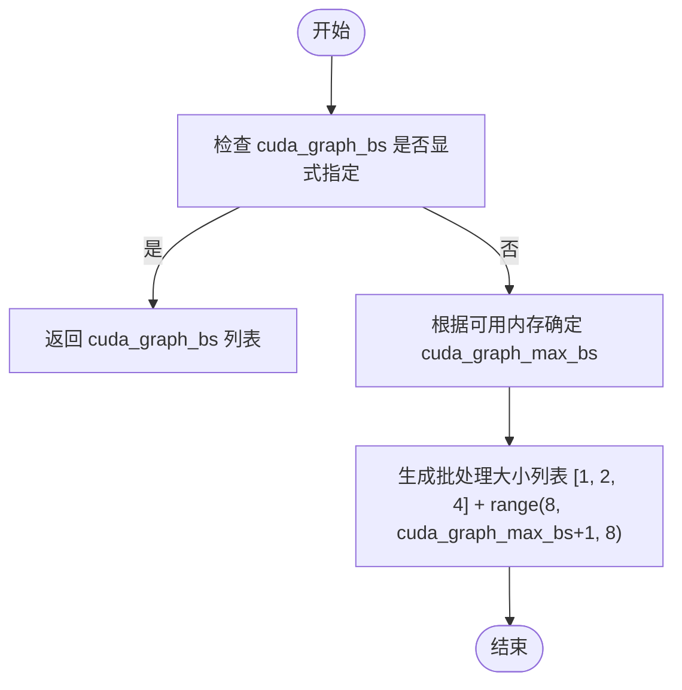
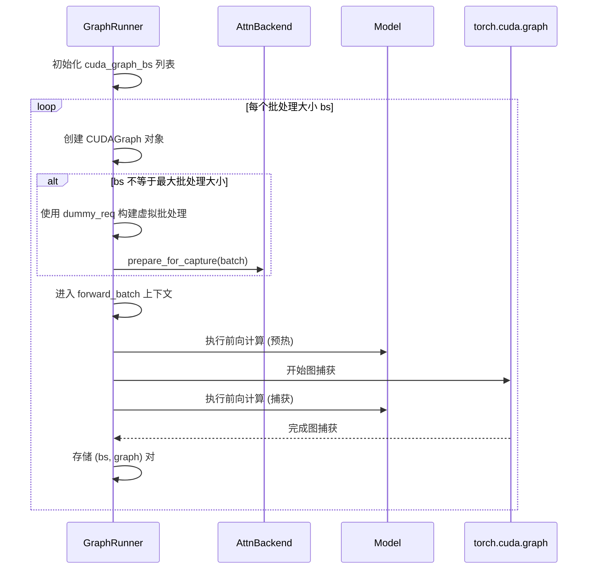
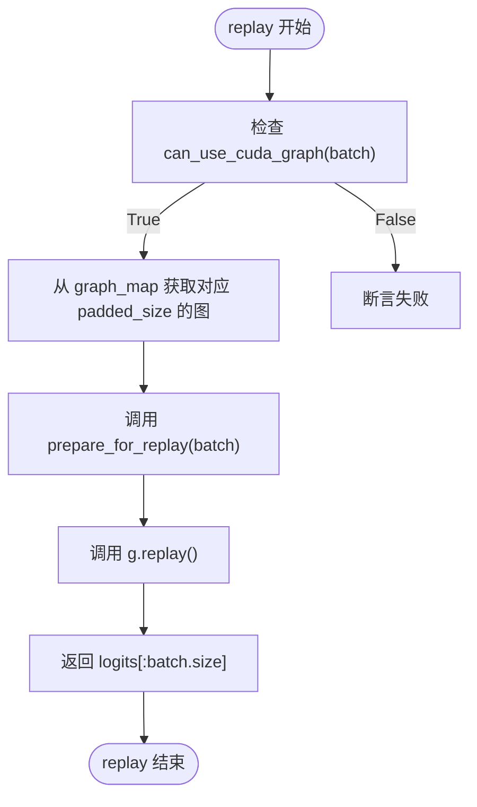

# CUDA图优化机制

<cite>
**本文档中引用的文件**   
- [graph.py](file://python/minisgl/engine/graph.py)
- [core.py](file://python/minisgl/core.py)
- [base.py](file://python/minisgl/models/base.py)
- [fa3.py](file://python/minisgl/attention/fa3.py)
- [fi.py](file://python/minisgl/attention/fi.py)
- [utils.py](file://python/minisgl/attention/utils.py)
- [engine.py](file://python/minisgl/engine/engine.py)
</cite>

## 目录
1. [引言](#引言)
2. [批处理大小的智能推断](#批处理大小的智能推断)
3. [CUDA图的捕获流程](#cudagraph的捕获流程)
4. [图的重放与填充机制](#图的重放与填充机制)
5. [CUDA图的启用条件](#cudagraph的启用条件)
6. [总结](#总结)

## 引言
`GraphRunner`类通过CUDA图技术显著优化了解码阶段的性能。CUDA图能够捕获一系列GPU操作并将其封装为一个可重放的图，从而消除内核启动开销，提升推理效率。本文档详细解析`GraphRunner`如何在初始化时根据配置确定要捕获的批处理大小列表，并通过`_determine_cuda_graph_bs`函数进行智能推断。同时，文档将深入探讨CUDA图的捕获流程、重放机制以及启用条件。

## 批处理大小的智能推断

`GraphRunner`在初始化时，通过`_determine_cuda_graph_bs`函数智能推断需要捕获的批处理大小列表。该函数根据`cuda_graph_bs`和`cuda_graph_max_bs`配置以及可用GPU内存来决定最终的批处理大小列表。

当`cuda_graph_bs`参数被显式指定时，函数直接返回该列表。否则，函数根据可用内存大小动态确定`cuda_graph_max_bs`的值：若可用内存大于80GB（如H200设备），则设置为256；否则设置为160。随后，函数生成一个包含1、2、4以及从8到`cuda_graph_max_bs`（步长为8）的批处理大小列表。



**Diagram sources**
- [graph.py](file://python/minisgl/engine/graph.py#L19-L37)

**Section sources**
- [graph.py](file://python/minisgl/engine/graph.py#L19-L37)

## CUDA图的捕获流程

CUDA图的捕获流程是`GraphRunner`性能优化的核心环节。该流程从使用`dummy_req`构建虚拟批处理开始，经过`prepare_for_capture`准备，最终在`torch.cuda.graph`上下文中执行前向计算。

在`GraphRunner`的初始化过程中，首先对最大批处理大小进行预热捕获并销毁，以确保后续捕获的稳定性。随后，对于每个需要捕获的批处理大小`bs`，创建一个`torch.cuda.CUDAGraph`对象。如果`bs`不等于最大批处理大小，则使用`dummy_req`构建相应大小的虚拟批处理，并调用`attn_backend.prepare_for_capture(batch)`进行准备工作。接着，在`get_global_ctx().forward_batch(batch)`上下文中，执行两次前向计算：第一次用于预热，第二次在`torch.cuda.graph`上下文中进行实际捕获。



**Diagram sources**
- [graph.py](file://python/minisgl/engine/graph.py#L91-L124)

**Section sources**
- [graph.py](file://python/minisgl/engine/graph.py#L91-L124)
- [fa3.py](file://python/minisgl/attention/fa3.py#L115-L130)
- [fi.py](file://python/minisgl/attention/fi.py#L244-L268)

## 图的重放与填充机制

`replay`方法是CUDA图优化的关键执行环节。当实际批处理满足使用CUDA图的条件时，`GraphRunner`通过`pad_batch`方法将实际批处理填充至预捕获的图大小，然后重放图以消除内核启动开销。

`pad_batch`方法首先检查批处理是否可以使用CUDA图。如果可以，则从`graph_bs_list`中选择第一个大于或等于实际批处理大小的预捕获大小作为填充目标。然后，通过在实际请求列表后添加`dummy_req`来构建填充后的请求列表。

`replay`方法首先断言批处理满足使用CUDA图的条件，然后从`graph_map`中获取对应填充大小的CUDA图对象。接着，调用`attn_backend.prepare_for_replay(batch)`为重放做准备，最后调用`g.replay()`重放CUDA图。重放完成后，返回相应大小的logits结果。



**Diagram sources**
- [graph.py](file://python/minisgl/engine/graph.py#L136-L141)
- [graph.py](file://python/minisgl/engine/graph.py#L148-L155)

**Section sources**
- [graph.py](file://python/minisgl/engine/graph.py#L136-L155)
- [fa3.py](file://python/minisgl/attention/fa3.py#L131-L141)
- [fi.py](file://python/minisgl/attention/fi.py#L269-L277)

## CUDA图的启用条件

CUDA图的启用由`can_use_cuda_graph`方法严格控制。该方法结合批处理阶段和大小两个条件进行判断。

首先，批处理必须处于解码阶段（`batch.is_decode`为True）。其次，批处理的实际大小必须小于或等于`GraphRunner`支持的最大图批处理大小（`batch.size <= self.max_graph_bs`）。只有当这两个条件同时满足时，CUDA图才会被启用。

```mermaid
graph TD
A[can_use_cuda_graph(batch)] --> B{batch.is_decode?}
B --> |否| C[返回 False]
B --> |是| D{batch.size <= max_graph_bs?}
D --> |否| E[返回 False]
D --> |是| F[返回 True]
```

**Diagram sources**
- [graph.py](file://python/minisgl/engine/graph.py#L133-L135)

**Section sources**
- [graph.py](file://python/minisgl/engine/graph.py#L133-L135)
- [core.py](file://python/minisgl/core.py#L84-L90)

## 总结
`GraphRunner`类通过CUDA图技术有效优化了解码阶段的性能。其核心机制包括：通过`_determine_cuda_graph_bs`函数智能推断批处理大小列表；在初始化时捕获不同大小的CUDA图；通过`pad_batch`和`replay`方法实现图的重放；以及通过`can_use_cuda_graph`方法严格控制CUDA图的启用条件。这一系列优化措施显著减少了内核启动开销，提升了推理效率。