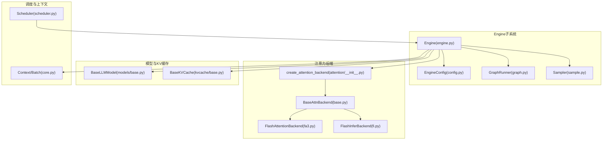
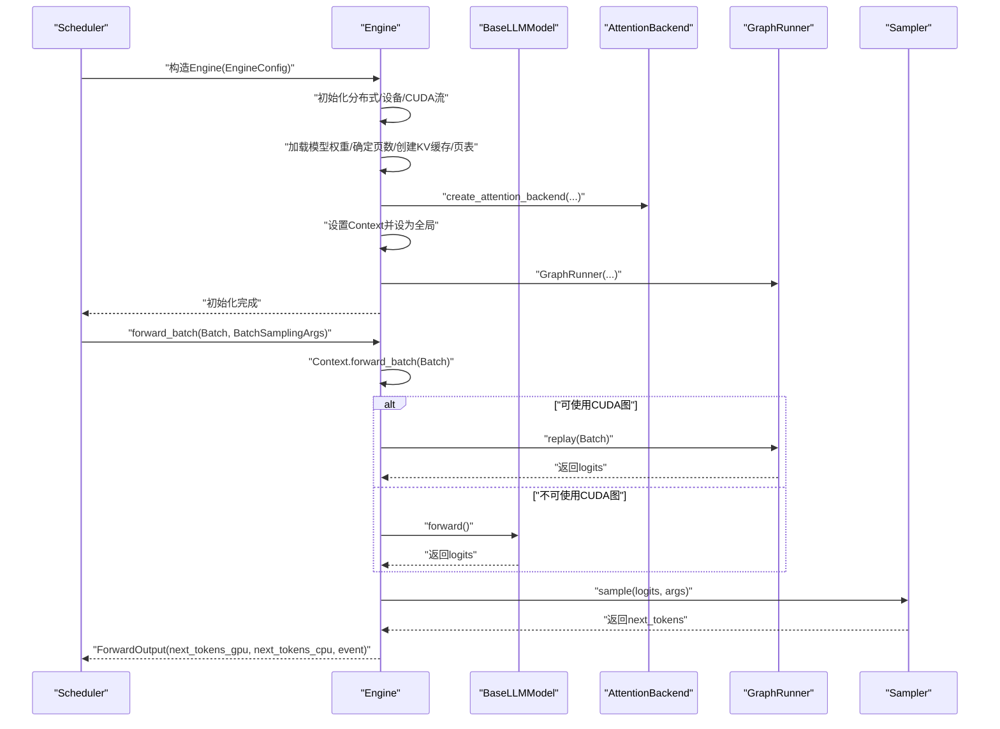
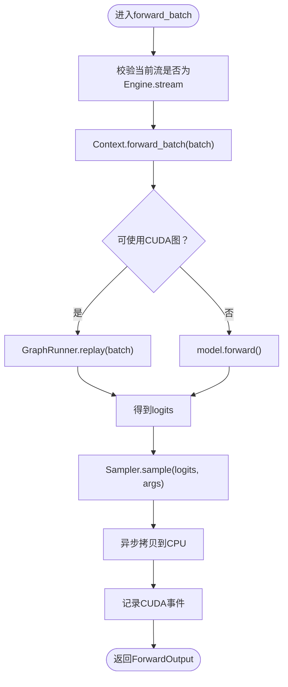
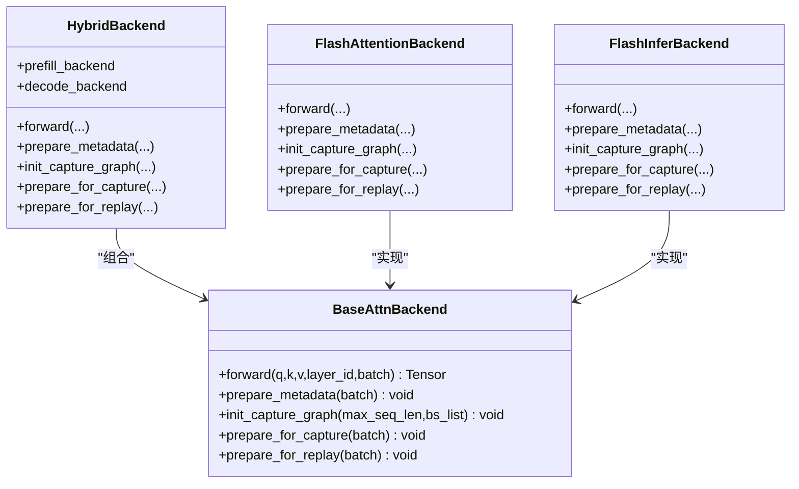
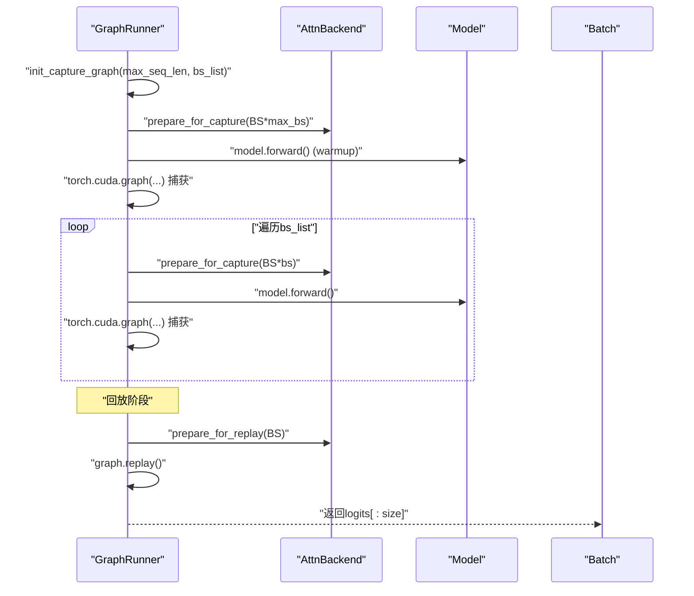
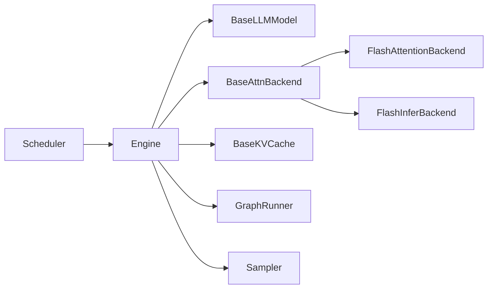

# Engine模块详解

<cite>
**本文引用的文件列表**
- [engine.py](file://python/minisgl/engine/engine.py)
- [config.py](file://python/minisgl/engine/config.py)
- [graph.py](file://python/minisgl/engine/graph.py)
- [base.py](file://python/minisgl/attention/base.py)
- [fa3.py](file://python/minisgl/attention/fa3.py)
- [fi.py](file://python/minisgl/attention/fi.py)
- [__init__.py](file://python/minisgl/attention/__init__.py)
- [base.py](file://python/minisgl/kvcache/base.py)
- [base.py](file://python/minisgl/models/base.py)
- [core.py](file://python/minisgl/core.py)
- [scheduler.py](file://python/minisgl/scheduler/scheduler.py)
- [sample.py](file://python/minisgl/engine/sample.py)
</cite>

## 目录
1. [简介](#简介)
2. [项目结构](#项目结构)
3. [核心组件](#核心组件)
4. [架构总览](#架构总览)
5. [详细组件分析](#详细组件分析)
6. [依赖关系分析](#依赖关系分析)
7. [性能考量](#性能考量)
8. [故障排查指南](#故障排查指南)
9. [结论](#结论)
10. [附录：调用示例与配置建议](#附录调用示例与配置建议)

## 简介
本文件系统性解析Engine类的职责与实现机制，重点覆盖以下方面：
- 模型权重加载与初始化流程
- KV缓存池的创建与页表管理
- 注意力后端的选择与配置（FlashAttention、FlashInfer及其混合模式）
- CUDA图捕获与回放以降低内核启动开销
- forward_batch方法在预填充与解码阶段的差异处理
- 基于config.py的可定制化选项与实际调用示例

## 项目结构
Engine模块位于python/minisgl/engine目录下，围绕Engine类组织了配置、注意力后端、CUDA图运行器、采样器等子系统；同时与调度器、模型、KV缓存、注意力实现等模块协同工作。

图表来源
- [engine.py](file://python/minisgl/engine/engine.py#L1-L217)
- [config.py](file://python/minisgl/engine/config.py#L1-L55)
- [graph.py](file://python/minisgl/engine/graph.py#L1-L156)
- [base.py](file://python/minisgl/attention/base.py#L1-L66)
- [fa3.py](file://python/minisgl/attention/fa3.py#L1-L211)
- [fi.py](file://python/minisgl/attention/fi.py#L1-L278)
- [__init__.py](file://python/minisgl/attention/__init__.py#L1-L60)
- [base.py](file://python/minisgl/kvcache/base.py#L1-L135)
- [base.py](file://python/minisgl/models/base.py#L1-L21)
- [core.py](file://python/minisgl/core.py#L1-L156)
- [scheduler.py](file://python/minisgl/scheduler/scheduler.py#L1-L285)

章节来源
- [engine.py](file://python/minisgl/engine/engine.py#L1-L217)
- [config.py](file://python/minisgl/engine/config.py#L1-L55)

## 核心组件
- Engine：引擎主控，负责模型加载、KV缓存初始化、注意力后端选择、CUDA图捕获与回放、采样与输出封装。
- GraphRunner：CUDA图捕获与回放器，按批大小集合捕获解码阶段的计算图，加速后续解码。
- Attention后端：支持自动选择、混合模式（prefill/decode不同后端）、FlashAttention3与FlashInfer两种实现。
- KVCache：抽象KV缓存接口，配合页表进行分页存储与检索。
- Sampler：采样器，根据温度等参数从logits中生成下一个token。
- Scheduler：调度器，负责请求调度、批构造、CUDA流协调与结果写回。

章节来源
- [engine.py](file://python/minisgl/engine/engine.py#L1-L217)
- [graph.py](file://python/minisgl/engine/graph.py#L1-L156)
- [base.py](file://python/minisgl/attention/base.py#L1-L66)
- [fa3.py](file://python/minisgl/attention/fa3.py#L1-L211)
- [fi.py](file://python/minisgl/attention/fi.py#L1-L278)
- [base.py](file://python/minisgl/kvcache/base.py#L1-L135)
- [sample.py](file://python/minisgl/engine/sample.py#L1-L43)
- [scheduler.py](file://python/minisgl/scheduler/scheduler.py#L1-L285)

## 架构总览
Engine在初始化时完成以下关键步骤：
- 设置设备、分布式通信组、CUDA流
- 在meta设备上创建模型结构，随后加载权重（可选虚拟权重）
- 计算可用页数并创建KV缓存池与页表
- 创建注意力后端（支持自动选择与混合模式）
- 初始化全局Context并设置为全局上下文
- 构建GraphRunner并捕获解码阶段的CUDA图
- 初始化采样器

图表来源
- [engine.py](file://python/minisgl/engine/engine.py#L196-L211)
- [graph.py](file://python/minisgl/engine/graph.py#L133-L142)
- [base.py](file://python/minisgl/models/base.py#L13-L21)
- [scheduler.py](file://python/minisgl/scheduler/scheduler.py#L218-L224)

## 详细组件分析

### Engine类职责与生命周期
- 设备与分布式：根据rank设置设备，初始化进程组（支持gloo/nccl），并可启用pynccl。
- 模型与权重：在meta设备上构建模型结构，随后加载HF权重或生成虚拟权重；按dtype转换。
- KV缓存与页表：依据可用显存估算页数，创建KV缓存池与页表；对最大序列长度做对齐。
- 注意力后端：通过工厂函数创建后端实例，支持“auto”自动选择与“prefill,decode”混合模式。
- 全局上下文：创建Context并设为全局，供注意力后端与模型访问当前批信息。
- CUDA图：构造GraphRunner并捕获解码阶段的计算图，按批大小集合进行预热与捕获。
- 采样：构建Sampler，按温度等参数生成下一个token。
- 关闭：销毁CUDA图、进程组与分布式资源。

章节来源
- [engine.py](file://python/minisgl/engine/engine.py#L36-L113)
- [engine.py](file://python/minisgl/engine/engine.py#L114-L141)
- [engine.py](file://python/minisgl/engine/engine.py#L142-L174)
- [engine.py](file://python/minisgl/engine/engine.py#L175-L195)
- [engine.py](file://python/minisgl/engine/engine.py#L196-L211)
- [engine.py](file://python/minisgl/engine/engine.py#L213-L217)

### forward_batch执行流程与预填充/解码差异
- 批上下文：进入Context.forward_batch，确保注意力后端与KV缓存能读取当前批。
- CUDA图判定：若满足条件（解码阶段且批大小不超过最大图大小），则走GraphRunner.replay；否则直接调用模型forward。
- 采样：对logits进行采样，得到GPU与CPU上的下一个token，并记录CUDA事件用于异步拷贝完成通知。
- 请求推进：对每个请求更新已缓存长度与设备长度。

图表来源
- [engine.py](file://python/minisgl/engine/engine.py#L196-L211)
- [graph.py](file://python/minisgl/engine/graph.py#L133-L142)
- [sample.py](file://python/minisgl/engine/sample.py#L12-L43)

章节来源
- [engine.py](file://python/minisgl/engine/engine.py#L196-L211)
- [sample.py](file://python/minisgl/engine/sample.py#L12-L43)

### KV缓存池与页表管理
- KV缓存接口：定义k/v缓存访问、存储、设备与dtype属性等抽象。
- 页表：二维整型张量，每行对应一个请求的页索引序列；对齐至32字节边界以提升内存对齐。
- 页数估算：基于模型占用显存与可用显存比值，计算可分配的页数，确保K+V两份缓存。

章节来源
- [base.py](file://python/minisgl/kvcache/base.py#L1-L135)
- [engine.py](file://python/minisgl/engine/engine.py#L28-L34)
- [engine.py](file://python/minisgl/engine/engine.py#L52-L71)
- [engine.py](file://python/minisgl/engine/engine.py#L154-L173)

### 注意力后端选择与实现
- 自动选择策略：根据GPU架构（SM90/SM100）自动选择后端；支持prefill与decode混合模式。
- 后端接口：统一的BaseAttnBackend接口，包含forward、prepare_metadata、init_capture_graph、prepare_for_capture、prepare_for_replay等。
- FlashAttention3实现：维护cu_seqlens/cacheseqlens/positions/page_table等元数据，支持CUDA图捕获与重放。
- FlashInfer实现：使用flashinfer的预填充与解码包装器，支持CUDA图捕获与重放，具备张量核心使用策略。

图表来源
- [base.py](file://python/minisgl/attention/base.py#L20-L66)
- [fa3.py](file://python/minisgl/attention/fa3.py#L39-L142)
- [fi.py](file://python/minisgl/attention/fi.py#L86-L278)
- [__init__.py](file://python/minisgl/attention/__init__.py#L17-L58)

章节来源
- [__init__.py](file://python/minisgl/attention/__init__.py#L17-L58)
- [base.py](file://python/minisgl/attention/base.py#L20-L66)
- [fa3.py](file://python/minisgl/attention/fa3.py#L39-L142)
- [fi.py](file://python/minisgl/attention/fi.py#L86-L278)

### CUDA图捕获与回放机制
- 图捕获时机：在GraphRunner初始化时，按指定批大小集合进行捕获；先用最大批大小预热，再逐个捕获较小批大小。
- 回放策略：当批为解码阶段且大小不超过max_graph_bs时，使用对应批大小的图进行replay；prepare_for_replay会将当前批的输入位置与索引复制到capture缓冲区。
- 批填充：若当前批大小不在图集合中，则通过pad_batch填充到最近的可用批大小，使用dummy请求占位。

图表来源
- [graph.py](file://python/minisgl/engine/graph.py#L48-L156)
- [fa3.py](file://python/minisgl/attention/fa3.py#L107-L142)
- [fi.py](file://python/minisgl/attention/fi.py#L227-L278)

章节来源
- [graph.py](file://python/minisgl/engine/graph.py#L48-L156)

### 采样与输出封装
- BatchSamplingArgs：封装温度等采样参数，按需在设备侧准备。
- Sampler：根据温度进行softmax与multinomial采样；无温度时直接argmax。
- ForwardOutput：封装GPU与CPU上的下一个token，以及CUDA事件，便于异步拷贝完成检测。

章节来源
- [sample.py](file://python/minisgl/engine/sample.py#L12-L43)
- [engine.py](file://python/minisgl/engine/engine.py#L22-L26)

## 依赖关系分析
- Engine依赖：模型抽象、注意力后端工厂、KV缓存、分布式通信、CUDA图运行器、采样器。
- 注意力后端：BaseAttnBackend为统一接口，具体实现由工厂函数按配置选择。
- 调度器：通过Engine.stream与自身流进行协调，避免阻塞；在forward前准备out_loc与索引，forward后写回token。

图表来源
- [engine.py](file://python/minisgl/engine/engine.py#L1-L217)
- [scheduler.py](file://python/minisgl/scheduler/scheduler.py#L180-L224)
- [base.py](file://python/minisgl/attention/base.py#L20-L66)
- [fa3.py](file://python/minisgl/attention/fa3.py#L39-L142)
- [fi.py](file://python/minisgl/attention/fi.py#L86-L278)

章节来源
- [engine.py](file://python/minisgl/engine/engine.py#L1-L217)
- [scheduler.py](file://python/minisgl/scheduler/scheduler.py#L180-L224)

## 性能考量
- 显存平衡：初始化前后同步显存并跨TP rank求最小/最大空闲显存，若差异过大则报错，避免跨卡显存倾斜导致性能下降。
- 页数估算：按head_dim、层数、头数、页大小与dtype估算每页缓存大小，结合memory_ratio与模型占用推导可用页数。
- CUDA图：仅在解码阶段启用，按批大小集合捕获，显著降低内核启动开销；对小批大小采用更细粒度的批步长。
- 流与重叠：调度器使用独立CUDA流与Engine.stream进行等待，实现CPU与GPU的重叠处理，提高吞吐。

章节来源
- [engine.py](file://python/minisgl/engine/engine.py#L175-L195)
- [engine.py](file://python/minisgl/engine/engine.py#L154-L173)
- [graph.py](file://python/minisgl/engine/graph.py#L19-L38)
- [scheduler.py](file://python/minisgl/scheduler/scheduler.py#L231-L255)

## 故障排查指南
- 显存不平衡：若跨rank显存差异超过阈值，会触发错误并终止，提示检查分布式配置与显存使用情况。
- 页数不足：若估算页数过少，会提示调整参数或减少序列长度。
- CUDA图禁用：当未配置或显存不足时，GraphRunner会禁用CUDA图，此时forward将直接调用模型forward。
- 注意力后端不支持：当backend字符串非法或硬件不支持时，工厂函数会抛出异常。

章节来源
- [engine.py](file://python/minisgl/engine/engine.py#L175-L195)
- [engine.py](file://python/minisgl/engine/engine.py#L154-L173)
- [graph.py](file://python/minisgl/engine/graph.py#L67-L71)
- [__init__.py](file://python/minisgl/attention/__init__.py#L46-L58)

## 结论
Engine通过模块化的注意力后端、可插拔的KV缓存与完善的CUDA图机制，在保证灵活性的同时显著提升了推理性能。其初始化流程严谨地评估显存与页数，forward_batch在预填充与解码阶段采用差异化路径，并通过GraphRunner与采样器实现高效的token生成与异步处理。结合EngineConfig提供的丰富配置项，用户可在不同硬件与部署环境下获得最佳的吞吐与延迟表现。

## 附录：调用示例与配置建议
- 初始化Engine：传入EngineConfig，内部完成模型加载、KV缓存与注意力后端初始化、CUDA图捕获等。
- 调度器集成：Scheduler在构造时创建Engine，并在每次循环中准备批、加载token、调用Engine.forward_batch、写回结果。
- 配置要点（来自EngineConfig）：
  - attention_backend：可选"auto"、"fa3"、"fi"或"prefill,decode"混合模式
  - cuda_graph_bs / cuda_graph_max_bs：控制CUDA图捕获的批大小集合
  - page_size / memory_ratio：影响页数估算与显存占用
  - use_dummy_weight：调试时可快速加载随机权重
  - distributed_*：分布式初始化参数
- 实际调用示例（路径参考）：
  - Engine初始化与forward_batch调用：[engine.py](file://python/minisgl/engine/engine.py#L36-L113), [engine.py](file://python/minisgl/engine/engine.py#L196-L211)
  - 调度器与Engine交互：[scheduler.py](file://python/minisgl/scheduler/scheduler.py#L80-L110), [scheduler.py](file://python/minisgl/scheduler/scheduler.py#L180-L224)

章节来源
- [config.py](file://python/minisgl/engine/config.py#L15-L55)
- [engine.py](file://python/minisgl/engine/engine.py#L36-L113)
- [engine.py](file://python/minisgl/engine/engine.py#L196-L211)
- [scheduler.py](file://python/minisgl/scheduler/scheduler.py#L80-L110)
- [scheduler.py](file://python/minisgl/scheduler/scheduler.py#L180-L224)