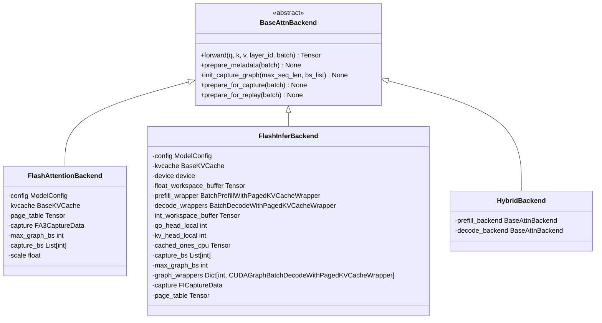
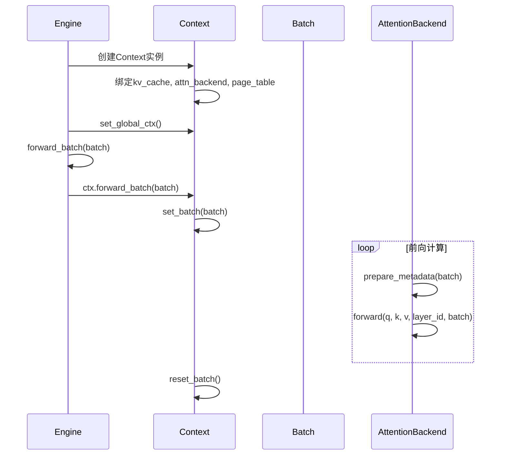

# KV缓存与注意力后端集成

<cite>
**本文档引用的文件**
- [engine.py](file://python/minisgl/engine/engine.py)
- [mha_pool.py](file://python/minisgl/kvcache/mha_pool.py)
- [fa3.py](file://python/minisgl/attention/fa3.py)
- [fi.py](file://python/minisgl/attention/fi.py)
- [base.py](file://python/minisgl/kvcache/base.py)
- [__init__.py](file://python/minisgl/kvcache/__init__.py)
- [core.py](file://python/minisgl/core.py)
- [table.py](file://python/minisgl/scheduler/table.py)
</cite>

## 目录
1. [引言](#引言)
2. [KV缓存池初始化](#kv缓存池初始化)
3. [注意力后端创建](#注意力后端创建)
4. [上下文对象集成](#上下文对象集成)
5. [页表管理机制](#页表管理机制)
6. [内存管理与虚拟页](#内存管理与虚拟页)

## 引言
本文档深入解析mini-sglang框架中KV缓存池、注意力后端及上下文对象的集成机制。重点阐述`create_kvcache`函数如何根据模型配置和可用内存创建`MHAKVCache`实例，`create_attention_backend`工厂函数如何根据配置选择并实例化`FlashAttentionBackend`或`FlashInferBackend`，以及`Context`对象如何将KV缓存、注意力后端和页表进行绑定，为前向计算提供统一上下文。

## KV缓存池初始化

`create_kvcache`函数是KV缓存池的创建入口，它根据模型配置参数和硬件资源创建`MHAKVCache`实例。该函数位于`kvcache/__init__.py`中，通过匹配`KVCacheType.MHA`类型来实例化`MHAKVCache`类。

`MHAKVCache`的初始化过程根据`KVCacheLayout`（默认为`LayerFirst`）分配内存缓冲区，其内存布局为(2, num_layers, num_pages, local_kv_heads, head_dim)，其中2代表Key和Value两个张量。该类通过`_k_buffer`和`_v_buffer`字段管理KV缓存，并提供`k_cache()`和`v_cache()`方法按层索引访问缓存。

**章节来源**
- [mha_pool.py](file://python/minisgl/kvcache/mha_pool.py#L10-L80)
- [__init__.py](file://python/minisgl/kvcache/__init__.py#L18-L41)
- [base.py](file://python/minisgl/kvcache/base.py#L11-L38)

## 注意力后端创建

`create_attention_backend`工厂函数根据`attention_backend`配置（auto, fa3, fi）选择并实例化相应的注意力后端。该函数位于`attention/__init__.py`中，实现了自动后端选择逻辑。

当配置为"auto"时，系统根据GPU架构自动选择后端：Blackwell架构使用"fi"，Hopper架构使用"fa3,fi"混合后端，其他架构使用"fi"。对于包含逗号的配置，系统创建`HybridBackend`实例，为prefill和decode阶段分别使用不同的后端。

`FlashAttentionBackend`和`FlashInferBackend`都继承自`BaseAttnBackend`抽象基类，实现了`forward`、`prepare_metadata`等核心方法。前者使用自定义的`_fa3_sgl_impl`内核进行计算，后者则封装了FlashInfer库的`BatchPrefillWithPagedKVCacheWrapper`和`BatchDecodeWithPagedKVCacheWrapper`。



**图表来源**
- [fa3.py](file://python/minisgl/attention/fa3.py#L39-L211)
- [fi.py](file://python/minisgl/attention/fi.py#L86-L278)
- [__init__.py](file://python/minisgl/attention/__init__.py#L26-L59)
- [base.py](file://python/minisgl/attention/base.py#L20-L52)

**章节来源**
- [fa3.py](file://python/minisgl/attention/fa3.py#L39-L211)
- [fi.py](file://python/minisgl/attention/fi.py#L86-L278)
- [__init__.py](file://python/minisgl/attention/__init__.py#L17-L59)

## 上下文对象集成

`Context`对象是KV缓存、注意力后端和页表的集成中心，为前向计算提供统一的执行上下文。该对象在`core.py`中定义，通过`set_global_ctx()`函数设置为全局上下文。

`Context`对象通过`forward_batch`上下文管理器确保在批处理执行期间正确设置和清理上下文状态。它维护对`kv_cache`、`attn_backend`和`page_table`的引用，并提供`batch`属性访问当前处理的批处理对象。在`Engine`初始化过程中，`Context`被创建并绑定到全局上下文，使得注意力后端和缓存管理组件能够协同工作。



**图表来源**
- [core.py](file://python/minisgl/core.py#L101-L143)
- [engine.py](file://python/minisgl/engine/engine.py#L78-L84)

**章节来源**
- [core.py](file://python/minisgl/core.py#L101-L143)
- [engine.py](file://python/minisgl/engine/engine.py#L78-L84)

## 页表管理机制

页表（page_table）是连接逻辑序列位置和物理缓存页面的关键数据结构。在`Engine`初始化过程中，`create_page_table`函数创建形状为`(config.max_running_req + 1, self.max_seq_len)`的页表张量，其中`max_seq_len`通过`_align_up_32`函数对齐到32的倍数以满足内存对齐要求。

`TableManager`类负责管理请求槽位的分配和释放，维护`_free_slots`列表跟踪可用槽位。每个请求通过`table_idx`索引页表的对应行，该行存储了序列中每个位置对应的物理页面索引。在调度过程中，`scheduler`组件通过`_prepare_batch`方法将分配的物理位置写入页表，供注意力后端在计算时使用。

```mermaid
flowchart TD
Start([Engine初始化]) --> DetermineNumPages["确定页面数量"]
DetermineNumPages --> CreateKVCache["创建KV缓存"]
CreateKVCache --> AlignMaxSeqLen["对齐max_seq_len"]
AlignMaxSeqLen --> CreatePageTable["创建页表"]
CreatePageTable --> CreateContext["创建Context"]
CreateContext --> End([初始化完成])
subgraph 页表创建逻辑
AlignMaxSeqLen --> |min(config.max_seq_len, num_pages)| Align["_align_up_32()"]
Align --> |对齐到32的倍数| MaxSeqLen["self.max_seq_len"]
end
```

**图表来源**
- [engine.py](file://python/minisgl/engine/engine.py#L28-L33)
- [table.py](file://python/minisgl/scheduler/table.py#L4-L20)

**章节来源**
- [engine.py](file://python/minisgl/engine/engine.py#L67-L71)
- [table.py](file://python/minisgl/scheduler/table.py#L4-L20)

## 内存管理与虚拟页

系统通过`dummy_page`机制实现高效的内存管理。在`Engine`初始化过程中，`_determine_num_pages`方法计算可用内存并确定页面数量，然后`num_pages + 1`（额外的+1用于虚拟页）作为KV缓存的总页面数。

`dummy_page`被设置为最后一个页面索引，用于处理填充和虚拟请求。在CUDA图捕获过程中，`dummy_req`使用`dummy_page`进行填充，确保内存访问的连续性。`TableManager`也预留了额外的槽位（`max_running_req + 1`）用于虚拟请求，这种设计避免了边界检查，提高了内存访问效率。

`CacheManager`负责整体内存管理，通过`allocate()`方法分配物理页面，并在请求完成时通过`free_and_cache_finished_req()`方法回收页面。系统通过`_free_slots`张量跟踪空闲页面，结合缓存管理器的驱逐机制，实现了高效的内存复用。

**章节来源**
- [engine.py](file://python/minisgl/engine/engine.py#L57-L61)
- [table.py](file://python/minisgl/scheduler/table.py#L5-L8)
- [cache.py](file://python/minisgl/scheduler/cache.py#L15-L23)