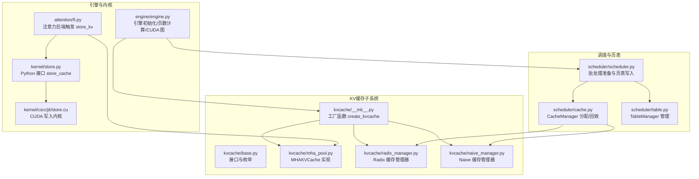
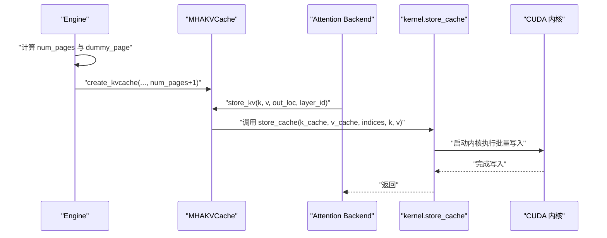
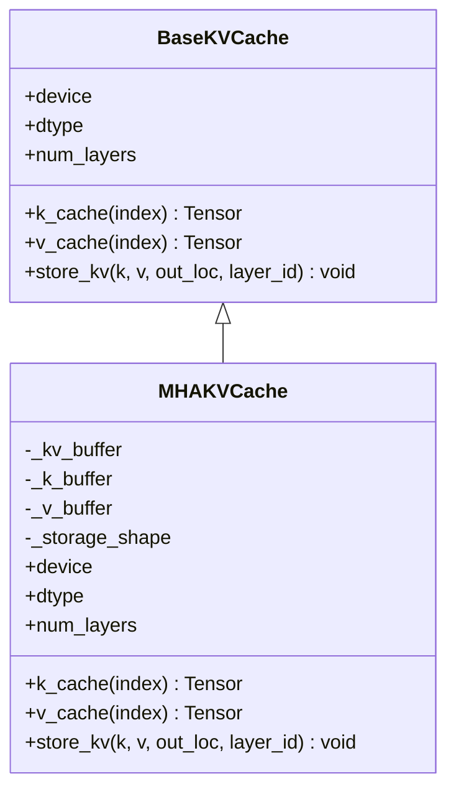
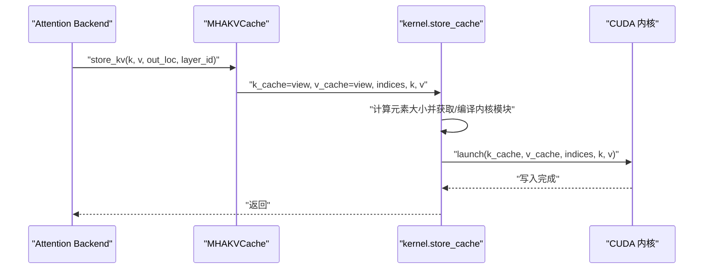
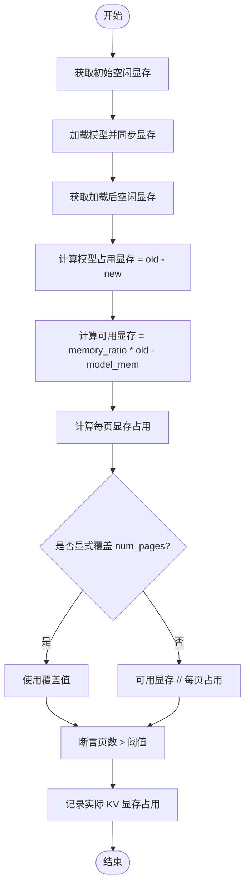
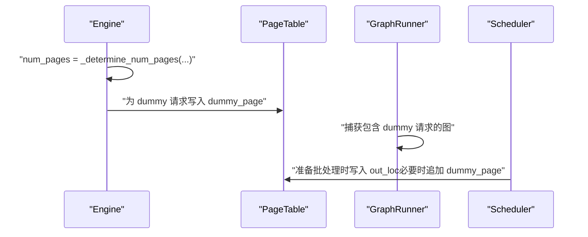
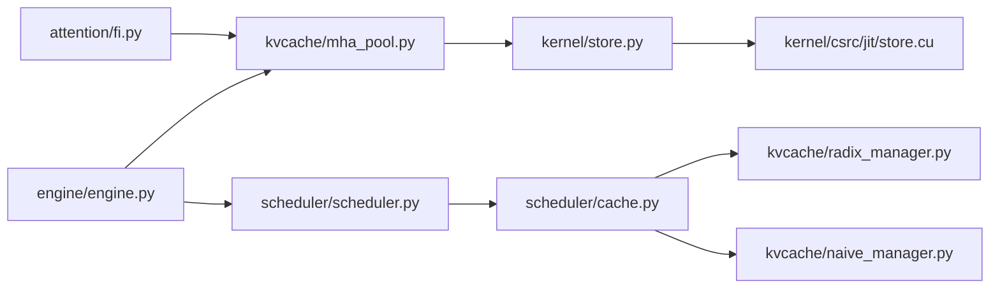

# KV缓存池管理

<cite>
**本文引用的文件列表**
- [python/minisgl/kvcache/__init__.py](file://python/minisgl/kvcache/__init__.py)
- [python/minisgl/kvcache/base.py](file://python/minisgl/kvcache/base.py)
- [python/minisgl/kvcache/mha_pool.py](file://python/minisgl/kvcache/mha_pool.py)
- [python/minisgl/kvcache/naive_manager.py](file://python/minisgl/kvcache/naive_manager.py)
- [python/minisgl/kvcache/radix_manager.py](file://python/minisgl/kvcache/radix_manager.py)
- [python/minisgl/scheduler/cache.py](file://python/minisgl/scheduler/cache.py)
- [python/minisgl/scheduler/scheduler.py](file://python/minisgl/scheduler/scheduler.py)
- [python/minisgl/scheduler/table.py](file://python/minisgl/scheduler/table.py)
- [python/minisgl/engine/engine.py](file://python/minisgl/engine/engine.py)
- [python/minisgl/engine/graph.py](file://python/minisgl/engine/graph.py)
- [python/minisgl/attention/fi.py](file://python/minisgl/attention/fi.py)
- [python/minisgl/kernel/store.py](file://python/minisgl/kernel/store.py)
- [python/minisgl/kernel/csrc/jit/store.cu](file://python/minisgl/kernel/csrc/jit/store.cu)
- [python/minisgl/utils/misc.py](file://python/minisgl/utils/misc.py)
</cite>

## 目录
1. [引言](#引言)
2. [项目结构](#项目结构)
3. [核心组件](#核心组件)
4. [架构总览](#架构总览)
5. [详细组件分析](#详细组件分析)
6. [依赖关系分析](#依赖关系分析)
7. [性能考量](#性能考量)
8. [故障排查指南](#故障排查指南)
9. [结论](#结论)

## 引言
本文件围绕KV缓存池的创建与管理机制展开，重点解释以下内容：
- 工厂函数 create_kvcache 如何依据模型配置（层数、头数、维度）与硬件资源（GPU显存）创建 MHAKVCache 实例；
- MHAKVCache 的内部存储结构（分层布局 LayerFirst），键值缓冲区 _k_buffer/_v_buffer 的组织方式；
- store_kv 方法如何调用 kernel.store_cache 内核，将计算得到的键值张量写入指定位置；
- num_pages 参数的计算逻辑（_determine_num_pages），该逻辑基于模型加载前后 GPU 空闲内存的测量，并考虑用户指定的 memory_ratio；
- dummy_page 在内存管理中的特殊作用：作为 CUDA 图捕获时的占位符，确保内存访问稳定。

## 项目结构
KV 缓存相关代码主要分布在以下模块：
- kvcache 子系统：定义接口、工厂函数、具体实现（MHAKVCache）、缓存管理器（Radix/Naive）
- scheduler 子系统：调度与页表管理，负责分配/回收页索引并维护缓存完整性
- engine 子系统：引擎初始化、显存预算与页数计算、CUDA 图捕获与 dummy_page 使用
- kernel 子系统：高性能写入内核 store_cache 及其 CUDA 实现
- attention 子系统：注意力后端在前向中触发 KV 写入

图表来源
- [python/minisgl/kvcache/__init__.py](file://python/minisgl/kvcache/__init__.py#L18-L42)
- [python/minisgl/kvcache/mha_pool.py](file://python/minisgl/kvcache/mha_pool.py#L10-L80)
- [python/minisgl/scheduler/cache.py](file://python/minisgl/scheduler/cache.py#L12-L72)
- [python/minisgl/scheduler/scheduler.py](file://python/minisgl/scheduler/scheduler.py#L180-L209)
- [python/minisgl/engine/engine.py](file://python/minisgl/engine/engine.py#L30-L112)
- [python/minisgl/attention/fi.py](file://python/minisgl/attention/fi.py#L181-L190)
- [python/minisgl/kernel/store.py](file://python/minisgl/kernel/store.py#L30-L43)
- [python/minisgl/kernel/csrc/jit/store.cu](file://python/minisgl/kernel/csrc/jit/store.cu#L1-L71)

章节来源
- [python/minisgl/kvcache/__init__.py](file://python/minisgl/kvcache/__init__.py#L18-L42)
- [python/minisgl/kvcache/mha_pool.py](file://python/minisgl/kvcache/mha_pool.py#L10-L80)
- [python/minisgl/scheduler/cache.py](file://python/minisgl/scheduler/cache.py#L12-L72)
- [python/minisgl/engine/engine.py](file://python/minisgl/engine/engine.py#L30-L112)
- [python/minisgl/attention/fi.py](file://python/minisgl/attention/fi.py#L181-L190)
- [python/minisgl/kernel/store.py](file://python/minisgl/kernel/store.py#L30-L43)

## 核心组件
- 工厂函数 create_kvcache：根据 cache_type 创建对应 KV 缓存实例；当前支持 MHA 类型，返回 MHAKVCache。
- MHAKVCache：实现 BaseKVCache 接口，提供 k_cache/v_cache 访问与 store_kv 写入；内部以分层布局组织键值缓冲区。
- KVCacheLayout：支持 LayerFirst 与 PageFirst 两种布局；LayerFirst 更贴合注意力后端按层访问的模式。
- KVCacheType：当前仅支持 MHA。
- 缓存管理器：Radix 与 Naive 两类，负责前缀匹配、锁定/解锁、插入与驱逐等操作。
- 调度与页表：CacheManager 负责从空闲页槽中分配/回收页索引；Scheduler 在批处理准备阶段写入 page_table。
- 引擎初始化：计算 num_pages 并预留 dummy_page；为 CUDA 图捕获准备 dummy 请求。
- 写入内核：kernel.store_cache 将 k/v 按索引批量写入 KV 缓存，底层由 CUDA 内核实现。

章节来源
- [python/minisgl/kvcache/base.py](file://python/minisgl/kvcache/base.py#L11-L63)
- [python/minisgl/kvcache/__init__.py](file://python/minisgl/kvcache/__init__.py#L18-L42)
- [python/minisgl/kvcache/mha_pool.py](file://python/minisgl/kvcache/mha_pool.py#L10-L80)
- [python/minisgl/kvcache/radix_manager.py](file://python/minisgl/kvcache/radix_manager.py#L82-L126)
- [python/minisgl/kvcache/naive_manager.py](file://python/minisgl/kvcache/naive_manager.py#L10-L45)
- [python/minisgl/scheduler/cache.py](file://python/minisgl/scheduler/cache.py#L12-L72)
- [python/minisgl/engine/engine.py](file://python/minisgl/engine/engine.py#L30-L112)
- [python/minisgl/kernel/store.py](file://python/minisgl/kernel/store.py#L30-L43)

## 架构总览
KV 缓存池贯穿“引擎初始化—调度分配—注意力写入—内核执行”的完整链路。引擎在初始化时估算可用显存并确定页数，随后创建 KV 缓存与页表；调度器在每轮前向准备阶段分配页索引并写入页表；注意力后端在前向过程中调用 KV 缓存的 store_kv，最终通过 kernel.store_cache 执行高效写入。

图表来源
- [python/minisgl/engine/engine.py](file://python/minisgl/engine/engine.py#L52-L112)
- [python/minisgl/kvcache/__init__.py](file://python/minisgl/kvcache/__init__.py#L18-L42)
- [python/minisgl/kvcache/mha_pool.py](file://python/minisgl/kvcache/mha_pool.py#L56-L68)
- [python/minisgl/attention/fi.py](file://python/minisgl/attention/fi.py#L181-L190)
- [python/minisgl/kernel/store.py](file://python/minisgl/kernel/store.py#L30-L43)
- [python/minisgl/kernel/csrc/jit/store.cu](file://python/minisgl/kernel/csrc/jit/store.cu#L1-L71)

## 详细组件分析

### 工厂函数 create_kvcache 与 MHAKVCache
- create_kvcache 根据 KVCacheType 创建实例；当前分支仅支持 MHA，构造 MHAKVCache 并传入 num_layers、num_kv_heads、head_dim、num_pages、dtype、device、kv_layout。
- MHAKVCache 在构造时：
  - 读取张量并行信息，按 tp_size 均分 KV 头；
  - 根据 kv_layout 选择布局：PageFirst 或 LayerFirst；
  - 构造形状为 (2, num_layers, num_pages, local_kv_heads, head_dim) 的缓冲区，并视图化为 (2, num_layers, num_pages, 1, local_kv_heads, head_dim) 以便后续按层切片；
  - 提供 k_cache/v_cache 访问器与 store_kv 写入接口。

图表来源
- [python/minisgl/kvcache/base.py](file://python/minisgl/kvcache/base.py#L11-L40)
- [python/minisgl/kvcache/mha_pool.py](file://python/minisgl/kvcache/mha_pool.py#L10-L80)

章节来源
- [python/minisgl/kvcache/__init__.py](file://python/minisgl/kvcache/__init__.py#L18-L42)
- [python/minisgl/kvcache/mha_pool.py](file://python/minisgl/kvcache/mha_pool.py#L16-L80)

### KV 缓存布局与存储结构
- KV 缓存采用分层布局（LayerFirst）时，内部张量形状为 (2, num_layers, num_pages, local_kv_heads, head_dim)，其中：
  - 第一维 2 表示键/值两个通道；
  - 第二维为层数；
  - 第三维为页数；
  - 第四维为本地 KV 头数；
  - 第五维为每个头的维度。
- k_cache/v_cache 通过切片访问第 layer_id 层的数据，形成 (num_pages, local_kv_heads, head_dim) 的视图，便于按页写入。

章节来源
- [python/minisgl/kvcache/mha_pool.py](file://python/minisgl/kvcache/mha_pool.py#L26-L49)

### store_kv 写入流程与 kernel.store_cache
- MHAKVCache.store_kv 将第 layer_id 层的 k/v 缓冲区视图与 out_loc（页索引）传递给 kernel.store_cache；
- kernel.store_cache：
  - 将 k_cache/v_cache 展平为二维张量；
  - 计算元素大小并按元素大小进行 JIT 编译/复用对应的 CUDA 内核模块；
  - 调用模块执行批量写入；
- CUDA 内核：
  - 每个线程块处理一个元素；
  - 使用 warp 粒度的向量化加载/存储，按索引将 k/v 写入对应页位置；
  - 支持可选的流序列化属性以提升稳定性。

图表来源
- [python/minisgl/kvcache/mha_pool.py](file://python/minisgl/kvcache/mha_pool.py#L56-L68)
- [python/minisgl/kernel/store.py](file://python/minisgl/kernel/store.py#L30-L43)
- [python/minisgl/kernel/csrc/jit/store.cu](file://python/minisgl/kernel/csrc/jit/store.cu#L1-L71)

章节来源
- [python/minisgl/kvcache/mha_pool.py](file://python/minisgl/kvcache/mha_pool.py#L56-L68)
- [python/minisgl/kernel/store.py](file://python/minisgl/kernel/store.py#L30-L43)
- [python/minisgl/kernel/csrc/jit/store.cu](file://python/minisgl/kernel/csrc/jit/store.cu#L1-L71)

### num_pages 计算逻辑（_determine_num_pages）
- 引擎在加载模型前后分别测量 GPU 空闲内存，计算模型占用显存；
- 可用显存 = memory_ratio × 初始空闲显存 − 模型占用显存；
- 每页显存占用 = 2 × head_dim × local_kv_heads × page_size × dtype.itemsize × num_layers；
- 若未显式覆盖 num_pages，则按可用显存除以每页占用得到页数；
- 最终记录实际 KV 显存占用并断言页数大于阈值。

图表来源
- [python/minisgl/engine/engine.py](file://python/minisgl/engine/engine.py#L154-L173)

章节来源
- [python/minisgl/engine/engine.py](file://python/minisgl/engine/engine.py#L154-L173)

### dummy_page 的作用与 CUDA 图捕获
- 引擎在初始化时为 KV 缓存多申请一页 dummy_page，并在 page_table 中为 dummy 请求填充该页索引；
- 在 CUDA 图捕获阶段，使用 dummy 请求填充到最大图批次，确保图捕获时的内存布局稳定；
- 调度器在准备批处理时，若需填充批次，也会将 dummy_page 写入 out_loc 的末尾，保证索引长度与图批次一致。

图表来源
- [python/minisgl/engine/engine.py](file://python/minisgl/engine/engine.py#L52-L112)
- [python/minisgl/engine/graph.py](file://python/minisgl/engine/graph.py#L83-L155)
- [python/minisgl/scheduler/scheduler.py](file://python/minisgl/scheduler/scheduler.py#L180-L209)

章节来源
- [python/minisgl/engine/engine.py](file://python/minisgl/engine/engine.py#L52-L112)
- [python/minisgl/engine/graph.py](file://python/minisgl/engine/graph.py#L83-L155)
- [python/minisgl/scheduler/scheduler.py](file://python/minisgl/scheduler/scheduler.py#L180-L209)

### 缓存管理器与页表分配
- CacheManager 维护空闲页槽，按需通过缓存管理器 evict 释放空间；
- Scheduler 在每轮前向准备阶段分配 out_loc，并将页索引写入 page_table；
- TableManager 管理请求与页表之间的映射。

章节来源
- [python/minisgl/scheduler/cache.py](file://python/minisgl/scheduler/cache.py#L12-L72)
- [python/minisgl/scheduler/table.py](file://python/minisgl/scheduler/table.py#L1-L19)
- [python/minisgl/scheduler/scheduler.py](file://python/minisgl/scheduler/scheduler.py#L180-L209)

## 依赖关系分析
- KV 缓存接口与实现解耦：BaseKVCache 定义统一接口，MHAKVCache 提供具体实现；
- 引擎依赖 KV 缓存工厂函数创建实例，并在初始化阶段决定页数与布局；
- 注意力后端通过统一接口调用 store_kv，屏蔽底层实现差异；
- 写入路径依赖 kernel.store_cache，后者依赖 CUDA 内核；
- 调度与页表管理与 KV 缓存解耦，通过 out_loc 与 page_table 协作。

图表来源
- [python/minisgl/attention/fi.py](file://python/minisgl/attention/fi.py#L181-L190)
- [python/minisgl/kvcache/mha_pool.py](file://python/minisgl/kvcache/mha_pool.py#L56-L68)
- [python/minisgl/kernel/store.py](file://python/minisgl/kernel/store.py#L30-L43)
- [python/minisgl/kernel/csrc/jit/store.cu](file://python/minisgl/kernel/csrc/jit/store.cu#L1-L71)
- [python/minisgl/engine/engine.py](file://python/minisgl/engine/engine.py#L52-L112)
- [python/minisgl/scheduler/scheduler.py](file://python/minisgl/scheduler/scheduler.py#L180-L209)
- [python/minisgl/scheduler/cache.py](file://python/minisgl/scheduler/cache.py#L12-L72)
- [python/minisgl/kvcache/radix_manager.py](file://python/minisgl/kvcache/radix_manager.py#L82-L126)
- [python/minisgl/kvcache/naive_manager.py](file://python/minisgl/kvcache/naive_manager.py#L10-L45)

章节来源
- [python/minisgl/attention/fi.py](file://python/minisgl/attention/fi.py#L181-L190)
- [python/minisgl/kvcache/mha_pool.py](file://python/minisgl/kvcache/mha_pool.py#L56-L68)
- [python/minisgl/kernel/store.py](file://python/minisgl/kernel/store.py#L30-L43)
- [python/minisgl/engine/engine.py](file://python/minisgl/engine/engine.py#L52-L112)
- [python/minisgl/scheduler/scheduler.py](file://python/minisgl/scheduler/scheduler.py#L180-L209)
- [python/minisgl/scheduler/cache.py](file://python/minisgl/scheduler/cache.py#L12-L72)

## 性能考量
- 分层布局（LayerFirst）有利于注意力后端按层访问，减少额外重排开销；
- kernel.store_cache 通过 warp 粒度向量化与 JIT 编译，降低 Python 层开销；
- dummy_page 与 CUDA 图配合，避免动态内存变化导致的图失效；
- 页数计算考虑 memory_ratio 与模型占用，平衡吞吐与显存占用；
- 张量并行下按 tp_size 均分 KV 头，避免单卡热点。

[本节为通用性能讨论，不直接分析具体文件]

## 故障排查指南
- 显存不足：当 num_pages 过小或 memory_ratio 设置过低时，可能无法满足 KV 缓存需求。可通过增大 memory_ratio 或减少模型参数规模缓解。
- TP 内存不平衡：引擎在初始化阶段会检查各 rank 的最小/最大空闲显存差值，若超过阈值会报错。建议检查设备显存状态与进程组设置。
- KV 写入异常：确认 out_loc 与 indices 合法且无重复索引；核对 dtype 与 head_dim 与 KV 缓存一致。
- CUDA 图捕获失败：确保 dummy_page 已正确写入 page_table，并在捕获时使用 dummy 请求填充至最大图批次。

章节来源
- [python/minisgl/engine/engine.py](file://python/minisgl/engine/engine.py#L175-L195)
- [python/minisgl/scheduler/scheduler.py](file://python/minisgl/scheduler/scheduler.py#L180-L209)
- [python/minisgl/engine/graph.py](file://python/minisgl/engine/graph.py#L83-L155)

## 结论
本文系统梳理了 KV 缓存池的创建与管理机制，明确了 create_kvcache 工厂函数如何结合模型配置与硬件资源创建 MHAKVCache，阐述了 LayerFirst 布局下的存储结构与 store_kv 写入路径，解释了 num_pages 的计算逻辑与 dummy_page 在 CUDA 图捕获中的关键作用。整体设计在接口抽象、内核优化与调度协同方面实现了良好的解耦与性能平衡。