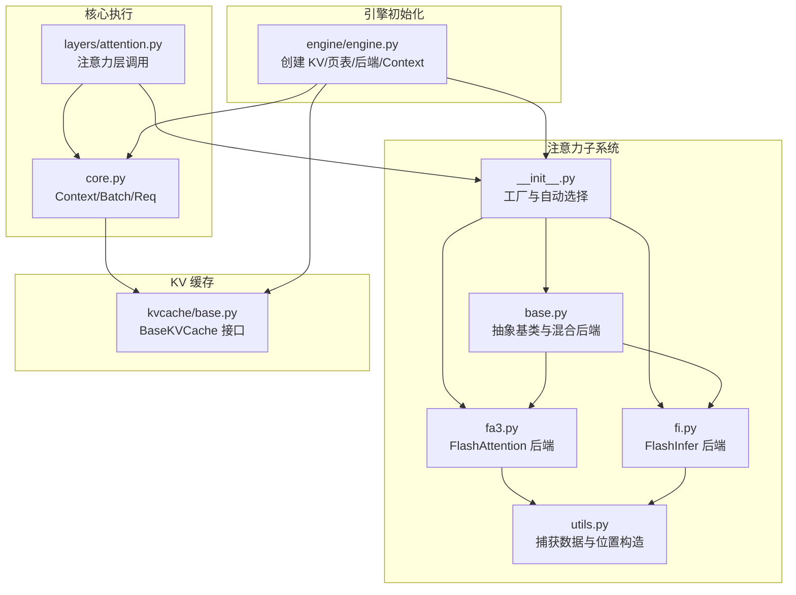
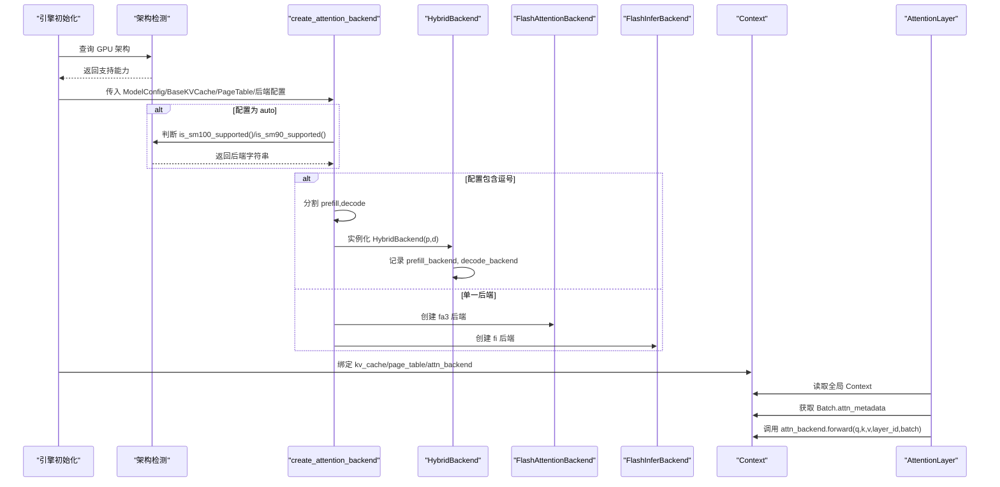
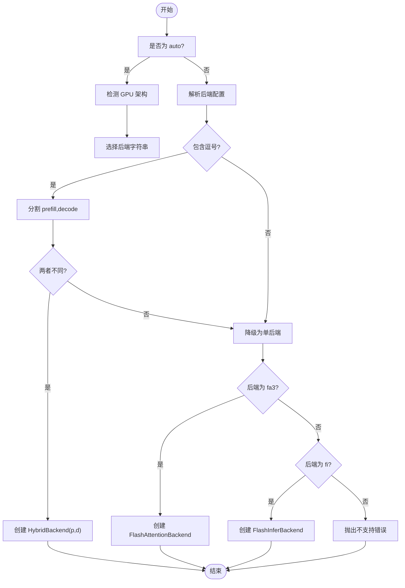
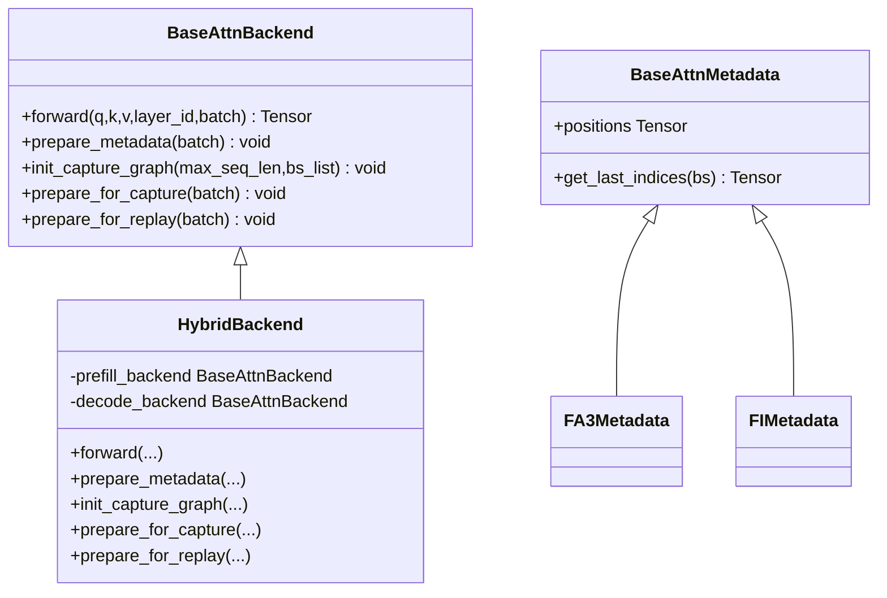
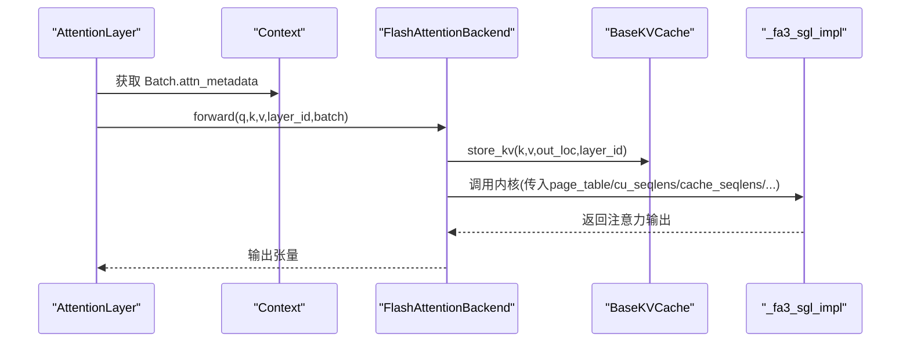
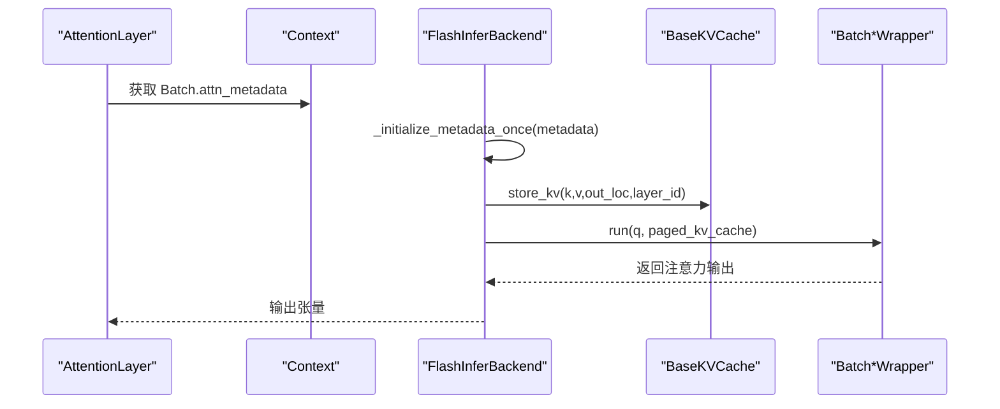
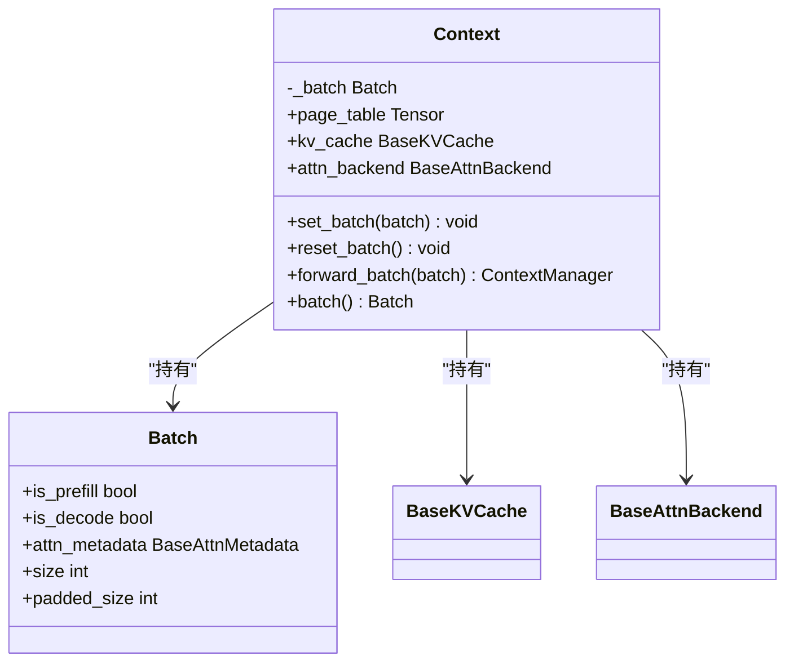
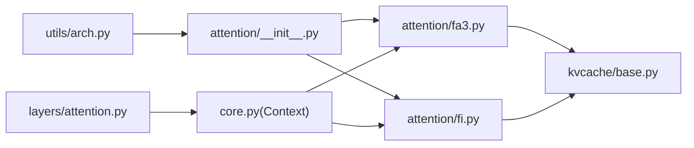

# 注意力后端集成

<cite>
**本文引用的文件**
- [python/minisgl/attention/__init__.py](file://python/minisgl/attention/__init__.py)
- [python/minisgl/attention/base.py](file://python/minisgl/attention/base.py)
- [python/minisgl/attention/fa3.py](file://python/minisgl/attention/fa3.py)
- [python/minisgl/attention/fi.py](file://python/minisgl/attention/fi.py)
- [python/minisgl/attention/utils.py](file://python/minisgl/attention/utils.py)
- [python/minisgl/core.py](file://python/minisgl/core.py)
- [python/minisgl/layers/attention.py](file://python/minisgl/layers/attention.py)
- [python/minisgl/utils/arch.py](file://python/minisgl/utils/arch.py)
- [python/minisgl/engine/engine.py](file://python/minisgl/engine/engine.py)
- [python/minisgl/kvcache/base.py](file://python/minisgl/kvcache/base.py)
</cite>

## 目录
1. [引言](#引言)
2. [项目结构](#项目结构)
3. [核心组件](#核心组件)
4. [架构总览](#架构总览)
5. [详细组件分析](#详细组件分析)
6. [依赖关系分析](#依赖关系分析)
7. [性能考量](#性能考量)
8. [故障排查指南](#故障排查指南)
9. [结论](#结论)

## 引言
本文件系统性阐述注意力后端的动态选择与集成机制，重点围绕工厂函数 create_attention_backend 的工作流程展开：当配置为 auto 时，如何依据 GPU 架构（通过 is_sm90_supported/is_sm100_supported 检测）自动选择 fa3 或 fi；如何解析 prefill_backend,decode_backend 格式的混合后端配置，并利用 HybridBackend 包装器为预填充和解码阶段分别实例化不同后端。同时深入探讨 BaseAttnBackend 抽象基类定义的接口规范，以及 FlashAttentionBackend 和 FlashInferBackend 如何实现这些接口并与 page_table 协同工作。最后说明 Context 对象在初始化时如何将 attn_backend 与 kv_cache、page_table 绑定，为模型前向计算提供统一的执行上下文。

## 项目结构
注意力后端相关代码主要位于 python/minisgl/attention 目录，配合核心执行上下文 Context、KV 缓存接口 BaseKVCache、以及层间注意力调用 AttentionLayer 共同构成完整的注意力执行链路。引擎初始化阶段负责创建 KV 缓存、页表、注意力后端，并将它们绑定到全局 Context 中。

图表来源
- [python/minisgl/attention/__init__.py](file://python/minisgl/attention/__init__.py#L1-L59)
- [python/minisgl/attention/base.py](file://python/minisgl/attention/base.py#L1-L66)
- [python/minisgl/attention/fa3.py](file://python/minisgl/attention/fa3.py#L1-L211)
- [python/minisgl/attention/fi.py](file://python/minisgl/attention/fi.py#L1-L278)
- [python/minisgl/attention/utils.py](file://python/minisgl/attention/utils.py#L1-L50)
- [python/minisgl/core.py](file://python/minisgl/core.py#L1-L156)
- [python/minisgl/layers/attention.py](file://python/minisgl/layers/attention.py#L1-L60)
- [python/minisgl/kvcache/base.py](file://python/minisgl/kvcache/base.py#L1-L135)
- [python/minisgl/engine/engine.py](file://python/minisgl/engine/engine.py#L52-L85)

章节来源
- [python/minisgl/attention/__init__.py](file://python/minisgl/attention/__init__.py#L1-L59)
- [python/minisgl/attention/base.py](file://python/minisgl/attention/base.py#L1-L66)
- [python/minisgl/attention/fa3.py](file://python/minisgl/attention/fa3.py#L1-L211)
- [python/minisgl/attention/fi.py](file://python/minisgl/attention/fi.py#L1-L278)
- [python/minisgl/attention/utils.py](file://python/minisgl/attention/utils.py#L1-L50)
- [python/minisgl/core.py](file://python/minisgl/core.py#L1-L156)
- [python/minisgl/layers/attention.py](file://python/minisgl/layers/attention.py#L1-L60)
- [python/minisgl/kvcache/base.py](file://python/minisgl/kvcache/base.py#L1-L135)
- [python/minisgl/engine/engine.py](file://python/minisgl/engine/engine.py#L52-L85)

## 核心组件
- 工厂与自动选择：create_attention_backend 负责根据配置字符串或自动策略创建具体后端实例；_resolve_auto_backend 基于 GPU 架构返回首选后端字符串。
- 抽象基类与混合后端：BaseAttnBackend 定义统一接口；HybridBackend 在运行时根据 Batch.is_prefill 决定使用哪个子后端。
- 具体后端实现：
  - FlashAttentionBackend（fa3）：封装底层内核调用，管理捕获图生命周期，准备 FA3Metadata 并与 page_table 协作。
  - FlashInferBackend（fi）：基于 FlashInfer 的预填充/解码包装器，管理捕获图与 CUDA Graph，准备 FIMetadata 并与 page_table 协作。
- 执行上下文与调用链：Context 将 attn_backend、kv_cache、page_table 绑定，AttentionLayer 从全局 Context 获取 Batch 并调用 attn_backend.forward。
- 辅助工具：BaseCaptureData 提供捕获图所需的数据模板；make_positions 生成位置索引。

章节来源
- [python/minisgl/attention/__init__.py](file://python/minisgl/attention/__init__.py#L1-L59)
- [python/minisgl/attention/base.py](file://python/minisgl/attention/base.py#L1-L66)
- [python/minisgl/attention/fa3.py](file://python/minisgl/attention/fa3.py#L1-L211)
- [python/minisgl/attention/fi.py](file://python/minisgl/attention/fi.py#L1-L278)
- [python/minisgl/attention/utils.py](file://python/minisgl/attention/utils.py#L1-L50)
- [python/minisgl/layers/attention.py](file://python/minisgl/layers/attention.py#L1-L60)
- [python/minisgl/core.py](file://python/minisgl/core.py#L1-L156)

## 架构总览
注意力后端的动态选择与集成遵循“工厂 + 抽象 + 混合后端 + 执行上下文”的设计模式。工厂根据配置与硬件能力选择后端；HybridBackend 将预填充与解码阶段解耦；具体后端实现各自的数据准备与内核调用；Context 提供统一的执行上下文，使注意力层无需关心后端细节。

图表来源
- [python/minisgl/attention/__init__.py](file://python/minisgl/attention/__init__.py#L1-L59)
- [python/minisgl/utils/arch.py](file://python/minisgl/utils/arch.py#L1-L30)
- [python/minisgl/engine/engine.py](file://python/minisgl/engine/engine.py#L52-L85)
- [python/minisgl/core.py](file://python/minisgl/core.py#L101-L156)
- [python/minisgl/layers/attention.py](file://python/minisgl/layers/attention.py#L1-L60)

## 详细组件分析

### 工厂函数 create_attention_backend 的工作流程
- 自动选择逻辑：
  - 若检测到 SM100（Blackwell），优先选择 fi；
  - 若检测到 SM90（Hopper），返回 "fa3,fi"（混合后端）；
  - 其他情况返回 fi。
- 混合后端解析：
  - 当配置包含逗号时，断言仅有一个逗号；
  - 若 prefill_backend 与 decode_backend 不同，则递归创建两个子后端并由 HybridBackend 包装；
  - 若相同则降级为单后端。
- 单后端创建：
  - "fa3" -> FlashAttentionBackend；
  - "fi" -> FlashInferBackend；
  - 其他值抛出异常。

图表来源
- [python/minisgl/attention/__init__.py](file://python/minisgl/attention/__init__.py#L1-L59)
- [python/minisgl/utils/arch.py](file://python/minisgl/utils/arch.py#L1-L30)

章节来源
- [python/minisgl/attention/__init__.py](file://python/minisgl/attention/__init__.py#L1-L59)
- [python/minisgl/utils/arch.py](file://python/minisgl/utils/arch.py#L1-L30)

### 抽象基类与混合后端接口规范
- BaseAttnBackend 定义：
  - forward(q, k, v, layer_id, batch) -> Tensor
  - prepare_metadata(batch) -> None
  - init_capture_graph(max_seq_len, bs_list) -> None
  - prepare_for_capture(batch) -> None
  - prepare_for_replay(batch) -> None
- BaseAttnMetadata 定义：
  - positions: Tensor
  - get_last_indices(bs) -> Tensor
- HybridBackend：
  - 运行时根据 batch.is_prefill 选择 prefill_backend 或 decode_backend；
  - 其余生命周期方法委托给 decode_backend（因为捕获图通常只在解码阶段启用）。

图表来源
- [python/minisgl/attention/base.py](file://python/minisgl/attention/base.py#L1-L66)
- [python/minisgl/attention/fa3.py](file://python/minisgl/attention/fa3.py#L1-L105)
- [python/minisgl/attention/fi.py](file://python/minisgl/attention/fi.py#L48-L84)

章节来源
- [python/minisgl/attention/base.py](file://python/minisgl/attention/base.py#L1-L66)

### FlashAttentionBackend（fa3）实现要点
- 初始化：保存 config、kvcache、scale、page_table。
- forward：
  - 断言 attn_metadata 类型为 FA3Metadata；
  - 先将本次 k/v 存入 kv_cache（out_loc 指向输出位置）；
  - 调用底层内核实现，传入 page_table、cu_seqlens、cache_seqlens、max_seqlen 等。
- prepare_metadata：
  - 计算各请求的扩展长度、缓存长度、设备长度；
  - 生成 cu_seqlens_k/cu_seqlens_q（区分 decode/prefill/no-cache-hit/部分命中场景）；
  - 构造 FA3Metadata，包含 positions、page_table（按每个请求裁剪到当前设备长度）。
- 捕获图生命周期：
  - init_capture_graph：创建捕获数据模板；
  - prepare_for_capture：为固定 batch size 准备捕获数据与输入；
  - prepare_for_replay：回放时将当前状态写回捕获缓冲区。

图表来源
- [python/minisgl/layers/attention.py](file://python/minisgl/layers/attention.py#L47-L60)
- [python/minisgl/attention/fa3.py](file://python/minisgl/attention/fa3.py#L49-L105)
- [python/minisgl/attention/fa3.py](file://python/minisgl/attention/fa3.py#L144-L211)

章节来源
- [python/minisgl/attention/fa3.py](file://python/minisgl/attention/fa3.py#L1-L211)
- [python/minisgl/layers/attention.py](file://python/minisgl/layers/attention.py#L1-L60)

### FlashInferBackend（fi）实现要点
- 初始化：
  - 创建 float_workspace_buffer 与 int_workspace_buffer 复用；
  - 初始化预填充与解码包装器（注意注释中说明 fa3 存在问题，采用 fa2）；
  - 计算每张卡本地的 qo/kv 头数（分发）。
- forward：
  - 断言 attn_metadata 类型为 FIMetadata；
  - 首次使用时初始化 wrapper.plan；
  - 先 store_kv，再通过 wrapper.run(q, paged_kv_cache) 执行注意力。
- prepare_metadata：
  - 与 fa3 类似，但 cu_seqlens_q/cu_seqlens_k 分别以 CPU/GPU 两份形式存储；
  - 生成 indices（按请求拼接 page_table 的有效列）；
  - 选择 wrapper 为预填充或解码包装器。
- 捕获图生命周期：
  - init_capture_graph：创建捕获数据并转为 1D indices；
  - prepare_for_capture：为固定 batch size 创建 CUDAGraphBatchDecodeWithPagedKVCacheWrapper；
  - prepare_for_replay：回放时将输入写回捕获缓冲区并重新初始化 wrapper。

图表来源
- [python/minisgl/layers/attention.py](file://python/minisgl/layers/attention.py#L47-L60)
- [python/minisgl/attention/fi.py](file://python/minisgl/attention/fi.py#L131-L190)
- [python/minisgl/attention/fi.py](file://python/minisgl/attention/fi.py#L191-L226)
- [python/minisgl/attention/fi.py](file://python/minisgl/attention/fi.py#L227-L278)

章节来源
- [python/minisgl/attention/fi.py](file://python/minisgl/attention/fi.py#L1-L278)
- [python/minisgl/layers/attention.py](file://python/minisgl/layers/attention.py#L1-L60)

### Context 与执行上下文绑定
- Context 初始化时：
  - 校验 page_table 的维度、类型、连续性；
  - 保存 kv_cache、attn_backend、page_table；
  - 固定 page_size=1。
- Batch：
  - is_prefill/is_decode 属性用于 HybridBackend 的分支选择；
  - attn_metadata 字段承载后端所需的元数据。
- AttentionLayer：
  - 从全局 Context 获取 Batch；
  - 生成 q/k/v 后调用 ctx.attn_backend.forward(...)。

图表来源
- [python/minisgl/core.py](file://python/minisgl/core.py#L73-L156)
- [python/minisgl/layers/attention.py](file://python/minisgl/layers/attention.py#L47-L60)

章节来源
- [python/minisgl/core.py](file://python/minisgl/core.py#L73-L156)
- [python/minisgl/layers/attention.py](file://python/minisgl/layers/attention.py#L1-L60)

### 与 page_table 的协同工作
- 两者均通过注意力后端的 prepare_metadata 生成各自的元数据视图：
  - FA3：将 page_table 按每个请求裁剪到当前设备长度，形成新的二维 page_table；
  - FI：将 page_table 的有效列按请求拼接为 indices（1D），作为 ragged 索引。
- forward 阶段：
  - FA3：直接传入 page_table 与 cu_seqlens；
  - FI：通过 wrapper.run 使用 indices 与计划参数进行注意力计算。

章节来源
- [python/minisgl/attention/fa3.py](file://python/minisgl/attention/fa3.py#L82-L105)
- [python/minisgl/attention/fi.py](file://python/minisgl/attention/fi.py#L201-L225)

## 依赖关系分析
- 工厂与架构检测：
  - create_attention_backend 依赖 is_sm90_supported/is_sm100_supported；
  - 二者来自 utils/arch.py。
- 后端实现与 KV 缓存：
  - FA3/FI 均依赖 BaseKVCache 的 k_cache/v_cache/store_kv 接口；
  - KV 缓存接口定义在 kvcache/base.py。
- 执行链路：
  - AttentionLayer 通过 get_global_ctx() 获取 Context；
  - Context 持有 Batch，Batch 持有 attn_metadata；
  - 后端 forward 依赖 attn_metadata 的具体类型（FA3Metadata/FIMetadata）。

图表来源
- [python/minisgl/attention/__init__.py](file://python/minisgl/attention/__init__.py#L1-L59)
- [python/minisgl/utils/arch.py](file://python/minisgl/utils/arch.py#L1-L30)
- [python/minisgl/attention/fa3.py](file://python/minisgl/attention/fa3.py#L1-L211)
- [python/minisgl/attention/fi.py](file://python/minisgl/attention/fi.py#L1-L278)
- [python/minisgl/kvcache/base.py](file://python/minisgl/kvcache/base.py#L1-L135)
- [python/minisgl/layers/attention.py](file://python/minisgl/layers/attention.py#L1-L60)
- [python/minisgl/core.py](file://python/minisgl/core.py#L101-L156)

章节来源
- [python/minisgl/attention/__init__.py](file://python/minisgl/attention/__init__.py#L1-L59)
- [python/minisgl/utils/arch.py](file://python/minisgl/utils/arch.py#L1-L30)
- [python/minisgl/kvcache/base.py](file://python/minisgl/kvcache/base.py#L1-L135)
- [python/minisgl/layers/attention.py](file://python/minisgl/layers/attention.py#L1-L60)
- [python/minisgl/core.py](file://python/minisgl/core.py#L101-L156)

## 性能考量
- 捕获图与 CUDA Graph：
  - FA3/FI 均支持 init_capture_graph/prepare_for_capture/prepare_for_replay；
  - 解码阶段更适合捕获图，因此 HybridBackend 的捕获图生命周期委托给 decode_backend。
- 数据布局与连续性：
  - FA3 内核要求张量最后一维连续，后端在调用前会做断言；
  - FI 通过 indices（1D）与 wrapper.plan 降低内存碎片。
- 硬件适配：
  - SM100（Blackwell）优先选择 fi；
  - SM90（Hopper）推荐混合后端（fa3,fi），以预填充走 fa3、解码走 fi 的组合提升吞吐；
  - 其他架构默认 fi。
- 位置索引生成：
  - make_positions 在 CPU 上生成并异步拷贝到 GPU，减少调度开销。

章节来源
- [python/minisgl/attention/fa3.py](file://python/minisgl/attention/fa3.py#L144-L211)
- [python/minisgl/attention/fi.py](file://python/minisgl/attention/fi.py#L227-L278)
- [python/minisgl/attention/__init__.py](file://python/minisgl/attention/__init__.py#L1-L59)
- [python/minisgl/attention/utils.py](file://python/minisgl/attention/utils.py#L36-L50)

## 故障排查指南
- “未找到 sgl_kernel.flash_attn”：
  - 现象：导入内核失败并提示安装；
  - 处理：按照提示安装依赖包，并确保系统库可用。
- 张量非连续导致内核报错：
  - 现象：FA3 内核断言最后一维连续失败；
  - 处理：检查输入张量的 stride，必要时进行 contiguous 操作。
- 混合后端逗号格式错误：
  - 现象：配置包含多个逗号或非法格式；
  - 处理：确保仅一个逗号，且 prefill_backend 与 decode_backend 可被工厂正确解析。
- 捕获图重复初始化：
  - 现象：重复调用 init_capture_graph 导致断言失败；
  - 处理：确保仅在首次初始化时调用，或在重置后重新创建。
- 页表尺寸不匹配：
  - 现象：Context 初始化断言 page_table 维度/类型/连续性；
  - 处理：确认 page_table 为 2D、CUDATensor、int32、连续。

章节来源
- [python/minisgl/attention/fa3.py](file://python/minisgl/attention/fa3.py#L161-L171)
- [python/minisgl/attention/__init__.py](file://python/minisgl/attention/__init__.py#L36-L44)
- [python/minisgl/core.py](file://python/minisgl/core.py#L111-L121)

## 结论
该注意力后端体系通过工厂函数与自动选择机制实现了对不同 GPU 架构的自适应；通过 HybridBackend 将预填充与解码阶段解耦，允许在不同阶段采用最优实现；BaseAttnBackend 抽象统一了接口，使具体后端（fa3/fi）能够独立演进。Context 将 attn_backend、kv_cache、page_table 绑定，为注意力层提供一致的执行环境。整体设计兼顾可扩展性与性能，适合在多架构、多场景下稳定运行。