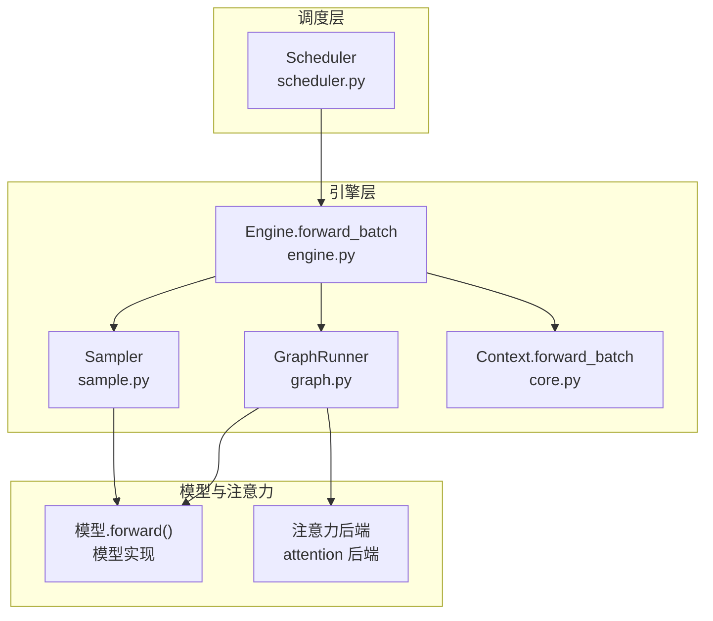
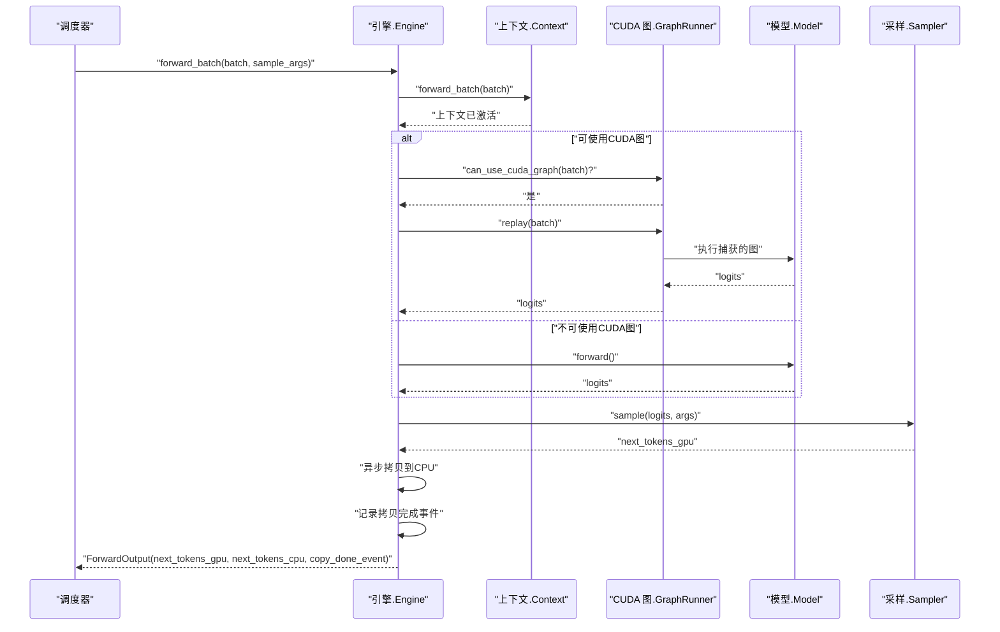
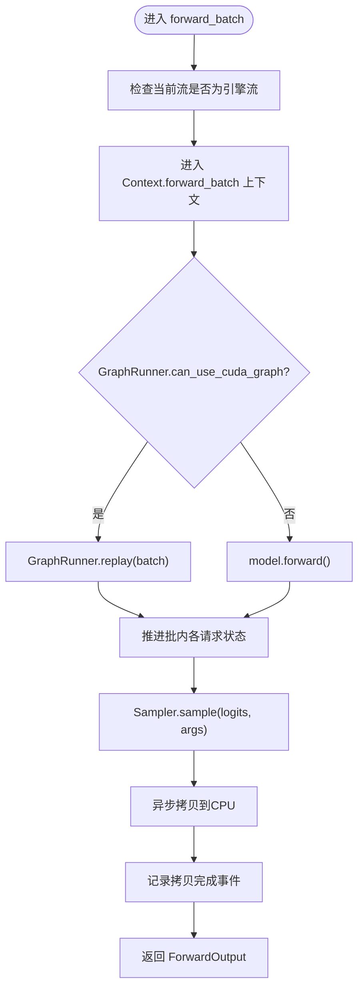
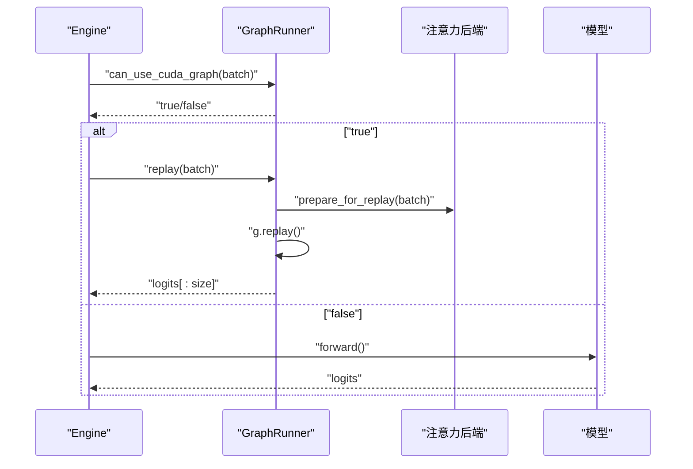
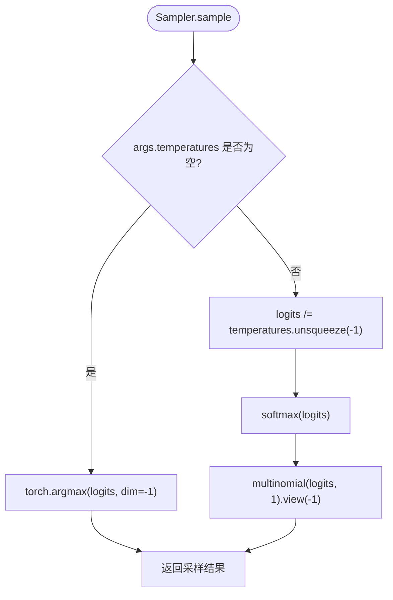
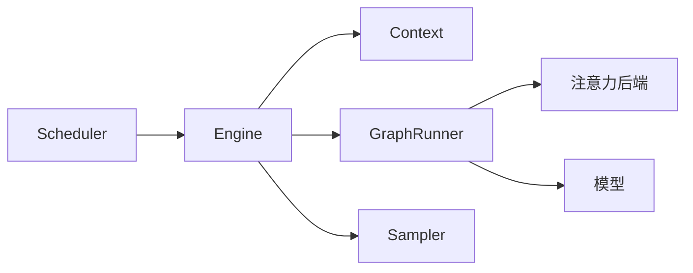

# 前向执行流程

<cite>
**本文引用的文件**
- [engine.py](file://python/minisgl/engine/engine.py)
- [graph.py](file://python/minisgl/engine/graph.py)
- [sample.py](file://python/minisgl/engine/sample.py)
- [core.py](file://python/minisgl/core.py)
- [scheduler.py](file://python/minisgl/scheduler/scheduler.py)
</cite>

## 目录
1. [引言](#引言)
2. [项目结构](#项目结构)
3. [核心组件](#核心组件)
4. [架构总览](#架构总览)
5. [详细组件分析](#详细组件分析)
6. [依赖关系分析](#依赖关系分析)
7. [性能考量](#性能考量)
8. [故障排查指南](#故障排查指南)
9. [结论](#结论)

## 引言
本文件围绕 Engine 的 forward_batch 方法展开，系统性剖析其在指定 CUDA 流上，通过 Context.forward_batch 上下文管理器激活当前批处理上下文的完整流程；说明 Engine 如何依据 GraphRunner.can_use_cuda_graph 的判断，选择 CUDA 图重放或直接调用模型前向；在模型推理后，Sampler 如何基于 BatchSamplingArgs 对 logits 进行采样生成下一个 token；并解释 ForwardOutput 命名元组如何封装 GPU 新 token、异步拷贝到 CPU 的 token 以及用于同步的 CUDA 事件，从而支持高效的流式输出。

## 项目结构
与前向执行流程直接相关的模块包括：
- 引擎层：Engine 负责初始化设备、流、KV 缓存、注意力后端、CUDA 图运行器，并实现 forward_batch。
- 采样层：Sampler 提供温度预处理与采样逻辑，BatchSamplingArgs 封装批内采样参数。
- 上下文层：Context 提供全局上下文管理，forward_batch 上下文在其中设置/复位当前批。
- 调度层：Scheduler 在引擎流中调度执行，将 token 写回池化缓冲区，并与引擎协同实现重叠执行。

图表来源
- [engine.py](file://python/minisgl/engine/engine.py#L196-L211)
- [graph.py](file://python/minisgl/engine/graph.py#L133-L141)
- [sample.py](file://python/minisgl/engine/sample.py#L12-L43)
- [core.py](file://python/minisgl/core.py#L130-L137)
- [scheduler.py](file://python/minisgl/scheduler/scheduler.py#L218-L224)

章节来源
- [engine.py](file://python/minisgl/engine/engine.py#L196-L211)
- [graph.py](file://python/minisgl/engine/graph.py#L133-L141)
- [sample.py](file://python/minisgl/engine/sample.py#L12-L43)
- [core.py](file://python/minisgl/core.py#L130-L137)
- [scheduler.py](file://python/minisgl/scheduler/scheduler.py#L218-L224)

## 核心组件
- ForwardOutput：封装本次前向产生的新 token（GPU）、异步拷贝到 CPU 的 token（CPU）以及记录拷贝完成的 CUDA 事件，便于后续同步与非阻塞传输。
- Engine.forward_batch：在指定 CUDA 流上，使用 Context.forward_batch 激活批上下文，按条件选择 CUDA 图重放或直接模型前向，随后采样生成下一个 token 并返回 ForwardOutput。
- GraphRunner：负责捕获与重放 CUDA 图，提供 can_use_cuda_graph 判断与 replay 执行。
- Sampler：准备温度参数并执行采样，支持 argmax 或带温度的多项式采样。
- Context.forward_batch：设置/复位全局批上下文，供注意力后端与 KV 缓存读取。

章节来源
- [engine.py](file://python/minisgl/engine/engine.py#L22-L26)
- [engine.py](file://python/minisgl/engine/engine.py#L196-L211)
- [graph.py](file://python/minisgl/engine/graph.py#L133-L141)
- [sample.py](file://python/minisgl/engine/sample.py#L12-L43)
- [core.py](file://python/minisgl/core.py#L130-L137)

## 架构总览
下面的时序图展示了从调度器到引擎、再到 CUDA 图或模型前向、采样的完整链路，以及 ForwardOutput 的产出与写回路径。

图表来源
- [engine.py](file://python/minisgl/engine/engine.py#L196-L211)
- [graph.py](file://python/minisgl/engine/graph.py#L133-L141)
- [sample.py](file://python/minisgl/engine/sample.py#L33-L43)
- [scheduler.py](file://python/minisgl/scheduler/scheduler.py#L218-L224)

## 详细组件分析

### Engine.forward_batch 执行流程
- 流一致性校验：确保当前 CUDA 流为引擎创建的流。
- 上下文激活：通过 Context.forward_batch 上下文管理器设置当前批，使注意力后端与 KV 缓存读取到正确的批数据。
- CUDA 图决策：若 GraphRunner.can_use_cuda_graph 返回真，则调用 GraphRunner.replay 重放捕获的图；否则直接调用模型前向。
- 请求状态推进：遍历批内请求，推进每个请求的已缓存长度与设备长度。
- 采样与输出：使用 Sampler.sample 基于 BatchSamplingArgs 对 logits 采样得到 next_tokens_gpu，将其异步拷贝到 CPU，并记录 CUDA 事件，最终以 ForwardOutput 返回。

图表来源
- [engine.py](file://python/minisgl/engine/engine.py#L196-L211)
- [graph.py](file://python/minisgl/engine/graph.py#L133-L141)
- [sample.py](file://python/minisgl/engine/sample.py#L33-L43)

章节来源
- [engine.py](file://python/minisgl/engine/engine.py#L196-L211)

### GraphRunner 的 CUDA 图选择与重放
- 可用性判断：仅当批处于 decode 阶段且大小不超过最大图尺寸时才使用 CUDA 图。
- 重放流程：根据批的填充大小获取对应图，准备注意力后端重放环境，执行图重放并将 logits 截断为实际大小返回。

图表来源
- [graph.py](file://python/minisgl/engine/graph.py#L133-L141)

章节来源
- [graph.py](file://python/minisgl/engine/graph.py#L133-L141)

### Sampler 的采样逻辑与 BatchSamplingArgs
- 参数准备：当存在温度时，将温度张量预热至设备并进行非阻塞传输；若无温度则返回空温度参数。
- 采样策略：若温度为空，采用 argmax；否则对 logits 按温度缩放、softmax 归一化后进行多项式采样，得到下一个 token。

图表来源
- [sample.py](file://python/minisgl/engine/sample.py#L21-L43)

章节来源
- [sample.py](file://python/minisgl/engine/sample.py#L12-L43)

### ForwardOutput 的封装与同步机制
- 字段组成：包含 GPU 上的新 token、异步拷贝到 CPU 的 token、记录拷贝完成的 CUDA 事件。
- 同步与非阻塞：通过事件记录拷贝完成，后续可在需要时等待该事件，避免阻塞主流；同时异步拷贝提升吞吐。

章节来源
- [engine.py](file://python/minisgl/engine/engine.py#L22-L26)

### 调度器与引擎的协作
- 调度器在引擎流中执行前向，先加载 token ids，再调用引擎的 forward_batch，然后将返回的 GPU token 写入池化缓冲区，最后将请求加入解码管理器。
- 重叠执行：通过等待引擎流与调度器引擎流的同步，实现调度与执行的重叠，隐藏 CPU 等待延迟。

章节来源
- [scheduler.py](file://python/minisgl/scheduler/scheduler.py#L211-L224)
- [scheduler.py](file://python/minisgl/scheduler/scheduler.py#L231-L254)

## 依赖关系分析
- Engine 依赖 Context 提供的全局批上下文，使注意力后端与 KV 缓存能感知当前批。
- Engine 依赖 GraphRunner 决策是否走 CUDA 图路径，GraphRunner 依赖注意力后端与模型实现。
- Engine 依赖 Sampler 完成 logits 的批采样。
- Scheduler 依赖 Engine 的 forward_batch 与 ForwardOutput，负责将 GPU token 写回池化缓冲区。

图表来源
- [engine.py](file://python/minisgl/engine/engine.py#L196-L211)
- [graph.py](file://python/minisgl/engine/graph.py#L133-L141)
- [sample.py](file://python/minisgl/engine/sample.py#L12-L43)
- [core.py](file://python/minisgl/core.py#L130-L137)
- [scheduler.py](file://python/minisgl/scheduler/scheduler.py#L218-L224)

章节来源
- [engine.py](file://python/minisgl/engine/engine.py#L196-L211)
- [graph.py](file://python/minisgl/engine/graph.py#L133-L141)
- [sample.py](file://python/minisgl/engine/sample.py#L12-L43)
- [core.py](file://python/minisgl/core.py#L130-L137)
- [scheduler.py](file://python/minisgl/scheduler/scheduler.py#L218-L224)

## 性能考量
- CUDA 图重放：在满足条件时，重放捕获的图可显著降低内核启动开销，提高吞吐。
- 非阻塞传输：将采样结果异步拷贝到 CPU，并通过事件记录完成，避免阻塞主流，提升并发效率。
- 重叠调度：调度器与引擎流之间的等待与重叠执行，有助于隐藏 CPU 等待，提升整体利用率。
- 温度预热：将温度张量预热到设备并非阻塞传输，减少主机侧同步点。

## 故障排查指南
- 当前流不匹配：若当前 CUDA 流不是引擎流，forward_batch 会断言失败。请确认调度器在引擎流上下文中执行。
- CUDA 图不可用：若批不在 decode 阶段或超出最大图尺寸，将回退到直接模型前向。检查批的 phase 与 size。
- 采样异常：若温度张量准备失败或 logits 维度不正确，可能导致采样错误。检查 BatchSamplingArgs 与 logits 形状。
- 事件未触发：若依赖拷贝完成事件进行同步，请确保事件已被记录并在后续流程中等待。

章节来源
- [engine.py](file://python/minisgl/engine/engine.py#L196-L211)
- [graph.py](file://python/minisgl/engine/graph.py#L133-L141)
- [sample.py](file://python/minisgl/engine/sample.py#L21-L43)

## 结论
forward_batch 方法通过 Context.forward_batch 激活批上下文，结合 GraphRunner 的 CUDA 图可用性判断，实现了在指定 CUDA 流上的高效前向执行。随后由 Sampler 基于 BatchSamplingArgs 对 logits 进行采样，生成 GPU 上的新 token，并通过异步拷贝与 CUDA 事件实现与 CPU 的解耦同步，最终以 ForwardOutput 封装返回，支撑调度器的重叠执行与高吞吐输出。