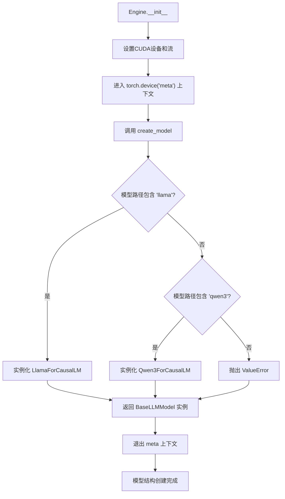
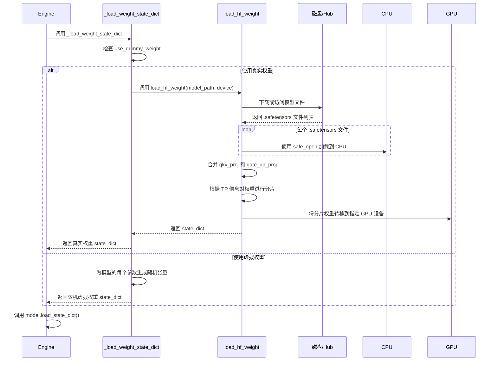
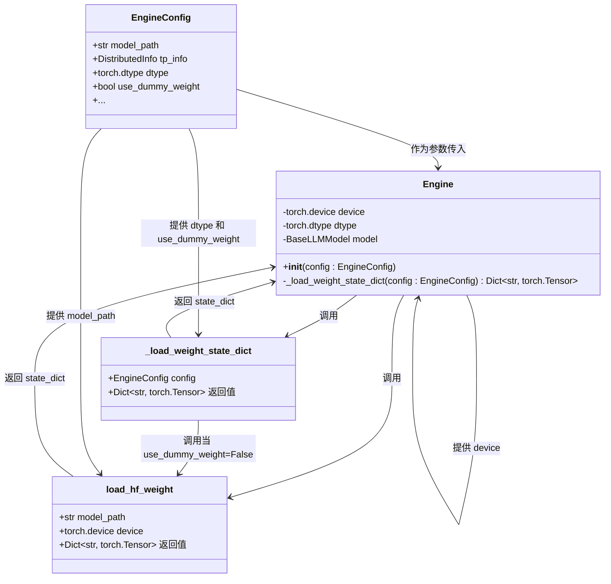

# 模型加载与初始化

<cite>
**本文档中引用的文件**  
- [engine.py](file://python/minisgl/engine/engine.py)
- [config.py](file://python/minisgl/engine/config.py)
- [models/__init__.py](file://python/minisgl/models/__init__.py)
- [models/weight.py](file://python/minisgl/models/weight.py)
- [models/config.py](file://python/minisgl/models/config.py)
- [models/llama.py](file://python/minisgl/models/llama.py)
- [models/qwen3.py](file://python/minisgl/models/qwen3.py)
- [utils/hf.py](file://python/minisgl/utils/hf.py)
- [utils/torch_utils.py](file://python/minisgl/utils/torch_utils.py)
- [layers/base.py](file://python/minisgl/layers/base.py)
</cite>

## 目录
1. [引言](#引言)
2. [模型加载流程概述](#模型加载流程概述)
3. [Engine初始化与模型结构创建](#engine初始化与模型结构创建)
4. [模型权重加载机制](#模型权重加载机制)
5. [虚拟权重与真实权重的处理逻辑](#虚拟权重与真实权重的处理逻辑)
6. [设备分配与精度转换](#设备分配与精度转换)
7. [配置驱动的模型加载](#配置驱动的模型加载)
8. [自定义模型加载扩展示例](#自定义模型加载扩展示例)
9. [结论](#结论)

## 引言
本文档详细解析`mini-sglang`框架中`Engine`在初始化过程中如何加载大型语言模型（LLM）。重点分析`create_model`和`load_hf_weight`函数的协同工作机制，描述模型结构在meta设备上的初始化、权重从Hugging Face路径的加载过程，以及如何根据配置将权重分配到指定GPU设备并转换为指定精度。同时，说明`EngineConfig`中关键参数对模型加载行为的影响，并提供可扩展的自定义加载示例。

## 模型加载流程概述
`Engine`的模型加载过程遵循一个高效且可配置的流程，主要分为两个阶段：模型结构初始化和权重加载。该流程设计旨在减少内存峰值使用，支持分布式张量并行，并允许使用虚拟权重进行性能测试。

**Section sources**
- [engine.py](file://python/minisgl/engine/engine.py#L37-L112)

## Engine初始化与模型结构创建
在`Engine`的构造函数中，模型结构的创建通过`create_model`函数完成。关键步骤如下：

1. **设备与上下文设置**：根据`EngineConfig`中的`tp_info.rank`设置CUDA设备，并创建专用的CUDA流。
2. **Meta设备初始化**：使用`torch.device("meta")`上下文管理器，在不分配实际内存的情况下初始化模型结构。这允许在知道模型参数总量之前构建完整的计算图。
3. **模型结构创建**：调用`create_model(config.model_path, config.model_config)`，根据模型路径自动识别模型类型（如Llama或Qwen3），并实例化相应的模型类（如`LlamaForCausalLM`或`Qwen3ForCausalLM`）。

此过程确保了模型结构的创建与权重加载分离，从而实现了内存高效的初始化。



**Diagram sources**
- [engine.py](file://python/minisgl/engine/engine.py#L54-L55)
- [models/__init__.py](file://python/minisgl/models/__init__.py#L8-L19)

**Section sources**
- [engine.py](file://python/minisgl/engine/engine.py#L37-L57)
- [models/__init__.py](file://python/minisgl/models/__init__.py#L8-L19)

## 模型权重加载机制
模型权重的加载由`_load_weight_state_dict`方法协调，该方法根据配置决定是加载真实权重还是生成虚拟权重。

### `load_hf_weight` 函数详解
`load_hf_weight`函数负责从Hugging Face模型路径加载权重，其流程如下：

1. **路径解析**：如果`model_path`是一个本地目录，则直接使用；否则，使用`snapshot_download`从Hugging Face Hub下载模型文件（仅下载`.safetensors`文件）。
2. **权重加载**：遍历所有`.safetensors`文件，使用`safetensors.safe_open`以CPU设备加载每个张量，避免GPU内存过早占用。
3. **张量合并**：对于使用`LinearQKVMerged`和`LinearColParallelMerged`等合并层的模型，`_merge_state_dict`函数将`q_proj`、`k_proj`、`v_proj`的权重沿`dim=0`拼接成`qkv_proj`，将`gate_proj`和`up_proj`拼接成`gate_up_proj`。
4. **张量分片**：在张量并行（TP）模式下，`_shard_state_dict`函数根据`tp_info.size`对权重进行分片。`q_proj`、`k_proj`、`v_proj`、`gate_proj`、`up_proj`等在`dim=0`上分片；`o_proj`、`down_proj`等在`dim=1`上分片；`embed_tokens`和`lm_head`则按词汇表分区。
5. **设备转移**：最后，将所有分片后的权重转移到`load_hf_weight`函数参数指定的`device`上。



**Diagram sources**
- [engine.py](file://python/minisgl/engine/engine.py#L142-L152)
- [models/weight.py](file://python/minisgl/models/weight.py#L78-L106)

**Section sources**
- [models/weight.py](file://python/minisgl/models/weight.py#L78-L106)

## 虚拟权重与真实权重的处理逻辑
`_load_weight_state_dict`方法是处理虚拟权重和真实权重的核心逻辑。

- **真实权重加载** (`use_dummy_weight=False`)：调用`load_hf_weight`函数，从Hugging Face路径加载真实的模型权重。这些权重会经过分片、合并和设备转移，最终形成一个与模型结构匹配的`state_dict`。
- **虚拟权重生成** (`use_dummy_weight=True`)：当`EngineConfig.use_dummy_weight`设置为`True`时，该方法会遍历`self.model.state_dict()`（此时模型在meta设备上，`state_dict`仅包含张量的形状和数据类型信息），为每个参数生成一个具有相同形状和数据类型、但值为随机数的张量，并将其分配到`self.device`上。

使用虚拟权重的主要目的是进行性能基准测试和调试，无需加载庞大的真实模型权重，从而显著加快启动速度并减少磁盘和内存占用。

**Section sources**
- [engine.py](file://python/minisgl/engine/engine.py#L142-L152)

## 设备分配与精度转换
模型加载过程中的设备分配和精度转换是通过多个机制协同完成的。

1. **设备分配**：
   - 模型结构在`meta`设备上创建，不占用实际内存。
   - 权重在`load_hf_weight`函数中被明确转移到`device`参数指定的GPU上。
   - 在`_load_weight_state_dict`中，无论是真实权重还是虚拟权重，最终都位于`self.device`上。

2. **精度转换**：
   - `EngineConfig.dtype`参数定义了模型运行时的目标精度（如`torch.float16`或`torch.bfloat16`）。
   - 在`_load_weight_state_dict`中，当加载真实权重时，会通过`v.to(self.dtype)`将从`.safetensors`文件加载的权重（通常是`float32`）转换为目标精度。
   - 虚拟权重在生成时直接使用`self.dtype`作为其数据类型。



**Diagram sources**
- [engine.py](file://python/minisgl/engine/engine.py#L46)
- [engine.py](file://python/minisgl/engine/engine.py#L150)
- [config.py](file://python/minisgl/engine/config.py#L19)

**Section sources**
- [engine.py](file://python/minisgl/engine/engine.py#L46-L47)
- [engine.py](file://python/minisgl/engine/engine.py#L150-L151)

## 配置驱动的模型加载
`EngineConfig`类是模型加载过程的配置中心，其关键参数直接影响加载行为：

- **`model_path`**：指定Hugging Face模型ID或本地路径，用于`create_model`的类型推断和`load_hf_weight`的权重加载。
- **`dtype`**：定义模型权重和计算的目标精度，影响`_load_weight_state_dict`中的`to(dtype)`操作。
- **`use_dummy_weight`**：控制是否加载真实权重，是启用快速启动和性能测试的关键开关。
- **`tp_info`**：包含`rank`和`size`，用于设置分布式环境，并指导`_shard_state_dict`进行正确的权重分片。

这种设计使得模型加载过程高度可配置，用户可以通过修改配置轻松切换模型、精度、并行策略和加载模式。

**Section sources**
- [config.py](file://python/minisgl/engine/config.py#L17-L28)

## 自定义模型加载扩展示例
要支持新的模型架构（例如`MyModel`），可以按照以下步骤扩展：

1. **实现模型类**：在`python/minisgl/models/`目录下创建`mymodel.py`，定义`MyModelForCausalLM`类，继承自`BaseLLMModel`。
2. **注册模型**：修改`python/minisgl/models/__init__.py`中的`create_model`函数，添加对新模型路径的判断：
    ```python
    def create_model(model_path: str, model_config: ModelConfig) -> BaseLLMModel:
        model_name = model_path.lower()
        if "llama" in model_name:
            from .llama import LlamaForCausalLM
            return LlamaForCausalLM(model_config)
        elif "qwen3" in model_name:
            from .qwen3 import Qwen3ForCausalLM
            return Qwen3ForCausalLM(model_config)
        elif "mymodel" in model_name:  # 新增
            from .mymodel import MyModelForCausalLM
            return MyModelForCausalLM(model_config)
        else:
            raise ValueError(f"Unsupported model: {model_path}")
    ```
3. **（可选）自定义权重处理**：如果新模型的权重格式特殊，可以在`weight.py`中添加相应的预处理逻辑。

通过这种方式，框架可以轻松支持新的模型架构，而无需修改核心引擎代码。

**Section sources**
- [models/__init__.py](file://python/minisgl/models/__init__.py#L8-L19)

## 结论
`mini-sglang`框架的模型加载机制设计精巧，通过将模型结构创建与权重加载分离，实现了内存高效和快速初始化。`create_model`和`load_hf_weight`函数的协同工作，结合`_load_weight_state_dict`中对虚拟/真实权重的灵活处理，以及`EngineConfig`的可配置性，为用户提供了一个强大、灵活且易于扩展的LLM加载系统。该机制不仅支持从Hugging Face无缝加载主流模型，还通过虚拟权重支持高效的性能分析和调试。