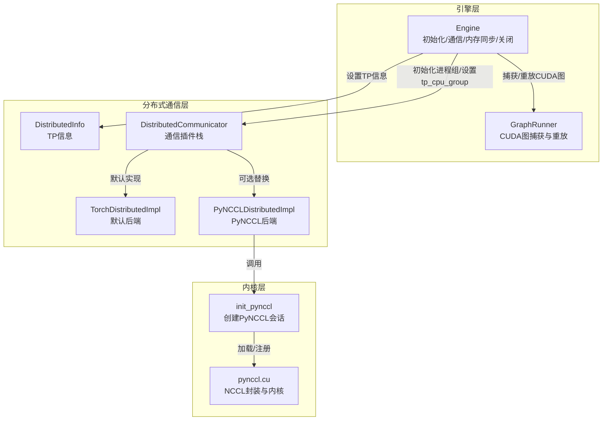
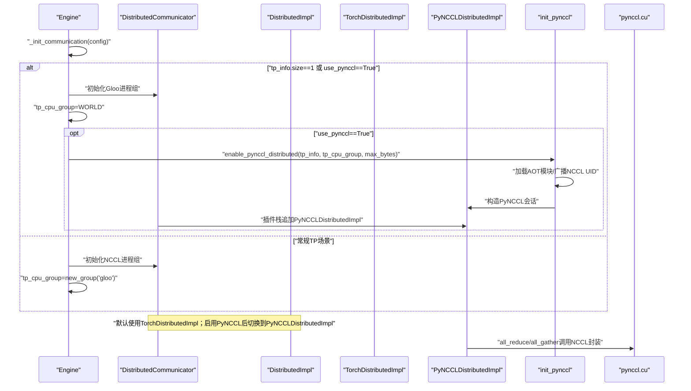
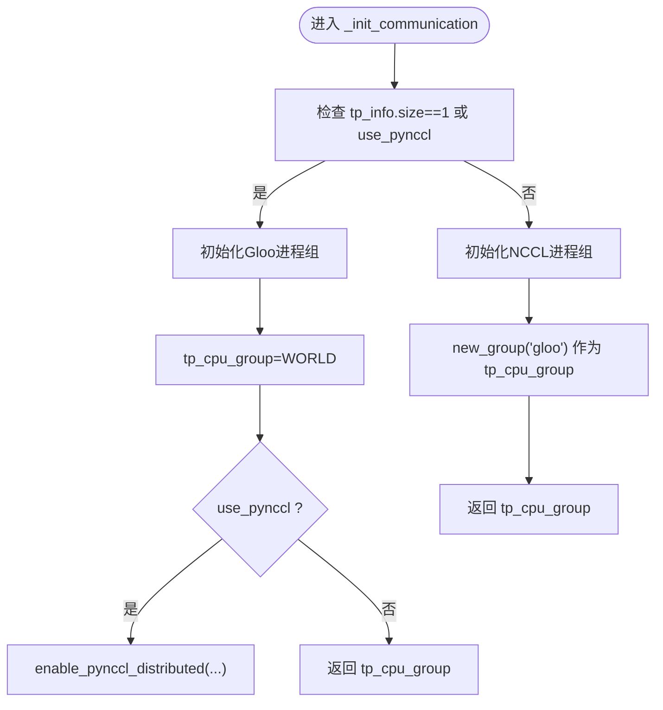
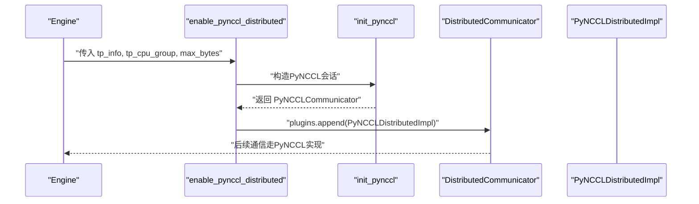
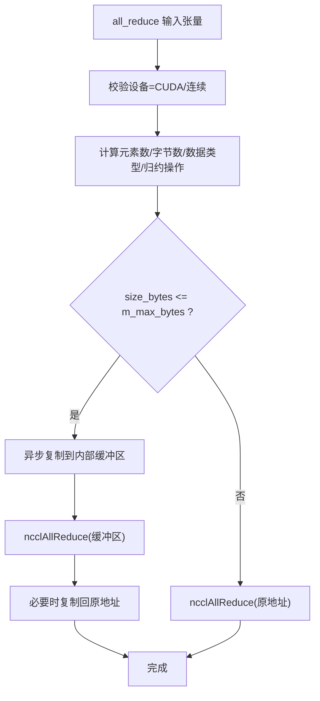
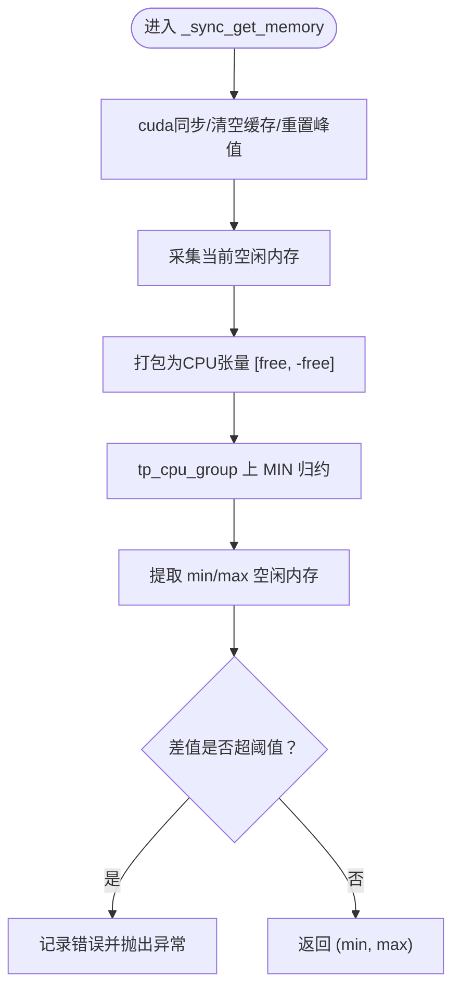
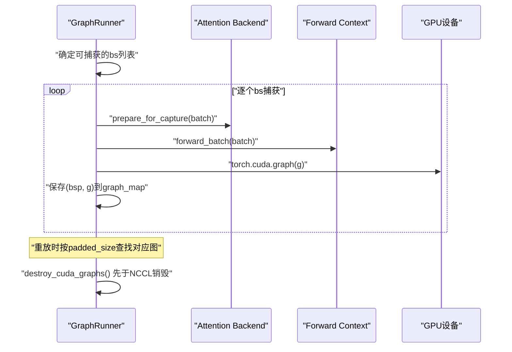
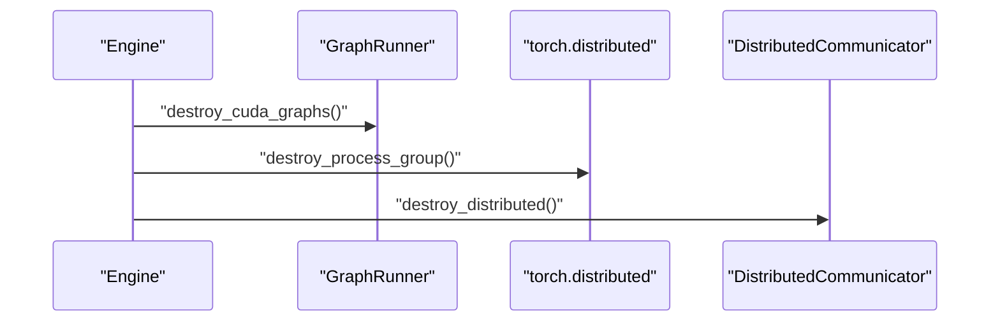
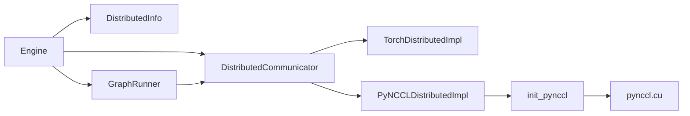

# 资源与通信管理

<cite>
**本文引用的文件**
- [python/minisgl/engine/engine.py](file://python/minisgl/engine/engine.py)
- [python/minisgl/distributed/impl.py](file://python/minisgl/distributed/impl.py)
- [python/minisgl/distributed/info.py](file://python/minisgl/distributed/info.py)
- [python/minisgl/kernel/pynccl.py](file://python/minisgl/kernel/pynccl.py)
- [python/minisgl/kernel/csrc/src/pynccl.cu](file://python/minisgl/kernel/csrc/src/pynccl.cu)
- [python/minisgl/engine/graph.py](file://python/minisgl/engine/graph.py)
</cite>

## 目录
1. [引言](#引言)
2. [项目结构](#项目结构)
3. [核心组件](#核心组件)
4. [架构总览](#架构总览)
5. [详细组件分析](#详细组件分析)
6. [依赖关系分析](#依赖关系分析)
7. [性能考量](#性能考量)
8. [故障排查指南](#故障排查指南)
9. [结论](#结论)

## 引言
本文件聚焦于Engine在分布式环境下的资源初始化与管理，围绕以下目标展开：
- 解析_init_communication方法如何根据tp_info.size与use_pynccl配置选择Gloo或NCCL进程组，并为张量并行（TP）设置CPU通信组（tp_cpu_group）。
- 当启用use_pynccl时，说明enable_pynccl_distributed如何接管NCCL通信，利用自定义的PyNCCL内核实现更高效的点对点传输。
- 描述_sync_get_memory方法如何通过all_reduce操作在所有TP秩上同步并获取最小/最大空闲GPU内存，用于检测内存不平衡并为KV缓存分配提供依据。
- 说明shutdown方法如何有序地销毁CUDA图和分布式资源。

## 项目结构
本节从分布式通信与资源管理的角度梳理相关模块的职责与交互关系。

图表来源
- [python/minisgl/engine/engine.py](file://python/minisgl/engine/engine.py#L36-L140)
- [python/minisgl/distributed/impl.py](file://python/minisgl/distributed/impl.py#L1-L98)
- [python/minisgl/distributed/info.py](file://python/minisgl/distributed/info.py#L1-L39)
- [python/minisgl/kernel/pynccl.py](file://python/minisgl/kernel/pynccl.py#L1-L79)
- [python/minisgl/kernel/csrc/src/pynccl.cu](file://python/minisgl/kernel/csrc/src/pynccl.cu#L90-L189)
- [python/minisgl/engine/graph.py](file://python/minisgl/engine/graph.py#L1-L156)

章节来源
- [python/minisgl/engine/engine.py](file://python/minisgl/engine/engine.py#L36-L140)
- [python/minisgl/distributed/impl.py](file://python/minisgl/distributed/impl.py#L1-L98)
- [python/minisgl/distributed/info.py](file://python/minisgl/distributed/info.py#L1-L39)
- [python/minisgl/kernel/pynccl.py](file://python/minisgl/kernel/pynccl.py#L1-L79)
- [python/minisgl/kernel/csrc/src/pynccl.cu](file://python/minisgl/kernel/csrc/src/pynccl.cu#L90-L189)
- [python/minisgl/engine/graph.py](file://python/minisgl/engine/graph.py#L1-L156)

## 核心组件
- Engine：负责整体生命周期管理，包括通信初始化、内存同步、模型与KV缓存构建、CUDA图捕获与重放、以及关闭流程。
- DistributedCommunicator：维护通信插件栈，默认使用TorchDistributedImpl；当启用PyNCCL时，追加PyNCCLDistributedImpl以替换默认实现。
- PyNCCLDistributedImpl：基于PyNCCL内核的all_reduce/all_gather实现，直接对接NCCL。
- init_pynccl：负责加载AOT编译的PyNCCL模块、广播NCCL唯一ID、构造PyNCCL会话对象。
- pynccl.cu：实现NCCL封装与内核逻辑，支持内部缓冲区优化与流解析。
- GraphRunner：负责CUDA图的捕获、池化与重放，提供安全的销毁接口。

章节来源
- [python/minisgl/engine/engine.py](file://python/minisgl/engine/engine.py#L36-L217)
- [python/minisgl/distributed/impl.py](file://python/minisgl/distributed/impl.py#L1-L98)
- [python/minisgl/kernel/pynccl.py](file://python/minisgl/kernel/pynccl.py#L1-L79)
- [python/minisgl/kernel/csrc/src/pynccl.cu](file://python/minisgl/kernel/csrc/src/pynccl.cu#L90-L189)
- [python/minisgl/engine/graph.py](file://python/minisgl/engine/graph.py#L1-L156)

## 架构总览
下图展示Engine在分布式环境中的资源初始化与通信路径，以及在启用PyNCCL时的替换机制。

图表来源
- [python/minisgl/engine/engine.py](file://python/minisgl/engine/engine.py#L114-L140)
- [python/minisgl/distributed/impl.py](file://python/minisgl/distributed/impl.py#L63-L98)
- [python/minisgl/kernel/pynccl.py](file://python/minisgl/kernel/pynccl.py#L45-L79)
- [python/minisgl/kernel/csrc/src/pynccl.cu](file://python/minisgl/kernel/csrc/src/pynccl.cu#L90-L189)

## 详细组件分析

### 通信初始化与进程组选择（_init_communication）
- 条件分支
  - 当tp_info.size为1或显式启用use_pynccl时：使用“gloo”后端初始化进程组，tp_cpu_group指向WORLD；随后若启用use_pynccl，则计算max_bytes并调用enable_pynccl_distributed以接入PyNCCL。
  - 否则：使用“nccl”后端初始化进程组，并单独创建一个“gloo”后端的CPU组作为tp_cpu_group。
- 返回值：返回tp_cpu_group供后续内存同步等操作使用。

图表来源
- [python/minisgl/engine/engine.py](file://python/minisgl/engine/engine.py#L114-L140)

章节来源
- [python/minisgl/engine/engine.py](file://python/minisgl/engine/engine.py#L114-L140)

### PyNCCL通信接管（enable_pynccl_distributed）
- 功能：在TP size>1且启用PyNCCL时，通过init_pynccl创建PyNCCL会话，并将PyNCCLDistributedImpl追加到DistributedCommunicator.plugins末尾，从而替代默认的TorchDistributedImpl。
- 关键点：
  - 通过DistributedInfo与tp_cpu_group传递rank/size与CPU组，确保UID广播与NCCL会话建立正确。
  - max_bytes由前向长度、隐藏维度与数据类型决定，用于控制是否使用内部缓冲区优化。

图表来源
- [python/minisgl/distributed/impl.py](file://python/minisgl/distributed/impl.py#L73-L98)
- [python/minisgl/kernel/pynccl.py](file://python/minisgl/kernel/pynccl.py#L45-L79)

章节来源
- [python/minisgl/distributed/impl.py](file://python/minisgl/distributed/impl.py#L63-L98)
- [python/minisgl/kernel/pynccl.py](file://python/minisgl/kernel/pynccl.py#L1-L79)

### PyNCCL内核与缓冲区优化（pynccl.cu）
- all_reduce实现要点
  - 校验张量位于CUDA设备且连续。
  - 计算元素数量与字节数，解析NCCL数据类型与归约操作。
  - 若size_bytes不超过m_max_bytes，则使用内部共享缓冲区进行拷贝与原位归约；否则直接对输入指针执行归约。
  - 使用LaunchKernel解析CUDA流，保证与当前设备/流一致。
- all_gather实现要点
  - 校验输入/输出均为CUDA连续张量，且输出第一维为输入的world_size倍。
  - 直接调用NCCLAllGather，避免额外缓冲区开销。

图表来源
- [python/minisgl/kernel/csrc/src/pynccl.cu](file://python/minisgl/kernel/csrc/src/pynccl.cu#L90-L134)

章节来源
- [python/minisgl/kernel/csrc/src/pynccl.cu](file://python/minisgl/kernel/csrc/src/pynccl.cu#L90-L189)

### 内存同步与不平衡检测（_sync_get_memory）
- 步骤
  - 在当前设备同步、清空缓存并重置峰值统计，采集当前空闲内存。
  - 将[free_memory, -free_memory]打包为CPU上的整型张量，通过tp_cpu_group执行MIN归约。
  - 从结果中提取全局最小/最大空闲内存；若差值超过阈值（固定阈值），记录错误并抛出异常。
- 用途
  - 为KV缓存页数估算提供跨TP秩的内存一致性参考，避免因内存差异导致的OOM或性能退化。

图表来源
- [python/minisgl/engine/engine.py](file://python/minisgl/engine/engine.py#L175-L194)

章节来源
- [python/minisgl/engine/engine.py](file://python/minisgl/engine/engine.py#L175-L194)

### CUDA图捕获与销毁（GraphRunner）
- 捕获策略
  - 基于可用GPU空闲内存动态确定可捕获的批量大小集合；优先捕获最大批次以预热，再按降序捕获其他批次。
  - 使用统一的推理上下文与注意力后端准备捕获/重放，确保图稳定性。
- 销毁顺序
  - 在释放NCCL资源之前必须先销毁CUDA图，避免程序挂起。
  - 通过删除图映射并触发垃圾回收，确保资源释放彻底。

图表来源
- [python/minisgl/engine/graph.py](file://python/minisgl/engine/graph.py#L48-L156)

章节来源
- [python/minisgl/engine/graph.py](file://python/minisgl/engine/graph.py#L1-L156)

### 关闭流程（shutdown）
- 顺序
  - 先销毁CUDA图，再销毁进程组，最后清理分布式通信插件栈。
- 设计意图
  - 避免在NCCL资源释放前仍有活动的CUDA图句柄，防止死锁或挂起。

图表来源
- [python/minisgl/engine/engine.py](file://python/minisgl/engine/engine.py#L213-L217)
- [python/minisgl/engine/graph.py](file://python/minisgl/engine/graph.py#L143-L147)
- [python/minisgl/distributed/impl.py](file://python/minisgl/distributed/impl.py#L93-L98)

章节来源
- [python/minisgl/engine/engine.py](file://python/minisgl/engine/engine.py#L213-L217)
- [python/minisgl/engine/graph.py](file://python/minisgl/engine/graph.py#L143-L147)
- [python/minisgl/distributed/impl.py](file://python/minisgl/distributed/impl.py#L93-L98)

## 依赖关系分析
- 组件耦合
  - Engine依赖DistributedInfo与DistributedCommunicator，通过tp_cpu_group与通信插件栈协作。
  - enable_pynccl_distributed依赖init_pynccl与PyNCCLDistributedImpl，后者进一步依赖pynccl.cu提供的NCCL封装。
  - GraphRunner与Engine解耦，仅在生命周期早期参与资源规划，关闭阶段需先于NCCL资源释放。
- 外部依赖
  - torch.distributed：进程组初始化与集合通信。
  - NCCL：通过PyNCCL内核实现高性能归约与聚合。
  - TVM FFI：桥接Python与CUDA/C++实现，注册对象类型与导出函数。

图表来源
- [python/minisgl/engine/engine.py](file://python/minisgl/engine/engine.py#L36-L140)
- [python/minisgl/distributed/impl.py](file://python/minisgl/distributed/impl.py#L1-L98)
- [python/minisgl/kernel/pynccl.py](file://python/minisgl/kernel/pynccl.py#L1-L79)
- [python/minisgl/kernel/csrc/src/pynccl.cu](file://python/minisgl/kernel/csrc/src/pynccl.cu#L160-L189)
- [python/minisgl/engine/graph.py](file://python/minisgl/engine/graph.py#L1-L156)

章节来源
- [python/minisgl/engine/engine.py](file://python/minisgl/engine/engine.py#L36-L140)
- [python/minisgl/distributed/impl.py](file://python/minisgl/distributed/impl.py#L1-L98)
- [python/minisgl/kernel/pynccl.py](file://python/minisgl/kernel/pynccl.py#L1-L79)
- [python/minisgl/kernel/csrc/src/pynccl.cu](file://python/minisgl/kernel/csrc/src/pynccl.cu#L160-L189)
- [python/minisgl/engine/graph.py](file://python/minisgl/engine/graph.py#L1-L156)

## 性能考量
- PyNCCL缓冲区优化
  - 对小规模张量使用内部共享缓冲区减少多次拷贝，提升all_reduce吞吐。
  - 对大规模张量直接原位归约，避免额外内存占用。
- CUDA图捕获
  - 通过池化与预热，降低重复执行的启动开销；在高并发decode阶段显著提升延迟稳定性。
- 内存同步阈值
  - 严格的内存差值阈值有助于提前发现TP秩间内存不均衡，避免后续OOM或性能抖动。

## 故障排查指南
- 启动失败（进程组初始化）
  - 检查分布式地址与超时配置，确认各TP秩可达。
  - 若使用NCCL，确保CUDA设备已正确设置且驱动/NCCL版本兼容。
- PyNCCL初始化异常
  - 确认UID广播成功，tp_cpu_group有效；检查max_bytes与环境限制。
- 内存不平衡告警
  - 观察日志中最小/最大空闲内存差值，适当调整批大小或KV缓存页数。
- 关闭卡顿
  - 确保先调用GraphRunner.destroy_cuda_graphs，再销毁进程组与分布式插件。

章节来源
- [python/minisgl/engine/engine.py](file://python/minisgl/engine/engine.py#L175-L194)
- [python/minisgl/engine/engine.py](file://python/minisgl/engine/engine.py#L213-L217)
- [python/minisgl/engine/graph.py](file://python/minisgl/engine/graph.py#L143-L147)

## 结论
本文件系统性梳理了Engine在分布式环境下的资源初始化与管理流程，重点阐明了：
- _init_communication根据TP规模与配置选择合适的进程组后端，并为TP设置CPU通信组。
- 启用PyNCCL时，通过enable_pynccl_distributed与init_pynccl将通信后端切换至自定义NCCL封装，结合内部缓冲区优化提升性能。
- _sync_get_memory通过跨秩all_reduce同步空闲内存，为KV缓存分配提供可靠依据。
- shutdown遵循严格顺序，先销毁CUDA图再释放分布式资源，保障稳定退出。