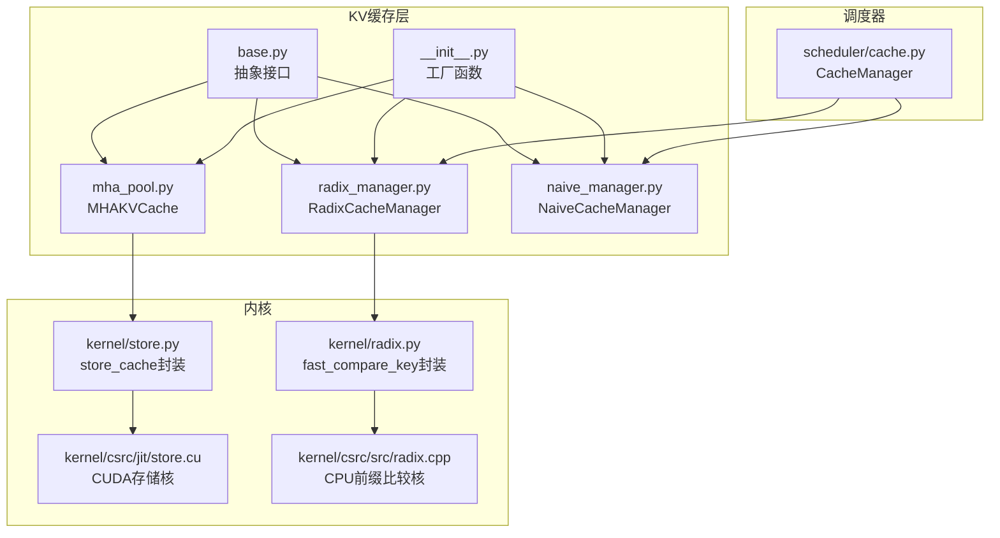
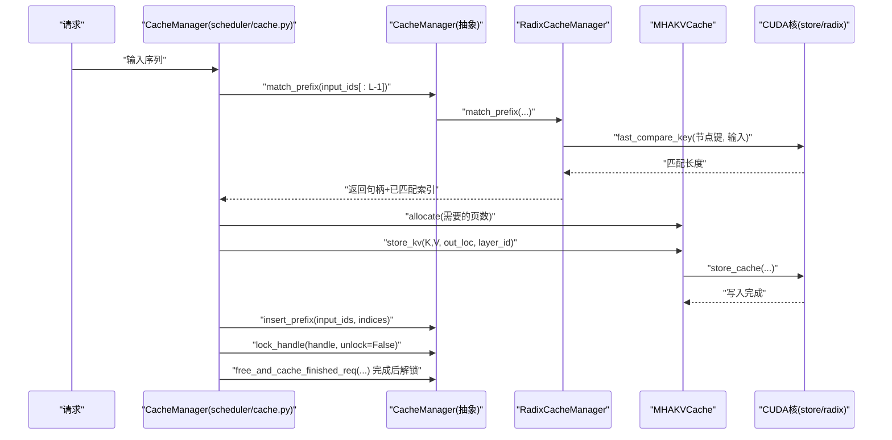
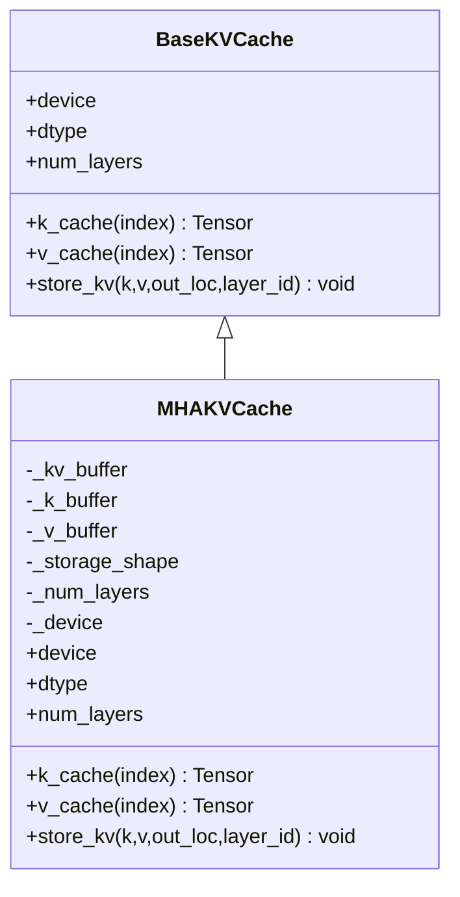
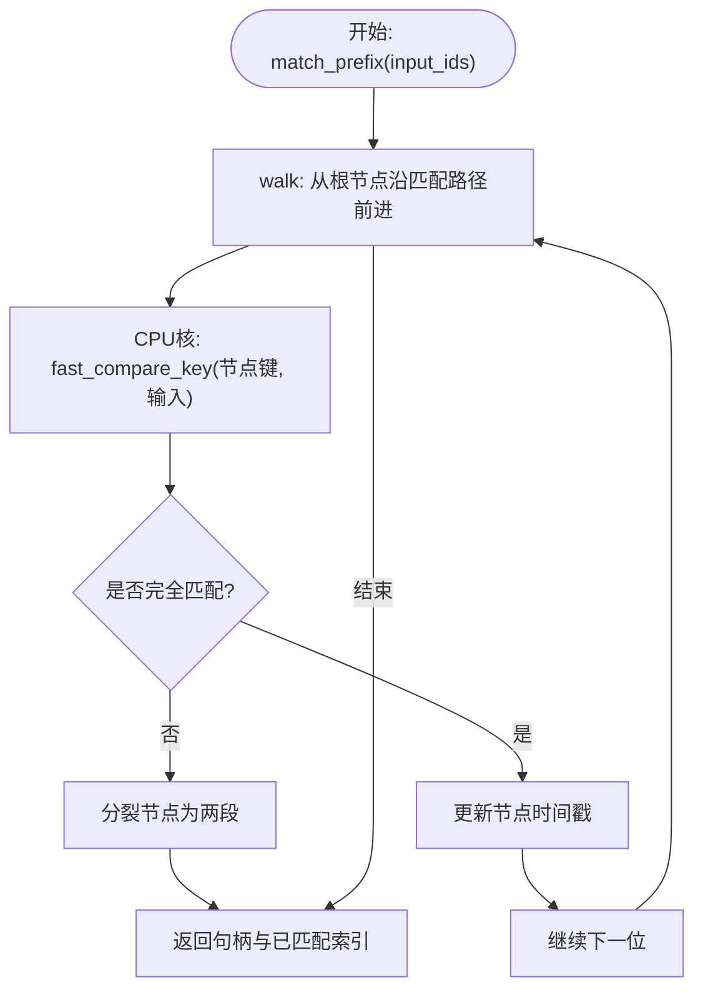
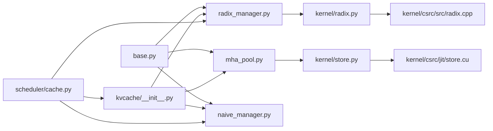

# KV Cache模块详解

<cite>
**本文引用的文件列表**
- [python/minisgl/kvcache/base.py](file://python/minisgl/kvcache/base.py)
- [python/minisgl/kvcache/mha_pool.py](file://python/minisgl/kvcache/mha_pool.py)
- [python/minisgl/kvcache/radix_manager.py](file://python/minisgl/kvcache/radix_manager.py)
- [python/minisgl/kvcache/naive_manager.py](file://python/minisgl/kvcache/naive_manager.py)
- [python/minisgl/kvcache/__init__.py](file://python/minisgl/kvcache/__init__.py)
- [python/minisgl/scheduler/cache.py](file://python/minisgl/scheduler/cache.py)
- [python/minisgl/kernel/store.py](file://python/minisgl/kernel/store.py)
- [python/minisgl/kernel/radix.py](file://python/minisgl/kernel/radix.py)
- [python/minisgl/kernel/csrc/src/radix.cpp](file://python/minisgl/kernel/csrc/src/radix.cpp)
- [python/minisgl/kernel/csrc/jit/store.cu](file://python/minisgl/kernel/csrc/jit/store.cu)
</cite>

## 目录
1. [引言](#引言)
2. [项目结构](#项目结构)
3. [核心组件](#核心组件)
4. [架构总览](#架构总览)
5. [详细组件分析](#详细组件分析)
6. [依赖关系分析](#依赖关系分析)
7. [性能考量](#性能考量)
8. [故障排查指南](#故障排查指南)
9. [结论](#结论)

## 引言
本文件面向KV缓存系统的设计与实现，围绕以下目标展开：
- 抽象接口：梳理BaseKVCache与BaseCacheManager的职责边界与方法契约。
- GPU物理内存管理：详解MHAKVCache如何在GPU上组织与访问KV缓存物理内存。
- 树形缓存管理：深入RadixCacheManager的前缀共享机制与树节点生命周期管理。
- 对比与实践：将Radix与朴素实现NaiveCacheManager进行对比，并结合调度器工作流展示缓存分配、释放与复用的完整过程。

## 项目结构
KV缓存子系统位于python/minisgl/kvcache目录，包含抽象接口、具体实现与工厂函数；配合调度器的CacheManager完成请求级缓存匹配、锁定与回收；底层通过CUDA核函数实现高效存储与前缀比较。

图表来源
- [python/minisgl/kvcache/base.py](file://python/minisgl/kvcache/base.py#L1-L135)
- [python/minisgl/kvcache/mha_pool.py](file://python/minisgl/kvcache/mha_pool.py#L1-L80)
- [python/minisgl/kvcache/radix_manager.py](file://python/minisgl/kvcache/radix_manager.py#L1-L221)
- [python/minisgl/kvcache/naive_manager.py](file://python/minisgl/kvcache/naive_manager.py#L1-L45)
- [python/minisgl/kvcache/__init__.py](file://python/minisgl/kvcache/__init__.py#L1-L66)
- [python/minisgl/scheduler/cache.py](file://python/minisgl/scheduler/cache.py#L1-L71)
- [python/minisgl/kernel/store.py](file://python/minisgl/kernel/store.py#L1-L43)
- [python/minisgl/kernel/radix.py](file://python/minisgl/kernel/radix.py#L1-L21)
- [python/minisgl/kernel/csrc/src/radix.cpp](file://python/minisgl/kernel/csrc/src/radix.cpp#L1-L44)
- [python/minisgl/kernel/csrc/jit/store.cu](file://python/minisgl/kernel/csrc/jit/store.cu#L41-L123)

章节来源
- [python/minisgl/kvcache/base.py](file://python/minisgl/kvcache/base.py#L1-L135)
- [python/minisgl/kvcache/mha_pool.py](file://python/minisgl/kvcache/mha_pool.py#L1-L80)
- [python/minisgl/kvcache/radix_manager.py](file://python/minisgl/kvcache/radix_manager.py#L1-L221)
- [python/minisgl/kvcache/naive_manager.py](file://python/minisgl/kvcache/naive_manager.py#L1-L45)
- [python/minisgl/kvcache/__init__.py](file://python/minisgl/kvcache/__init__.py#L1-L66)
- [python/minisgl/scheduler/cache.py](file://python/minisgl/scheduler/cache.py#L1-L71)
- [python/minisgl/kernel/store.py](file://python/minisgl/kernel/store.py#L1-L43)
- [python/minisgl/kernel/radix.py](file://python/minisgl/kernel/radix.py#L1-L21)
- [python/minisgl/kernel/csrc/src/radix.cpp](file://python/minisgl/kernel/csrc/src/radix.cpp#L1-L44)
- [python/minisgl/kernel/csrc/jit/store.cu](file://python/minisgl/kernel/csrc/jit/store.cu#L41-L123)

## 核心组件
- 抽象接口
  - BaseKVCache：定义K/V访问、写入与设备/类型/层数等属性。
  - BaseCacheManager：定义前缀匹配、句柄锁定/解锁、插入新前缀、驱逐、重置与完整性检查等。
  - SizeInfo：封装可驱逐与受保护大小，用于容量管理。
- 具体实现
  - MHAKVCache：在GPU上以页为单位组织K/V缓冲区，支持“按层优先”或“按页优先”的布局，提供高效写入接口。
  - RadixCacheManager：基于基数树（前缀树）管理共享前缀，通过引用计数与时间戳控制可驱逐范围。
  - NaiveCacheManager：最简实现，不共享前缀，也不支持驱逐。

章节来源
- [python/minisgl/kvcache/base.py](file://python/minisgl/kvcache/base.py#L1-L135)
- [python/minisgl/kvcache/mha_pool.py](file://python/minisgl/kvcache/mha_pool.py#L1-L80)
- [python/minisgl/kvcache/radix_manager.py](file://python/minisgl/kvcache/radix_manager.py#L1-L221)
- [python/minisgl/kvcache/naive_manager.py](file://python/minisgl/kvcache/naive_manager.py#L1-L45)

## 架构总览
KV缓存系统由三层构成：
- 硬件/存储层：MHAKVCache在GPU上维护连续的K/V页式缓冲区，通过CUDA核批量写入。
- 缓存管理层：BaseCacheManager抽象统一接口；RadixCacheManager实现树形共享前缀；NaiveCacheManager提供无共享的基线。
- 调度器集成：CacheManager负责请求级的匹配、锁定、驱逐与回收，协调空闲槽位与缓存索引。

图表来源
- [python/minisgl/scheduler/cache.py](file://python/minisgl/scheduler/cache.py#L1-L71)
- [python/minisgl/kvcache/radix_manager.py](file://python/minisgl/kvcache/radix_manager.py#L116-L164)
- [python/minisgl/kvcache/mha_pool.py](file://python/minisgl/kvcache/mha_pool.py#L56-L68)
- [python/minisgl/kernel/store.py](file://python/minisgl/kernel/store.py#L30-L43)
- [python/minisgl/kernel/radix.py](file://python/minisgl/kernel/radix.py#L18-L20)
- [python/minisgl/kernel/csrc/src/radix.cpp](file://python/minisgl/kernel/csrc/src/radix.cpp#L19-L40)
- [python/minisgl/kernel/csrc/jit/store.cu](file://python/minisgl/kernel/csrc/jit/store.cu#L41-L123)

## 详细组件分析

### 抽象接口：BaseKVCache 与 BaseCacheManager
- BaseKVCache
  - 提供k_cache(index)、v_cache(index)访问器，以及store_kv(k, v, out_loc, layer_id)写入接口。
  - 暴露device、dtype、num_layers等属性，便于上层统一调度。
- BaseCacheManager
  - match_prefix：返回“已匹配前缀长度”与“对应缓存索引序列”，不修改缓存。
  - lock_handle：对句柄加锁/解锁，影响可驱逐区域统计。
  - insert_prefix：将新前缀写入缓存，返回“已存在于缓存中的前缀长度”。
  - evict：驱逐指定大小的缓存，返回被驱逐的索引集合。
  - reset/check_integrity：重置与完整性校验。
  - SizeInfo：对外暴露可驱逐与受保护大小。

章节来源
- [python/minisgl/kvcache/base.py](file://python/minisgl/kvcache/base.py#L1-L135)

### GPU物理内存管理：MHAKVCache
- 布局选择
  - 支持两种布局：PageFirst与LayerFirst。前者将页维置于中间，后者将层维置于中间，均通过视图重塑实现统一访问。
- 分布式切分
  - 通过并行信息获取本地KV头数，按张量并行规模均匀切分，保证每卡只持有局部KV头。
- 写入路径
  - store_kv调用kernel.store_cache，将K/V按索引批量写入到GPU缓冲区。CUDA核根据元素大小与索引类型选择不同模板实例化，确保高吞吐。
- 访问路径
  - k_cache/v_cache按层索引返回对应页级视图，供注意力计算直接使用。

图表来源
- [python/minisgl/kvcache/base.py](file://python/minisgl/kvcache/base.py#L11-L39)
- [python/minisgl/kvcache/mha_pool.py](file://python/minisgl/kvcache/mha_pool.py#L10-L80)

章节来源
- [python/minisgl/kvcache/mha_pool.py](file://python/minisgl/kvcache/mha_pool.py#L1-L80)
- [python/minisgl/kernel/store.py](file://python/minisgl/kernel/store.py#L1-L43)
- [python/minisgl/kernel/csrc/jit/store.cu](file://python/minisgl/kernel/csrc/jit/store.cu#L41-L123)

### 树形缓存管理：RadixCacheManager
- 数据结构
  - RadixTreeNode：每个节点保存“键”（输入ID序列）、“值”（缓存索引序列）、长度、父指针、子映射、引用计数与时间戳。
  - RadixCacheHandle：携带“已匹配长度”与“当前节点”，用于后续插入与锁定。
- 前缀匹配
  - walk过程沿根到叶遍历，按字节比较（CPU侧fast_compare_key）确定最大匹配长度；若不完全匹配则分裂节点。
- 锁定机制
  - lock_handle在句柄对应的路径上递增/递减引用计数，改变可驱逐与受保护大小统计；解锁时若祖先节点ref_count降为0，则将其纳入可驱逐统计。
- 插入新前缀
  - 在walk后剩余未匹配部分作为新叶子插入；新增叶子计入可驱逐大小。
- 驱逐策略
  - 仅从“叶子且ref_count==0”的节点收集候选，使用最小堆按时间戳排序，逐步弹出直至满足目标大小；删除叶子并回溯更新父节点状态。

图表来源
- [python/minisgl/kvcache/radix_manager.py](file://python/minisgl/kvcache/radix_manager.py#L138-L163)
- [python/minisgl/kernel/radix.py](file://python/minisgl/kernel/radix.py#L18-L20)
- [python/minisgl/kernel/csrc/src/radix.cpp](file://python/minisgl/kernel/csrc/src/radix.cpp#L19-L40)

章节来源
- [python/minisgl/kvcache/radix_manager.py](file://python/minisgl/kvcache/radix_manager.py#L1-L221)
- [python/minisgl/kernel/radix.py](file://python/minisgl/kernel/radix.py#L1-L21)
- [python/minisgl/kernel/csrc/src/radix.cpp](file://python/minisgl/kernel/csrc/src/radix.cpp#L1-L44)

### 朴素实现：NaiveCacheManager
- 不共享前缀，每次插入全部长度。
- 不支持驱逐，evict(size>0)会抛出异常。
- 句柄为空，不参与锁定/解锁。

章节来源
- [python/minisgl/kvcache/naive_manager.py](file://python/minisgl/kvcache/naive_manager.py#L1-L45)

### 工厂与调度器集成
- 工厂函数
  - create_kvcache：按类型创建MHAKVCache。
  - create_cache_manager：按字符串类型创建Radix或Naive管理器。
- 调度器CacheManager
  - 维护全局空闲页槽位，结合管理器的size_info与可用空间进行分配。
  - 在请求完成后，将新生成的前缀写入缓存并解锁句柄，同时释放不再使用的旧索引。

章节来源
- [python/minisgl/kvcache/__init__.py](file://python/minisgl/kvcache/__init__.py#L1-L66)
- [python/minisgl/scheduler/cache.py](file://python/minisgl/scheduler/cache.py#L1-L71)

## 依赖关系分析
- 接口与实现
  - BaseKVCache/MHAKVCache：实现K/V读写与布局抽象。
  - BaseCacheManager/RadixCacheManager/NaiveCacheManager：实现前缀管理与驱逐策略。
- 内核依赖
  - store_cache依赖CUDA核store.cu，按元素大小与索引类型模板化执行。
  - fast_compare_key依赖CPU侧radix.cpp，提供高效的前缀比较。
- 调度器耦合
  - CacheManager通过工厂函数选择具体管理器类型，统一处理锁定、驱逐与回收。

图表来源
- [python/minisgl/kvcache/base.py](file://python/minisgl/kvcache/base.py#L1-L135)
- [python/minisgl/kvcache/mha_pool.py](file://python/minisgl/kvcache/mha_pool.py#L1-L80)
- [python/minisgl/kvcache/radix_manager.py](file://python/minisgl/kvcache/radix_manager.py#L1-L221)
- [python/minisgl/kvcache/naive_manager.py](file://python/minisgl/kvcache/naive_manager.py#L1-L45)
- [python/minisgl/kvcache/__init__.py](file://python/minisgl/kvcache/__init__.py#L1-L66)
- [python/minisgl/scheduler/cache.py](file://python/minisgl/scheduler/cache.py#L1-L71)
- [python/minisgl/kernel/store.py](file://python/minisgl/kernel/store.py#L1-L43)
- [python/minisgl/kernel/radix.py](file://python/minisgl/kernel/radix.py#L1-L21)
- [python/minisgl/kernel/csrc/src/radix.cpp](file://python/minisgl/kernel/csrc/src/radix.cpp#L1-L44)
- [python/minisgl/kernel/csrc/jit/store.cu](file://python/minisgl/kernel/csrc/jit/store.cu#L41-L123)

## 性能考量
- 存储写入
  - CUDA核按元素大小模板化，避免分支与重复编译；通过Warp粒度复制提升带宽利用率。
- 前缀比较
  - CPU侧radix.cpp采用连续内存与mismatch算法，减少Python层开销。
- 驱逐策略
  - 使用最小堆按时间戳排序叶子节点，优先驱逐最久未使用且可安全移除的片段，降低碎片与抖动。
- 布局选择
  - PageFirst/LayerFirst布局在不同访问模式下各有优势，需结合注意力计算与页分配策略综合评估。

[本节为通用性能讨论，无需列出具体文件来源]

## 故障排查指南
- 匹配失败或句柄失效
  - 确认句柄在使用前已被锁定；若未锁定，可能在后续操作中被驱逐。
- 驱逐不足
  - 当请求所需页数超过空闲槽位与可驱逐空间之和时，会触发驱逐；若无法满足需求，应检查可驱逐统计与引用计数。
- 写入异常
  - 确保indices与K/V形状一致，且元素大小与数据类型匹配CUDA核参数；核函数内部有严格的张量形状与设备校验。
- 前缀比较错误
  - fast_compare_key要求输入为1D CPU整型张量，类型不匹配会导致运行时校验失败。

章节来源
- [python/minisgl/kvcache/radix_manager.py](file://python/minisgl/kvcache/radix_manager.py#L165-L193)
- [python/minisgl/kernel/store.py](file://python/minisgl/kernel/store.py#L1-L43)
- [python/minisgl/kernel/radix.py](file://python/minisgl/kernel/radix.py#L18-L20)
- [python/minisgl/kernel/csrc/src/radix.cpp](file://python/minisgl/kernel/csrc/src/radix.cpp#L12-L26)

## 结论
- 抽象层清晰：BaseKVCache与BaseCacheManager将硬件与算法解耦，便于替换与扩展。
- GPU写入高效：MHAKVCache结合CUDA核实现批量写入，显著降低主机端同步与拷贝成本。
- 树形共享降低冗余：RadixCacheManager通过前缀共享与引用计数，有效减少重复存储；Naive实现作为对照，凸显共享带来的内存收益。
- 调度器协同：CacheManager在请求生命周期内完成匹配、锁定、驱逐与回收，保障系统稳定与资源利用率。

[本节为总结性内容，无需列出具体文件来源]