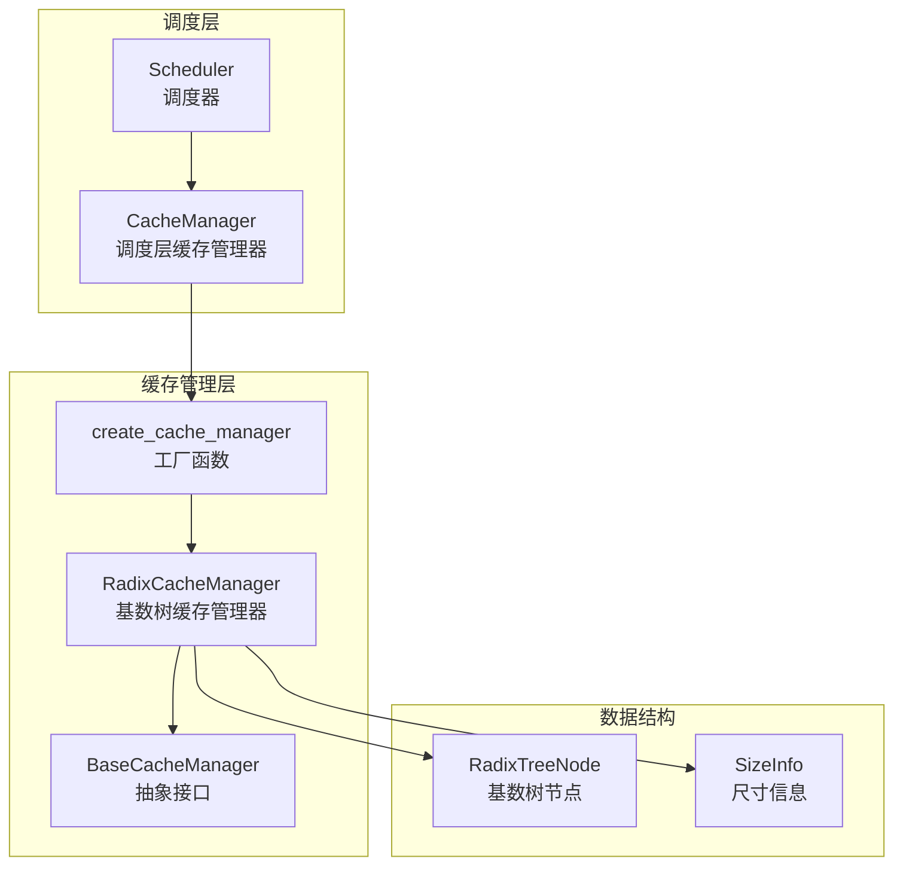
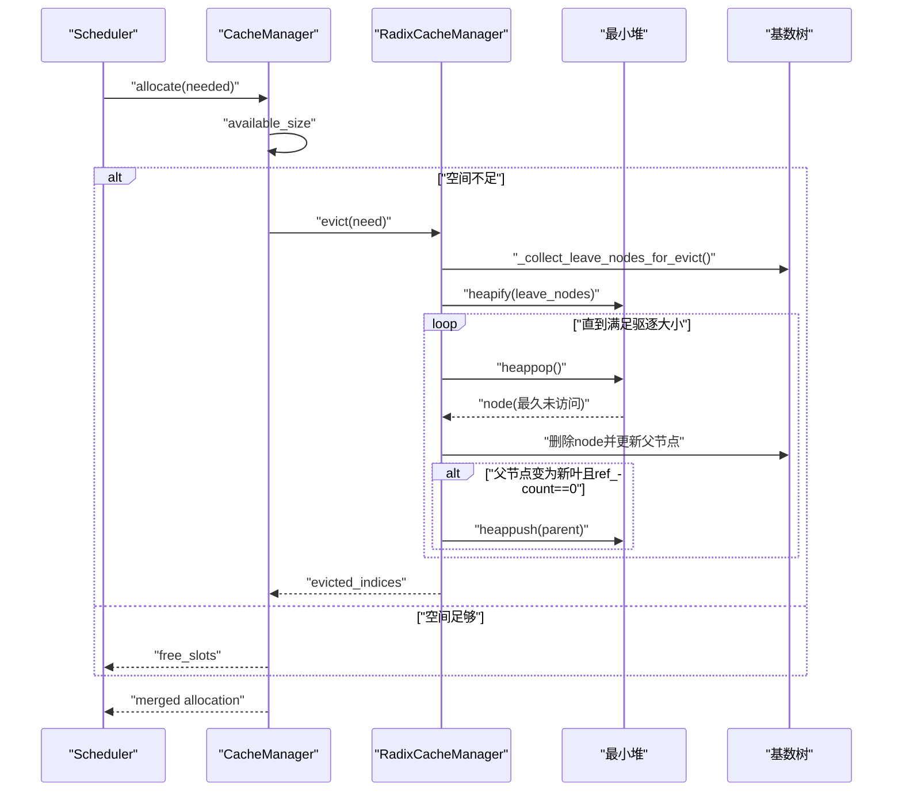
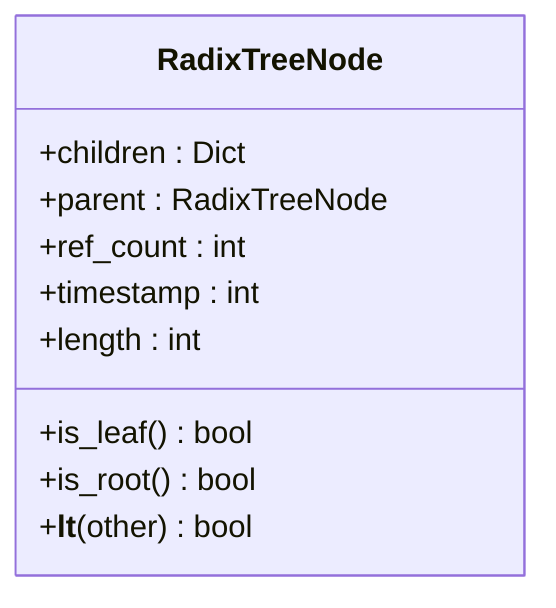
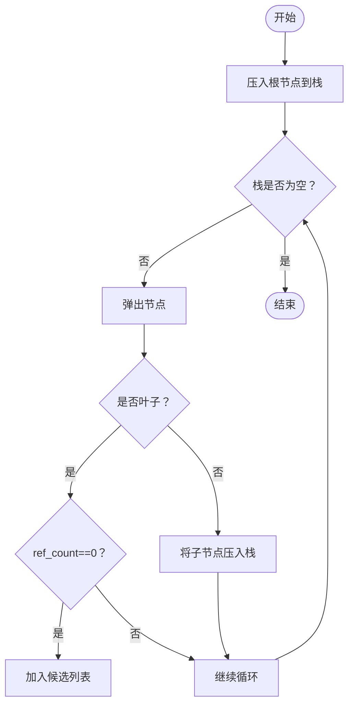
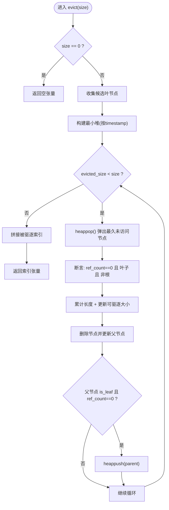
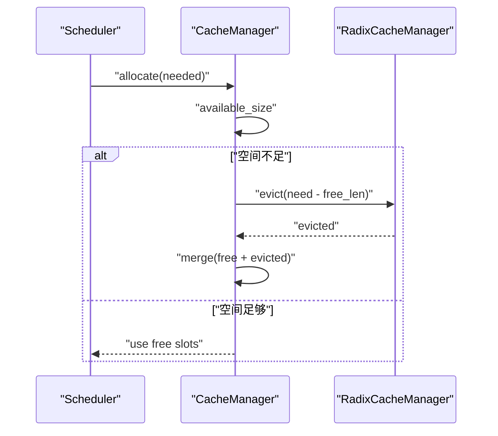
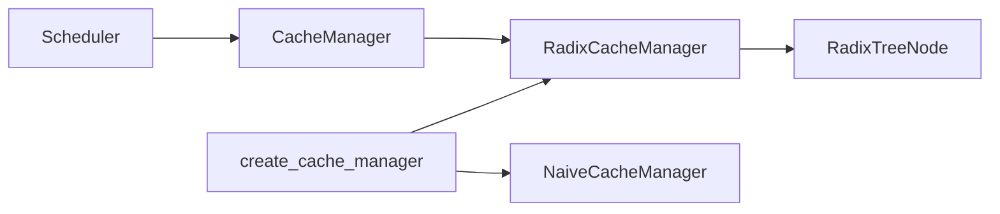

# LRU-like缓存驱逐策略

<cite>
**本文引用的文件**
- [python/minisgl/kvcache/radix_manager.py](file://python/minisgl/kvcache/radix_manager.py)
- [python/minisgl/kvcache/base.py](file://python/minisgl/kvcache/base.py)
- [python/minisgl/kvcache/__init__.py](file://python/minisgl/kvcache/__init__.py)
- [python/minisgl/scheduler/cache.py](file://python/minisgl/scheduler/cache.py)
- [python/minisgl/scheduler/scheduler.py](file://python/minisgl/scheduler/scheduler.py)
</cite>

## 目录
1. [引言](#引言)
2. [项目结构](#项目结构)
3. [核心组件](#核心组件)
4. [架构总览](#架构总览)
5. [详细组件分析](#详细组件分析)
6. [依赖关系分析](#依赖关系分析)
7. [性能考量](#性能考量)
8. [故障排查指南](#故障排查指南)
9. [结论](#结论)

## 引言
本文件围绕“LRU-like缓存驱逐策略”进行深入解析，重点阐述以下内容：
- 如何通过深度优先遍历收集所有引用计数为0的叶节点作为驱逐候选；
- 如何使用最小堆以访问时间戳为键对候选节点排序，优先驱逐最久未访问的节点；
- 驱逐过程中的循环弹出、累计长度与父节点状态更新机制；
- 在保证缓存共享的前提下，如何有效管理有限的GPU内存资源。

该策略由KV缓存管理器实现，结合调度层的分配与完整性检查，形成从“请求匹配—锁定—分配—驱逐—写回”的完整闭环。

## 项目结构
本仓库中与LRU-like驱逐策略直接相关的核心文件如下：
- KV缓存抽象与接口：定义了缓存管理器的统一接口与尺寸信息结构
- 基于基数树的缓存管理器：实现LRU-like驱逐的具体逻辑
- 缓存工厂：根据类型选择具体缓存管理器实例
- 调度层缓存管理器：封装底层缓存管理器，负责可用空间计算与驱逐触发
- 调度器：驱动整体流程，调用缓存分配并触发必要时的驱逐

图表来源
- [python/minisgl/scheduler/scheduler.py](file://python/minisgl/scheduler/scheduler.py#L80-L108)
- [python/minisgl/scheduler/cache.py](file://python/minisgl/scheduler/cache.py#L12-L19)
- [python/minisgl/kvcache/__init__.py](file://python/minisgl/kvcache/__init__.py#L44-L55)
- [python/minisgl/kvcache/radix_manager.py](file://python/minisgl/kvcache/radix_manager.py#L87-L120)
- [python/minisgl/kvcache/base.py](file://python/minisgl/kvcache/base.py#L55-L134)

章节来源
- [python/minisgl/scheduler/scheduler.py](file://python/minisgl/scheduler/scheduler.py#L80-L108)
- [python/minisgl/scheduler/cache.py](file://python/minisgl/scheduler/cache.py#L12-L19)
- [python/minisgl/kvcache/__init__.py](file://python/minisgl/kvcache/__init__.py#L44-L55)
- [python/minisgl/kvcache/radix_manager.py](file://python/minisgl/kvcache/radix_manager.py#L87-L120)
- [python/minisgl/kvcache/base.py](file://python/minisgl/kvcache/base.py#L55-L134)

## 核心组件
- 基数树节点 RadixTreeNode
  - 维护子节点映射、父节点指针、引用计数、键值张量、长度、时间戳等字段
  - 提供叶子判断、根节点判断、比较运算符（基于时间戳）
- 基数树缓存管理器 RadixCacheManager
  - 实现匹配前缀、插入前缀、锁定/解锁句柄、驱逐、尺寸信息查询与完整性检查
  - 内部维护可驱逐大小与受保护大小，使用最小堆按时间戳排序候选叶节点
- 缓存工厂 create_cache_manager
  - 根据类型返回具体缓存管理器实例（当前支持radix与naive）
- 调度层缓存管理器 CacheManager
  - 封装底层缓存管理器，提供可用空间计算、锁定/解锁、分配与驱逐触发
- 调度器 Scheduler
  - 初始化各管理器，驱动批处理准备阶段，调用缓存分配并触发必要时的驱逐

章节来源
- [python/minisgl/kvcache/radix_manager.py](file://python/minisgl/kvcache/radix_manager.py#L13-L80)
- [python/minisgl/kvcache/radix_manager.py](file://python/minisgl/kvcache/radix_manager.py#L87-L120)
- [python/minisgl/kvcache/radix_manager.py](file://python/minisgl/kvcache/radix_manager.py#L165-L193)
- [python/minisgl/kvcache/radix_manager.py](file://python/minisgl/kvcache/radix_manager.py#L194-L207)
- [python/minisgl/kvcache/__init__.py](file://python/minisgl/kvcache/__init__.py#L44-L55)
- [python/minisgl/scheduler/cache.py](file://python/minisgl/scheduler/cache.py#L12-L71)
- [python/minisgl/scheduler/scheduler.py](file://python/minisgl/scheduler/scheduler.py#L80-L108)

## 架构总览
LRU-like驱逐策略贯穿调度层与缓存管理层：
- 请求进入调度器后，由调度层缓存管理器计算可用空间
- 当可用空间不足时，触发底层缓存管理器的evict方法
- evict内部通过深度优先遍历收集所有引用计数为0的叶节点，构建最小堆
- 循环弹出最久未访问的节点，累计长度直至满足驱逐需求
- 驱逐后更新父节点状态，若父节点因此变为新的可驱逐叶节点，则重新入堆
- 最终返回被驱逐的索引张量，调度层合并空闲槽位与驱逐结果完成分配

图表来源
- [python/minisgl/scheduler/cache.py](file://python/minisgl/scheduler/cache.py#L39-L52)
- [python/minisgl/kvcache/radix_manager.py](file://python/minisgl/kvcache/radix_manager.py#L165-L193)
- [python/minisgl/kvcache/radix_manager.py](file://python/minisgl/kvcache/radix_manager.py#L194-L207)

## 详细组件分析

### 组件A：基数树节点与LRU时间戳
- 关键点
  - 时间戳字段用于LRU排序；每次访问命中会更新节点时间戳
  - 叶子节点与根节点的判定用于筛选可驱逐候选与保护根节点
  - 比较运算符基于时间戳，使最小堆能按“最久未访问”排序
- 复杂度
  - 访问路径更新时间戳为O(路径长度)，比较运算为O(1)
  - 叶子判定与根节点判定均为O(1)

图表来源
- [python/minisgl/kvcache/radix_manager.py](file://python/minisgl/kvcache/radix_manager.py#L13-L80)

章节来源
- [python/minisgl/kvcache/radix_manager.py](file://python/minisgl/kvcache/radix_manager.py#L13-L80)

### 组件B：深度优先收集候选叶节点
- 策略说明
  - 从根节点开始，使用栈式深度优先遍历
  - 对每个节点：若为叶子且引用计数为0，则加入候选列表
  - 若非叶子，将其子节点压入栈继续遍历
- 复杂度
  - 时间复杂度O(N)，N为树中节点总数
  - 空间复杂度O(B)，B为分支因子的最大值（栈深）

图表来源
- [python/minisgl/kvcache/radix_manager.py](file://python/minisgl/kvcache/radix_manager.py#L194-L207)

章节来源
- [python/minisgl/kvcache/radix_manager.py](file://python/minisgl/kvcache/radix_manager.py#L194-L207)

### 组件C：LRU-like驱逐主流程（evict）
- 策略说明
  - 输入：请求驱逐大小size
  - 步骤：
    1) 收集候选叶节点
    2) 构建最小堆（以时间戳为键）
    3) 循环弹出最久未访问节点，累加长度至满足size
    4) 删除节点并更新父节点；若父节点变为新的可驱逐叶节点（叶子且ref_count==0），则重新入堆
    5) 返回被驱逐的索引张量
- 边界与断言
  - 当size==0时直接返回空张量
  - 断言请求驱逐大小不超过可驱逐大小
  - 断言堆非空且弹出节点满足ref_count==0且为叶子且非根节点
- 复杂度
  - 建堆：O(K)，K为候选叶节点数量
  - 弹出与重入：均摊O(log K)
  - 总体：O(K log K + S)，S为实际驱逐节点数

图表来源
- [python/minisgl/kvcache/radix_manager.py](file://python/minisgl/kvcache/radix_manager.py#L165-L193)

章节来源
- [python/minisgl/kvcache/radix_manager.py](file://python/minisgl/kvcache/radix_manager.py#L165-L193)

### 组件D：调度层的可用空间与驱逐触发
- 关键点
  - 可用空间 = 底层缓存管理器的可驱逐大小 + 当前空闲槽位
  - 分配时若空间不足，调用底层缓存管理器的evict，再与空闲槽位合并
  - 完成分配后，对已完成请求进行缓存写回与句柄解锁
- 复杂度
  - 主要开销在evict与张量拼接，整体为O(E)，E为被驱逐节点数

图表来源
- [python/minisgl/scheduler/cache.py](file://python/minisgl/scheduler/cache.py#L39-L52)
- [python/minisgl/scheduler/cache.py](file://python/minisgl/scheduler/cache.py#L54-L63)

章节来源
- [python/minisgl/scheduler/cache.py](file://python/minisgl/scheduler/cache.py#L39-L63)

### 组件E：接口契约与尺寸信息
- 接口契约
  - BaseCacheManager定义了匹配前缀、锁定/解锁、插入前缀、驱逐、尺寸信息与完整性检查等抽象方法
  - SizeInfo包含可驱逐大小与受保护大小，提供总大小属性
- 设计意义
  - 通过抽象接口隔离不同缓存实现（如radix与naive），便于扩展与替换
  - 尺寸信息为调度层提供决策依据，避免越界分配

章节来源
- [python/minisgl/kvcache/base.py](file://python/minisgl/kvcache/base.py#L55-L134)

## 依赖关系分析
- 工厂函数 create_cache_manager
  - 根据类型选择RadixCacheManager或NaiveCacheManager
  - 为调度层提供统一入口，隐藏具体实现细节
- 调度器与缓存管理器
  - 调度器初始化时创建表管理器、缓存管理器与解码管理器
  - 批次准备阶段调用缓存分配，必要时触发驱逐
- 缓存管理器与基数树
  - 调度层缓存管理器持有底层缓存管理器实例
  - 底层缓存管理器内部维护基数树结构与节点时间戳

图表来源
- [python/minisgl/kvcache/__init__.py](file://python/minisgl/kvcache/__init__.py#L44-L55)
- [python/minisgl/scheduler/scheduler.py](file://python/minisgl/scheduler/scheduler.py#L80-L108)
- [python/minisgl/scheduler/cache.py](file://python/minisgl/scheduler/cache.py#L12-L19)
- [python/minisgl/kvcache/radix_manager.py](file://python/minisgl/kvcache/radix_manager.py#L87-L120)

章节来源
- [python/minisgl/kvcache/__init__.py](file://python/minisgl/kvcache/__init__.py#L44-L55)
- [python/minisgl/scheduler/scheduler.py](file://python/minisgl/scheduler/scheduler.py#L80-L108)
- [python/minisgl/scheduler/cache.py](file://python/minisgl/scheduler/cache.py#L12-L19)
- [python/minisgl/kvcache/radix_manager.py](file://python/minisgl/kvcache/radix_manager.py#L87-L120)

## 性能考量
- 时间复杂度
  - 候选收集：O(N)
  - 建堆：O(K)
  - 驱逐循环：O(E log K)，E为实际驱逐节点数
  - 合并与张量操作：O(E)
- 空间复杂度
  - 候选列表与堆占用O(K)
  - 节点遍历栈深约为O(B)，B为最大分支因子
- 优化建议
  - 控制基数树深度，减少N与K规模
  - 在高频驱逐场景下，考虑批量收集与延迟建堆
  - 使用更细粒度的时间戳更新策略，避免频繁重建堆

## 故障排查指南
- 常见错误与定位
  - “无法驱逐足够的缓存”：evict循环断言失败，通常表示候选不足或节点状态异常
  - “请求驱逐大小超过可驱逐大小”：调用方传参错误或尺寸信息统计异常
  - “完整性检查失败”：调度层缓存管理器在分配后校验空闲槽位与总尺寸不一致
- 排查步骤
  - 检查evict入口参数与可驱逐大小统计
  - 核对候选收集逻辑，确认叶子节点与引用计数条件
  - 检查父节点状态更新与堆重入逻辑
  - 运行完整性检查，定位索引拼接与释放流程问题

章节来源
- [python/minisgl/kvcache/radix_manager.py](file://python/minisgl/kvcache/radix_manager.py#L165-L193)
- [python/minisgl/scheduler/cache.py](file://python/minisgl/scheduler/cache.py#L64-L71)

## 结论
本LRU-like驱逐策略通过“深度优先收集+最小堆排序+父节点状态联动”的组合，在保证缓存共享与根节点保护的前提下，实现了面向GPU内存的高效回收。其核心优势在于：
- 以时间戳为键的LRU排序，优先驱逐最久未访问的叶节点
- 候选节点仅限于引用计数为0且为叶子，避免误删活跃节点
- 父节点变为新可驱逐叶节点时自动重入堆，提升回收效率
- 调度层与缓存层职责清晰，接口抽象良好，便于扩展其他缓存实现