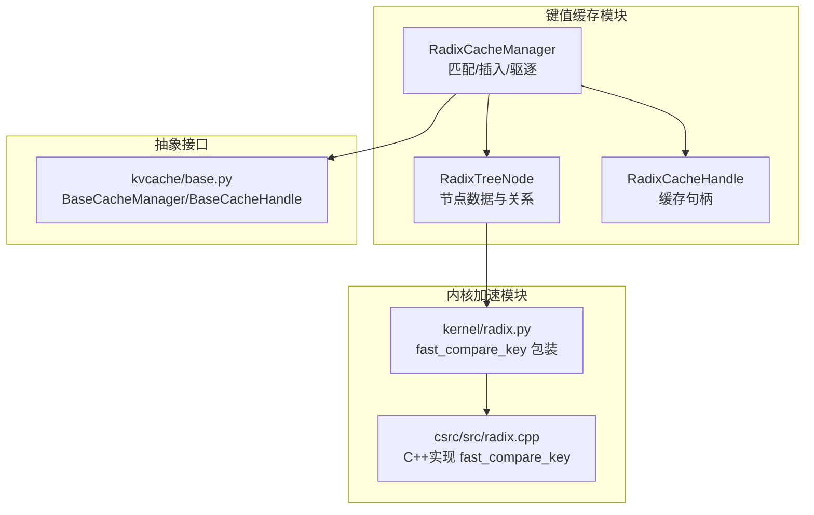
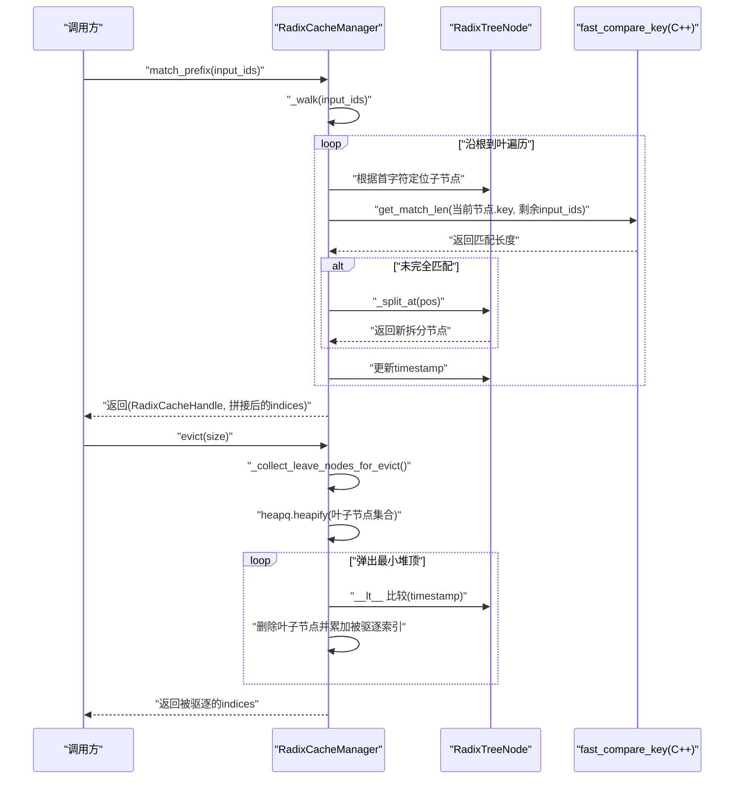
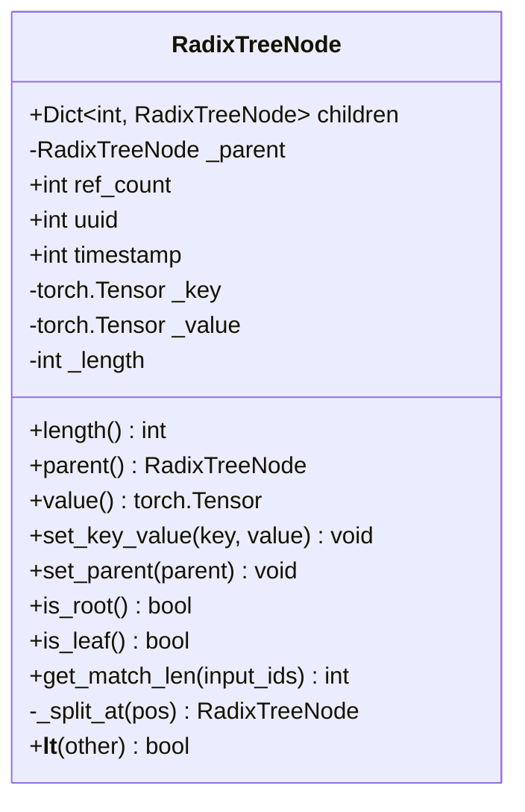
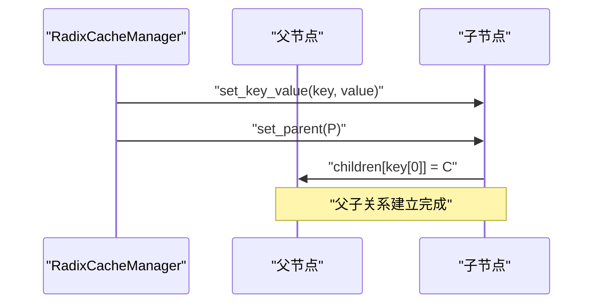
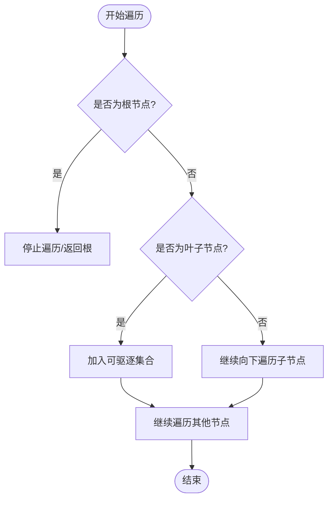
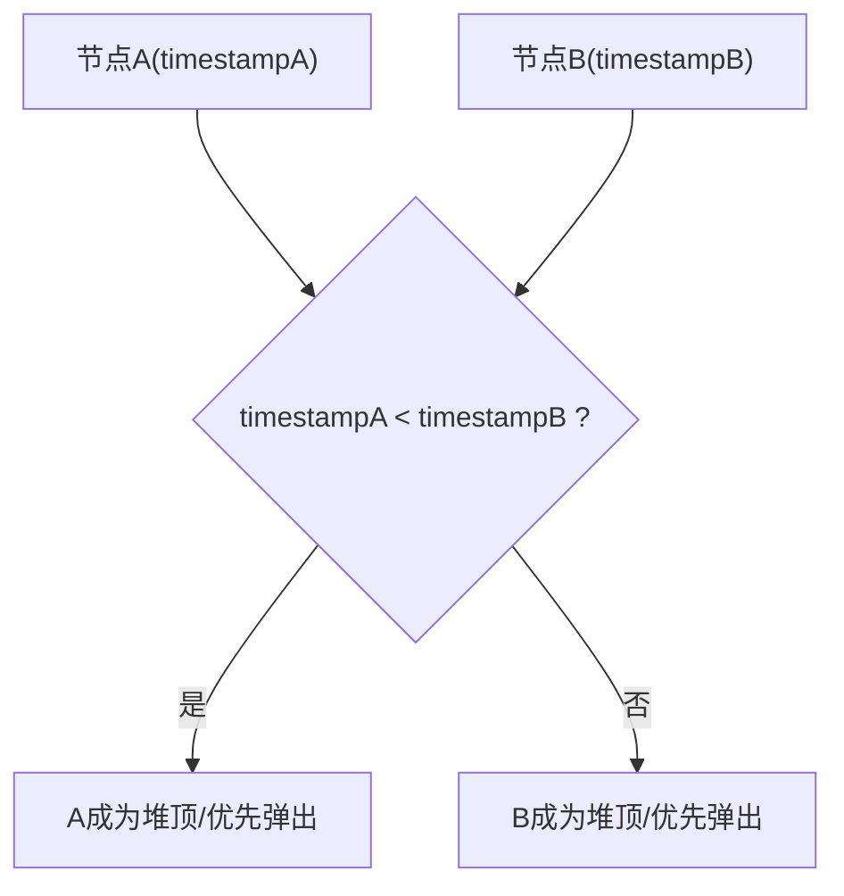
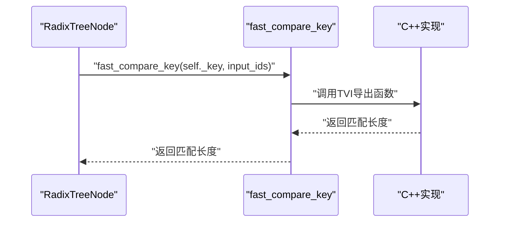
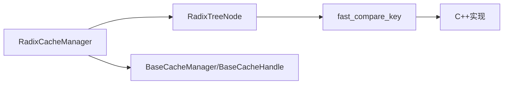

# Radix树节点结构

<cite>
**本文引用的文件**
- [python/minisgl/kvcache/radix_manager.py](file://python/minisgl/kvcache/radix_manager.py)
- [python/minisgl/kernel/radix.py](file://python/minisgl/kernel/radix.py)
- [python/minisgl/kernel/csrc/src/radix.cpp](file://python/minisgl/kernel/csrc/src/radix.cpp)
- [python/minisgl/kvcache/base.py](file://python/minisgl/kvcache/base.py)
</cite>

## 目录
1. [简介](#简介)
2. [项目结构](#项目结构)
3. [核心组件](#核心组件)
4. [架构总览](#架构总览)
5. [详细组件分析](#详细组件分析)
6. [依赖分析](#依赖分析)
7. [性能考量](#性能考量)
8. [故障排查指南](#故障排查指南)
9. [结论](#结论)

## 简介
本文件围绕 Radix 树节点类 RadixTreeNode 的设计与实现进行系统化解析，重点说明以下方面：
- 核心字段：children 字典用于构建树形结构；ref_count 引用计数用于内存保护；timestamp 时间戳用于 LRU 驱逐策略；_key 和 _value 分别存储输入 ID 序列与对应的物理缓存索引；length 属性动态返回节点序列长度；parent 属性通过安全访问器保证非空性。
- 初始化与关系建立：set_key_value 与 set_parent 方法如何初始化节点数据并建立父子关系。
- 遍历辅助：is_root 与 is_leaf 在树遍历中的作用。
- 排序与驱逐：__lt__ 魔术方法如何支持节点在最小堆中的排序，为驱逐策略提供基础。

## 项目结构
Radix 树相关的核心实现位于键值缓存模块中，RadixTreeNode 是该模块的关键数据结构，配合 RadixCacheManager 实现前缀匹配、插入与驱逐等操作。

图表来源
- [python/minisgl/kvcache/radix_manager.py](file://python/minisgl/kvcache/radix_manager.py#L13-L80)
- [python/minisgl/kernel/radix.py](file://python/minisgl/kernel/radix.py#L1-L21)
- [python/minisgl/kernel/csrc/src/radix.cpp](file://python/minisgl/kernel/csrc/src/radix.cpp#L1-L45)
- [python/minisgl/kvcache/base.py](file://python/minisgl/kvcache/base.py#L50-L135)

章节来源
- [python/minisgl/kvcache/radix_manager.py](file://python/minisgl/kvcache/radix_manager.py#L1-L220)
- [python/minisgl/kernel/radix.py](file://python/minisgl/kernel/radix.py#L1-L21)
- [python/minisgl/kernel/csrc/src/radix.cpp](file://python/minisgl/kernel/csrc/src/radix.cpp#L1-L45)
- [python/minisgl/kvcache/base.py](file://python/minisgl/kvcache/base.py#L1-L135)

## 核心组件
- RadixTreeNode：Radix 树的节点对象，承载子节点映射、父节点指针、引用计数、时间戳、键值序列与长度等信息。
- RadixCacheManager：基于 Radix 树的缓存管理器，负责前缀匹配、插入、锁定/解锁、驱逐与尺寸统计。
- RadixCacheHandle：对缓存命中结果的轻量封装，携带已匹配长度与对应节点。
- fast_compare_key：内核侧 C++ 加速函数，用于高效比较两个一维整型 CPU 张量的最长公共前缀长度。

章节来源
- [python/minisgl/kvcache/radix_manager.py](file://python/minisgl/kvcache/radix_manager.py#L13-L80)
- [python/minisgl/kernel/radix.py](file://python/minisgl/kernel/radix.py#L1-L21)
- [python/minisgl/kvcache/base.py](file://python/minisgl/kvcache/base.py#L50-L135)

## 架构总览
下图展示了 Radix 树节点与管理器之间的交互，以及驱逐流程中最小堆的使用。

图表来源
- [python/minisgl/kvcache/radix_manager.py](file://python/minisgl/kvcache/radix_manager.py#L116-L193)
- [python/minisgl/kernel/radix.py](file://python/minisgl/kernel/radix.py#L18-L21)
- [python/minisgl/kernel/csrc/src/radix.cpp](file://python/minisgl/kernel/csrc/src/radix.cpp#L19-L45)

## 详细组件分析

### RadixTreeNode 类设计与字段语义
- children：字典，键为首个 ID（int），值为子节点，用于构建多叉树结构。
- _parent：父节点引用，None 表示根节点。
- ref_count：引用计数，用于保护节点不被驱逐；根节点初始即受保护。
- uuid：全局自增标识，便于调试与追踪。
- timestamp：最近访问时间戳，用于 LRU 驱逐策略。
- _key/_value：分别保存该节点对应的输入 ID 序列与物理缓存索引张量；_length 记录长度。
- length：只读属性，返回当前节点序列长度。
- parent：只读属性，断言非空后返回父节点，确保上层逻辑不会误用空父指针。
- value：只读属性，返回该节点的物理缓存索引张量。

初始化与关系建立：
- set_key_value：设置 _key、_value 与 _length，要求两者长度一致。
- set_parent：设置 _parent 并将自身注册到父节点的 children 中，键为 _key[0]。

遍历辅助方法：
- is_root：判断是否为根节点。
- is_leaf：判断是否为叶子节点。
- get_match_len：调用 fast_compare_key 计算与输入序列的最长匹配长度。

分裂与排序：
- _split_at：在指定位置拆分节点，创建新节点并调整父子关系与引用计数。
- __lt__：按 timestamp 进行比较，使节点可作为最小堆元素参与 LRU 驱逐。

图表来源
- [python/minisgl/kvcache/radix_manager.py](file://python/minisgl/kvcache/radix_manager.py#L13-L80)

章节来源
- [python/minisgl/kvcache/radix_manager.py](file://python/minisgl/kvcache/radix_manager.py#L13-L80)

### set_key_value 与 set_parent 的初始化与关系建立
- set_key_value 负责将节点的键序列与值序列绑定，并记录长度；随后在插入或拆分时由管理器调用以完成节点数据初始化。
- set_parent 负责建立父子关系：设置 _parent 后，将当前节点注册到父节点的 children 中，键为 _key[0]，从而形成树形拓扑。

图表来源
- [python/minisgl/kvcache/radix_manager.py](file://python/minisgl/kvcache/radix_manager.py#L29-L38)

章节来源
- [python/minisgl/kvcache/radix_manager.py](file://python/minisgl/kvcache/radix_manager.py#L29-L38)

### is_root 与 is_leaf 在树遍历中的作用
- is_root：用于判断当前节点是否为根节点，常用于循环终止条件或路径回溯。
- is_leaf：用于判定是否到达叶子节点，以便在驱逐阶段收集可驱逐的叶子节点集合。

图表来源
- [python/minisgl/kvcache/radix_manager.py](file://python/minisgl/kvcache/radix_manager.py#L194-L207)

章节来源
- [python/minisgl/kvcache/radix_manager.py](file://python/minisgl/kvcache/radix_manager.py#L194-L207)

### __lt__ 魔术方法与最小堆排序
- __lt__ 基于 timestamp 比较，使得 RadixTreeNode 可以直接放入最小堆；在驱逐过程中，最小堆会优先弹出最久未访问的叶子节点，实现 LRU 驱逐。

图表来源
- [python/minisgl/kvcache/radix_manager.py](file://python/minisgl/kvcache/radix_manager.py#L78-L80)

章节来源
- [python/minisgl/kvcache/radix_manager.py](file://python/minisgl/kvcache/radix_manager.py#L78-L80)

### get_match_len 与 fast_compare_key 的协作
- get_match_len 调用 fast_compare_key，后者由 C++ 实现，对两个一维整型 CPU 张量进行高效比较，返回最长公共前缀长度。
- 该比较结果决定是否需要拆分节点或继续向下遍历。

图表来源
- [python/minisgl/kvcache/radix_manager.py](file://python/minisgl/kvcache/radix_manager.py#L58-L63)
- [python/minisgl/kernel/radix.py](file://python/minisgl/kernel/radix.py#L18-L21)
- [python/minisgl/kernel/csrc/src/radix.cpp](file://python/minisgl/kernel/csrc/src/radix.cpp#L19-L45)

章节来源
- [python/minisgl/kvcache/radix_manager.py](file://python/minisgl/kvcache/radix_manager.py#L58-L63)
- [python/minisgl/kernel/radix.py](file://python/minisgl/kernel/radix.py#L18-L21)
- [python/minisgl/kernel/csrc/src/radix.cpp](file://python/minisgl/kernel/csrc/src/radix.cpp#L19-L45)

## 依赖分析
- 内部依赖
  - RadixCacheManager 依赖 RadixTreeNode 完成树的构建与维护。
  - RadixTreeNode 依赖 fast_compare_key 执行高效的前缀匹配。
- 外部依赖
  - fast_compare_key 通过 TVM FFI 导出，底层实现为 C++，对一维 CPU 整型张量进行逐元素比较。
- 接口契约
  - BaseCacheManager/BaseCacheHandle 提供统一的缓存管理接口，RadixCacheManager/RadixCacheHandle 实现具体行为。

图表来源
- [python/minisgl/kvcache/radix_manager.py](file://python/minisgl/kvcache/radix_manager.py#L13-L80)
- [python/minisgl/kernel/radix.py](file://python/minisgl/kernel/radix.py#L1-L21)
- [python/minisgl/kernel/csrc/src/radix.cpp](file://python/minisgl/kernel/csrc/src/radix.cpp#L1-L45)
- [python/minisgl/kvcache/base.py](file://python/minisgl/kvcache/base.py#L50-L135)

章节来源
- [python/minisgl/kvcache/radix_manager.py](file://python/minisgl/kvcache/radix_manager.py#L13-L80)
- [python/minisgl/kernel/radix.py](file://python/minisgl/kernel/radix.py#L1-L21)
- [python/minisgl/kernel/csrc/src/radix.cpp](file://python/minisgl/kernel/csrc/src/radix.cpp#L1-L45)
- [python/minisgl/kvcache/base.py](file://python/minisgl/kvcache/base.py#L50-L135)

## 性能考量
- O(1) 子节点查找：children 使用首 ID 作为键，平均 O(1) 查找子节点，降低遍历成本。
- 前缀匹配加速：fast_compare_key 采用 C++ 实现，避免 Python 循环开销，提升匹配效率。
- LRU 驱逐：通过最小堆按 timestamp 排序，O(log n) 插入与弹出，批量驱逐时整体复杂度与待驱逐节点数量相关。
- 引用计数保护：根节点与被锁住的节点不会被驱逐，减少不必要的删除与重建。

## 故障排查指南
- 断言失败
  - parent 属性断言：若访问 parent 且 _parent 为空，将触发断言错误。请确认节点不是根节点或在调用前检查 is_root。
  - set_key_value 长度断言：当 _key 与 _value 长度不一致时会触发断言错误。请在调用前校验输入。
- 驱逐异常
  - 当请求驱逐大小超过可驱逐总量时，evict 将抛出异常。请先查询 size_info 并合理规划驱逐规模。
  - 若最小堆为空但仍需继续驱逐，将触发断言错误。请检查叶子节点收集逻辑与引用计数状态。
- 匹配异常
  - _walk 过程中若无法找到子节点，将返回当前位置与已匹配长度。请确认输入 ID 序列与缓存内容一致。

章节来源
- [python/minisgl/kvcache/radix_manager.py](file://python/minisgl/kvcache/radix_manager.py#L43-L47)
- [python/minisgl/kvcache/radix_manager.py](file://python/minisgl/kvcache/radix_manager.py#L29-L34)
- [python/minisgl/kvcache/radix_manager.py](file://python/minisgl/kvcache/radix_manager.py#L165-L193)
- [python/minisgl/kvcache/radix_manager.py](file://python/minisgl/kvcache/radix_manager.py#L138-L163)

## 结论
RadixTreeNode 通过 children、_parent、ref_count、timestamp、_key、_value 与 _length 等字段，构建了高效的 Radix 树节点模型。set_key_value 与 set_parent 负责初始化与建立父子关系；is_root 与 is_leaf 支撑树遍历；__lt__ 提供 LRU 驱逐所需的排序能力。结合 fast_compare_key 的内核加速，RadixCacheManager 能够在大规模序列匹配与缓存管理场景中取得良好性能与稳定性。