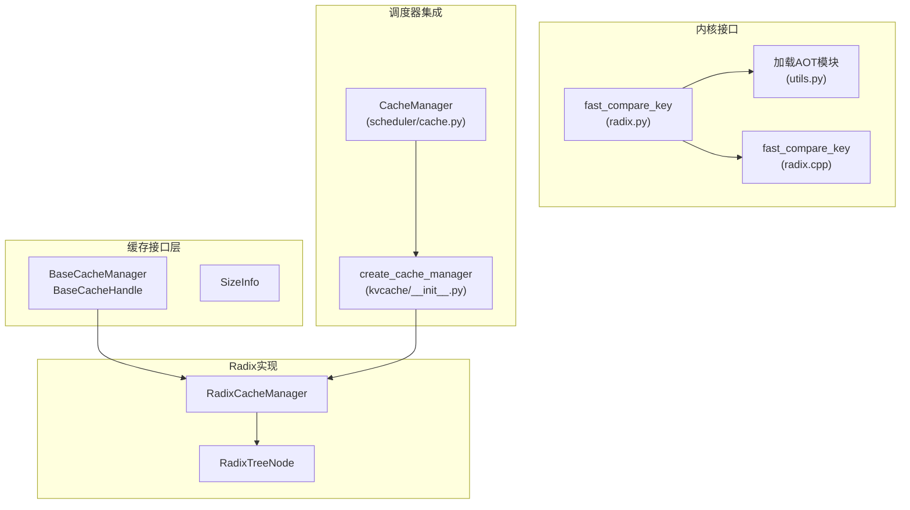
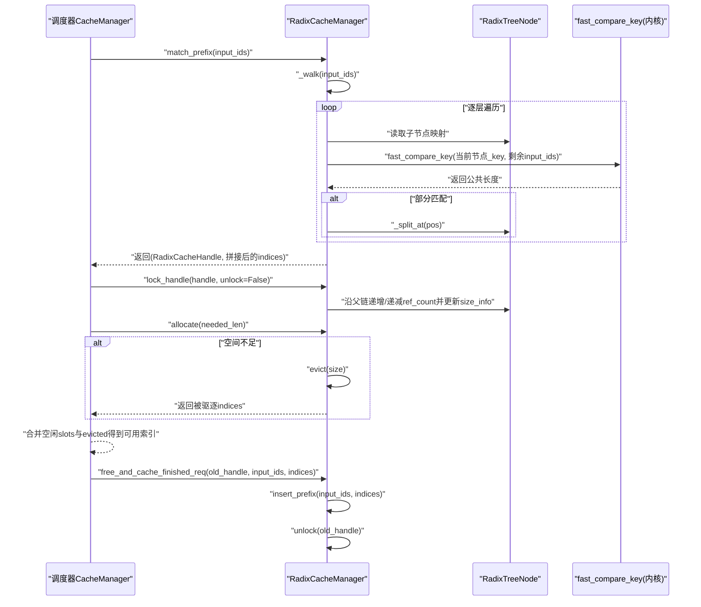
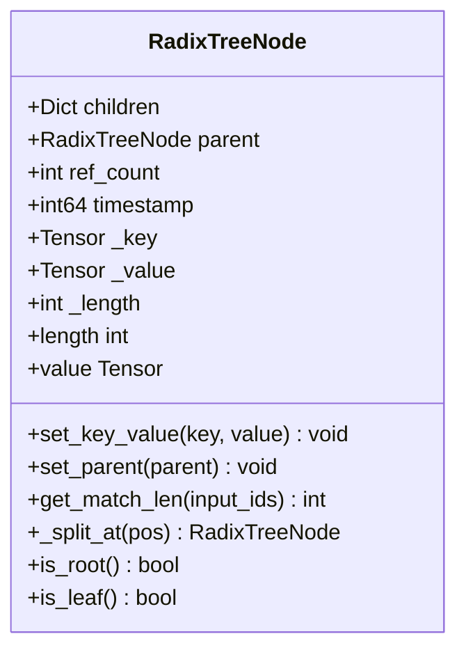
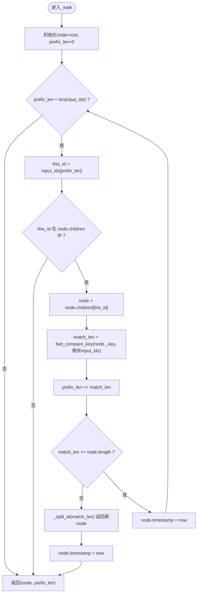
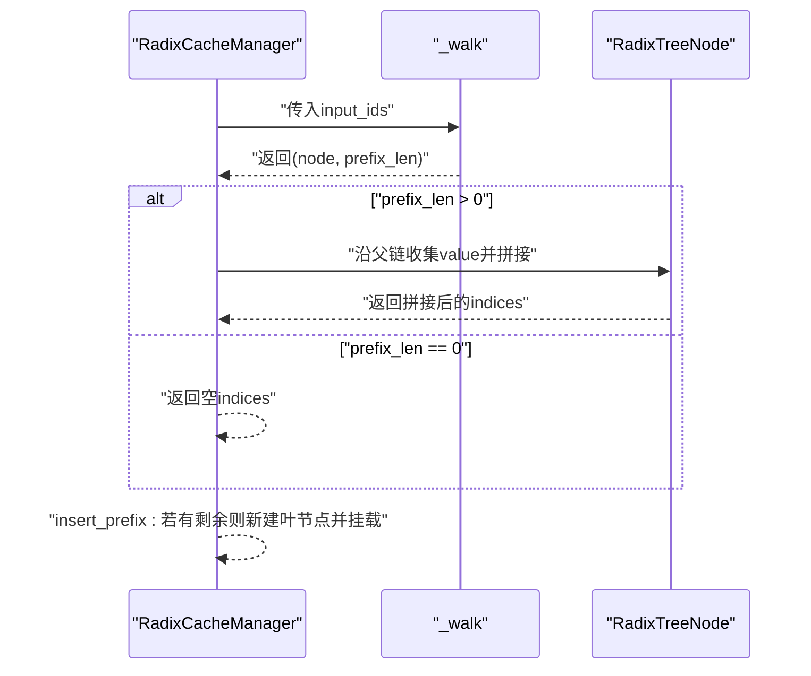
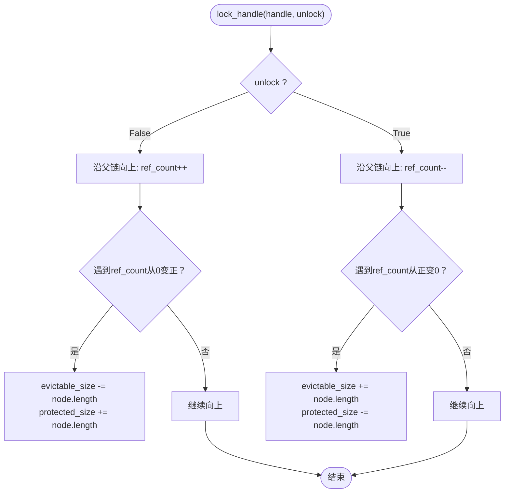
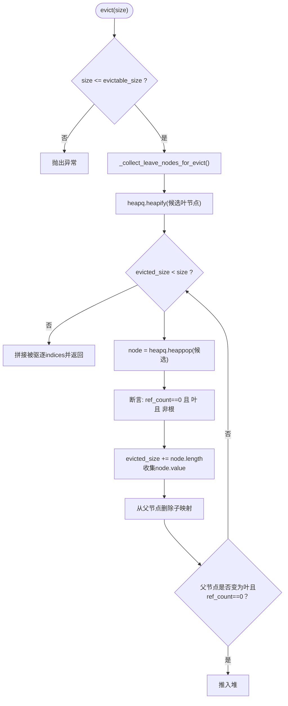
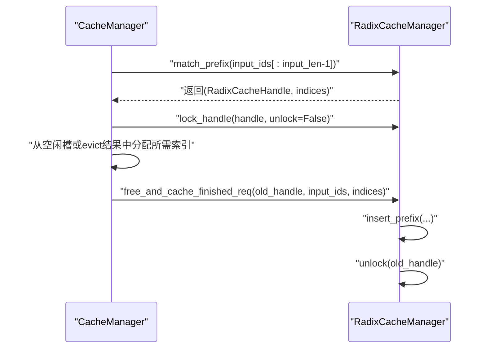
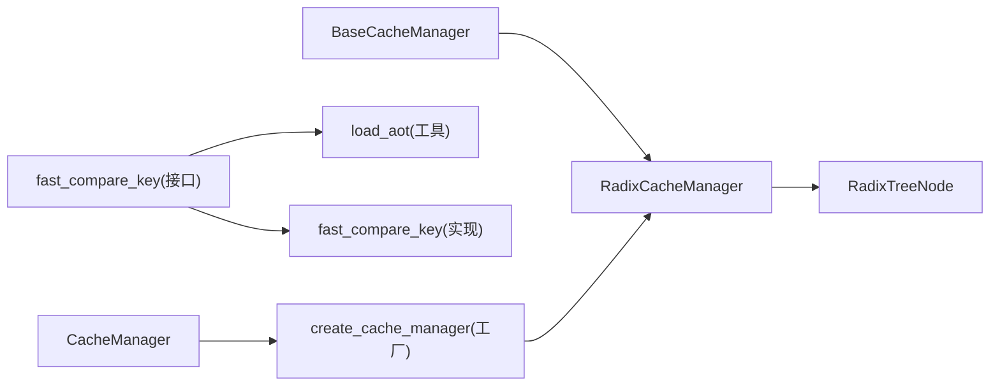

# Radix缓存管理器

<cite>
**本文引用的文件**
- [radix_manager.py](file://python/minisgl/kvcache/radix_manager.py)
- [radix.py](file://python/minisgl/kernel/radix.py)
- [radix.cpp](file://python/minisgl/kernel/csrc/src/radix.cpp)
- [base.py](file://python/minisgl/kvcache/base.py)
- [cache.py](file://python/minisgl/scheduler/cache.py)
- [__init__.py](file://python/minisgl/kvcache/__init__.py)
- [utils.py](file://python/minisgl/kernel/utils.py)
</cite>

## 目录
1. [简介](#简介)
2. [项目结构](#项目结构)
3. [核心组件](#核心组件)
4. [架构总览](#架构总览)
5. [详细组件分析](#详细组件分析)
6. [依赖关系分析](#依赖关系分析)
7. [性能考量](#性能考量)
8. [故障排查指南](#故障排查指南)
9. [结论](#结论)

## 简介
本文件系统性解析Mini-SGLang中基于Radix树的KV缓存管理器，重点阐述其高效共享机制：通过Radix树节点的共享前缀、引用计数与时间戳驱动的LRU-like回收策略，实现对多请求共享前缀的高复用与低开销管理。文档围绕以下关键点展开：
- RadixTreeNode数据结构及其字段语义（children、ref_count、timestamp、_key/_value）。
- _walk方法的逐层匹配与fast_compare_key内核配合实现高效前缀搜索，并在部分匹配时调用_split_at进行节点分裂。
- match_prefix、insert_prefix与lock_handle三者如何协同维护引用计数与evictable_size/protected_size状态。
- evict方法通过_collect_leave_nodes_for_evict收集可驱逐叶节点，并以最小堆按时间戳优先驱逐最久未访问的缓存块，实现近似LRU的内存回收。

## 项目结构
Radix缓存管理器位于kvcache子模块，配合调度器在推理流程中进行前缀匹配与缓存分配；底层比较内核由C++/TVI内联编译提供。

图表来源
- [base.py](file://python/minisgl/kvcache/base.py#L50-L135)
- [radix_manager.py](file://python/minisgl/kvcache/radix_manager.py#L13-L221)
- [radix.py](file://python/minisgl/kernel/radix.py#L1-L21)
- [radix.cpp](file://python/minisgl/kernel/csrc/src/radix.cpp#L1-L45)
- [utils.py](file://python/minisgl/kernel/utils.py#L53-L85)
- [cache.py](file://python/minisgl/scheduler/cache.py#L1-L72)
- [__init__.py](file://python/minisgl/kvcache/__init__.py#L44-L55)

章节来源
- [base.py](file://python/minisgl/kvcache/base.py#L50-L135)
- [radix_manager.py](file://python/minisgl/kvcache/radix_manager.py#L13-L221)
- [radix.py](file://python/minisgl/kernel/radix.py#L1-L21)
- [radix.cpp](file://python/minisgl/kernel/csrc/src/radix.cpp#L1-L45)
- [utils.py](file://python/minisgl/kernel/utils.py#L53-L85)
- [cache.py](file://python/minisgl/scheduler/cache.py#L1-L72)
- [__init__.py](file://python/minisgl/kvcache/__init__.py#L44-L55)

## 核心组件
- RadixTreeNode：Radix树节点，保存共享前缀的键序列与其对应的物理索引序列，同时维护父指针、子节点映射、引用计数、时间戳与长度信息。
- RadixCacheManager：Radix缓存管理器，负责前缀匹配、插入、加锁/解锁、驱逐与大小统计。
- fast_compare_key：底层内核函数，用于高效比较两个CPU上的1维整型张量的公共前缀长度。
- CacheManager（调度器侧）：对外暴露match/lock/allocate/evict等接口，协调缓存与页槽位。

章节来源
- [radix_manager.py](file://python/minisgl/kvcache/radix_manager.py#L13-L221)
- [radix.py](file://python/minisgl/kernel/radix.py#L1-L21)
- [radix.cpp](file://python/minisgl/kernel/csrc/src/radix.cpp#L1-L45)
- [cache.py](file://python/minisgl/scheduler/cache.py#L1-L72)

## 架构总览
下图展示从调度器到缓存管理器再到内核的调用链路与职责划分。

图表来源
- [cache.py](file://python/minisgl/scheduler/cache.py#L1-L72)
- [radix_manager.py](file://python/minisgl/kvcache/radix_manager.py#L116-L193)
- [radix.py](file://python/minisgl/kernel/radix.py#L18-L21)
- [radix.cpp](file://python/minisgl/kernel/csrc/src/radix.cpp#L19-L40)

## 详细组件分析

### RadixTreeNode 数据结构与字段语义
- children：子节点映射，键为输入ID首字符，值为对应子节点，支持O(1)按键查找。
- ref_count：引用计数，用于标记该节点是否被“锁定”使用，0表示可驱逐。
- timestamp：最近访问时间戳，用于LRU-like回收排序。
- _key/_value：分别存储共享前缀的输入ID序列与物理索引序列，_length记录长度。
- _parent：父节点指针，便于向上回溯与分裂操作。
- is_root/is_leaf：判断根/叶节点。
- get_match_len：调用fast_compare_key计算与输入的公共前缀长度。
- _split_at：在指定位置分裂节点，保持父子关系与引用计数一致性。

图表来源
- [radix_manager.py](file://python/minisgl/kvcache/radix_manager.py#L13-L80)

章节来源
- [radix_manager.py](file://python/minisgl/kvcache/radix_manager.py#L13-L80)

### _walk 方法：高效前缀搜索与节点分裂
_walk负责从根开始逐层匹配，核心逻辑如下：
- 逐层读取输入的下一个ID，若不在当前节点的children中则返回当前位置。
- 调用fast_compare_key比较当前节点_key与剩余输入，得到公共长度。
- 若公共长度小于节点长度，说明存在部分匹配，需调用_split_at在pos=match_len处分裂新节点。
- 每次访问节点都会更新timestamp，确保后续驱逐时能反映最近活跃度。

图表来源
- [radix_manager.py](file://python/minisgl/kvcache/radix_manager.py#L138-L163)
- [radix.py](file://python/minisgl/kernel/radix.py#L18-L21)
- [radix.cpp](file://python/minisgl/kernel/csrc/src/radix.cpp#L19-L40)

章节来源
- [radix_manager.py](file://python/minisgl/kvcache/radix_manager.py#L138-L163)
- [radix.py](file://python/minisgl/kernel/radix.py#L18-L21)
- [radix.cpp](file://python/minisgl/kernel/csrc/src/radix.cpp#L19-L40)

### match_prefix 与 insert_prefix 的协作
- match_prefix：调用_walk获取最长匹配节点与匹配长度，随后自底向上拼接各节点的_value形成连续索引序列，返回包含cached_len与节点句柄的RadixCacheHandle。
- insert_prefix：同样先_walk，若剩余未匹配长度大于0，则新建叶节点，将剩余输入与索引作为新节点_key/_value挂载到当前节点之下，并累加evictable_size。

图表来源
- [radix_manager.py](file://python/minisgl/kvcache/radix_manager.py#L116-L137)

章节来源
- [radix_manager.py](file://python/minisgl/kvcache/radix_manager.py#L116-L137)

### lock_handle：引用计数与size_info维护
- 加锁（unlock=False）：从当前节点沿父链向上遍历，遇到ref_count从0变为正数时，将对应节点从保护集合转移到可驱逐集合，同时累加protected_size与减少evictable_size。
- 解锁（unlock=True）：从当前节点沿父链向上遍历，遇到ref_count从正数变为0时，将对应节点从可驱逐集合转移回保护集合，同时减少protected_size与增加evictable_size。
- 根节点始终受保护，ref_count初始为1，不会被驱逐。

图表来源
- [radix_manager.py](file://python/minisgl/kvcache/radix_manager.py#L97-L115)

章节来源
- [radix_manager.py](file://python/minisgl/kvcache/radix_manager.py#L97-L115)

### evict：LRU-like回收策略
- 条件检查：请求驱逐大小必须不大于evictable_size，否则抛出异常。
- 收集阶段：通过_bfs式遍历收集所有叶子节点中ref_count==0的节点，形成候选列表。
- 建堆与弹出：将候选节点放入最小堆（基于timestamp），每次弹出最久未访问的节点。
- 驱逐执行：累加已驱逐大小，收集其value索引，删除父节点的子映射；若父节点变为叶且ref_count==0，将其加入堆以继续回收。
- 返回：将所有被驱逐的indices拼接后返回。

图表来源
- [radix_manager.py](file://python/minisgl/kvcache/radix_manager.py#L165-L193)
- [radix_manager.py](file://python/minisgl/kvcache/radix_manager.py#L194-L207)

章节来源
- [radix_manager.py](file://python/minisgl/kvcache/radix_manager.py#L165-L193)
- [radix_manager.py](file://python/minisgl/kvcache/radix_manager.py#L194-L207)

### 调度器侧的集成与使用
- CacheManager封装了RadixCacheManager，提供match_req、lock/unlock、allocate（含evict）、free_and_cache_finished_req等高层接口。
- allocate内部根据可用空间与需求，必要时调用evict以释放足够空间，并合并空闲页槽与被驱逐索引。
- free_and_cache_finished_req在请求完成后插入新的前缀，并释放旧句柄中不再使用的部分。

图表来源
- [cache.py](file://python/minisgl/scheduler/cache.py#L1-L72)
- [__init__.py](file://python/minisgl/kvcache/__init__.py#L44-L55)

章节来源
- [cache.py](file://python/minisgl/scheduler/cache.py#L1-L72)
- [__init__.py](file://python/minisgl/kvcache/__init__.py#L44-L55)

## 依赖关系分析
- 接口契约：BaseCacheManager定义了match_prefix、lock_handle、insert_prefix、evict、size_info等抽象接口，RadixCacheManager实现这些接口。
- 内核依赖：fast_compare_key通过radix.py的装饰器加载AOT模块，实际实现位于radix.cpp，二者共同保证CPU上1维整型张量的高效前缀比较。
- 调度器依赖：CacheManager通过工厂函数create_cache_manager创建RadixCacheManager实例，统一对外暴露一致的缓存接口。

图表来源
- [base.py](file://python/minisgl/kvcache/base.py#L64-L135)
- [radix_manager.py](file://python/minisgl/kvcache/radix_manager.py#L13-L221)
- [radix.py](file://python/minisgl/kernel/radix.py#L13-L21)
- [radix.cpp](file://python/minisgl/kernel/csrc/src/radix.cpp#L1-L45)
- [utils.py](file://python/minisgl/kernel/utils.py#L53-L85)
- [cache.py](file://python/minisgl/scheduler/cache.py#L1-L72)
- [__init__.py](file://python/minisgl/kvcache/__init__.py#L44-L55)

章节来源
- [base.py](file://python/minisgl/kvcache/base.py#L64-L135)
- [radix_manager.py](file://python/minisgl/kvcache/radix_manager.py#L13-L221)
- [radix.py](file://python/minisgl/kernel/radix.py#L13-L21)
- [radix.cpp](file://python/minisgl/kernel/csrc/src/radix.cpp#L1-L45)
- [utils.py](file://python/minisgl/kernel/utils.py#L53-L85)
- [cache.py](file://python/minisgl/scheduler/cache.py#L1-L72)
- [__init__.py](file://python/minisgl/kvcache/__init__.py#L44-L55)

## 性能考量
- 前缀匹配复杂度：_walk在每层仅做常数时间的children查找与一次fast_compare_key调用，整体复杂度近似O(L)，L为匹配深度。
- 分裂成本：_split_at仅在部分匹配时发生，且只涉及少量张量切片与父子关系调整，通常发生在稀疏场景。
- 驱逐效率：候选叶节点收集为线性扫描，堆化与弹出为O(k log k)，k为候选数量；LRU排序基于timestamp，避免全局重排。
- 内核加速：fast_compare_key在CPU上使用std::mismatch进行向量化比较，减少Python层循环开销。
- 引用计数：lock/unlock沿父链更新，避免对整棵树的扫描，维护size_info为O(1)级增量操作。

## 故障排查指南
- 驱逐失败：当请求驱逐大小超过evictable_size时会抛出异常。请确认之前已正确lock_handle以减少可驱逐区域，或适当降低请求大小。
- 锁定状态异常：若解锁后仍出现ref_count负值或size_info不一致，检查lock_handle的unlock路径是否完整执行。
- 匹配结果异常：若match_prefix返回空indices但期望非空，请检查输入ID序列与节点_key是否一致，以及fast_compare_key是否正确加载。
- 内核加载问题：若fast_compare_key不可用，检查AOT模块加载路径与编译标志，确保utils.load_aot成功返回模块。

章节来源
- [radix_manager.py](file://python/minisgl/kvcache/radix_manager.py#L165-L193)
- [utils.py](file://python/minisgl/kernel/utils.py#L53-L85)

## 结论
Radix缓存管理器通过Radix树共享前缀、结合引用计数与时间戳，实现了高效的缓存复用与近似LRU的回收策略。底层fast_compare_key内核进一步提升了前缀匹配性能。调度器侧的CacheManager将这些能力无缝集成到推理流程中，既保证了高吞吐，又有效控制了内存占用。