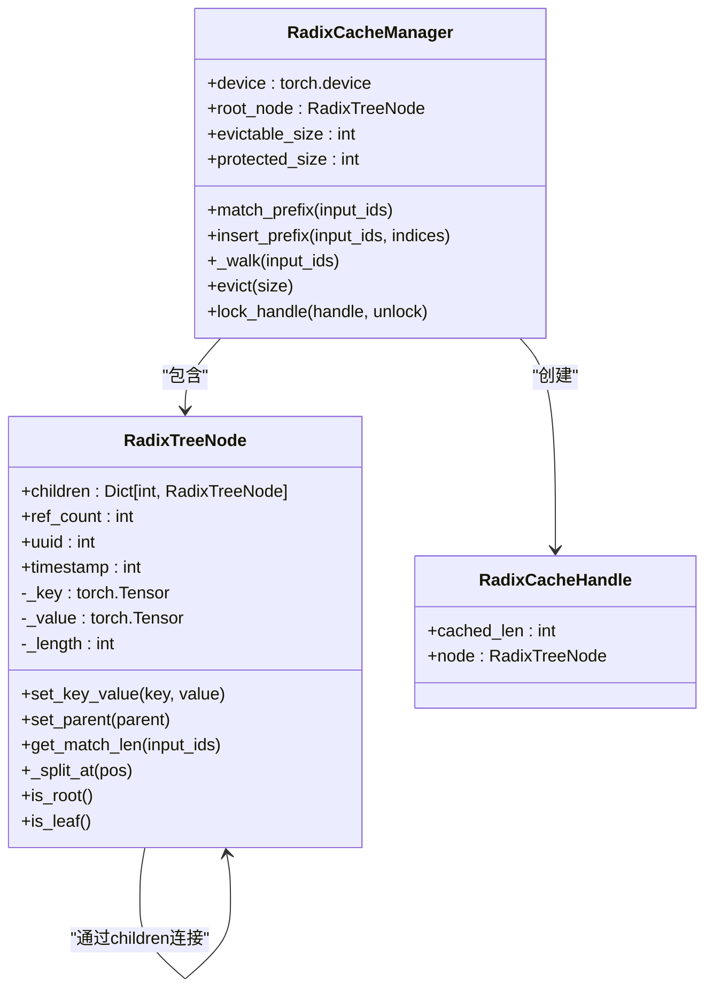
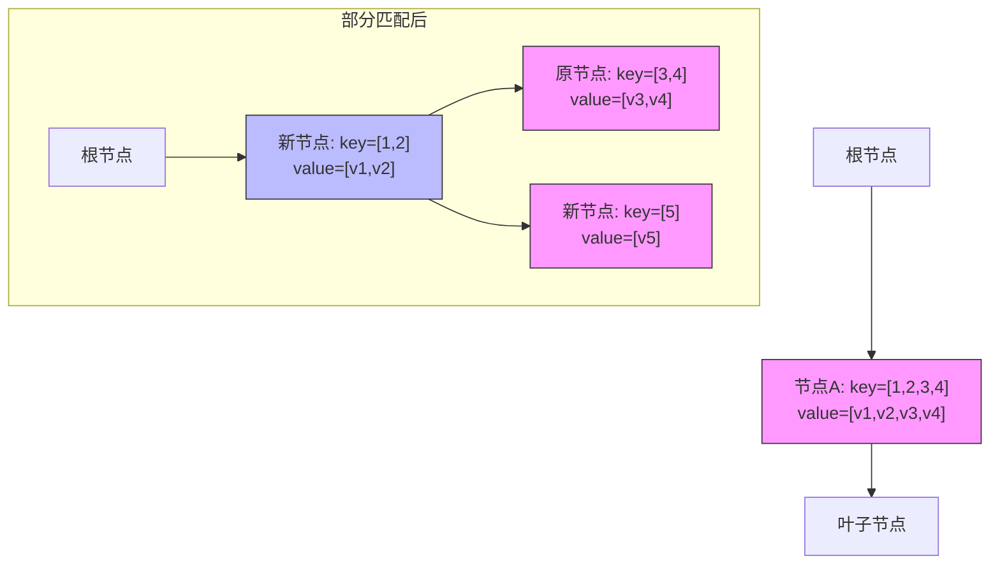
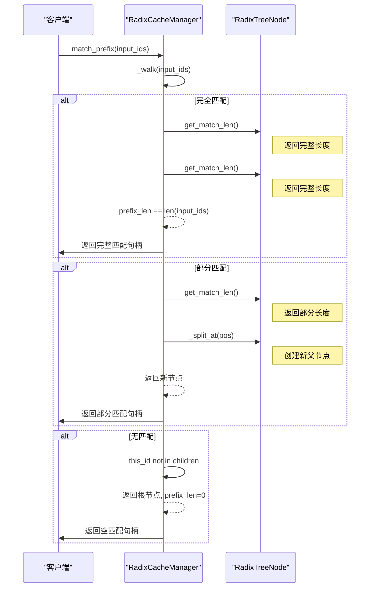

# 前缀匹配与节点分裂机制

<cite>
**本文档中引用的文件**   
- [radix_manager.py](file://python/minisgl/kvcache/radix_manager.py)
- [radix.py](file://python/minisgl/kernel/radix.py)
- [radix.cpp](file://python/minisgl/kernel/csrc/src/radix.cpp)
- [base.py](file://python/minisgl/kvcache/base.py)
- [cache.py](file://python/minisgl/scheduler/cache.py)
</cite>

## 目录
1. [引言](#引言)
2. [Radix树结构与核心组件](#radix树结构与核心组件)
3. [_walk方法的前缀匹配算法](#_walk方法的前缀匹配算法)
4. [节点分裂机制与_split_at方法](#节点分裂机制与_split_at方法)
5. [GPU加速的序列比较：fast_compare_key](#gpu加速的序列比较：fast_compare_key)
6. [匹配过程的三种情况分析](#匹配过程的三种情况分析)
7. [KV缓存共享效率的优化](#kv缓存共享效率的优化)
8. [系统集成与调用流程](#系统集成与调用流程)
9. [结论](#结论)

## 引言
本文档详细阐述了`_radix_manager.py`文件中`_walk`方法实现的前缀匹配算法。该算法是Radix树缓存管理器的核心，用于在大型语言模型推理过程中高效地匹配和管理键值（KV）缓存。通过从根节点开始逐层查找，该机制能够最大化KV缓存的共享效率，从而显著提升推理吞吐量。文档将深入剖析前缀匹配、节点分裂以及GPU加速比较等关键技术。

## Radix树结构与核心组件
Radix树（也称为压缩前缀树）是一种高效的数据结构，用于存储和检索具有公共前缀的序列。在KV缓存管理中，它被用来组织和共享不同请求的token序列。

**图示来源**
- [radix_manager.py](file://python/minisgl/kvcache/radix_manager.py#L13-L85)

**本节来源**
- [radix_manager.py](file://python/minisgl/kvcache/radix_manager.py#L13-L85)

## _walk方法的前缀匹配算法
`_walk`方法是Radix树前缀匹配的核心实现。它从根节点开始，逐层通过输入序列的第一个token查找子节点，并进行精确的序列比对。

该算法的执行流程如下：
1.  **初始化**：从根节点`root_node`开始，初始化匹配长度`prefix_len`为0。
2.  **逐层遍历**：在循环中，使用当前`prefix_len`位置的`input_ids`作为键，检查当前节点的`children`字典。
3.  **子节点查找**：如果`this_id`不在`children`中，说明没有匹配的路径，立即返回当前节点和`prefix_len`。
4.  **精确序列比对**：如果找到子节点，则调用该子节点的`get_match_len`方法，计算节点存储的`_key`与输入序列从`prefix_len`开始的子序列的匹配长度。
5.  **更新匹配长度**：将`match_len`加到`prefix_len`上，推进匹配位置。
6.  **节点分裂检查**：如果`match_len`不等于节点的完整长度`node.length`，说明发生了部分匹配，需要进行节点分裂。
7.  **时间戳更新**：如果完全匹配，则更新节点的`timestamp`，用于LRU（最近最少使用）淘汰策略。
8.  **循环终止**：当`prefix_len`达到输入序列长度时，匹配完成。

此算法通过结合树的层级查找和精确的序列比对，实现了高效且准确的前缀匹配。

**本节来源**
- [radix_manager.py](file://python/minisgl/kvcache/radix_manager.py#L138-L163)

## 节点分裂机制与_split_at方法
当`_walk`方法检测到部分匹配时（即`match_len != node.length`），`_split_at`方法会被调用，以确保Radix树结构的正确性和完整性。

`_split_at`方法的工作原理如下：
1.  **创建新节点**：创建一个新的`RadixTreeNode`，其时间戳与原节点相同。
2.  **分割键值对**：将原节点的`_key`和`_value`在`pos`（即`match_len`）位置分割。新节点获得前半段（`[:pos]`），原节点保留后半段（`[pos:]`）。
3.  **建立父子关系**：新节点成为原节点的父节点。原节点从其旧父节点的`children`字典中移除，并作为新节点的子节点添加。
4.  **引用计数继承**：新节点继承原节点的`ref_count`，确保缓存的引用状态正确。
5.  **返回新节点**：返回新创建的父节点。

这种分裂机制保证了树中每个节点都代表一个唯一的、不可再分的token序列。例如，如果一个节点存储了序列`[1,2,3,4]`，而新的输入序列是`[1,2,5]`，在`pos=2`处发生部分匹配。分裂后，会形成一个新节点`[1,2]`，其下有两个子节点：一个是原节点修改后的`[3,4]`，另一个是新插入的`[5]`。这使得不同的请求可以共享公共前缀`[1,2]`的KV缓存。

**图示来源**
- [radix_manager.py](file://python/minisgl/kvcache/radix_manager.py#L64-L76)

**本节来源**
- [radix_manager.py](file://python/minisgl/kvcache/radix_manager.py#L64-L76)

## GPU加速的序列比较：fast_compare_key
为了实现高效的序列比较，`get_match_len`方法调用了`fast_compare_key`函数，该函数在GPU上执行，极大地提升了比较速度。

`fast_compare_key`的实现机制如下：
1.  **Python接口**：位于`kernel/radix.py`的`fast_compare_key`函数是一个Python包装器，它通过`_load_radix_module()`加载一个预编译的TVM（Tensor Virtual Machine）模块。
2.  **C++核心实现**：位于`csrc/src/radix.cpp`的`fast_compare_key`函数是实际的比较逻辑。它接收两个`TensorView`对象。
3.  **输入验证**：函数首先检查两个张量是否都是一维、连续的CPU整数张量，并且数据类型相同。
4.  **高效比较**：使用C++标准库的`std::mismatch`算法，该算法会并行地比较两个序列，直到找到第一个不匹配的元素。
5.  **结果返回**：`std::mismatch`返回一个迭代器对，`diff_pos.first`指向第一个不匹配的位置。函数计算该位置与序列起始位置的偏移量，并将其作为匹配长度返回。

这种设计将计算密集型的序列比较任务从Python解释器转移到了经过高度优化的C++代码，并通过TVM JIT编译器进行进一步优化，从而在GPU推理环境中实现了极低的延迟。

**本节来源**
- [radix.py](file://python/minisgl/kernel/radix.py#L18-L20)
- [radix.cpp](file://python/minisgl/kernel/csrc/src/radix.cpp#L19-L40)

## 匹配过程的三种情况分析
`_walk`方法的执行可以归纳为三种典型情况，每种情况对应不同的缓存操作。

### 完全匹配
当输入序列是树中某个现有路径的完整前缀时，发生完全匹配。
- **处理流程**：`_walk`方法会遍历到一个或多个节点，每次`get_match_len`都返回节点的完整长度。最终，`prefix_len`等于输入序列长度，返回最后一个匹配的节点。
- **后续操作**：`match_prefix`方法会沿着该节点的父链向上收集所有`value`，形成一个完整的KV缓存索引序列，供推理使用。

### 部分匹配（触发分裂）
当输入序列与某个节点的`_key`只有部分重合时，发生部分匹配。
- **处理流程**：在某个节点，`get_match_len`返回的值小于`node.length`。此时，`_walk`方法调用`node._split_at(match_len)`创建新节点，并立即返回这个新节点。
- **后续操作**：`match_prefix`方法会使用这个新节点作为起点，其`cached_len`为`prefix_len`。这为后续的`insert_prefix`操作准备好了正确的插入点。

### 无匹配
当输入序列的第一个token在根节点的`children`中就找不到时，发生无匹配。
- **处理流程**：在`_walk`方法的第一次循环中，`this_id not in node.children`条件成立，直接返回根节点和`prefix_len=0`。
- **后续操作**：`match_prefix`方法返回一个`cached_len=0`的句柄，表示没有可复用的缓存。后续的`insert_prefix`操作将从根节点开始插入整个新序列。

**图示来源**
- [radix_manager.py](file://python/minisgl/kvcache/radix_manager.py#L138-L163)

**本节来源**
- [radix_manager.py](file://python/minisgl/kvcache/radix_manager.py#L138-L163)

## KV缓存共享效率的优化
该前缀匹配与节点分裂机制的核心目标是最大化KV缓存的共享效率。

- **共享原理**：多个不同的请求，只要它们的token序列有公共前缀，就可以共享该前缀对应的KV缓存。例如，两个请求`[1,2,3,4]`和`[1,2,5,6]`可以共享`[1,2]`的缓存。
- **动态构建**：随着新请求的不断到来，Radix树会动态地通过`_split_at`和`insert_prefix`方法进行扩展和分裂，自动构建出最优的共享结构。
- **内存效率**：通过共享，避免了为每个请求重复存储相同的KV缓存，显著降低了显存占用。
- **性能提升**：在预填充（prefill）阶段，如果请求的前缀已被缓存，模型可以直接复用这些KV值，无需重新计算，从而大幅提升了推理速度。

**本节来源**
- [radix_manager.py](file://python/minisgl/kvcache/radix_manager.py#L116-L136)
- [cache.py](file://python/minisgl/scheduler/cache.py#L24-L27)

## 系统集成与调用流程
该机制被深度集成到系统的调度器中，其调用流程如下：
1.  **请求到达**：用户请求通过`UserMsg`进入系统。
2.  **前缀匹配**：`PrefillManager`调用`CacheManager.match_req()`，后者委托给`RadixCacheManager.match_prefix()`。
3.  **执行_walk**：`match_prefix`方法调用`_walk`执行前缀匹配算法。
4.  **锁定缓存**：匹配成功后，`CacheManager.lock()`会锁定返回的句柄，防止其在使用过程中被驱逐。
5.  **插入新缓存**：当请求处理完成后，`CacheManager.free_and_cache_finished_req()`会调用`RadixCacheManager.insert_prefix()`，将新的token序列插入Radix树，为未来的请求提供共享基础。

**本节来源**
- [scheduler.py](file://python/minisgl/scheduler/scheduler.py#L80-L285)
- [prefill.py](file://python/minisgl/scheduler/prefill.py#L114-L154)
- [cache.py](file://python/minisgl/scheduler/cache.py#L24-L62)

## 结论
`_walk`方法及其配套的`_split_at`和`fast_compare_key`机制，构成了一个高效、动态的KV缓存管理系统。它通过Radix树的层级结构和精确的序列比较，实现了不同请求间KV缓存的最大化共享。节点分裂机制确保了树结构的正确性，而GPU加速的比较则保证了低延迟。这一系列设计共同作用，显著提升了大型语言模型推理服务的吞吐量和资源利用率。