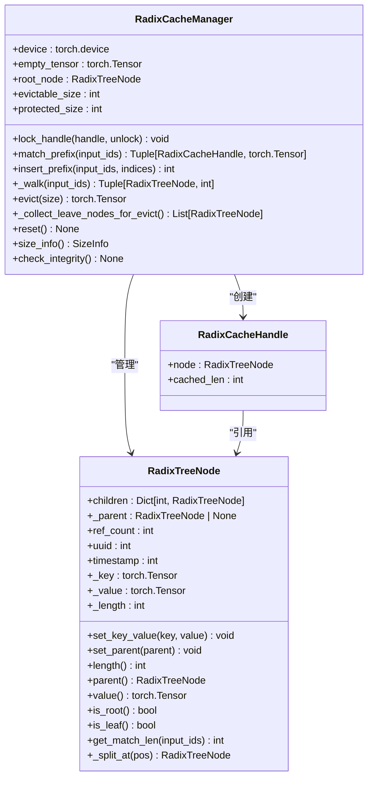
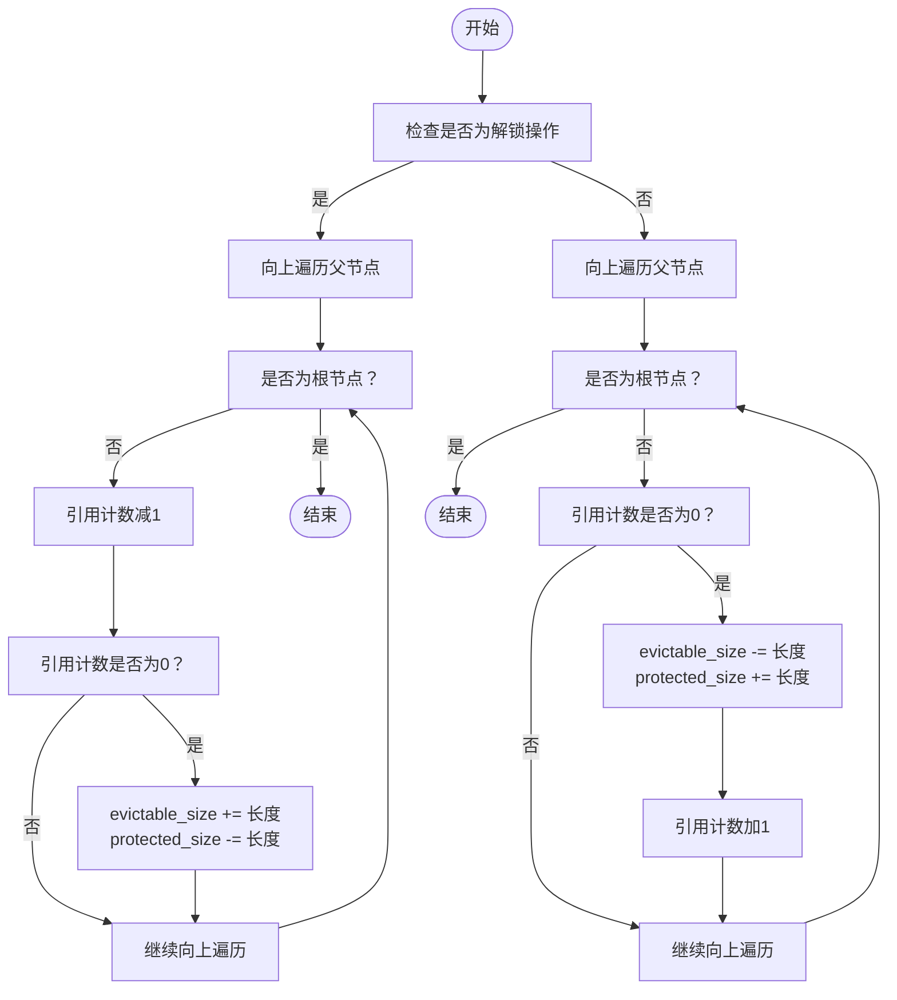
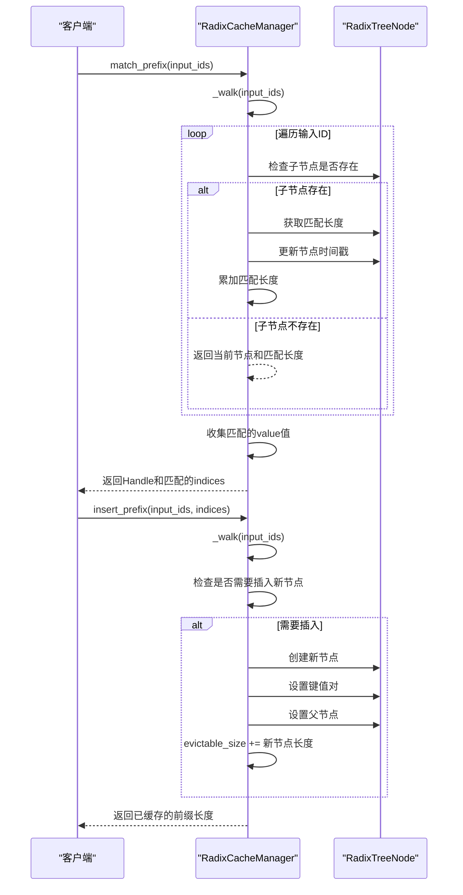
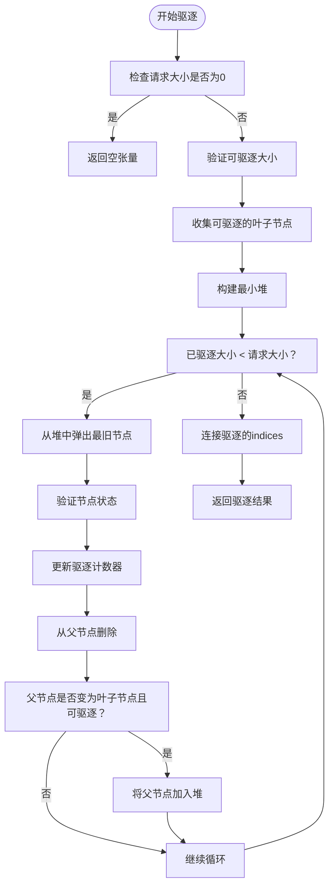
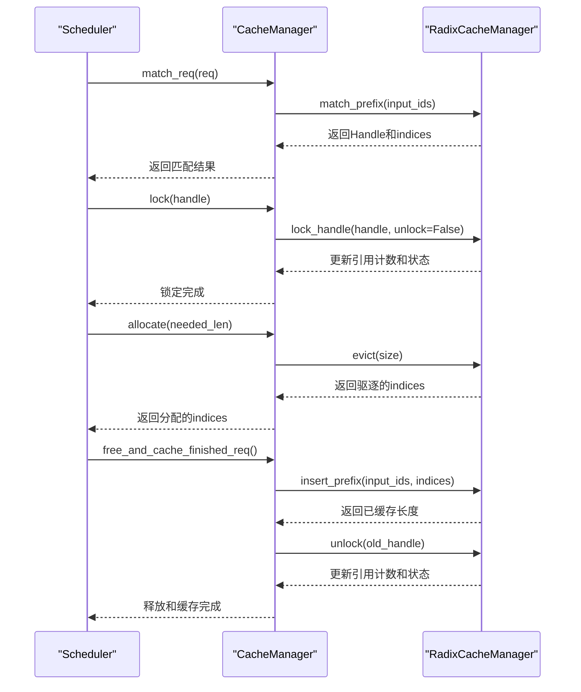

# 引用计数与缓存状态管理

<cite>
**本文档中引用的文件**  
- [radix_manager.py](file://python/minisgl/kvcache/radix_manager.py)
- [base.py](file://python/minisgl/kvcache/base.py)
- [cache.py](file://python/minisgl/scheduler/cache.py)
- [prefill.py](file://python/minisgl/scheduler/prefill.py)
- [scheduler.py](file://python/minisgl/scheduler/scheduler.py)
- [core.py](file://python/minisgl/core.py)
</cite>

## 目录
1. [引言](#引言)
2. [核心组件](#核心组件)
3. [引用计数机制](#引用计数机制)
4. [缓存状态管理](#缓存状态管理)
5. [前缀匹配与插入](#前缀匹配与插入)
6. [缓存驱逐机制](#缓存驱逐机制)
7. [系统集成与调用流程](#系统集成与调用流程)
8. [结论](#结论)

## 引言
本文档全面解析基于引用计数的缓存生命周期管理机制。重点分析`lock_handle`方法如何通过递归遍历父节点来增减引用计数（ref_count），并同步更新`evictable_size`和`protected_size`这两个关键状态变量。解释当引用计数从1减至0时，节点及其子树变为可驱逐状态，`evictable_size`相应增加；反之，当引用计数从0增至1时，节点被保护，`protected_size`增加。阐明`match_prefix`和`insert_prefix`如何通过`_walk`间接影响节点的访问时间戳和潜在的引用状态。说明这种设计如何精确跟踪哪些缓存块正在被使用（protected）而哪些可以被安全回收（evictable）。

## 核心组件

**本节来源**  
- [radix_manager.py](file://python/minisgl/kvcache/radix_manager.py#L13-L221)
- [base.py](file://python/minisgl/kvcache/base.py#L50-L135)

## 引用计数机制

**图示来源**  
- [radix_manager.py](file://python/minisgl/kvcache/radix_manager.py#L13-L221)

**本节来源**  
- [radix_manager.py](file://python/minisgl/kvcache/radix_manager.py#L97-L115)

## 缓存状态管理

**图示来源**  
- [radix_manager.py](file://python/minisgl/kvcache/radix_manager.py#L97-L115)

**本节来源**  
- [radix_manager.py](file://python/minisgl/kvcache/radix_manager.py#L94-L95)
- [radix_manager.py](file://python/minisgl/kvcache/radix_manager.py#L105-L108)
- [radix_manager.py](file://python/minisgl/kvcache/radix_manager.py#L111-L114)

## 前缀匹配与插入

**图示来源**  
- [radix_manager.py](file://python/minisgl/kvcache/radix_manager.py#L116-L136)
- [radix_manager.py](file://python/minisgl/kvcache/radix_manager.py#L138-L163)

**本节来源**  
- [radix_manager.py](file://python/minisgl/kvcache/radix_manager.py#L116-L136)
- [radix_manager.py](file://python/minisgl/kvcache/radix_manager.py#L138-L163)

## 缓存驱逐机制

**图示来源**  
- [radix_manager.py](file://python/minisgl/kvcache/radix_manager.py#L165-L192)
- [radix_manager.py](file://python/minisgl/kvcache/radix_manager.py#L194-L207)

**本节来源**  
- [radix_manager.py](file://python/minisgl/kvcache/radix_manager.py#L165-L192)
- [radix_manager.py](file://python/minisgl/kvcache/radix_manager.py#L194-L207)

## 系统集成与调用流程

**图示来源**  
- [cache.py](file://python/minisgl/scheduler/cache.py#L24-L62)
- [prefill.py](file://python/minisgl/scheduler/prefill.py#L38-L61)
- [scheduler.py](file://python/minisgl/scheduler/scheduler.py#L145-L149)

**本节来源**  
- [cache.py](file://python/minisgl/scheduler/cache.py#L24-L62)
- [prefill.py](file://python/minisgl/scheduler/prefill.py#L38-L61)
- [scheduler.py](file://python/minisgl/scheduler/scheduler.py#L145-L149)

## 结论
本文档详细解析了基于引用计数的缓存生命周期管理机制。通过`RadixCacheManager`中的`lock_handle`方法，系统能够精确地管理缓存块的生命周期。当引用计数从0增加到1时，节点被保护，`protected_size`增加；当引用计数从1减少到0时，节点变为可驱逐状态，`evictable_size`增加。`match_prefix`和`insert_prefix`方法通过`_walk`操作不仅实现了前缀匹配和插入功能，还间接影响了节点的访问时间戳和引用状态。这种设计使得系统能够精确跟踪哪些缓存块正在被使用而哪些可以被安全回收，从而实现了高效的内存管理和缓存驱逐策略。