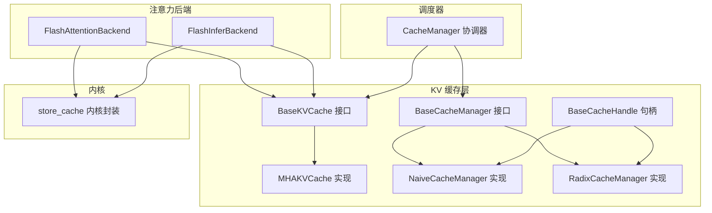
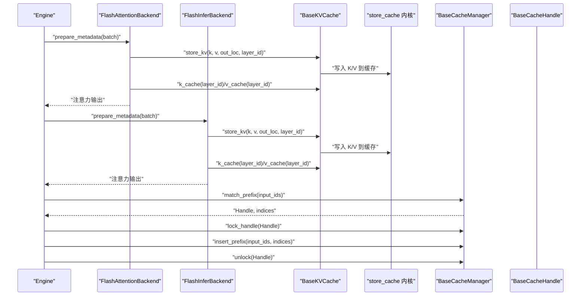
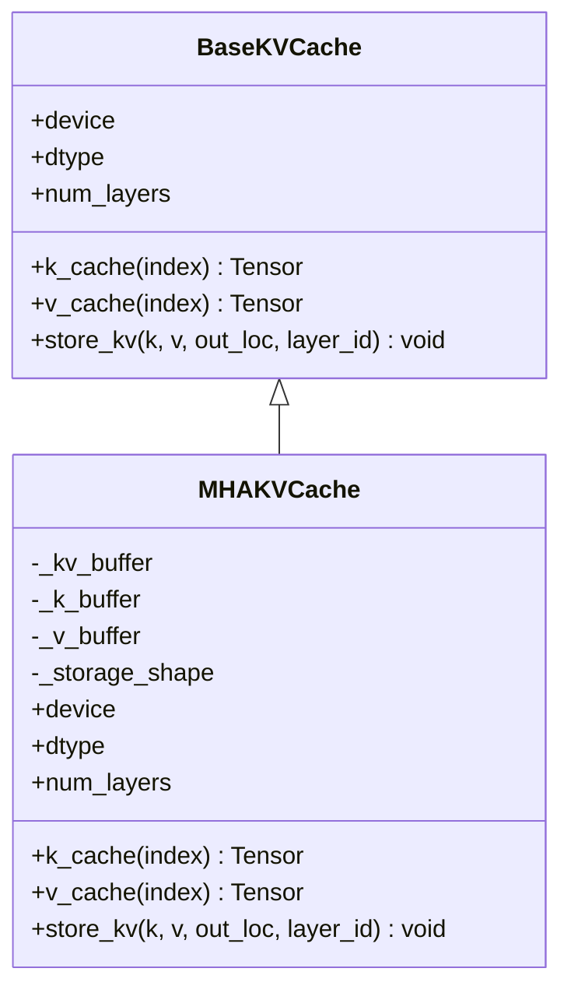
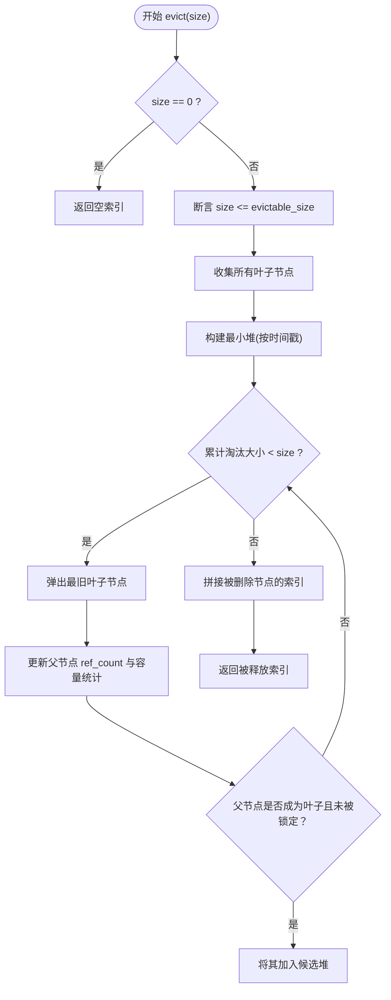
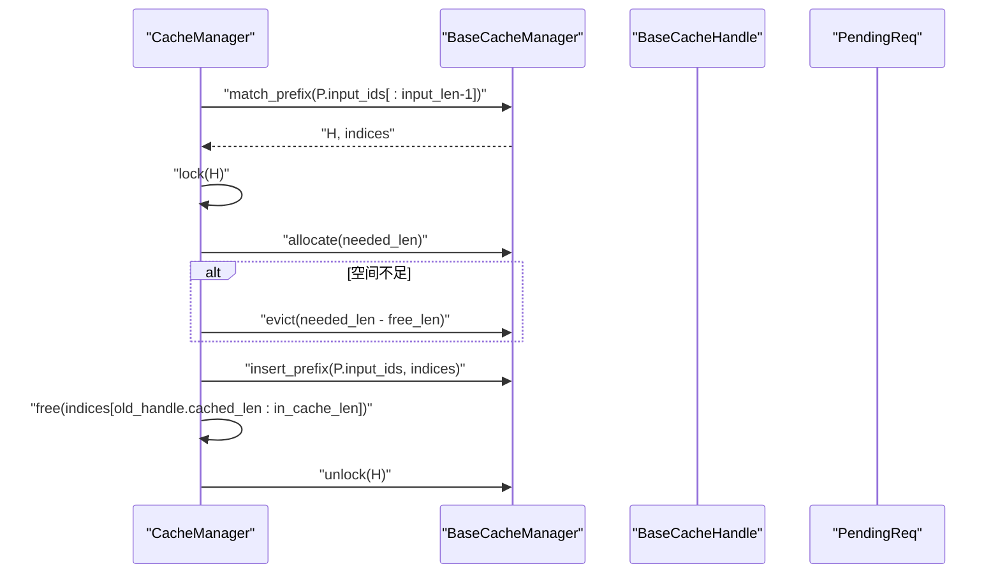
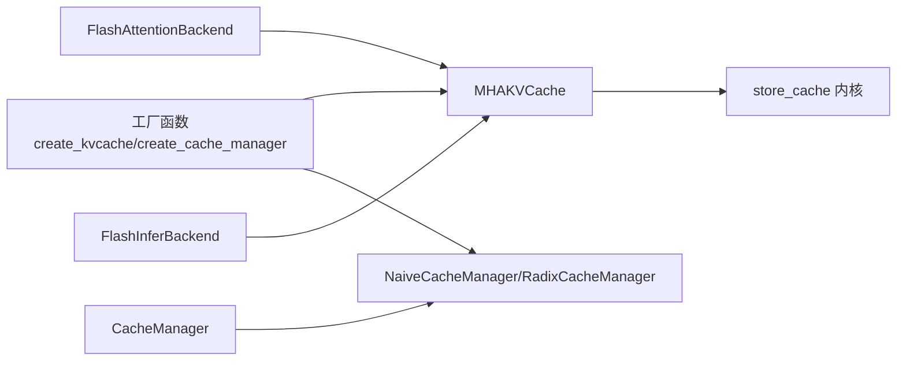

# 抽象接口定义

<cite>
**本文引用的文件**
- [python/minisgl/kvcache/base.py](file://python/minisgl/kvcache/base.py)
- [python/minisgl/kvcache/mha_pool.py](file://python/minisgl/kvcache/mha_pool.py)
- [python/minisgl/kvcache/naive_manager.py](file://python/minisgl/kvcache/naive_manager.py)
- [python/minisgl/kvcache/radix_manager.py](file://python/minisgl/kvcache/radix_manager.py)
- [python/minisgl/kvcache/__init__.py](file://python/minisgl/kvcache/__init__.py)
- [python/minisgl/attention/fa3.py](file://python/minisgl/attention/fa3.py)
- [python/minisgl/attention/fi.py](file://python/minisgl/attention/fi.py)
- [python/minisgl/scheduler/cache.py](file://python/minisgl/scheduler/cache.py)
- [python/minisgl/kernel/store.py](file://python/minisgl/kernel/store.py)
- [docs/structures.md](file://docs/structures.md)
</cite>

## 目录
1. [引言](#引言)
2. [项目结构](#项目结构)
3. [核心组件](#核心组件)
4. [架构总览](#架构总览)
5. [详细组件分析](#详细组件分析)
6. [依赖关系分析](#依赖关系分析)
7. [性能考量](#性能考量)
8. [故障排查指南](#故障排查指南)
9. [结论](#结论)

## 引言
本文件聚焦于KV缓存系统的抽象接口设计与实现，围绕以下目标展开：
- 深入解析 BaseKVCache 类中 k_cache、v_cache、store_kv 等抽象方法的设计意图与调用契约，说明其在不同注意力后端中的实现差异。
- 剖析 BaseCacheManager 的职责，包括 match_prefix、insert_prefix、evict 和 lock_handle 等关键方法的语义规范，以及 BaseCacheHandle 作为缓存句柄的生命周期管理机制。
- 结合 KVCacheLayout 与 KVCacheType 枚举，说明缓存布局与类型的设计考量，并通过 SizeInfo 结构体阐述缓存容量的统计模型。

## 项目结构
KV 缓存相关代码位于 python/minisgl/kvcache 目录，配合注意力后端（FlashAttention 与 FlashInfer）在 python/minisgl/attention 中使用。调度器在 python/minisgl/scheduler/cache.py 中协调缓存管理器与页槽分配。

图表来源
- [python/minisgl/kvcache/base.py](file://python/minisgl/kvcache/base.py#L1-L135)
- [python/minisgl/kvcache/mha_pool.py](file://python/minisgl/kvcache/mha_pool.py#L1-L80)
- [python/minisgl/kvcache/naive_manager.py](file://python/minisgl/kvcache/naive_manager.py#L1-L45)
- [python/minisgl/kvcache/radix_manager.py](file://python/minisgl/kvcache/radix_manager.py#L1-L221)
- [python/minisgl/attention/fa3.py](file://python/minisgl/attention/fa3.py#L1-L211)
- [python/minisgl/attention/fi.py](file://python/minisgl/attention/fi.py#L1-L278)
- [python/minisgl/scheduler/cache.py](file://python/minisgl/scheduler/cache.py#L1-L72)
- [python/minisgl/kernel/store.py](file://python/minisgl/kernel/store.py#L1-L43)

章节来源
- [docs/structures.md](file://docs/structures.md#L31-L50)

## 核心组件
本节从抽象到实现，系统梳理 KV 缓存体系的关键接口与实现。

- BaseKVCache 抽象接口
  - 设计意图：为不同注意力后端提供统一的键值缓存访问与写入能力，屏蔽底层布局与设备细节。
  - 关键抽象方法
    - k_cache(index: int) -> Tensor：返回指定层的 K 缓存视图，供注意力计算读取。
    - v_cache(index: int) -> Tensor：返回指定层的 V 缓存视图，供注意力计算读取。
    - store_kv(k: Tensor, v: Tensor, out_loc: Tensor, layer_id: int) -> None：将新生成的 K/V 写入缓存指定位置，out_loc 通常由调度器分配的页索引构成。
    - device/dtype/num_layers 属性：暴露设备、数据类型与层数信息，便于注意力后端初始化与一致性检查。
  - 调用契约
    - store_kv 的 out_loc 必须与 k/v 的 token 数一致，且与缓存布局匹配。
    - k_cache/v_cache 返回的张量需满足注意力后端对内存连续性与布局的要求（例如 FlashAttention 后端要求最后一维连续）。

- KVCacheLayout 与 KVCacheType
  - KVCacheLayout：决定缓存布局顺序（如 LayerFirst 或 PageFirst），影响张量形状与访问模式。
  - KVCacheType：当前支持 MHA 类型，用于工厂函数选择具体实现。

- BaseCacheManager 抽象接口
  - 设计意图：管理缓存前缀匹配、插入、淘汰与句柄锁定，维护可淘汰与受保护容量统计。
  - 关键抽象方法
    - match_prefix(input_ids: Tensor) -> Tuple[BaseCacheHandle, Tensor]：匹配最长前缀并返回句柄与对应缓存索引序列；句柄必须被锁定后才能安全使用该索引序列。
    - lock_handle(handle: BaseCacheHandle, unlock: bool = False) -> None：锁定或解锁句柄，改变受保护容量统计；锁定期间句柄对应的节点不会被 evict。
    - insert_prefix(input_ids: Tensor, indices: Tensor) -> int：将未命中部分的新前缀写入缓存，返回已命中长度（调用方可据此释放相应索引）。
    - evict(size: int) -> Tensor：按策略淘汰若干叶子节点，返回被释放的索引集合；请求大小不能超过可淘汰容量。
    - reset()/size_info/ check_integrity()：重置状态、查询容量统计、完整性校验。
  - 语义规范
    - match_prefix 不修改缓存，仅返回可复用的前缀信息。
    - lock_handle 仅更新容量统计，不直接操作缓存内容。
    - evict 0 总是安全且无副作用；实际淘汰可能大于请求大小。

- BaseCacheHandle
  - 设计意图：作为缓存句柄，承载缓存命中长度信息，并在不同管理器中携带节点或元信息。
  - 生命周期管理
    - 创建：match_prefix 返回句柄。
    - 使用：在使用返回的索引序列之前必须 lock_handle。
    - 释放：完成使用后 unlock，允许后续 evict。

- SizeInfo 容量统计模型
  - 字段
    - evictable_size：可淘汰容量（叶子节点累计长度）。
    - protected_size：受保护容量（被锁定的节点累计长度）。
  - 计算
    - total_size = evictable_size + protected_size。
  - 用途
    - 用于调度器判断可用空间与触发淘汰策略。

章节来源
- [python/minisgl/kvcache/base.py](file://python/minisgl/kvcache/base.py#L1-L135)

## 架构总览
KV 缓存系统在推理链路中的交互如下：

图表来源
- [python/minisgl/attention/fa3.py](file://python/minisgl/attention/fa3.py#L1-L211)
- [python/minisgl/attention/fi.py](file://python/minisgl/attention/fi.py#L1-L278)
- [python/minisgl/kvcache/base.py](file://python/minisgl/kvcache/base.py#L1-L135)
- [python/minisgl/kernel/store.py](file://python/minisgl/kernel/store.py#L1-L43)
- [python/minisgl/scheduler/cache.py](file://python/minisgl/scheduler/cache.py#L1-L72)

## 详细组件分析

### BaseKVCache 与 MHAKVCache：布局与写入路径
- 设计要点
  - BaseKVCache 定义了统一的 K/V 访问与写入接口，确保注意力后端无需关心底层存储细节。
  - MHAKVCache 在构造时根据 KVCacheLayout 选择不同的张量形状与布局，以适配不同后端的内存访问模式。
- 存储写入流程
  - 注意力后端在 forward 中调用 store_kv，传入新 token 的 K/V 与 out_loc（页索引）。
  - MHAKVCache 将 out_loc 映射到内部缓冲区对应位置，随后通过 store_cache 内核执行高效写入。
- 不同注意力后端的差异
  - FlashAttentionBackend：强调最后一维连续性约束，MHAKVCache 的布局与视图变换需满足该约束。
  - FlashInferBackend：依赖分页索引与包装器，MHAKVCache 的布局与 dtype 需与包装器期望一致。

图表来源
- [python/minisgl/kvcache/base.py](file://python/minisgl/kvcache/base.py#L1-L60)
- [python/minisgl/kvcache/mha_pool.py](file://python/minisgl/kvcache/mha_pool.py#L1-L80)

章节来源
- [python/minisgl/kvcache/mha_pool.py](file://python/minisgl/kvcache/mha_pool.py#L1-L80)
- [python/minisgl/kernel/store.py](file://python/minisgl/kernel/store.py#L1-L43)
- [python/minisgl/attention/fa3.py](file://python/minisgl/attention/fa3.py#L1-L211)
- [python/minisgl/attention/fi.py](file://python/minisgl/attention/fi.py#L1-L278)

### BaseCacheManager 与实现：匹配、锁定与淘汰
- NaiveCacheManager
  - 行为特征：总是返回空匹配，不支持淘汰；适合最小化开销或测试场景。
  - 适用场景：快速验证注意力后端逻辑，或在不需要缓存共享的场景下使用。
- RadixCacheManager
  - 数据结构：基于基数树（Radix Tree）组织前缀，节点包含 ref_count、timestamp、父子关系等字段。
  - 匹配流程：从根节点开始，逐字符比较输入序列，返回最长匹配节点与对应索引序列。
  - 锁定机制：通过递归更新祖先节点的 ref_count，将节点从“可淘汰”切换为“受保护”，反之亦然。
  - 淘汰策略：收集所有叶子节点，按时间戳优先队列进行淘汰，保证根节点始终受保护。
  - 容量统计：维护 evictable_size 与 protected_size，严格遵守 size_info 的契约。

图表来源
- [python/minisgl/kvcache/radix_manager.py](file://python/minisgl/kvcache/radix_manager.py#L165-L193)

章节来源
- [python/minisgl/kvcache/naive_manager.py](file://python/minisgl/kvcache/naive_manager.py#L1-L45)
- [python/minisgl/kvcache/radix_manager.py](file://python/minisgl/kvcache/radix_manager.py#L1-L221)

### 句柄生命周期与调度器协作
- 句柄生命周期
  - 创建：match_prefix 返回 BaseCacheHandle（RadixCacheHandle 携带节点信息）。
  - 使用：在使用返回的 indices 之前必须 lock_handle(handle, unlock=False)。
  - 释放：完成使用后 lock_handle(handle, unlock=True)，允许后续 evict。
- 调度器协调
  - CacheManager 统一管理页槽与缓存管理器，负责：
    - 分配所需索引：当可用页不足时，通过 manager.evict 释放足够空间。
    - 插入完成请求：insert_prefix 后释放旧句柄中已命中的部分索引。
    - 完整性检查：校验 free_slots 与 size_info 的总和等于总页数。

图表来源
- [python/minisgl/scheduler/cache.py](file://python/minisgl/scheduler/cache.py#L1-L72)
- [python/minisgl/kvcache/base.py](file://python/minisgl/kvcache/base.py#L64-L135)

章节来源
- [python/minisgl/scheduler/cache.py](file://python/minisgl/scheduler/cache.py#L1-L72)

## 依赖关系分析
- 工厂函数与类型选择
  - create_kvcache：根据 KVCacheType 与 KVCacheLayout 返回具体 KV 缓存实例。
  - create_cache_manager：根据字符串类型返回具体缓存管理器实例。
- 注意力后端依赖
  - FlashAttentionBackend 与 FlashInferBackend 通过 BaseKVCache 接口读写缓存，二者均调用 store_kv 完成写入。
- 内核依赖
  - store_cache 封装底层 CUDA 写入逻辑，MHAKVCache 将 out_loc 与 K/V 传递给内核执行。

图表来源
- [python/minisgl/kvcache/__init__.py](file://python/minisgl/kvcache/__init__.py#L1-L67)
- [python/minisgl/kvcache/mha_pool.py](file://python/minisgl/kvcache/mha_pool.py#L1-L80)
- [python/minisgl/kvcache/naive_manager.py](file://python/minisgl/kvcache/naive_manager.py#L1-L45)
- [python/minisgl/kvcache/radix_manager.py](file://python/minisgl/kvcache/radix_manager.py#L1-L221)
- [python/minisgl/attention/fa3.py](file://python/minisgl/attention/fa3.py#L1-L211)
- [python/minisgl/attention/fi.py](file://python/minisgl/attention/fi.py#L1-L278)
- [python/minisgl/kernel/store.py](file://python/minisgl/kernel/store.py#L1-L43)

章节来源
- [python/minisgl/kvcache/__init__.py](file://python/minisgl/kvcache/__init__.py#L1-L67)

## 性能考量
- 写入性能
  - store_cache 采用 JIT 编译的 CUDA 内核，按元素字节数缓存模块，减少重复编译开销。
  - MHAKVCache 的布局选择应尽量满足注意力后端对内存连续性的要求，避免额外拷贝。
- 匹配与淘汰
  - RadixCacheManager 的基数树匹配具备线性前缀匹配特性，适合长序列缓存共享。
  - 淘汰策略通过最小堆按时间戳排序，优先淘汰最旧叶子节点，降低缓存抖动。
- 调度器空间管理
  - CacheManager 将 free_slots 与 evictable_size 统一考虑，避免频繁触发淘汰。
  - 在 insert_prefix 后及时释放已命中的旧索引，提高空间利用率。

[本节为通用性能讨论，不直接分析具体文件]

## 故障排查指南
- 常见问题与定位
  - evict 请求过大：当请求大小超过 evictable_size 时会触发断言或异常，需检查 size_info 与可用空间估算。
  - 句柄未锁定导致索引失效：若在 unlock 前使用 match_prefix 返回的 indices，可能导致被后续 evict 清理，需确保先 lock_handle 再使用。
  - 写入失败或内存不连续：FlashAttention 后端要求最后一维连续，需确认 MHAKVCache 的布局与视图变换满足该约束。
  - 完整性检查失败：CacheManager 的完整性检查会验证 free_slots 与 total_size 的一致性，若不一致需检查 evict/insert/free 的调用序列。
- 建议排查步骤
  - 打印 size_info 与 available_size，确认空间估算合理。
  - 在使用 indices 前后分别调用 lock_handle，确保生命周期正确。
  - 对照注意力后端的元数据准备逻辑，确认 cu_seqlens 与 page_table 与 out_loc 一致。
  - 在出现异常时，启用 check_integrity 并逐步回放最近一次 insert/evict 操作。

章节来源
- [python/minisgl/kvcache/radix_manager.py](file://python/minisgl/kvcache/radix_manager.py#L165-L193)
- [python/minisgl/scheduler/cache.py](file://python/minisgl/scheduler/cache.py#L64-L72)
- [python/minisgl/attention/fa3.py](file://python/minisgl/attention/fa3.py#L144-L211)

## 结论
KV 缓存系统通过清晰的抽象接口与灵活的实现组合，实现了跨注意力后端的一致性与高性能。BaseKVCache 提供统一的 K/V 访问与写入能力，BaseCacheManager 则负责前缀匹配、句柄锁定与容量管理。KVCacheLayout 与 KVCacheType 的设计使得布局与类型可配置，满足不同后端与部署场景的需求。通过 SizeInfo 的容量统计模型与 CacheManager 的空间协调，系统在高并发推理中保持稳定与高效。