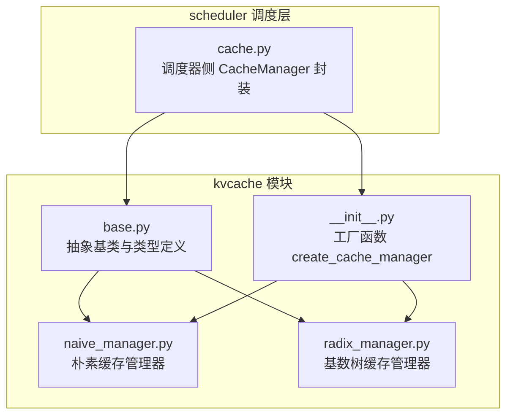
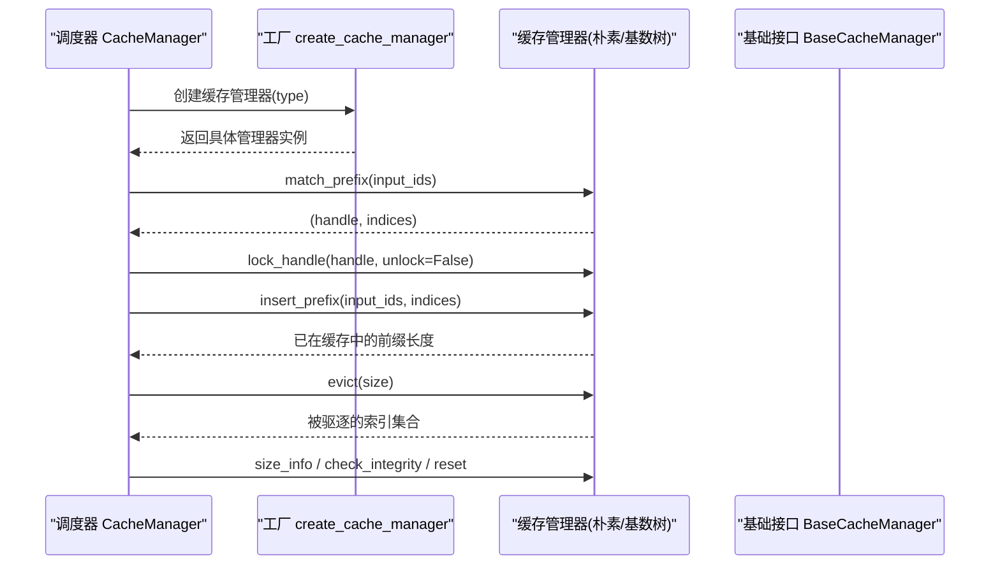
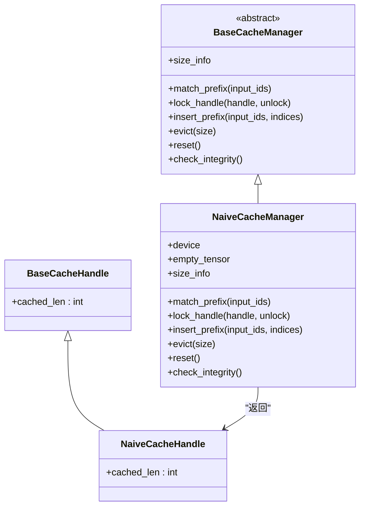
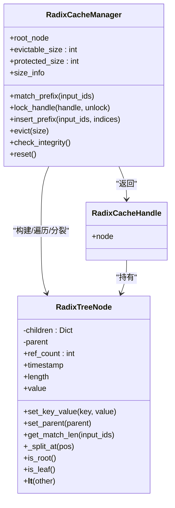
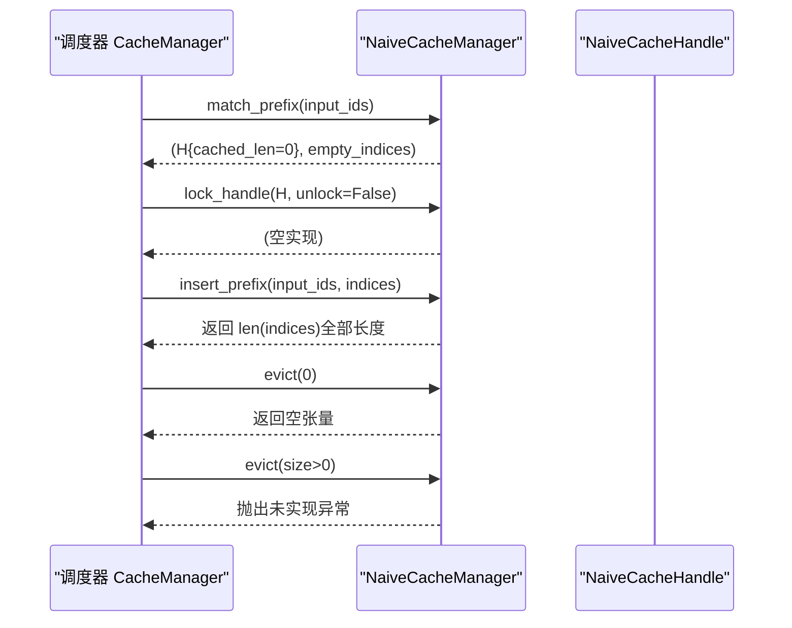
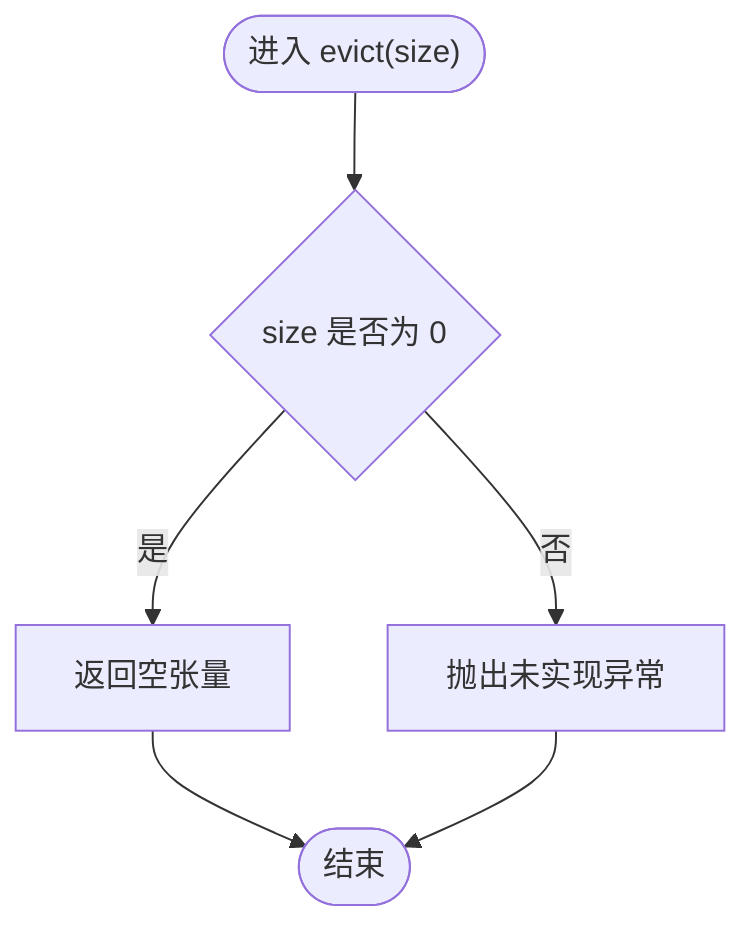
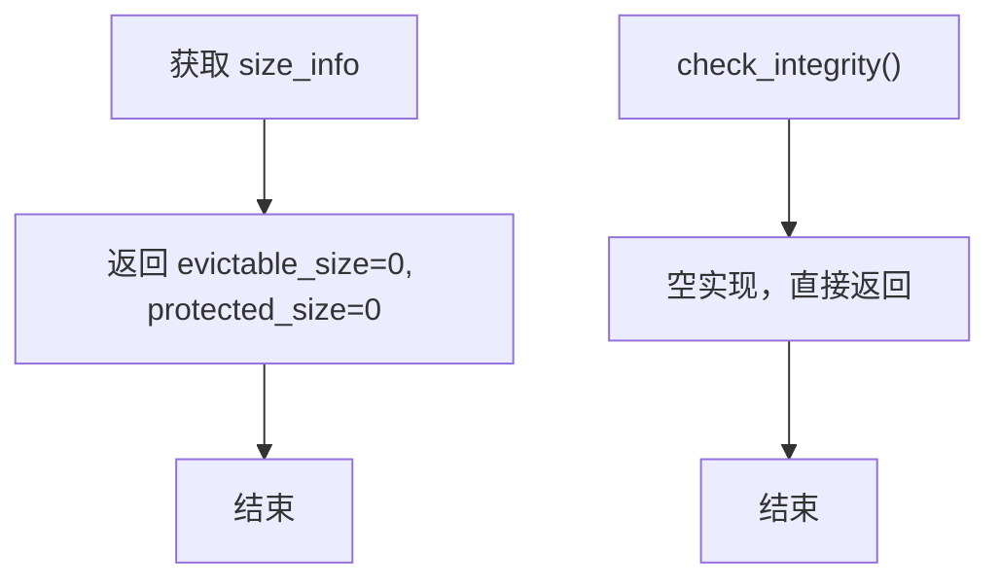
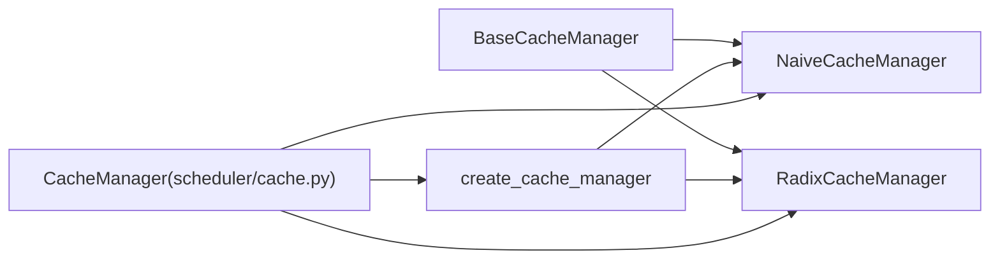

# 朴素缓存管理器

<cite>
**本文引用的文件**
- [naive_manager.py](file://python/minisgl/kvcache/naive_manager.py)
- [radix_manager.py](file://python/minisgl/kvcache/radix_manager.py)
- [base.py](file://python/minisgl/kvcache/base.py)
- [cache.py](file://python/minisgl/scheduler/cache.py)
- [__init__.py](file://python/minisgl/kvcache/__init__.py)
</cite>

## 目录
1. [简介](#简介)
2. [项目结构](#项目结构)
3. [核心组件](#核心组件)
4. [架构总览](#架构总览)
5. [详细组件分析](#详细组件分析)
6. [依赖关系分析](#依赖关系分析)
7. [性能考量](#性能考量)
8. [故障排查指南](#故障排查指南)
9. [结论](#结论)
10. [附录](#附录)

## 简介
本文件聚焦于“朴素缓存管理器”（NaiveCacheManager）的设计与局限性，将其与“基数树缓存管理器”（RadixCacheManager）进行对比，阐明其作为无前缀共享、无驱逐能力的最简模型的定位。朴素实现通过以下特征体现其轻量级与简单性：
- 匹配前缀总是返回零长度匹配；
- 插入前缀时直接消耗全部输入序列索引；
- 驱逐方法对非零大小抛出未实现异常；
- 容量信息始终为零容量；
- 完整性检查与重置为空实现。

这些特性使其适用于无需前缀共享的场景，或作为新功能开发的参考模板。

## 项目结构
与缓存管理器相关的核心文件位于 kvcache 子模块中，调度层通过统一工厂创建具体缓存管理器实例，并在分配与回收流程中调用其接口。

图表来源
- [base.py](file://python/minisgl/kvcache/base.py#L50-L135)
- [naive_manager.py](file://python/minisgl/kvcache/naive_manager.py#L1-L45)
- [radix_manager.py](file://python/minisgl/kvcache/radix_manager.py#L1-L221)
- [__init__.py](file://python/minisgl/kvcache/__init__.py#L44-L66)
- [cache.py](file://python/minisgl/scheduler/cache.py#L1-L72)

章节来源
- [base.py](file://python/minisgl/kvcache/base.py#L50-L135)
- [naive_manager.py](file://python/minisgl/kvcache/naive_manager.py#L1-L45)
- [radix_manager.py](file://python/minisgl/kvcache/radix_manager.py#L1-L221)
- [__init__.py](file://python/minisgl/kvcache/__init__.py#L44-L66)
- [cache.py](file://python/minisgl/scheduler/cache.py#L1-L72)

## 核心组件
- 抽象基类与接口
  - BaseCacheManager：定义匹配前缀、锁定句柄、插入前缀、驱逐、重置、容量信息查询与完整性检查等抽象方法。
  - BaseCacheHandle：缓存访问句柄，携带已缓存长度等元信息。
  - SizeInfo：容量信息，包含可驱逐与受保护两部分。
- 朴素缓存管理器（NaiveCacheManager）
  - 实现了上述接口，但行为均为“无操作”或“最小化实现”，体现无共享、无驱逐、无复杂内存管理的定位。
- 基数树缓存管理器（RadixCacheManager）
  - 提供前缀共享、节点树结构、引用计数、时间戳与驱逐策略，具备完整的内存管理能力。

章节来源
- [base.py](file://python/minisgl/kvcache/base.py#L50-L135)
- [naive_manager.py](file://python/minisgl/kvcache/naive_manager.py#L1-L45)
- [radix_manager.py](file://python/minisgl/kvcache/radix_manager.py#L1-L221)

## 架构总览
调度器通过工厂创建缓存管理器实例，随后在请求处理流程中调用其接口完成匹配、锁定、插入与驱逐等操作；容量信息用于判断可用空间与完整性校验。

图表来源
- [cache.py](file://python/minisgl/scheduler/cache.py#L12-L72)
- [__init__.py](file://python/minisgl/kvcache/__init__.py#L44-L66)
- [base.py](file://python/minisgl/kvcache/base.py#L64-L135)
- [naive_manager.py](file://python/minisgl/kvcache/naive_manager.py#L1-L45)
- [radix_manager.py](file://python/minisgl/kvcache/radix_manager.py#L87-L221)

## 详细组件分析

### 朴素缓存管理器（NaiveCacheManager）
- 设计要点
  - 匹配前缀：始终返回零长度匹配与空索引，表示无任何前缀共享。
  - 锁定句柄：空实现，不改变任何状态。
  - 插入前缀：直接消耗全部输入序列索引，返回全部长度，表示不做去重或复用。
  - 驱逐：对非零大小抛出未实现异常；零大小返回空张量。
  - 容量信息：始终返回零容量，体现不参与复杂内存管理。
  - 完整性检查与重置：空实现，保持极简。

图表来源
- [base.py](file://python/minisgl/kvcache/base.py#L50-L135)
- [naive_manager.py](file://python/minisgl/kvcache/naive_manager.py#L1-L45)

章节来源
- [naive_manager.py](file://python/minisgl/kvcache/naive_manager.py#L1-L45)
- [base.py](file://python/minisgl/kvcache/base.py#L50-L135)

### 基数树缓存管理器（RadixCacheManager）
- 设计要点
  - 前缀共享：通过树形结构实现多请求间的前缀共享，提升命中率。
  - 引用计数与锁定：通过 ref_count 与时间戳控制节点生命周期，避免被误删。
  - 驱逐策略：基于叶子节点与时间戳的堆式选择，按需驱逐，保证根节点不受影响。
  - 容量信息：维护可驱逐与受保护两部分容量，支持精确的空间管理。
  - 完整性检查：提供空实现，便于扩展。

图表来源
- [radix_manager.py](file://python/minisgl/kvcache/radix_manager.py#L1-L221)

章节来源
- [radix_manager.py](file://python/minisgl/kvcache/radix_manager.py#L1-L221)

### 朴素实现的匹配与插入流程（序列图）

图表来源
- [naive_manager.py](file://python/minisgl/kvcache/naive_manager.py#L1-L45)
- [cache.py](file://python/minisgl/scheduler/cache.py#L12-L72)

章节来源
- [naive_manager.py](file://python/minisgl/kvcache/naive_manager.py#L1-L45)
- [cache.py](file://python/minisgl/scheduler/cache.py#L12-L72)

### 朴素实现的驱逐流程（流程图）

图表来源
- [naive_manager.py](file://python/minisgl/kvcache/naive_manager.py#L31-L35)

章节来源
- [naive_manager.py](file://python/minisgl/kvcache/naive_manager.py#L31-L35)

### 朴素实现的容量信息与完整性检查（流程图）

图表来源
- [naive_manager.py](file://python/minisgl/kvcache/naive_manager.py#L39-L45)

章节来源
- [naive_manager.py](file://python/minisgl/kvcache/naive_manager.py#L39-L45)

## 依赖关系分析
- 接口契约
  - 两者均实现 BaseCacheManager 抽象接口，确保调度器侧调用的一致性。
- 调度器集成
  - 调度器通过工厂函数创建具体管理器实例，并在分配与回收流程中调用其接口。
- 关键差异
  - 朴素实现不维护任何共享结构，不跟踪可驱逐/受保护容量，也不执行驱逐。
  - 基数树实现维护树结构与节点属性，支持共享、锁定与驱逐。

图表来源
- [base.py](file://python/minisgl/kvcache/base.py#L64-L135)
- [__init__.py](file://python/minisgl/kvcache/__init__.py#L44-L66)
- [cache.py](file://python/minisgl/scheduler/cache.py#L12-L72)
- [naive_manager.py](file://python/minisgl/kvcache/naive_manager.py#L1-L45)
- [radix_manager.py](file://python/minisgl/kvcache/radix_manager.py#L87-L221)

章节来源
- [base.py](file://python/minisgl/kvcache/base.py#L64-L135)
- [__init__.py](file://python/minisgl/kvcache/__init__.py#L44-L66)
- [cache.py](file://python/minisgl/scheduler/cache.py#L12-L72)
- [naive_manager.py](file://python/minisgl/kvcache/naive_manager.py#L1-L45)
- [radix_manager.py](file://python/minisgl/kvcache/radix_manager.py#L87-L221)

## 性能考量
- 时间复杂度
  - 朴素实现：匹配前缀为 O(1)，插入前缀为 O(n)（n 为输入长度），驱逐为 O(1)（零大小）或抛异常。
  - 基数树实现：匹配与插入涉及树遍历与可能的节点分裂，复杂度与共享程度相关。
- 内存占用
  - 朴素实现不共享，相同前缀不会复用，内存占用随请求数线性增长。
  - 基数树实现通过共享前缀显著降低冗余存储。
- 可扩展性
  - 朴素实现适合小规模或无共享需求场景，便于快速验证流程。
  - 基数树实现适合高并发与长序列场景，具备更精细的内存管理能力。

## 故障排查指南
- 驱逐异常
  - 当请求非零大小驱逐时，朴素实现会抛出未实现异常。应改为使用支持驱逐的实现（如基数树）或在调度层避免触发非零驱逐。
- 容量不一致
  - 朴素实现容量信息恒为零，若在调度层依赖容量信息进行完整性检查，需注意其不反映真实占用。
- 锁定语义
  - 朴素实现不改变任何状态，锁定/解锁为空操作。若期望通过锁定避免被驱逐，请切换到支持锁定的实现。

章节来源
- [naive_manager.py](file://python/minisgl/kvcache/naive_manager.py#L24-L35)
- [cache.py](file://python/minisgl/scheduler/cache.py#L33-L71)

## 结论
朴素缓存管理器以“零共享、零驱逐、零容量”的设计，成为无需前缀共享或作为新功能开发参考模板的理想选择。它通过空实现与最小化逻辑，清晰地展示了缓存管理器接口的职责边界；在需要共享与复杂内存管理的场景下，应优先考虑基数树实现。

## 附录
- 使用建议
  - 无共享需求或原型验证：选择朴素实现，快速落地。
  - 高并发与长序列：选择基数树实现，获得更好的共享与驱逐能力。
- 扩展方向
  - 在朴素实现基础上增加基本的容量统计与驱逐策略，可作为向基数树演进的中间步骤。