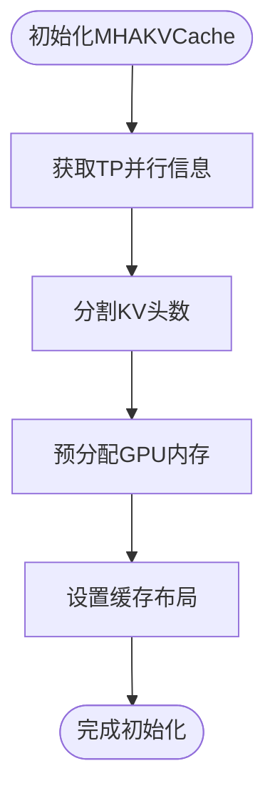
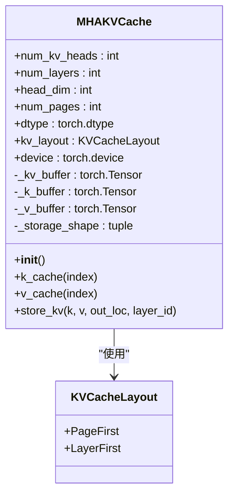
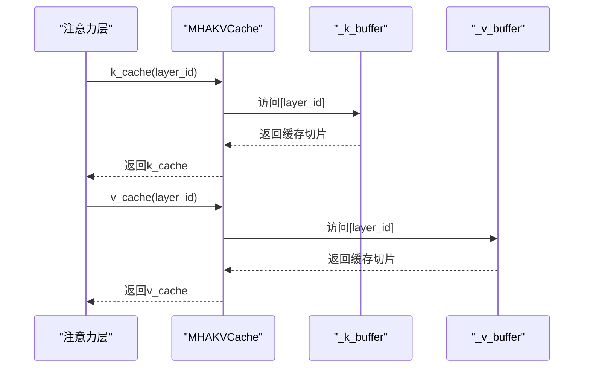
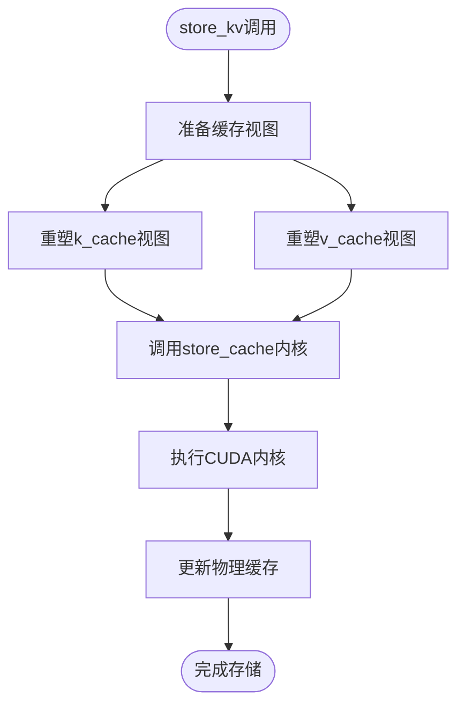
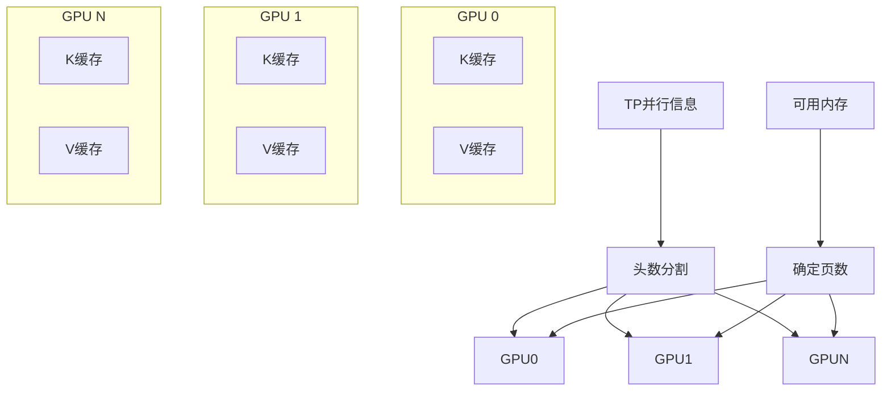

# 缓存池管理实现

<cite>
**本文档中引用的文件**   
- [mha_pool.py](file://python/minisgl/kvcache/mha_pool.py)
- [base.py](file://python/minisgl/kvcache/base.py)
- [store.py](file://python/minisgl/kernel/store.py)
- [store.cu](file://python/minisgl/kernel/csrc/jit/store.cu)
- [info.py](file://python/minisgl/distributed/info.py)
- [misc.py](file://python/minisgl/utils/misc.py)
- [engine.py](file://python/minisgl/engine/engine.py)
</cite>

## 目录
1. [引言](#引言)
2. [物理内存预分配机制](#物理内存预分配机制)
3. [缓存布局管理](#缓存布局管理)
4. [缓存切片访问机制](#缓存切片访问机制)
5. [KV存储内核调用](#kv存储内核调用)
6. [分布式张量并行支持](#分布式张量并行支持)
7. [综合分析与总结](#综合分析与总结)

## 引言
`MHAKVCache`类是该系统中用于管理键值（KV）缓存的核心组件，专门设计用于在大规模语言模型推理过程中高效管理GPU上的KV缓存。该类通过预分配连续的物理内存块来优化内存访问模式，并支持灵活的缓存布局以适应不同的计算需求。本文档将深入解析其物理内存管理机制，包括内存预分配、布局管理、缓存访问和分布式支持等关键方面。

**Section sources**
- [mha_pool.py](file://python/minisgl/kvcache/mha_pool.py#L10-L79)

## 物理内存预分配机制
`MHAKVCache`在初始化时基于`num_pages`和`num_kv_heads`等参数在GPU上预分配连续的KV缓存张量。这一过程首先通过`get_tp_info()`获取当前的分布式并行信息，然后使用`divide_even`函数将总头数`num_kv_heads`均匀分割到各个GPU上，得到本地头数`local_kv_heads`。这种预分配策略确保了内存的连续性和访问效率，为后续的KV缓存操作提供了坚实的基础。

**Diagram sources**
- [mha_pool.py](file://python/minisgl/kvcache/mha_pool.py#L26-L28)
- [info.py](file://python/minisgl/distributed/info.py#L28-L31)
- [misc.py](file://python/minisgl/utils/misc.py#L20-L23)

**Section sources**
- [mha_pool.py](file://python/minisgl/kvcache/mha_pool.py#L16-L49)
- [info.py](file://python/minisgl/distributed/info.py#L28-L31)
- [misc.py](file://python/minisgl/utils/misc.py#L20-L23)

## 缓存布局管理
`MHAKVCache`支持`PageFirst`和`LayerFirst`两种缓存布局，通过`_kv_buffer`的视图变换来实现。当选择`PageFirst`布局时，系统创建一个形状为(2, num_pages, num_layers, local_kv_heads, head_dim)的张量，并通过permute操作调整维度顺序；而`LayerFirst`布局则直接创建形状为(2, num_layers, num_pages, local_kv_heads, head_dim)的张量。随后，通过view操作将`_kv_buffer`重塑为(2, num_layers, num_pages, 1, local_kv_heads, head_dim)的六维张量，为后续的分层访问提供便利。

**Diagram sources**
- [mha_pool.py](file://python/minisgl/kvcache/mha_pool.py#L29-L43)
- [base.py](file://python/minisgl/kvcache/base.py#L41-L43)

**Section sources**
- [mha_pool.py](file://python/minisgl/kvcache/mha_pool.py#L29-L43)
- [base.py](file://python/minisgl/kvcache/base.py#L41-L43)

## 缓存切片访问机制
`MHAKVCache`通过`k_cache`和`v_cache`方法按层索引返回对应的缓存切片。这两个方法分别访问`_k_buffer`和`_v_buffer`的指定层索引，返回对应层的KV缓存视图。这种设计使得每一层的注意力机制可以独立访问其专属的缓存区域，保证了计算的正确性和效率。`_k_buffer`和`_v_buffer`是从`_kv_buffer`中提取的两个视图，分别对应键缓存和值缓存，它们的结构设计确保了内存访问的局部性和连续性。

**Diagram sources**
- [mha_pool.py](file://python/minisgl/kvcache/mha_pool.py#L50-L54)

**Section sources**
- [mha_pool.py](file://python/minisgl/kvcache/mha_pool.py#L50-L54)

## KV存储内核调用
`store_kv`方法负责将计算得到的K/V张量存储到指定的物理位置。该方法调用`kernel.store_cache`内核函数，将输入的K/V张量根据`out_loc`指定的索引位置存储到对应的缓存区域。在调用前，方法会将`_k_buffer`和`_v_buffer`在指定层的缓存视图重塑为`_storage_shape`形状，确保与内核函数的输入要求匹配。这一过程通过CUDA内核实现高效的并行存储操作，充分利用GPU的计算能力。

**Diagram sources**
- [mha_pool.py](file://python/minisgl/kvcache/mha_pool.py#L56-L67)
- [store.py](file://python/minisgl/kernel/store.py#L30-L42)
- [store.cu](file://python/minisgl/kernel/csrc/jit/store.cu#L1-L124)

**Section sources**
- [mha_pool.py](file://python/minisgl/kvcache/mha_pool.py#L56-L67)
- [store.py](file://python/minisgl/kernel/store.py#L30-L42)

## 分布式张量并行支持
在分布式张量并行场景下，`get_tp_info`和`divide_even`共同确保了缓存分配的正确性。`get_tp_info`获取当前的并行组信息，包括rank和size，而`divide_even`则确保总头数能够被并行组大小整除并均匀分配。这种设计使得每个GPU只负责一部分KV头的计算和存储，实现了计算和内存负载的均衡分布。在`engine.py`的初始化过程中，系统会根据可用内存和配置参数确定最终的页数，确保在多GPU环境下缓存资源的合理分配。

**Diagram sources**
- [mha_pool.py](file://python/minisgl/kvcache/mha_pool.py#L26-L28)
- [info.py](file://python/minisgl/distributed/info.py#L28-L31)
- [misc.py](file://python/minisgl/utils/misc.py#L20-L23)
- [engine.py](file://python/minisgl/engine/engine.py#L57-L65)

**Section sources**
- [mha_pool.py](file://python/minisgl/kvcache/mha_pool.py#L26-L28)
- [info.py](file://python/minisgl/distributed/info.py#L28-L31)
- [misc.py](file://python/minisgl/utils/misc.py#L20-L23)
- [engine.py](file://python/minisgl/engine/engine.py#L57-L65)

## 综合分析与总结
`MHAKVCache`类通过精心设计的物理内存管理机制，实现了高效、灵活的KV缓存管理。其核心优势在于：通过预分配连续内存块优化访问性能，支持多种缓存布局适应不同计算模式，利用视图变换实现高效的分层访问，以及通过CUDA内核实现高速的KV存储操作。在分布式环境下，通过`get_tp_info`和`divide_even`的协同工作，确保了多GPU间缓存分配的正确性和均衡性。这些设计共同构成了一个高性能的KV缓存管理系统，为大规模语言模型的高效推理提供了重要支持。

**Section sources**
- [mha_pool.py](file://python/minisgl/kvcache/mha_pool.py#L10-L79)
- [store.py](file://python/minisgl/kernel/store.py#L30-L42)
- [info.py](file://python/minisgl/distributed/info.py#L28-L31)
- [misc.py](file://python/minisgl/utils/misc.py#L20-L23)