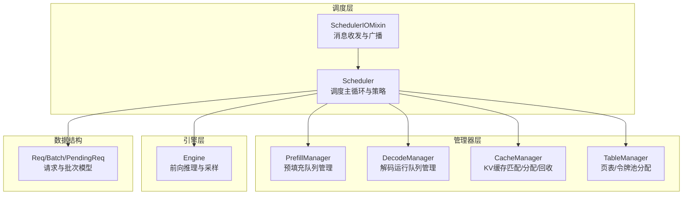
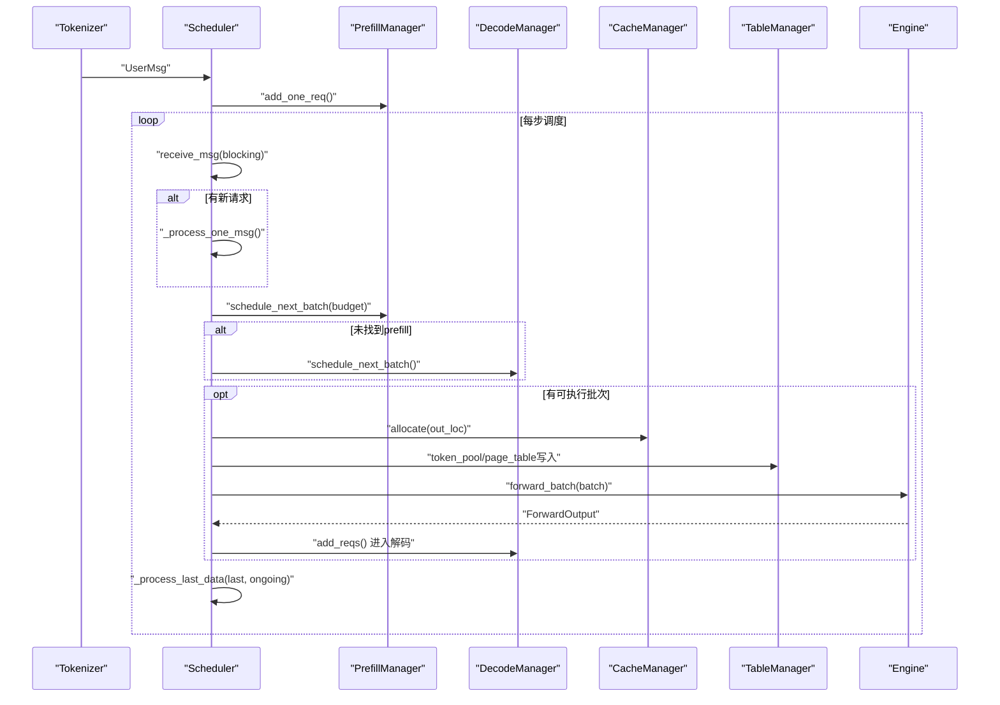
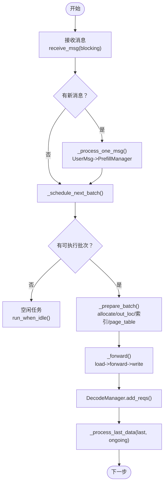
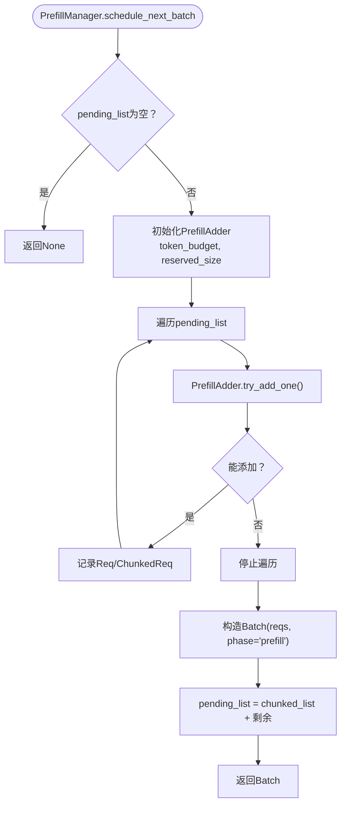
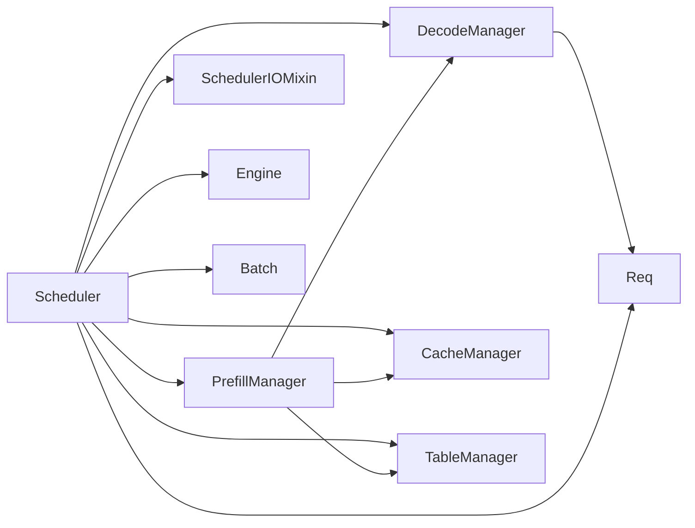

# Scheduler模块详解

<cite>
**本文引用的文件列表**
- [scheduler.py](file://python/minisgl/scheduler/scheduler.py)
- [prefill.py](file://python/minisgl/scheduler/prefill.py)
- [decode.py](file://python/minisgl/scheduler/decode.py)
- [cache.py](file://python/minisgl/scheduler/cache.py)
- [table.py](file://python/minisgl/scheduler/table.py)
- [utils.py](file://python/minisgl/scheduler/utils.py)
- [io.py](file://python/minisgl/scheduler/io.py)
- [config.py](file://python/minisgl/scheduler/config.py)
- [core.py](file://python/minisgl/core.py)
- [test_scheduler.py](file://tests/core/test_scheduler.py)
</cite>

## 目录
1. [简介](#简介)
2. [项目结构](#项目结构)
3. [核心组件](#核心组件)
4. [架构总览](#架构总览)
5. [详细组件分析](#详细组件分析)
6. [依赖关系分析](#依赖关系分析)
7. [性能考量](#性能考量)
8. [故障排查指南](#故障排查指南)
9. [结论](#结论)

## 简介
本文件深入解析Scheduler模块的调度逻辑，重点覆盖以下方面：
- 请求接收与预处理：如何从tokenizer侧接收用户请求并进行合法性检查与参数调整。
- 队列管理：Prefill队列与Decode队列的维护与调度策略。
- 批次构建：如何在预算约束下构建prefill/decode批次，包括分块与迁移。
- 执行策略：normal_loop与overlap_loop两种调度模式，以及Overlap Scheduling如何实现CPU准备与GPU计算的并行化。
- 终止判断与资源回收：完成请求的清理与缓存更新。
- 关键数据结构：Req、Batch、PendingReq等的职责与交互。

## 项目结构
Scheduler模块位于python/minisgl/scheduler目录，围绕调度器主体、预填充管理、解码管理、缓存与页表管理、IO混入、配置与工具等子模块协同工作。

图表来源
- [scheduler.py](file://python/minisgl/scheduler/scheduler.py#L80-L110)
- [prefill.py](file://python/minisgl/scheduler/prefill.py#L114-L154)
- [decode.py](file://python/minisgl/scheduler/decode.py#L9-L31)
- [cache.py](file://python/minisgl/scheduler/cache.py#L12-L72)
- [table.py](file://python/minisgl/scheduler/table.py#L4-L20)
- [io.py](file://python/minisgl/scheduler/io.py#L15-L66)
- [core.py](file://python/minisgl/core.py#L22-L100)

章节来源
- [scheduler.py](file://python/minisgl/scheduler/scheduler.py#L80-L110)
- [prefill.py](file://python/minisgl/scheduler/prefill.py#L114-L154)
- [decode.py](file://python/minisgl/scheduler/decode.py#L9-L31)
- [cache.py](file://python/minisgl/scheduler/cache.py#L12-L72)
- [table.py](file://python/minisgl/scheduler/table.py#L4-L20)
- [io.py](file://python/minisgl/scheduler/io.py#L15-L66)
- [core.py](file://python/minisgl/core.py#L22-L100)

## 核心组件
- Scheduler：调度主控，负责消息接收、批次构建、前向执行、结果处理与资源回收；提供normal_loop与overlap_loop两种调度模式。
- PrefillManager：维护待预填充请求队列，按预算与缓存可用性构建prefill批次，支持分块与迁移。
- DecodeManager：维护正在解码的请求集合，提供inflight估算与调度。
- CacheManager：KV缓存匹配、锁定、页分配与淘汰、完成请求的缓存插入与释放。
- TableManager：为每个请求分配页表槽位与令牌池视图，提供空闲槽位管理。
- SchedulerIOMixin：统一处理与tokenizer的通信（单机/多机广播），屏蔽网络细节。
- 数据结构：Req、Batch、PendingReq承载请求状态与批次信息。

章节来源
- [scheduler.py](file://python/minisgl/scheduler/scheduler.py#L80-L110)
- [prefill.py](file://python/minisgl/scheduler/prefill.py#L114-L154)
- [decode.py](file://python/minisgl/scheduler/decode.py#L9-L31)
- [cache.py](file://python/minisgl/scheduler/cache.py#L12-L72)
- [table.py](file://python/minisgl/scheduler/table.py#L4-L20)
- [io.py](file://python/minisgl/scheduler/io.py#L15-L66)
- [core.py](file://python/minisgl/core.py#L22-L100)

## 架构总览
Scheduler通过SchedulerIOMixin与tokenizer侧建立消息通道，接收UserMsg后进入预填充阶段；随后根据策略选择prefill或decode批次，构建Batch并准备元数据，调用Engine执行前向推理，最后对上一批次的结果进行CPU侧处理（解码、终止判断、资源回收）。

图表来源
- [scheduler.py](file://python/minisgl/scheduler/scheduler.py#L155-L266)
- [prefill.py](file://python/minisgl/scheduler/prefill.py#L124-L154)
- [decode.py](file://python/minisgl/scheduler/decode.py#L23-L31)
- [cache.py](file://python/minisgl/scheduler/cache.py#L39-L53)
- [table.py](file://python/minisgl/scheduler/table.py#L15-L20)

## 详细组件分析

### Scheduler：调度主循环与策略
- 请求接收与预处理
  - 接收消息时，将批量消息展开为逐条处理；对UserMsg进行长度与输出上限校验，必要时调整max_tokens；最终交由PrefillManager加入待处理队列。
- 批次构建
  - 优先尝试prefill：基于预算与inflight估算，调用PrefillManager生成Batch；若无prefill则尝试decode：从DecodeManager获取运行中的请求集合。
  - 构建完成后，调用_prepare_batch：分配out_loc、按需pad、构造2D索引用于token加载/写回、更新page_table、准备注意力元数据与采样参数。
- 前向执行
  - 加载input_ids到batch，调用Engine.forward_batch，写回next_tokens到token_pool，同时将新增请求加入DecodeManager。
- 结果处理与资源回收
  - 对上一批次的输出进行CPU侧处理：解码、终止判断（EOS/长度/超长）、标记完成请求；对已完成但不在当前批次中的请求，释放页表槽位并更新缓存；仅保留仍在运行的完成集。
- 调度模式
  - normal_loop：顺序式，先接收消息与调度，再执行前向，最后处理上一批结果。
  - overlap_loop：重叠式，使用独立CUDA流，将上一批结果处理与当前批次执行并行，通过engine.stream.wait_stream(self.stream)实现跨流同步，隐藏CPU延迟，提升GPU利用率。

图表来源
- [scheduler.py](file://python/minisgl/scheduler/scheduler.py#L155-L266)
- [scheduler.py](file://python/minisgl/scheduler/scheduler.py#L231-L254)

章节来源
- [scheduler.py](file://python/minisgl/scheduler/scheduler.py#L155-L266)
- [scheduler.py](file://python/minisgl/scheduler/scheduler.py#L231-L254)

### PrefillManager：预填充队列与批构建
- 待处理队列
  - add_one_req将UserMsg封装为PendingReq加入队列。
- 批构建策略
  - schedule_next_batch遍历pending_list，使用PrefillAdder尝试为每个请求分配资源；预算考虑来自prefill_budget与DecodeManager.inflight_tokens的估计偏移。
  - PrefillAdder内部：
    - 先尝试缓存匹配与锁定，估算extend_len与输出长度，确保预留空间充足。
    - 分配TableManager槽位，复制输入到token_pool与page_table对应位置。
    - 若剩余输入未全部填充，则创建ChunkedReq并记录到PendingReq，以便后续继续填充。
  - 返回Batch(phase="prefill")，并将剩余未完全填充的请求移动至队列前端，实现“分块续填”的迁移。
- 可运行性
  - runnable属性基于pending_list是否为空。

图表来源
- [prefill.py](file://python/minisgl/scheduler/prefill.py#L124-L154)
- [prefill.py](file://python/minisgl/scheduler/prefill.py#L31-L113)

章节来源
- [prefill.py](file://python/minisgl/scheduler/prefill.py#L124-L154)
- [prefill.py](file://python/minisgl/scheduler/prefill.py#L31-L113)

### DecodeManager：解码队列与inflight估算
- 运行中请求集合
  - add_reqs仅将可解码的请求加入集合；remove_req用于移除完成请求。
- inflight估算
  - inflight_tokens为所有运行中请求剩余长度之和，作为prefill预算的保守估计，避免过度占用导致解码饥饿。
- 调度
  - schedule_next_batch直接将运行中请求转为Batch(phase="decode")，前提是runnable为真。

章节来源
- [decode.py](file://python/minisgl/scheduler/decode.py#L9-L31)

### CacheManager与TableManager：资源分配与回收
- CacheManager
  - 匹配：基于输入前缀查找可复用的缓存句柄，返回缓存长度。
  - 锁定：在分配前锁定句柄，防止并发修改。
  - 分配：若空闲页不足，触发淘汰，合并空闲与被驱逐页，返回所需连续索引。
  - 完成回收：将完成请求的输入与索引插入缓存，释放旧缓存中未被复用的部分，解锁句柄。
  - 完整性检查：校验空闲槽位与缓存总量等于总页数。
- TableManager
  - 为每个请求分配唯一table_idx，提供token_pool视图；释放时归还槽位。

章节来源
- [cache.py](file://python/minisgl/scheduler/cache.py#L12-L72)
- [table.py](file://python/minisgl/scheduler/table.py#L4-L20)

### SchedulerIOMixin：消息收发与多机广播
- 单机模式：通过ZMQ Pull/Push队列与tokenizer通信。
- 多机模式：rank0作为广播源，将消息广播给其他rank；非rank0仅接收广播消息。
- 同步：提供CPU侧进程组屏障，保证多机一致性。

章节来源
- [io.py](file://python/minisgl/scheduler/io.py#L15-L66)
- [io.py](file://python/minisgl/scheduler/io.py#L76-L132)

### 数据结构：Req、Batch、PendingReq
- Req
  - 描述单个请求的状态：host_ids、table_idx、cached_len、device_len、max_device_len、remain_len、extend_len、sampling_params、cache_handle。
  - 提供append_host、complete_one、can_decode等操作。
- Batch
  - 描述一次前向的请求集合，包含phase（prefill/decode）、input_ids、out_loc、padded_reqs、attn_metadata等。
- PendingReq
  - 封装待处理请求：uid、input_ids、sampling_params、chunked_req（用于分块续填）。

章节来源
- [core.py](file://python/minisgl/core.py#L22-L100)
- [utils.py](file://python/minisgl/scheduler/utils.py#L14-L34)

## 依赖关系分析
- Scheduler依赖
  - PrefillManager、DecodeManager、CacheManager、TableManager、Engine、Tokenizer消息通道。
- Manager间耦合
  - PrefillManager依赖CacheManager与TableManager进行资源分配；依赖DecodeManager的inflight估算。
  - DecodeManager依赖Req的can_decode与remain_len。
- 资源耦合
  - CacheManager与TableManager共同决定可用空间与分配策略；Scheduler在_prepare_batch中协调二者输出。
- 并行与同步
  - overlap_loop通过独立CUDA流与engine.stream.wait_stream实现CPU/GPU重叠；IO层在多机场景下通过广播与屏障保证一致性。

图表来源
- [scheduler.py](file://python/minisgl/scheduler/scheduler.py#L80-L110)
- [prefill.py](file://python/minisgl/scheduler/prefill.py#L114-L154)
- [decode.py](file://python/minisgl/scheduler/decode.py#L9-L31)
- [cache.py](file://python/minisgl/scheduler/cache.py#L12-L72)
- [table.py](file://python/minisgl/scheduler/table.py#L4-L20)
- [core.py](file://python/minisgl/core.py#L22-L100)

章节来源
- [scheduler.py](file://python/minisgl/scheduler/scheduler.py#L80-L110)
- [prefill.py](file://python/minisgl/scheduler/prefill.py#L114-L154)
- [decode.py](file://python/minisgl/scheduler/decode.py#L9-L31)
- [cache.py](file://python/minisgl/scheduler/cache.py#L12-L72)
- [table.py](file://python/minisgl/scheduler/table.py#L4-L20)
- [core.py](file://python/minisgl/core.py#L22-L100)

## 性能考量
- 重叠调度（Overlap Scheduling）
  - 使用独立CUDA流与engine.stream.wait_stream实现CPU结果处理与GPU前向执行的并行，显著降低CPU等待时间，提高GPU利用率。
  - 通过ENV.DISABLE_OVERLAP_SCHEDULING可切换到normal_loop。
- 预算与inflight估算
  - Prefill预算与DecodeManager.inflight_tokens共同限制prefill规模，避免解码饥饿。
- 批处理与pad
  - GraphRunner对Batch进行pad，减少kernel启动开销；out_loc按需填充dummy_page。
- 缓存命中与淘汰
  - 通过CacheManager.match_req与insert_prefix提升缓存命中率，减少显存压力；evict策略确保空间满足需求。
- I/O与多机
  - 多机广播与屏障保证全局一致性，避免因rank间消息不同步导致的调度偏差。

章节来源
- [scheduler.py](file://python/minisgl/scheduler/scheduler.py#L231-L254)
- [scheduler.py](file://python/minisgl/scheduler/scheduler.py#L269-L285)
- [prefill.py](file://python/minisgl/scheduler/prefill.py#L124-L154)
- [cache.py](file://python/minisgl/scheduler/cache.py#L39-L63)
- [io.py](file://python/minisgl/scheduler/io.py#L76-L132)

## 故障排查指南
- 输入过长
  - 当输入序列超过最大长度时，Scheduler会丢弃请求并记录警告；请检查配置与输入长度。
- 输出上限调整
  - 当max_tokens超出剩余长度时，Scheduler会自动下调并记录警告；请确认采样参数设置。
- 资源不足
  - CacheManager.available_size与TableManager.available_size不足时，PrefillManager无法继续添加请求；可通过增大缓存类型或容量解决。
- 完整性检查失败
  - CacheManager.check_integrity会在空闲槽位与缓存总量不一致时报错；建议检查释放与插入逻辑。
- 多机同步问题
  - 多机环境下，若广播消息数量不一致或屏障阻塞，请检查rank0广播与其它rank接收流程。

章节来源
- [scheduler.py](file://python/minisgl/scheduler/scheduler.py#L155-L178)
- [scheduler.py](file://python/minisgl/scheduler/scheduler.py#L120-L153)
- [cache.py](file://python/minisgl/scheduler/cache.py#L64-L72)
- [io.py](file://python/minisgl/scheduler/io.py#L88-L132)

## 结论
Scheduler通过清晰的职责划分与严格的资源管理，实现了高效的prefill/decode调度。PrefillManager与DecodeManager分别承担“请求接入”和“持续解码”的角色，配合CacheManager与TableManager的资源分配与回收，形成闭环。Overlap Scheduling通过CUDA流与engine.stream.wait_stream实现CPU/GPU并行，显著提升了吞吐与延迟表现。在实际部署中，应关注预算与inflight估算、缓存命中率与多机同步，以获得稳定且高性能的调度效果。