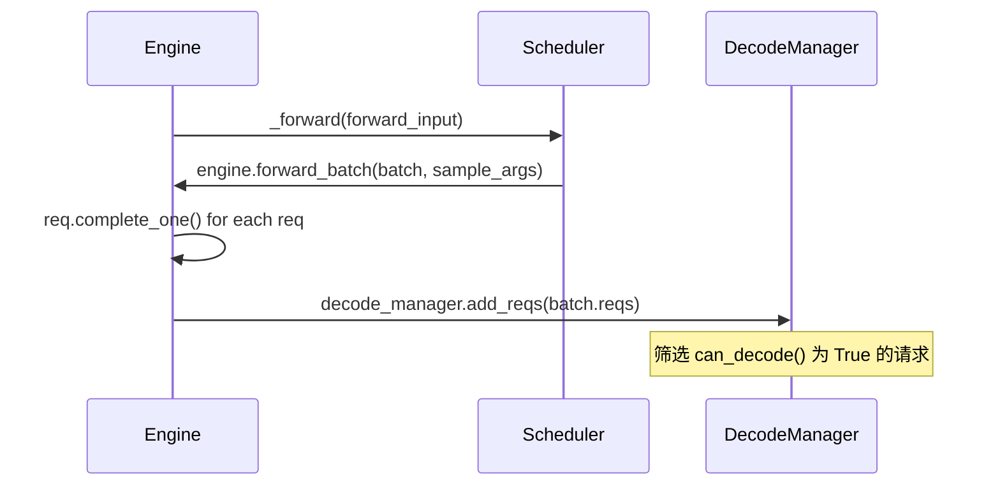
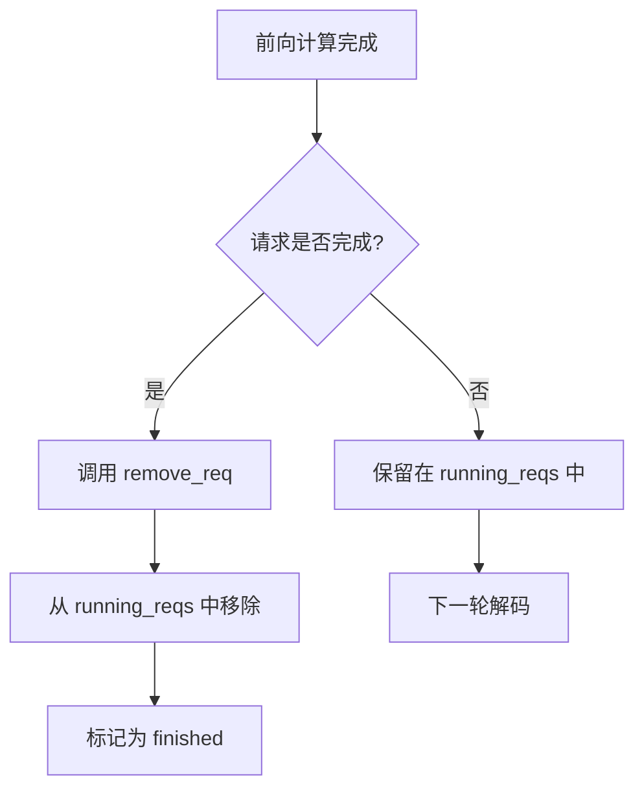
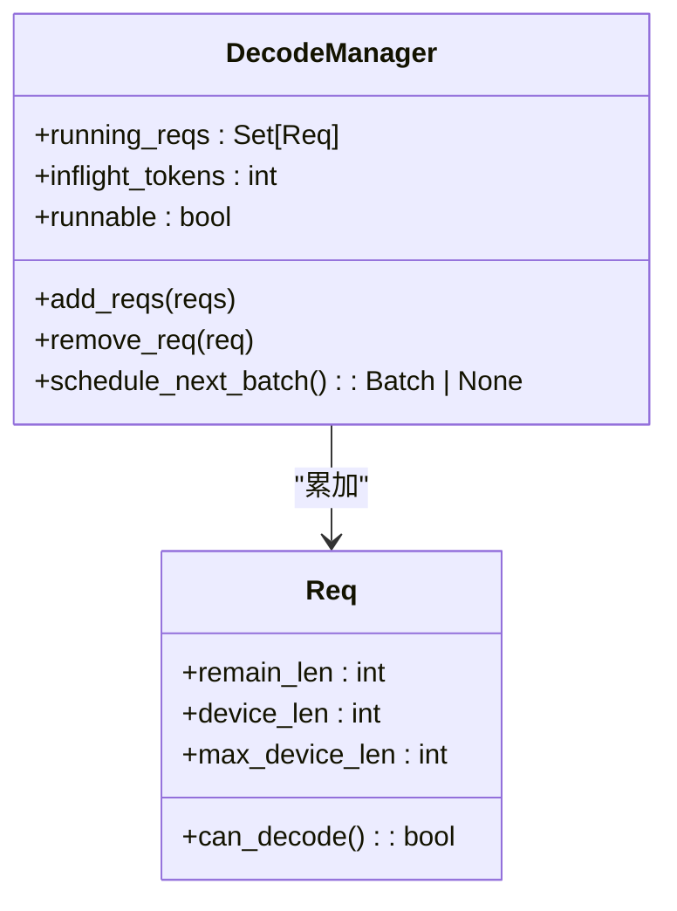
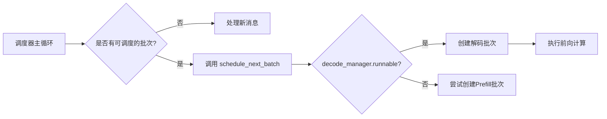
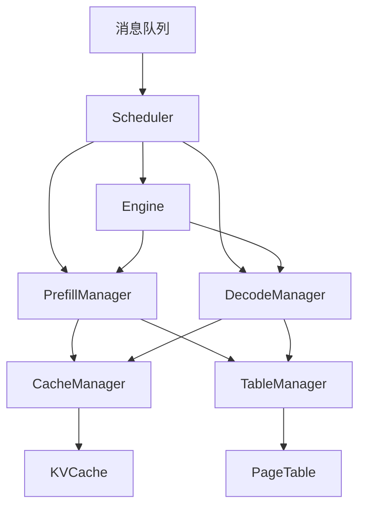

# 解码管理

<cite>
**本文档中引用的文件**  
- [decode.py](file://python/minisgl/scheduler/decode.py)
- [core.py](file://python/minisgl/core.py)
- [scheduler.py](file://python/minisgl/scheduler/scheduler.py)
- [prefill.py](file://python/minisgl/scheduler/prefill.py)
- [engine/engine.py](file://python/minisgl/engine/engine.py)
</cite>

## 目录
1. [引言](#引言)
2. [DecodeManager 核心组件](#decodemanager-核心组件)
3. [请求生命周期与调度流程](#请求生命周期与调度流程)
4. [inflight_tokens 负载估算机制](#inflight_tokens-负载估算机制)
5. [解码批次调度策略](#解码批次调度策略)
6. [与其他组件的协作关系](#与其他组件的协作关系)
7. [总结](#总结)

## 引言
`DecodeManager` 是 `mini-sglang` 推理系统中的核心调度组件之一，负责管理所有正在进行解码阶段的请求。它与 `PrefillManager` 协同工作，实现高效的请求调度与资源管理。本文档将深入分析 `DecodeManager` 的设计与实现，重点阐述其如何跟踪运行中的请求、管理解码批次、估算系统负载，并在整体调度策略中发挥作用。

## DecodeManager 核心组件

`DecodeManager` 类位于 `python/minisgl/scheduler/decode.py` 文件中，其主要职责是维护一个运行中请求的集合，并提供对这些请求的增删查改接口。

该组件的核心数据结构是 `running_reqs`，一个 `Req` 对象的集合（`Set[Req]`），用于存储所有当前处于解码阶段的请求。`Req` 类（定义于 `core.py`）代表一个推理请求，包含输入ID、缓存长度、设备长度、最大设备长度等关键属性。

**Section sources**
- [decode.py](file://python/minisgl/scheduler/decode.py#L1-L31)
- [core.py](file://python/minisgl/core.py#L22-L70)

## 请求生命周期与调度流程

### add_reqs 方法：将可解码请求加入运行队列
`add_reqs` 方法是 `DecodeManager` 与前向计算阶段的接口。在每次前向计算（`forward_batch`）完成后，`Engine` 会调用此方法，将一批请求加入到 `running_reqs` 集合中。



**Diagram sources**
- [engine.py](file://python/minisgl/engine/engine.py#L204-L210)
- [decode.py](file://python/minisgl/scheduler/decode.py#L13-L15)
- [scheduler.py](file://python/minisgl/scheduler/scheduler.py#L223)

**Section sources**
- [decode.py](file://python/minisgl/scheduler/decode.py#L13-L15)
- [core.py](file://python/minisgl/core.py#L62-L64)

该方法的关键逻辑在于 `req.can_decode()` 这个条件判断。`can_decode()` 方法返回 `self.remain_len > 0`，即当请求的剩余生成长度大于0时，该请求才被视为“可解码”。这确保了只有尚未完成的请求才会被加入到解码队列中。例如，一个请求在生成了最后一个token后，其 `remain_len` 变为0，`can_decode()` 返回 `False`，因此不会被重新加入 `running_reqs`。

### remove_req 方法：从队列中移除完成的请求
当一个请求完成其所有生成任务（或因达到最大长度而被终止）时，`remove_req` 方法会被调用，将其从 `running_reqs` 集合中移除。



**Diagram sources**
- [decode.py](file://python/minisgl/scheduler/decode.py#L16-L17)
- [scheduler.py](file://python/minisgl/scheduler/scheduler.py#L138)

**Section sources**
- [decode.py](file://python/minisgl/scheduler/decode.py#L16-L17)
- [scheduler.py](file://python/minisgl/scheduler/scheduler.py#L136-L138)

在 `scheduler.py` 的 `_process_last_data` 方法中，当检测到 `req.remain_len <= 0` 或生成了EOS token时，会将该请求加入 `finished_reqs` 集合，并立即调用 `self.decode_manager.remove_req(req)`。这保证了 `running_reqs` 集合的实时性和准确性，避免了对已完成请求的无效调度。

## inflight_tokens 负载估算机制

`inflight_tokens` 属性是 `DecodeManager` 提供给 `PrefillManager` 的关键资源估算指标。



**Diagram sources**
- [decode.py](file://python/minisgl/scheduler/decode.py#L20-L22)
- [core.py](file://python/minisgl/core.py#L47-L49)

**Section sources**
- [decode.py](file://python/minisgl/scheduler/decode.py#L20-L22)
- [core.py](file://python/minisgl/core.py#L47-L49)

其实现非常直接：`return sum(req.remain_len for req in self.running_reqs)`。它遍历 `running_reqs` 中的每一个请求，累加其 `remain_len`（剩余长度）。

`remain_len` 定义为 `self.max_device_len - self.device_len`，即该请求总共需要生成的token数减去已经生成的token数。因此，`inflight_tokens` 代表了系统在未来解码阶段将要处理的总token数，是对当前解码负载的一个精确估算。

这个估算值对于 `PrefillManager` 至关重要。在 `prefill.py` 的 `PrefillAdder` 初始化过程中，`reserved_size` 参数被设置为 `self.decode_manager.inflight_tokens`。这确保了在为新的Prefill请求分配资源时，会为当前所有正在运行的解码请求预留足够的KV缓存空间，从而避免了资源竞争和调度失败。

## 解码批次调度策略

### schedule_next_batch 方法：创建解码批次
`schedule_next_batch` 方法负责创建下一个解码批次。它检查 `runnable` 属性，如果为 `True`，则创建一个包含所有 `running_reqs` 的 `Batch` 对象，并将其 `phase` 设置为 `"decode"`。



**Diagram sources**
- [decode.py](file://python/minisgl/scheduler/decode.py#L23-L26)
- [scheduler.py](file://python/minisgl/scheduler/scheduler.py#L205-L208)

**Section sources**
- [decode.py](file://python/minisgl/scheduler/decode.py#L23-L26)

### runnable 属性与调度优先级
`runnable` 属性是一个简单的布尔值，定义为 `bool(self.running_reqs)`。当 `running_reqs` 集合非空时，`runnable` 为 `True`，表示有请求等待解码。

在 `scheduler.py` 的 `_schedule_next_batch` 方法中，调度策略体现为：
```python
batch = (
    self.prefill_manager.schedule_next_batch(self.prefill_budget)
    or self.decode_manager.schedule_next_batch()
)
```
这是一个短路求值的逻辑。调度器会优先尝试调度Prefill批次（处理新请求或长请求的分块）。只有当 `prefill_manager` 无法生成有效批次（返回 `None`）时，才会尝试调度解码批次。

这种策略被称为“Prefill优先”（Prefill-first），它确保了新请求能够尽快得到处理，减少了用户等待时间。然而，这也可能导致解码请求的延迟。在高并发场景下，如果大量新请求涌入，解码队列可能会被长时间阻塞。`inflight_tokens` 的存在虽然保证了资源预留，但并未改变这种调度优先级。

## 与其他组件的协作关系

`DecodeManager` 并非孤立工作，而是与系统中的多个组件紧密协作。



**Diagram sources**
- [scheduler.py](file://python/minisgl/scheduler/scheduler.py#L95-L100)
- [prefill.py](file://python/minisgl/scheduler/prefill.py#L114-L118)

**Section sources**
- [scheduler.py](file://python/minisgl/scheduler/scheduler.py#L95-L100)
- [prefill.py](file://python/minisgl/scheduler/prefill.py#L114-L118)

*   **与 PrefillManager 的协作**：`PrefillManager` 在调度时会查询 `DecodeManager` 的 `inflight_tokens` 来进行资源预留，确保系统稳定性。
*   **与 Engine 的协作**：`Engine` 在完成前向计算后，会调用 `DecodeManager` 的 `add_reqs` 方法，将新生成的请求加入解码队列。
*   **与 TableManager 和 CacheManager 的协作**：虽然 `DecodeManager` 不直接管理资源，但它管理的 `Req` 对象持有 `table_idx` 和 `cache_handle`，这些资源在请求被 `remove_req` 移除后，由 `Scheduler` 负责通过 `TableManager` 和 `CacheManager` 进行回收。

## 总结
`DecodeManager` 是 `mini-sglang` 调度系统中负责解码阶段的核心组件。它通过 `running_reqs` 集合精确跟踪所有可解码的请求，并通过 `add_reqs` 和 `remove_req` 方法管理请求的生命周期。其 `inflight_tokens` 属性为Prefill阶段提供了关键的负载估算，保证了资源分配的合理性。尽管当前的调度策略优先处理Prefill请求，但 `DecodeManager` 的设计确保了所有解码请求最终都能得到处理，是实现高效、稳定推理服务的重要一环。